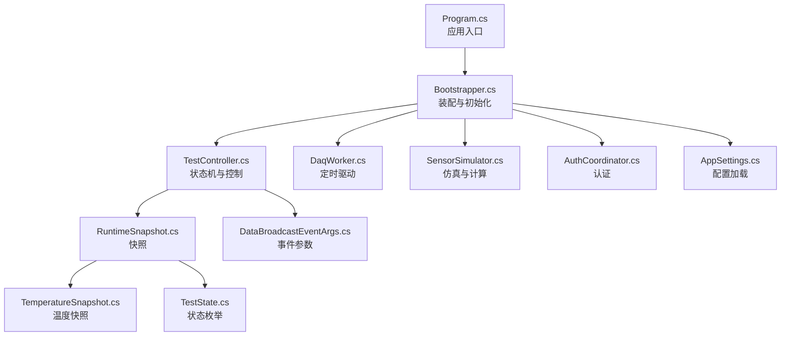
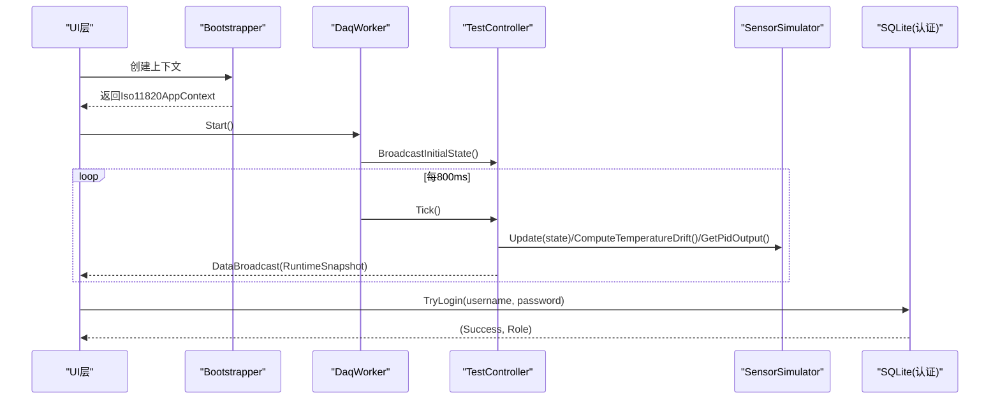
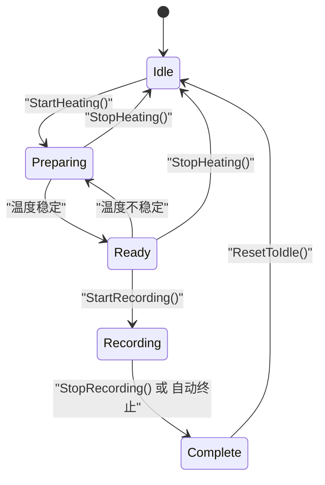
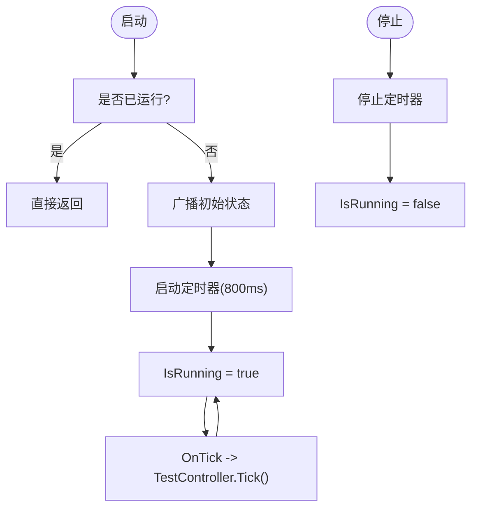
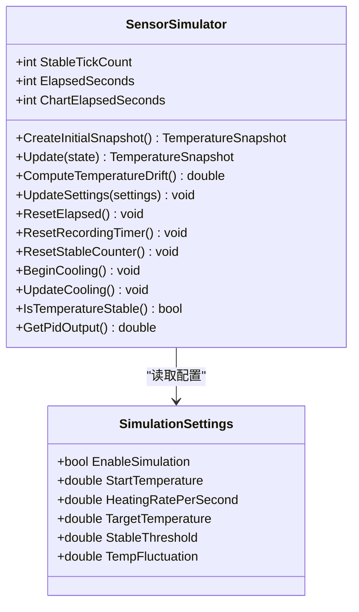
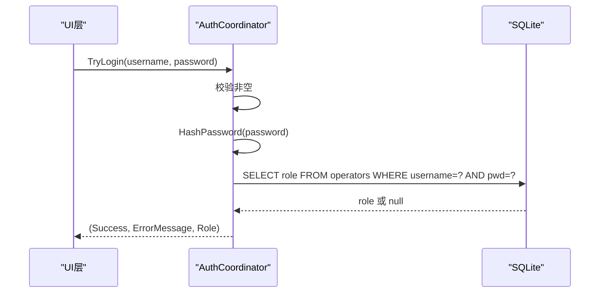
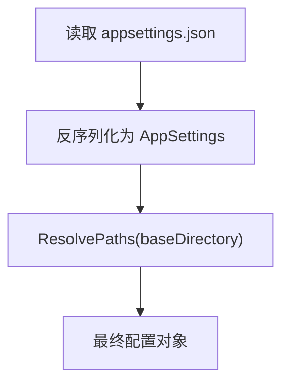
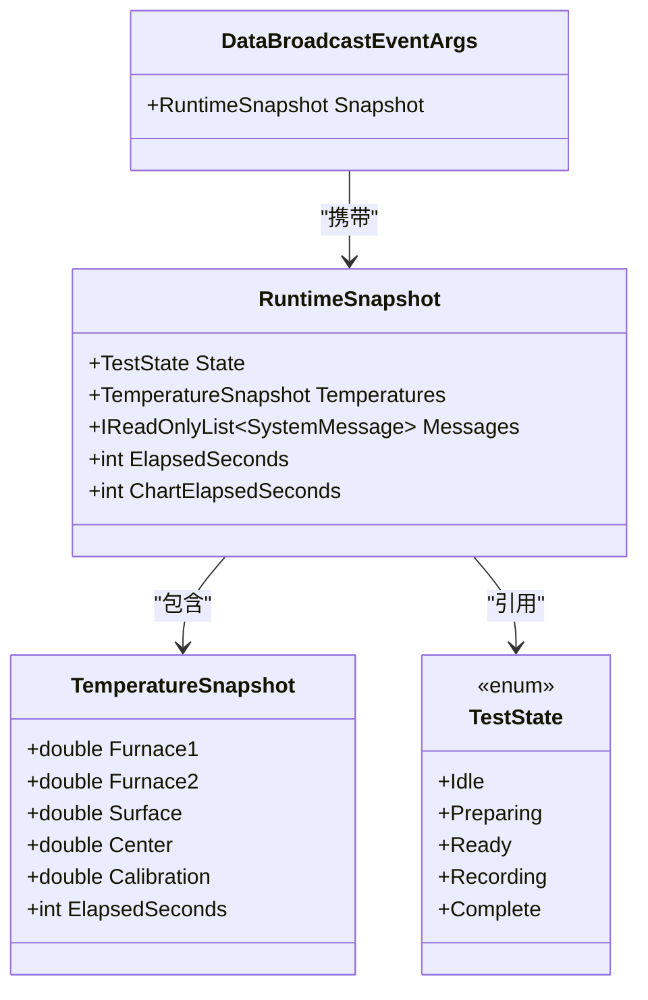
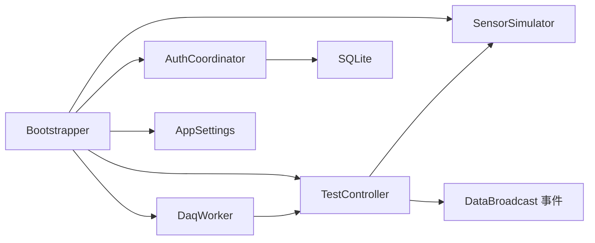

# API参考

<cite>
**本文引用的文件**   
- [Program.cs](file://src/ISO11820.App/Program.cs)
- [Bootstrapper.cs](file://src/ISO11820.App/App/Bootstrapper.cs)
- [TestController.cs](file://src/ISO11820.App/Runtime/Controller/TestController.cs)
- [DaqWorker.cs](file://src/ISO11820.App/Runtime/Services/DaqWorker.cs)
- [SensorSimulator.cs](file://src/ISO11820.App/Runtime/Services/SensorSimulator.cs)
- [AppSettings.cs](file://src/ISO11820.App/Config/AppSettings.cs)
- [appsettings.json](file://src/ISO11820.App/appsettings.json)
- [AuthCoordinator.cs](file://src/ISO11820.App/Features/Auth/AuthCoordinator.cs)
- [RuntimeSnapshot.cs](file://src/ISO11820.App/Shared/Models/RuntimeSnapshot.cs)
- [DataBroadcastEventArgs.cs](file://src/ISO11820.App/Shared/Events/DataBroadcastEventArgs.cs)
- [TemperatureSnapshot.cs](file://src/ISO11820.Core/Models/TemperatureSnapshot.cs)
- [TestState.cs](file://src/ISO11820.Core/Enums/TestState.cs)
- [IRuntimeClock.cs](file://src/ISO11820.Core/Contracts/IRuntimeClock.cs)
- [Apparatus.cs](file://src/ISO11820.App/Infrastructure/Persistence/Models/Apparatus.cs)
- [TestMaster.cs](file://src/ISO11820.App/Infrastructure/Persistence/Models/TestMaster.cs)
</cite>

## 目录
1. [简介](#简介)
2. [项目结构](#项目结构)
3. [核心组件](#核心组件)
4. [架构总览](#架构总览)
5. [详细组件分析](#详细组件分析)
6. [依赖关系分析](#依赖关系分析)
7. [性能考虑](#性能考虑)
8. [故障排查指南](#故障排查指南)
9. [结论](#结论)
10. [附录](#附录)

## 简介
本API参考文档面向ISO 11820系统的内部进程内API与事件总线，覆盖以下方面：
- 进程内控制面（TestController）：试验状态机、升温/记录控制、数据广播。
- 实时驱动（DaqWorker + SensorSimulator）：定时Tick驱动仿真与数据采集。
- 认证能力（AuthCoordinator）：基于SQLite的用户名/密码校验。
- 配置系统（AppSettings + appsettings.json）：数据库、仿真、输出路径等运行时参数。
- 数据模型（RuntimeSnapshot、TemperatureSnapshot、TestState）：状态快照与温度采样结构。

说明：
- 当前仓库未实现HTTP REST API、WebSocket或Socket通信层；所有对外交互以进程内方法调用和事件为主。
- 若需扩展为REST/WebSocket/Socket，可参考“扩展建议”章节进行分层设计。

## 项目结构
- 应用入口与启动引导
  - Program.cs：WinForms应用入口，创建引导器并运行主窗体。
  - Bootstrapper.cs：集中装配服务、初始化日志、数据库、导出服务、控制器与工作线程。
- 运行时核心
  - TestController.cs：试验状态机与用户操作入口，维护当前快照与消息队列。
  - DaqWorker.cs：定时器驱动，周期性触发TestController.Tick。
  - SensorSimulator.cs：温度仿真、稳定判定、温漂计算、PID输出模拟。
- 共享模型与事件
  - RuntimeSnapshot.cs：包含状态、温度快照、消息、计时信息。
  - DataBroadcastEventArgs.cs：事件承载的快照对象。
  - TemperatureSnapshot.cs：多通道温度与累计时间。
  - TestState.cs：试验状态枚举。
- 认证与配置
  - AuthCoordinator.cs：登录验证（SHA256哈希比对）。
  - AppSettings.cs + appsettings.json：配置加载与路径解析。
- 持久化模型
  - Apparatus.cs、TestMaster.cs：设备与试验主表实体。

图表来源
- [Program.cs:1-25](file://src/ISO11820.App/Program.cs#L1-L25)
- [Bootstrapper.cs:1-66](file://src/ISO11820.App/App/Bootstrapper.cs#L1-L66)
- [TestController.cs:1-328](file://src/ISO11820.App/Runtime/Controller/TestController.cs#L1-L328)
- [DaqWorker.cs:1-50](file://src/ISO11820.App/Runtime/Services/DaqWorker.cs#L1-L50)
- [SensorSimulator.cs:1-223](file://src/ISO11820.App/Runtime/Services/SensorSimulator.cs#L1-L223)
- [AppSettings.cs:1-160](file://src/ISO11820.App/Config/AppSettings.cs#L1-L160)
- [RuntimeSnapshot.cs:1-12](file://src/ISO11820.App/Shared/Models/RuntimeSnapshot.cs#L1-L12)
- [DataBroadcastEventArgs.cs:1-14](file://src/ISO11820.App/Shared/Events/DataBroadcastEventArgs.cs#L1-L14)
- [TemperatureSnapshot.cs:1-10](file://src/ISO11820.Core/Models/TemperatureSnapshot.cs#L1-L10)
- [TestState.cs:1-11](file://src/ISO11820.Core/Enums/TestState.cs#L1-L11)

章节来源
- [Program.cs:1-25](file://src/ISO11820.App/Program.cs#L1-L25)
- [Bootstrapper.cs:1-66](file://src/ISO11820.App/App/Bootstrapper.cs#L1-L66)

## 核心组件
- TestController
  - 职责：管理试验状态机、处理用户动作（开始加热/停止加热、开始记录/停止记录、完成测试、复位）、维护消息队列与数据缓冲、广播快照。
  - 关键属性与方法：
    - 状态与快照：CurrentState、CurrentSnapshot、ConstantPower、SensorDataBuffer。
    - 用户动作：StartHeating、StopHeating、StartRecording、StopRecording、CompleteTest、ResetToIdle。
    - 仿真设置：UpdateSimulationSettings。
    - 查询接口：GetTemperatureDrift。
    - 事件：DataBroadcast（携带RuntimeSnapshot）。
- DaqWorker
  - 职责：每800ms触发一次TestController.Tick；提供Start/Stop生命周期控制。
- SensorSimulator
  - 职责：根据TestState推进温度仿真、稳定判定、温漂线性回归、PID输出模拟、冷却与记录阶段行为。
- AuthCoordinator
  - 职责：用户名+密码校验，返回角色；使用SHA256对密码进行哈希后与SQLite中存储值比较。
- AppSettings
  - 职责：从appsettings.json加载配置，解析绝对路径，提供默认值。

章节来源
- [TestController.cs:1-328](file://src/ISO11820.App/Runtime/Controller/TestController.cs#L1-L328)
- [DaqWorker.cs:1-50](file://src/ISO11820.App/Runtime/Services/DaqWorker.cs#L1-L50)
- [SensorSimulator.cs:1-223](file://src/ISO11820.App/Runtime/Services/SensorSimulator.cs#L1-L223)
- [AuthCoordinator.cs:1-62](file://src/ISO11820.App/Features/Auth/AuthCoordinator.cs#L1-L62)
- [AppSettings.cs:1-160](file://src/ISO11820.App/Config/AppSettings.cs#L1-L160)

## 架构总览
整体采用“UI -> 协调器 -> 控制器 -> 仿真/工作线程”的进程内分层：
- UI通过Bootstrapper获取Iso11820AppContext，进而访问TestController与相关服务。
- DaqWorker在后台定时器驱动TestController.Tick，更新仿真与快照。
- TestController通过事件向UI或其他订阅者推送最新状态。

图表来源
- [Program.cs:1-25](file://src/ISO11820.App/Program.cs#L1-L25)
- [Bootstrapper.cs:1-66](file://src/ISO11820.App/App/Bootstrapper.cs#L1-L66)
- [DaqWorker.cs:1-50](file://src/ISO11820.App/Runtime/Services/DaqWorker.cs#L1-L50)
- [TestController.cs:1-328](file://src/ISO11820.App/Runtime/Controller/TestController.cs#L1-L328)
- [SensorSimulator.cs:1-223](file://src/ISO11820.App/Runtime/Services/SensorSimulator.cs#L1-L223)
- [AuthCoordinator.cs:1-62](file://src/ISO11820.App/Features/Auth/AuthCoordinator.cs#L1-L62)

## 详细组件分析

### TestController（状态机与控制）
- 状态定义
  - Idle、Preparing、Ready、Recording、Complete。
- 状态转换规则
  - Idle -> Preparing：StartHeating。
  - Preparing -> Ready：温度稳定阈值满足。
  - Ready -> Preparing：温度波动超出稳定范围。
  - Ready -> Recording：StartRecording。
  - Recording -> Complete：手动StopRecording或自动终止条件满足。
  - 任意状态 -> Idle：StopHeating或ResetToIdle。
- 自动终止策略
  - 60分钟无条件结束。
  - 30/35/40/45/50/55分钟检查点：当10分钟温漂≤0.5°C时提前结束。
- 数据与消息
  - 每Tick累积传感器数据到缓冲区。
  - 将系统消息加入待发送队列，随快照广播。
- 并发与锁
  - 使用互斥锁保护状态变更与数据缓冲。
- 事件
  - DataBroadcast：每次状态或快照变化时触发，携带RuntimeSnapshot。

图表来源
- [TestController.cs:1-328](file://src/ISO11820.App/Runtime/Controller/TestController.cs#L1-L328)
- [TestState.cs:1-11](file://src/ISO11820.Core/Enums/TestState.cs#L1-L11)

章节来源
- [TestController.cs:1-328](file://src/ISO11820.App/Runtime/Controller/TestController.cs#L1-L328)

### DaqWorker（定时驱动）
- 职责
  - 每800ms触发TestController.Tick。
  - 提供Start/Stop控制，初始广播一次状态。
- 关键点
  - AutoReset=true保证周期执行。
  - IsRunning用于防止重复启动。

图表来源
- [DaqWorker.cs:1-50](file://src/ISO11820.App/Runtime/Services/DaqWorker.cs#L1-L50)
- [TestController.cs:1-328](file://src/ISO11820.App/Runtime/Controller/TestController.cs#L1-L328)

章节来源
- [DaqWorker.cs:1-50](file://src/ISO11820.App/Runtime/Services/DaqWorker.cs#L1-L50)

### SensorSimulator（仿真与计算）
- 功能要点
  - 不同状态下推进温度：Preparing（线性升温）、Ready（钳位目标温度+噪声）、Recording（表面/中心指数逼近炉温）、Complete（维持稳定）。
  - 稳定判定：连续多个Tick处于目标温度±阈值范围内。
  - 温漂计算：最近N个Furnace1样本做线性回归，得到斜率（°C/s）。
  - PID输出模拟：返回恒定基线加噪声。
  - 冷却：Idle且未加热时缓慢降温至环境温度附近。
- 重要属性
  - ElapsedSeconds、ChartElapsedSeconds、StableTickCount。
- 配置
  - SimulationSettings：起始温度、升温速率、目标温度、稳定阈值、温度波动幅度。

图表来源
- [SensorSimulator.cs:1-223](file://src/ISO11820.App/Runtime/Services/SensorSimulator.cs#L1-L223)
- [AppSettings.cs:57-70](file://src/ISO11820.App/Config/AppSettings.cs#L57-L70)

章节来源
- [SensorSimulator.cs:1-223](file://src/ISO11820.App/Runtime/Services/SensorSimulator.cs#L1-L223)
- [AppSettings.cs:57-70](file://src/ISO11820.App/Config/AppSettings.cs#L57-L70)

### AuthCoordinator（认证）
- 输入
  - username：字符串。
  - password：明文密码。
- 输出
  - 三元组：(Success: bool, ErrorMessage: string?, Role: string?)。
- 安全
  - 使用SHA256对密码进行哈希后与数据库中存储值比较。
- 错误处理
  - 空用户名/密码返回相应错误消息。
  - 匹配失败返回“密码错误”。

图表来源
- [AuthCoordinator.cs:1-62](file://src/ISO11820.App/Features/Auth/AuthCoordinator.cs#L1-L62)

章节来源
- [AuthCoordinator.cs:1-62](file://src/ISO11820.App/Features/Auth/AuthCoordinator.cs#L1-L62)

### 配置系统（AppSettings + appsettings.json）
- 加载流程
  - 从程序集基目录读取appsettings.json。
  - 反序列化为AppSettings，缺失字段使用默认值。
  - ResolvePaths将相对路径解析为绝对路径。
- 主要配置项
  - Database.SqlitePath：SQLite数据库文件路径。
  - Simulation.*：仿真参数（起始温度、升温速率、目标温度、稳定阈值、波动幅度）。
  - Output.BaseDirectory：输出根目录。
  - FileStorage.*：测试数据与样本目录。
  - Report.*：报告输出目录与PDF开关。
  - Hardware.*：硬件常量（如恒功率、PID温度）。

图表来源
- [AppSettings.cs:125-160](file://src/ISO11820.App/Config/AppSettings.cs#L125-L160)
- [appsettings.json:1-29](file://src/ISO11820.App/appsettings.json#L1-L29)

章节来源
- [AppSettings.cs:1-160](file://src/ISO11820.App/Config/AppSettings.cs#L1-L160)
- [appsettings.json:1-29](file://src/ISO11820.App/appsettings.json#L1-L29)

### 数据模型与事件
- RuntimeSnapshot
  - 包含：TestState、TemperatureSnapshot、SystemMessage[]、ElapsedSeconds、ChartElapsedSeconds。
- TemperatureSnapshot
  - 包含：Furnace1、Furnace2、Surface、Center、Calibration、ElapsedSeconds。
- DataBroadcastEventArgs
  - 事件参数，仅承载RuntimeSnapshot。
- TestState
  - 枚举：Idle、Preparing、Ready、Recording、Complete。

图表来源
- [RuntimeSnapshot.cs:1-12](file://src/ISO11820.App/Shared/Models/RuntimeSnapshot.cs#L1-L12)
- [TemperatureSnapshot.cs:1-10](file://src/ISO11820.Core/Models/TemperatureSnapshot.cs#L1-L10)
- [DataBroadcastEventArgs.cs:1-14](file://src/ISO11820.App/Shared/Events/DataBroadcastEventArgs.cs#L1-L14)
- [TestState.cs:1-11](file://src/ISO11820.Core/Enums/TestState.cs#L1-L11)

章节来源
- [RuntimeSnapshot.cs:1-12](file://src/ISO11820.App/Shared/Models/RuntimeSnapshot.cs#L1-L12)
- [TemperatureSnapshot.cs:1-10](file://src/ISO11820.Core/Models/TemperatureSnapshot.cs#L1-L10)
- [DataBroadcastEventArgs.cs:1-14](file://src/ISO11820.App/Shared/Events/DataBroadcastEventArgs.cs#L1-L14)
- [TestState.cs:1-11](file://src/ISO11820.Core/Enums/TestState.cs#L1-L11)

### 持久化模型（示例）
- Apparatus
  - 字段：Id、Name、Model、SerialNumber、CreatedAt。
- TestMaster
  - 字段：ProductId、TestId、TestDate、Operator、SampleName、Specification、HeightMm、DiameterMm、PreWeight、PostWeight、LostWeightPer、DeltaTf、TotalTestTime、FlameTime、FlameDuration、HasFlame、EnvTemp、EnvHumidity、Notes、Flag、CreatedAt。

章节来源
- [Apparatus.cs:1-14](file://src/ISO11820.App/Infrastructure/Persistence/Models/Apparatus.cs#L1-L14)
- [TestMaster.cs:1-47](file://src/ISO11820.App/Infrastructure/Persistence/Models/TestMaster.cs#L1-L47)

## 依赖关系分析
- 组件耦合
  - Bootstrapper集中装配各组件，降低UI与具体实现的耦合。
  - TestController依赖SensorSimulator与配置，通过事件解耦UI。
  - DaqWorker仅依赖TestController，职责单一。
- 外部依赖
  - SQLite用于认证与持久化。
  - MathNet.Numerics用于线性回归（温漂计算）。
  - Serilog用于日志。
  - EPPlus用于Excel导出（由Bootstrapper设置许可证上下文）。

图表来源
- [Bootstrapper.cs:1-66](file://src/ISO11820.App/App/Bootstrapper.cs#L1-L66)
- [TestController.cs:1-328](file://src/ISO11820.App/Runtime/Controller/TestController.cs#L1-L328)
- [DaqWorker.cs:1-50](file://src/ISO11820.App/Runtime/Services/DaqWorker.cs#L1-L50)
- [SensorSimulator.cs:1-223](file://src/ISO11820.App/Runtime/Services/SensorSimulator.cs#L1-L223)
- [AuthCoordinator.cs:1-62](file://src/ISO11820.App/Features/Auth/AuthCoordinator.cs#L1-L62)
- [AppSettings.cs:1-160](file://src/ISO11820.App/Config/AppSettings.cs#L1-L160)

章节来源
- [Bootstrapper.cs:1-66](file://src/ISO11820.App/App/Bootstrapper.cs#L1-L66)

## 性能考虑
- 定时频率
  - 800ms Tick平衡了实时性与CPU占用；如需更高精度可调整但需注意CPU与UI刷新开销。
- 数据缓冲
  - SensorDataBuffer按Tick追加，避免频繁GC；注意限制最大长度以防内存增长。
- 温漂计算
  - 使用固定窗口（MaxDriftSamples=20）的滑动窗口线性回归，复杂度O(N)，N较小，开销可控。
- 锁粒度
  - 关键临界区使用lock保护，避免竞态；尽量缩小锁范围以减少阻塞。
- 配置解析
  - ResolvePaths仅在启动时执行，避免运行时重复计算。

[本节为通用指导，不直接分析具体文件]

## 故障排查指南
- 认证失败
  - 现象：TryLogin返回失败与错误消息。
  - 排查：确认用户名存在、密码哈希一致；检查SQLite连接与表结构。
- 状态无法进入Ready
  - 现象：Preparing长时间不转Ready。
  - 排查：检查稳定阈值与温度波动；查看IsTemperatureStable逻辑与仿真参数。
- 自动终止未触发
  - 现象：Recording未按预期在检查点结束。
  - 排查：核对ElapsedSeconds与检查点窗口；确认ComputeTemperatureDrift返回值是否符合预期。
- 数据未广播
  - 现象：UI未收到DataBroadcast。
  - 排查：确认事件订阅是否正确；检查Broadcast调用路径与锁竞争。

章节来源
- [AuthCoordinator.cs:1-62](file://src/ISO11820.App/Features/Auth/AuthCoordinator.cs#L1-L62)
- [TestController.cs:1-328](file://src/ISO11820.App/Runtime/Controller/TestController.cs#L1-L328)
- [SensorSimulator.cs:1-223](file://src/ISO11820.App/Runtime/Services/SensorSimulator.cs#L1-L223)

## 结论
本系统以进程内API与事件为核心，提供了完整的试验状态机、仿真与数据广播能力。认证与配置模块完善，便于快速集成与扩展。若需要跨进程或网络访问，可在现有控制器之上增加REST/WebSocket/Socket适配层，保持业务逻辑不变。

[本节为总结性内容，不直接分析具体文件]

## 附录

### 进程内API清单（摘要）
- TestController
  - 状态与快照：CurrentState、CurrentSnapshot、ConstantPower、SensorDataBuffer。
  - 控制方法：StartHeating、StopHeating、StartRecording、StopRecording、CompleteTest、ResetToIdle。
  - 配置更新：UpdateSimulationSettings。
  - 查询：GetTemperatureDrift。
  - 事件：DataBroadcast（RuntimeSnapshot）。
- DaqWorker
  - 生命周期：Start、Stop、Dispose。
  - 状态：IsRunning。
- SensorSimulator
  - 仿真：Update、CreateInitialSnapshot、UpdateCooling。
  - 计算：ComputeTemperatureDrift、GetPidOutput、IsTemperatureStable。
  - 重置：ResetElapsed、ResetRecordingTimer、ResetStableCounter、BeginCooling。
  - 配置：UpdateSettings。
- AuthCoordinator
  - 认证：TryLogin(username, password) -> (Success, ErrorMessage, Role)。
- AppSettings
  - 加载：LoadDefault() -> AppSettings。
  - 路径解析：ResolvePaths(baseDirectory)。

章节来源
- [TestController.cs:1-328](file://src/ISO11820.App/Runtime/Controller/TestController.cs#L1-L328)
- [DaqWorker.cs:1-50](file://src/ISO11820.App/Runtime/Services/DaqWorker.cs#L1-L50)
- [SensorSimulator.cs:1-223](file://src/ISO11820.App/Runtime/Services/SensorSimulator.cs#L1-L223)
- [AuthCoordinator.cs:1-62](file://src/ISO11820.App/Features/Auth/AuthCoordinator.cs#L1-L62)
- [AppSettings.cs:1-160](file://src/ISO11820.App/Config/AppSettings.cs#L1-L160)

### 协议与扩展建议（概念性）
- RESTful API（建议）
  - 认证：POST /api/auth/login，请求{username,password}，响应{success,role,message}。
  - 控制：POST /api/test/start-heating、/api/test/stop-heating、/api/test/start-recording、/api/test/stop-recording、/api/test/reset。
  - 查询：GET /api/test/state、GET /api/test/snapshot、GET /api/test/drift。
  - 版本：URL前缀带版本，如/api/v1/...。
  - 速率限制：对控制接口限流（如每秒最多1次），防抖与幂等设计。
- WebSocket API（建议）
  - 连接：ws://host/ws/v1/test。
  - 消息格式：JSON，包含type、payload、timestamp。
  - 事件类型：state_change、snapshot、message、error。
  - 重连与心跳：客户端定期ping/pong，断线重连指数退避。
- Socket API（建议）
  - 帧头：Magic + Version + Length + Type + Payload。
  - 二进制格式：定长头部+变长负载；大对象分片传输。
  - 状态管理：握手、鉴权、心跳、异常恢复。
- IPC/管道（建议）
  - 命名管道或gRPC，适合本地多进程协作。
  - 消息传递：序列化协议（Protobuf/JSON），超时与重试策略。
- 安全考虑
  - 认证：JWT或会话令牌；HTTPS/WSS；最小权限原则。
  - 输入校验：白名单与边界检查；防注入与越权。
- 调试与监控
  - 结构化日志（Serilog）；指标上报（CPU、内存、Tick延迟）。
  - 快照与消息落盘；回放与审计。
- 弃用与迁移
  - 保留旧版API兼容期；通过路由或Header选择版本。
  - 发布迁移指南与兼容性矩阵。

[本节为概念性内容，不直接分析具体文件]