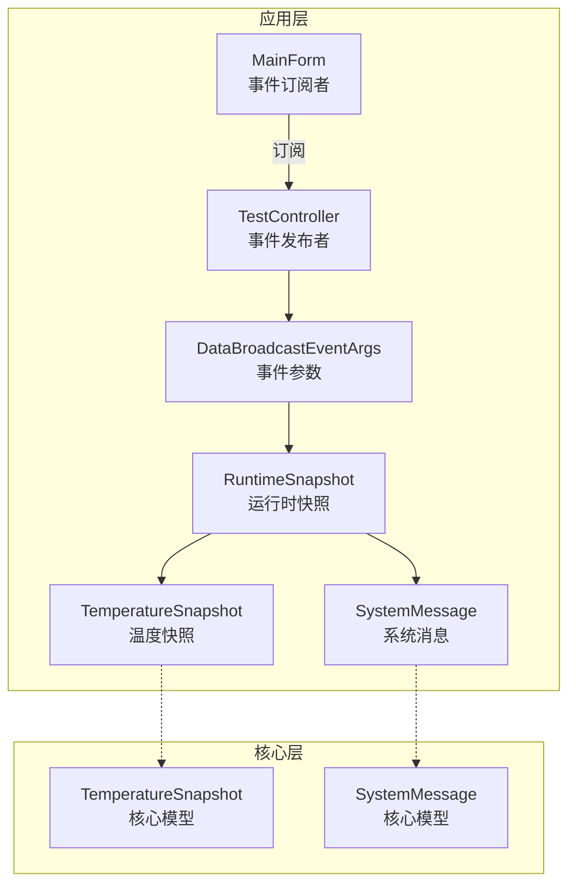
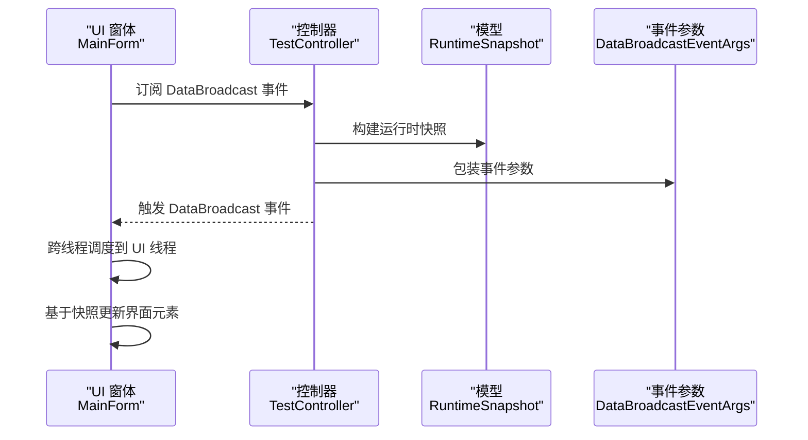
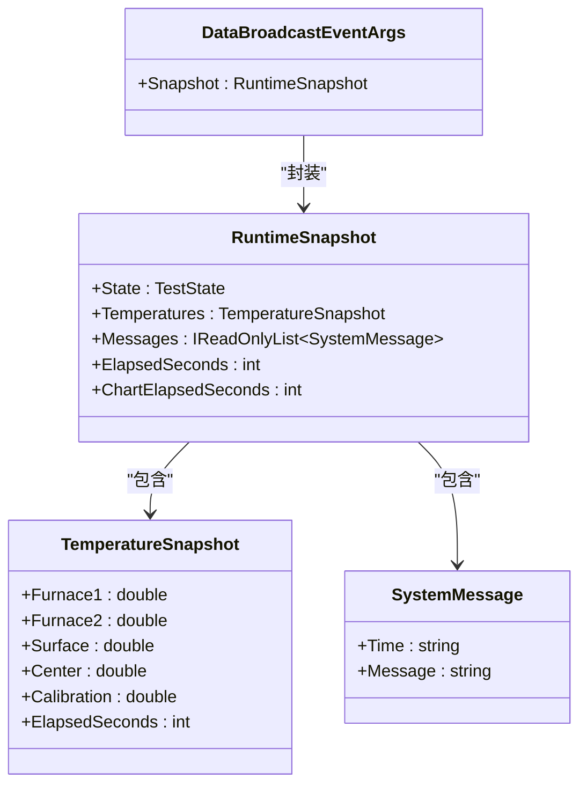
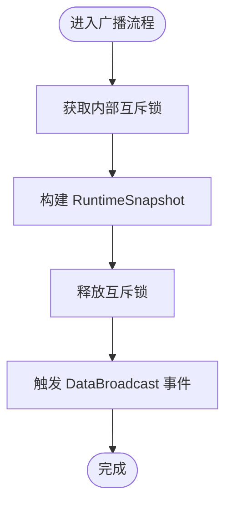
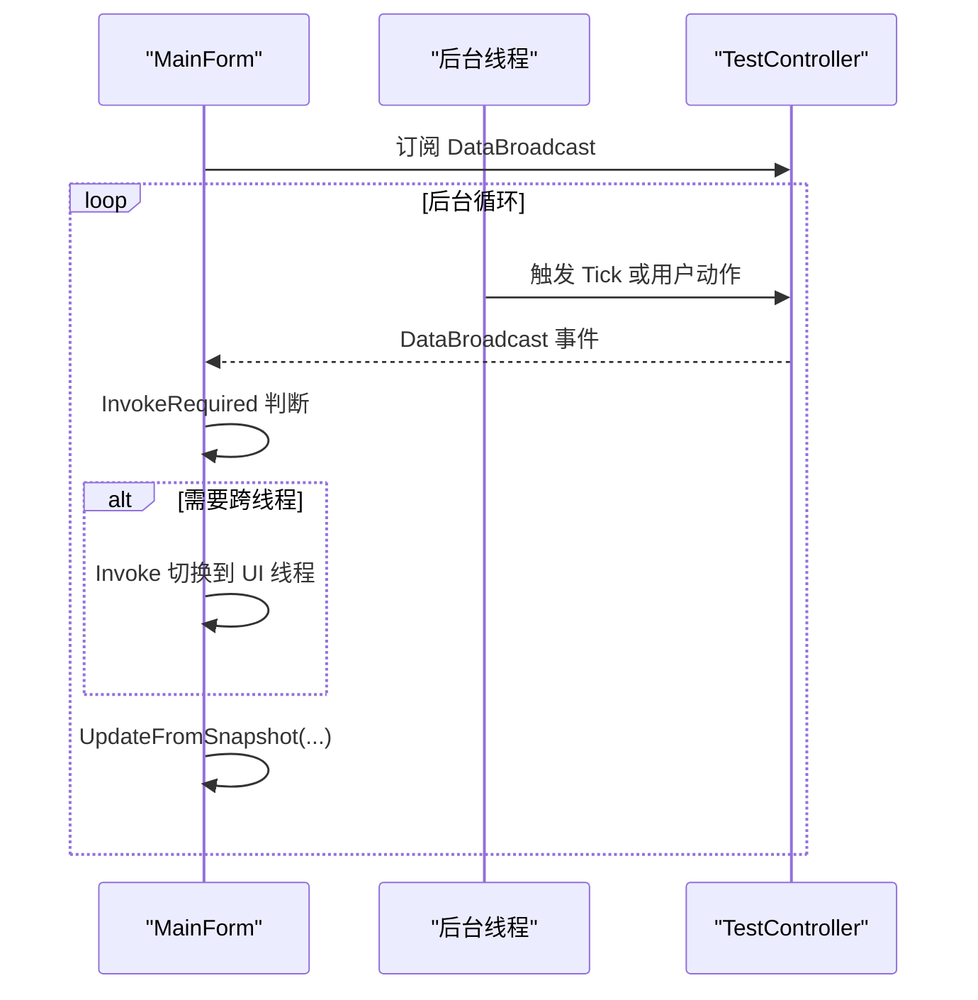
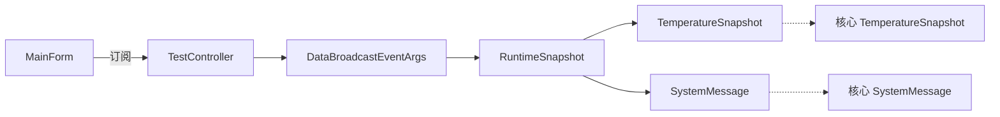

# 事件接口

<cite>
**本文引用的文件**
- [DataBroadcastEventArgs.cs](file://src/ISO11820.App/Shared/Events/DataBroadcastEventArgs.cs)
- [RuntimeSnapshot.cs](file://src/ISO11820.App/Shared/Models/RuntimeSnapshot.cs)
- [TestController.cs](file://src/ISO11820.App/Runtime/Controller/TestController.cs)
- [MainForm.cs](file://src/ISO11820.App/UI/Forms/MainForm.cs)
- [TemperatureSnapshot.cs](file://src/ISO11820.Core/Models/TemperatureSnapshot.cs)
- [SystemMessage.cs](file://src/ISO11820.Core/Models/SystemMessage.cs)
- [TestControllerTests.cs](file://tests/ISO11820.Tests/Runtime/TestControllerTests.cs)
</cite>

## 目录
1. [简介](#简介)
2. [项目结构](#项目结构)
3. [核心组件](#核心组件)
4. [架构总览](#架构总览)
5. [详细组件分析](#详细组件分析)
6. [依赖关系分析](#依赖关系分析)
7. [性能考量](#性能考量)
8. [故障排查指南](#故障排查指南)
9. [结论](#结论)
10. [附录](#附录)

## 简介
本文件为 ISO 11820 系统的事件接口提供完整的 API 文档与实现解析，重点涵盖：
- 事件定义与事件参数类型
- 事件订阅与发布模式
- DataBroadcastEventArgs 等事件参数的结构与用途
- 事件驱动架构的实现方式、线程安全与性能优化
- 事件发布与订阅的完整示例路径
- 错误处理、重试与监控方法
- 事件流时序图与典型使用场景

## 项目结构
事件接口位于应用层共享模块中，围绕运行时快照进行广播，UI 层通过事件订阅实现跨线程安全更新。

**图表来源**
- [TestController.cs:30](file://src/ISO11820.App/Runtime/Controller/TestController.cs#L30)
- [DataBroadcastEventArgs.cs:5-13](file://src/ISO11820.App/Shared/Events/DataBroadcastEventArgs.cs#L5-L13)
- [RuntimeSnapshot.cs:6-11](file://src/ISO11820.App/Shared/Models/RuntimeSnapshot.cs#L6-L11)
- [TemperatureSnapshot.cs:3-9](file://src/ISO11820.Core/Models/TemperatureSnapshot.cs#L3-L9)
- [SystemMessage.cs:3](file://src/ISO11820.Core/Models/SystemMessage.cs#L3)
- [MainForm.cs:518-546](file://src/ISO11820.App/UI/Forms/MainForm.cs#L518-L546)

**章节来源**
- [TestController.cs:11-328](file://src/ISO11820.App/Runtime/Controller/TestController.cs#L11-L328)
- [MainForm.cs:22-699](file://src/ISO11820.App/UI/Forms/MainForm.cs#L22-L699)
- [DataBroadcastEventArgs.cs:1-14](file://src/ISO11820.App/Shared/Events/DataBroadcastEventArgs.cs#L1-L14)
- [RuntimeSnapshot.cs:1-12](file://src/ISO11820.App/Shared/Models/RuntimeSnapshot.cs#L1-L12)
- [TemperatureSnapshot.cs:1-10](file://src/ISO11820.Core/Models/TemperatureSnapshot.cs#L1-L10)
- [SystemMessage.cs:1-3](file://src/ISO11820.Core/Models/SystemMessage.cs#L1-L3)

## 核心组件
- 事件定义与发布者
  - TestController 定义并发布 DataBroadcast 事件，作为系统运行时状态的唯一广播源。
  - 发布时机：用户动作、定时 Tick、初始化阶段均会触发广播。
- 事件参数类型
  - DataBroadcastEventArgs：封装 RuntimeSnapshot，作为事件数据载体。
  - RuntimeSnapshot：包含当前测试状态、温度快照、系统消息集合、计时信息等。
  - TemperatureSnapshot：核心温度通道值与计时字段。
  - SystemMessage：系统消息的时间戳与文本内容。
- 事件订阅者
  - MainForm 订阅 DataBroadcast 事件，在 UI 线程安全地更新界面状态、图表与消息列表。

**章节来源**
- [TestController.cs:29-315](file://src/ISO11820.App/Runtime/Controller/TestController.cs#L29-L315)
- [DataBroadcastEventArgs.cs:5-13](file://src/ISO11820.App/Shared/Events/DataBroadcastEventArgs.cs#L5-L13)
- [RuntimeSnapshot.cs:6-11](file://src/ISO11820.App/Shared/Models/RuntimeSnapshot.cs#L6-L11)
- [TemperatureSnapshot.cs:3-9](file://src/ISO11820.Core/Models/TemperatureSnapshot.cs#L3-L9)
- [SystemMessage.cs:3](file://src/ISO11820.Core/Models/SystemMessage.cs#L3)
- [MainForm.cs:518-546](file://src/ISO11820.App/UI/Forms/MainForm.cs#L518-L546)

## 架构总览
事件驱动架构采用“单发布者、多订阅者”模式，TestController 负责状态变更与快照生成，MainForm 作为主要订阅者负责 UI 更新；其他组件可通过订阅同一事件实现解耦扩展。

**图表来源**
- [TestController.cs:311-315](file://src/ISO11820.App/Runtime/Controller/TestController.cs#L311-L315)
- [MainForm.cs:537-546](file://src/ISO11820.App/UI/Forms/MainForm.cs#L537-L546)
- [DataBroadcastEventArgs.cs:7-12](file://src/ISO11820.App/Shared/Events/DataBroadcastEventArgs.cs#L7-L12)
- [RuntimeSnapshot.cs:6-11](file://src/ISO11820.App/Shared/Models/RuntimeSnapshot.cs#L6-L11)

## 详细组件分析

### 事件参数 DataBroadcastEventArgs
- 结构
  - 仅包含一个只读属性 Snapshot，类型为 RuntimeSnapshot。
- 用途
  - 作为事件承载对象，将一次广播的完整运行时状态传递给订阅者。
- 设计要点
  - 使用密封类以提升性能与安全性。
  - 参数构造函数确保快照不可变，避免订阅者侧产生竞态。

**图表来源**
- [DataBroadcastEventArgs.cs:5-13](file://src/ISO11820.App/Shared/Events/DataBroadcastEventArgs.cs#L5-L13)
- [RuntimeSnapshot.cs:6-11](file://src/ISO11820.App/Shared/Models/RuntimeSnapshot.cs#L6-L11)
- [TemperatureSnapshot.cs:3-9](file://src/ISO11820.Core/Models/TemperatureSnapshot.cs#L3-L9)
- [SystemMessage.cs:3](file://src/ISO11820.Core/Models/SystemMessage.cs#L3)

**章节来源**
- [DataBroadcastEventArgs.cs:5-13](file://src/ISO11820.App/Shared/Events/DataBroadcastEventArgs.cs#L5-L13)
- [RuntimeSnapshot.cs:6-11](file://src/ISO11820.App/Shared/Models/RuntimeSnapshot.cs#L6-L11)
- [TemperatureSnapshot.cs:3-9](file://src/ISO11820.Core/Models/TemperatureSnapshot.cs#L3-L9)
- [SystemMessage.cs:3](file://src/ISO11820.Core/Models/SystemMessage.cs#L3)

### 事件发布者 TestController
- 事件声明
  - 在类内部声明 DataBroadcast 事件，支持多订阅者。
- 广播触发点
  - 用户动作：StartHeating、StopHeating、StartRecording、StopRecording、ResetToIdle、UpdateSimulationSettings。
  - 定时 Tick：每 800ms 由后台服务触发，更新状态并广播。
  - 初始化：启动时广播初始状态。
- 快照构建
  - 基于当前状态、温度快照、待发送消息队列、计时器等构建 RuntimeSnapshot。
- 线程安全
  - 所有状态访问与广播前使用互斥锁保护，避免并发写入。
  - 广播调用在锁外进行，减少锁持有时间。

**图表来源**
- [TestController.cs:311-315](file://src/ISO11820.App/Runtime/Controller/TestController.cs#L311-L315)
- [TestController.cs:317-326](file://src/ISO11820.App/Runtime/Controller/TestController.cs#L317-L326)

**章节来源**
- [TestController.cs:29](file://src/ISO11820.App/Runtime/Controller/TestController.cs#L29)
- [TestController.cs:57-167](file://src/ISO11820.App/Runtime/Controller/TestController.cs#L57-L167)
- [TestController.cs:171-204](file://src/ISO11820.App/Runtime/Controller/TestController.cs#L171-L204)
- [TestController.cs:206-213](file://src/ISO11820.App/Runtime/Controller/TestController.cs#L206-L213)
- [TestController.cs:311-326](file://src/ISO11820.App/Runtime/Controller/TestController.cs#L311-L326)

### 事件订阅者 MainForm
- 订阅与退订
  - 在窗体加载完成后订阅 DataBroadcast 事件；窗体关闭时退订，防止内存泄漏。
- 跨线程更新
  - 通过 InvokeRequired/Invoke 将事件处理切换到 UI 线程，保证控件安全更新。
- 更新逻辑
  - 基于 RuntimeSnapshot 更新状态标签、温度显示、按钮状态矩阵、图表与消息列表。
  - 测试完成后自动保存传感器数据至 CSV。

**图表来源**
- [MainForm.cs:518-546](file://src/ISO11820.App/UI/Forms/MainForm.cs#L518-L546)
- [MainForm.cs:548-609](file://src/ISO11820.App/UI/Forms/MainForm.cs#L548-L609)
- [TestController.cs:311-315](file://src/ISO11820.App/Runtime/Controller/TestController.cs#L311-L315)

**章节来源**
- [MainForm.cs:518-546](file://src/ISO11820.App/UI/Forms/MainForm.cs#L518-L546)
- [MainForm.cs:548-609](file://src/ISO11820.App/UI/Forms/MainForm.cs#L548-L609)

### 典型使用场景
- 实时状态展示：UI 根据 RuntimeSnapshot 的状态与温度字段动态刷新。
- 图表绘制：非空闲状态下将温度快照追加到图表组件。
- 按钮状态控制：根据 TestState 更新按钮可用性矩阵。
- 日志与消息：将 SystemMessage 写入富文本框，并按消息类型着色。

**章节来源**
- [MainForm.cs:560-589](file://src/ISO11820.App/UI/Forms/MainForm.cs#L560-L589)
- [MainForm.cs:591-609](file://src/ISO11820.App/UI/Forms/MainForm.cs#L591-L609)

## 依赖关系分析
- 组件耦合
  - TestController 与 MainForm 通过事件弱耦合，遵循单一职责与关注点分离。
  - 事件参数类型独立于 UI，便于单元测试与扩展。
- 外部依赖
  - 核心模型来自 ISO11820.Core，包括 TemperatureSnapshot 与 SystemMessage。
- 可能的循环依赖
  - 事件参数与核心模型均为只读记录类型，不存在循环引用风险。

**图表来源**
- [TestController.cs:311-315](file://src/ISO11820.App/Runtime/Controller/TestController.cs#L311-L315)
- [DataBroadcastEventArgs.cs:7-12](file://src/ISO11820.App/Shared/Events/DataBroadcastEventArgs.cs#L7-L12)
- [RuntimeSnapshot.cs:6-11](file://src/ISO11820.App/Shared/Models/RuntimeSnapshot.cs#L6-L11)
- [TemperatureSnapshot.cs:3-9](file://src/ISO11820.Core/Models/TemperatureSnapshot.cs#L3-L9)
- [SystemMessage.cs:3](file://src/ISO11820.Core/Models/SystemMessage.cs#L3)
- [MainForm.cs:518-546](file://src/ISO11820.App/UI/Forms/MainForm.cs#L518-L546)

**章节来源**
- [TestController.cs:311-315](file://src/ISO11820.App/Runtime/Controller/TestController.cs#L311-L315)
- [DataBroadcastEventArgs.cs:7-12](file://src/ISO11820.App/Shared/Events/DataBroadcastEventArgs.cs#L7-L12)
- [RuntimeSnapshot.cs:6-11](file://src/ISO11820.App/Shared/Models/RuntimeSnapshot.cs#L6-L11)
- [TemperatureSnapshot.cs:3-9](file://src/ISO11820.Core/Models/TemperatureSnapshot.cs#L3-L9)
- [SystemMessage.cs:3](file://src/ISO11820.Core/Models/SystemMessage.cs#L3)
- [MainForm.cs:518-546](file://src/ISO11820.App/UI/Forms/MainForm.cs#L518-L546)

## 性能考量
- 事件频率与批处理
  - 每 800ms 触发一次 Tick 广播，建议订阅者在 UI 更新中合并绘制请求，避免频繁重绘。
- 锁粒度与临界区
  - TestController 对状态访问与快照构建使用细粒度锁，广播调用在锁外进行，降低阻塞时间。
- 数据不可变性
  - RuntimeSnapshot 与相关记录类型为只读，减少拷贝成本与并发修改风险。
- UI 线程压力
  - MainForm 使用 InvokeRequired/Invoke 进行跨线程调度，避免 UI 卡顿；可考虑节流或批量更新策略。

[本节为通用性能指导，不直接分析具体文件]

## 故障排查指南
- 事件未触发
  - 确认订阅者是否在正确生命周期内订阅与退订；参考窗体加载与关闭事件中的订阅/退订逻辑。
- UI 不更新
  - 检查事件处理是否在 UI 线程执行；MainForm 中通过 InvokeRequired/Invoke 保障。
- 异常日志
  - MainForm 在处理测试信号与异常时会写入临时日志文件，可用于定位问题。
- 单元测试验证
  - 通过测试用例对事件订阅与快照接收进行断言，确保事件链路正常。

**章节来源**
- [MainForm.cs:527-531](file://src/ISO11820.App/UI/Forms/MainForm.cs#L527-L531)
- [MainForm.cs:881-900](file://src/ISO11820.App/UI/Forms/MainForm.cs#L881-L900)
- [TestControllerTests.cs:174-188](file://tests/ISO11820.Tests/Runtime/TestControllerTests.cs#L174-L188)

## 结论
该事件接口以 TestController 为核心发布者，通过 DataBroadcastEventArgs 与 RuntimeSnapshot 提供完整运行时上下文，MainForm 作为主要订阅者实现跨线程安全更新。整体设计具备良好的解耦性、可扩展性与可维护性，适合在复杂 UI 与后台服务协同的场景中使用。

[本节为总结性内容，不直接分析具体文件]

## 附录

### API 定义与使用示例路径
- 事件定义与发布
  - [事件声明与触发:29-315](file://src/ISO11820.App/Runtime/Controller/TestController.cs#L29-L315)
- 事件参数类型
  - [DataBroadcastEventArgs:5-13](file://src/ISO11820.App/Shared/Events/DataBroadcastEventArgs.cs#L5-L13)
  - [RuntimeSnapshot:6-11](file://src/ISO11820.App/Shared/Models/RuntimeSnapshot.cs#L6-L11)
  - [TemperatureSnapshot:3-9](file://src/ISO11820.Core/Models/TemperatureSnapshot.cs#L3-L9)
  - [SystemMessage](file://src/ISO11820.Core/Models/SystemMessage.cs#L3)
- 事件订阅与跨线程更新
  - [订阅与退订:518-531](file://src/ISO11820.App/UI/Forms/MainForm.cs#L518-L531)
  - [事件处理与 UI 更新:537-609](file://src/ISO11820.App/UI/Forms/MainForm.cs#L537-L609)
- 单元测试示例
  - [事件订阅与快照接收断言:174-188](file://tests/ISO11820.Tests/Runtime/TestControllerTests.cs#L174-L188)

### 错误处理与监控
- 异常捕获
  - MainForm 在处理测试信号与轮询线程中捕获异常并写入日志文件，便于问题追踪。
- 日志路径
  - 临时日志文件位于系统临时目录下的指定名称，用于记录信号与错误信息。

**章节来源**
- [MainForm.cs:881-900](file://src/ISO11820.App/UI/Forms/MainForm.cs#L881-L900)
- [MainForm.cs:907-932](file://src/ISO11820.App/UI/Forms/MainForm.cs#L907-L932)