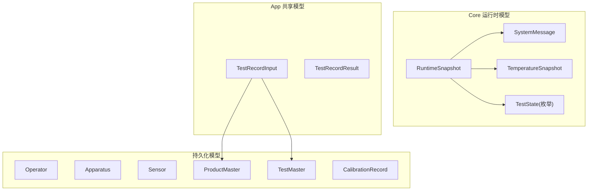
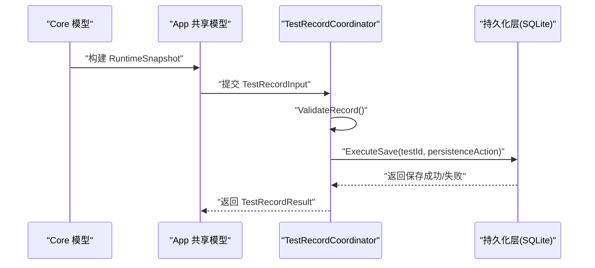
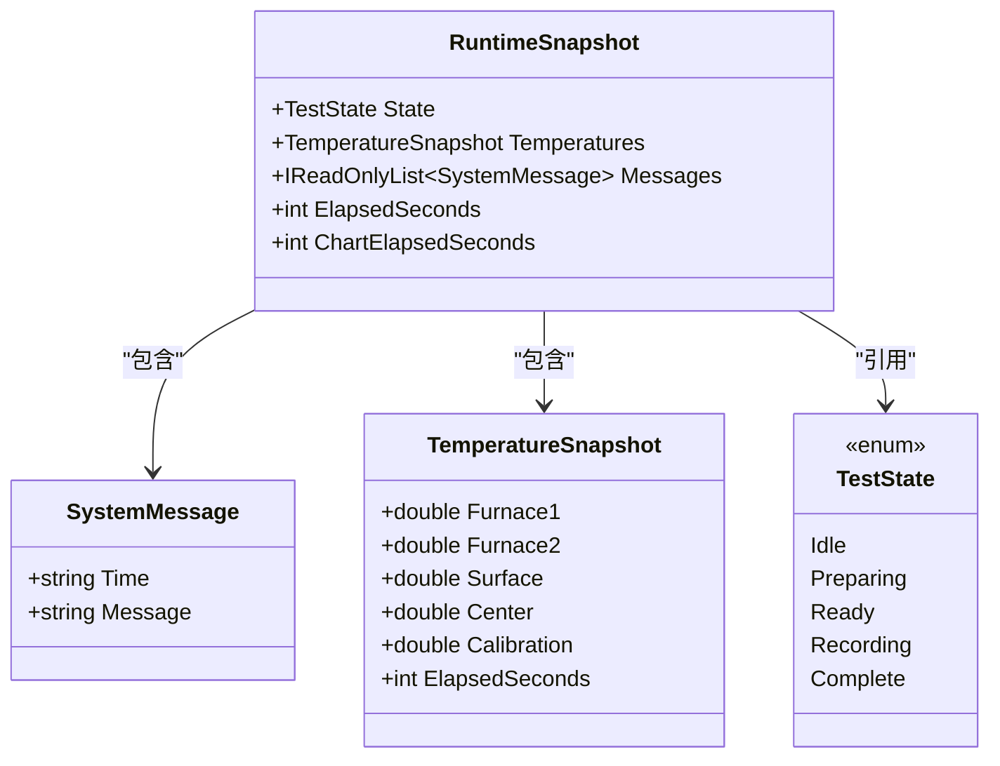
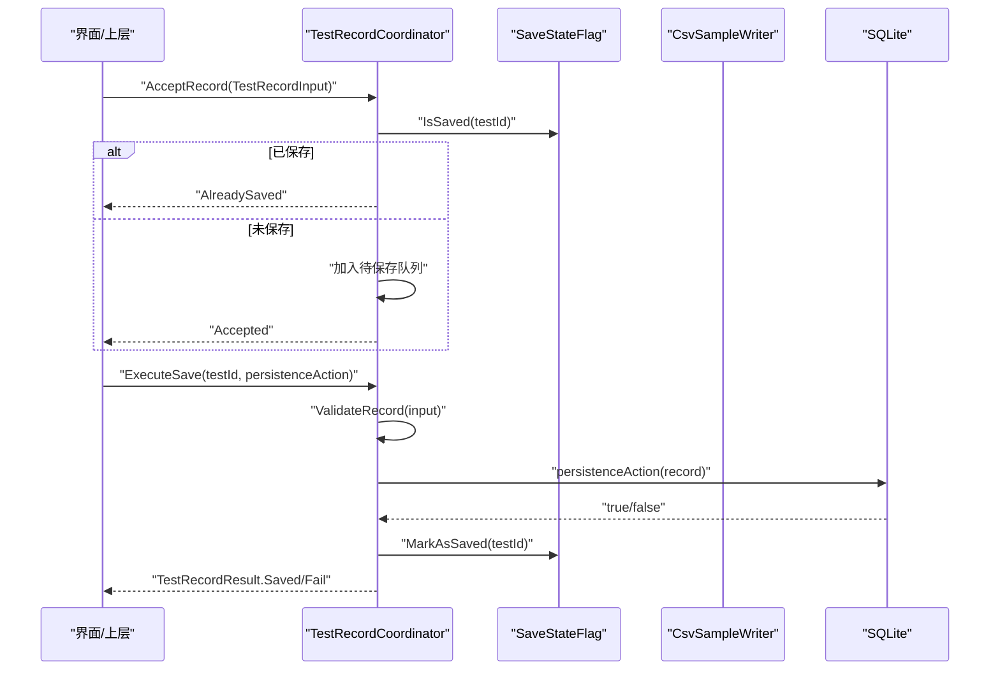
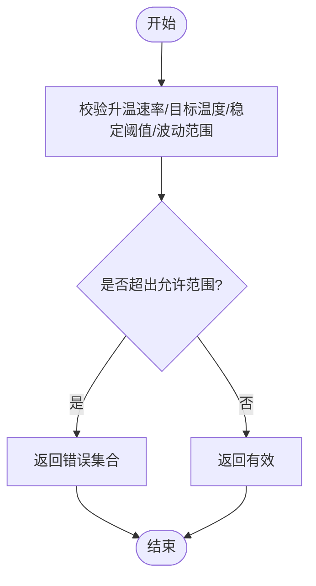
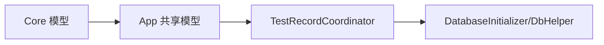

# 数据模型

<cite>
**本文引用的文件**   
- [SystemMessage.cs](file://src/ISO11820.Core/Models/SystemMessage.cs)
- [TemperatureSnapshot.cs](file://src/ISO11820.Core/Models/TemperatureSnapshot.cs)
- [RuntimeSnapshot.cs](file://src/ISO11820.App/Shared/Models/RuntimeSnapshot.cs)
- [TestRecordModels.cs](file://src/ISO11820.App/Shared/Models/Records/TestRecordModels.cs)
- [TestRecordCoordinator.cs](file://src/ISO11820.App/Features/TestRecord/TestRecordCoordinator.cs)
- [ParameterValidator.cs](file://src/ISO11820.App/UI/Common/ParameterValidator.cs)
- [DatabaseInitializer.cs](file://src/ISO11820.App/Infrastructure/Persistence/DatabaseInitializer.cs)
- [DbHelper.cs](file://src/ISO11820.App/Infrastructure/Persistence/DbHelper.cs)
- [Apparatus.cs](file://src/ISO11820.App/Infrastructure/Persistence/Models/Apparatus.cs)
- [CalibrationRecord.cs](file://src/ISO11820.App/Infrastructure/Persistence/Models/CalibrationRecord.cs)
- [Operator.cs](file://src/ISO11820.App/Infrastructure/Persistence/Models/Operator.cs)
- [ProductMaster.cs](file://src/ISO11820.App/Infrastructure/Persistence/Models/ProductMaster.cs)
- [Sensor.cs](file://src/ISO11820.App/Infrastructure/Persistence/Models/Sensor.cs)
- [TestMaster.cs](file://src/ISO11820.App/Infrastructure/Persistence/Models/TestMaster.cs)
- [TestState.cs](file://src/ISO11820.Core/Enums/TestState.cs)
</cite>

## 目录
1. [简介](#简介)
2. [项目结构](#项目结构)
3. [核心组件](#核心组件)
4. [架构总览](#架构总览)
5. [详细组件分析](#详细组件分析)
6. [依赖关系分析](#依赖关系分析)
7. [性能考虑](#性能考虑)
8. [故障排查指南](#故障排查指南)
9. [结论](#结论)
10. [附录](#附录)

## 简介
本文件为 ISO 11820 系统的数据模型 API 文档，聚焦于运行时与持久化层的核心数据实体、字段定义、数据类型、验证规则、业务约束、序列化格式、创建/更新/查询示例、异常处理机制以及数据库映射与持久化策略。重点覆盖以下关键实体：
- SystemMessage：系统消息记录
- TemperatureSnapshot：温度快照
- RuntimeSnapshot：运行时综合快照（状态+温度+消息）
- TestRecordInput/TestRecordResult：试验记录输入与结果
- 持久化模型：Operator、Apparatus、Sensor、ProductMaster、TestMaster、CalibrationRecord

## 项目结构
数据模型分布在 Core 与 App 两个层次：
- Core 层提供不可变运行时数据模型（record），用于跨进程/线程广播与UI展示
- App 层提供持久化模型（class）与协调器（coordinator）、验证器（validator）等

图表来源
- [SystemMessage.cs:1-4](file://src/ISO11820.Core/Models/SystemMessage.cs#L1-L4)
- [TemperatureSnapshot.cs:1-10](file://src/ISO11820.Core/Models/TemperatureSnapshot.cs#L1-L10)
- [RuntimeSnapshot.cs:1-12](file://src/ISO11820.App/Shared/Models/RuntimeSnapshot.cs#L1-L12)
- [TestRecordModels.cs:1-107](file://src/ISO11820.App/Shared/Models/Records/TestRecordModels.cs#L1-L107)
- [Operator.cs:1-14](file://src/ISO11820.App/Infrastructure/Persistence/Models/Operator.cs#L1-L14)
- [Apparatus.cs:1-14](file://src/ISO11820.App/Infrastructure/Persistence/Models/Apparatus.cs#L1-L14)
- [Sensor.cs:1-14](file://src/ISO11820.App/Infrastructure/Persistence/Models/Sensor.cs#L1-L14)
- [ProductMaster.cs:1-21](file://src/ISO11820.App/Infrastructure/Persistence/Models/ProductMaster.cs#L1-L21)
- [TestMaster.cs:1-47](file://src/ISO11820.App/Infrastructure/Persistence/Models/TestMaster.cs#L1-L47)
- [CalibrationRecord.cs:1-18](file://src/ISO11820.App/Infrastructure/Persistence/Models/CalibrationRecord.cs#L1-L18)
- [TestState.cs:1-10](file://src/ISO11820.Core/Enums/TestState.cs#L1-L10)

章节来源
- [SystemMessage.cs:1-4](file://src/ISO11820.Core/Models/SystemMessage.cs#L1-L4)
- [TemperatureSnapshot.cs:1-10](file://src/ISO11820.Core/Models/TemperatureSnapshot.cs#L1-L10)
- [RuntimeSnapshot.cs:1-12](file://src/ISO11820.App/Shared/Models/RuntimeSnapshot.cs#L1-L12)
- [TestRecordModels.cs:1-107](file://src/ISO11820.App/Shared/Models/Records/TestRecordModels.cs#L1-L107)
- [Operator.cs:1-14](file://src/ISO11820.App/Infrastructure/Persistence/Models/Operator.cs#L1-L14)
- [Apparatus.cs:1-14](file://src/ISO11820.App/Infrastructure/Persistence/Models/Apparatus.cs#L1-L14)
- [Sensor.cs:1-14](file://src/ISO11820.App/Infrastructure/Persistence/Models/Sensor.cs#L1-L14)
- [ProductMaster.cs:1-21](file://src/ISO/ISO11820.App/Infrastructure/Persistence/Models/ProductMaster.cs#L1-L21)
- [TestMaster.cs:1-47](file://src/ISO11820.App/Infrastructure/Persistence/Models/TestMaster.cs#L1-L47)
- [CalibrationRecord.cs:1-18](file://src/ISO11820.App/Infrastructure/Persistence/Models/CalibrationRecord.cs#L1-L18)
- [TestState.cs:1-10](file://src/ISO11820.Core/Enums/TestState.cs#L1-L10)

## 核心组件
本节对核心数据模型的属性、类型、默认值、约束进行说明，并给出使用示例路径与注意事项。

### SystemMessage（系统消息）
- 用途：承载系统运行过程中的时间戳与消息文本
- 字段
  - Time: string，消息时间字符串
  - Message: string，消息内容
- 约束与默认值
  - 无内置默认值；建议调用方确保非空
- 序列化
  - record 类型，支持结构化序列化（如 JSON）
- 使用示例路径
  - 构造与消费参考：[RuntimeSnapshot.cs:6-11](file://src/ISO11820.App/Shared/Models/RuntimeSnapshot.cs#L6-L11)

章节来源
- [SystemMessage.cs:1-4](file://src/ISO11820.Core/Models/SystemMessage.cs#L1-L4)
- [RuntimeSnapshot.cs:1-12](file://src/ISO11820.App/Shared/Models/RuntimeSnapshot.cs#L1-L12)

### TemperatureSnapshot（温度快照）
- 用途：一次采集的多通道温度与累计时长
- 字段
  - Furnace1: double，炉温1
  - Furnace2: double，炉温2
  - Surface: double，表面温度
  - Center: double，中心温度
  - Calibration: double，校准温度
  - ElapsedSeconds: int，累计秒数
- 约束与默认值
  - 无默认值；数值型字段由上层保证合理范围
- 序列化
  - record 类型，适合高频广播与UI渲染
- 使用示例路径
  - 被 RuntimeSnapshot 聚合引用：[RuntimeSnapshot.cs:6-11](file://src/ISO11820.App/Shared/Models/RuntimeSnapshot.cs#L6-L11)

章节来源
- [TemperatureSnapshot.cs:1-10](file://src/ISO11820.Core/Models/TemperatureSnapshot.cs#L1-L10)
- [RuntimeSnapshot.cs:1-12](file://src/ISO11820.App/Shared/Models/RuntimeSnapshot.cs#L1-L12)

### RuntimeSnapshot（运行时快照）
- 用途：将当前测试状态、温度快照、消息列表与计时信息打包，供 UI 订阅
- 字段
  - State: TestState，当前测试状态
  - Temperatures: TemperatureSnapshot，温度快照
  - Messages: IReadOnlyList<SystemMessage>，消息历史
  - ElapsedSeconds: int，总运行秒数
  - ChartElapsedSeconds: int，图表刷新用秒数
- 约束与默认值
  - 无默认值；由运行时生成
- 序列化
  - record 类型，适合事件总线或广播
- 使用示例路径
  - 定义与字段：[RuntimeSnapshot.cs:6-11](file://src/ISO11820.App/Shared/Models/RuntimeSnapshot.cs#L6-L11)

章节来源
- [RuntimeSnapshot.cs:1-12](file://src/ISO11820.App/Shared/Models/RuntimeSnapshot.cs#L1-L12)
- [TestState.cs:1-10](file://src/ISO11820.Core/Enums/TestState.cs#L1-L10)

### TestRecordInput / TestRecordResult（试验记录输入与结果）
- 用途：封装试验记录的录入参数与保存结果
- 关键字段（节选）
  - TestId, ProductId, Operator, Phenomenon, Quality, Remarks, RecordedAt, DurationSeconds, IsSaved
  - HasFlame, FlameTimeSeconds, FlameDurationSeconds
  - PostWeightGrams, PreWeightGrams, LostWeightGrams, LostWeightPercent, EnvTemperature
  - FinalFurnace1/2, FinalSurface, FinalCenter, DeltaFurnace1/2, DeltaSurface, DeltaCenter
- 约束与默认值
  - 必填字段通过 required 与协调器校验共同保障
  - 质量评估默认 NotEvaluated，需显式选择
- 序列化
  - record 类型，便于跨层传递
- 使用示例路径
  - 定义与静态工厂方法：[TestRecordModels.cs:3-61](file://src/ISO11820.App/Shared/Models/Records/TestRecordModels.cs#L3-L61)

章节来源
- [TestRecordModels.cs:1-107](file://src/ISO11820.App/Shared/Models/Records/TestRecordModels.cs#L1-L107)

### 持久化模型概览
- Operator：用户账户与角色
- Apparatus：设备主数据
- Sensor：传感器配置
- ProductMaster：产品主数据
- TestMaster：试验主数据（含环境、火焰、重量等）
- CalibrationRecord：校准记录

章节来源
- [Operator.cs:1-14](file://src/ISO11820.App/Infrastructure/Persistence/Models/Operator.cs#L1-L14)
- [Apparatus.cs:1-14](file://src/ISO11820.App/Infrastructure/Persistence/Models/Apparatus.cs#L1-L14)
- [Sensor.cs:1-14](file://src/ISO11820.App/Infrastructure/Persistence/Models/Sensor.cs#L1-L14)
- [ProductMaster.cs:1-21](file://src/ISO11820.App/Infrastructure/Persistence/Models/ProductMaster.cs#L1-L21)
- [TestMaster.cs:1-47](file://src/ISO11820.App/Infrastructure/Persistence/Models/TestMaster.cs#L1-L47)
- [CalibrationRecord.cs:1-18](file://src/ISO11820.App/Infrastructure/Persistence/Models/CalibrationRecord.cs#L1-L18)

## 架构总览
数据从运行时模型到持久化层的流转如下：

图表来源
- [RuntimeSnapshot.cs:1-12](file://src/ISO11820.App/Shared/Models/RuntimeSnapshot.cs#L1-L12)
- [TestRecordCoordinator.cs:1-159](file://src/ISO11820.App/Features/TestRecord/TestRecordCoordinator.cs#L1-L159)
- [DatabaseInitializer.cs:1-198](file://src/ISO11820.App/Infrastructure/Persistence/DatabaseInitializer.cs#L1-L198)

## 详细组件分析

### 运行时数据模型类图

图表来源
- [SystemMessage.cs:1-4](file://src/ISO11820.Core/Models/SystemMessage.cs#L1-L4)
- [TemperatureSnapshot.cs:1-10](file://src/ISO11820.Core/Models/TemperatureSnapshot.cs#L1-L10)
- [RuntimeSnapshot.cs:1-12](file://src/ISO11820.App/Shared/Models/RuntimeSnapshot.cs#L1-L12)
- [TestState.cs:1-10](file://src/ISO11820.Core/Enums/TestState.cs#L1-L10)

章节来源
- [SystemMessage.cs:1-4](file://src/ISO11820.Core/Models/SystemMessage.cs#L1-L4)
- [TemperatureSnapshot.cs:1-10](file://src/ISO11820.Core/Models/TemperatureSnapshot.cs#L1-L10)
- [RuntimeSnapshot.cs:1-12](file://src/ISO11820.App/Shared/Models/RuntimeSnapshot.cs#L1-L12)
- [TestState.cs:1-10](file://src/ISO11820.Core/Enums/TestState.cs#L1-L10)

### 试验记录保存流程（序列图）

图表来源
- [TestRecordCoordinator.cs:1-159](file://src/ISO11820.App/Features/TestRecord/TestRecordCoordinator.cs#L1-L159)
- [TestRecordModels.cs:1-107](file://src/ISO11820.App/Shared/Models/Records/TestRecordModels.cs#L1-L107)

章节来源
- [TestRecordCoordinator.cs:1-159](file://src/ISO11820.App/Features/TestRecord/TestRecordCoordinator.cs#L1-L159)
- [TestRecordModels.cs:1-107](file://src/ISO11820.App/Shared/Models/Records/TestRecordModels.cs#L1-L107)

### 仿真参数验证（流程图）

图表来源
- [ParameterValidator.cs:1-38](file://src/ISO11820.App/UI/Common/ParameterValidator.cs#L1-L38)

章节来源
- [ParameterValidator.cs:1-38](file://src/ISO11820.App/UI/Common/ParameterValidator.cs#L1-L38)

### 数据库映射与持久化策略
- 数据库：SQLite，连接由 DbHelper 管理
- 初始化：DatabaseInitializer.EnsureCreated() 负责建表与种子数据
- 主要表与字段映射（节选）
  - operators：id, username, pwd, role, created_at
  - apparatus：id, name, model, serial_number, serial_port_config, created_at
  - productmaster：id, product_code, test_id, product_name, specification, height_mm, diameter_mm, created_at
  - testmaster：productid, testid, testdate, operator, sample_name, specification, height_mm, diameter_mm, preweight, postweight, lostweight_per, deltatf, totaltesttime, flame_time, flame_duration, has_flame, env_temp, env_humidity, notes, flag, created_at
  - sensors：id, name, type, channel, range_scale, created_at
  - CalibrationRecords：id, sensor_id, calibration_date, result_json, technician, notes, operator, created_at
- 默认值与约束
  - created_at 默认 datetime('now')
  - role 默认 'experimenter'
  - has_flame 默认 0
  - flag 默认 '00000000'
  - productmaster 中 (product_code, test_id) 唯一
  - testmaster 以 (productid, testid) 为主键
- 连接与操作
  - DbHelper.ConnectionString 提供连接串
  - DatabaseInitializer.ValidateLogin 提供登录校验（哈希密码）

章节来源
- [DatabaseInitializer.cs:1-198](file://src/ISO11820.App/Infrastructure/Persistence/DatabaseInitializer.cs#L1-L198)
- [DbHelper.cs:1-22](file://src/ISO11820.App/Infrastructure/Persistence/DbHelper.cs#L1-L22)
- [Operator.cs:1-14](file://src/ISO11820.App/Infrastructure/Persistence/Models/Operator.cs#L1-L14)
- [Apparatus.cs:1-14](file://src/ISO11820.App/Infrastructure/Persistence/Models/Apparatus.cs#L1-L14)
- [Sensor.cs:1-14](file://src/ISO11820.App/Infrastructure/Persistence/Models/Sensor.cs#L1-L14)
- [ProductMaster.cs:1-21](file://src/ISO11820.App/Infrastructure/Persistence/Models/ProductMaster.cs#L1-L21)
- [TestMaster.cs:1-47](file://src/ISO11820.App/Infrastructure/Persistence/Models/TestMaster.cs#L1-L47)
- [CalibrationRecord.cs:1-18](file://src/ISO11820.App/Infrastructure/Persistence/Models/CalibrationRecord.cs#L1-L18)

## 依赖关系分析
- Core 层不依赖 UI 与基础设施，仅暴露纯数据模型与枚举
- App 层通过共享模型桥接 Core 与 UI/持久化
- 协调器集中处理验证、去重、保存状态与异常包装

图表来源
- [RuntimeSnapshot.cs:1-12](file://src/ISO11820.App/Shared/Models/RuntimeSnapshot.cs#L1-L12)
- [TestRecordCoordinator.cs:1-159](file://src/ISO11820.App/Features/TestRecord/TestRecordCoordinator.cs#L1-L159)
- [DatabaseInitializer.cs:1-198](file://src/ISO11820.App/Infrastructure/Persistence/DatabaseInitializer.cs#L1-L198)
- [DbHelper.cs:1-22](file://src/ISO11820.App/Infrastructure/Persistence/DbHelper.cs#L1-L22)

章节来源
- [RuntimeSnapshot.cs:1-12](file://src/ISO11820.App/Shared/Models/RuntimeSnapshot.cs#L1-L12)
- [TestRecordCoordinator.cs:1-159](file://src/ISO11820.App/Features/TestRecord/TestRecordCoordinator.cs#L1-L159)
- [DatabaseInitializer.cs:1-198](file://src/ISO11820.App/Infrastructure/Persistence/DatabaseInitializer.cs#L1-L198)
- [DbHelper.cs:1-22](file://src/ISO11820.App/Infrastructure/Persistence/DbHelper.cs#L1-L22)

## 性能考虑
- 运行时快照采用 record 与只读集合，减少拷贝与并发修改风险
- 批量写入时优先合并多次变更，降低 I/O 频率
- 温度快照字段均为数值型，避免在 UI 层做复杂计算，减轻压力
- 数据库层面利用 SQLite 的轻量特性，注意连接复用与事务批处理

## 故障排查指南
- 重复保存
  - 现象：提示“该试验记录已保存”
  - 定位：检查 SaveStateFlag 与协调器的去重逻辑
  - 参考：[TestRecordCoordinator.cs:18-37](file://src/ISO11820.App/Features/TestRecord/TestRecordCoordinator.cs#L18-L37)
- 保存失败
  - 现象：返回 TestRecordResult.Failed
  - 可能原因：持久化层返回 false 或抛出异常
  - 参考：[TestRecordCoordinator.cs:39-82](file://src/ISO11820.App/Features/TestRecord/TestRecordCoordinator.cs#L39-L82)
- 参数无效
  - 现象：验证返回错误数组
  - 可能原因：必填为空、数值越界
  - 参考：[TestRecordCoordinator.cs:106-131](file://src/ISO11820.App/Features/TestRecord/TestRecordCoordinator.cs#L106-L131), [ParameterValidator.cs:1-38](file://src/ISO11820.App/UI/Common/ParameterValidator.cs#L1-L38)
- 数据库初始化问题
  - 现象：表不存在或种子数据缺失
  - 定位：EnsureCreated 执行顺序与 SQL 语句
  - 参考：[DatabaseInitializer.cs:16-114](file://src/ISO11820.App/Infrastructure/Persistence/DatabaseInitializer.cs#L16-L114)

章节来源
- [TestRecordCoordinator.cs:1-159](file://src/ISO11820.App/Features/TestRecord/TestRecordCoordinator.cs#L1-L159)
- [ParameterValidator.cs:1-38](file://src/ISO11820.App/UI/Common/ParameterValidator.cs#L1-L38)
- [DatabaseInitializer.cs:1-198](file://src/ISO11820.App/Infrastructure/Persistence/DatabaseInitializer.cs#L1-L198)

## 结论
本数据模型体系以 Core 层不可变记录为核心，结合 App 层协调器与持久化模型，形成清晰的运行时与存储边界。通过严格的验证与状态标记，保障了数据一致性与可追溯性。建议在后续扩展中继续遵循“Core 纯净、App 集成”的分层原则，并在高并发场景下引入批处理与缓存策略以提升吞吐。

## 附录

### 字段与类型速查表（节选）
- SystemMessage
  - Time: string
  - Message: string
- TemperatureSnapshot
  - Furnace1: double
  - Furnace2: double
  - Surface: double
  - Center: double
  - Calibration: double
  - ElapsedSeconds: int
- RuntimeSnapshot
  - State: TestState
  - Temperatures: TemperatureSnapshot
  - Messages: IReadOnlyList<SystemMessage>
  - ElapsedSeconds: int
  - ChartElapsedSeconds: int
- TestRecordInput（节选）
  - TestId: string(required)
  - ProductId: string(required)
  - Operator: string
  - Phenomenon: string
  - Quality: TestQuality
  - RecordedAt: DateTime
  - DurationSeconds: int
  - HasFlame: bool
  - FlameTimeSeconds: int
  - FlameDurationSeconds: int
  - PostWeightGrams: double
  - PreWeightGrams: double
  - LostWeightGrams: double
  - LostWeightPercent: double
  - EnvTemperature: double
  - FinalFurnace1/2, FinalSurface, FinalCenter: double
  - DeltaFurnace1/2, DeltaSurface, DeltaCenter: double

章节来源
- [SystemMessage.cs:1-4](file://src/ISO11820.Core/Models/SystemMessage.cs#L1-L4)
- [TemperatureSnapshot.cs:1-10](file://src/ISO11820.Core/Models/TemperatureSnapshot.cs#L1-L10)
- [RuntimeSnapshot.cs:1-12](file://src/ISO11820.App/Shared/Models/RuntimeSnapshot.cs#L1-L12)
- [TestRecordModels.cs:1-107](file://src/ISO11820.App/Shared/Models/Records/TestRecordModels.cs#L1-L107)
- [TestState.cs:1-10](file://src/ISO11820.Core/Enums/TestState.cs#L1-L10)