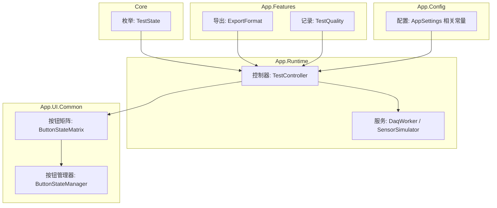
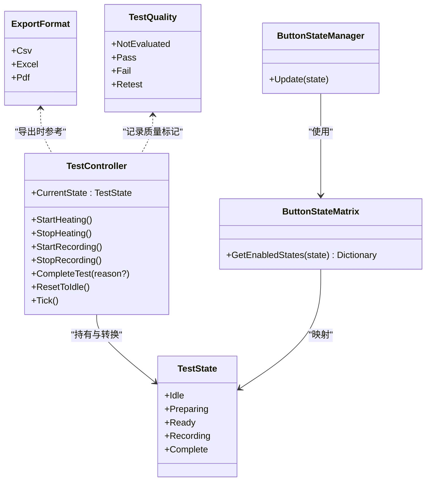
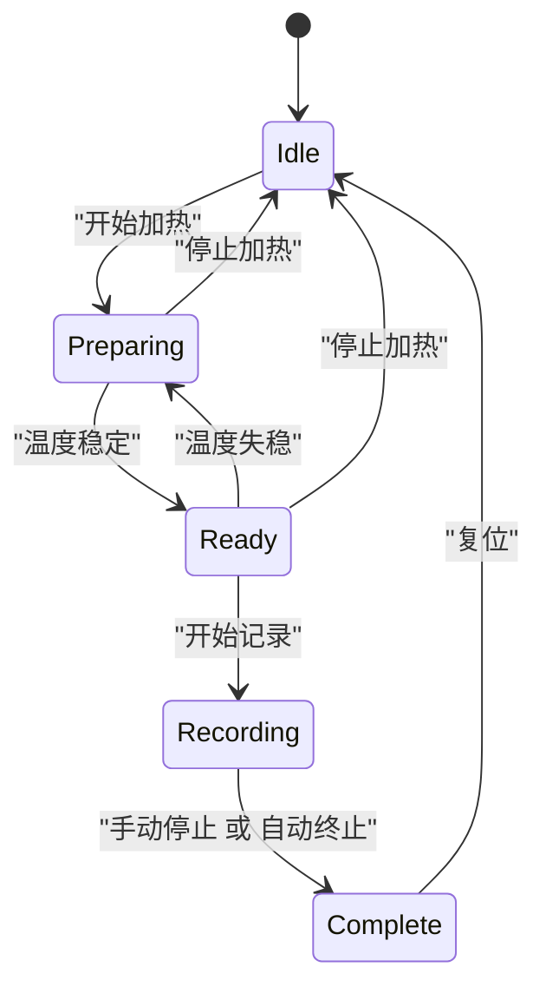
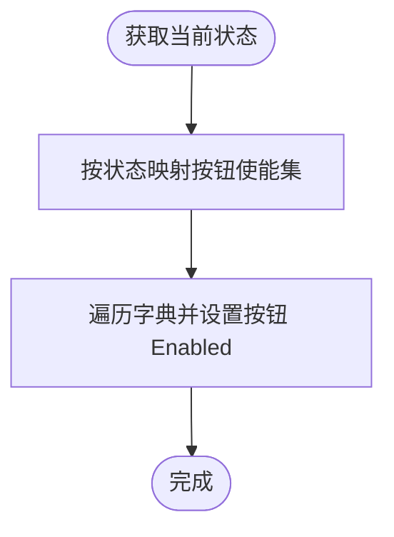
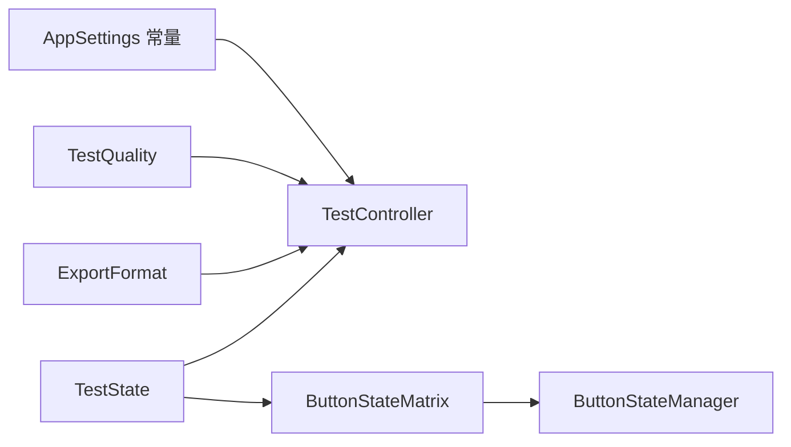

# 枚举和常量

<cite>
**本文引用的文件**   
- [TestState.cs](file://src/ISO11820.Core/Enums/TestState.cs)
- [TestController.cs](file://src/ISO11820.App/Runtime/Controller/TestController.cs)
- [ButtonStateMatrix.cs](file://src/ISO11820.App/UI/Common/ButtonStateMatrix.cs)
- [ButtonStateManager.cs](file://src/ISO11820.App/UI/Common/ButtonStateManager.cs)
- [TestExecutionCoordinator.cs](file://src/ISO11820.App/Features/TestExecution/TestExecutionCoordinator.cs)
- [ExportCoordinator.cs](file://src/ISO11820.App/Features/Export/ExportCoordinator.cs)
- [TestRecordModels.cs](file://src/ISO11820.App/Shared/Models/Records/TestRecordModels.cs)
- [AppSettings.cs](file://src/ISO11820.App/Config/AppSettings.cs)
- [CsvSampleWriter.cs](file://src/ISO11820.App/Infrastructure/FileStorage/CsvSampleWriter.cs)
- [DaqWorker.cs](file://src/ISO11820.App/Runtime/Services/DaqWorker.cs)
- [SensorSimulator.cs](file://src/ISO11820.App/Runtime/Services/SensorSimulator.cs)
- [TemperatureChartPanel.cs](file://src/ISO11820.App/UI/Chart/TemperatureChartPanel.cs)
- [LoginForm.cs](file://src/ISO11820.App/UI/Forms/LoginForm.cs)
- [MainForm.cs](file://src/ISO11820.App/UI/Forms/MainForm.cs)
- [TestStateSmokeTests.cs](file://tests/ISO11820.Tests/Runtime/TestStateSmokeTests.cs)
</cite>

## 目录
1. [简介](#简介)
2. [项目结构](#项目结构)
3. [核心组件](#核心组件)
4. [架构总览](#架构总览)
5. [详细组件分析](#详细组件分析)
6. [依赖关系分析](#依赖关系分析)
7. [性能与行为特性](#性能与行为特性)
8. [故障排查指南](#故障排查指南)
9. [结论](#结论)
10. [附录：完整枚举值列表与使用示例路径](#附录完整枚举值列表与使用示例路径)

## 简介
本文件为 ISO 11820 系统的“枚举与常量”提供系统化 API 文档，覆盖以下要点：
- 所有枚举类型的定义、取值范围与业务含义
- TestState 状态机的转换逻辑、触发条件与使用场景
- 常量的定义目的、命名约定与版本兼容性建议
- 最佳实践与错误处理建议
- 状态机转换图与枚举值完整列表
- 在代码中正确使用的指引（含调用链路与 UI 联动）

## 项目结构
与枚举和常量相关的核心位置如下：
- 核心枚举：位于 Core 层，供应用各层共享
- 控制器与状态机：位于 Runtime 层，驱动状态转换
- UI 按钮使能矩阵：位于 UI.Common，将状态映射到界面交互
- 导出格式与质量枚举：位于 App 层功能域
- 配置与系统常量：分布于 Config、Runtime.Services、UI 等模块

图表来源
- [TestState.cs:1-11](file://src/ISO11820.Core/Enums/TestState.cs#L1-L11)
- [TestController.cs:1-328](file://src/ISO11820.App/Runtime/Controller/TestController.cs#L1-L328)
- [ButtonStateMatrix.cs:1-90](file://src/ISO11820.App/UI/Common/ButtonStateMatrix.cs#L1-L90)
- [ButtonStateManager.cs:1-49](file://src/ISO11820.App/UI/Common/ButtonStateManager.cs#L1-L49)
- [ExportCoordinator.cs:200-229](file://src/ISO11820.App/Features/Export/ExportCoordinator.cs#L200-L229)
- [TestRecordModels.cs:35-44](file://src/ISO11820.App/Shared/Models/Records/TestRecordModels.cs#L35-L44)
- [AppSettings.cs:1-160](file://src/ISO11820.App/Config/AppSettings.cs#L1-L160)

章节来源
- [TestState.cs:1-11](file://src/ISO11820.Core/Enums/TestState.cs#L1-L11)
- [TestController.cs:1-328](file://src/ISO11820.App/Runtime/Controller/TestController.cs#L1-L328)
- [ButtonStateMatrix.cs:1-90](file://src/ISO11820.App/UI/Common/ButtonStateMatrix.cs#L1-L90)
- [ButtonStateManager.cs:1-49](file://src/ISO11820.App/UI/Common/ButtonStateManager.cs#L1-L49)
- [ExportCoordinator.cs:200-229](file://src/ISO11820.App/Features/Export/ExportCoordinator.cs#L200-L229)
- [TestRecordModels.cs:35-44](file://src/ISO11820.App/Shared/Models/Records/TestRecordModels.cs#L35-L44)
- [AppSettings.cs:1-160](file://src/ISO11820.App/Config/AppSettings.cs#L1-L160)

## 核心组件
本节聚焦于系统中定义的枚举与关键常量，说明其语义、取值范围与使用边界。

- 试验状态枚举 TestState
  - 定义位置：Core 层，供全系统共享
  - 取值与含义：
    - Idle：空闲/复位态，允许开始新试验或升温
    - Preparing：准备/升温中，等待温度稳定
    - Ready：就绪，温度稳定，可开始记录
    - Recording：记录中，采集数据并评估自动终止
    - Complete：完成，试验结束，可重置或查看记录
  - 默认值与顺序：以整数序保证唯一性与稳定性，测试用例验证了顺序与唯一性
  - 典型使用：控制器状态属性、UI 按钮使能矩阵、协调器前置检查

- 导出格式枚举 ExportFormat
  - 定义位置：导出功能域
  - 取值：Csv、Excel、Pdf
  - 用途：统一标识导出目标格式，配合导出结果对象返回

- 试验质量枚举 TestQuality
  - 定义位置：记录模型域
  - 取值：NotEvaluated、Pass、Fail、Retest
  - 用途：描述试验结果的判定状态，便于后续归档与报表生成

- 关键常量与配置
  - 采样与窗口常量：用于数据采集与图表显示（如最大样本数、时间窗口）
  - 定时器间隔：控制 Tick 频率，影响状态评估与自动终止时机
  - 仿真参数：起始温度、升温速率、目标温度、稳定阈值、波动幅度等
  - 硬件与输出路径：PID 恒功率、目标温度、数据库与输出目录等

章节来源
- [TestState.cs:1-11](file://src/ISO11820.Core/Enums/TestState.cs#L1-L11)
- [ExportCoordinator.cs:200-229](file://src/ISO11820.App/Features/Export/ExportCoordinator.cs#L200-L229)
- [TestRecordModels.cs:35-44](file://src/ISO11820.App/Shared/Models/Records/TestRecordModels.cs#L35-L44)
- [TestController.cs:1-328](file://src/ISO11820.App/Runtime/Controller/TestController.cs#L1-L328)
- [AppSettings.cs:1-160](file://src/ISO11820.App/Config/AppSettings.cs#L1-L160)
- [CsvSampleWriter.cs:8-9](file://src/ISO11820.App/Infrastructure/FileStorage/CsvSampleWriter.cs#L8-L9)
- [DaqWorker.cs:10-10](file://src/ISO11820.App/Runtime/Services/DaqWorker.cs#L10-L10)
- [SensorSimulator.cs:17-25](file://src/ISO11820.App/Runtime/Services/SensorSimulator.cs#L17-L25)
- [TemperatureChartPanel.cs:14-15](file://src/ISO11820.App/UI/Chart/TemperatureChartPanel.cs#L14-L15)

## 架构总览
下图展示了 TestState 在系统中的角色与交互：控制器驱动状态转换，UI 根据状态更新按钮可用性，导出与记录模块依据状态进行相应处理。

图表来源
- [TestState.cs:1-11](file://src/ISO11820.Core/Enums/TestState.cs#L1-L11)
- [TestController.cs:1-328](file://src/ISO11820.App/Runtime/Controller/TestController.cs#L1-L328)
- [ButtonStateMatrix.cs:1-90](file://src/ISO11820.App/UI/Common/ButtonStateMatrix.cs#L1-L90)
- [ButtonStateManager.cs:1-49](file://src/ISO11820.App/UI/Common/ButtonStateManager.cs#L1-L49)
- [ExportCoordinator.cs:200-229](file://src/ISO11820.App/Features/Export/ExportCoordinator.cs#L200-L229)
- [TestRecordModels.cs:35-44](file://src/ISO11820.App/Shared/Models/Records/TestRecordModels.cs#L35-L44)

## 详细组件分析

### TestState 状态机与转换逻辑
- 状态定义与顺序
  - 通过整数序确保唯一性与稳定性，测试用例覆盖了默认值、唯一性与顺序
- 转换入口
  - 用户操作：开始/停止加热、开始/停止记录、手动完成、复位
  - 自动评估：温度稳定判断、自动终止条件（固定时间点与温漂阈值）
- 转换规则摘要
  - Idle → Preparing：开始加热
  - Preparing → Ready：温度稳定
  - Ready → Preparing：温度失稳（回退重新升温）
  - Ready → Recording：开始记录
  - Recording → Complete：手动停止或达到自动终止条件
  - 任意状态 → Idle：复位
- 自动终止策略
  - 固定时间点：例如 60 分钟无条件结束
  - 提前终止：在多个检查点（如 30/35/40/45/50/55 分钟）若满足温漂阈值则提前结束

图表来源
- [TestController.cs:57-156](file://src/ISO11820.App/Runtime/Controller/TestController.cs#L57-L156)
- [TestController.cs:248-302](file://src/ISO11820.App/Runtime/Controller/TestController.cs#L248-L302)
- [TestStateSmokeTests.cs:1-31](file://tests/ISO11820.Tests/Runtime/TestStateSmokeTests.cs#L1-L31)

章节来源
- [TestController.cs:1-328](file://src/ISO11820.App/Runtime/Controller/TestController.cs#L1-L328)
- [TestStateSmokeTests.cs:1-31](file://tests/ISO11820.Tests/Runtime/TestStateSmokeTests.cs#L1-L31)

### 导出格式枚举 ExportFormat
- 取值与用途
  - Csv：文本表格导出
  - Excel：电子表格导出
  - Pdf：报告导出
- 使用方式
  - 作为导出结果的一部分返回，便于上层统一处理不同格式的输出路径与元信息

章节来源
- [ExportCoordinator.cs:200-229](file://src/ISO11820.App/Features/Export/ExportCoordinator.cs#L200-L229)

### 试验质量枚举 TestQuality
- 取值与含义
  - NotEvaluated：未评估
  - Pass：合格
  - Fail：不合格
  - Retest：需复测
- 使用方式
  - 记录保存流程中用于标记试验质量，支持后续查询与报表展示

章节来源
- [TestRecordModels.cs:35-44](file://src/ISO11820.App/Shared/Models/Records/TestRecordModels.cs#L35-L44)

### UI 按钮使能矩阵与状态联动
- 设计目的
  - 将 TestState 映射为按钮的启用/禁用集合，避免在点击事件中散落状态判断
- 映射规则
  - Idle：允许新建试验、开始加热、参数设置、查看记录
  - Preparing：仅允许停止加热
  - Ready：允许停止加热、开始记录
  - Recording：仅允许停止记录
  - Complete：允许新建试验、参数设置、查看记录
- 实现方式
  - 纯逻辑层 ButtonStateMatrix 计算使能集
  - UI 层 ButtonStateManager 将结果应用到具体控件

图表来源
- [ButtonStateMatrix.cs:1-90](file://src/ISO11820.App/UI/Common/ButtonStateMatrix.cs#L1-L90)
- [ButtonStateManager.cs:1-49](file://src/ISO11820.App/UI/Common/ButtonStateManager.cs#L1-L49)

章节来源
- [ButtonStateMatrix.cs:1-90](file://src/ISO11820.App/UI/Common/ButtonStateMatrix.cs#L1-L90)
- [ButtonStateManager.cs:1-49](file://src/ISO11820.App/UI/Common/ButtonStateManager.cs#L1-L49)

### 协调器对状态的约束
- 新建试验前的状态检查
  - 若控制器不在 Idle，先复位至 Idle，再进入新试验流程
- 作用
  - 防止在非空闲状态下创建新试验导致状态不一致

章节来源
- [TestExecutionCoordinator.cs:1-80](file://src/ISO11820.App/Features/TestExecution/TestExecutionCoordinator.cs#L1-L80)

## 依赖关系分析
- 耦合与内聚
  - TestState 作为跨层共享的契约，被控制器、UI 矩阵、协调器等广泛引用，体现高内聚低耦合
- 直接依赖
  - TestController 依赖 TestState 与仿真服务；UI 矩阵依赖 TestState；导出与记录模块依赖各自枚举
- 间接依赖
  - UI 通过 ButtonStateManager 间接依赖矩阵逻辑；协调器通过控制器接口间接依赖状态

图表来源
- [TestState.cs:1-11](file://src/ISO11820.Core/Enums/TestState.cs#L1-L11)
- [TestController.cs:1-328](file://src/ISO11820.App/Runtime/Controller/TestController.cs#L1-L328)
- [ButtonStateMatrix.cs:1-90](file://src/ISO11820.App/UI/Common/ButtonStateMatrix.cs#L1-L90)
- [ButtonStateManager.cs:1-49](file://src/ISO11820.App/UI/Common/ButtonStateManager.cs#L1-L49)
- [ExportCoordinator.cs:200-229](file://src/ISO11820.App/Features/Export/ExportCoordinator.cs#L200-L229)
- [TestRecordModels.cs:35-44](file://src/ISO11820.App/Shared/Models/Records/TestRecordModels.cs#L35-L44)
- [AppSettings.cs:1-160](file://src/ISO11820.App/Config/AppSettings.cs#L1-L160)

章节来源
- [TestController.cs:1-328](file://src/ISO11820.App/Runtime/Controller/TestController.cs#L1-L328)
- [ButtonStateMatrix.cs:1-90](file://src/ISO11820.App/UI/Common/ButtonStateMatrix.cs#L1-L90)
- [ButtonStateManager.cs:1-49](file://src/ISO11820.App/UI/Common/ButtonStateManager.cs#L1-L49)
- [ExportCoordinator.cs:200-229](file://src/ISO11820.App/Features/Export/ExportCoordinator.cs#L200-L229)
- [TestRecordModels.cs:35-44](file://src/ISO11820.App/Shared/Models/Records/TestRecordModels.cs#L35-L44)
- [AppSettings.cs:1-160](file://src/ISO11820.App/Config/AppSettings.cs#L1-L160)

## 性能与行为特性
- Tick 频率与采样
  - Tick 间隔由服务层常量决定，影响状态评估与自动终止时机
  - 图表窗口与最大点数限制影响 UI 渲染性能
- PID 输出累积
  - 在 Ready 阶段累积一定数量的 PID 输出样本，用于计算恒定功率
- 自动终止检查
  - 在特定时间点窗口内进行温漂评估，避免频繁计算

章节来源
- [DaqWorker.cs:10-10](file://src/ISO11820.App/Runtime/Services/DaqWorker.cs#L10-L10)
- [SensorSimulator.cs:17-25](file://src/ISO11820.App/Runtime/Services/SensorSimulator.cs#L17-L25)
- [TemperatureChartPanel.cs:14-15](file://src/ISO11820.App/UI/Chart/TemperatureChartPanel.cs#L14-L15)
- [TestController.cs:171-204](file://src/ISO11820.App/Runtime/Controller/TestController.cs#L171-L204)

## 故障排查指南
- 常见状态异常
  - 非预期状态：检查是否调用了 ResetToIdle 或在非允许状态触发了用户操作
  - 无法进入 Ready：确认温度稳定阈值与波动参数配置是否正确
  - 自动终止未触发：核对检查点时间与温漂阈值是否符合预期
- 日志与消息
  - 控制器在每次状态转换时追加系统消息，可通过广播快照中的消息数组定位问题
- UI 按钮不可用
  - 确认 ButtonStateMatrix 映射是否与当前状态一致，必要时检查 ButtonStateManager 的更新调用

章节来源
- [TestController.cs:304-326](file://src/ISO11820.App/Runtime/Controller/TestController.cs#L304-L326)
- [ButtonStateMatrix.cs:1-90](file://src/ISO11820.App/UI/Common/ButtonStateMatrix.cs#L1-L90)
- [ButtonStateManager.cs:1-49](file://src/ISO11820.App/UI/Common/ButtonStateManager.cs#L1-L49)

## 结论
- TestState 是系统状态机的核心契约，定义了从空闲到完成的完整生命周期
- ExportFormat 与 TestQuality 分别服务于导出与记录两个重要业务域
- 常量与配置项贯穿仿真、采集、UI 与存储，合理组织与命名有助于维护与扩展
- 建议在新增状态或常量时同步更新 UI 矩阵、协调器校验与测试用例，保持行为一致性

## 附录：完整枚举值列表与使用示例路径
- TestState
  - 取值：Idle、Preparing、Ready、Recording、Complete
  - 使用示例路径：
    - 状态转换与广播：[TestController.cs:57-156](file://src/ISO11820.App/Runtime/Controller/TestController.cs#L57-L156)
    - 自动过渡与终止：[TestController.cs:248-302](file://src/ISO11820.App/Runtime/Controller/TestController.cs#L248-L302)
    - 协调器前置检查：[TestExecutionCoordinator.cs:19-25](file://src/ISO11820.App/Features/TestExecution/TestExecutionCoordinator.cs#L19-L25)
    - UI 按钮映射：[ButtonStateMatrix.cs:11-62](file://src/ISO11820.App/UI/Common/ButtonStateMatrix.cs#L11-L62)
    - 单元测试断言顺序：[TestStateSmokeTests.cs:22-29](file://tests/ISO11820.Tests/Runtime/TestStateSmokeTests.cs#L22-L29)

- ExportFormat
  - 取值：Csv、Excel、Pdf
  - 使用示例路径：
    - 导出结果封装与返回：[ExportCoordinator.cs:176-207](file://src/ISO11820.App/Features/Export/ExportCoordinator.cs#L176-L207)

- TestQuality
  - 取值：NotEvaluated、Pass、Fail、Retest
  - 使用示例路径：
    - 记录质量字段定义：[TestRecordModels.cs:38-44](file://src/ISO11820.App/Shared/Models/Records/TestRecordModels.cs#L38-L44)

- 关键常量与配置（节选）
  - 数据采集与 UI 窗口：
    - 最大 PID 样本数：[TestController.cs:17-17](file://src/ISO11820.App/Runtime/Controller/TestController.cs#L17-L17)
    - Tick 间隔毫秒：[DaqWorker.cs:10-10](file://src/ISO11820.App/Runtime/Services/DaqWorker.cs#L10-L10)
    - 记录采样间隔毫秒：[SensorSimulator.cs:17-17](file://src/ISO11820.App/Runtime/Services/SensorSimulator.cs#L17-L17)
    - 图表最大点数与窗口秒数：[TemperatureChartPanel.cs:14-15](file://src/ISO11820.App/UI/Chart/TemperatureChartPanel.cs#L14-L15)
  - 文件与路径常量：
    - 测试数据文件夹与文件名：[CsvSampleWriter.cs:8-9](file://src/ISO11820.App/Infrastructure/FileStorage/CsvSampleWriter.cs#L8-L9)
  - 配置项（部分）：
    - 仿真参数（起始温度、升温速率、目标温度、稳定阈值、波动幅度）：[AppSettings.cs:57-70](file://src/ISO11820.App/Config/AppSettings.cs#L57-L70)
    - 硬件参数（恒功率、PID 目标温度）：[AppSettings.cs:119-123](file://src/ISO11820.App/Config/AppSettings.cs#L119-L123)
  - Windows 消息常量（UI 内部通信）：
    - 登录窗体消息号：[LoginForm.cs:21-21](file://src/ISO11820.App/UI/Forms/LoginForm.cs#L21-L21)
    - 主窗体信号消息号：[MainForm.cs:824-824](file://src/ISO11820.App/UI/Forms/MainForm.cs#L824-L824)