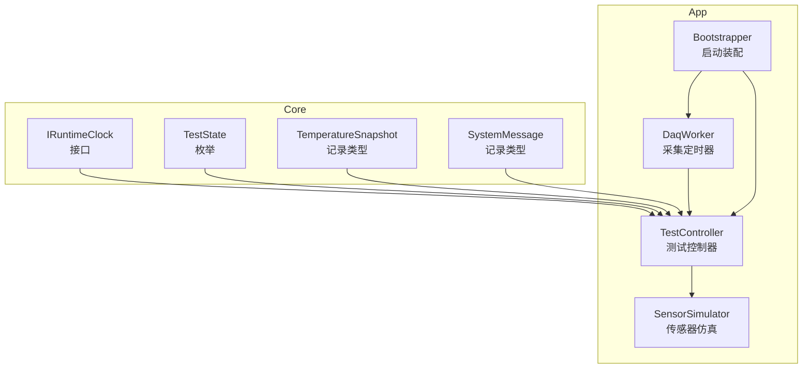
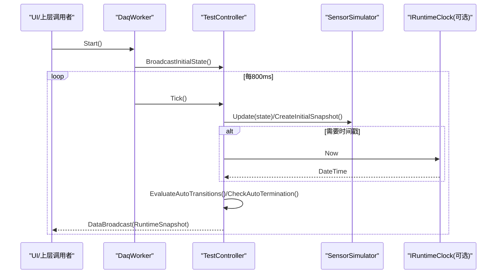
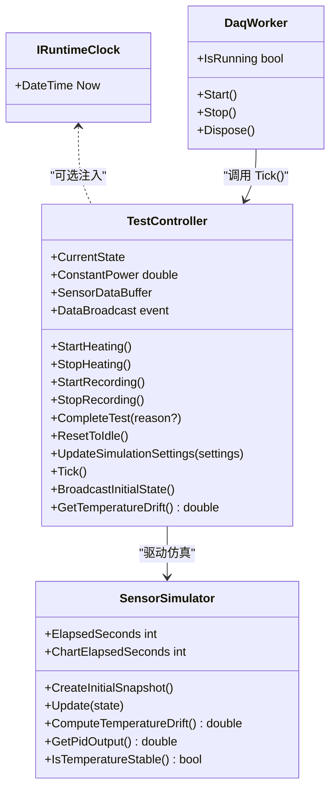

# 核心接口

<cite>
**本文引用的文件**
- [IRuntimeClock.cs](file://src/ISO11820.Core\Contracts\IRuntimeClock.cs)
- [TestController.cs](file://src/ISO11820.App\Runtime\Controller\TestController.cs)
- [DaqWorker.cs](file://src/ISO11820.App\Runtime\Services\DaqWorker.cs)
- [Bootstrapper.cs](file://src/ISO11820.App\App\Bootstrapper.cs)
- [SensorSimulator.cs](file://src/ISO11820.App\Runtime\Services\SensorSimulator.cs)
- [SystemMessage.cs](file://src/ISO11820.Core\Models\SystemMessage.cs)
- [TemperatureSnapshot.cs](file://src/ISO11820.Core\Models\TemperatureSnapshot.cs)
- [TestState.cs](file://src/ISO11820.Core\Enums\TestState.cs)
</cite>

## 目录
1. [简介](#简介)
2. [项目结构](#项目结构)
3. [核心组件](#核心组件)
4. [架构总览](#架构总览)
5. [详细组件分析](#详细组件分析)
6. [依赖关系分析](#依赖关系分析)
7. [性能考虑](#性能考虑)
8. [故障排查指南](#故障排查指南)
9. [结论](#结论)
10. [附录：接口与实现示例](#附录接口与实现示例)

## 简介
本文件为 ISO 11820 系统的“核心接口”文档，聚焦于运行时时钟抽象 IRuntimeClock 的设计目的、使用场景、实现要求，以及其在系统架构中的作用。同时给出依赖注入配置建议、扩展新实现的步骤，并提供完整的代码示例路径，展示如何正确实现和使用这些接口。

## 项目结构
- Core 层定义跨应用共享的契约与模型（如 IRuntimeClock、测试状态枚举、温度快照等）。
- App 层负责组合具体实现、编排运行期服务（如传感器仿真、数据采集轮询、控制器等），并通过启动器装配上下文。

图表来源
- [IRuntimeClock.cs:1-7](file://src/ISO11820.Core\Contracts\IRuntimeClock.cs#L1-L7)
- [TestState.cs:1-11](file://src/ISO11820.Core\Enums\TestState.cs#L1-L11)
- [TemperatureSnapshot.cs:1-10](file://src/ISO11820.Core\Models\TemperatureSnapshot.cs#L1-L10)
- [SystemMessage.cs:1-4](file://src/ISO11820.Core\Models\SystemMessage.cs#L1-L4)
- [TestController.cs:1-328](file://src/ISO11820.App\Runtime\Controller\TestController.cs#L1-L328)
- [DaqWorker.cs:1-49](file://src/ISO11820.App\Runtime\Services\DaqWorker.cs#L1-L49)
- [SensorSimulator.cs:1-223](file://src/ISO11820.App\Runtime\Services\SensorSimulator.cs#L1-L223)
- [Bootstrapper.cs:1-66](file://src/ISO11820.App\App\Bootstrapper.cs#L1-L66)

章节来源
- [IRuntimeClock.cs:1-7](file://src/ISO11820.Core\Contracts\IRuntimeClock.cs#L1-L7)
- [TestController.cs:1-328](file://src/ISO11820.App\Runtime\Controller\TestController.cs#L1-L328)
- [DaqWorker.cs:1-49](file://src/ISO11820.App\Runtime\Services\DaqWorker.cs#L1-L49)
- [Bootstrapper.cs:1-66](file://src/ISO11820.App\App\Bootstrapper.cs#L1-L66)

## 核心组件
本节概述与 IRuntimeClock 相关的核心组件及其职责。

- IRuntimeClock
  - 设计目的：将“当前时间”的来源抽象化，便于在测试与仿真环境中替换为可控的时间源，从而提升可测试性与确定性。
  - 方法签名：Now 属性，返回 DateTime。
  - 使用场景：需要以稳定、可预测时间推进逻辑的场景（例如计时、超时、日志时间戳、回放等）。
  - 实现要求：线程安全；返回值应反映调用时刻的真实或模拟时间；避免副作用。

- TestController
  - 职责：管理试验状态机、驱动仿真、聚合数据、广播运行时快照。
  - 与 IRuntimeClock 的关系：当前实现直接使用系统时间；可通过注入 IRuntimeClock 替换为可控时间源以提升可测试性。

- DaqWorker
  - 职责：基于定时器周期触发 TestController.Tick()，驱动仿真步进。
  - 与 IRuntimeClock 的关系：若需精确控制 Tick 的时间语义，可在内部使用 IRuntimeClock 进行时间判断或打点。

- SensorSimulator
  - 职责：根据 TestState 推进仿真温度曲线、计算温漂、生成 PID 输出等。
  - 与 IRuntimeClock 的关系：当前未直接依赖 IRuntimeClock；如需在仿真中引入外部时间基准（如回放、加速），可考虑注入。

- Bootstrapper
  - 职责：初始化并组装各服务，创建应用上下文。
  - 与 IRuntimeClock 的关系：可作为 DI 容器注册 IRuntimeClock 的具体实现（默认 SystemClock）的位置。

章节来源
- [IRuntimeClock.cs:1-7](file://src/ISO11820.Core\Contracts\IRuntimeClock.cs#L1-L7)
- [TestController.cs:1-328](file://src/ISO11820.App\Runtime\Controller\TestController.cs#L1-L328)
- [DaqWorker.cs:1-49](file://src/ISO11820.App\Runtime\Services\DaqWorker.cs#L1-L49)
- [SensorSimulator.cs:1-223](file://src/ISO11820.App\Runtime\Services\SensorSimulator.cs#L1-L223)
- [Bootstrapper.cs:1-66](file://src/ISO11820.App\App\Bootstrapper.cs#L1-L66)

## 架构总览
下图展示了运行时关键组件之间的交互关系，以及 IRuntimeClock 在系统中的潜在接入点。

图表来源
- [DaqWorker.cs:1-49](file://src/ISO11820.App\Runtime\Services\DaqWorker.cs#L1-L49)
- [TestController.cs:1-328](file://src/ISO11820.App\Runtime\Controller\TestController.cs#L1-L328)
- [SensorSimulator.cs:1-223](file://src/ISO11820.App\Runtime\Services\SensorSimulator.cs#L1-L223)
- [IRuntimeClock.cs:1-7](file://src/ISO11820.Core\Contracts\IRuntimeClock.cs#L1-L7)

## 详细组件分析

### IRuntimeClock 接口规范
- 命名空间：ISO11820.Core.Contracts
- 类型：interface
- 成员
  - 属性：DateTime Now { get; }
- 行为约定
  - 返回调用时的“当前时间”，用于替代全局系统时间访问。
  - 必须线程安全，适合多线程并发读取。
  - 不应产生副作用，仅作为纯时间源。
- 典型实现
  - SystemClock：封装 System.DateTime.Now，提供默认行为。
  - FakeClock：用于单元测试的可控时间源，支持前进、设置固定时间等。
- 继承关系
  - 当前无继承链，保持最小契约，便于替换与扩展。
- 依赖注入
  - 建议在启动阶段注册为单例，供 TestController/DaqWorker/SensorSimulator 按需注入。

章节来源
- [IRuntimeClock.cs:1-7](file://src/ISO11820.Core\Contracts\IRuntimeClock.cs#L1-L7)

### TestController 与 IRuntimeClock 的集成点
- 当前实现
  - 在消息时间戳与部分判定中使用系统时间（例如 TransitionTo 中的时间字符串）。
- 建议集成方式
  - 通过构造函数注入 IRuntimeClock，统一获取时间戳，确保日志与消息时间一致且可测。
  - 在自动终止检查与计时相关逻辑中，优先使用 IRuntimeClock 提供的 Now 进行边界判断。
- 对外 API（摘要）
  - 用户操作：StartHeating、StopHeating、StartRecording、StopRecording、CompleteTest、ResetToIdle、UpdateSimulationSettings
  - 查询：CurrentState、ConstantPower、SensorDataBuffer、GetTemperatureDrift
  - 事件：DataBroadcast（携带 RuntimeSnapshot）
- 与 IRuntimeClock 的交互位置
  - 消息时间戳生成处
  - 自动终止条件检查处（如需基于绝对时间而非相对计数）

章节来源
- [TestController.cs:1-328](file://src/ISO11820.App\Runtime\Controller\TestController.cs#L1-L328)

### DaqWorker 与 IRuntimeClock 的集成点
- 当前实现
  - 使用 System.Timers.Timer 周期性触发 Tick。
- 建议集成方式
  - 在 OnTick 回调中记录实际触发时间（使用 IRuntimeClock.Now），便于诊断与回放。
  - 若需要更严格的时序控制（如按真实时间间隔调度），可将 Timer 间隔与 IRuntimeClock 结合进行补偿。

章节来源
- [DaqWorker.cs:1-49](file://src/ISO11820.App\Runtime\Services\DaqWorker.cs#L1-L49)

### SensorSimulator 与 IRuntimeClock 的集成点
- 当前实现
  - 主要基于内部计数器推进仿真，不直接依赖系统时间。
- 建议集成方式
  - 当需要基于真实时间推进仿真（如回放、慢放、快进）时，可注入 IRuntimeClock 并在 Update 中计算时间增量。

章节来源
- [SensorSimulator.cs:1-223](file://src/ISO11820.App\Runtime\Services\SensorSimulator.cs#L1-L223)

### Bootstrapper 与依赖注入配置
- 当前实现
  - 手动 new 各组件并组装到应用上下文。
- 建议配置
  - 注册 IRuntimeClock 的实现（默认 SystemClock）为单例。
  - 将 IRuntimeClock 注入到 TestController、DaqWorker、SensorSimulator 等需要时间的组件。
  - 在测试项目中注册 FakeClock，以验证时间敏感逻辑。

章节来源
- [Bootstrapper.cs:1-66](file://src/ISO11820.App\App\Bootstrapper.cs#L1-L66)

## 依赖关系分析
- 耦合与内聚
  - IRuntimeClock 位于 Core 层，低耦合、高内聚，仅暴露单一时间源能力。
  - TestController 对 IRuntimeClock 的依赖是可选的，当前未显式注入，但具备良好扩展点。
- 外部依赖
  - 当前未引入第三方 DI 框架，采用手动装配；未来可平滑迁移至标准 DI 容器。
- 循环依赖
  - 未发现循环依赖风险。

图表来源
- [IRuntimeClock.cs:1-7](file://src/ISO11820.Core\Contracts\IRuntimeClock.cs#L1-L7)
- [TestController.cs:1-328](file://src/ISO11820.App\Runtime\Controller\TestController.cs#L1-L328)
- [DaqWorker.cs:1-49](file://src/ISO11820.App\Runtime\Services\DaqWorker.cs#L1-L49)
- [SensorSimulator.cs:1-223](file://src/ISO11820.App\Runtime\Services\SensorSimulator.cs#L1-L223)

章节来源
- [IRuntimeClock.cs:1-7](file://src/ISO11820.Core\Contracts\IRuntimeClock.cs#L1-L7)
- [TestController.cs:1-328](file://src/ISO11820.App\Runtime\Controller\TestController.cs#L1-L328)
- [DaqWorker.cs:1-49](file://src/ISO11820.App\Runtime\Services\DaqWorker.cs#L1-L49)
- [SensorSimulator.cs:1-223](file://src/ISO11820.App\Runtime\Services\SensorSimulator.cs#L1-L223)

## 性能考虑
- IRuntimeClock.Now 应为轻量级只读操作，避免锁竞争与额外分配。
- 在高频率 Tick 场景下，尽量复用对象与缓冲，减少 GC 压力（参见 TestController 的数据缓冲策略）。
- 若使用 FakeClock，注意其内部同步机制，避免成为性能瓶颈。

## 故障排查指南
- 时间不一致问题
  - 现象：日志时间与预期不符，或自动化测试不稳定。
  - 排查：确认是否多处混用系统时间与 IRuntimeClock；统一由 IRuntimeClock 提供时间源。
- 定时抖动导致的状态误判
  - 现象：Ready/Preparing 频繁切换。
  - 排查：检查 IsTemperatureStable 阈值与 Tick 间隔；必要时引入 IRuntimeClock 进行时间窗口校正。
- 自动终止提前或延后
  - 现象：在检查点提前结束或超过 60 分钟仍未结束。
  - 排查：核对 CheckAutoTermination 的时间窗口逻辑；建议使用 IRuntimeClock 统一时间基准。

章节来源
- [TestController.cs:248-302](file://src/ISO11820.App\Runtime\Controller\TestController.cs#L248-L302)
- [SensorSimulator.cs:147-158](file://src/ISO11820.App\Runtime\Services\SensorSimulator.cs#L147-L158)

## 结论
IRuntimeClock 是一个小而关键的抽象，能够显著提升系统在时间相关逻辑上的可测试性与可维护性。通过在 TestController、DaqWorker 与 SensorSimulator 中合理注入该接口，可实现时间驱动的确定性行为，简化回归测试与回放场景。建议在启动阶段完成 IRuntimeClock 的装配，并在所有时间敏感路径上统一使用该接口。

## 附录：接口与实现示例

### 接口定义参考
- IRuntimeClock
  - 属性：DateTime Now
  - 用途：提供统一的当前时间源
  - 参考路径：[IRuntimeClock.cs:1-7](file://src/ISO11820.Core\Contracts\IRuntimeClock.cs#L1-L7)

### 默认实现（SystemClock）
- 说明：封装系统时间，作为默认实现
- 建议注册：在 Bootstrapper 中注册为单例
- 参考路径：[Bootstrapper.cs:1-66](file://src/ISO11820.App\App\Bootstrapper.cs#L1-L66)

### 测试实现（FakeClock）
- 说明：用于单元测试的可控时间源，支持设置与前进时间
- 使用方式：在测试项目中替换默认实现
- 参考路径：[Bootstrapper.cs:1-66](file://src/ISO11820.App\App\Bootstrapper.cs#L1-L66)

### 在 TestController 中使用 IRuntimeClock 的建议
- 修改点
  - 构造函数注入 IRuntimeClock
  - 在 TransitionTo 与自动终止检查中使用 IRuntimeClock.Now
- 参考路径
  - [TestController.cs:304-309](file://src/ISO11820.App\Runtime\Controller\TestController.cs#L304-L309)
  - [TestController.cs:274-302](file://src/ISO11820.App\Runtime\Controller\TestController.cs#L274-L302)

### 在 DaqWorker 中使用 IRuntimeClock 的建议
- 修改点
  - 在 OnTick 中记录触发时间（IRuntimeClock.Now）
- 参考路径
  - [DaqWorker.cs:45-48](file://src/ISO11820.App\Runtime\Services\DaqWorker.cs#L45-L48)

### 在 SensorSimulator 中使用 IRuntimeClock 的建议
- 修改点
  - 在 Update 中依据 IRuntimeClock.Now 计算时间增量，驱动仿真
- 参考路径
  - [SensorSimulator.cs:46-79](file://src/ISO11820.App\Runtime\Services\SensorSimulator.cs#L46-L79)

### 依赖注入配置示例（概念性）
- 注册 IRuntimeClock 默认实现为单例
- 将 IRuntimeClock 注入到 TestController、DaqWorker、SensorSimulator
- 在测试项目中注册 FakeClock 覆盖默认实现
- 参考路径
  - [Bootstrapper.cs:1-66](file://src/ISO11820.App\App\Bootstrapper.cs#L1-L66)

### 相关数据模型与枚举
- TestState：试验状态机（Idle/Preparing/Ready/Recording/Complete）
- TemperatureSnapshot：温度快照记录
- SystemMessage：系统消息记录
- 参考路径
  - [TestState.cs:1-11](file://src/ISO11820.Core\Enums\TestState.cs#L1-L11)
  - [TemperatureSnapshot.cs:1-10](file://src/ISO11820.Core\Models\TemperatureSnapshot.cs#L1-L10)
  - [SystemMessage.cs:1-4](file://src/ISO11820.Core\Models\SystemMessage.cs#L1-L4)