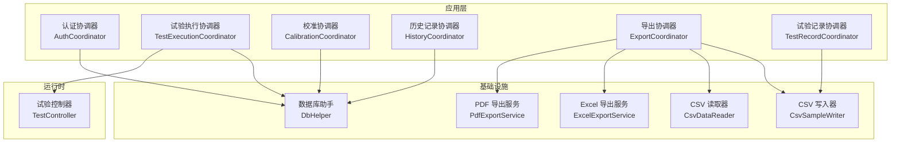
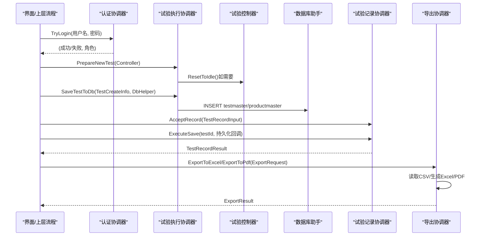
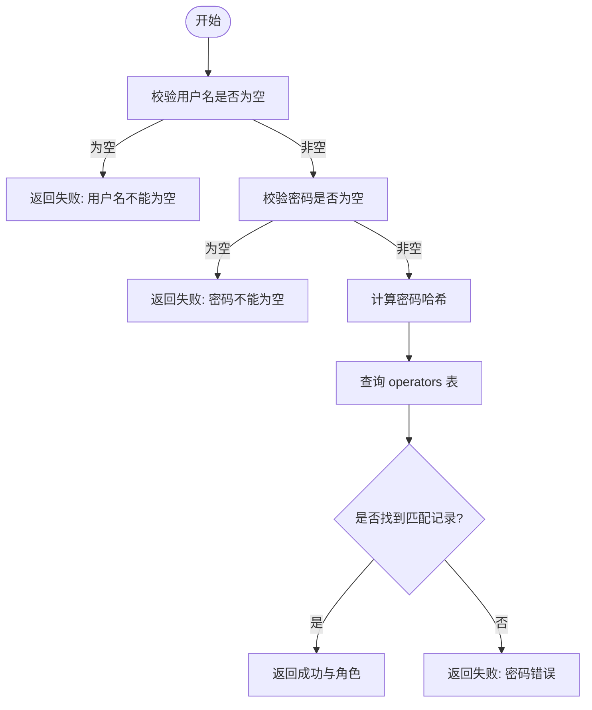
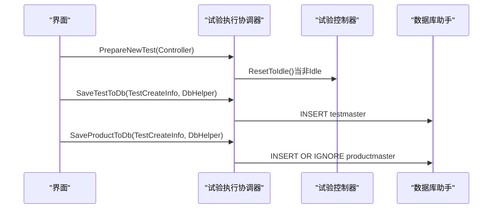
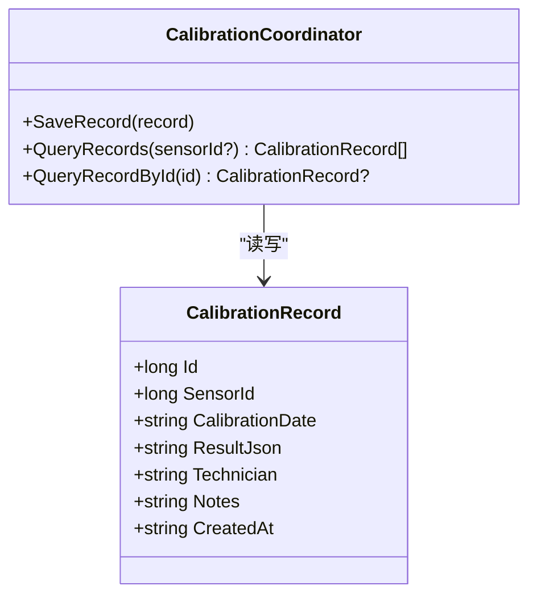
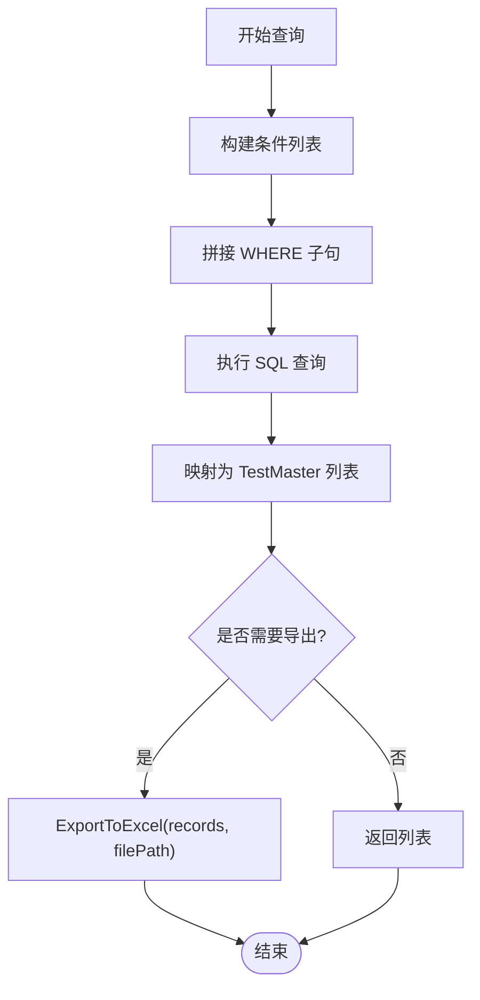
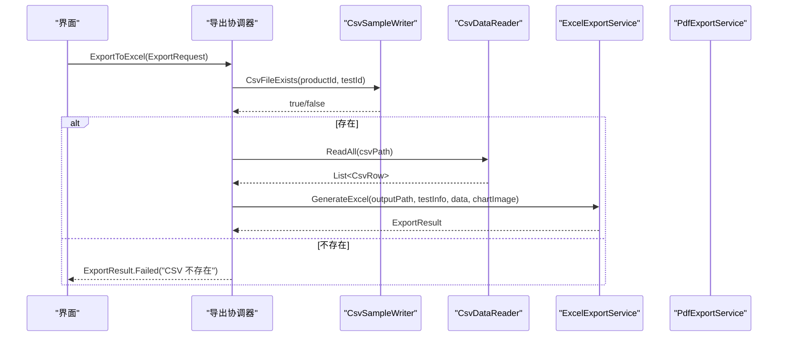
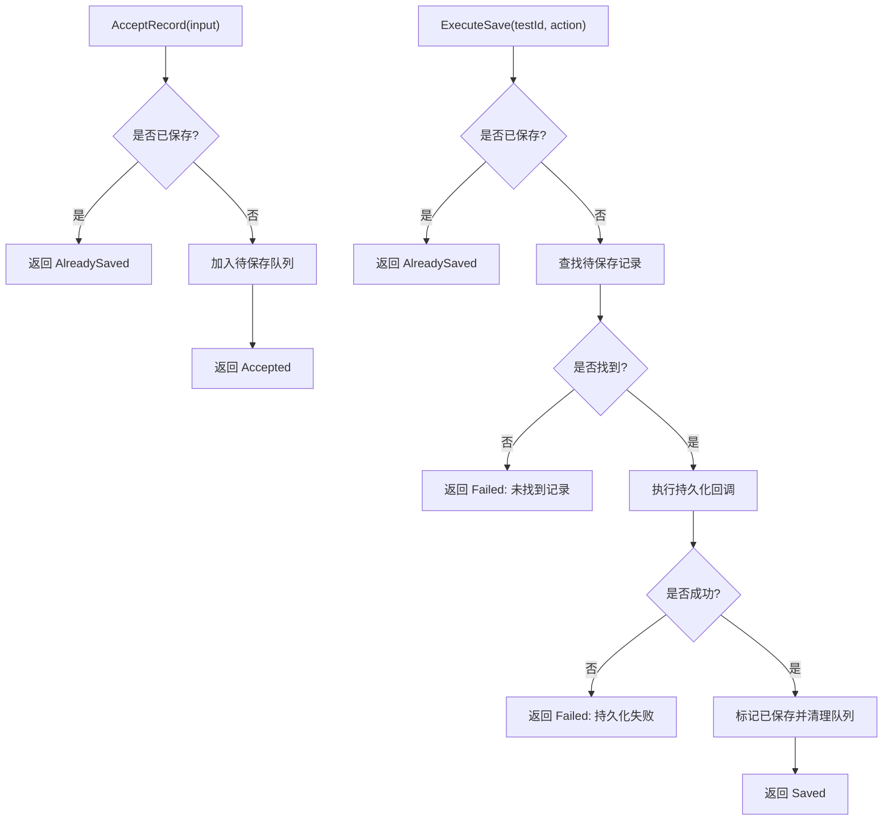
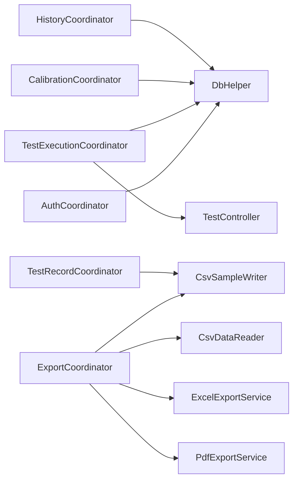

# 功能协调器

<cite>
**本文引用的文件**   
- [AuthCoordinator.cs](file://src/ISO11820.App/Features/Auth/AuthCoordinator.cs)
- [TestExecutionCoordinator.cs](file://src/ISO11820.App/Features/TestExecution/TestExecutionCoordinator.cs)
- [CalibrationCoordinator.cs](file://src/ISO11820.App/Features/Calibration/CalibrationCoordinator.cs)
- [HistoryCoordinator.cs](file://src/ISO11820.App/Features/History/HistoryCoordinator.cs)
- [ExportCoordinator.cs](file://src/ISO11820.App/Features/Export/ExportCoordinator.cs)
- [CsvSampleWriter.cs](file://src/ISO11820.App/Infrastructure/FileStorage/CsvSampleWriter.cs)
- [ExcelExportService.cs](file://src/ISO11820.App/Features/Export/ExcelExportService.cs)
- [PdfExportService.cs](file://src/ISO11820.App/Features/Export/PdfExportService.cs)
- [CsvDataReader.cs](file://src/ISO11820.App/Features/Export/CsvDataReader.cs)
- [DbHelper.cs](file://src/ISO11820.App/Infrastructure/Persistence/DbHelper.cs)
- [TestController.cs](file://src/ISO11820.App/Runtime/Controller/TestController.cs)
- [TestRecordCoordinator.cs](file://src/ISO11820.App/Features/TestRecord/TestRecordCoordinator.cs)
- [TestRecordModels.cs](file://src/ISO11820.App/Shared/Models/Records/TestRecordModels.cs)
- [TestState.cs](file://src/ISO11820.Core/Enums/TestState.cs)
- [SystemMessage.cs](file://src/ISO11820.Core/Models/SystemMessage.cs)
- [TemperatureSnapshot.cs](file://src/ISO11820.Core/Models/TemperatureSnapshot.cs)
</cite>

## 目录
1. [引言](#引言)
2. [项目结构](#项目结构)
3. [核心组件](#核心组件)
4. [架构总览](#架构总览)
5. [详细组件分析](#详细组件分析)
6. [依赖关系分析](#依赖关系分析)
7. [性能与扩展性](#性能与扩展性)
8. [故障排查指南](#故障排查指南)
9. [结论](#结论)
10. [附录：接口与数据契约](#附录接口与数据契约)

## 引言
本文件面向 ISO 11820 系统的“功能协调器”层，系统化说明以下协调器的职责、公共接口、事件处理机制、错误处理策略以及跨协调器通信方式：
- 试验执行协调器（TestExecutionCoordinator）
- 认证协调器（AuthCoordinator）
- 校准协调器（CalibrationCoordinator）
- 历史记录协调器（HistoryCoordinator）
- 导出协调器（ExportCoordinator）
- 试验记录协调器（TestRecordCoordinator）

同时提供业务流程编排示例、调用路径参考、最佳实践与扩展指导。

## 项目结构
协调器位于 Features 目录下，按领域划分；基础设施（数据库、文件存储）位于 Infrastructure；运行时控制与仿真在 Runtime；共享模型与枚举在 Shared 与 Core。

图表来源
- [AuthCoordinator.cs:1-62](file://src/ISO11820.App/Features/Auth/AuthCoordinator.cs#L1-L62)
- [TestExecutionCoordinator.cs:1-80](file://src/ISO11820.App/Features/TestExecution/TestExecutionCoordinator.cs#L1-L80)
- [CalibrationCoordinator.cs:1-91](file://src/ISO11820.App/Features/Calibration/CalibrationCoordinator.cs#L1-L91)
- [HistoryCoordinator.cs:1-241](file://src/ISO11820.App/Features/History/HistoryCoordinator.cs#L1-L241)
- [ExportCoordinator.cs:1-229](file://src/ISO11820.App/Features/Export/ExportCoordinator.cs#L1-L229)
- [CsvSampleWriter.cs:1-81](file://src/ISO11820.App/Infrastructure/FileStorage/CsvSampleWriter.cs#L1-L81)
- [CsvDataReader.cs:1-72](file://src/ISO11820.App/Features/Export/CsvDataReader.cs#L1-L72)
- [ExcelExportService.cs:1-143](file://src/ISO11820.App/Features/Export/ExcelExportService.cs#L1-L143)
- [PdfExportService.cs:1-139](file://src/ISO11820.App/Features/Export/PdfExportService.cs#L1-L139)
- [DbHelper.cs:1-22](file://src/ISO11820.App/Infrastructure/Persistence/DbHelper.cs#L1-L22)
- [TestController.cs:1-328](file://src/ISO11820.App/Runtime/Controller/TestController.cs#L1-L328)

章节来源
- [AuthCoordinator.cs:1-62](file://src/ISO11820.App/Features/Auth/AuthCoordinator.cs#L1-L62)
- [TestExecutionCoordinator.cs:1-80](file://src/ISO11820.App/Features/TestExecution/TestExecutionCoordinator.cs#L1-L80)
- [CalibrationCoordinator.cs:1-91](file://src/ISO11820.App/Features/Calibration/CalibrationCoordinator.cs#L1-L91)
- [HistoryCoordinator.cs:1-241](file://src/ISO11820.App/Features/History/HistoryCoordinator.cs#L1-L241)
- [ExportCoordinator.cs:1-229](file://src/ISO11820.App/Features/Export/ExportCoordinator.cs#L1-L229)
- [CsvSampleWriter.cs:1-81](file://src/ISO11820.App/Infrastructure/FileStorage/CsvSampleWriter.cs#L1-L81)
- [CsvDataReader.cs:1-72](file://src/ISO11820.App/Features/Export/CsvDataReader.cs#L1-L72)
- [ExcelExportService.cs:1-143](file://src/ISO11820.App/Features/Export/ExcelExportService.cs#L1-L143)
- [PdfExportService.cs:1-139](file://src/ISO11820.App/Features/Export/PdfExportService.cs#L1-L139)
- [DbHelper.cs:1-22](file://src/ISO11820.App/Infrastructure/Persistence/DbHelper.cs#L1-L22)
- [TestController.cs:1-328](file://src/ISO11820.App/Runtime/Controller/TestController.cs#L1-L328)

## 核心组件
本节概述各协调器的职责边界与对外能力。

- 认证协调器（AuthCoordinator）
  - 职责：校验用户名与密码，返回角色信息。
  - 关键方法：TryLogin(username, password) -> (Success, ErrorMessage, Role)。
  - 依赖：DbHelper（SQLite）。
  - 安全：对密码进行哈希后比对。

- 试验执行协调器（TestExecutionCoordinator）
  - 职责：准备新试验会话、持久化试验与产品信息。
  - 关键方法：PrepareNewTest(controller)、SaveTestToDb(info, dbHelper)、SaveProductToDb(info, dbHelper)。
  - 依赖：TestController、DbHelper。

- 校准协调器（CalibrationCoordinator）
  - 职责：保存与查询传感器校准记录。
  - 关键方法：SaveRecord(record)、QueryRecords(sensorId?)、QueryRecordById(id)。
  - 依赖：DbHelper。

- 历史记录协调器（HistoryCoordinator）
  - 职责：查询操作员、产品、试验类型与组合条件查询试验记录；导出 Excel。
  - 关键方法：QueryOperators()、QueryProducts(code?)、QueryTestTypes(productId?)、QueryTests(...)、ExportToExcel(records, filePath)。
  - 依赖：DbHelper、EPPlus。

- 导出协调器（ExportCoordinator）
  - 职责：统一 CSV/Excel/PDF 导出入口，封装失败结果对象 ExportResult。
  - 关键方法：ExportToCsv(request)、ExportToExcel(request)、ExportToPdf(request)、GetExportFiles(productId, testId)、GetOutputDirectory(...)。
  - 依赖：CsvSampleWriter、CsvDataReader、ExcelExportService、PdfExportService。

- 试验记录协调器（TestRecordCoordinator）
  - 职责：接收并暂存试验记录输入，防重复提交，驱动持久化回调，维护已保存状态。
  - 关键方法：AcceptRecord(input)、ExecuteSave(testId, persistenceAction)、IsRecordSaved(testId)、GetPendingRecord(testId)、ClearSaveFlag(testId)、ValidateRecord(input)。
  - 依赖：CsvSampleWriter、SaveStateFlag（内部）。

章节来源
- [AuthCoordinator.cs:1-62](file://src/ISO11820.App/Features/Auth/AuthCoordinator.cs#L1-L62)
- [TestExecutionCoordinator.cs:1-80](file://src/ISO11820.App/Features/TestExecution/TestExecutionCoordinator.cs#L1-L80)
- [CalibrationCoordinator.cs:1-91](file://src/ISO11820.App/Features/Calibration/CalibrationCoordinator.cs#L1-L91)
- [HistoryCoordinator.cs:1-241](file://src/ISO11820.App/Features/History/HistoryCoordinator.cs#L1-L241)
- [ExportCoordinator.cs:1-229](file://src/ISO11820.App/Features/Export/ExportCoordinator.cs#L1-L229)
- [TestRecordCoordinator.cs:1-159](file://src/ISO11820.App/Features/TestRecord/TestRecordCoordinator.cs#L1-L159)

## 架构总览
协调器模式将 UI/上层流程与各子系统解耦，通过明确的输入输出与错误结果对象进行协作。

图表来源
- [AuthCoordinator.cs:1-62](file://src/ISO11820.App/Features/Auth/AuthCoordinator.cs#L1-L62)
- [TestExecutionCoordinator.cs:1-80](file://src/ISO11820.App/Features/TestExecution/TestExecutionCoordinator.cs#L1-L80)
- [TestController.cs:1-328](file://src/ISO11820.App/Runtime/Controller/TestController.cs#L1-L328)
- [DbHelper.cs:1-22](file://src/ISO11820.App/Infrastructure/Persistence/DbHelper.cs#L1-L22)
- [TestRecordCoordinator.cs:1-159](file://src/ISO11820.App/Features/TestRecord/TestRecordCoordinator.cs#L1-L159)
- [ExportCoordinator.cs:1-229](file://src/ISO11820.App/Features/Export/ExportCoordinator.cs#L1-L229)

## 详细组件分析

### 认证协调器（AuthCoordinator）
- 职责与流程
  - 参数校验：用户名/密码非空。
  - 密码哈希：使用 SHA256 计算哈希值。
  - 数据库查询：根据用户名与哈希后的密码匹配 operators 表，返回角色。
- 错误处理
  - 返回三元组（Success, ErrorMessage, Role），失败时携带错误消息。
- 典型调用路径
  - UI 登录表单 -> AuthCoordinator.TryLogin -> DbHelper.CreateConnection -> SQLite 查询。

图表来源
- [AuthCoordinator.cs:1-62](file://src/ISO11820.App/Features/Auth/AuthCoordinator.cs#L1-L62)
- [DbHelper.cs:1-22](file://src/ISO11820.App/Infrastructure/Persistence/DbHelper.cs#L1-L22)

章节来源
- [AuthCoordinator.cs:1-62](file://src/ISO11820.App/Features/Auth/AuthCoordinator.cs#L1-L62)
- [DbHelper.cs:1-22](file://src/ISO11820.App/Infrastructure/Persistence/DbHelper.cs#L1-L22)

### 试验执行协调器（TestExecutionCoordinator）
- 职责与流程
  - 准备新试验：若控制器不在 Idle，则复位到 Idle。
  - 保存试验信息：写入 testmaster 表。
  - 保存产品信息：写入 productmaster 表（忽略重复）。
- 与运行时的交互
  - 通过 TestController.ResetToIdle 确保状态机一致。
- 典型调用路径
  - UI 新建试验 -> TestExecutionCoordinator.PrepareNewTest -> TestController.ResetToIdle
  - UI 确认保存 -> TestExecutionCoordinator.SaveTestToDb/SaveProductToDb -> DbHelper

图表来源
- [TestExecutionCoordinator.cs:1-80](file://src/ISO11820.App/Features/TestExecution/TestExecutionCoordinator.cs#L1-L80)
- [TestController.cs:1-328](file://src/ISO11820.App/Runtime/Controller/TestController.cs#L1-L328)
- [DbHelper.cs:1-22](file://src/ISO11820.App/Infrastructure/Persistence/DbHelper.cs#L1-L22)

章节来源
- [TestExecutionCoordinator.cs:1-80](file://src/ISO11820.App/Features/TestExecution/TestExecutionCoordinator.cs#L1-L80)
- [TestController.cs:1-328](file://src/ISO11820.App/Runtime/Controller/TestController.cs#L1-L328)
- [DbHelper.cs:1-22](file://src/ISO11820.App/Infrastructure/Persistence/DbHelper.cs#L1-L22)

### 校准协调器（CalibrationCoordinator）
- 职责与流程
  - 保存校准记录：写入 CalibrationRecords 表。
  - 查询记录：支持按 sensorId 过滤或全量查询，按时间倒序。
  - 按 ID 查询单条记录。
- 数据结构
  - 使用 CalibrationRecord 模型（包含 id、sensor_id、calibration_date、result_json、technician、notes、created_at）。
- 典型调用路径
  - 校准界面 -> CalibrationCoordinator.SaveRecord/QueryRecords/QueryRecordById -> DbHelper

图表来源
- [CalibrationCoordinator.cs:1-91](file://src/ISO11820.App/Features/Calibration/CalibrationCoordinator.cs#L1-L91)

章节来源
- [CalibrationCoordinator.cs:1-91](file://src/ISO11820.App/Features/Calibration/CalibrationCoordinator.cs#L1-L91)

### 历史记录协调器（HistoryCoordinator）
- 职责与流程
  - 查询基础主数据：operators、productmaster、testmaster。
  - 组合条件查询试验记录：支持样品编号模糊匹配、操作员、日期范围筛选。
  - 导出 Excel：将查询结果写入 Excel 工作簿。
- 典型调用路径
  - 历史查询界面 -> HistoryCoordinator.QueryTests(...) -> 可选 ExportToExcel(...)

图表来源
- [HistoryCoordinator.cs:1-241](file://src/ISO11820.App/Features/History/HistoryCoordinator.cs#L1-L241)

章节来源
- [HistoryCoordinator.cs:1-241](file://src/ISO11820.App/Features/History/HistoryCoordinator.cs#L1-L241)

### 导出协调器（ExportCoordinator）
- 职责与流程
  - 统一导出入口：CSV/Excel/PDF。
  - 前置检查：验证 CSV 是否存在且非空。
  - 生成结果：返回 ExportResult（包含 Success、FilePath、Format、Error）。
- 数据流
  - CSV 写入：CsvSampleWriter.WriteSensorData。
  - CSV 读取：CsvDataReader.ReadAll。
  - Excel 生成：ExcelExportService.GenerateExcel。
  - PDF 生成：PdfExportService.GeneratePdf。
- 典型调用路径
  - 导出对话框 -> ExportCoordinator.ExportToExcel/ExportToPdf -> 底层服务 -> ExportResult

图表来源
- [ExportCoordinator.cs:1-229](file://src/ISO11820.App/Features/Export/ExportCoordinator.cs#L1-L229)
- [CsvSampleWriter.cs:1-81](file://src/ISO11820.App/Infrastructure/FileStorage/CsvSampleWriter.cs#L1-L81)
- [CsvDataReader.cs:1-72](file://src/ISO11820.App/Features/Export/CsvDataReader.cs#L1-L72)
- [ExcelExportService.cs:1-143](file://src/ISO11820.App/Features/Export/ExcelExportService.cs#L1-L143)
- [PdfExportService.cs:1-139](file://src/ISO11820.App/Features/Export/PdfExportService.cs#L1-L139)

章节来源
- [ExportCoordinator.cs:1-229](file://src/ISO11820.App/Features/Export/ExportCoordinator.cs#L1-L229)
- [CsvSampleWriter.cs:1-81](file://src/ISO11820.App/Infrastructure/FileStorage/CsvSampleWriter.cs#L1-L81)
- [CsvDataReader.cs:1-72](file://src/ISO11820.App/Features/Export/CsvDataReader.cs#L1-L72)
- [ExcelExportService.cs:1-143](file://src/ISO11820.App/Features/Export/ExcelExportService.cs#L1-L143)
- [PdfExportService.cs:1-139](file://src/ISO11820.App/Features/Export/PdfExportService.cs#L1-L139)

### 试验记录协调器（TestRecordCoordinator）
- 职责与流程
  - 接受记录：AcceptRecord(input)，防止重复提交。
  - 执行保存：ExecuteSave(testId, persistenceAction)，调用外部持久化逻辑并标记已保存。
  - 状态管理：IsRecordSaved、ClearSaveFlag。
  - 数据校验：ValidateRecord(input)。
- 并发与一致性
  - 使用 ReaderWriterLockSlim 保护 SaveStateFlag。
  - 使用锁保护待保存队列。
- 典型调用路径
  - 录入界面 -> TestRecordCoordinator.AcceptRecord -> 用户点击保存 -> ExecuteSave -> 持久化回调 -> 更新状态

图表来源
- [TestRecordCoordinator.cs:1-159](file://src/ISO11820.App/Features/TestRecord/TestRecordCoordinator.cs#L1-L159)
- [TestRecordModels.cs:1-107](file://src/ISO11820.App/Shared/Models/Records/TestRecordModels.cs#L1-L107)

章节来源
- [TestRecordCoordinator.cs:1-159](file://src/ISO11820.App/Features/TestRecord/TestRecordCoordinator.cs#L1-L159)
- [TestRecordModels.cs:1-107](file://src/ISO11820.App/Shared/Models/Records/TestRecordModels.cs#L1-L107)

## 依赖关系分析
- 松耦合设计
  - 协调器仅依赖基础设施抽象（DbHelper、CsvSampleWriter）与具体服务（Excel/PDF 导出服务）。
  - 通过构造函数注入，便于测试替换。
- 直接依赖
  - AuthCoordinator -> DbHelper
  - TestExecutionCoordinator -> TestController, DbHelper
  - CalibrationCoordinator -> DbHelper
  - HistoryCoordinator -> DbHelper
  - ExportCoordinator -> CsvSampleWriter, CsvDataReader, ExcelExportService, PdfExportService
  - TestRecordCoordinator -> CsvSampleWriter, SaveStateFlag（内部）

图表来源
- [AuthCoordinator.cs:1-62](file://src/ISO11820.App/Features/Auth/AuthCoordinator.cs#L1-L62)
- [TestExecutionCoordinator.cs:1-80](file://src/ISO11820.App/Features/TestExecution/TestExecutionCoordinator.cs#L1-L80)
- [CalibrationCoordinator.cs:1-91](file://src/ISO11820.App/Features/Calibration/CalibrationCoordinator.cs#L1-L91)
- [HistoryCoordinator.cs:1-241](file://src/ISO11820.App/Features/History/HistoryCoordinator.cs#L1-L241)
- [ExportCoordinator.cs:1-229](file://src/ISO11820.App/Features/Export/ExportCoordinator.cs#L1-L229)
- [CsvSampleWriter.cs:1-81](file://src/ISO11820.App/Infrastructure/FileStorage/CsvSampleWriter.cs#L1-L81)
- [CsvDataReader.cs:1-72](file://src/ISO11820.App/Features/Export/CsvDataReader.cs#L1-L72)
- [ExcelExportService.cs:1-143](file://src/ISO11820.App/Features/Export/ExcelExportService.cs#L1-L143)
- [PdfExportService.cs:1-139](file://src/ISO11820.App/Features/Export/PdfExportService.cs#L1-L139)
- [TestRecordCoordinator.cs:1-159](file://src/ISO11820.App/Features/TestRecord/TestRecordCoordinator.cs#L1-L159)

章节来源
- [AuthCoordinator.cs:1-62](file://src/ISO11820.App/Features/Auth/AuthCoordinator.cs#L1-L62)
- [TestExecutionCoordinator.cs:1-80](file://src/ISO11820.App/Features/TestExecution/TestExecutionCoordinator.cs#L1-L80)
- [CalibrationCoordinator.cs:1-91](file://src/ISO11820.App/Features/Calibration/CalibrationCoordinator.cs#L1-L91)
- [HistoryCoordinator.cs:1-241](file://src/ISO11820.App/Features/History/HistoryCoordinator.cs#L1-L241)
- [ExportCoordinator.cs:1-229](file://src/ISO11820.App/Features/Export/ExportCoordinator.cs#L1-L229)
- [CsvSampleWriter.cs:1-81](file://src/ISO11820.App/Infrastructure/FileStorage/CsvSampleWriter.cs#L1-L81)
- [CsvDataReader.cs:1-72](file://src/ISO11820.App/Features/Export/CsvDataReader.cs#L1-L72)
- [ExcelExportService.cs:1-143](file://src/ISO11820.App/Features/Export/ExcelExportService.cs#L1-L143)
- [PdfExportService.cs:1-139](file://src/ISO11820.App/Features/Export/PdfExportService.cs#L1-L139)
- [TestRecordCoordinator.cs:1-159](file://src/ISO11820.App/Features/TestRecord/TestRecordCoordinator.cs#L1-L159)

## 性能与扩展性
- 性能要点
  - 数据库连接：每个协调器方法内创建并释放连接，避免长连接占用；在高并发场景可考虑连接池或复用连接上下文。
  - 文件 I/O：CSV 写入采用顺序写入，适合大批量采样数据；导出前检查文件存在性与大小，减少无效操作。
  - 内存占用：导出时将 CSV 逐行解析为 CsvRow 列表，注意大数据集下的内存峰值。
- 扩展建议
  - 新增导出格式：实现新的导出服务并在 ExportCoordinator 中注册对应分支。
  - 新增查询维度：在 HistoryCoordinator 中增加条件拼接与参数绑定。
  - 新增认证策略：在 AuthCoordinator 中扩展多因子或外部认证源，保持 TryLogin 签名稳定。
  - 事件驱动：如需跨模块通知，可在协调器上暴露事件（参考 TestController.DataBroadcast），由订阅者消费。

[本节为通用指导，不直接分析具体文件]

## 故障排查指南
- 认证失败
  - 现象：TryLogin 返回失败与错误消息。
  - 排查：确认用户名/密码非空；核对数据库中 pwd 字段是否为哈希值；检查 DbHelper 连接字符串。
- 导出失败
  - 现象：ExportResult.Success=false，Error 包含异常信息。
  - 排查：确认 CSV 文件存在且非空；检查目标目录权限；查看 Excel/PDF 服务抛出的异常细节。
- 记录重复提交
  - 现象：TestRecordCoordinator 返回 AlreadySaved。
  - 排查：检查 SaveStateFlag 状态；必要时调用 ClearSaveFlag 重置。
- 查询无结果
  - 现象：HistoryCoordinator 返回空列表。
  - 排查：确认筛选条件是否正确；检查数据库表结构与数据完整性。

章节来源
- [AuthCoordinator.cs:1-62](file://src/ISO11820.App/Features/Auth/AuthCoordinator.cs#L1-L62)
- [ExportCoordinator.cs:1-229](file://src/ISO11820.App/Features/Export/ExportCoordinator.cs#L1-L229)
- [TestRecordCoordinator.cs:1-159](file://src/ISO11820.App/Features/TestRecord/TestRecordCoordinator.cs#L1-L159)
- [HistoryCoordinator.cs:1-241](file://src/ISO11820.App/Features/History/HistoryCoordinator.cs#L1-L241)

## 结论
协调器层以清晰的职责边界与稳定的接口契约，将认证、试验执行、校准、历史记录与导出等能力有机编排。通过统一的错误结果对象与明确的数据传递格式，系统具备良好的可测试性与可扩展性。建议在后续迭代中持续完善事件机制与异步处理，以提升整体吞吐与用户体验。

[本节为总结性内容，不直接分析具体文件]

## 附录：接口与数据契约

- 认证协调器
  - 方法：TryLogin(username, password) -> (Success, ErrorMessage, Role)
  - 依赖：DbHelper
  - 参考路径：[AuthCoordinator.cs:1-62](file://src/ISO11820.App/Features/Auth/AuthCoordinator.cs#L1-L62)

- 试验执行协调器
  - 方法：PrepareNewTest(controller)、SaveTestToDb(info, dbHelper)、SaveProductToDb(info, dbHelper)
  - 依赖：TestController、DbHelper
  - 参考路径：[TestExecutionCoordinator.cs:1-80](file://src/ISO11820.App/Features/TestExecution/TestExecutionCoordinator.cs#L1-L80)

- 校准协调器
  - 方法：SaveRecord(record)、QueryRecords(sensorId?)、QueryRecordById(id)
  - 依赖：DbHelper
  - 参考路径：[CalibrationCoordinator.cs:1-91](file://src/ISO11820.App/Features/Calibration/CalibrationCoordinator.cs#L1-L91)

- 历史记录协调器
  - 方法：QueryOperators()、QueryProducts(code?)、QueryTestTypes(productId?)、QueryTests(...), ExportToExcel(records, filePath)
  - 依赖：DbHelper、EPPlus
  - 参考路径：[HistoryCoordinator.cs:1-241](file://src/ISO11820.App/Features/History/HistoryCoordinator.cs#L1-L241)

- 导出协调器
  - 方法：ExportToCsv(request)、ExportToExcel(request)、ExportToPdf(request)、GetExportFiles(productId, testId)、GetOutputDirectory(...)
  - 数据契约：ExportRequest、ExportOptions、ExportResult、ExportFileInfo、ExportFormat、TestMetrics
  - 依赖：CsvSampleWriter、CsvDataReader、ExcelExportService、PdfExportService
  - 参考路径：[ExportCoordinator.cs:1-229](file://src/ISO11820.App/Features/Export/ExportCoordinator.cs#L1-L229)

- 试验记录协调器
  - 方法：AcceptRecord(input)、ExecuteSave(testId, persistenceAction)、IsRecordSaved(testId)、GetPendingRecord(testId)、ClearSaveFlag(testId)、ValidateRecord(input)
  - 数据契约：TestRecordInput、TestRecordResult、ValidationResult、SaveStateFlag
  - 依赖：CsvSampleWriter
  - 参考路径：[TestRecordCoordinator.cs:1-159](file://src/ISO11820.App/Features/TestRecord/TestRecordCoordinator.cs#L1-L159)

- 运行时与共享模型
  - 枚举：TestState（Idle/Preparing/Ready/Recording/Complete）
  - 模型：SystemMessage、TemperatureSnapshot
  - 参考路径：[TestState.cs:1-11](file://src/ISO11820.Core/Enums/TestState.cs#L1-L11)、[SystemMessage.cs:1-4](file://src/ISO11820.Core/Models/SystemMessage.cs#L1-L4)、[TemperatureSnapshot.cs:1-10](file://src/ISO11820.Core/Models/TemperatureSnapshot.cs#L1-L10)

章节来源
- [AuthCoordinator.cs:1-62](file://src/ISO11820.App/Features/Auth/AuthCoordinator.cs#L1-L62)
- [TestExecutionCoordinator.cs:1-80](file://src/ISO11820.App/Features/TestExecution/TestExecutionCoordinator.cs#L1-L80)
- [CalibrationCoordinator.cs:1-91](file://src/ISO11820.App/Features/Calibration/CalibrationCoordinator.cs#L1-L91)
- [HistoryCoordinator.cs:1-241](file://src/ISO11820.App/Features/History/HistoryCoordinator.cs#L1-L241)
- [ExportCoordinator.cs:1-229](file://src/ISO11820.App/Features/Export/ExportCoordinator.cs#L1-L229)
- [TestRecordCoordinator.cs:1-159](file://src/ISO11820.App/Features/TestRecord/TestRecordCoordinator.cs#L1-L159)
- [TestState.cs:1-11](file://src/ISO11820.Core/Enums/TestState.cs#L1-L11)
- [SystemMessage.cs:1-4](file://src/ISO11820.Core/Models/SystemMessage.cs#L1-L4)
- [TemperatureSnapshot.cs:1-10](file://src/ISO11820.Core/Models/TemperatureSnapshot.cs#L1-L10)