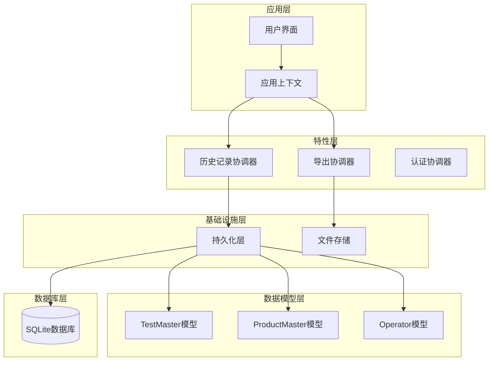
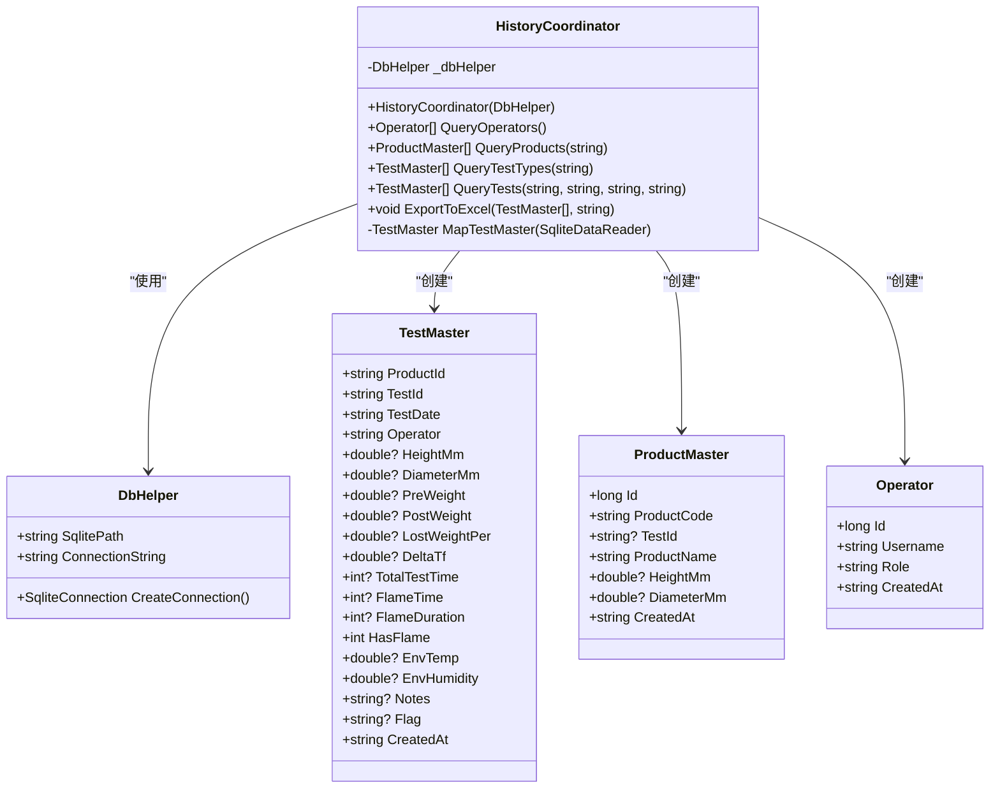
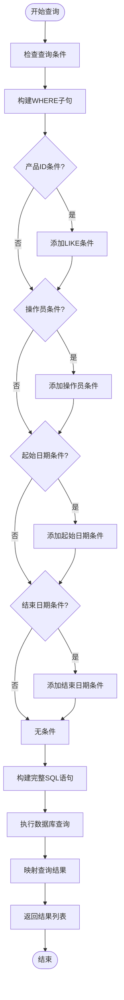
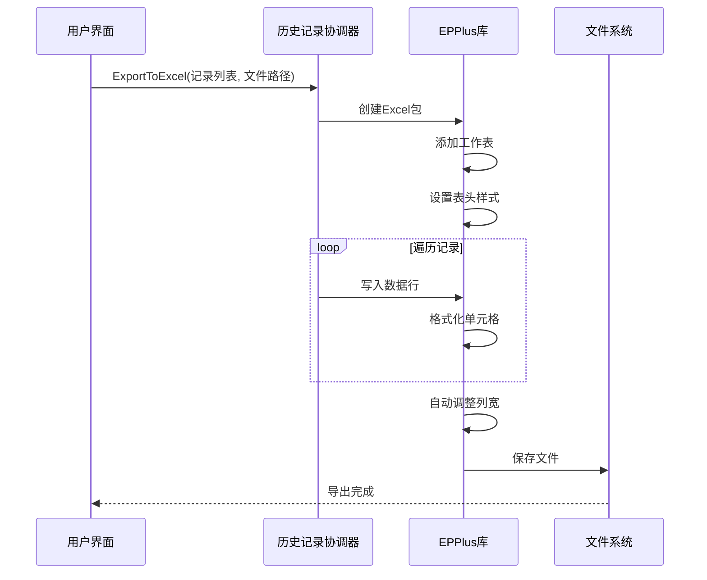
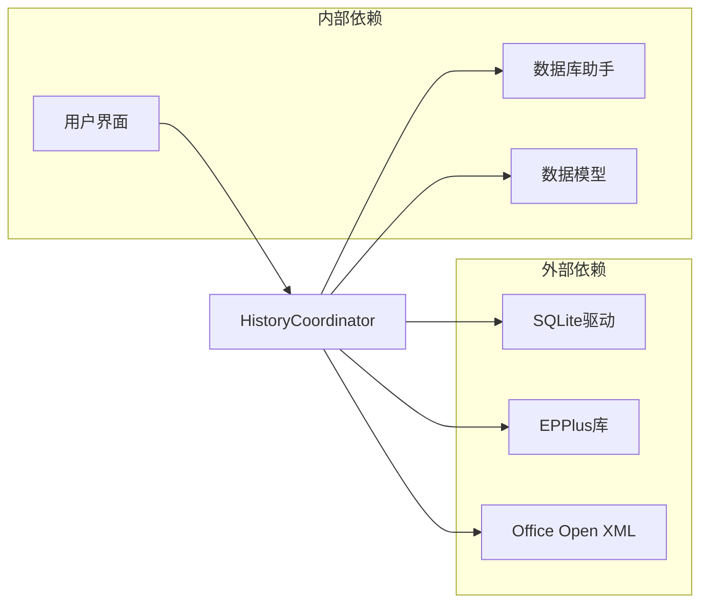

# 历史记录协调器

<cite>
**本文档引用的文件**
- [HistoryCoordinator.cs](file://src/ISO11820.App/Features/History/HistoryCoordinator.cs)
- [TestMaster.cs](file://src/ISO11820.App/Infrastructure/Persistence/Models/TestMaster.cs)
- [ProductMaster.cs](file://src/ISO11820.App/Infrastructure/Persistence/Models/ProductMaster.cs)
- [Operator.cs](file://src/ISO11820.App/Infrastructure/Persistence/Models/Operator.cs)
- [DbHelper.cs](file://src/ISO11820.App/Infrastructure/Persistence/DbHelper.cs)
- [DatabaseInitializer.cs](file://src/ISO11820.App/Infrastructure/Persistence/DatabaseInitializer.cs)
- [HistoryCoordinatorTests.cs](file://tests/ISO11820.Tests/Persistence/HistoryCoordinatorTests.cs)
- [MainForm.cs](file://src/ISO11820.App/UI/Forms/MainForm.cs)
- [Iso11820AppContext.cs](file://src/ISO11820.App/App/Iso11820AppContext.cs)
</cite>

## 目录
1. [简介](#简介)
2. [项目结构](#项目结构)
3. [核心组件](#核心组件)
4. [架构概览](#架构概览)
5. [详细组件分析](#详细组件分析)
6. [依赖关系分析](#依赖关系分析)
7. [性能考虑](#性能考虑)
8. [故障排除指南](#故障排除指南)
9. [结论](#结论)
10. [附录](#附录)

## 简介
历史记录协调器是ISO11820应用中的关键组件，负责管理试验历史数据的查询、分析和导出功能。该组件提供了完整的试验记录检索接口，支持复杂的多条件查询、数据筛选、排序和统计分析，并集成了Excel导出功能以生成报表。

该协调器基于SQLite数据库，采用轻量级的设计模式，通过DbHelper提供数据库连接管理，通过多个模型类封装数据结构。系统支持操作员管理、产品信息管理和试验记录查询等核心功能。

## 项目结构
历史记录协调器位于应用的特性层中，采用清晰的分层架构设计：

**图表来源**
- [HistoryCoordinator.cs:1-241](file://src/ISO11820.App/Features/History/HistoryCoordinator.cs#L1-L241)
- [Iso11820AppContext.cs:15-69](file://src/ISO11820.App/App/Iso11820AppContext.cs#L15-L69)

**章节来源**
- [HistoryCoordinator.cs:1-241](file://src/ISO11820.App/Features/History/HistoryCoordinator.cs#L1-L241)
- [Iso11820AppContext.cs:15-69](file://src/ISO11820.App/App/Iso11820AppContext.cs#L15-L69)

## 核心组件
历史记录协调器包含以下核心组件：

### 主要功能模块
1. **试验记录查询模块** - 支持多条件组合查询
2. **数据导出模块** - 提供Excel格式导出功能
3. **基础数据查询模块** - 操作员和产品信息查询
4. **数据映射模块** - 将数据库记录映射到强类型对象

### 数据模型
- **TestMaster**: 试验主记录模型，包含完整的试验数据
- **ProductMaster**: 产品主记录模型，管理产品基本信息
- **Operator**: 操作员模型，维护用户信息

**章节来源**
- [HistoryCoordinator.cs:8-241](file://src/ISO11820.App/Features/History/HistoryCoordinator.cs#L8-L241)
- [TestMaster.cs:1-47](file://src/ISO11820.App/Infrastructure/Persistence/Models/TestMaster.cs#L1-L47)
- [ProductMaster.cs:1-21](file://src/ISO11820.App/Infrastructure/Persistence/Models/ProductMaster.cs#L1-L21)
- [Operator.cs:1-14](file://src/ISO11820.App/Infrastructure/Persistence/Models/Operator.cs#L1-L14)

## 架构概览
历史记录协调器采用经典的三层架构模式，实现了关注点分离和良好的可扩展性：

**图表来源**
- [HistoryCoordinator.cs:8-241](file://src/ISO11820.App/Features/History/HistoryCoordinator.cs#L8-L241)
- [DbHelper.cs:5-22](file://src/ISO11820.App/Infrastructure/Persistence/DbHelper.cs#L5-L22)
- [TestMaster.cs:3-47](file://src/ISO11820.App/Infrastructure/Persistence/Models/TestMaster.cs#L3-L47)
- [ProductMaster.cs:3-21](file://src/ISO11820.App/Infrastructure/Persistence/Models/ProductMaster.cs#L3-L21)
- [Operator.cs:3-14](file://src/ISO11820.App/Infrastructure/Persistence/Models/Operator.cs#L3-L14)

## 详细组件分析

### 试验记录查询组件
试验记录查询是历史记录协调器的核心功能，支持灵活的多条件组合查询：

#### 查询条件构建机制
系统采用动态SQL构建技术，根据提供的条件动态生成WHERE子句：

**图表来源**
- [HistoryCoordinator.cs:103-157](file://src/ISO11820.App/Features/History/HistoryCoordinator.cs#L103-L157)

#### 查询参数详解
- **productIdLike**: 支持模糊匹配的样品编号查询
- **operatorName**: 精确匹配的操作员姓名查询
- **dateFrom**: 起始日期范围查询
- **dateTo**: 结束日期范围查询

所有参数均为可选，未提供的条件不会参与筛选，确保查询的灵活性。

**章节来源**
- [HistoryCoordinator.cs:99-157](file://src/ISO11820.App/Features/History/HistoryCoordinator.cs#L99-L157)

### 数据导出组件
历史记录协调器提供了完整的Excel导出功能，支持将查询结果转换为标准格式：

#### 导出流程

**图表来源**
- [HistoryCoordinator.cs:162-212](file://src/ISO11820.App/Features/History/HistoryCoordinator.cs#L162-L212)

#### 导出字段映射
导出功能支持以下字段的标准化输出：
- 样品编号、试验标识、试验日期
- 操作员、样品名称、规格
- 物理参数：高度、直径、重量
- 试验参数：ΔTf、总时间、火焰参数
- 环境参数：温度、湿度
- 其他信息：备注、标志

**章节来源**
- [HistoryCoordinator.cs:162-212](file://src/ISO11820.App/Features/History/HistoryCoordinator.cs#L162-L212)

### 基础数据查询组件
历史记录协调器还提供了基础数据的查询功能：

#### 操作员查询
支持获取所有操作员信息，包括用户名、角色和创建时间等字段。

#### 产品查询
提供两种查询模式：
- 全部产品查询（无参数）
- 指定产品代码查询（带参数）

#### 测试类型查询
支持按产品ID过滤的测试类型查询，便于了解特定产品的试验类型。

**章节来源**
- [HistoryCoordinator.cs:17-97](file://src/ISO11820.App/Features/History/HistoryCoordinator.cs#L17-L97)

### 数据模型设计
历史记录协调器使用强类型数据模型来封装数据库记录：

#### TestMaster模型
试验主记录模型包含了完整的试验数据结构，支持空值处理和类型安全访问。

#### ProductMaster模型  
产品主记录模型管理产品基本信息，包括尺寸规格等属性。

#### Operator模型
操作员模型维护用户身份信息，支持角色权限管理。

**章节来源**
- [TestMaster.cs:1-47](file://src/ISO11820.App/Infrastructure/Persistence/Models/TestMaster.cs#L1-L47)
- [ProductMaster.cs:1-21](file://src/ISO11820.App/Infrastructure/Persistence/Models/ProductMaster.cs#L1-L21)
- [Operator.cs:1-14](file://src/ISO11820.App/Infrastructure/Persistence/Models/Operator.cs#L1-L14)

## 依赖关系分析
历史记录协调器的依赖关系体现了清晰的架构层次：

**图表来源**
- [HistoryCoordinator.cs:1-5](file://src/ISO11820.App/Features/History/HistoryCoordinator.cs#L1-L5)
- [DbHelper.cs:1-22](file://src/ISO11820.App/Infrastructure/Persistence/DbHelper.cs#L1-L22)

### 关键依赖关系
1. **DbHelper依赖**: 提供统一的数据库连接管理
2. **数据模型依赖**: 强类型模型确保类型安全
3. **Excel导出依赖**: EPPlus库提供Excel文件处理能力
4. **UI集成依赖**: 与用户界面紧密集成，提供实时数据展示

**章节来源**
- [HistoryCoordinator.cs:1-241](file://src/ISO11820.App/Features/History/HistoryCoordinator.cs#L1-L241)
- [DbHelper.cs:5-22](file://src/ISO11820.App/Infrastructure/Persistence/DbHelper.cs#L5-L22)

## 性能考虑
针对历史记录协调器的性能优化策略：

### 查询性能优化
1. **参数化查询**: 所有用户输入都通过参数绑定，防止SQL注入并提高查询缓存效率
2. **动态SQL构建**: 根据实际需要构建SQL语句，避免不必要的条件判断
3. **批量数据处理**: 对大量数据采用流式读取，减少内存占用

### 数据库优化建议
1. **索引设计**: 建议在常用查询字段上建立索引
2. **查询优化**: 对于大数据量场景，考虑分页查询机制
3. **连接池管理**: 合理管理数据库连接生命周期

### 缓存策略
1. **结果缓存**: 对频繁查询的结果进行短期缓存
2. **配置缓存**: 缓存基础数据如操作员信息
3. **查询计划缓存**: 利用SQLite的查询计划缓存机制

**章节来源**
- [HistoryCoordinator.cs:103-157](file://src/ISO11820.App/Features/History/HistoryCoordinator.cs#L103-L157)
- [DbHelper.cs:16-21](file://src/ISO11820.App/Infrastructure/Persistence/DbHelper.cs#L16-L21)

## 故障排除指南
历史记录协调器的常见问题及解决方案：

### 连接问题
- **数据库文件不存在**: 确保DatabaseInitializer正确初始化数据库
- **权限问题**: 检查数据库文件的读写权限
- **连接超时**: 检查数据库连接字符串配置

### 查询问题
- **查询结果为空**: 验证查询条件是否过于严格
- **性能问题**: 考虑添加适当的索引或优化查询条件
- **内存溢出**: 对大量数据采用分批处理方式

### 导出问题
- **Excel文件损坏**: 检查EPPlus库版本兼容性
- **文件权限**: 确保目标目录具有写入权限
- **大文件处理**: 对超大导出文件考虑分块处理

**章节来源**
- [HistoryCoordinatorTests.cs:1-92](file://tests/ISO11820.Tests/Persistence/HistoryCoordinatorTests.cs#L1-L92)

## 结论
历史记录协调器是一个设计良好、功能完整的试验历史数据管理组件。它采用了清晰的分层架构，提供了灵活的查询接口和实用的导出功能。通过强类型数据模型和参数化查询，确保了系统的安全性、可维护性和可扩展性。

该组件为ISO11820应用提供了坚实的历史数据管理基础，支持日常的试验记录查询、数据分析和报表生成需求。未来可以进一步增强的功能包括分页查询、高级统计分析、数据可视化等。

## 附录

### API参考文档

#### QueryTests方法
- **功能**: 组合条件查询试验记录
- **参数**:
  - productIdLike: 样品编号模糊匹配
  - operatorName: 操作员姓名精确匹配
  - dateFrom: 起始日期
  - dateTo: 结束日期
- **返回值**: 符合条件的TestMaster对象列表

#### ExportToExcel方法
- **功能**: 将查询结果导出为Excel文件
- **参数**:
  - records: TestMaster对象列表
  - filePath: 输出文件路径
- **返回值**: 无（文件保存到指定路径）

#### QueryOperators方法
- **功能**: 获取所有操作员信息
- **参数**: 无
- **返回值**: Operator对象列表

#### QueryProducts方法
- **功能**: 查询产品信息
- **参数**: 
  - productCode: 产品代码（可选）
- **返回值**: ProductMaster对象列表

#### QueryTestTypes方法
- **功能**: 查询测试类型
- **参数**:
  - productId: 产品ID（可选）
- **返回值**: TestMaster对象列表

### 查询示例
1. **基本查询**: 查询所有试验记录
2. **条件查询**: 按操作员和日期范围查询
3. **模糊查询**: 按样品编号模糊匹配查询
4. **组合查询**: 多条件组合查询

### 性能调优建议
1. **索引优化**: 在常用查询字段上建立索引
2. **查询优化**: 使用LIMIT和OFFSET实现分页
3. **连接优化**: 合理管理数据库连接池
4. **内存优化**: 对大数据量采用流式处理

**章节来源**
- [HistoryCoordinator.cs:103-212](file://src/ISO11820.App/Features/History/HistoryCoordinator.cs#L103-L212)
- [MainForm.cs:735-808](file://src/ISO11820.App/UI/Forms/MainForm.cs#L735-L808)