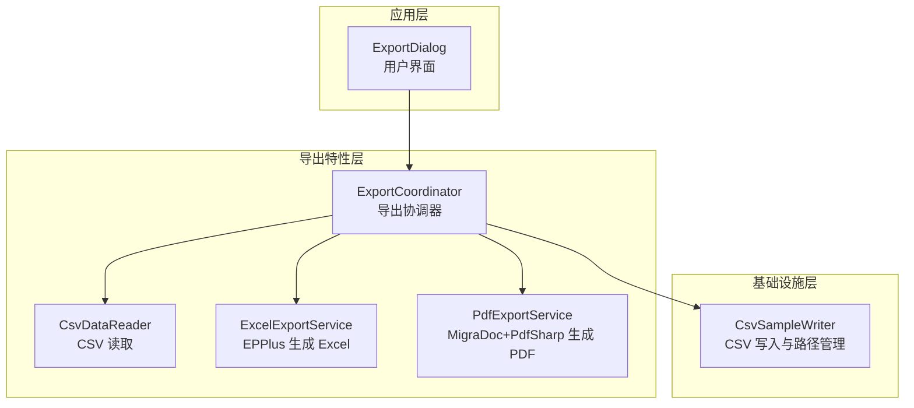
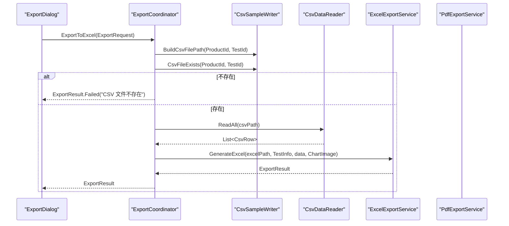
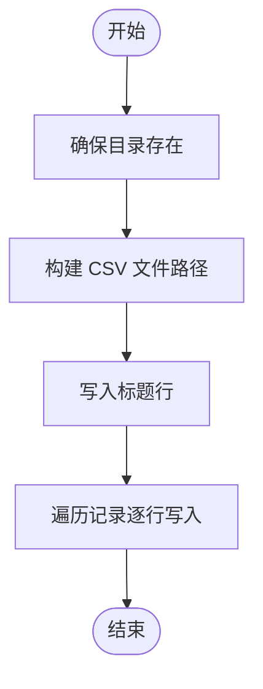
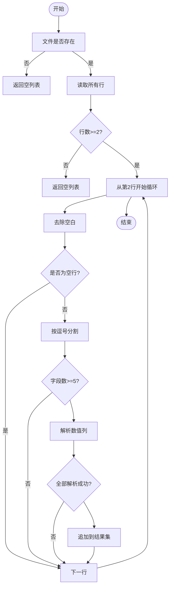
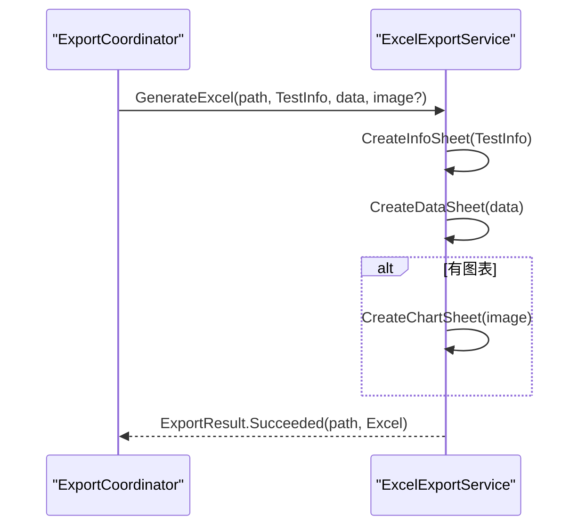
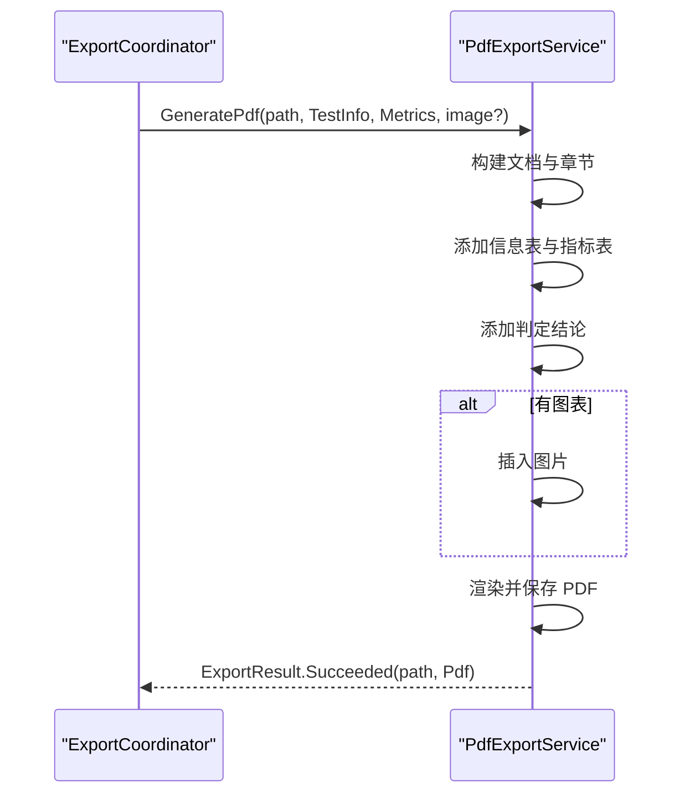
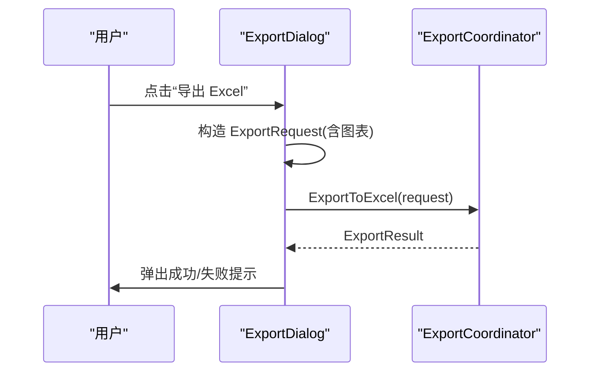
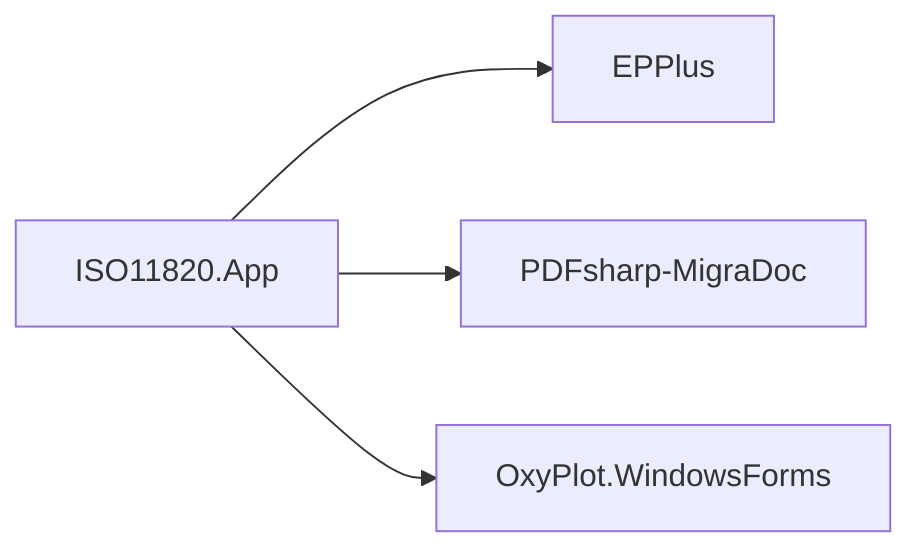

# 导出协调器

<cite>
**本文引用的文件**   
- [ExportCoordinator.cs](file://src/ISO11820.App/Features/Export/ExportCoordinator.cs)
- [CsvDataReader.cs](file://src/ISO11820.App/Features/Export/CsvDataReader.cs)
- [ExcelExportService.cs](file://src/ISO11820.App/Features/Export/ExcelExportService.cs)
- [PdfExportService.cs](file://src/ISO11820.App/Features/Export/PdfExportService.cs)
- [CsvSampleWriter.cs](file://src/ISO11820.App/Infrastructure/FileStorage/CsvSampleWriter.cs)
- [ExportDialog.cs](file://src/ISO11820.App/UI/Dialogs/ExportDialog.cs)
- [TestRecordModels.cs](file://src/ISO11820.App/Shared/Models/Records/TestRecordModels.cs)
- [ExportCoordinatorTests.cs](file://tests/ISO11820.Tests/Features/ExportCoordinatorTests.cs)
- [ISO11820.App.csproj](file://src/ISO11820.App/ISO11820.App.csproj)
</cite>

## 目录
1. [简介](#简介)
2. [项目结构](#项目结构)
3. [核心组件](#核心组件)
4. [架构总览](#架构总览)
5. [详细组件分析](#详细组件分析)
6. [依赖关系分析](#依赖关系分析)
7. [性能与扩展性](#性能与扩展性)
8. [故障排查指南](#故障排查指南)
9. [结论](#结论)
10. [附录：API 参考与配置](#附录api-参考与配置)

## 简介
本文件围绕“导出协调器”进行系统化文档化，重点解释 ExportCoordinator 的多格式数据导出能力与报告生成机制。内容覆盖 CSV 数据读取、Excel 报告生成、PDF 文档输出的完整流程；导出服务接口设计、模板引擎使用与数据转换逻辑；并给出批量导出处理、进度跟踪、错误恢复等高级功能的实现建议；同时说明导出文件的命名规则、目录结构与版本控制策略，并提供自定义导出模板的开发指南、完整的 API 参考、导出配置选项与性能优化技巧。

## 项目结构
导出功能位于 Features/Export 目录下，由协调器统一编排，具体格式由独立服务实现，CSV 读写由基础设施层提供。UI 通过对话框触发导出操作。

图表来源
- [ExportCoordinator.cs:1-229](file://src/ISO11820.App/Features/Export/ExportCoordinator.cs#L1-L229)
- [CsvDataReader.cs:1-72](file://src/ISO11820.App/Features/Export/CsvDataReader.cs#L1-L72)
- [ExcelExportService.cs:1-143](file://src/ISO11820.App/Features/Export/ExcelExportService.cs#L1-L143)
- [PdfExportService.cs:1-139](file://src/ISO11820.App/Features/Export/PdfExportService.cs#L1-L139)
- [CsvSampleWriter.cs:1-81](file://src/ISO11820.App/Infrastructure/FileStorage/CsvSampleWriter.cs#L1-L81)
- [ExportDialog.cs:1-284](file://src/ISO11820.App/UI/Dialogs/ExportDialog.cs#L1-L284)

章节来源
- [ExportCoordinator.cs:1-229](file://src/ISO11820.App/Features/Export/ExportCoordinator.cs#L1-L229)
- [CsvSampleWriter.cs:1-81](file://src/ISO11820.App/Infrastructure/FileStorage/CsvSampleWriter.cs#L1-L81)
- [ExportDialog.cs:1-284](file://src/ISO11820.App/UI/Dialogs/ExportDialog.cs#L1-L284)

## 核心组件
- ExportCoordinator：对外暴露统一的导出入口，负责参数校验、路径构建、调用各格式服务、返回标准化结果。
- CsvSampleWriter：负责传感器数据的 CSV 写入、目录与文件路径构建、存在性检查。
- CsvDataReader：将 sensor_data.csv 解析为结构化行集合，供 Excel/PDF 使用。
- ExcelExportService：基于 EPPlus 生成包含试验信息、温度数据和可选图表的 Excel 文件。
- PdfExportService：基于 MigraDoc + PdfSharp 生成包含试验信息、指标、判定结论和可选图表的 PDF 报告。
- ExportDialog：WinForms 对话框，封装导出按钮事件，调用协调器并展示结果。

章节来源
- [ExportCoordinator.cs:1-229](file://src/ISO11820.App/Features/Export/ExportCoordinator.cs#L1-L229)
- [CsvSampleWriter.cs:1-81](file://src/ISO11820.App/Infrastructure/FileStorage/CsvSampleWriter.cs#L1-L81)
- [CsvDataReader.cs:1-72](file://src/ISO11820.App/Features/Export/CsvDataReader.cs#L1-L72)
- [ExcelExportService.cs:1-143](file://src/ISO11820.App/Features/Export/ExcelExportService.cs#L1-L143)
- [PdfExportService.cs:1-139](file://src/ISO11820.App/Features/Export/PdfExportService.cs#L1-L139)
- [ExportDialog.cs:1-284](file://src/ISO11820.App/UI/Dialogs/ExportDialog.cs#L1-L284)

## 架构总览
导出协调器采用“协调者 + 专用服务”的分层设计：UI 仅与协调器交互；协调器组合基础设施（CSV 写入）与导出服务（Excel/PDF），并通过请求/响应对象完成数据传递。

```mermaid
classDiagram
class ExportCoordinator {
+ExportToCsv(request) ExportResult
+SaveSensorDataToCsv(productId, testId, records) void
+ExportToExcel(request) ExportResult
+ExportToPdf(request) ExportResult
+GetExportFiles(productId, testId) ExportFileInfo[]
+GetOutputDirectory(productId, testId) string
}
class CsvSampleWriter {
+BuildTestDirectory(productId, testId) string
+BuildCsvFilePath(productId, testId) string
+EnsureDirectoryExists(productId, testId) string
+WriteSensorData(productId, testId, records) void
+CsvFileExists(productId, testId) bool
}
class CsvDataReader {
+ReadAll(csvFilePath) CsvRow[]
}
class ExcelExportService {
+GenerateExcel(outputPath, testInfo, data, chartImage) ExportResult
}
class PdfExportService {
+GeneratePdf(outputPath, testInfo, metrics, chartImage) ExportResult
}
class ExportRequest {
+ProductId : string
+TestId : string
+Options : ExportOptions?
+TestInfo : TestInfoSummary?
+ChartImage : Image?
+Metrics : TestMetrics?
}
class ExportResult {
+Success : bool
+FilePath : string?
+Format : ExportFormat
+Message : string?
+Error : string?
}
class ExportFileInfo {
+FilePath : string
+Format : ExportFormat
+FileSize : long
}
class TestInfoSummary {
+TestId : string
+ProductId : string
+Operator : string
+TestTime : DateTime
+DurationSeconds : int
}
class TestMetrics {
+DeltaTf : double
+LostWeightPercent : double
+FlameDurationSeconds : double
+IsQualified : bool
+JudgmentText : string
}
ExportCoordinator --> CsvSampleWriter : "依赖"
ExportCoordinator --> CsvDataReader : "依赖"
ExportCoordinator --> ExcelExportService : "依赖"
ExportCoordinator --> PdfExportService : "依赖"
ExportCoordinator --> ExportRequest : "使用"
ExportCoordinator --> ExportResult : "返回"
ExportCoordinator --> ExportFileInfo : "返回"
ExportCoordinator --> TestInfoSummary : "使用"
ExportCoordinator --> TestMetrics : "使用"
```

图表来源
- [ExportCoordinator.cs:1-229](file://src/ISO11820.App/Features/Export/ExportCoordinator.cs#L1-L229)
- [CsvSampleWriter.cs:1-81](file://src/ISO11820.App/Infrastructure/FileStorage/CsvSampleWriter.cs#L1-L81)
- [CsvDataReader.cs:1-72](file://src/ISO11820.App/Features/Export/CsvDataReader.cs#L1-L72)
- [ExcelExportService.cs:1-143](file://src/ISO11820.App/Features/Export/ExcelExportService.cs#L1-L143)
- [PdfExportService.cs:1-139](file://src/ISO11820.App/Features/Export/PdfExportService.cs#L1-L139)

## 详细组件分析

### ExportCoordinator 协调器
职责
- 统一入口：对外暴露 CSV/Excel/PDF 导出方法。
- 路径与文件管理：委托 CsvSampleWriter 构建输出目录与文件名。
- 数据准备：从 CSV 读取数据，组装 TestInfoSummary/TestMetrics。
- 错误处理：捕获异常并返回失败结果。
- 文件清单：列出某次试验已生成的导出文件。

关键流程
- CSV 导出：校验源 CSV 是否存在，返回成功结果或失败原因。
- Excel 导出：读取 CSV → 构造测试信息 → 调用 Excel 服务 → 返回结果。
- PDF 导出：读取 CSV → 构造测试信息与指标 → 调用 PDF 服务 → 返回结果。
- 获取导出文件：扫描目标目录，返回存在的 CSV/Excel/PDF 文件信息。

图表来源
- [ExportCoordinator.cs:54-85](file://src/ISO11820.App/Features/Export/ExportCoordinator.cs#L54-L85)
- [CsvSampleWriter.cs:17-38](file://src/ISO11820.App/Infrastructure/FileStorage/CsvSampleWriter.cs#L17-L38)
- [CsvDataReader.cs:25-70](file://src/ISO11820.App/Features/Export/CsvDataReader.cs#L25-L70)
- [ExcelExportService.cs:28-60](file://src/ISO11820.App/Features/Export/ExcelExportService.cs#L28-L60)

章节来源
- [ExportCoordinator.cs:24-155](file://src/ISO11820.App/Features/Export/ExportCoordinator.cs#L24-L155)

### CsvSampleWriter 基础设施
职责
- 目录与路径：按“基础目录/TestData/产品ID/试验ID”组织输出。
- 写入传感器数据：以 UTF-8 编码写出 CSV，首行为标题，后续每行一个采样点。
- 存在性检查：判断指定试验是否已有 CSV。

命名与目录规则
- 目录结构：{BaseDir}/TestData/{ProductId}/{TestId}
- 文件名：sensor_data.csv
- 列定义：Timestamp, Channel1..Channel12（实际导出时仅使用前 5 列用于 Excel/PDF）

图表来源
- [CsvSampleWriter.cs:31-54](file://src/ISO11820.App/Infrastructure/FileStorage/CsvSampleWriter.cs#L31-L54)

章节来源
- [CsvSampleWriter.cs:1-81](file://src/ISO11820.App/Infrastructure/FileStorage/CsvSampleWriter.cs#L1-L81)

### CsvDataReader 数据读取
职责
- 读取 sensor_data.csv，跳过标题行，解析数值列到 CsvRow 列表。
- 容错处理：空行、字段不足、数值解析失败均跳过该行。

数据模型
- CsvRow：ElapsedSeconds、Furnace1、Furnace2、Surface、Center

图表来源
- [CsvDataReader.cs:25-70](file://src/ISO11820.App/Features/Export/CsvDataReader.cs#L25-L70)

章节来源
- [CsvDataReader.cs:1-72](file://src/ISO11820.App/Features/Export/CsvDataReader.cs#L1-L72)

### ExcelExportService 报告生成
职责
- 使用 EPPlus 创建包含三个工作表的 Excel 文件：
  - “试验信息”：试验编号、样品编号、操作员、时间、时长等。
  - “温度数据”：时间序列与四通道温度。
  - “温度曲线”：嵌入图表图片（可选）。

模板与样式
- 表头加粗、合并单元格、列宽设置。
- 图片通过临时文件方式插入后清理。

图表来源
- [ExcelExportService.cs:28-60](file://src/ISO11820.App/Features/Export/ExcelExportService.cs#L28-L60)
- [ExcelExportService.cs:62-141](file://src/ISO11820.App/Features/Export/ExcelExportService.cs#L62-L141)

章节来源
- [ExcelExportService.cs:1-143](file://src/ISO11820.App/Features/Export/ExcelExportService.cs#L1-L143)

### PdfExportService 报告生成
职责
- 使用 MigraDoc + PdfSharp 生成 PDF 报告，包含：
  - 标题与试验信息表格
  - 试验指标表格
  - 判定结论（合格/不合格，颜色区分）
  - 温度曲线图片（可选）

模板与渲染
- 段落、表格、字体大小、对齐、边框宽度等排版。
- 图片同样通过临时文件插入后清理。

图表来源
- [PdfExportService.cs:10-35](file://src/ISO11820.App/Features/Export/PdfExportService.cs#L10-L35)
- [PdfExportService.cs:37-129](file://src/ISO11820.App/Features/Export/PdfExportService.cs#L37-L129)

章节来源
- [PdfExportService.cs:1-139](file://src/ISO11820.App/Features/Export/PdfExportService.cs#L1-L139)

### ExportDialog 用户交互
职责
- 提供“导出 CSV/Excel/PDF”按钮，构造 ExportRequest 并调用协调器。
- 显示成功/失败消息，支持打开导出目录。

图表来源
- [ExportDialog.cs:215-237](file://src/ISO11820.App/UI/Dialogs/ExportDialog.cs#L215-L237)
- [ExportDialog.cs:239-261](file://src/ISO11820.App/UI/Dialogs/ExportDialog.cs#L239-L261)

章节来源
- [ExportDialog.cs:1-284](file://src/ISO11820.App/UI/Dialogs/ExportDialog.cs#L1-L284)

## 依赖关系分析
外部库
- EPPlus：Excel 生成
- PDFsharp-MigraDoc：PDF 生成
- OxyPlot.WindowsForms：图表绘制（由上层提供图片）
- Serilog：日志（非导出核心链路）

图表来源
- [ISO11820.App.csproj:6-14](file://src/ISO11820.App/ISO11820.App.csproj#L6-L14)

章节来源
- [ISO11820.App.csproj:1-29](file://src/ISO11820.App/ISO11820.App.csproj#L1-L29)

## 性能与扩展性

### 批量导出处理
- 建议在协调器新增批量方法，接收多个 ExportRequest，内部串行或并行执行。
- 并发策略：
  - 使用 Task.WhenAll 并行执行，但限制最大并发度以避免 IO 瓶颈。
  - 对每个任务捕获异常，汇总失败项，避免单点失败导致整体中断。
- 资源释放：确保 ExcelPackage 与 PDF 渲染对象在 using 块中释放。

### 进度跟踪
- 引入回调或事件：在导出前、每步完成后、最终结果处上报进度。
- 对于大文件，可在 CSV 读取与写入阶段分块上报进度百分比。
- UI 侧可绑定进度条与取消令牌，提升用户体验。

### 错误恢复
- 文件级重试：针对临时 IO 错误（如权限、占用）进行有限次数重试。
- 回滚策略：若中间步骤失败，删除未完成的中间产物（如临时图片）。
- 诊断信息：在 ExportResult.Error 中保留原始异常类型与简要上下文。

### 内存与 I/O 优化
- CSV 读取：对超大文件考虑流式解析，避免一次性加载到内存。
- Excel 写入：使用只写模式，减少不必要的样式计算。
- 图片处理：压缩图片尺寸与质量，减少 PDF/Excel 体积。

[本节为通用指导，不直接分析具体文件]

## 故障排查指南
常见问题与定位
- CSV 文件不存在：检查 CsvSampleWriter 的路径构建与写入时机，确认 BaseDir 是否正确。
- Excel/PDF 导出失败：查看 ExportResult.Error 中的异常信息；确认依赖库安装与许可证。
- 图表缺失：确认传入的 ChartImage 是否为 null；检查临时文件写入权限。
- 目录权限问题：确保运行账户对输出目录具有写入权限。

验证手段
- 单元测试：参考 ExportCoordinatorTests 中的断言，快速复现与回归。
- 日志：结合 Serilog 记录关键步骤与异常堆栈。

章节来源
- [ExportCoordinatorTests.cs:1-242](file://tests/ISO11820.Tests/Features/ExportCoordinatorTests.cs#L1-L242)

## 结论
导出协调器以清晰的分层与职责分离实现了多格式导出能力，配合基础设施层的 CSV 管理与 UI 层的交互，形成稳定可扩展的导出子系统。通过引入批量、进度、错误恢复与性能优化策略，可进一步提升系统在生产环境中的可靠性与效率。

[本节为总结，不直接分析具体文件]

## 附录：API 参考与配置

### 公共 API 概览
- ExportCoordinator.ExportToCsv(ExportRequest) → ExportResult
- ExportCoordinator.SaveSensorDataToCsv(string productId, string testId, IReadOnlyList<SensorDataRecord>) → void
- ExportCoordinator.ExportToExcel(ExportRequest) → ExportResult
- ExportCoordinator.ExportToPdf(ExportRequest) → ExportResult
- ExportCoordinator.GetExportFiles(string productId, string testId) → ExportFileInfo[]
- ExportCoordinator.GetOutputDirectory(string productId, string testId) → string

章节来源
- [ExportCoordinator.cs:24-155](file://src/ISO11820.App/Features/Export/ExportCoordinator.cs#L24-L155)

### 数据结构
- ExportRequest：包含 ProductId、TestId、Options、TestInfo、ChartImage、Metrics
- ExportOptions：IncludeRawData、IncludeStatistics（默认均为 true）
- ExportResult：Success、FilePath、Format、Message、Error
- ExportFileInfo：FilePath、Format、FileSize
- TestInfoSummary：TestId、ProductId、Operator、TestTime、DurationSeconds
- TestMetrics：DeltaTf、LostWeightPercent、FlameDurationSeconds、IsQualified、JudgmentText
- SensorDataRecord：Timestamp、ChannelValues（数组）

章节来源
- [ExportCoordinator.cs:157-229](file://src/ISO11820.App/Features/Export/ExportCoordinator.cs#L157-L229)
- [CsvSampleWriter.cs:76-81](file://src/ISO11820.App/Infrastructure/FileStorage/CsvSampleWriter.cs#L76-L81)
- [TestRecordModels.cs:1-107](file://src/ISO11820.App/Shared/Models/Records/TestRecordModels.cs#L1-L107)

### 导出配置选项
- IncludeRawData：是否在报告中包含原始数据（当前 Excel/PDF 默认包含）
- IncludeStatistics：是否包含统计与判定结论（PDF 默认包含）
- ChartImage：可选图表图片，用于 Excel/PDF 嵌入

章节来源
- [ExportCoordinator.cs:167-171](file://src/ISO11820.App/Features/Export/ExportCoordinator.cs#L167-L171)
- [ExportCoordinator.cs:100-118](file://src/ISO11820.App/Features/Export/ExportCoordinator.cs#L100-L118)

### 命名规则与目录结构
- 目录：{BaseDir}/TestData/{ProductId}/{TestId}
- 文件：
  - sensor_data.csv（传感器原始数据）
  - sensor_data.xlsx（Excel 报告）
  - test_report.pdf（PDF 报告）

章节来源
- [CsvSampleWriter.cs:17-29](file://src/ISO11820.App/Infrastructure/FileStorage/CsvSampleWriter.cs#L17-L29)
- [ExportCoordinator.cs:121-149](file://src/ISO11820.App/Features/Export/ExportCoordinator.cs#L121-L149)

### 版本控制策略建议
- 文件名中加入版本号或时间戳，例如 sensor_data_v1.xlsx、test_report_v1.pdf。
- 在目录内维护 README 或 manifest.json，记录导出元数据与版本历史。
- 对重要报告归档至独立版本目录，便于审计与回溯。

[本节为通用指导，不直接分析具体文件]

### 自定义导出模板开发指南
- 新增格式服务：实现新的导出服务类，遵循 ExportResult 返回约定。
- 模板引擎：
  - Excel：基于 EPPlus 的 Worksheet 与样式 API 定制布局。
  - PDF：基于 MigraDoc 的 Document/Section/Table 构建页面。
- 数据转换：复用 CsvDataReader 的输出 CsvRow，或扩展新模型。
- 集成协调器：在 ExportCoordinator 中添加新方法，注册新服务实例。

章节来源
- [ExcelExportService.cs:28-60](file://src/ISO11820.App/Features/Export/ExcelExportService.cs#L28-L60)
- [PdfExportService.cs:10-35](file://src/ISO11820.App/Features/Export/PdfExportService.cs#L10-L35)
- [ExportCoordinator.cs:54-118](file://src/ISO11820.App/Features/Export/ExportCoordinator.cs#L54-L118)