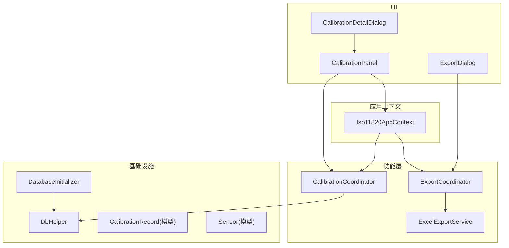
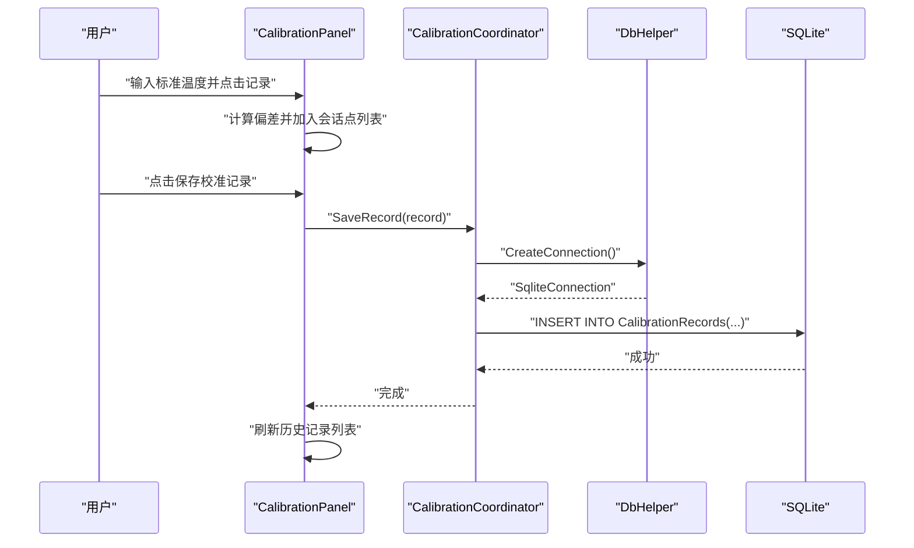
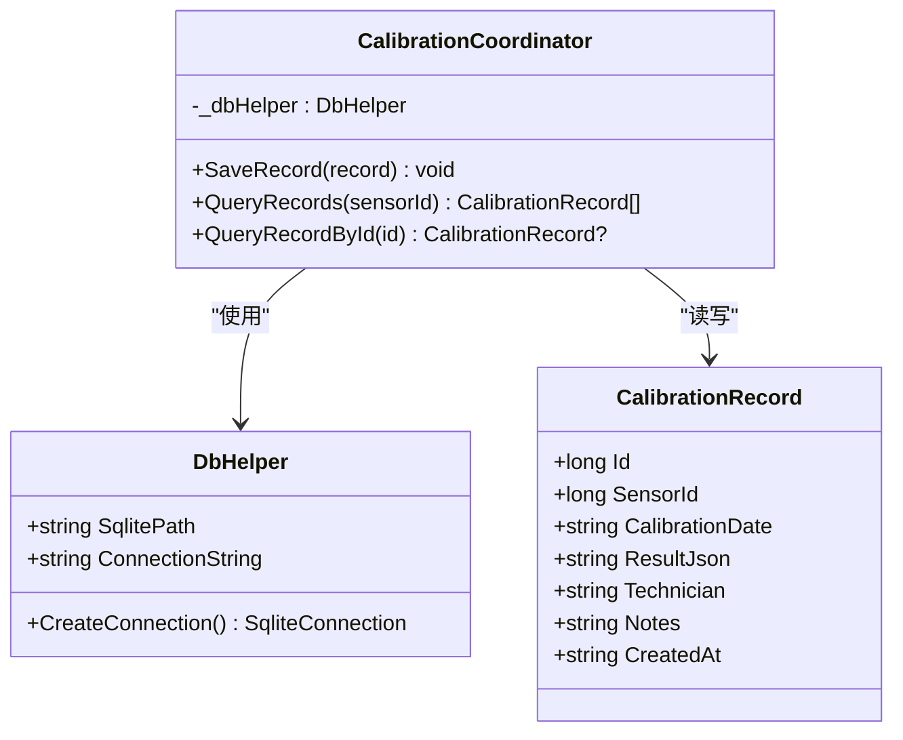
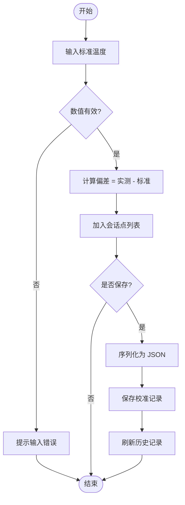
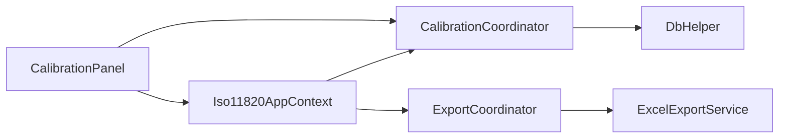

# 校准协调器

<cite>
**本文引用的文件**   
- [CalibrationCoordinator.cs](file://src/ISO11820.App/Features/Calibration/CalibrationCoordinator.cs)
- [CalibrationRecord.cs](file://src/ISO11820.App/Infrastructure/Persistence/Models/CalibrationRecord.cs)
- [Sensor.cs](file://src/ISO11820.App/Infrastructure/Persistence/Models/Sensor.cs)
- [DatabaseInitializer.cs](file://src/ISO11820.App/Infrastructure/Persistence/DatabaseInitializer.cs)
- [DbHelper.cs](file://src/ISO11820.App/Infrastructure/Persistence/DbHelper.cs)
- [CalibrationPanel.cs](file://src/ISO11820.App/UI/Panels/CalibrationPanel.cs)
- [CalibrationPoint.cs](file://src/ISO11820.App/UI/Panels/CalibrationPoint.cs)
- [CalibrationDetailDialog.cs](file://src/ISO11820.App/UI/Dialogs/CalibrationDetailDialog.cs)
- [Iso11820AppContext.cs](file://src/ISO11820.App/App/Iso11820AppContext.cs)
- [ExportCoordinator.cs](file://src/ISO11820.App/Features/Export/ExportCoordinator.cs)
- [ExcelExportService.cs](file://src/ISO11820.App/Features/Export/ExcelExportService.cs)
- [ExportDialog.cs](file://src/ISO11820.App/UI/Dialogs/ExportDialog.cs)
- [CalibrationCoordinatorTests.cs](file://tests/ISO11820.Tests/Persistence/CalibrationCoordinatorTests.cs)
</cite>

## 目录
1. [简介](#简介)
2. [项目结构](#项目结构)
3. [核心组件](#核心组件)
4. [架构总览](#架构总览)
5. [详细组件分析](#详细组件分析)
6. [依赖关系分析](#依赖关系分析)
7. [性能考虑](#性能考虑)
8. [故障排除指南](#故障排除指南)
9. [结论](#结论)
10. [附录：API参考与使用示例](#附录api参考与使用示例)

## 简介
本文件面向“校准协调器”的完整技术文档，聚焦于 CalibrationCoordinator 类及其在设备校准管理、传感器参数调整、校准流程控制、记录管理与结果展示中的职责。文档同时覆盖 UI 交互（校准面板与详情对话框）、数据持久化（SQLite）、导出能力（CSV/Excel/PDF）以及测试用例，帮助读者快速理解并扩展系统以支持不同传感器的校准适配。

## 项目结构
与校准相关的关键代码分布在以下位置：
- 功能层：Features/Calibration/CalibrationCoordinator.cs
- 持久化模型：Infrastructure/Persistence/Models/CalibrationRecord.cs、Sensor.cs
- 数据库初始化：Infrastructure/Persistence/DatabaseInitializer.cs、DbHelper.cs
- UI 交互：UI/Panels/CalibrationPanel.cs、UI/Dialogs/CalibrationDetailDialog.cs、UI/Panels/CalibrationPoint.cs
- 应用上下文：App/Iso11820AppContext.cs
- 导出能力：Features/Export/ExportCoordinator.cs、Features/Export/ExcelExportService.cs、UI/Dialogs/ExportDialog.cs
- 测试：tests/ISO11820.Tests/Persistence/CalibrationCoordinatorTests.cs

图表来源
- [CalibrationPanel.cs:1-120](file://src/ISO11820.App/UI/Panels/CalibrationPanel.cs#L1-L120)
- [CalibrationDetailDialog.cs:1-97](file://src/ISO11820.App/UI/Dialogs/CalibrationDetailDialog.cs#L1-L97)
- [ExportDialog.cs:1-120](file://src/ISO11820.App/UI/Dialogs/ExportDialog.cs#L1-L120)
- [CalibrationCoordinator.cs:1-91](file://src/ISO11820.App/Features/Calibration/CalibrationCoordinator.cs#L1-L91)
- [ExportCoordinator.cs:1-120](file://src/ISO11820.App/Features/Export/ExportCoordinator.cs#L1-L120)
- [ExcelExportService.cs:1-143](file://src/ISO11820.App/Features/Export/ExcelExportService.cs#L1-L143)
- [DatabaseInitializer.cs:1-120](file://src/ISO11820.App/Infrastructure/Persistence/DatabaseInitializer.cs#L1-L120)
- [DbHelper.cs:1-22](file://src/ISO11820.App/Infrastructure/Persistence/DbHelper.cs#L1-L22)
- [Iso11820AppContext.cs:1-69](file://src/ISO11820.App/App/Iso11820AppContext.cs#L1-L69)

章节来源
- [CalibrationPanel.cs:1-120](file://src/ISO11820.App/UI/Panels/CalibrationPanel.cs#L1-L120)
- [CalibrationCoordinator.cs:1-91](file://src/ISO11820.App/Features/Calibration/CalibrationCoordinator.cs#L1-L91)
- [DatabaseInitializer.cs:1-120](file://src/ISO11820.App/Infrastructure/Persistence/DatabaseInitializer.cs#L1-L120)
- [DbHelper.cs:1-22](file://src/ISO11820.App/Infrastructure/Persistence/DbHelper.cs#L1-L22)
- [Iso11820AppContext.cs:1-69](file://src/ISO11820.App/App/Iso11820AppContext.cs#L1-L69)

## 核心组件
- CalibrationCoordinator：负责校准记录的保存与查询，封装 SQLite 操作，提供按传感器过滤的能力。
- CalibrationRecord：校准记录的数据模型，包含传感器标识、时间、JSON 结果、操作员与备注等字段。
- Sensor：传感器元数据模型，用于关联校准记录与具体传感器。
- DatabaseInitializer：创建数据库表与种子数据，确保运行时环境就绪。
- DbHelper：SQLite 连接工厂，集中管理连接字符串与连接创建。
- CalibrationPanel：UI 会话管理，采集多点校准点，序列化保存为 JSON，并在历史列表中展示摘要。
- CalibrationDetailDialog：展示某条校准记录的详细信息（标准温度、实测温度、偏差、时间）。
- ExportCoordinator/ExcelExportService/ExportDialog：提供试验数据的 CSV/Excel/PDF 导出能力，便于报告归档与分析。
- Iso11820AppContext：应用级上下文，聚合各协调器与服务，供 UI 直接访问。

章节来源
- [CalibrationCoordinator.cs:1-91](file://src/ISO11820.App/Features/Calibration/CalibrationCoordinator.cs#L1-L91)
- [CalibrationRecord.cs:1-18](file://src/ISO11820.App/Infrastructure/Persistence/Models/CalibrationRecord.cs#L1-L18)
- [Sensor.cs:1-14](file://src/ISO11820.App/Infrastructure/Persistence/Models/Sensor.cs#L1-L14)
- [DatabaseInitializer.cs:1-120](file://src/ISO11820.App/Infrastructure/Persistence/DatabaseInitializer.cs#L1-L120)
- [DbHelper.cs:1-22](file://src/ISO11820.App/Infrastructure/Persistence/DbHelper.cs#L1-L22)
- [CalibrationPanel.cs:1-120](file://src/ISO11820.App/UI/Panels/CalibrationPanel.cs#L1-L120)
- [CalibrationDetailDialog.cs:1-97](file://src/ISO11820.App/UI/Dialogs/CalibrationDetailDialog.cs#L1-L97)
- [ExportCoordinator.cs:1-120](file://src/ISO11820.App/Features/Export/ExportCoordinator.cs#L1-L120)
- [ExcelExportService.cs:1-143](file://src/ISO11820.App/Features/Export/ExcelExportService.cs#L1-L143)
- [Iso11820AppContext.cs:1-69](file://src/ISO11820.App/App/Iso11820AppContext.cs#L1-L69)

## 架构总览
校准子系统采用分层设计：UI 层通过 AppContext 调用功能层的 CalibrationCoordinator；后者通过 DbHelper 访问 SQLite 数据库；UI 还集成导出模块，将试验数据输出为多种格式以便归档与分析。

图表来源
- [CalibrationPanel.cs:261-319](file://src/ISO11820.App/UI/Panels/CalibrationPanel.cs#L261-L319)
- [CalibrationCoordinator.cs:16-31](file://src/ISO11820.App/Features/Calibration/CalibrationCoordinator.cs#L16-L31)
- [DbHelper.cs:16-21](file://src/ISO11820.App/Infrastructure/Persistence/DbHelper.cs#L16-L21)

## 详细组件分析

### CalibrationCoordinator 类分析
- 职责
  - 保存校准记录：将校准结果（可为 JSON）写入数据库。
  - 查询校准记录：支持按传感器 ID 过滤，返回按日期倒序排列的记录集合。
  - 按 ID 查询单条记录：用于详情展示或审计追溯。
- 关键实现要点
  - 使用 SqliteCommand 参数化 SQL，避免注入风险。
  - 对可空字段（ResultJson、Technician、Notes）进行 DBNull 处理。
  - 表名使用双引号包裹，保证大小写一致性。
- 复杂度
  - 插入：O(1)
  - 查询：O(n)（n 为匹配记录数），排序由 SQL ORDER BY 完成。
- 错误处理
  - 当前方法未显式捕获异常，上层应结合 UI 提示或日志机制处理。

图表来源
- [CalibrationCoordinator.cs:1-91](file://src/ISO11820.App/Features/Calibration/CalibrationCoordinator.cs#L1-L91)
- [CalibrationRecord.cs:1-18](file://src/ISO11820.App/Infrastructure/Persistence/Models/CalibrationRecord.cs#L1-L18)
- [DbHelper.cs:1-22](file://src/ISO11820.App/Infrastructure/Persistence/DbHelper.cs#L1-L22)

章节来源
- [CalibrationCoordinator.cs:1-91](file://src/ISO11820.App/Features/Calibration/CalibrationCoordinator.cs#L1-L91)
- [CalibrationRecord.cs:1-18](file://src/ISO11820.App/Infrastructure/Persistence/Models/CalibrationRecord.cs#L1-L18)
- [DbHelper.cs:1-22](file://src/ISO11820.App/Infrastructure/Persistence/DbHelper.cs#L1-L22)

### 校准会话与多点数据采集（UI）
- 会话状态
  - 维护当前会话的校准点列表与当前 TCal 值。
- 数据采集流程
  - 用户输入标准温度，系统读取当前 TCal，计算偏差，生成一个校准点并加入会话列表。
  - 保存时，将会话点序列化为 JSON 字符串，构造 CalibrationRecord 并持久化。
- 历史展示
  - 加载所有记录，解析 JSON 显示“N 个校准点”摘要；点击行打开详情对话框。

图表来源
- [CalibrationPanel.cs:261-319](file://src/ISO11820.App/UI/Panels/CalibrationPanel.cs#L261-L319)
- [CalibrationPanel.cs:393-417](file://src/ISO11820.App/UI/Panels/CalibrationPanel.cs#L393-L417)
- [CalibrationPanel.cs:419-436](file://src/ISO11820.App/UI/Panels/CalibrationPanel.cs#L419-L436)

章节来源
- [CalibrationPanel.cs:1-120](file://src/ISO11820.App/UI/Panels/CalibrationPanel.cs#L1-L120)
- [CalibrationPanel.cs:261-319](file://src/ISO11820.App/UI/Panels/CalibrationPanel.cs#L261-L319)
- [CalibrationPanel.cs:393-417](file://src/ISO11820.App/UI/Panels/CalibrationPanel.cs#L393-L417)
- [CalibrationPanel.cs:419-436](file://src/ISO11820.App/UI/Panels/CalibrationPanel.cs#L419-L436)

### 校准记录详情展示
- 详情对话框接收日期、操作员、备注与校准点列表，渲染表格展示每个点的标准温度、实测温度、偏差与时间。
- 若记录无 JSON 数据，则回退为原始文本展示。

章节来源
- [CalibrationDetailDialog.cs:1-97](file://src/ISO11820.App/UI/Dialogs/CalibrationDetailDialog.cs#L1-L97)
- [CalibrationPanel.cs:336-374](file://src/ISO11820.App/UI/Panels/CalibrationPanel.cs#L336-L374)

### 数据库结构与初始化
- 表结构
  - sensors：传感器元信息（名称、类型、通道、量程范围等）。
  - CalibrationRecords：校准记录（传感器ID、日期、JSON结果、技术员、备注、创建时间）。
- 初始化流程
  - 确保目录存在 → 创建表 → 填充种子数据（含默认传感器）。
- 注意
  - 表名大小写敏感，使用双引号包裹以确保一致。

章节来源
- [DatabaseInitializer.cs:32-114](file://src/ISO11820.App/Infrastructure/Persistence/DatabaseInitializer.cs#L32-L114)
- [DatabaseInitializer.cs:155-176](file://src/ISO11820.App/Infrastructure/Persistence/DatabaseInitializer.cs#L155-L176)
- [Sensor.cs:1-14](file://src/ISO11820.App/Infrastructure/Persistence/Models/Sensor.cs#L1-L14)
- [CalibrationRecord.cs:1-18](file://src/ISO11820.App/Infrastructure/Persistence/Models/CalibrationRecord.cs#L1-L18)

### 导出能力（CSV/Excel/PDF）
- ExportCoordinator 协调 CSV/Excel/PDF 导出，统一返回 ExportResult。
- ExcelExportService 基于 EPPlus 生成多 Sheet 的 Excel 文件（试验信息、温度数据、图表）。
- ExportDialog 提供用户界面触发导出与打开导出目录。

章节来源
- [ExportCoordinator.cs:1-120](file://src/ISO11820.App/Features/Export/ExportCoordinator.cs#L1-L120)
- [ExcelExportService.cs:1-143](file://src/ISO11820.App/Features/Export/ExcelExportService.cs#L1-L143)
- [ExportDialog.cs:1-120](file://src/ISO11820.App/UI/Dialogs/ExportDialog.cs#L1-L120)

## 依赖关系分析
- 耦合度
  - CalibrationCoordinator 仅依赖 DbHelper，低耦合，易于替换存储后端。
  - UI 通过 Iso11820AppContext 访问功能层，降低 UI 与实现的直接耦合。
- 外部依赖
  - Microsoft.Data.Sqlite：SQLite 驱动。
  - OfficeOpenXml：EPPlus，用于 Excel 生成。
- 潜在循环依赖
  - 当前未发现循环引用；UI→AppContext→Feature 单向依赖清晰。

图表来源
- [CalibrationCoordinator.cs:1-91](file://src/ISO11820.App/Features/Calibration/CalibrationCoordinator.cs#L1-L91)
- [DbHelper.cs:1-22](file://src/ISO11820.App/Infrastructure/Persistence/DbHelper.cs#L1-L22)
- [CalibrationPanel.cs:1-120](file://src/ISO11820.App/UI/Panels/CalibrationPanel.cs#L1-L120)
- [Iso11820AppContext.cs:1-69](file://src/ISO11820.App/App/Iso11820AppContext.cs#L1-L69)
- [ExportCoordinator.cs:1-120](file://src/ISO11820.App/Features/Export/ExportCoordinator.cs#L1-L120)
- [ExcelExportService.cs:1-143](file://src/ISO11820.App/Features/Export/ExcelExportService.cs#L1-L143)

章节来源
- [Iso11820AppContext.cs:1-69](file://src/ISO11820.App/App/Iso11820AppContext.cs#L1-L69)
- [ExportCoordinator.cs:1-120](file://src/ISO11820.App/Features/Export/ExportCoordinator.cs#L1-L120)
- [ExcelExportService.cs:1-143](file://src/ISO11820.App/Features/Export/ExcelExportService.cs#L1-L143)

## 性能考虑
- 数据库
  - 建议为 CalibrationRecords.sensor_id 建立索引以提升按传感器过滤查询性能。
  - 批量保存时可考虑事务包装减少 I/O 次数。
- UI
  - 大数据量历史记录建议使用分页或虚拟滚动，避免一次性加载过多行。
- 导出
  - 大量数据导出到 Excel 时，注意内存占用；必要时分块写入或使用流式 API。

[本节为通用指导，不直接分析具体文件]

## 故障排除指南
- 常见问题
  - 保存失败：检查 SQLite 路径权限与磁盘空间；确认表已创建。
  - 查询为空：确认传感器 ID 是否存在；检查表名大小写。
  - JSON 解析异常：当 result_json 非多点 JSON 时，UI 会回退显示原始文本。
- 定位手段
  - 查看 UI 弹出的错误消息。
  - 使用 ExportDialog 打开导出目录，确认相关文件是否存在。
  - 运行单元测试验证基本 CRUD 行为。

章节来源
- [CalibrationPanel.cs:314-318](file://src/ISO11820.App/UI/Panels/CalibrationPanel.cs#L314-L318)
- [CalibrationPanel.cs:336-374](file://src/ISO11820.App/UI/Panels/CalibrationPanel.cs#L336-L374)
- [ExportDialog.cs:239-283](file://src/ISO11820.App/UI/Dialogs/ExportDialog.cs#L239-L283)
- [CalibrationCoordinatorTests.cs:33-75](file://tests/ISO11820.Tests/Persistence/CalibrationCoordinatorTests.cs#L33-L75)

## 结论
CalibrationCoordinator 提供了轻量而清晰的校准记录管理能力，配合 UI 的多点采集与详情展示，形成完整的校准工作流。通过 AppContext 的统一编排与导出模块的补充，系统具备较好的可扩展性与可维护性。后续可在精度评估、证书生成与有效期管理等业务层面进一步扩展。

[本节为总结，不直接分析具体文件]

## 附录：API参考与使用示例

### 校准记录 API（CalibrationCoordinator）
- SaveRecord(record)
  - 作用：保存一条校准记录。
  - 参数：CalibrationRecord（包含 SensorId、CalibrationDate、ResultJson、Technician、Notes）。
  - 返回值：无。
- QueryRecords(sensorId?)
  - 作用：查询校准记录，可按传感器过滤。
  - 参数：可选 sensorId。
  - 返回值：CalibrationRecord 列表。
- QueryRecordById(id)
  - 作用：按 ID 查询单条记录。
  - 参数：id。
  - 返回值：CalibrationRecord 或 null。

章节来源
- [CalibrationCoordinator.cs:16-90](file://src/ISO11820.App/Features/Calibration/CalibrationCoordinator.cs#L16-L90)

### 校准会话与展示（UI）
- UpdateTcal(value)
  - 作用：更新当前 TCal 显示与内部状态。
  - 参数：double 值。
- OnRecordCalibrationPoint(...)
  - 作用：记录一个校准点（标准温度、实测温度、偏差、时间）。
- OnSaveSession(...)
  - 作用：将会话点序列化为 JSON 并保存为校准记录。
- LoadRecords()
  - 作用：加载历史校准记录并展示摘要。

章节来源
- [CalibrationPanel.cs:40-50](file://src/ISO11820.App/UI/Panels/CalibrationPanel.cs#L40-L50)
- [CalibrationPanel.cs:261-319](file://src/ISO11820.App/UI/Panels/CalibrationPanel.cs#L261-L319)
- [CalibrationPanel.cs:393-417](file://src/ISO11820.App/UI/Panels/CalibrationPanel.cs#L393-L417)

### 导出 API（ExportCoordinator）
- ExportToCsv(request)
  - 作用：导出 CSV 文件。
  - 参数：ExportRequest（ProductId、TestId、Options、TestInfo、ChartImage、Metrics）。
  - 返回值：ExportResult。
- ExportToExcel(request)
  - 作用：导出 Excel 文件（含图表）。
  - 参数：同上。
  - 返回值：ExportResult。
- ExportToPdf(request)
  - 作用：导出 PDF 报告。
  - 参数：同上。
  - 返回值：ExportResult。
- GetExportFiles(productId, testId)
  - 作用：获取指定试验的导出文件清单。
  - 返回值：ExportFileInfo[]。
- GetOutputDirectory(productId, testId)
  - 作用：获取导出目录路径。

章节来源
- [ExportCoordinator.cs:24-154](file://src/ISO11820.App/Features/Export/ExportCoordinator.cs#L24-L154)

### 使用示例（步骤说明）
- 新建校准会话
  - 在 CalibrationPanel 中输入标准温度，点击“记录此校准点”，重复多次。
  - 点击“保存校准记录”，系统将自动序列化并持久化。
- 查看历史
  - 在“历史校准记录”网格中浏览摘要，点击行打开详情对话框查看多点数据。
- 导出数据
  - 打开 ExportDialog，选择导出格式（CSV/Excel/PDF），点击对应按钮完成导出。

章节来源
- [CalibrationPanel.cs:261-319](file://src/ISO11820.App/UI/Panels/CalibrationPanel.cs#L261-L319)
- [CalibrationDetailDialog.cs:1-97](file://src/ISO11820.App/UI/Dialogs/CalibrationDetailDialog.cs#L1-L97)
- [ExportDialog.cs:204-283](file://src/ISO11820.App/UI/Dialogs/ExportDialog.cs#L204-L283)

### 测试要点（单元测试）
- 保存记录后能正确查询到记录。
- 支持按传感器 ID 过滤。
- 支持空 JSON 字段与表名大小写一致性。

章节来源
- [CalibrationCoordinatorTests.cs:33-135](file://tests/ISO11820.Tests/Persistence/CalibrationCoordinatorTests.cs#L33-L135)