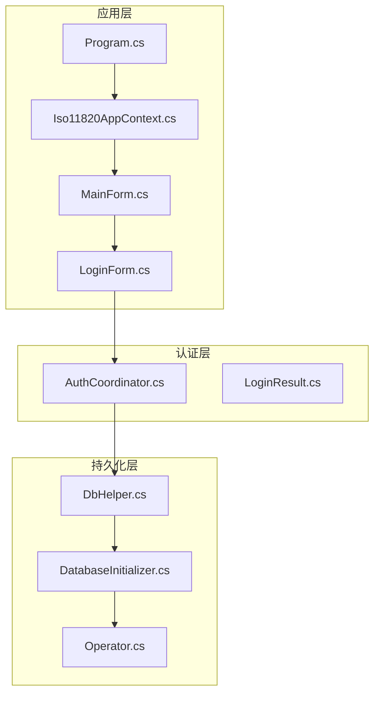
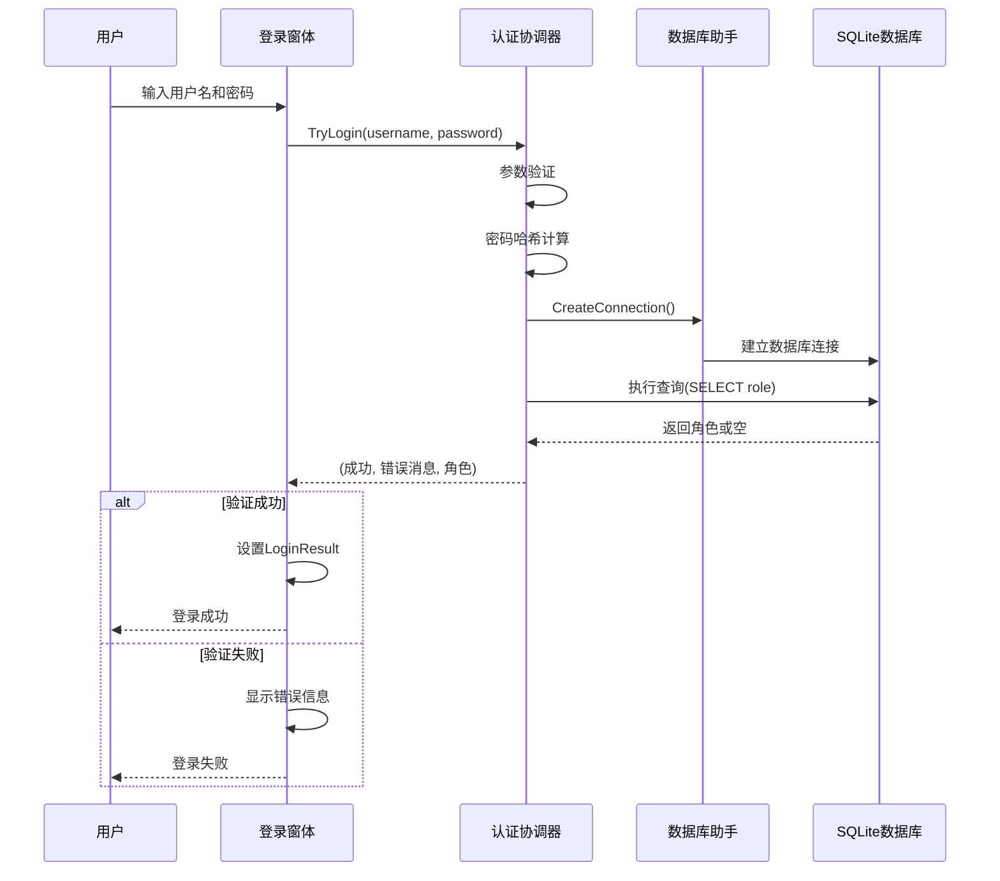
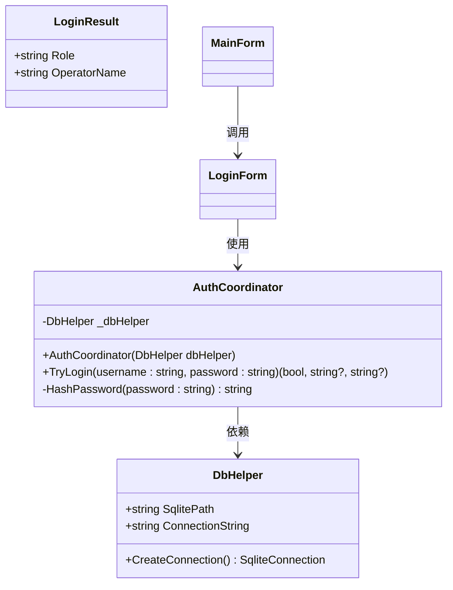
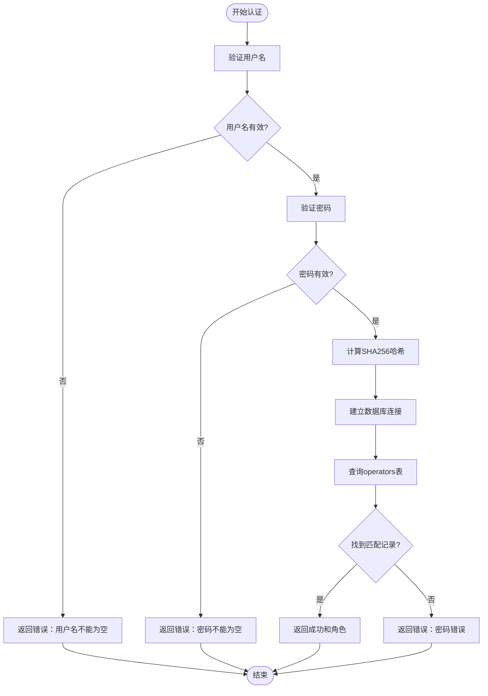
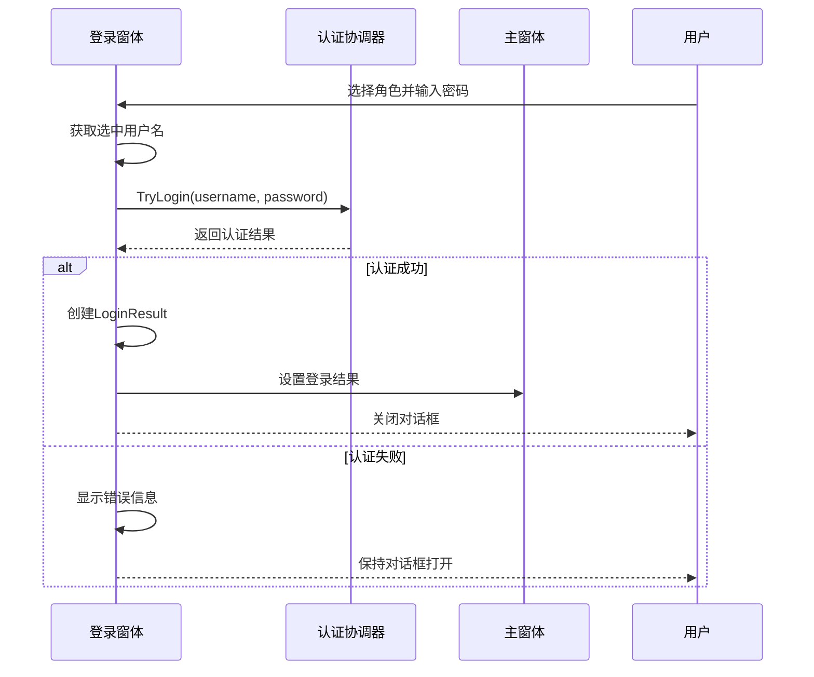
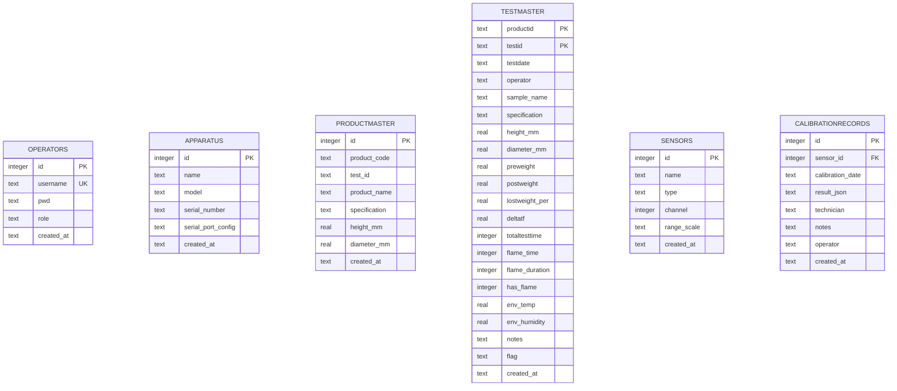
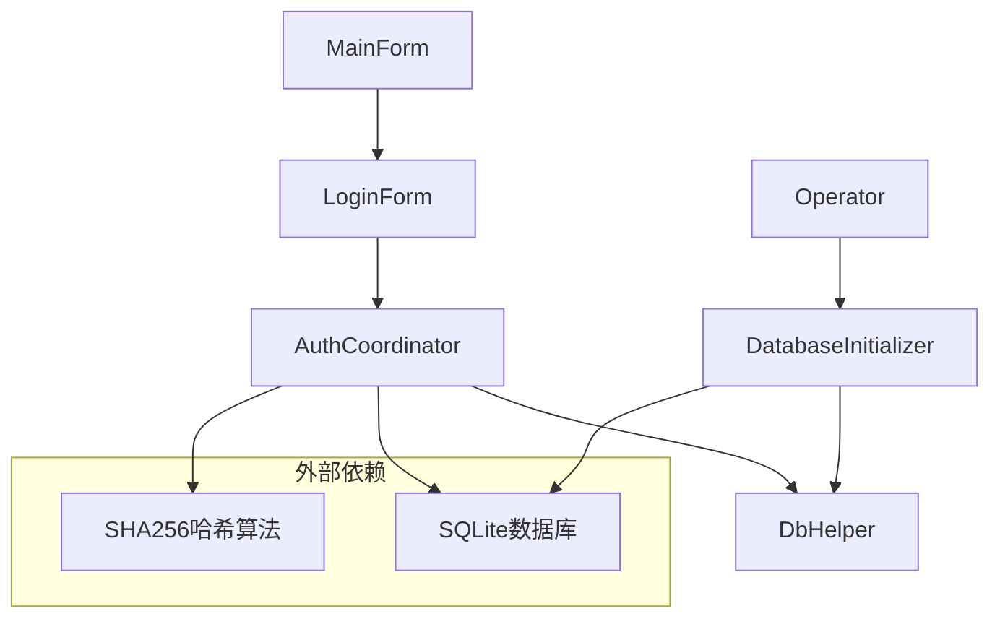
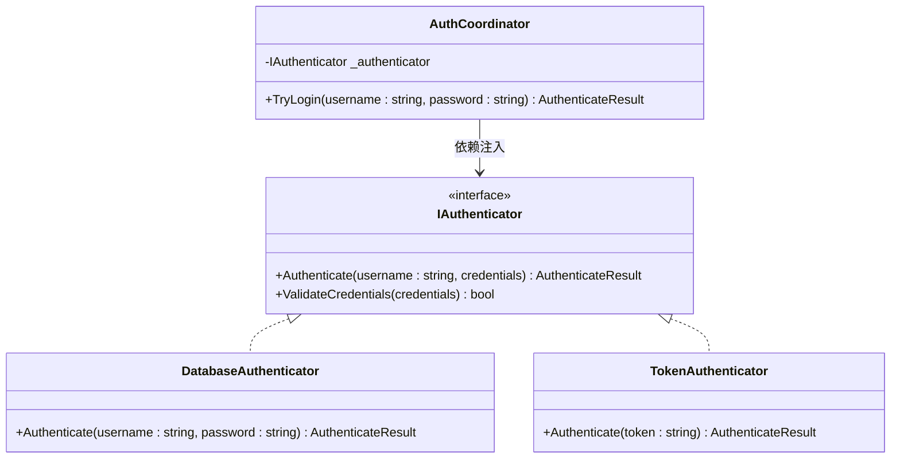

# 认证协调器

<cite>
**本文档引用的文件**
- [AuthCoordinator.cs](file://src/ISO11820.App/Features/Auth/AuthCoordinator.cs)
- [LoginForm.cs](file://src/ISO11820.App/UI/Forms/LoginForm.cs)
- [MainForm.cs](file://src/ISO11820.App/UI/Forms/MainForm.cs)
- [LoginResult.cs](file://src/ISO11820.App/UI/Common/LoginResult.cs)
- [DbHelper.cs](file://src/ISO11820.App/Infrastructure/Persistence/DbHelper.cs)
- [DatabaseInitializer.cs](file://src/ISO11820.App/Infrastructure/Persistence/DatabaseInitializer.cs)
- [Operator.cs](file://src/ISO11820.App/Infrastructure/Persistence/Models/Operator.cs)
- [Iso11820AppContext.cs](file://src/ISO11820.App/App/Iso11820AppContext.cs)
- [Program.cs](file://src/ISO11820.App/Program.cs)
- [AuthCoordinatorTests.cs](file://tests/ISO11820.Tests/Features/AuthCoordinatorTests.cs)
</cite>

## 目录
1. [简介](#简介)
2. [项目结构](#项目结构)
3. [核心组件](#核心组件)
4. [架构概览](#架构概览)
5. [详细组件分析](#详细组件分析)
6. [依赖关系分析](#依赖关系分析)
7. [性能考虑](#性能考虑)
8. [故障排除指南](#故障排除指南)
9. [结论](#结论)
10. [附录](#附录)

## 简介
本文件为认证协调器（AuthCoordinator）的综合技术文档，详细说明了用户身份验证和授权管理机制。文档涵盖登录验证流程、用户角色权限检查、会话状态管理的实现细节，认证接口的方法签名、参数验证和返回值定义，以及用户凭据验证、密码加密存储、登录失败处理等安全相关功能。同时说明了与UI层的交互模式、事件驱动的用户状态更新机制，并提供了认证扩展点的设计建议，支持新的认证方式和用户存储后端。

## 项目结构
认证相关的核心文件位于以下目录：
- Features/Auth：认证协调器实现
- UI/Forms：登录窗体和主窗体
- UI/Common：跨窗体通信模型
- Infrastructure/Persistence：数据库访问和初始化
- App：应用上下文集成
- Tests：认证功能测试

**图表来源**
- [Program.cs:1-25](file://src/ISO11820.App/Program.cs#L1-L25)
- [Iso11820AppContext.cs:15-69](file://src/ISO11820.App/App/Iso11820AppContext.cs#L15-L69)
- [MainForm.cs:22-977](file://src/ISO11820.App/UI/Forms/MainForm.cs#L22-L977)
- [LoginForm.cs:9-289](file://src/ISO11820.App/UI/Forms/LoginForm.cs#L9-L289)
- [AuthCoordinator.cs:11-62](file://src/ISO11820.App/Features/Auth/AuthCoordinator.cs#L11-L62)

**章节来源**
- [Program.cs:1-25](file://src/ISO11820.App/Program.cs#L1-L25)
- [Iso11820AppContext.cs:15-69](file://src/ISO11820.App/App/Iso11820AppContext.cs#L15-L69)

## 核心组件
认证协调器是系统的核心安全组件，负责：
- 用户凭据验证（用户名+密码）
- 密码哈希比较
- 角色权限识别
- 数据库连接管理
- 错误处理和状态反馈

主要接口方法：
- TryLogin(username: string, password: string): 返回(成功, 错误消息, 角色)

**章节来源**
- [AuthCoordinator.cs:11-62](file://src/ISO11820.App/Features/Auth/AuthCoordinator.cs#L11-L62)

## 架构概览
认证系统的整体架构采用分层设计，确保关注点分离和可测试性：

**图表来源**
- [LoginForm.cs:201-219](file://src/ISO11820.App/UI/Forms/LoginForm.cs#L201-L219)
- [AuthCoordinator.cs:26-54](file://src/ISO11820.App/Features/Auth/AuthCoordinator.cs#L26-L54)
- [DbHelper.cs:16-22](file://src/ISO11820.App/Infrastructure/Persistence/DbHelper.cs#L16-L22)

## 详细组件分析

### AuthCoordinator 类分析
AuthCoordinator 是认证系统的核心类，实现了完整的用户身份验证逻辑。

**图表来源**
- [AuthCoordinator.cs:11-62](file://src/ISO11820.App/Features/Auth/AuthCoordinator.cs#L11-L62)
- [DbHelper.cs:5-22](file://src/ISO11820.App/Infrastructure/Persistence/DbHelper.cs#L5-L22)
- [LoginResult.cs:6](file://src/ISO11820.App/UI/Common/LoginResult.cs#L6)

#### 认证流程实现
认证流程包含严格的参数验证和安全检查：

**图表来源**
- [AuthCoordinator.cs:26-54](file://src/ISO11820.App/Features/Auth/AuthCoordinator.cs#L26-L54)

#### 密码哈希机制
系统使用SHA256进行密码哈希，确保密码安全存储：
- 输入：明文密码字符串
- 处理：UTF-8编码 + SHA256哈希 + 十六进制小写转换
- 输出：32字节十六进制字符串

**章节来源**
- [AuthCoordinator.cs:56-60](file://src/ISO11820.App/Features/Auth/AuthCoordinator.cs#L56-L60)
- [DatabaseInitializer.cs:193-197](file://src/ISO11820.App/Infrastructure/Persistence/DatabaseInitializer.cs#L193-L197)

### UI层交互模式
UI层采用事件驱动的交互模式，通过LoginForm接收用户输入并通过AuthCoordinator完成认证。

**图表来源**
- [LoginForm.cs:201-219](file://src/ISO11820.App/UI/Forms/LoginForm.cs#L201-L219)
- [MainForm.cs:497-520](file://src/ISO11820.App/UI/Forms/MainForm.cs#L497-L520)

**章节来源**
- [LoginForm.cs:9-289](file://src/ISO11820.App/UI/Forms/LoginForm.cs#L9-L289)
- [MainForm.cs:22-977](file://src/ISO11820.App/UI/Forms/MainForm.cs#L22-L977)

### 数据模型设计
系统使用SQLite作为用户存储后端，数据模型简洁高效：

**图表来源**
- [DatabaseInitializer.cs:36-98](file://src/ISO11820.App/Infrastructure/Persistence/DatabaseInitializer.cs#L36-L98)

**章节来源**
- [DatabaseInitializer.cs:1-198](file://src/ISO11820.App/Infrastructure/Persistence/DatabaseInitializer.cs#L1-L198)
- [Operator.cs:3-14](file://src/ISO11820.App/Infrastructure/Persistence/Models/Operator.cs#L3-L14)

## 依赖关系分析
认证系统的依赖关系清晰明确，遵循依赖倒置原则：

**图表来源**
- [AuthCoordinator.cs:1-62](file://src/ISO11820.App/Features/Auth/AuthCoordinator.cs#L1-L62)
- [LoginForm.cs:1-289](file://src/ISO11820.App/UI/Forms/LoginForm.cs#L1-L289)
- [DatabaseInitializer.cs:1-198](file://src/ISO11820.App/Infrastructure/Persistence/DatabaseInitializer.cs#L1-L198)

**章节来源**
- [Iso11820AppContext.cs:15-69](file://src/ISO11820.App/App/Iso11820AppContext.cs#L15-L69)

## 性能考虑
- 数据库连接池：使用短生命周期的连接，避免长时间持有数据库连接
- 哈希计算：SHA256哈希计算开销较小，适合实时认证场景
- 查询优化：operators表使用复合索引（username+pwd），提升查询性能
- 内存管理：及时释放数据库资源，防止内存泄漏

## 故障排除指南
常见问题及解决方案：

### 认证失败排查
1. **用户名为空**：检查UI层输入验证
2. **密码为空**：确认密码字段非空验证
3. **密码错误**：验证哈希算法一致性
4. **未知用户**：检查数据库初始化是否正确

### 数据库问题
- 确保operators表存在且包含初始用户数据
- 检查数据库文件权限
- 验证SQLite连接字符串格式

**章节来源**
- [AuthCoordinatorTests.cs:45-104](file://tests/ISO11820.Tests/Features/AuthCoordinatorTests.cs#L45-L104)

## 结论
认证协调器实现了安全、可靠的用户身份验证机制，具有以下特点：
- 清晰的分层架构和职责分离
- 强健的参数验证和错误处理
- 安全的密码哈希存储
- 事件驱动的UI交互模式
- 可扩展的认证扩展点设计

该实现为后续的功能扩展和安全加固奠定了良好的基础。

## 附录

### 认证扩展点设计
为支持新的认证方式和用户存储后端，建议采用以下扩展点：

### 安全最佳实践
1. **密码安全**：使用强哈希算法（如bcrypt）替代SHA256
2. **输入验证**：实施严格的SQL注入防护
3. **会话管理**：实现超时和并发会话控制
4. **审计日志**：记录所有认证尝试
5. **错误处理**：避免泄露敏感信息