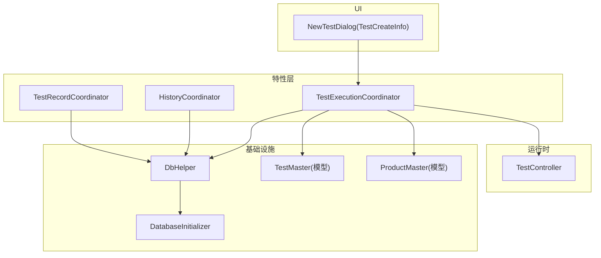
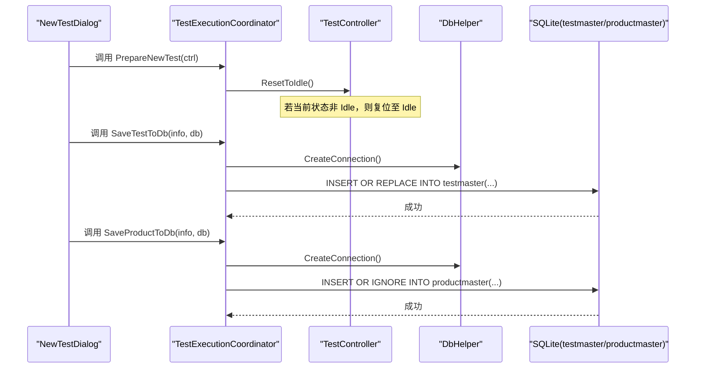
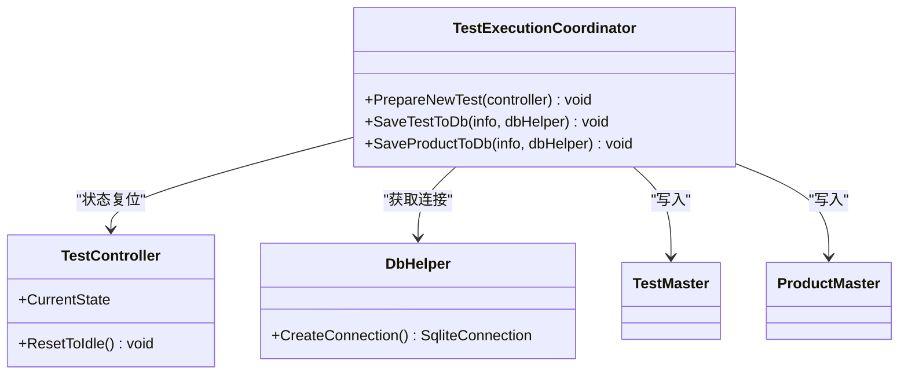
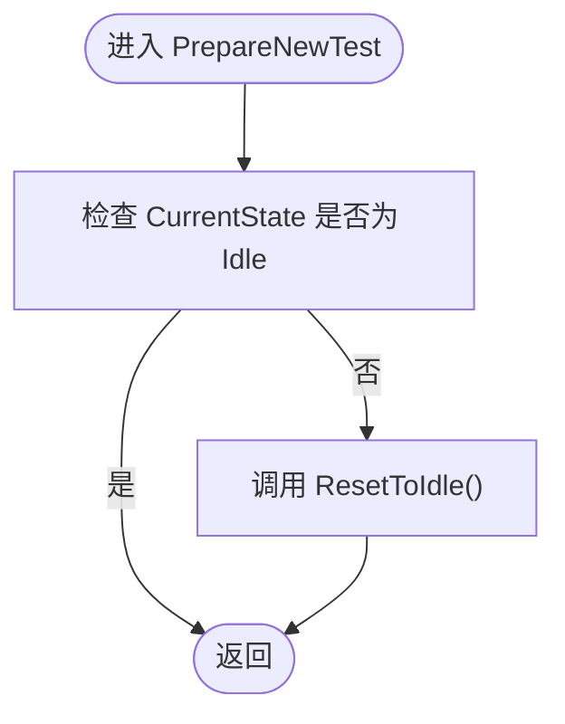
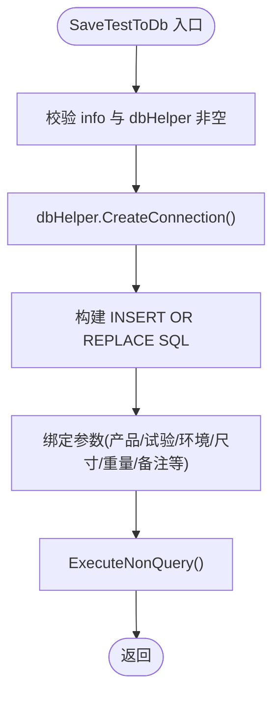
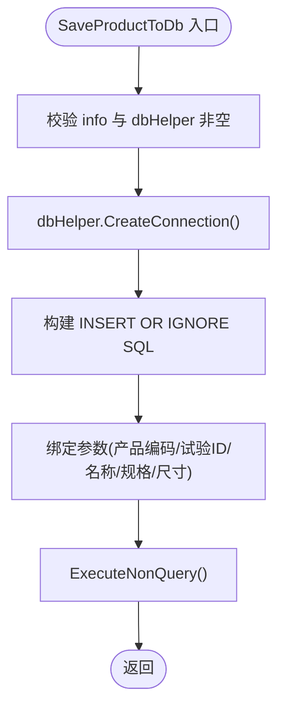
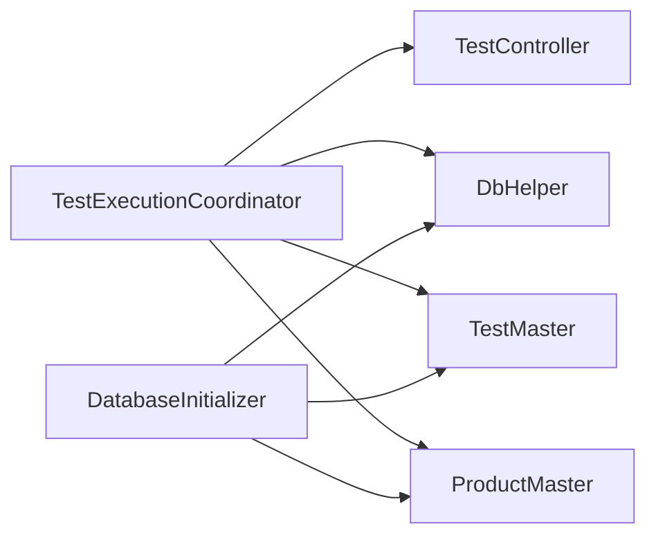

# 试验执行协调器

<cite>
**本文引用的文件列表**
- [TestExecutionCoordinator.cs](file://src/ISO11820.App/Features/TestExecution/TestExecutionCoordinator.cs)
- [TestController.cs](file://src/ISO11820.App/Runtime/Controller/TestController.cs)
- [DbHelper.cs](file://src/ISO11820.App/Infrastructure/Persistence/DbHelper.cs)
- [DatabaseInitializer.cs](file://src/ISO11820.App/Infrastructure/Persistence/DatabaseInitializer.cs)
- [TestMaster.cs](file://src/ISO11820.App/Infrastructure/Persistence/Models/TestMaster.cs)
- [ProductMaster.cs](file://src/ISO11820.App/Infrastructure/Persistence/Models/ProductMaster.cs)
- [NewTestDialog.cs](file://src/ISO11820.App/UI/Dialogs/NewTestDialog.cs)
- [HistoryCoordinator.cs](file://src/ISO11820.App/Features/History/HistoryCoordinator.cs)
- [TestRecordCoordinator.cs](file://src/ISO11820.App/Features/TestRecord/TestRecordCoordinator.cs)
- [TestState.cs](file://src/ISO11820.Core/Enums/TestState.cs)
</cite>

## 目录
1. [简介](#简介)
2. [项目结构](#项目结构)
3. [核心组件](#核心组件)
4. [架构总览](#架构总览)
5. [详细组件分析](#详细组件分析)
6. [依赖关系分析](#依赖关系分析)
7. [性能考虑](#性能考虑)
8. [故障排查指南](#故障排查指南)
9. [结论](#结论)
10. [附录](#附录)

## 简介
本文件围绕“试验执行协调器”展开，聚焦 TestExecutionCoordinator 的职责与实现细节。内容涵盖：
- 新试验准备流程（状态重置）
- 将试验信息保存到 testmaster 表、产品信息保存到 productmaster 表的完整逻辑
- PrepareNewTest 的状态重置机制
- SaveTestToDb 与 SaveProductToDb 的数据库操作实现
- TestCreateInfo 数据模型的使用
- SQL 语句的参数绑定与数据验证
- 调用示例、错误处理策略与事务管理建议
- 与 TestController 和 DbHelper 的集成方式
- 与其他协调器的协作关系
- 性能优化建议与最佳实践

## 项目结构
与试验执行协调器相关的代码分布在以下模块：
- 特性层（Features）：TestExecutionCoordinator 负责“创建新试验”工作流的编排
- 运行时控制器（Runtime.Controller）：TestController 维护试验状态机与仿真驱动
- 基础设施（Infrastructure.Persistence）：DbHelper 提供 SQLite 连接；DatabaseInitializer 负责建库建表与种子数据；Models 定义持久化实体
- UI 层（UI.Dialogs）：NewTestDialog 构造 TestCreateInfo 并触发后续保存流程
- 其他协调器：HistoryCoordinator 用于查询历史；TestRecordCoordinator 用于记录录入与落盘

图表来源
- [TestExecutionCoordinator.cs:1-80](file://src/ISO11820.App/Features/TestExecution/TestExecutionCoordinator.cs#L1-L80)
- [TestController.cs:1-328](file://src/ISO11820.App/Runtime/Controller/TestController.cs#L1-L328)
- [DbHelper.cs:1-22](file://src/ISO11820.App/Infrastructure/Persistence/DbHelper.cs#L1-L22)
- [DatabaseInitializer.cs:1-198](file://src/ISO11820.App/Infrastructure/Persistence/DatabaseInitializer.cs#L1-L198)
- [TestMaster.cs:1-47](file://src/ISO11820.App/Infrastructure/Persistence/Models/TestMaster.cs#L1-L47)
- [ProductMaster.cs:1-21](file://src/ISO11820.App/Infrastructure/Persistence/Models/ProductMaster.cs#L1-L21)
- [NewTestDialog.cs:286-328](file://src/ISO11820.App/UI/Dialogs/NewTestDialog.cs#L286-L328)
- [HistoryCoordinator.cs:1-241](file://src/ISO11820.App/Features/History/HistoryCoordinator.cs#L1-L241)
- [TestRecordCoordinator.cs:1-159](file://src/ISO11820.App/Features/TestRecord/TestRecordCoordinator.cs#L1-L159)

章节来源
- [TestExecutionCoordinator.cs:1-80](file://src/ISO11820.App/Features/TestExecution/TestExecutionCoordinator.cs#L1-L80)
- [TestController.cs:1-328](file://src/ISO11820.App/Runtime/Controller/TestController.cs#L1-L328)
- [DbHelper.cs:1-22](file://src/ISO11820.App/Infrastructure/Persistence/DbHelper.cs#L1-L22)
- [DatabaseInitializer.cs:1-198](file://src/ISO11820.App/Infrastructure/Persistence/DatabaseInitializer.cs#L1-L198)
- [TestMaster.cs:1-47](file://src/ISO11820.App/Infrastructure/Persistence/Models/TestMaster.cs#L1-L47)
- [ProductMaster.cs:1-21](file://src/ISO11820.App/Infrastructure/Persistence/Models/ProductMaster.cs#L1-L21)
- [NewTestDialog.cs:286-328](file://src/ISO11820.App/UI/Dialogs/NewTestDialog.cs#L286-L328)
- [HistoryCoordinator.cs:1-241](file://src/ISO11820.App/Features/History/HistoryCoordinator.cs#L1-L241)
- [TestRecordCoordinator.cs:1-159](file://src/ISO11820.App/Features/TestRecord/TestRecordCoordinator.cs#L1-L159)

## 核心组件
- TestExecutionCoordinator：协调“创建新试验”的工作流，包括状态复位、写入试验主表与产品主表
- TestController：维护试验状态机（Idle/Preparing/Ready/Recording/Complete），提供 ResetToIdle 等控制方法
- DbHelper：封装 SQLite 连接字符串与连接创建
- DatabaseInitializer：初始化数据库与表结构（包含 testmaster、productmaster）
- TestMaster / ProductMaster：持久化模型，映射到对应表结构
- NewTestDialog：收集用户输入并生成 TestCreateInfo
- HistoryCoordinator：读取历史数据（用于对比与展示）
- TestRecordCoordinator：试验记录录入与保存编排（与本次主题相关但非直接依赖）

章节来源
- [TestExecutionCoordinator.cs:1-80](file://src/ISO11820.App/Features/TestExecution/TestExecutionCoordinator.cs#L1-L80)
- [TestController.cs:1-328](file://src/ISO11820.App/Runtime/Controller/TestController.cs#L1-L328)
- [DbHelper.cs:1-22](file://src/ISO11820.App/Infrastructure/Persistence/DbHelper.cs#L1-L22)
- [DatabaseInitializer.cs:1-198](file://src/ISO11820.App/Infrastructure/Persistence/DatabaseInitializer.cs#L1-L198)
- [TestMaster.cs:1-47](file://src/ISO11820.App/Infrastructure/Persistence/Models/TestMaster.cs#L1-L47)
- [ProductMaster.cs:1-21](file://src/ISO11820.App/Infrastructure/Persistence/Models/ProductMaster.cs#L1-L21)
- [NewTestDialog.cs:286-328](file://src/ISO11820.App/UI/Dialogs/NewTestDialog.cs#L286-L328)
- [HistoryCoordinator.cs:1-241](file://src/ISO11820.App/Features/History/HistoryCoordinator.cs#L1-L241)
- [TestRecordCoordinator.cs:1-159](file://src/ISO11820.App/Features/TestRecord/TestRecordCoordinator.cs#L1-L159)

## 架构总览
下图展示了从 UI 发起“新建试验”到协调器完成状态复位与数据落盘的端到端流程。

图表来源
- [TestExecutionCoordinator.cs:19-78](file://src/ISO11820.App/Features/TestExecution/TestExecutionCoordinator.cs#L19-L78)
- [TestController.cs:145-156](file://src/ISO11820.App/Runtime/Controller/TestController.cs#L145-L156)
- [DbHelper.cs:16-21](file://src/ISO11820.App/Infrastructure/Persistence/DbHelper.cs#L16-L21)
- [DatabaseInitializer.cs:54-89](file://src/ISO11820.App/Infrastructure/Persistence/DatabaseInitializer.cs#L54-L89)

## 详细组件分析

### TestExecutionCoordinator 职责与实现
- 职责边界
  - 协调 UI 与运行时的交互，确保进入新试验前系统处于稳定状态
  - 负责将试验元数据与产品元数据写入数据库
- 关键方法
  - PrepareNewTest：在开始新试验前，若控制器不在空闲态，则强制复位
  - SaveTestToDb：向 testmaster 插入或替换一条试验记录
  - SaveProductToDb：向 productmaster 插入一条产品信息（忽略重复）

图表来源
- [TestExecutionCoordinator.cs:12-79](file://src/ISO11820.App/Features/TestExecution/TestExecutionCoordinator.cs#L12-L79)
- [TestController.cs:145-156](file://src/ISO11820.App/Runtime/Controller/TestController.cs#L145-L156)
- [DbHelper.cs:16-21](file://src/ISO11820.App/Infrastructure/Persistence/DbHelper.cs#L16-L21)
- [TestMaster.cs:1-47](file://src/ISO11820.App/Infrastructure/Persistence/Models/TestMaster.cs#L1-L47)
- [ProductMaster.cs:1-21](file://src/ISO11820.App/Infrastructure/Persistence/Models/ProductMaster.cs#L1-L21)

#### PrepareNewTest 状态重置机制
- 行为说明
  - 当 TestController.CurrentState 不为 Idle 时，调用 ResetToIdle 将其置为空闲态
  - ResetToIdle 会停止加热、清理缓冲、重置计时器等，保证下一次试验从零开始
- 适用场景
  - 用户在 Complete 或其他中间状态再次点击“新建试验”
  - 防止脏状态导致的数据不一致或仿真异常

图表来源
- [TestExecutionCoordinator.cs:19-25](file://src/ISO11820.App/Features/TestExecution/TestExecutionCoordinator.cs#L19-L25)
- [TestController.cs:145-156](file://src/ISO11820.App/Runtime/Controller/TestController.cs#L145-L156)

章节来源
- [TestExecutionCoordinator.cs:19-25](file://src/ISO11820.App/Features/TestExecution/TestExecutionCoordinator.cs#L19-L25)
- [TestController.cs:145-156](file://src/ISO11820.App/Runtime/Controller/TestController.cs#L145-L156)
- [TestState.cs:1-11](file://src/ISO11820.Core/Enums/TestState.cs#L1-L11)

#### SaveTestToDb 数据库操作实现
- 目标表：testmaster
- 语义：INSERT OR REPLACE，按主键覆盖更新（productid, testid）
- 字段映射要点
  - 使用参数化赋值，避免注入风险
  - 日期由数据库函数 date('now') 填充
  - flag 默认值 '00000000'
- 参数绑定
  - @productid, @testid, @operator, @sample_name, @specification, @height_mm, @diameter_mm, @preweight, @env_temp, @env_humidity, @notes
- 数据验证
  - 对 info 与 dbHelper 进行空引用校验
  - 数值型字段通过 double 类型传入，允许为空（取决于上层构造）

图表来源
- [TestExecutionCoordinator.cs:30-55](file://src/ISO11820.App/Features/TestExecution/TestExecutionCoordinator.cs#L30-L55)
- [DatabaseInitializer.cs:66-89](file://src/ISO11820.App/Infrastructure/Persistence/DatabaseInitializer.cs#L66-L89)

章节来源
- [TestExecutionCoordinator.cs:30-55](file://src/ISO11820.App/Features/TestExecution/TestExecutionCoordinator.cs#L30-L55)
- [DatabaseInitializer.cs:66-89](file://src/ISO11820.App/Infrastructure/Persistence/DatabaseInitializer.cs#L66-L89)

#### SaveProductToDb 数据库操作实现
- 目标表：productmaster
- 语义：INSERT OR IGNORE，基于唯一约束 (product_code, test_id) 去重
- 字段映射要点
  - 使用参数化赋值
  - 仅写入产品维度信息（编码、名称、规格、尺寸）
- 参数绑定
  - @product_code, @test_id, @product_name, @specification, @height_mm, @diameter_mm

图表来源
- [TestExecutionCoordinator.cs:60-78](file://src/ISO11820.App/Features/TestExecution/TestExecutionCoordinator.cs#L60-L78)
- [DatabaseInitializer.cs:54-64](file://src/ISO11820.App/Infrastructure/Persistence/DatabaseInitializer.cs#L54-L64)

章节来源
- [TestExecutionCoordinator.cs:60-78](file://src/ISO11820.App/Features/TestExecution/TestExecutionCoordinator.cs#L60-L78)
- [DatabaseInitializer.cs:54-64](file://src/ISO11820.App/Infrastructure/Persistence/DatabaseInitializer.cs#L54-L64)

#### TestCreateInfo 数据模型使用
- 数据来源：NewTestDialog 中根据用户输入构造
- 关键字段
  - ProductId, TestId, SampleName, Specification, HeightMm, DiameterMm, OperatorName, PreWeightGrams, EnvTemperature, EnvHumidity, Notes 等
- 使用位置
  - SaveTestToDb 与 SaveProductToDb 均消费该对象以填充参数

章节来源
- [NewTestDialog.cs:286-328](file://src/ISO11820.App/UI/Dialogs/NewTestDialog.cs#L286-L328)
- [TestExecutionCoordinator.cs:30-78](file://src/ISO11820.App/Features/TestExecution/TestExecutionCoordinator.cs#L30-L78)

#### SQL 语句参数绑定与数据验证
- 参数绑定
  - 所有字段通过 AddWithValue 绑定，避免 SQL 注入
  - 日期与标志位采用数据库默认值或常量
- 数据验证
  - 入参空引用校验
  - 业务层建议在 UI 层对必填项进行前置校验（如 TestId、ProductId、Operator 等）

章节来源
- [TestExecutionCoordinator.cs:30-78](file://src/ISO11820.App/Features/TestExecution/TestExecutionCoordinator.cs#L30-L78)
- [TestRecordCoordinator.cs:106-131](file://src/ISO11820.App/Features/TestRecord/TestRecordCoordinator.cs#L106-L131)

#### 调用示例（步骤级）
- 步骤
  1) 在 UI 中填写表单并生成 TestCreateInfo
  2) 调用 PrepareNewTest(TestController) 确保状态空闲
  3) 调用 SaveTestToDb(TestCreateInfo, DbHelper) 写入试验主表
  4) 调用 SaveProductToDb(TestCreateInfo, DbHelper) 写入产品主表
  5) 启动实际试验流程（例如 StartHeating）
- 注意
  - 若需要同时写入多条记录，建议使用事务包裹（见“事务管理”小节）

章节来源
- [NewTestDialog.cs:286-328](file://src/ISO11820.App/UI/Dialogs/NewTestDialog.cs#L286-L328)
- [TestExecutionCoordinator.cs:19-78](file://src/ISO11820.App/Features/TestExecution/TestExecutionCoordinator.cs#L19-L78)
- [TestController.cs:57-72](file://src/ISO11820.App/Runtime/Controller/TestController.cs#L57-L72)

#### 错误处理策略
- 当前实现
  - 未显式捕获数据库异常，异常将向上抛出
- 建议
  - 在协调器外层统一 try/catch，记录日志并返回友好提示
  - 针对 SQLite 常见错误（文件锁、权限、路径不存在）做分类处理
  - 对于幂等写入（INSERT OR REPLACE/IGNORE），可结合返回值判断是否发生冲突

章节来源
- [TestExecutionCoordinator.cs:30-78](file://src/ISO11820.App/Features/TestExecution/TestExecutionCoordinator.cs#L30-L78)

#### 事务管理
- 现状
  - 当前两个保存方法各自独立打开连接并执行，未使用事务
- 建议方案
  - 新增 SaveTestAndProductWithTransaction(info, dbHelper)，在一个连接内开启事务，依次执行两条写入，任一失败回滚
  - 使用 using var transaction = connection.BeginTransaction(); 并在 finally 中提交或回滚

[本节为通用建议，不直接分析具体文件]

### 与 TestController 的集成
- 集成点
  - PrepareNewTest 依赖 TestController.ResetToIdle 保证状态一致
- 状态机
  - Idle/Preparing/Ready/Recording/Complete 五种状态，ResetToIdle 可将任意状态复位到 Idle

章节来源
- [TestExecutionCoordinator.cs:19-25](file://src/ISO11820.App/Features/TestExecution/TestExecutionCoordinator.cs#L19-L25)
- [TestController.cs:145-156](file://src/ISO11820.App/Runtime/Controller/TestController.cs#L145-L156)
- [TestState.cs:1-11](file://src/ISO11820.Core/Enums/TestState.cs#L1-L11)

### 与 DbHelper 的集成
- 集成点
  - 通过 DbHelper.CreateConnection 获取连接，避免硬编码连接字符串
- 优势
  - 便于测试替换与配置集中管理

章节来源
- [TestExecutionCoordinator.cs:35-77](file://src/ISO11820.App/Features/TestExecution/TestExecutionCoordinator.cs#L35-L77)
- [DbHelper.cs:16-21](file://src/ISO11820.App/Infrastructure/Persistence/DbHelper.cs#L16-L21)

### 与其他协调器的协作关系
- HistoryCoordinator
  - 负责查询 testmaster 与 productmaster 的历史数据，供报表与导出使用
- TestRecordCoordinator
  - 负责试验记录的录入、校验与落盘，可与 TestExecutionCoordinator 配合形成“先写元数据，再写记录”的流程

章节来源
- [HistoryCoordinator.cs:41-97](file://src/ISO11820.App/Features/History/HistoryCoordinator.cs#L41-L97)
- [TestRecordCoordinator.cs:18-82](file://src/ISO11820.App/Features/TestRecord/TestRecordCoordinator.cs#L18-L82)

## 依赖关系分析
- 内部依赖
  - TestExecutionCoordinator 依赖 TestController（状态复位）、DbHelper（连接）、TestMaster/ProductMaster（模型）
  - DatabaseInitializer 负责创建 testmaster 与 productmaster 表结构
- 外部依赖
  - Microsoft.Data.Sqlite（SQLite 驱动）

图表来源
- [TestExecutionCoordinator.cs:1-80](file://src/ISO11820.App/Features/TestExecution/TestExecutionCoordinator.cs#L1-L80)
- [DatabaseInitializer.cs:1-198](file://src/ISO11820.App/Infrastructure/Persistence/DatabaseInitializer.cs#L1-L198)
- [TestMaster.cs:1-47](file://src/ISO11820.App/Infrastructure/Persistence/Models/TestMaster.cs#L1-L47)
- [ProductMaster.cs:1-21](file://src/ISO11820.App/Infrastructure/Persistence/Models/ProductMaster.cs#L1-L21)

章节来源
- [TestExecutionCoordinator.cs:1-80](file://src/ISO11820.App/Features/TestExecution/TestExecutionCoordinator.cs#L1-L80)
- [DatabaseInitializer.cs:1-198](file://src/ISO11820.App/Infrastructure/Persistence/DatabaseInitializer.cs#L1-L198)

## 性能考虑
- 连接复用
  - 当前每个保存方法独立创建连接，频繁调用会产生开销。建议在高并发或批量写入场景下复用连接并使用事务
- 索引优化
  - 建议为 testmaster(productid, testid)、productmaster(product_code, test_id) 建立合适索引以提升查询与去重效率
- 批量写入
  - 若需批量写入，可使用事务包裹多条命令，减少磁盘同步次数
- 参数化与类型
  - 保持参数化绑定，避免字符串拼接；尽量传递精确类型以减少隐式转换

[本节为通用建议，不直接分析具体文件]

## 故障排查指南
- 常见问题
  - 数据库文件路径不存在：确保 DatabaseInitializer.EnsureCreated 已执行且目录存在
  - 表结构缺失：确认 DatabaseInitializer 的 CREATE TABLE 已执行
  - 重复写入冲突：productmaster 使用 INSERT OR IGNORE，testmaster 使用 INSERT OR REPLACE，注意业务语义
  - 参数绑定错误：核对字段名与参数名一致，避免拼写错误
- 定位手段
  - 在协调器外层增加 try/catch 并记录异常堆栈
  - 使用 HistoryCoordinator 查询 testmaster/productmaster 验证数据一致性

章节来源
- [DatabaseInitializer.cs:32-114](file://src/ISO11820.App/Infrastructure/Persistence/DatabaseInitializer.cs#L32-L114)
- [HistoryCoordinator.cs:41-97](file://src/ISO11820.App/Features/History/HistoryCoordinator.cs#L41-L97)

## 结论
TestExecutionCoordinator 作为“创建新试验”的关键编排者，承担了状态复位与元数据落盘两大职责。其实现简洁清晰，参数化 SQL 保证了安全性与可维护性。为进一步提升健壮性与性能，建议引入事务、完善异常处理与日志记录，并结合索引优化提升查询与写入效率。

[本节为总结性内容，不直接分析具体文件]

## 附录

### 数据模型与表结构对照
- TestMaster
  - 主要字段：ProductId, TestId, TestDate, Operator, SampleName, Specification, HeightMm, DiameterMm, PreWeight, PostWeight, LostWeightPer, DeltaTf, TotalTestTime, FlameTime, FlameDuration, HasFlame, EnvTemp, EnvHumidity, Notes, Flag, CreatedAt
- ProductMaster
  - 主要字段：Id, ProductCode, TestId, ProductName, Specification, HeightMm, DiameterMm, CreatedAt

章节来源
- [TestMaster.cs:1-47](file://src/ISO11820.App/Infrastructure/Persistence/Models/TestMaster.cs#L1-L47)
- [ProductMaster.cs:1-21](file://src/ISO11820.App/Infrastructure/Persistence/Models/ProductMaster.cs#L1-L21)
- [DatabaseInitializer.cs:54-89](file://src/ISO11820.App/Infrastructure/Persistence/DatabaseInitializer.cs#L54-L89)