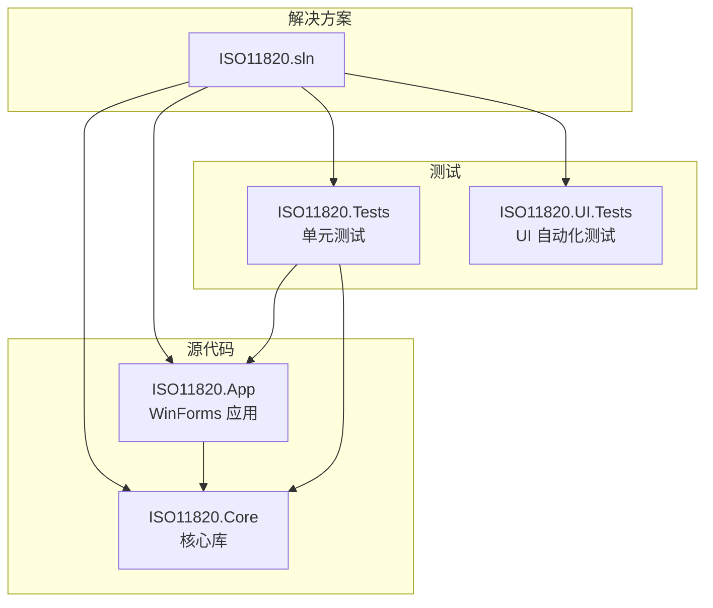
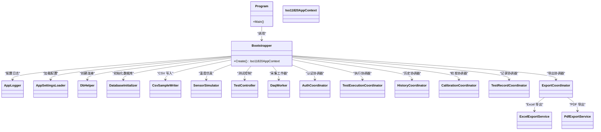
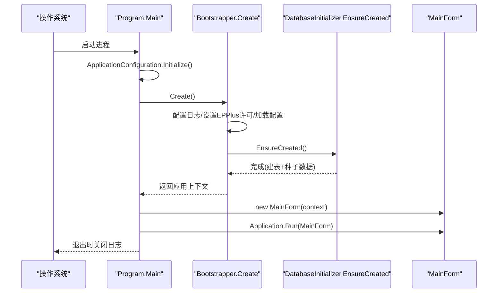
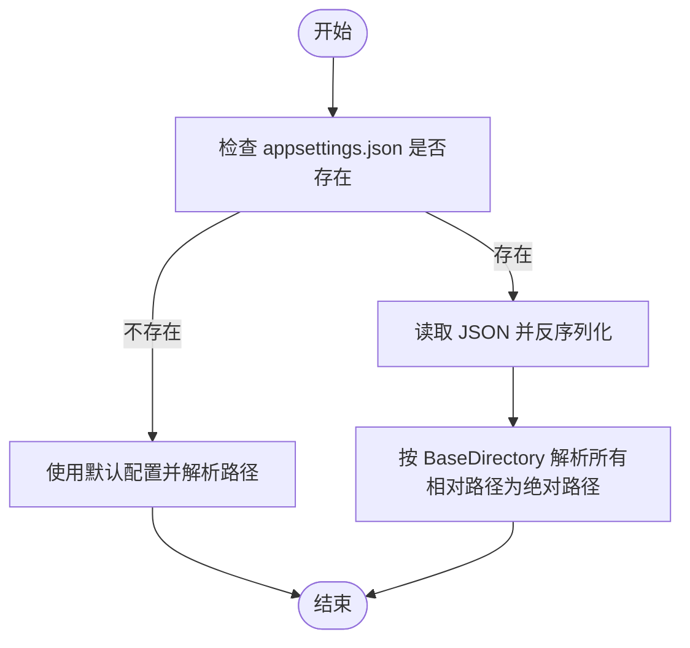
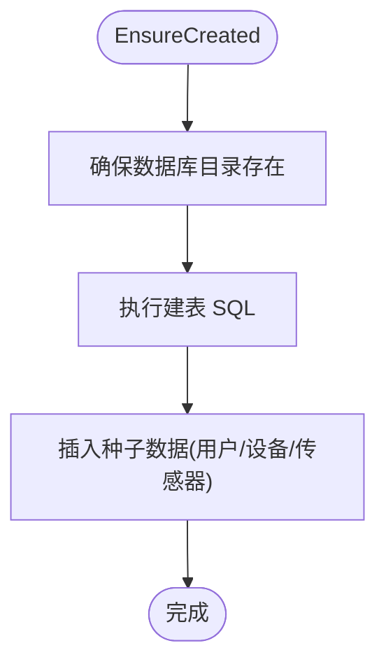
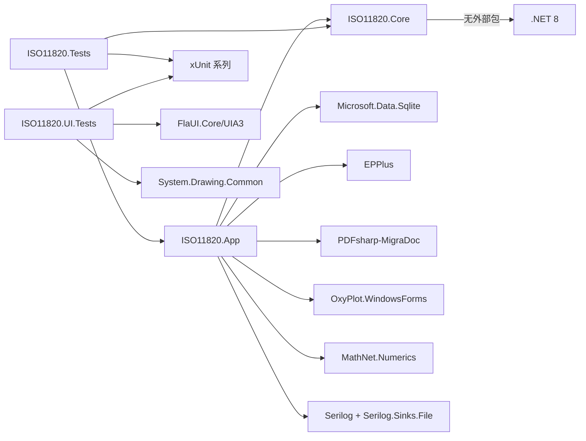

# 开发环境搭建

<cite>
**本文引用的文件列表**
- [ISO11820.sln](file://ISO11820.sln)
- [ISO11820.App.csproj](file://src/ISO11820.App/ISO11820.App.csproj)
- [ISO11820.Core.csproj](file://src/ISO11820.Core/ISO11820.Core.csproj)
- [Program.cs](file://src/ISO11820.App/Program.cs)
- [Bootstrapper.cs](file://src/ISO11820.App/App/Bootstrapper.cs)
- [appsettings.json](file://src/ISO11820.App/appsettings.json)
- [AppSettings.cs](file://src/ISO11820.App/Config/AppSettings.cs)
- [DatabaseInitializer.cs](file://src/ISO11820.App/Infrastructure/Persistence/DatabaseInitializer.cs)
- [ISO11820.Tests.csproj](file://tests/ISO11820.Tests/ISO11820.Tests.csproj)
- [ISO11820.UI.Tests.csproj](file://tests/ISO11820.UI.Tests/ISO11820.UI.Tests.csproj)
- [README.md（UI测试）](file://tests/ISO11820.UI.Tests/README.md)
- [AppLauncher.cs](file://tests/ISO11820.UI.Tests/Infrastructure/AppLauncher.cs)
- [.gitignore](file://.gitignore)
</cite>

## 目录
1. [简介](#简介)
2. [项目结构](#项目结构)
3. [核心组件](#核心组件)
4. [架构总览](#架构总览)
5. [详细组件分析](#详细组件分析)
6. [依赖关系分析](#依赖关系分析)
7. [性能与运行特性](#性能与运行特性)
8. [故障排查指南](#故障排查指南)
9. [结论](#结论)
10. [附录](#附录)

## 简介
本指南面向首次接触 ISO 11820 系统的开发者，提供从零开始的本地开发环境搭建说明。内容涵盖：
- Visual Studio 版本要求（推荐 2022）
- .NET 8 SDK 安装与验证
- 代码克隆、解决方案打开与依赖恢复
- 解决方案结构与主项目/核心库职责划分
- NuGet 包管理与关键依赖说明
- 常见环境问题定位与解决建议

## 项目结构
仓库采用“应用 + 核心库 + 测试”的三层组织方式：
- src/ISO11820.App：Windows Forms 桌面应用，负责 UI、业务编排、数据持久化、导出等
- src/ISO11820.Core：跨平台核心库，定义通用模型、枚举与接口契约
- tests/ISO11820.Tests：单元测试（xUnit），覆盖核心逻辑与应用层
- tests/ISO11820.UI.Tests：UI 自动化验收测试（FlaUI + xUnit）

图表来源
- [ISO11820.sln:1-51](file://ISO11820.sln#L1-L51)
- [ISO11820.App.csproj:1-30](file://src/ISO11820.App/ISO11820.App.csproj#L1-L30)
- [ISO11820.Core.csproj:1-10](file://src/ISO11820.Core/ISO11820.Core.csproj#L1-L10)
- [ISO11820.Tests.csproj:1-27](file://tests/ISO11820.Tests/ISO11820.Tests.csproj#L1-L27)
- [ISO11820.UI.Tests.csproj:1-38](file://tests/ISO11820.UI.Tests/ISO11820.UI.Tests.csproj#L1-L38)

章节来源
- [ISO11820.sln:1-51](file://ISO11820.sln#L1-L51)

## 核心组件
- 应用入口与启动流程
  - Program.Main 初始化 Windows Forms 上下文，调用 Bootstrapper 创建应用上下文并运行主窗体，退出时关闭日志。
- 引导器 Bootstrapper
  - 配置日志、设置 EPPlus 许可证上下文、加载 appsettings.json、初始化数据库、CSV 写入、仿真器、控制器、协调器等，最终返回统一的应用上下文供 UI 使用。
- 配置系统 AppSettings
  - 从 appsettings.json 读取配置，支持相对路径解析为绝对路径；包含数据库、仿真、输出、文件存储、报告、硬件等配置段。
- 数据库初始化 DatabaseInitializer
  - 确保 SQLite 文件所在目录存在，建表，填充初始用户、设备、传感器等种子数据；提供登录校验方法。

章节来源
- [Program.cs:1-25](file://src/ISO11820.App/Program.cs#L1-L25)
- [Bootstrapper.cs:1-66](file://src/ISO11820.App/App/Bootstrapper.cs#L1-L66)
- [AppSettings.cs:1-160](file://src/ISO11820.App/Config/AppSettings.cs#L1-L160)
- [DatabaseInitializer.cs:1-198](file://src/ISO11820.App/Infrastructure/Persistence/DatabaseInitializer.cs#L1-L198)
- [appsettings.json:1-29](file://src/ISO11820.App/appsettings.json#L1-L29)

## 架构总览
下图展示了应用启动时的关键对象装配与依赖关系，便于理解各模块的职责边界与协作方式。

图表来源
- [Program.cs:1-25](file://src/ISO11820.App/Program.cs#L1-L25)
- [Bootstrapper.cs:1-66](file://src/ISO11820.App/App/Bootstrapper.cs#L1-L66)

## 详细组件分析

### 应用启动序列

图表来源
- [Program.cs:1-25](file://src/ISO11820.App/Program.cs#L1-L25)
- [Bootstrapper.cs:1-66](file://src/ISO11820.App/App/Bootstrapper.cs#L1-L66)
- [DatabaseInitializer.cs:16-21](file://src/ISO11820.App/Infrastructure/Persistence/DatabaseInitializer.cs#L16-L21)

### 配置加载与路径解析流程

图表来源
- [AppSettings.cs:125-160](file://src/ISO11820.App/Config/AppSettings.cs#L125-L160)
- [appsettings.json:1-29](file://src/ISO11820.App/appsettings.json#L1-L29)

### 数据库初始化流程

图表来源
- [DatabaseInitializer.cs:16-21](file://src/ISO11820.App/Infrastructure/Persistence/DatabaseInitializer.cs#L16-L21)
- [DatabaseInitializer.cs:23-114](file://src/ISO11820.App/Infrastructure/Persistence/DatabaseInitializer.cs#L23-L114)
- [DatabaseInitializer.cs:116-176](file://src/ISO11820.App/Infrastructure/Persistence/DatabaseInitializer.cs#L116-L176)

## 依赖关系分析
- 目标框架
  - ISO11820.Core：net8.0（跨平台）
  - ISO11820.App：net8.0-windows（Windows Forms）
  - 测试项目：net8.0-windows
- 项目引用
  - ISO11820.App 引用 ISO11820.Core
  - ISO11820.Tests 引用 ISO11820.Core 与 ISO11820.App
  - ISO11820.UI.Tests 不直接引用应用项目，通过运行时路径启动被测程序
- NuGet 关键依赖（来自项目文件）
  - Microsoft.Data.Sqlite：SQLite 客户端驱动
  - EPPlus：Excel 读写（非商业许可需在启动时设置 LicenseContext）
  - PDFsharp-MigraDoc：PDF 生成
  - OxyPlot.WindowsForms：WinForms 图表控件
  - MathNet.Numerics：数值计算
  - Serilog + Serilog.Sinks.File：结构化日志
  - xUnit 系列：测试框架与可视化集成
  - FlaUI.Core/UIA3：UI 自动化
  - System.Drawing.Common：截图辅助

图表来源
- [ISO11820.App.csproj:1-30](file://src/ISO11820.App/ISO11820.App.csproj#L1-L30)
- [ISO11820.Core.csproj:1-10](file://src/ISO11820.Core/ISO11820.Core.csproj#L1-L10)
- [ISO11820.Tests.csproj:1-27](file://tests/ISO11820.Tests/ISO11820.Tests.csproj#L1-L27)
- [ISO11820.UI.Tests.csproj:1-38](file://tests/ISO11820.UI.Tests/ISO11820.UI.Tests.csproj#L1-L38)

章节来源
- [ISO11820.App.csproj:1-30](file://src/ISO11820.App/ISO11820.App.csproj#L1-L30)
- [ISO11820.Core.csproj:1-10](file://src/ISO11820.Core/ISO11820.Core.csproj#L1-L10)
- [ISO11820.Tests.csproj:1-27](file://tests/ISO11820.Tests/ISO11820.Tests.csproj#L1-L27)
- [ISO11820.UI.Tests.csproj:1-38](file://tests/ISO11820.UI.Tests/ISO11820.UI.Tests.csproj#L1-L38)

## 性能与运行特性
- 启动阶段会进行数据库建表与种子数据插入，首次运行可能稍慢，后续启动将复用已有数据库文件。
- 日志采用文件 Sink，避免频繁 I/O 对 UI 线程造成阻塞。
- 仿真器用于模拟温度曲线，可在配置中调整升温速率与目标温度以平衡测试时长。

[本节为通用说明，不涉及具体文件分析]

## 故障排查指南

- 未找到 ISO11820.App.exe（UI 测试无法启动被测应用）
  - 现象：运行 UI 测试时报找不到可执行文件。
  - 处理：先编译主程序，再运行测试。参考测试 README 中的构建命令。
  - 参考
    - [README.md（UI测试）:56-108](file://tests/ISO11820.UI.Tests/README.md#L56-L108)
    - [AppLauncher.cs:220-239](file://tests/ISO11820.UI.Tests/Infrastructure/AppLauncher.cs#L220-L239)

- 权限问题（无法写入 Data/TestData 目录）
  - 现象：启动时报无法创建文件或目录。
  - 原因：应用需要写入 appsettings.json 指定的数据库与输出目录。
  - 处理：确保运行账户对输出目录具有写权限；或将路径改为当前用户有权限的位置。
  - 参考
    - [appsettings.json:1-29](file://src/ISO11820.App/appsettings.json#L1-L29)
    - [DatabaseInitializer.cs:23-30](file://src/ISO11820.App/Infrastructure/Persistence/DatabaseInitializer.cs#L23-L30)

- .NET 版本冲突或目标框架不匹配
  - 现象：构建失败提示缺少 net8.0 或 net8.0-windows 目标框架。
  - 处理：安装 .NET 8 SDK，并确保 Visual Studio 2022 安装了“.NET 桌面开发”工作负载。
  - 参考
    - [ISO11820.App.csproj:16-22](file://src/ISO11820.App/ISO11820.App.csproj#L16-L22)
    - [ISO11820.Core.csproj:3-7](file://src/ISO11820.Core/ISO11820.Core.csproj#L3-L7)
    - [ISO11820.Tests.csproj:1-8](file://tests/ISO11820.Tests/ISO11820.Tests.csproj#L1-L8)
    - [ISO11820.UI.Tests.csproj:1-8](file://tests/ISO11820.UI.Tests/ISO11820.UI.Tests.csproj#L1-L8)

- EPPlus 许可证未设置
  - 现象：运行时报许可证相关异常。
  - 处理：在应用启动时设置非商业许可上下文。
  - 参考
    - [Bootstrapper.cs:25-26](file://src/ISO11820.App/App/Bootstrapper.cs#L25-L26)

- 配置文件缺失或路径解析异常
  - 现象：应用启动后使用默认路径，或出现路径拼接错误。
  - 处理：确认 appsettings.json 位于输出目录；若使用相对路径，将被应用基于 BaseDirectory 解析为绝对路径。
  - 参考
    - [AppSettings.cs:125-160](file://src/ISO11820.App/Config/AppSettings.cs#L125-L160)

- 忽略目录导致误删
  - 说明：Data/ 与 TestData/ 被加入 .gitignore，避免提交运行时数据。
  - 参考
    - [.gitignore:10-11](file://.gitignore#L10-L11)

章节来源
- [README.md（UI测试）:56-108](file://tests/ISO11820.UI.Tests/README.md#L56-L108)
- [AppLauncher.cs:220-239](file://tests/ISO11820.UI.Tests/Infrastructure/AppLauncher.cs#L220-L239)
- [appsettings.json:1-29](file://src/ISO11820.App/appsettings.json#L1-L29)
- [DatabaseInitializer.cs:23-30](file://src/ISO11820.App/Infrastructure/Persistence/DatabaseInitializer.cs#L23-L30)
- [ISO11820.App.csproj:16-22](file://src/ISO11820.App/ISO11820.App.csproj#L16-L22)
- [ISO11820.Core.csproj:3-7](file://src/ISO11820.Core/ISO11820.Core.csproj#L3-L7)
- [ISO11820.Tests.csproj:1-8](file://tests/ISO11820.Tests/ISO11820.Tests.csproj#L1-L8)
- [ISO11820.UI.Tests.csproj:1-8](file://tests/ISO11820.UI.Tests/ISO11820.UI.Tests.csproj#L1-L8)
- [Bootstrapper.cs:25-26](file://src/ISO11820.App/App/Bootstrapper.cs#L25-L26)
- [AppSettings.cs:125-160](file://src/ISO11820.App/Config/AppSettings.cs#L125-L160)
- [.gitignore:10-11](file://.gitignore#L10-L11)

## 结论
本指南明确了 ISO 11820 项目的开发环境要求、解决方案结构与关键依赖，提供了启动流程与常见问题排查路径。按照本指南完成环境准备后，即可在 Visual Studio 2022 下顺利构建、运行与调试应用，并通过单元测试与 UI 自动化测试保障质量。

[本节为总结性内容，不涉及具体文件分析]

## 附录

### 环境准备清单
- 安装 Visual Studio 2022（推荐），勾选“.NET 桌面开发”工作负载
- 安装 .NET 8 SDK（含 Windows 桌面运行时）
- 克隆仓库到本地磁盘

### 构建与运行步骤
- 打开解决方案 ISO11820.sln
- 还原 NuGet 包（自动或手动）
- 选择 ISO11820.App 作为启动项目并运行
- 首次运行会自动创建数据库与种子数据

### NuGet 包管理要点
- 项目已声明所需包，无需手动添加
- 如需新增包，建议在对应 .csproj 中添加 PackageReference
- 注意 EPPlus 非商业用途需设置许可证上下文

章节来源
- [ISO11820.sln:1-51](file://ISO11820.sln#L1-L51)
- [ISO11820.App.csproj:1-30](file://src/ISO11820.App/ISO11820.App.csproj#L1-L30)
- [Bootstrapper.cs:25-26](file://src/ISO11820.App/App/Bootstrapper.cs#L25-L26)