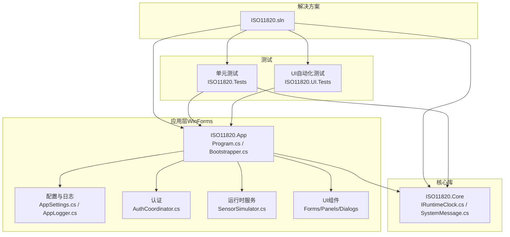
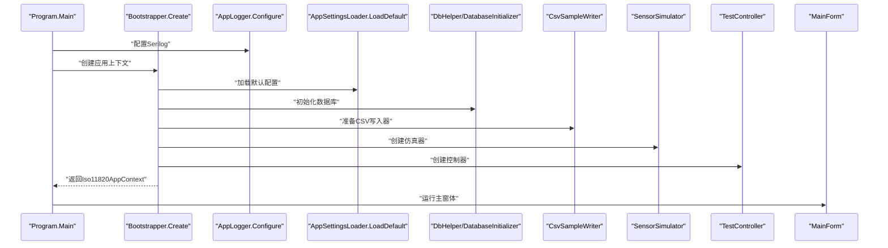
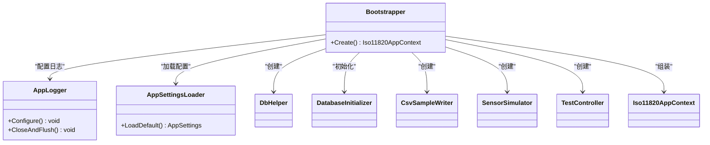
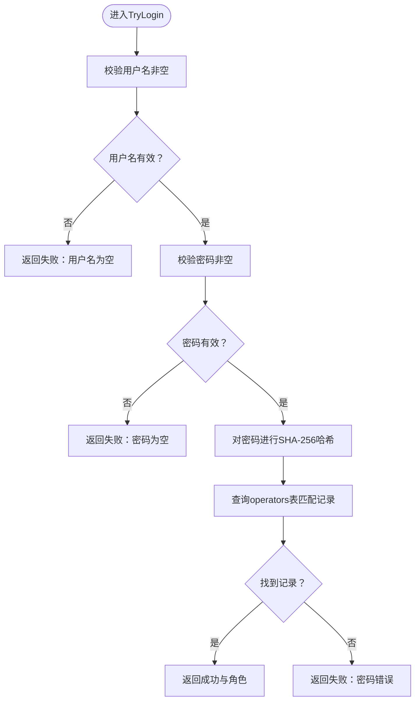
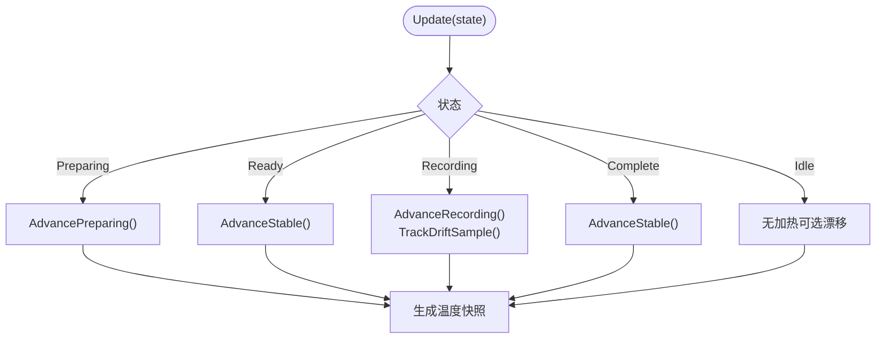
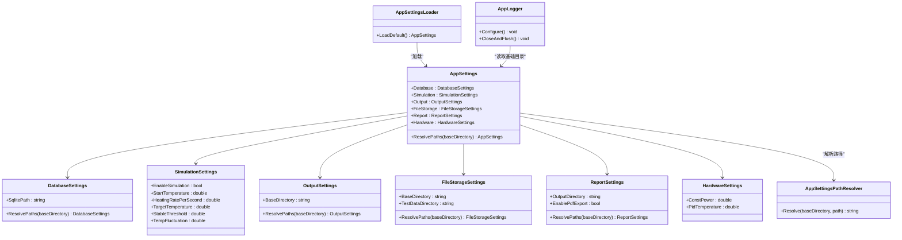
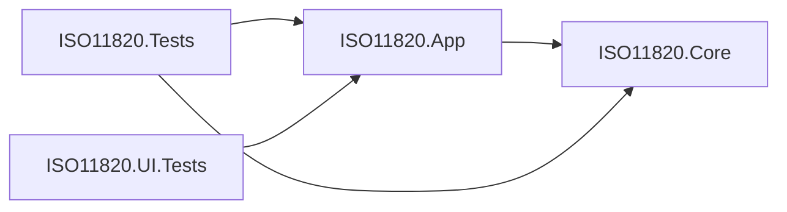

# 开发者指南

<cite>
**本文引用的文件**
- [ISO11820.sln](file://ISO11820.sln)
- [.gitignore](file://.gitignore)
- [Program.cs](file://src/ISO11820.App/Program.cs)
- [Bootstrapper.cs](file://src/ISO11820.App/App/Bootstrapper.cs)
- [AppSettings.cs](file://src/ISO11820.App/Config/AppSettings.cs)
- [AppLogger.cs](file://src/ISO11820.App/Config/AppLogger.cs)
- [AuthCoordinator.cs](file://src/ISO11820.App/Features/Auth/AuthCoordinator.cs)
- [SensorSimulator.cs](file://src/ISO11820.App/Runtime/Services/SensorSimulator.cs)
- [IRuntimeClock.cs](file://src/ISO11820.Core/Contracts/IRuntimeClock.cs)
- [SystemMessage.cs](file://src/ISO11820.Core/Models/SystemMessage.cs)
- [ISO11820.App.csproj](file://src/ISO11820.App/ISO11820.App.csproj)
- [ISO11820.Core.csproj](file://src/ISO11820.Core/ISO11820.Core.csproj)
- [ISO11820.Tests.csproj](file://tests/ISO11820.Tests/ISO11820.Tests.csproj)
- [README.md（UI自动化测试）](file://tests/ISO11820.UI.Tests/README.md)
- [UITestBase.cs](file://tests/ISO11820.UI.Tests/UITestBase.cs)
</cite>

## 目录
1. [简介](#简介)
2. [项目结构](#项目结构)
3. [核心组件](#核心组件)
4. [架构总览](#架构总览)
5. [详细组件分析](#详细组件分析)
6. [依赖关系分析](#依赖关系分析)
7. [性能考虑](#性能考虑)
8. [故障排查指南](#故障排查指南)
9. [结论](#结论)
10. [附录](#附录)

## 简介
本指南面向ISO 11820系统的开发者，提供从环境搭建、工具链安装、项目克隆到编码规范、调试技巧、测试与质量保障、代码评审与分支管理、重构与技术债务治理、新功能开发流程以及社区参与的全流程实践说明。内容基于仓库中的实际代码与测试文档整理而成，帮助新老成员快速上手并保持高质量交付。

## 项目结构
项目采用多项目解决方案组织，包含应用层、核心库、单元测试与UI自动化测试四大部分。核心模块包括：应用入口与引导装配、配置与日志、认证、运行时仿真、导出、历史与试验记录等。

图表来源
- [ISO11820.sln:1-51](file://ISO11820.sln#L1-L51)
- [Program.cs:1-25](file://src/ISO11820.App/Program.cs#L1-L25)
- [Bootstrapper.cs:1-66](file://src/ISO11820.App/App/Bootstrapper.cs#L1-L66)
- [AppSettings.cs:1-160](file://src/ISO11820.App/Config/AppSettings.cs#L1-L160)
- [AppLogger.cs:1-32](file://src/ISO11820.App/Config/AppLogger.cs#L1-L32)
- [AuthCoordinator.cs:1-62](file://src/ISO11820.App/Features/Auth/AuthCoordinator.cs#L1-L62)
- [SensorSimulator.cs:1-223](file://src/ISO11820.App/Runtime/Services/SensorSimulator.cs#L1-L223)
- [IRuntimeClock.cs:1-7](file://src/ISO11820.Core/Contracts/IRuntimeClock.cs#L1-L7)
- [SystemMessage.cs:1-4](file://src/ISO11820.Core/Models/SystemMessage.cs#L1-L4)
- [ISO11820.App.csproj:1-30](file://src/ISO11820.App/ISO11820.App.csproj#L1-L30)
- [ISO11820.Core.csproj:1-10](file://src/ISO11820.Core/ISO11820.Core.csproj#L1-L10)
- [ISO11820.Tests.csproj:1-27](file://tests/ISO11820.Tests/ISO11820.Tests.csproj#L1-L27)

章节来源
- [ISO11820.sln:1-51](file://ISO11820.sln#L1-L51)
- [.gitignore:1-12](file://.gitignore#L1-L12)

## 核心组件
- 应用入口与引导装配：负责初始化日志、设置Excel许可证、加载配置、创建数据库与文件存储、装配运行时控制器与各业务协调器，并启动主窗体。
- 配置与路径解析：集中管理数据库、仿真、输出、文件存储、报告与硬件参数，支持相对路径解析与默认值回退。
- 日志系统：基于Serilog的文件滚动日志，按天滚动、大小限制与保留策略。
- 认证：基于SQLite的用户凭据校验，密码采用SHA-256哈希存储。
- 运行时仿真：基于状态机的温度仿真模型，支持准备、稳定、记录、完成等阶段，内置温漂计算与PID输出模拟。
- 核心契约与模型：定义运行时时钟接口与系统消息模型，作为跨层契约。

章节来源
- [Program.cs:1-25](file://src/ISO11820.App/Program.cs#L1-L25)
- [Bootstrapper.cs:1-66](file://src/ISO11820.App/App/Bootstrapper.cs#L1-L66)
- [AppSettings.cs:1-160](file://src/ISO11820.App/Config/AppSettings.cs#L1-L160)
- [AppLogger.cs:1-32](file://src/ISO11820.App/Config/AppLogger.cs#L1-L32)
- [AuthCoordinator.cs:1-62](file://src/ISO11820.App/Features/Auth/AuthCoordinator.cs#L1-L62)
- [SensorSimulator.cs:1-223](file://src/ISO11820.App/Runtime/Services/SensorSimulator.cs#L1-L223)
- [IRuntimeClock.cs:1-7](file://src/ISO11820.Core/Contracts/IRuntimeClock.cs#L1-L7)
- [SystemMessage.cs:1-4](file://src/ISO11820.Core/Models/SystemMessage.cs#L1-L4)

## 架构总览
下图展示应用启动到主窗体运行的关键流程，以及日志、配置、数据库与仿真服务的交互。

图表来源
- [Program.cs:1-25](file://src/ISO11820.App/Program.cs#L1-L25)
- [Bootstrapper.cs:1-66](file://src/ISO11820.App/App/Bootstrapper.cs#L1-L66)
- [AppLogger.cs:1-32](file://src/ISO11820.App/Config/AppLogger.cs#L1-L32)
- [AppSettings.cs:1-160](file://src/ISO11820.App/Config/AppSettings.cs#L1-L160)

## 详细组件分析

### 组件A：引导装配与应用上下文
- 职责：集中初始化日志、配置、数据库、文件存储、仿真器、控制器与各业务协调器，统一注入到应用上下文中。
- 关键点：使用EPPlus非商业许可上下文；日志在应用退出时关闭并刷新缓冲。
- 依赖：配置加载器、数据库助手、导出服务、仿真器、控制器等。

图表来源
- [Bootstrapper.cs:1-66](file://src/ISO11820.App/App/Bootstrapper.cs#L1-L66)
- [AppLogger.cs:1-32](file://src/ISO11820.App/Config/AppLogger.cs#L1-L32)
- [AppSettings.cs:1-160](file://src/ISO11820.App/Config/AppSettings.cs#L1-L160)

章节来源
- [Bootstrapper.cs:1-66](file://src/ISO11820.App/App/Bootstrapper.cs#L1-L66)
- [AppLogger.cs:1-32](file://src/ISO11820.App/Config/AppLogger.cs#L1-L32)

### 组件B：认证协调器
- 职责：校验用户名与密码，返回角色信息；密码以SHA-256哈希存储。
- 关键点：空值校验、SQLite查询、哈希一致性。

图表来源
- [AuthCoordinator.cs:1-62](file://src/ISO11820.App/Features/Auth/AuthCoordinator.cs#L1-L62)

章节来源
- [AuthCoordinator.cs:1-62](file://src/ISO11820.App/Features/Auth/AuthCoordinator.cs#L1-L62)

### 组件C：传感器仿真器
- 职责：根据测试状态推进温度仿真，计算温漂，提供PID输出与稳定性判断。
- 关键点：状态机推进、噪声模拟、线性回归计算温漂、定时采样与图表计数。

图表来源
- [SensorSimulator.cs:1-223](file://src/ISO11820.App/Runtime/Services/SensorSimulator.cs#L1-L223)

章节来源
- [SensorSimulator.cs:1-223](file://src/ISO11820.App/Runtime/Services/SensorSimulator.cs#L1-L223)

### 组件D：配置与日志
- 配置：集中管理数据库、仿真、输出、文件存储、报告与硬件参数，支持路径解析与默认值。
- 日志：Serilog文件滚动日志，按天滚动、大小限制与保留策略。

图表来源
- [AppSettings.cs:1-160](file://src/ISO11820.App/Config/AppSettings.cs#L1-L160)
- [AppLogger.cs:1-32](file://src/ISO11820.App/Config/AppLogger.cs#L1-L32)

章节来源
- [AppSettings.cs:1-160](file://src/ISO11820.App/Config/AppSettings.cs#L1-L160)
- [AppLogger.cs:1-32](file://src/ISO11820.App/Config/AppLogger.cs#L1-L32)

### 组件E：核心契约与模型
- 运行时时钟接口：抽象当前时间，便于测试与替换。
- 系统消息模型：记录时间戳与消息文本。

章节来源
- [IRuntimeClock.cs:1-7](file://src/ISO11820.Core/Contracts/IRuntimeClock.cs#L1-L7)
- [SystemMessage.cs:1-4](file://src/ISO11820.Core/Models/SystemMessage.cs#L1-L4)

## 依赖关系分析
- 解决方案层面：应用层依赖核心库；测试层同时依赖应用与核心库。
- 应用层内部：引导装配统一注入各子系统；日志与配置贯穿全局；认证依赖数据库；仿真器依赖核心枚举与模型。
- 外部依赖：EPPlus（非商业）、MathNet.Numerics、SQLite、Serilog、PDFsharp-MigraDoc、OxyPlot等。

图表来源
- [ISO11820.App.csproj:1-30](file://src/ISO11820.App/ISO11820.App.csproj#L1-L30)
- [ISO11820.Core.csproj:1-10](file://src/ISO11820.Core/ISO11820.Core.csproj#L1-L10)
- [ISO11820.Tests.csproj:1-27](file://tests/ISO11820.Tests/ISO11820.Tests.csproj#L1-L27)

章节来源
- [ISO11820.App.csproj:1-30](file://src/ISO11820.App/ISO11820.App.csproj#L1-L30)
- [ISO11820.Core.csproj:1-10](file://src/ISO11820.Core/ISO11820.Core.csproj#L1-L10)
- [ISO11820.Tests.csproj:1-27](file://tests/ISO11820.Tests/ISO11820.Tests.csproj#L1-L27)

## 性能考虑
- 仿真计算：温度推进与噪声计算为轻量级CPU操作；温漂计算使用线性回归，样本窗口固定长度，避免无限增长。
- IO与日志：日志按天滚动、大小限制与保留策略，避免磁盘膨胀；CSV写入与数据库初始化在启动阶段完成。
- UI与自动化：UI自动化测试采用显式等待策略，避免硬等待；截图仅在步骤完成后捕获，减少IO压力。

## 故障排查指南
- 启动失败：确认主程序已构建且可执行；检查日志目录权限与磁盘空间。
- 登录失败：核对用户名与密码；确认数据库中是否存在对应记录；检查密码哈希一致性。
- 仿真异常：检查appsettings.json中的仿真参数（升温速率、目标温度、阈值等）；适当放宽等待时间。
- UI自动化失败：确保应用窗口可见且无遮挡；检查控件AutomationId与名称；查看截图定位问题；必要时调整等待策略。

章节来源
- [README.md（UI自动化测试）:1-238](file://tests/ISO11820.UI.Tests/README.md#L1-L238)
- [UITestBase.cs:1-210](file://tests/ISO11820.UI.Tests/UITestBase.cs#L1-L210)

## 结论
本指南提供了ISO 11820系统从环境搭建到开发、测试与维护的全链路实践建议。遵循统一的编码规范、日志与配置策略、严格的测试与评审流程，有助于持续提升系统稳定性与可维护性。

## 附录

### A. 开发环境搭建与工具链
- 操作系统：Windows（WinForms依赖）
- .NET版本：.NET 8
- IDE：Visual Studio 2022及以上
- 关键NuGet包：Serilog、EPPlus（非商业）、MathNet.Numerics、SQLite、PDFsharp-MigraDoc、OxyPlot
- Git：遵循.gitignore规则，忽略bin/obj、.vs、TestResults、Data/TestData等

章节来源
- [ISO11820.App.csproj:1-30](file://src/ISO11820.App/ISO11820.App.csproj#L1-L30)
- [ISO11820.Core.csproj:1-10](file://src/ISO11820.Core/ISO11820.Core.csproj#L1-L10)
- [.gitignore:1-12](file://.gitignore#L1-L12)

### B. 编码规范与命名约定
- 命名约定
  - 类型：PascalCase（如AppSettings、SensorSimulator）
  - 方法：PascalCase（如Create(), Update()）
  - 字段：私有字段使用下划线前缀（如_tf1），公共属性使用PascalCase
  - 常量：PascalCase（如RecordingTickMilliseconds）
  - 参数：camelCase（如username, password）
- 注释规范
  - 类与公共方法需提供XML注释，说明职责、参数与返回值
  - 关键算法与复杂逻辑需提供行内注释
- 文件与目录
  - 功能分层：Features、Infrastructure、Runtime、UI、Shared
  - 核心库：Contracts、Enums、Models
  - 测试：ISO11820.Tests（单元）与ISO11820.UI.Tests（UI自动化）

### C. 调试技巧与日志分析
- 断点调试：在关键流程（引导装配、认证、仿真更新、导出）设置断点
- 日志分析：关注启动日志、数据库初始化日志、仿真状态切换日志
- 性能分析：使用.NET Profiler观察仿真循环与绘图更新开销

章节来源
- [AppLogger.cs:1-32](file://src/ISO11820.App/Config/AppLogger.cs#L1-L32)
- [SensorSimulator.cs:1-223](file://src/ISO11820.App/Runtime/Services/SensorSimulator.cs#L1-L223)

### D. 测试与质量保障
- 单元测试：使用xUnit，覆盖核心逻辑与边界条件
- UI自动化测试：基于FlaUI，提供显式等待、截图与信号文件驱动
- 覆盖范围：登录、主界面布局、新建试验、状态机流转、按钮状态、仿真引擎、消息日志、试验记录、数据导出、端到端流程

章节来源
- [ISO11820.Tests.csproj:1-27](file://tests/ISO11820.Tests/ISO11820.Tests.csproj#L1-L27)
- [README.md（UI自动化测试）:1-238](file://tests/ISO11820.UI.Tests/README.md#L1-L238)
- [UITestBase.cs:1-210](file://tests/ISO11820.UI.Tests/UITestBase.cs#L1-L210)

### E. 代码评审流程与提交规范
- 分支策略：采用Git Flow，主分支保护，特性分支从develop切出，合并走MR/PR
- 提交规范：简短主题+详细描述，关联Issue；每次提交聚焦单一变更
- 评审要点：功能正确性、边界条件、异常处理、日志与配置、测试覆盖率、性能影响

### F. 重构指导原则与技术债务管理
- 重构原则：小步快跑、先测试后修改、保持接口稳定
- 技术债务：记录在案，设定偿还计划；优先处理阻塞性问题与高频缺陷
- 代码质量：静态分析、单元测试、UI自动化测试、日志可观测性

### G. 新功能开发工作流程
- 需求分析：明确功能边界与验收条件
- 设计评审：绘制流程图/序列图，确定接口与数据流
- 开发实现：遵循命名与注释规范，编写单元测试
- 集成测试：补充UI自动化测试步骤
- 评审与合并：代码评审通过后合并至主干
- 回归验证：运行全部测试，关注回归问题

### H. 贡献指南与社区参与
- 提交Issue：清晰描述问题、复现步骤与期望结果
- Fork与PR：从主分支派生特性分支，提交PR并回应评审意见
- 社区讨论：通过Issue或讨论区沟通设计方案与问题