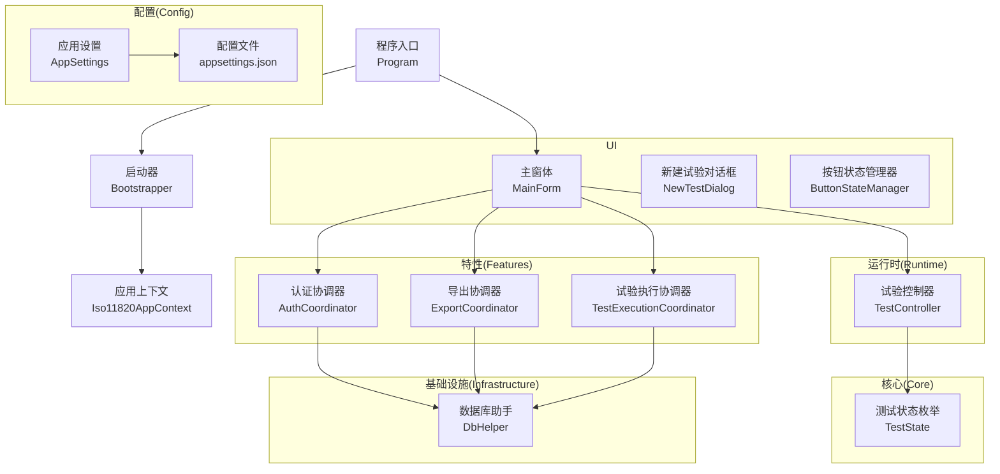
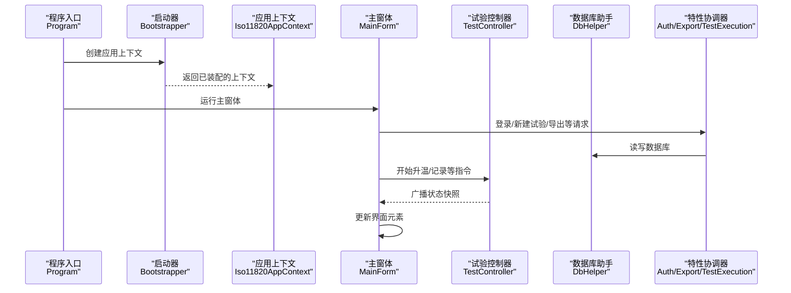
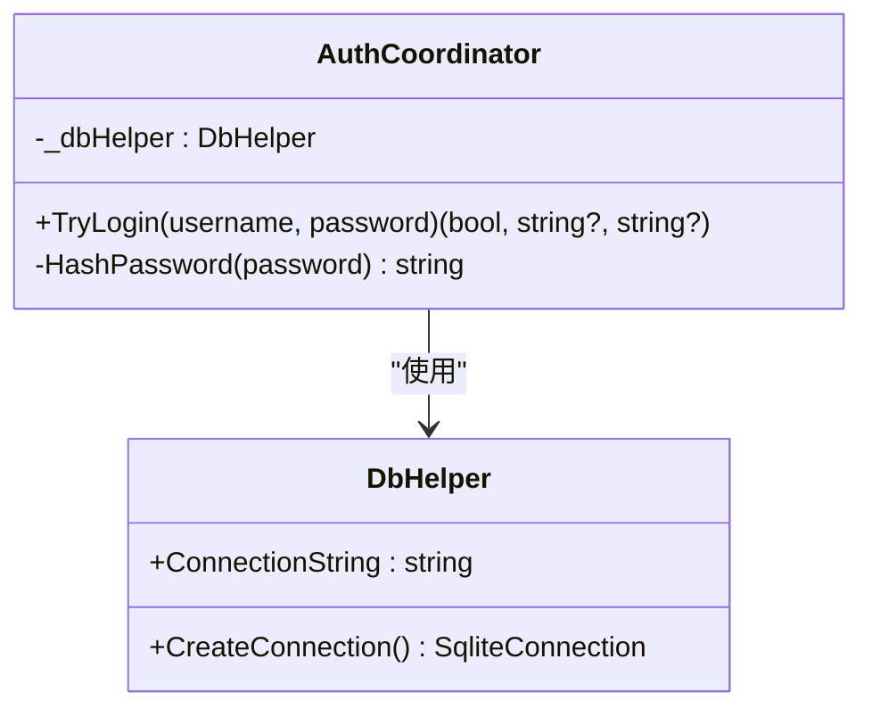
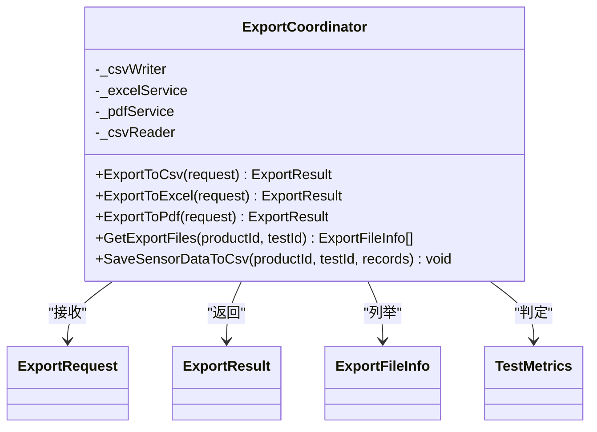
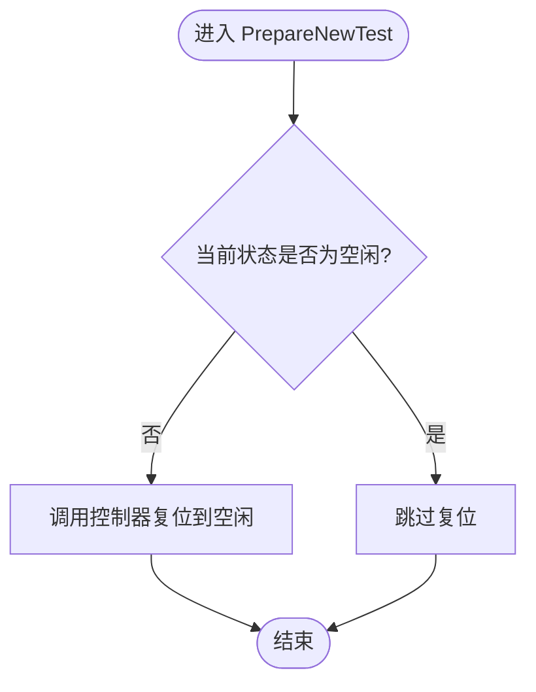
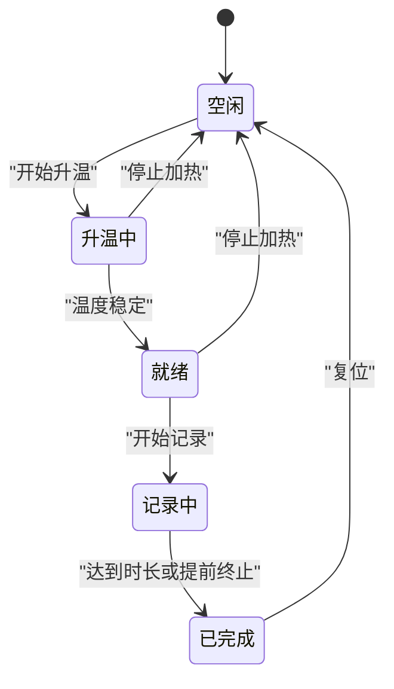
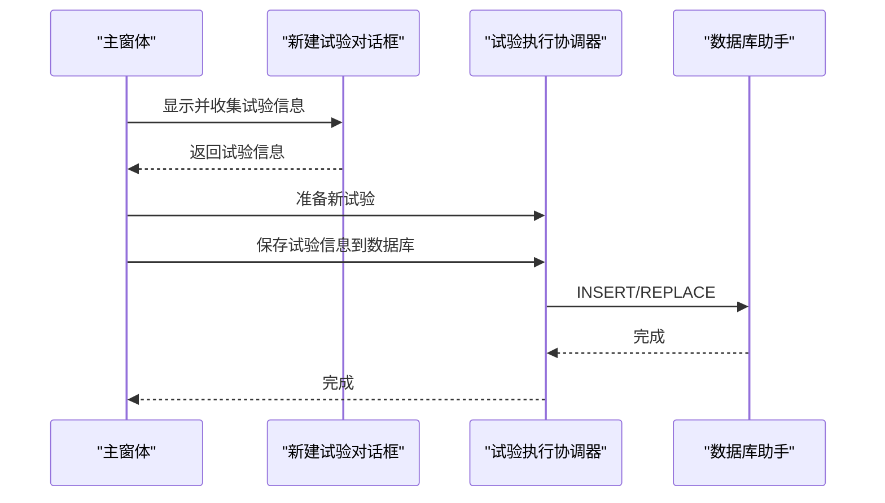
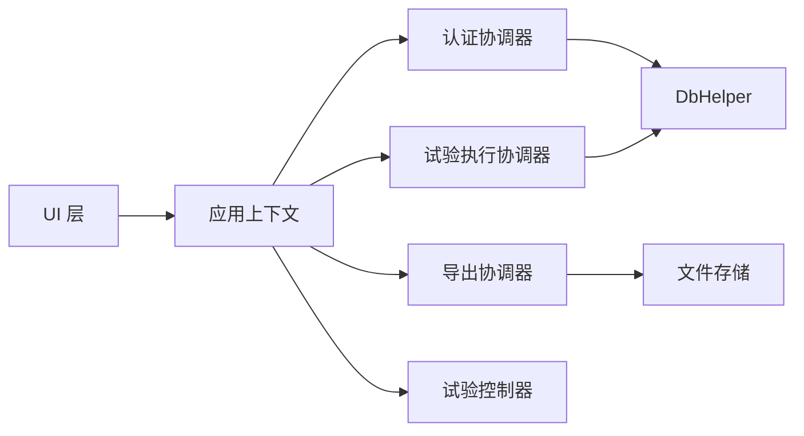

# 新功能开发

<cite>
**本文引用的文件**   
- [Program.cs](file://src/ISO11820.App/Program.cs)
- [Bootstrapper.cs](file://src/ISO11820.App/App/Bootstrapper.cs)
- [Iso11820AppContext.cs](file://src/ISO11820.App/App/Iso11820AppContext.cs)
- [MainForm.cs](file://src/ISO11820.App/UI/Forms/MainForm.cs)
- [NewTestDialog.cs](file://src/ISO11820.App/UI/Dialogs/NewTestDialog.cs)
- [ButtonStateManager.cs](file://src/ISO11820.App/UI/Common/ButtonStateManager.cs)
- [AuthCoordinator.cs](file://src/ISO11820.App/Features/Auth/AuthCoordinator.cs)
- [ExportCoordinator.cs](file://src/ISO11820.App/Features/Export/ExportCoordinator.cs)
- [TestExecutionCoordinator.cs](file://src/ISO11820.App/Features/TestExecution/TestExecutionCoordinator.cs)
- [TestController.cs](file://src/ISO11820.App/Runtime/Controller/TestController.cs)
- [DbHelper.cs](file://src/ISO11820.App/Infrastructure/Persistence/DbHelper.cs)
- [AppSettings.cs](file://src/ISO11820.App/Config/AppSettings.cs)
- [appsettings.json](file://src/ISO11820.App/appsettings.json)
- [TestState.cs](file://src/ISO11820.Core/Enums/TestState.cs)
</cite>

## 目录
1. [引言](#引言)
2. [项目结构](#项目结构)
3. [核心组件](#核心组件)
4. [架构总览](#架构总览)
5. [详细组件分析](#详细组件分析)
6. [依赖关系分析](#依赖关系分析)
7. [性能与可扩展性](#性能与可扩展性)
8. [故障排查指南](#故障排查指南)
9. [结论](#结论)
10. [附录：新功能开发流程与规范](#附录新功能开发流程与规范)

## 引言
本指南面向在本仓库中新增功能模块的开发者，提供基于“协调器模式”的端到端开发流程与最佳实践。内容覆盖需求分析、架构设计、接口定义、实现步骤、UI 组件开发、数据库扩展、配置管理、外部服务集成、代码提交与分支策略、版本发布流程等。通过阅读本文，你将能够以一致的方式在现有系统中添加新特性，并保持系统稳定、可测试、可维护。

## 项目结构
本项目采用分层与按特性划分的混合组织方式：
- UI 层（WinForms）：窗体、对话框、面板、图表控件
- 特性层（Features）：以协调器为中心的业务编排
- 运行时（Runtime）：控制器与服务（仿真、采集）
- 基础设施（Infrastructure）：持久化、文件存储
- 配置（Config）：应用设置加载与路径解析
- 核心（Core）：跨层共享枚举与模型

**图示来源**
- [Program.cs:1-25](file://src/ISO11820.App/Program.cs#L1-L25)
- [Bootstrapper.cs:17-66](file://src/ISO11820.App/App/Bootstrapper.cs#L17-L66)
- [Iso11820AppContext.cs:15-69](file://src/ISO11820.App/App/Iso11820AppContext.cs#L15-L69)
- [MainForm.cs:22-80](file://src/ISO11820.App/UI/Forms/MainForm.cs#L22-L80)
- [AuthCoordinator.cs:11-26](file://src/ISO11820.App/Features/Auth/AuthCoordinator.cs#L11-L26)
- [ExportCoordinator.cs:6-22](file://src/ISO11820.App/Features/Export/ExportCoordinator.cs#L6-L22)
- [TestExecutionCoordinator.cs:12-25](file://src/ISO11820.App/Features/TestExecution/TestExecutionCoordinator.cs#L12-L25)
- [TestController.cs:11-28](file://src/ISO11820.App/Runtime/Controller/TestController.cs#L11-L28)
- [DbHelper.cs:5-22](file://src/ISO11820.App/Infrastructure/Persistence/DbHelper.cs#L5-L22)
- [AppSettings.cs:5-38](file://src/ISO11820.App/Config/AppSettings.cs#L5-L38)
- [appsettings.json:1-29](file://src/ISO11820.App/appsettings.json#L1-L29)
- [TestState.cs:3-11](file://src/ISO11820.Core/Enums/TestState.cs#L3-L11)

**章节来源**
- [Program.cs:1-25](file://src/ISO11820.App/Program.cs#L1-L25)
- [Bootstrapper.cs:17-66](file://src/ISO11820.App/App/Bootstrapper.cs#L17-L66)
- [Iso11820AppContext.cs:15-69](file://src/ISO11820.App/App/Iso11820AppContext.cs#L15-L69)

## 核心组件
- 启动与装配
  - 程序入口初始化 WinForms 并创建应用上下文，随后运行主窗体。
  - 启动器负责日志、许可证、配置加载、基础设施与服务实例化，统一注入到应用上下文。
- 应用上下文
  - 集中暴露各特性协调器、运行时控制器、数据库与文件存储能力，供 UI 层调用。
- 协调器模式
  - 每个特性一个协调器，封装业务流程、事件处理与错误管理；UI 仅做交互与展示。
- 运行时控制
  - 试验控制器驱动状态机、数据广播与自动终止逻辑；UI 订阅广播更新界面。
- 配置与持久化
  - 从 JSON 加载配置并解析绝对路径；使用 SQLite 进行轻量持久化。

**章节来源**
- [Program.cs:10-24](file://src/ISO11820.App/Program.cs#L10-L24)
- [Bootstrapper.cs:17-66](file://src/ISO11820.App/App/Bootstrapper.cs#L17-L66)
- [Iso11820AppContext.cs:15-69](file://src/ISO11820.App/App/Iso11820AppContext.cs#L15-L69)
- [TestController.cs:11-28](file://src/ISO11820.App/Runtime/Controller/TestController.cs#L11-L28)
- [AppSettings.cs:125-144](file://src/ISO11820.App/Config/AppSettings.cs#L125-L144)
- [DbHelper.cs:5-22](file://src/ISO11820.App/Infrastructure/Persistence/DbHelper.cs#L5-L22)

## 架构总览
下图展示了从程序启动到 UI 渲染、再到业务协调与运行时控制的完整链路。

**图示来源**
- [Program.cs:10-24](file://src/ISO11820.App/Program.cs#L10-L24)
- [Bootstrapper.cs:17-66](file://src/ISO11820.App/App/Bootstrapper.cs#L17-L66)
- [Iso11820AppContext.cs:15-69](file://src/ISO11820.App/App/Iso11820AppContext.cs#L15-L69)
- [MainForm.cs:497-531](file://src/ISO11820.App/UI/Forms/MainForm.cs#L497-L531)
- [TestController.cs:30-35](file://src/ISO11820.App/Runtime/Controller/TestController.cs#L30-L35)
- [DbHelper.cs:16-21](file://src/ISO11820.App/Infrastructure/Persistence/DbHelper.cs#L16-L21)

## 详细组件分析

### 协调器模式与认证协调器
- 职责边界
  - 认证协调器封装凭据校验、哈希计算与数据库查询，对外返回结构化结果。
- 关键行为
  - 输入校验、密码哈希、SQL 参数化查询、返回三元组（成功/错误消息/角色）。
- 错误处理
  - 空值快速失败，SQL 查询失败由上层捕获并提示用户。

**图示来源**
- [AuthCoordinator.cs:11-61](file://src/ISO11820.App/Features/Auth/AuthCoordinator.cs#L11-L61)
- [DbHelper.cs:5-22](file://src/ISO11820.App/Infrastructure/Persistence/DbHelper.cs#L5-L22)

**章节来源**
- [AuthCoordinator.cs:26-54](file://src/ISO11820.App/Features/Auth/AuthCoordinator.cs#L26-L54)
- [DbHelper.cs:16-21](file://src/ISO11820.App/Infrastructure/Persistence/DbHelper.cs#L16-L21)

### 导出协调器与文件输出
- 职责边界
  - 协调 CSV/Excel/PDF 导出流程，读取 CSV、生成报表、返回结果对象。
- 关键行为
  - 路径构建、存在性检查、数据读取、报告生成、异常包装为统一结果。
- 数据结构
  - 使用不可变记录表达请求、结果、文件信息与指标。

**图示来源**
- [ExportCoordinator.cs:6-22](file://src/ISO11820.App/Features/Export/ExportCoordinator.cs#L6-L22)
- [ExportCoordinator.cs:157-229](file://src/ISO11820.App/Features/Export/ExportCoordinator.cs#L157-L229)

**章节来源**
- [ExportCoordinator.cs:24-119](file://src/ISO11820.App/Features/Export/ExportCoordinator.cs#L24-L119)
- [ExportCoordinator.cs:121-155](file://src/ISO11820.App/Features/Export/ExportCoordinator.cs#L121-L155)

### 试验执行协调器与数据库写入
- 职责边界
  - 协调“新建试验”工作流：复位控制器、保存试验与产品信息到数据库。
- 关键行为
  - 状态复位、INSERT OR REPLACE/IGNORE 幂等写入、参数化 SQL。
- 错误处理
  - 入参校验、异常由上层捕获并反馈。

**图示来源**
- [TestExecutionCoordinator.cs:19-25](file://src/ISO11820.App/Features/TestExecution/TestExecutionCoordinator.cs#L19-L25)
- [TestController.cs:145-156](file://src/ISO11820.App/Runtime/Controller/TestController.cs#L145-L156)

**章节来源**
- [TestExecutionCoordinator.cs:29-78](file://src/ISO11820.App/Features/TestExecution/TestExecutionCoordinator.cs#L29-L78)
- [DbHelper.cs:16-21](file://src/ISO11820.App/Infrastructure/Persistence/DbHelper.cs#L16-L21)

### 试验控制器与状态机
- 职责边界
  - 管理试验生命周期、温度仿真、数据缓冲、自动过渡与终止条件。
- 关键行为
  - 用户动作（开始/停止加热、开始/停止记录）、定时 Tick、自动过渡评估、广播快照。
- 线程安全
  - 使用锁保护状态变更与数据访问，避免跨线程竞争。

**图示来源**
- [TestController.cs:57-143](file://src/ISO11820.App/Runtime/Controller/TestController.cs#L57-L143)
- [TestController.cs:248-302](file://src/ISO11820.App/Runtime/Controller/TestController.cs#L248-L302)
- [TestState.cs:3-11](file://src/ISO11820.Core/Enums/TestState.cs#L3-L11)

**章节来源**
- [TestController.cs:171-204](file://src/ISO11820.App/Runtime/Controller/TestController.cs#L171-L204)
- [TestController.cs:311-326](file://src/ISO11820.App/Runtime/Controller/TestController.cs#L311-L326)

### UI 组件与交互
- 主窗体
  - 布局组装、事件绑定、跨线程 UI 更新、与协调器/控制器交互。
- 新建试验对话框
  - 表单收集、必填校验、数值解析、构造不可变信息对象。
- 按钮状态管理
  - 将状态矩阵映射到具体按钮启用/禁用，保持 UI 一致性。

**图示来源**
- [MainForm.cs:628-660](file://src/ISO11820.App/UI/Forms/MainForm.cs#L628-L660)
- [NewTestDialog.cs:242-306](file://src/ISO11820.App/UI/Dialogs/NewTestDialog.cs#L242-L306)
- [TestExecutionCoordinator.cs:29-78](file://src/ISO11820.App/Features/TestExecution/TestExecutionCoordinator.cs#L29-L78)
- [DbHelper.cs:16-21](file://src/ISO11820.App/Infrastructure/Persistence/DbHelper.cs#L16-L21)

**章节来源**
- [MainForm.cs:497-531](file://src/ISO11820.App/UI/Forms/MainForm.cs#L497-L531)
- [ButtonStateManager.cs:10-48](file://src/ISO11820.App/UI/Common/ButtonStateManager.cs#L10-L48)
- [NewTestDialog.cs:43-208](file://src/ISO11820.App/UI/Dialogs/NewTestDialog.cs#L43-L208)

## 依赖关系分析
- 松耦合
  - UI 通过应用上下文访问协调器与控制器，不直接依赖底层实现细节。
- 内聚性
  - 协调器聚焦单一特性，内部组合必要的服务与仓储。
- 外部依赖
  - SQLite 用于持久化；EPPlus 用于 Excel 导出；Serilog 用于日志。

**图示来源**
- [Iso11820AppContext.cs:15-69](file://src/ISO11820.App/App/Iso11820AppContext.cs#L15-L69)
- [AuthCoordinator.cs:11-26](file://src/ISO11820.App/Features/Auth/AuthCoordinator.cs#L11-L26)
- [ExportCoordinator.cs:6-22](file://src/ISO11820.App/Features/Export/ExportCoordinator.cs#L6-L22)
- [TestExecutionCoordinator.cs:12-25](file://src/ISO11820.App/Features/TestExecution/TestExecutionCoordinator.cs#L12-L25)
- [TestController.cs:11-28](file://src/ISO11820.App/Runtime/Controller/TestController.cs#L11-L28)
- [DbHelper.cs:5-22](file://src/ISO11820.App/Infrastructure/Persistence/DbHelper.cs#L5-L22)

**章节来源**
- [Iso11820AppContext.cs:15-69](file://src/ISO11820.App/App/Iso11820AppContext.cs#L15-L69)

## 性能与可扩展性
- 定时器与 UI 更新
  - 控制器以固定周期 Tick，UI 通过事件订阅并在 UI 线程上更新，避免阻塞。
- 数据缓冲
  - 传感器数据缓冲限制大小，导出时批量写入，减少频繁 I/O。
- 配置与路径解析
  - 启动时一次性解析绝对路径，避免运行时重复拼接。
- 可扩展点
  - 新增特性：新增协调器类，注册到启动器与应用上下文；UI 通过上下文调用。
  - 新增导出格式：在导出协调器中添加新方法，复用 CSV 读取与路径构建。

[本节为通用指导，无需特定文件引用]

## 故障排查指南
- 登录失败
  - 检查用户名/密码为空校验、哈希算法与数据库字段是否匹配。
- 导出失败
  - 确认 CSV 文件是否存在、路径是否正确、权限是否足够；查看统一结果对象的错误消息。
- 状态机异常
  - 核对当前状态与允许操作，参考状态转换图；检查自动终止条件与温漂阈值。
- 数据库连接
  - 验证 SQLite 路径、连接字符串与表结构；确保初始化脚本已执行。

**章节来源**
- [AuthCoordinator.cs:26-54](file://src/ISO11820.App/Features/Auth/AuthCoordinator.cs#L26-L54)
- [ExportCoordinator.cs:24-119](file://src/ISO11820.App/Features/Export/ExportCoordinator.cs#L24-L119)
- [TestController.cs:248-302](file://src/ISO11820.App/Runtime/Controller/TestController.cs#L248-L302)
- [DbHelper.cs:16-21](file://src/ISO11820.App/Infrastructure/Persistence/DbHelper.cs#L16-L21)

## 结论
通过协调器模式，系统将 UI、业务编排与运行时控制清晰解耦，便于扩展与维护。遵循本文的流程与规范，可在保证质量的前提下高效交付新功能。

[本节为总结，无需特定文件引用]

## 附录：新功能开发流程与规范

### 一、需求分析与范围界定
- 明确目标用户、使用场景与验收标准
- 识别输入/输出、约束与风险
- 确定是否需要新的协调器或服务

### 二、架构设计与接口定义
- 新增协调器类，定义清晰的公共方法签名
- 使用不可变记录承载请求与响应，提高可读性与线程安全性
- 如需持久化，定义最小必要的数据模型与 SQL 语句

### 三、实现步骤
- 在启动器中实例化并注入协调器到应用上下文
- UI 通过上下文调用协调器，协调器组合必要的服务与仓储
- 对关键路径增加异常处理与日志记录

### 四、UI 组件开发指南
- 自定义控件
  - 将复杂绘制逻辑封装为控件，提供属性与事件
- 对话框设计
  - 输入校验前置，错误提示友好；返回不可变信息对象
- 用户交互处理
  - 按钮状态由状态矩阵统一管理，避免分散逻辑

### 五、数据库扩展方法
- 使用参数化 SQL，防止注入
- 幂等写入（INSERT OR REPLACE/IGNORE）提升健壮性
- 迁移与初始化在启动阶段完成

### 六、配置文件管理与外部服务集成
- 使用 JSON 配置，启动时解析并转换为强类型对象
- 路径解析统一抽象，支持相对/绝对路径
- 外部服务通过接口隔离，便于替换与模拟

### 七、代码提交规范
- 提交信息格式：类型(范围): 描述
  - 类型：feat/fix/docs/style/refactor/test/chore
  - 范围：模块名（如 Features/Auth、UI/Dialogs）
  - 描述：简洁说明改动目的
- 示例：feat(Auth): 增强登录校验与错误提示

### 八、分支管理策略
- 主干分支：main（受保护）
- 功能分支：feature/<编号>-<简述>
- 修复分支：fix/<编号>-<简述>
- 合并前需通过单元测试与 UI 自动化测试

### 九、版本发布流程
- 版本号：主.次.修订（语义化版本）
- 发布清单：变更记录、已知问题、升级说明
- 打包产物：包含配置文件与依赖项，提供安装指引

[本节为通用规范，无需特定文件引用]