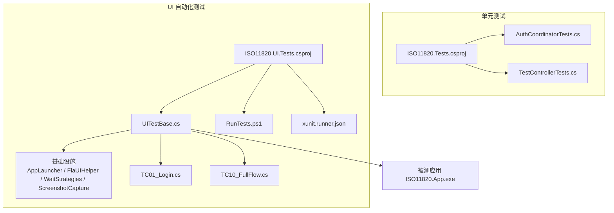
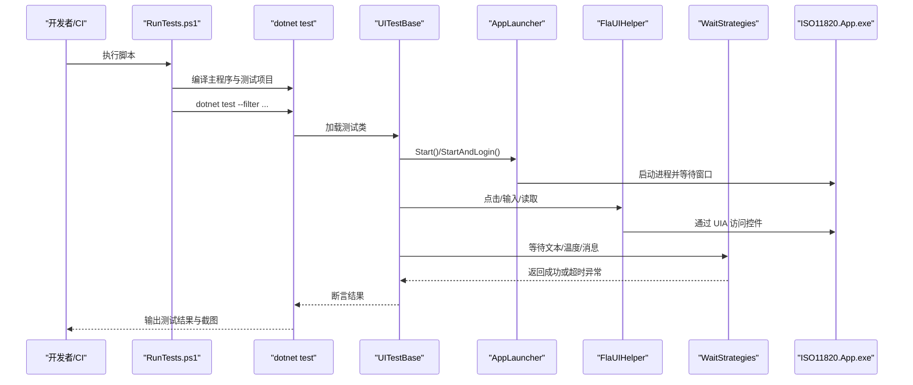
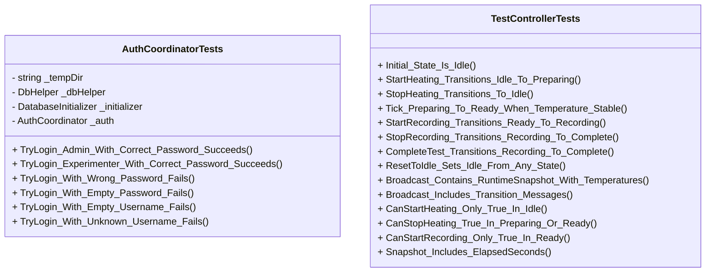
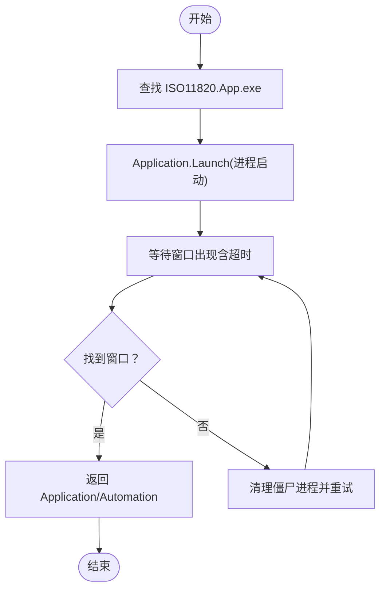
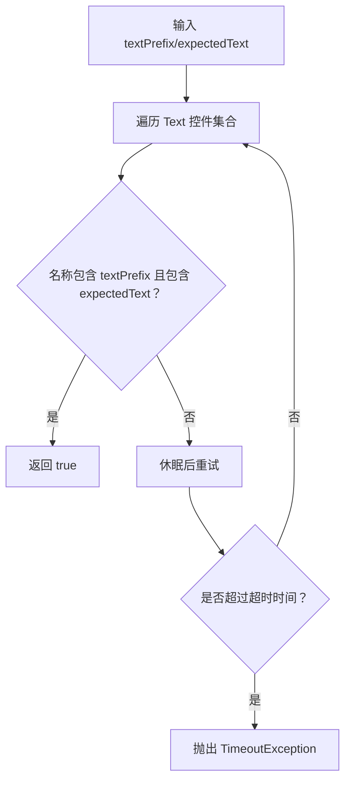
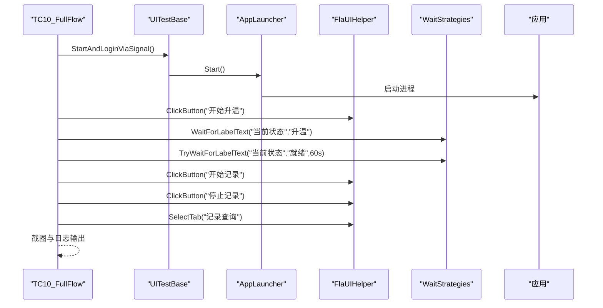
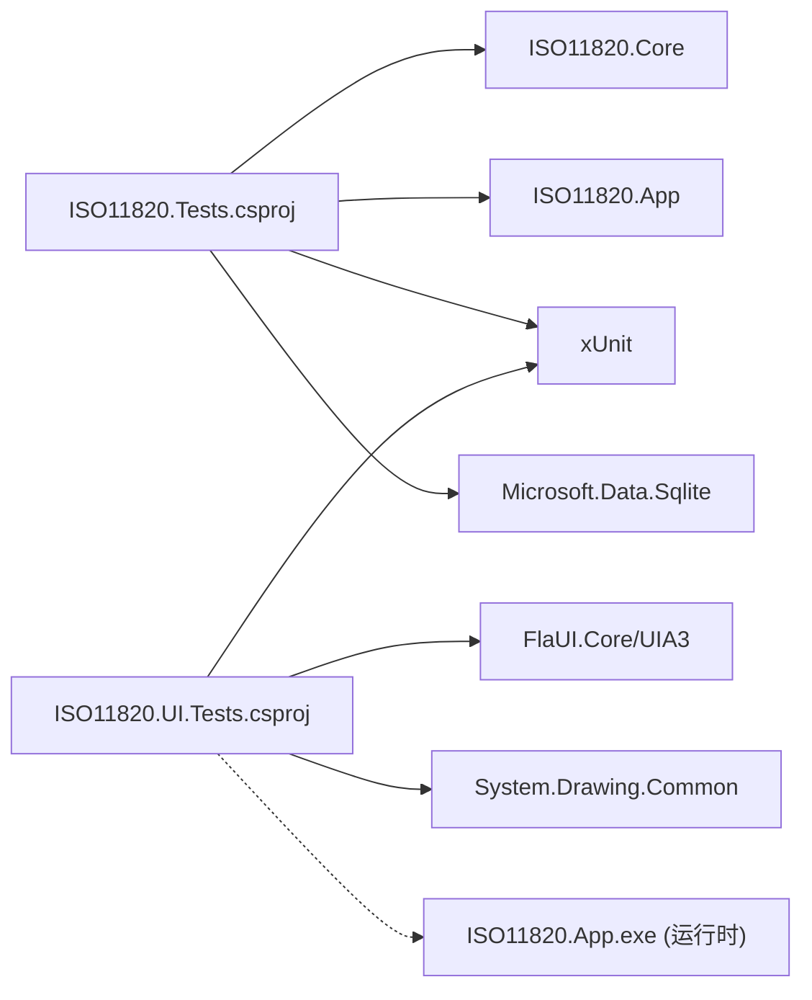

# 测试工作流

<cite>
**本文引用的文件**
- [ISO11820.Tests.csproj](file://tests/ISO11820.Tests/ISO11820.Tests.csproj)
- [AuthCoordinatorTests.cs](file://tests/ISO11820.Tests/Features/AuthCoordinatorTests.cs)
- [TestControllerTests.cs](file://tests/ISO11820.Tests/Runtime/TestControllerTests.cs)
- [ISO11820.UI.Tests.csproj](file://tests/ISO11820.UI.Tests/ISO11820.UI.Tests.csproj)
- [README.md](file://tests/ISO11820.UI.Tests/README.md)
- [xunit.runner.json](file://tests/ISO11820.UI.Tests/xunit.runner.json)
- [UITestBase.cs](file://tests/ISO11820.UI.Tests/UITestBase.cs)
- [AppLauncher.cs](file://tests/ISO11820.UI.Tests/Infrastructure/AppLauncher.cs)
- [FlaUIHelper.cs](file://tests/ISO11820.UI.Tests/Infrastructure/FlaUIHelper.cs)
- [WaitStrategies.cs](file://tests/ISO11820.UI.Tests/Infrastructure/WaitStrategies.cs)
- [ScreenshotCapture.cs](file://tests/ISO11820.UI.Tests/Infrastructure/ScreenshotCapture.cs)
- [RunTests.ps1](file://tests/ISO11820.UI.Tests/RunTests.ps1)
- [TC01_Login.cs](file://tests/ISO11820.UI.Tests/Tests/TC01_Login.cs)
- [TC10_FullFlow.cs](file://tests/ISO11820.UI.Tests/Tests/TC10_FullFlow.cs)
</cite>

## 目录
1. [引言](#引言)
2. [项目结构](#项目结构)
3. [核心组件](#核心组件)
4. [架构总览](#架构总览)
5. [详细组件分析](#详细组件分析)
6. [依赖关系分析](#依赖关系分析)
7. [性能与稳定性考量](#性能与稳定性考量)
8. [故障排查指南](#故障排查指南)
9. [结论](#结论)
10. [附录](#附录)

## 引言
本文件面向 ISO11820 桌面应用的测试团队，建立一套完整的测试工作流程与质量保证体系。内容覆盖：
- 单元测试框架 xUnit 的使用方法与最佳实践（用例设计、Mock 策略、异步处理）
- UI 自动化测试框架 FlaUI 的配置与使用（环境搭建、控件识别、数据管理）
- 覆盖率要求与持续集成建议
- 测试数据准备、环境隔离与结果分析
- 测试驱动开发（TDD）流程与重构指导原则

## 项目结构
仓库包含两类测试工程：
- 单元测试工程 tests/ISO11820.Tests：基于 xUnit，验证业务逻辑与运行时状态机
- UI 自动化验收测试工程 tests/ISO11820.UI.Tests：基于 xUnit + FlaUI，对 WinForms 应用进行端到端验证

图示来源
- [ISO11820.Tests.csproj:1-27](file://tests/ISO11820.Tests/ISO11820.Tests.csproj#L1-L27)
- [AuthCoordinatorTests.cs:1-105](file://tests/ISO11820.Tests/Features/AuthCoordinatorTests.cs#L1-L105)
- [TestControllerTests.cs:1-265](file://tests/ISO11820.Tests/Runtime/TestControllerTests.cs#L1-L265)
- [ISO11820.UI.Tests.csproj:1-38](file://tests/ISO11820.UI.Tests/ISO11820.UI.Tests.csproj#L1-L38)
- [UITestBase.cs:1-210](file://tests/ISO11820.UI.Tests/UITestBase.cs#L1-L210)
- [AppLauncher.cs:1-240](file://tests/ISO11820.UI.Tests/Infrastructure/AppLauncher.cs#L1-L240)
- [FlaUIHelper.cs:1-295](file://tests/ISO11820.UI.Tests/Infrastructure/FlaUIHelper.cs#L1-L295)
- [WaitStrategies.cs:1-176](file://tests/ISO11820.UI.Tests/Infrastructure/WaitStrategies.cs#L1-L176)
- [ScreenshotCapture.cs:1-48](file://tests/ISO11820.UI.Tests/Infrastructure/ScreenshotCapture.cs#L1-L48)
- [RunTests.ps1:1-112](file://tests/ISO11820.UI.Tests/RunTests.ps1#L1-L112)
- [xunit.runner.json:1-4](file://tests/ISO11820.UI.Tests/xunit.runner.json#L1-L4)

章节来源
- [ISO11820.Tests.csproj:1-27](file://tests/ISO11820.Tests/ISO11820.Tests.csproj#L1-L27)
- [ISO11820.UI.Tests.csproj:1-38](file://tests/ISO11820.UI.Tests/ISO11820.UI.Tests.csproj#L1-L38)

## 核心组件
- 单元测试层
  - 认证协调器测试：使用真实 SQLite 数据库验证登录成功/失败路径
  - 运行控制器测试：验证状态机流转、广播快照与消息
- UI 自动化层
  - 应用启动器：自动定位并启动被测应用，清理僵尸进程，等待窗口就绪
  - FlaUI 辅助：封装按钮点击、文本输入、标签读取、列表项等待等常用操作
  - 等待策略：针对文本变化、温度稳定、消息出现等场景的显式等待
  - 截图工具：在关键步骤自动保存屏幕截图，便于问题定位
  - 基类与脚本：统一启动/登录/截图能力；提供一键运行与过滤执行脚本

章节来源
- [AuthCoordinatorTests.cs:1-105](file://tests/ISO11820.Tests/Features/AuthCoordinatorTests.cs#L1-L105)
- [TestControllerTests.cs:1-265](file://tests/ISO11820.Tests/Runtime/TestControllerTests.cs#L1-L265)
- [UITestBase.cs:1-210](file://tests/ISO11820.UI.Tests/UITestBase.cs#L1-L210)
- [AppLauncher.cs:1-240](file://tests/ISO11820.UI.Tests/Infrastructure/AppLauncher.cs#L1-L240)
- [FlaUIHelper.cs:1-295](file://tests/ISO11820.UI.Tests/Infrastructure/FlaUIHelper.cs#L1-L295)
- [WaitStrategies.cs:1-176](file://tests/ISO11820.UI.Tests/Infrastructure/WaitStrategies.cs#L1-L176)
- [ScreenshotCapture.cs:1-48](file://tests/ISO11820.UI.Tests/Infrastructure/ScreenshotCapture.cs#L1-L48)
- [RunTests.ps1:1-112](file://tests/ISO11820.UI.Tests/RunTests.ps1#L1-L112)

## 架构总览
下图展示 UI 自动化测试从脚本到被测应用的调用链路与关键交互点。

图示来源
- [RunTests.ps1:1-112](file://tests/ISO11820.UI.Tests/RunTests.ps1#L1-L112)
- [UITestBase.cs:1-210](file://tests/ISO11820.UI.Tests/UITestBase.cs#L1-L210)
- [AppLauncher.cs:1-240](file://tests/ISO11820.UI.Tests/Infrastructure/AppLauncher.cs#L1-L240)
- [FlaUIHelper.cs:1-295](file://tests/ISO11820.UI.Tests/Infrastructure/FlaUIHelper.cs#L1-L295)
- [WaitStrategies.cs:1-176](file://tests/ISO11820.UI.Tests/Infrastructure/WaitStrategies.cs#L1-L176)

## 详细组件分析

### 单元测试：认证与状态机
- 认证测试
  - 使用临时 SQLite 文件作为持久化存储，确保每个测试用例的环境隔离
  - 覆盖正确密码、错误密码、空用户名/密码、未知用户等分支
- 状态机测试
  - 构造 TestController 与 SensorSimulator，模拟升温过程
  - 验证初始状态、状态转换、广播快照与消息、计时器等行为

图示来源
- [AuthCoordinatorTests.cs:1-105](file://tests/ISO11820.Tests/Features/AuthCoordinatorTests.cs#L1-L105)
- [TestControllerTests.cs:1-265](file://tests/ISO11820.Tests/Runtime/TestControllerTests.cs#L1-L265)

章节来源
- [AuthCoordinatorTests.cs:1-105](file://tests/ISO11820.Tests/Features/AuthCoordinatorTests.cs#L1-L105)
- [TestControllerTests.cs:1-265](file://tests/ISO11820.Tests/Runtime/TestControllerTests.cs#L1-L265)

### UI 自动化：基类与应用启动器
- UITestBase
  - 提供统一的启动、登录、截图、信号触发等方法
  - 封装 Win32 P/Invoke 以操作对话框中的 Edit 控件
- AppLauncher
  - 负责查找解决方案根目录、定位可执行文件、启动进程、等待窗口出现
  - 支持按标题模糊匹配窗口，提供登录流程封装
  - 具备僵尸进程清理能力，避免重复运行导致资源占用

图示来源
- [UITestBase.cs:1-210](file://tests/ISO11820.UI.Tests/UITestBase.cs#L1-L210)
- [AppLauncher.cs:1-240](file://tests/ISO11820.UI.Tests/Infrastructure/AppLauncher.cs#L1-L240)

章节来源
- [UITestBase.cs:1-210](file://tests/ISO11820.UI.Tests/UITestBase.cs#L1-L210)
- [AppLauncher.cs:1-240](file://tests/ISO11820.UI.Tests/Infrastructure/AppLauncher.cs#L1-L240)

### UI 自动化：控件识别与等待策略
- FlaUIHelper
  - 封装按钮点击、文本框输入、标签文本读取、单选/复选框操作、消息区域读取、ListBox 项等待、Tab 切换等
  - 优先使用 AutomationId，其次回退到 Name/类型匹配
- WaitStrategies
  - 提供文本前缀匹配、温度范围判定、消息关键词等待、窗口出现等待等
  - 所有等待均带超时与异常提示，避免硬编码 Sleep

图示来源
- [FlaUIHelper.cs:1-295](file://tests/ISO11820.UI.Tests/Infrastructure/FlaUIHelper.cs#L1-L295)
- [WaitStrategies.cs:1-176](file://tests/ISO11820.UI.Tests/Infrastructure/WaitStrategies.cs#L1-L176)

章节来源
- [FlaUIHelper.cs:1-295](file://tests/ISO11820.UI.Tests/Infrastructure/FlaUIHelper.cs#L1-L295)
- [WaitStrategies.cs:1-176](file://tests/ISO11820.UI.Tests/Infrastructure/WaitStrategies.cs#L1-L176)

### UI 自动化：端到端流程示例
- TC01_Login：覆盖登录界面元素存在性、角色选择、密码输入、登录成功/失败路径
- TC10_FullFlow：端到端演示流程，包括启动登录、新建试验、升温、稳定、记录、停止、导出检查等

图示来源
- [TC10_FullFlow.cs:1-360](file://tests/ISO11820.UI.Tests/Tests/TC10_FullFlow.cs#L1-L360)
- [UITestBase.cs:1-210](file://tests/ISO11820.UI.Tests/UITestBase.cs#L1-L210)
- [AppLauncher.cs:1-240](file://tests/ISO11820.UI.Tests/Infrastructure/AppLauncher.cs#L1-L240)
- [FlaUIHelper.cs:1-295](file://tests/ISO11820.UI.Tests/Infrastructure/FlaUIHelper.cs#L1-L295)
- [WaitStrategies.cs:1-176](file://tests/ISO11820.UI.Tests/Infrastructure/WaitStrategies.cs#L1-L176)

章节来源
- [TC01_Login.cs:1-212](file://tests/ISO11820.UI.Tests/Tests/TC01_Login.cs#L1-L212)
- [TC10_FullFlow.cs:1-360](file://tests/ISO11820.UI.Tests/Tests/TC10_FullFlow.cs#L1-L360)

## 依赖关系分析
- 测试工程依赖
  - 单元测试工程引用 Core 与 App 工程，直接验证业务逻辑
  - UI 测试工程不引用被测应用工程，通过运行时路径启动可执行文件
- 外部依赖
  - xUnit 与 Visual Studio 测试适配器
  - FlaUI.Core 与 UIA3 实现
  - System.Drawing.Common（截图）
  - Microsoft.Data.Sqlite（单元测试数据库）

图示来源
- [ISO11820.Tests.csproj:1-27](file://tests/ISO11820.Tests/ISO11820.Tests.csproj#L1-L27)
- [ISO11820.UI.Tests.csproj:1-38](file://tests/ISO11820.UI.Tests/ISO11820.UI.Tests.csproj#L1-L38)

章节来源
- [ISO11820.Tests.csproj:1-27](file://tests/ISO11820.Tests/ISO11820.Tests.csproj#L1-L27)
- [ISO11820.UI.Tests.csproj:1-38](file://tests/ISO11820.UI.Tests/ISO11820.UI.Tests.csproj#L1-L38)

## 性能与稳定性考量
- 并行控制
  - UI 测试禁用并行，避免共享应用实例导致的竞争条件
- 显式等待
  - 使用 WaitStrategies 替代固定延时，降低不稳定性和执行时长
- 资源清理
  - 应用启动器在启动前后清理僵尸进程，减少残留进程影响
- 截图开销
  - 仅在关键步骤截图，避免频繁 IO 影响整体性能

章节来源
- [xunit.runner.json:1-4](file://tests/ISO11820.UI.Tests/xunit.runner.json#L1-L4)
- [WaitStrategies.cs:1-176](file://tests/ISO11820.UI.Tests/Infrastructure/WaitStrategies.cs#L1-L176)
- [AppLauncher.cs:1-240](file://tests/ISO11820.UI.Tests/Infrastructure/AppLauncher.cs#L1-L240)
- [ScreenshotCapture.cs:1-48](file://tests/ISO11820.UI.Tests/Infrastructure/ScreenshotCapture.cs#L1-L48)

## 故障排查指南
- 应用启动失败
  - 确认已编译主程序，检查可执行文件路径与权限
- 控件未找到
  - 检查控件名称是否与源码一致，查看截图确认界面状态
- 超时
  - 调整仿真参数（升温速率、目标温度），或延长等待超时
- 运行脚本
  - 使用 RunTests.ps1 的过滤参数快速定位问题测试类

章节来源
- [README.md:1-238](file://tests/ISO11820.UI.Tests/README.md#L1-L238)
- [RunTests.ps1:1-112](file://tests/ISO11820.UI.Tests/RunTests.ps1#L1-L112)

## 结论
本项目已建立清晰的测试分层与基础设施：
- 单元测试聚焦业务逻辑与状态机，使用真实数据库保证可靠性
- UI 自动化测试围绕 FlaUI 构建稳定的控件识别与等待策略，配合截图与日志提升可观测性
- 通过脚本与配置简化本地与 CI 运行体验
建议后续补充覆盖率统计与 CI 流水线，完善 Mock 策略与异步测试规范，持续提升质量保障能力。

## 附录

### xUnit 使用方法与最佳实践
- 用例组织
  - 按功能域划分测试类与方法，使用 DisplayName 描述意图
- 数据与隔离
  - 使用临时目录与独立数据库文件，确保用例间互不影响
- Mock 对象
  - 对外部依赖（如文件系统、网络、硬件接口）采用接口抽象与替换实现
- 异步测试
  - 使用 async Task 与 await，避免阻塞线程；必要时结合显式等待策略

章节来源
- [AuthCoordinatorTests.cs:1-105](file://tests/ISO11820.Tests/Features/AuthCoordinatorTests.cs#L1-L105)
- [TestControllerTests.cs:1-265](file://tests/ISO11820.Tests/Runtime/TestControllerTests.cs#L1-L265)

### FlaUI 配置与使用要点
- 环境搭建
  - 安装 FlaUI.Core 与 UIA3 包，确保 .NET 8 目标框架
- 控件识别策略
  - 优先设置并使用 AutomationId；回退到 Name 与控件类型组合
- 测试数据管理
  - 使用信号文件与 Win32 注入方式填写对话框字段，提高稳定性
- 截图与日志
  - 在每个关键步骤截图，结合 ITestOutputHelper 输出诊断信息

章节来源
- [ISO11820.UI.Tests.csproj:1-38](file://tests/ISO11820.UI.Tests/ISO11820.UI.Tests.csproj#L1-L38)
- [UITestBase.cs:1-210](file://tests/ISO11820.UI.Tests/UITestBase.cs#L1-L210)
- [FlaUIHelper.cs:1-295](file://tests/ISO11820.UI.Tests/Infrastructure/FlaUIHelper.cs#L1-L295)
- [ScreenshotCapture.cs:1-48](file://tests/ISO11820.UI.Tests/Infrastructure/ScreenshotCapture.cs#L1-L48)

### 测试覆盖率要求与持续集成建议
- 覆盖率目标
  - 建议核心模块行覆盖率 ≥ 80%，分支覆盖率 ≥ 70%
- 报告生成
  - 使用 coverlet.collector 生成覆盖率报告，并在 CI 中归档
- CI 流水线
  - 构建 → 单元测试 → UI 自动化（串行）→ 覆盖率汇总 → 发布报告
  - 为 UI 测试分配专用代理，确保桌面环境与窗口可见

章节来源
- [ISO11820.Tests.csproj:1-27](file://tests/ISO11820.Tests/ISO11820.Tests.csproj#L1-L27)
- [RunTests.ps1:1-112](file://tests/ISO11820.UI.Tests/RunTests.ps1#L1-L112)

### 测试数据准备与环境隔离
- 单元测试
  - 使用临时目录与 GUID 命名数据库文件，测试结束后清理
- UI 自动化
  - 通过信号文件与 Win32 注入填充表单，避免 UI 元素不稳定
  - 截图输出至 Screenshots 目录，按测试类分文件夹归档

章节来源
- [AuthCoordinatorTests.cs:1-105](file://tests/ISO11820.Tests/Features/AuthCoordinatorTests.cs#L1-L105)
- [UITestBase.cs:1-210](file://tests/ISO11820.UI.Tests/UITestBase.cs#L1-L210)
- [ScreenshotCapture.cs:1-48](file://tests/ISO11820.UI.Tests/Infrastructure/ScreenshotCapture.cs#L1-L48)

### 测试结果分析方法
- 控制台输出
  - 使用 ITestOutputHelper 打印关键步骤与断言信息
- 截图回溯
  - 根据文件名与时间戳定位失败步骤，结合 UI 状态进行分析
- 过滤器运行
  - 使用 RunTests.ps1 的 Filter 参数快速复现特定用例

章节来源
- [TC10_FullFlow.cs:1-360](file://tests/ISO11820.UI.Tests/Tests/TC10_FullFlow.cs#L1-L360)
- [RunTests.ps1:1-112](file://tests/ISO11820.UI.Tests/RunTests.ps1#L1-L112)

### 测试驱动开发（TDD）流程与重构指导
- TDD 流程
  - 先写失败的测试用例 → 编写最小实现使其通过 → 重构代码保持绿色
- 重构原则
  - 保持测试契约不变；逐步拆分复杂方法；引入接口与依赖注入
- 回归保障
  - 新增功能需配套单测与 UI 用例，确保变更可追溯

[本节为方法论说明，不直接分析具体文件]