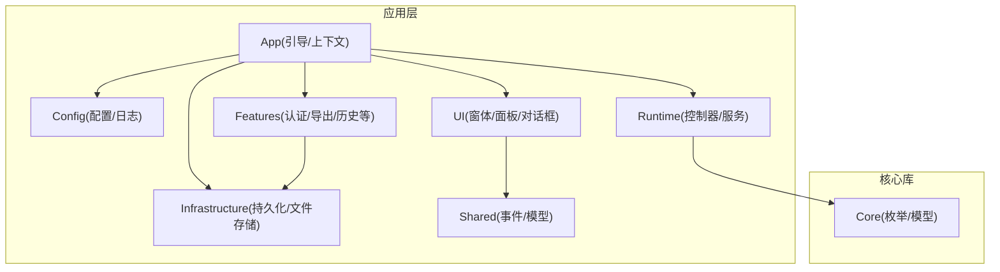
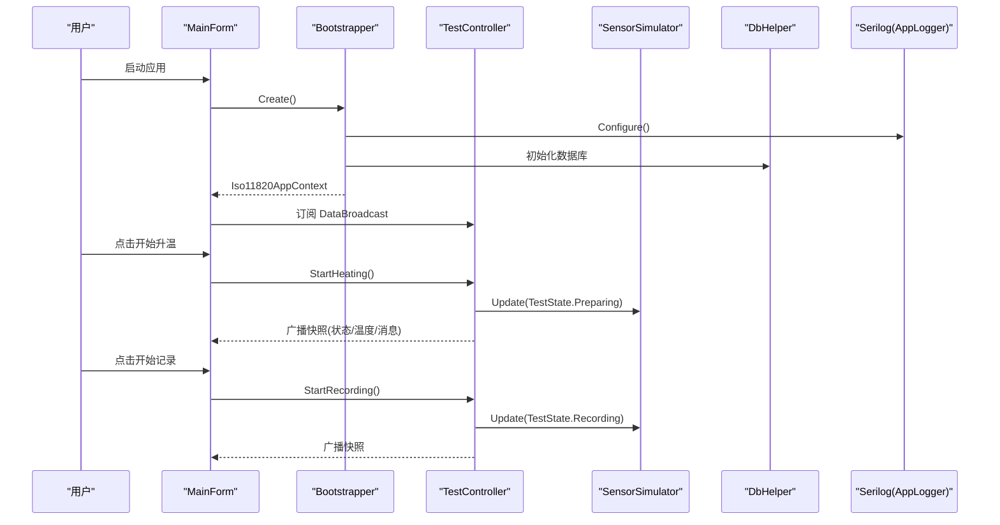
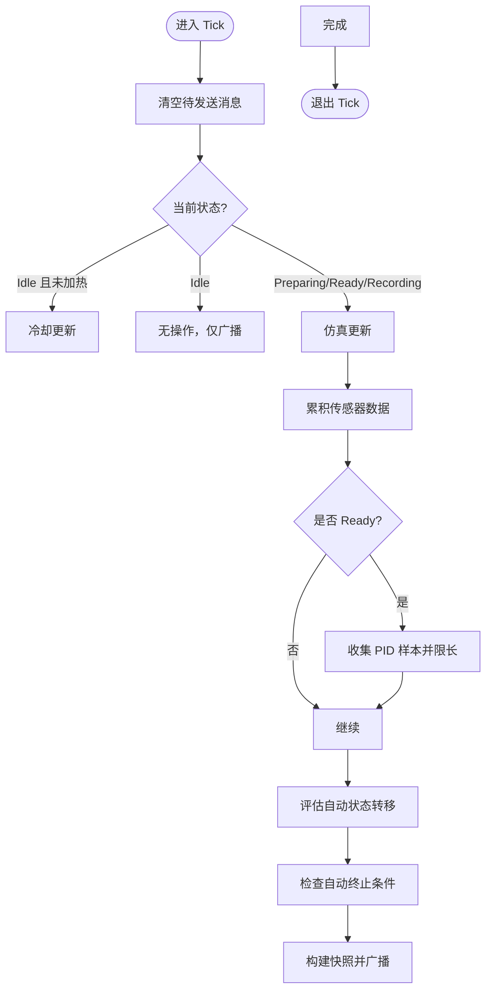
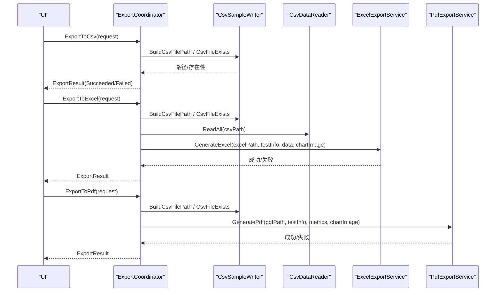
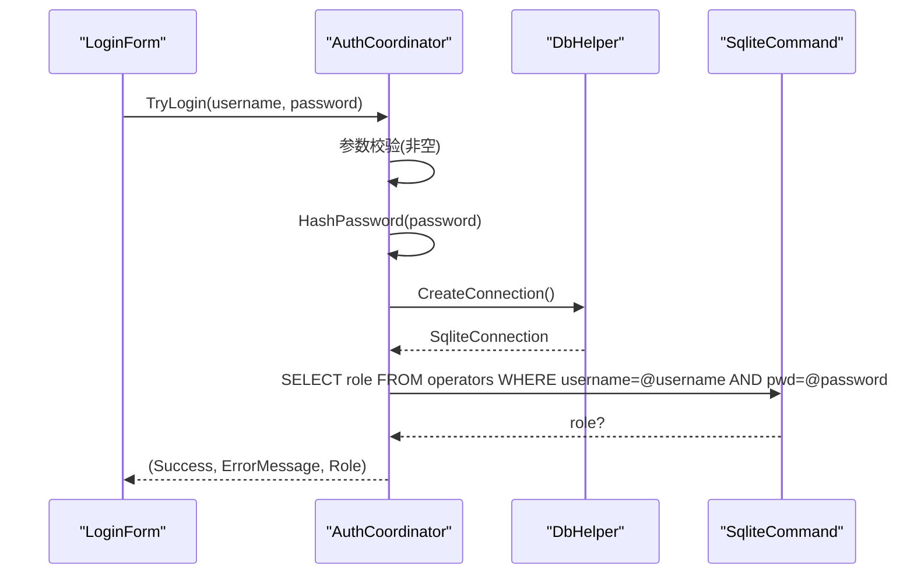
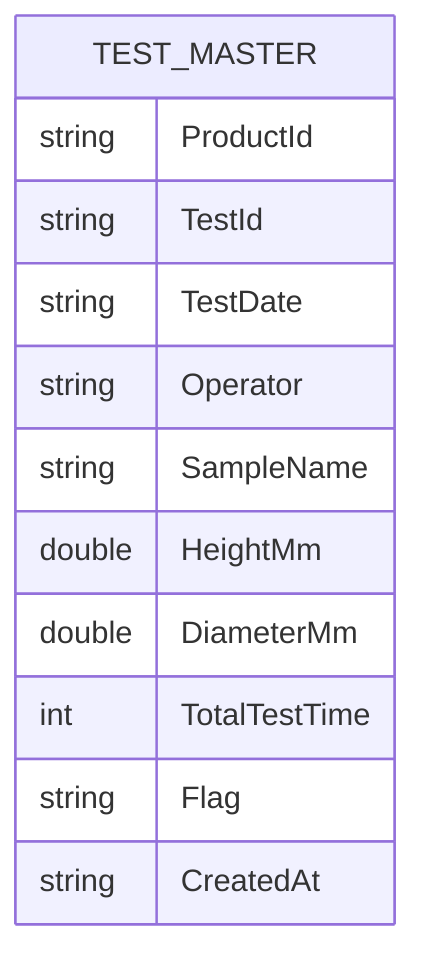
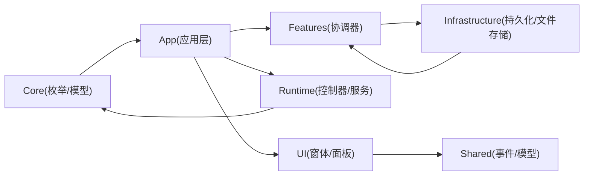

# 编码规范

<cite>
**本文引用的文件**   
- [Program.cs](file://src/ISO11820.App/Program.cs)
- [Bootstrapper.cs](file://src/ISO11820.App/App/Bootstrapper.cs)
- [AppSettings.cs](file://src/ISO11820.App/Config/AppSettings.cs)
- [AppLogger.cs](file://src/ISO11820.App/Config/AppLogger.cs)
- [AuthCoordinator.cs](file://src/ISO11820.App/Features/Auth/AuthCoordinator.cs)
- [DbHelper.cs](file://src/ISO11820.App/Infrastructure/Persistence/DbHelper.cs)
- [TestMaster.cs](file://src/ISO11820.App/Infrastructure/Persistence/Models/TestMaster.cs)
- [TestController.cs](file://src/ISO11820.App/Runtime/Controller/TestController.cs)
- [SensorSimulator.cs](file://src/ISO11820.App/Runtime/Services/SensorSimulator.cs)
- [ExportCoordinator.cs](file://src/ISO11820.App/Features/Export/ExportCoordinator.cs)
- [MainForm.cs](file://src/ISO11820.App/UI/Forms/MainForm.cs)
- [ParameterValidator.cs](file://src/ISO11820.App/UI/Common/ParameterValidator.cs)
- [SystemMessage.cs](file://src/ISO11820.Core/Models/SystemMessage.cs)
- [TestState.cs](file://src/ISO11820.Core/Enums/TestState.cs)
- [AuthCoordinatorTests.cs](file://tests/ISO11820.Tests/Features/AuthCoordinatorTests.cs)
- [TestControllerTests.cs](file://tests/ISO11820.Tests/Runtime/TestControllerTests.cs)
</cite>

## 目录
1. [引言](#引言)
2. [项目结构](#项目结构)
3. [核心组件](#核心组件)
4. [架构总览](#架构总览)
5. [详细组件分析](#详细组件分析)
6. [依赖分析](#依赖分析)
7. [性能考虑](#性能考虑)
8. [故障排查指南](#故障排查指南)
9. [结论](#结论)
10. [附录](#附录)

## 引言
本规范面向 ISO 11820 项目的 C# 代码，统一命名约定、格式化规则、注释风格、文件组织与模块划分原则，并给出错误处理、异常处理、日志记录的最佳实践，以及代码审查检查清单与质量标准。规范基于仓库现有实现提炼而成，确保可落地执行且与当前工程一致。

## 项目结构
- 解决方案包含应用层与核心库：
  - src/ISO11820.App：WinForms 应用，包含启动引导、配置、功能特性（Features）、基础设施（Infrastructure）、运行时（Runtime）、共享（Shared）与 UI。
  - src/ISO11820.Core：核心枚举与模型。
  - tests：单元测试与 UI 自动化测试。
- 命名空间按功能域分层，类名采用 PascalCase，字段使用下划线前缀的私有字段命名。

图表来源
- [Program.cs:1-25](file://src/ISO11820.App/Program.cs#L1-L25)
- [Bootstrapper.cs:1-66](file://src/ISO11820.App/App/Bootstrapper.cs#L1-L66)

章节来源
- [Program.cs:1-25](file://src/ISO11820.App/Program.cs#L1-L25)
- [Bootstrapper.cs:1-66](file://src/ISO11820.App/App/Bootstrapper.cs#L1-L66)

## 核心组件
- 启动与引导
  - Program 负责 WinForms 初始化、创建应用上下文、运行主窗体，并在 finally 中关闭日志。
  - Bootstrapper 负责全局初始化（日志、许可证、配置加载、数据库初始化、各协调器与服务实例化），返回应用上下文。
- 配置与日志
  - AppSettings 提供强类型配置与路径解析；AppLogger 使用 Serilog 输出到按日滚动的日志文件。
- 运行时控制
  - TestController 管理试验状态机、广播运行时快照、聚合传感器数据、自动终止判定。
  - SensorSimulator 模拟温度曲线、稳定判定、PID 输出与温漂计算。
- 功能特性
  - AuthCoordinator 登录校验（用户名+密码哈希比对）。
  - ExportCoordinator 汇总 CSV/Excel/PDF 导出流程与结果封装。
- UI
  - MainForm 承载界面布局与交互，通过事件订阅更新状态与消息。
- 核心模型
  - SystemMessage 为不可变记录类型；TestState 定义试验状态枚举。

章节来源
- [Program.cs:1-25](file://src/ISO11820.App/Program.cs#L1-L25)
- [Bootstrapper.cs:1-66](file://src/ISO11820.App/App/Bootstrapper.cs#L1-L66)
- [AppSettings.cs:1-160](file://src/ISO11820.App/Config/AppSettings.cs#L1-L160)
- [AppLogger.cs:1-32](file://src/ISO11820.App/Config/AppLogger.cs#L1-L32)
- [TestController.cs:1-328](file://src/ISO11820.App/Runtime/Controller/TestController.cs#L1-L328)
- [SensorSimulator.cs:1-223](file://src/ISO11820.App/Runtime/Services/SensorSimulator.cs#L1-L223)
- [AuthCoordinator.cs:1-62](file://src/ISO11820.App/Features/Auth/AuthCoordinator.cs#L1-L62)
- [ExportCoordinator.cs:1-229](file://src/ISO11820.App/Features/Export/ExportCoordinator.cs#L1-L229)
- [MainForm.cs:1-200](file://src/ISO11820.App/UI/Forms/MainForm.cs#L1-L200)
- [SystemMessage.cs:1-4](file://src/ISO11820.Core/Models/SystemMessage.cs#L1-L4)
- [TestState.cs:1-11](file://src/ISO11820.Core/Enums/TestState.cs#L1-L11)

## 架构总览
整体采用“引导装配 + 领域协调器 + 运行时控制器 + 仿真服务”的分层模式。UI 仅做展示与用户输入，业务逻辑集中在 Features 与 Runtime 层，数据访问在 Infrastructure 层。

图表来源
- [Program.cs:1-25](file://src/ISO11820.App/Program.cs#L1-L25)
- [Bootstrapper.cs:1-66](file://src/ISO11820.App/App/Bootstrapper.cs#L1-L66)
- [TestController.cs:1-328](file://src/ISO11820.App/Runtime/Controller/TestController.cs#L1-L328)
- [SensorSimulator.cs:1-223](file://src/ISO11820.App/Runtime/Services/SensorSimulator.cs#L1-L223)
- [DbHelper.cs:1-22](file://src/ISO11820.App/Infrastructure/Persistence/DbHelper.cs#L1-L22)
- [AppLogger.cs:1-32](file://src/ISO11820.App/Config/AppLogger.cs#L1-L32)

## 详细组件分析

### 命名约定
- 类与接口
  - 使用 PascalCase，如 TestController、ExportCoordinator、AuthCoordinator。
  - 内部静态装配类以名词结尾，如 Bootstrapper。
- 方法
  - 使用 PascalCase，动词开头，如 StartHeating、ExportToCsv、LoadDefault。
- 属性
  - 公共只读属性使用 PascalCase，如 SqlitePath、ConnectionString。
- 字段
  - 私有字段使用前导下划线加 PascalCase，如 _dbHelper、_sensorSimulator。
- 常量
  - 使用 const 或 static readonly，PascalCase，如 MaxPidSamples、MaxDriftSamples。
- 枚举
  - 使用 PascalCase，成员值语义清晰，如 TestState.Idle/Preparing/Ready/Recording/Complete。
- 命名空间
  - 与项目/功能域对应，如 ISO11820.App.Features.Auth、ISO11820.Core.Enums。

章节来源
- [TestController.cs:1-328](file://src/ISO11820.App/Runtime/Controller/TestController.cs#L1-L328)
- [ExportCoordinator.cs:1-229](file://src/ISO11820.App/Features/Export/ExportCoordinator.cs#L1-L229)
- [AuthCoordinator.cs:1-62](file://src/ISO11820.App/Features/Auth/AuthCoordinator.cs#L1-L62)
- [DbHelper.cs:1-22](file://src/ISO11820.App/Infrastructure/Persistence/DbHelper.cs#L1-L22)
- [TestState.cs:1-11](file://src/ISO11820.Core/Enums/TestState.cs#L1-L11)

### 代码格式化规则
- 缩进与空格
  - 使用 4 空格缩进；运算符两侧保留空格；逗号后保留空格。
- 换行与对齐
  - 长参数列表每行一个参数；链式调用保持可读性；lock 块内避免过长逻辑。
- 语句与块
  - if/else/for/while 始终使用大括号；单行条件分支允许省略大括号但需保持一致风格。
- 文件头与命名空间
  - 每个文件顶部 using 按系统库、第三方、项目内部分组排序（参考现有文件）。
- 不可变对象
  - 优先使用 record 与 init-only 属性，如 AppSettings 子项、SystemMessage。

章节来源
- [AppSettings.cs:1-160](file://src/ISO11820.App/Config/AppSettings.cs#L1-L160)
- [SystemMessage.cs:1-4](file://src/ISO11820.Core/Models/SystemMessage.cs#L1-L4)
- [ExportCoordinator.cs:1-229](file://src/ISO11820.App/Features/Export/ExportCoordinator.cs#L1-L229)

### 注释规范
- XML 文档注释
  - 对公共 API 使用 
/<param>/<returns> 描述用途、参数与返回值。
  - 示例：AuthCoordinator.TryLogin、ExportCoordinator.ExportToCsv。
- 行内注释
  - 解释复杂判断与边界条件，如自动终止检查点、稳定阈值判定。
- 复杂逻辑说明
  - 对算法与状态机转换添加注释，明确触发条件与副作用。

章节来源
- [AuthCoordinator.cs:1-62](file://src/ISO11820.App/Features/Auth/AuthCoordinator.cs#L1-L62)
- [ExportCoordinator.cs:1-229](file://src/ISO11820.App/Features/Export/ExportCoordinator.cs#L1-L229)
- [TestController.cs:1-328](file://src/ISO11820.App/Runtime/Controller/TestController.cs#L1-L328)

### 文件组织结构与模块划分
- 应用层
  - App：引导与上下文。
  - Config：配置与日志。
  - Features：按业务域划分的协调器（Auth、Export、History、Calibration、TestExecution、TestRecord）。
  - Infrastructure：持久化（Persistence）与文件存储（FileStorage）。
  - Runtime：控制器（Controller）与服务（Services）。
  - Shared：跨层事件与模型。
  - UI：窗体、面板、对话框与通用控件。
- 核心库
  - Core：枚举与模型，供应用层引用。
- 测试
  - tests/ISO11820.Tests：单元测试。
  - tests/ISO11820.UI.Tests：UI 自动化测试。

章节来源
- [Bootstrapper.cs:1-66](file://src/ISO11820.App/App/Bootstrapper.cs#L1-L66)
- [Program.cs:1-25](file://src/ISO11820.App/Program.cs#L1-L25)

### 错误处理与异常处理最佳实践
- 参数校验
  - 使用 ArgumentException.ThrowIfNullOrWhiteSpace 与 ArgumentNullException.ThrowIfNull 进行前置校验。
- 返回值表达失败
  - 对外暴露的方法返回结构化结果（如 ExportResult），包含 Success/FilePath/Error 等字段。
- 异常捕获
  - 在 I/O 与外部依赖处 try/catch，记录错误信息并返回失败结果。
- 资源释放
  - 使用 using 包裹连接与命令对象；finally 中关闭日志。
- 线程安全
  - 关键状态变更使用 lock 保护；跨线程 UI 更新通过 InvokeRequired/Invoke。

章节来源
- [ExportCoordinator.cs:1-229](file://src/ISO11820.App/Features/Export/ExportCoordinator.cs#L1-L229)
- [Program.cs:1-25](file://src/ISO11820.App/Program.cs#L1-L25)
- [DbHelper.cs:1-22](file://src/ISO11820.App/Infrastructure/Persistence/DbHelper.cs#L1-L22)
- [TestController.cs:1-328](file://src/ISO11820.App/Runtime/Controller/TestController.cs#L1-L328)
- [MainForm.cs:1-200](file://src/ISO11820.App/UI/Forms/MainForm.cs#L1-L200)

### 日志记录标准格式
- 使用 Serilog，最低级别 Information。
- 输出到 Logs 目录，按日滚动，限制文件大小与保留天数。
- 模板包含时间戳、级别、消息与异常。
- 启动时记录关键初始化信息，结束时 CloseAndFlush。

章节来源
- [AppLogger.cs:1-32](file://src/ISO11820.App/Config/AppLogger.cs#L1-L32)
- [Bootstrapper.cs:1-66](file://src/ISO11820.App/App/Bootstrapper.cs#L1-L66)
- [Program.cs:1-25](file://src/ISO11820.App/Program.cs#L1-L25)

### 状态机与数据处理流程（TestController）

图表来源
- [TestController.cs:1-328](file://src/ISO11820.App/Runtime/Controller/TestController.cs#L1-L328)

章节来源
- [TestController.cs:1-328](file://src/ISO11820.App/Runtime/Controller/TestController.cs#L1-L328)

### 导出流程（ExportCoordinator）

图表来源
- [ExportCoordinator.cs:1-229](file://src/ISO11820.App/Features/Export/ExportCoordinator.cs#L1-L229)

章节来源
- [ExportCoordinator.cs:1-229](file://src/ISO11820.App/Features/Export/ExportCoordinator.cs#L1-L229)

### 认证流程（AuthCoordinator）

图表来源
- [AuthCoordinator.cs:1-62](file://src/ISO11820.App/Features/Auth/AuthCoordinator.cs#L1-L62)
- [DbHelper.cs:1-22](file://src/ISO11820.App/Infrastructure/Persistence/DbHelper.cs#L1-L22)

章节来源
- [AuthCoordinator.cs:1-62](file://src/ISO11820.App/Features/Auth/AuthCoordinator.cs#L1-L62)
- [DbHelper.cs:1-22](file://src/ISO11820.App/Infrastructure/Persistence/DbHelper.cs#L1-L22)

### 数据模型关系（部分）

图表来源
- [TestMaster.cs:1-47](file://src/ISO11820.App/Infrastructure/Persistence/Models/TestMaster.cs#L1-L47)

章节来源
- [TestMaster.cs:1-47](file://src/ISO11820.App/Infrastructure/Persistence/Models/TestMaster.cs#L1-L47)

## 依赖分析
- 应用层依赖核心库（Core）的枚举与模型。
- Features 层依赖 Infrastructure（持久化/文件存储）与 Runtime（控制器/服务）。
- UI 层仅依赖共享事件与模型，不直接访问数据库。
- 引导层集中装配依赖，降低耦合度。

图表来源
- [Bootstrapper.cs:1-66](file://src/ISO11820.App/App/Bootstrapper.cs#L1-L66)
- [TestController.cs:1-328](file://src/ISO11820.App/Runtime/Controller/TestController.cs#L1-L328)
- [ExportCoordinator.cs:1-229](file://src/ISO11820.App/Features/Export/ExportCoordinator.cs#L1-L229)

章节来源
- [Bootstrapper.cs:1-66](file://src/ISO11820.App/App/Bootstrapper.cs#L1-L66)
- [TestController.cs:1-328](file://src/ISO11820.App/Runtime/Controller/TestController.cs#L1-L328)
- [ExportCoordinator.cs:1-229](file://src/ISO11820.App/Features/Export/ExportCoordinator.cs#L1-L229)

## 性能考虑
- 定时器驱动 Tick 频率固定（约 800ms），避免频繁 UI 更新。
- 使用队列限长保存 PID 样本，防止内存增长。
- 温漂计算使用最近 N 个采样点进行线性回归，平衡精度与开销。
- 文件导出批量写入，减少 I/O 次数。
- 日志滚动策略限制磁盘占用。

[本节为通用指导，无需列出具体文件来源]

## 故障排查指南
- 启动失败
  - 检查 appsettings.json 是否存在及路径解析是否正确。
  - 查看 Logs 目录下日志文件，确认初始化阶段错误。
- 数据库问题
  - 确认 DbHelper 连接字符串与 SQLite 文件路径。
  - 检查 DatabaseInitializer 是否成功创建表结构。
- 认证失败
  - 核对用户名与密码哈希是否匹配。
  - 检查 operators 表数据完整性。
- 导出失败
  - 确认 CSV 文件是否存在且非空。
  - 检查 Excel/PDF 生成服务的权限与依赖。
- UI 线程问题
  - 确保后台线程更新 UI 时使用 InvokeRequired/Invoke。

章节来源
- [AppSettings.cs:1-160](file://src/ISO11820.App/Config/AppSettings.cs#L1-L160)
- [AppLogger.cs:1-32](file://src/ISO11820.App/Config/AppLogger.cs#L1-L32)
- [DbHelper.cs:1-22](file://src/ISO11820.App/Infrastructure/Persistence/DbHelper.cs#L1-L22)
- [AuthCoordinator.cs:1-62](file://src/ISO11820.App/Features/Auth/AuthCoordinator.cs#L1-L62)
- [ExportCoordinator.cs:1-229](file://src/ISO11820.App/Features/Export/ExportCoordinator.cs#L1-L229)
- [MainForm.cs:1-200](file://src/ISO11820.App/UI/Forms/MainForm.cs#L1-L200)

## 结论
本规范总结了 ISO 11820 项目在命名、格式化、注释、结构、错误处理、日志与性能方面的实践要点。遵循这些约定有助于提升代码一致性、可维护性与可测试性。建议将本规范纳入团队开发流程，并结合 CI 检查与代码评审持续改进。

[本节为总结性内容，无需列出具体文件来源]

## 附录

### 代码审查检查清单
- 命名是否符合约定（类/方法/属性/字段/常量/命名空间）。
- 是否使用不可变对象与 init-only 属性。
- 是否对公共 API 添加 XML 文档注释。
- 是否进行参数校验与异常处理。
- 是否避免在 UI 线程执行耗时操作。
- 是否正确使用 lock 保护共享状态。
- 是否使用结构化结果表达失败（如 ExportResult）。
- 是否记录必要的日志信息。
- 是否编写覆盖关键路径的单元测试。

[本节为通用指导，无需列出具体文件来源]

### 质量标准
- 单元测试覆盖率：关键业务逻辑与状态机应达到较高覆盖率。
- 静态分析：启用 Roslyn 分析器，修复警告。
- 代码复杂度：避免过深嵌套与过长方法。
- 可测试性：通过构造函数注入依赖，便于替换与模拟。
- 可观测性：关键路径记录日志，便于定位问题。

章节来源
- [AuthCoordinatorTests.cs:1-105](file://tests/ISO11820.Tests/Features/AuthCoordinatorTests.cs#L1-L105)
- [TestControllerTests.cs:1-200](file://tests/ISO11820.Tests/Runtime/TestControllerTests.cs#L1-L200)