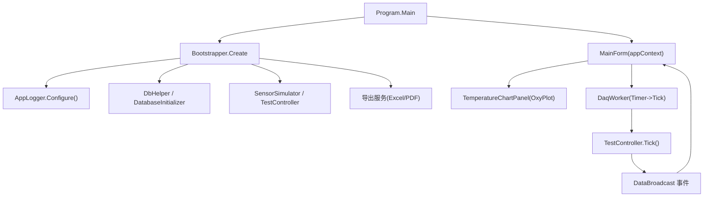
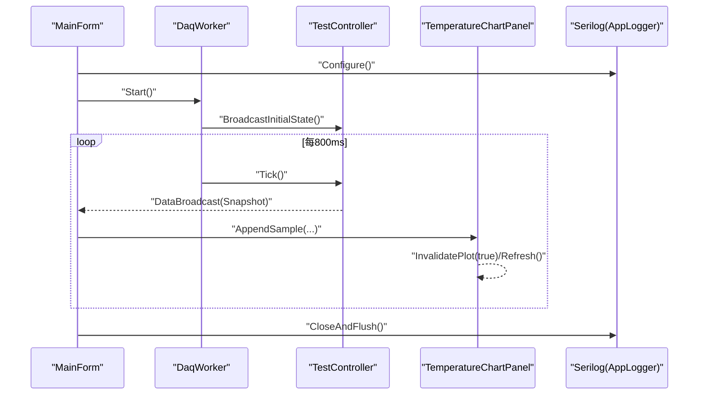
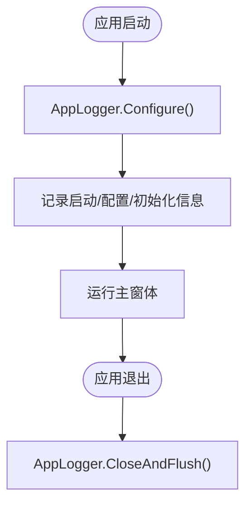
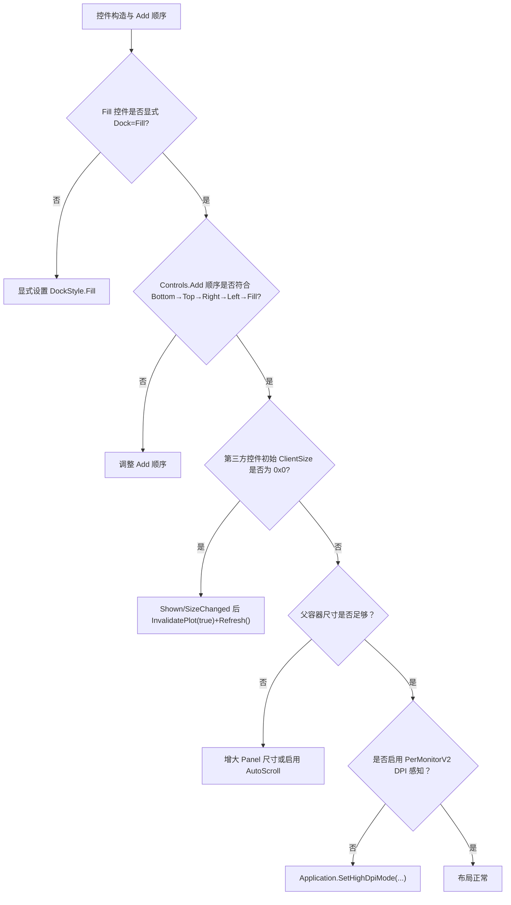
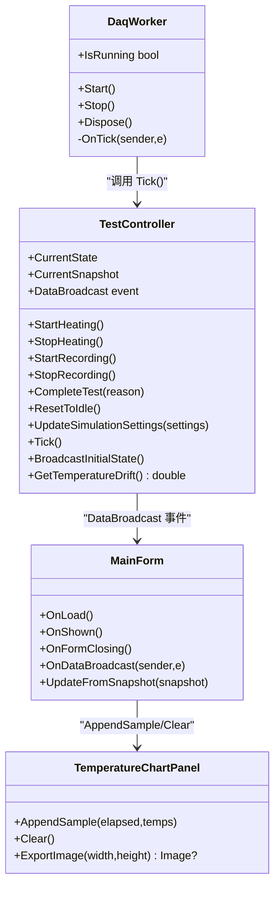
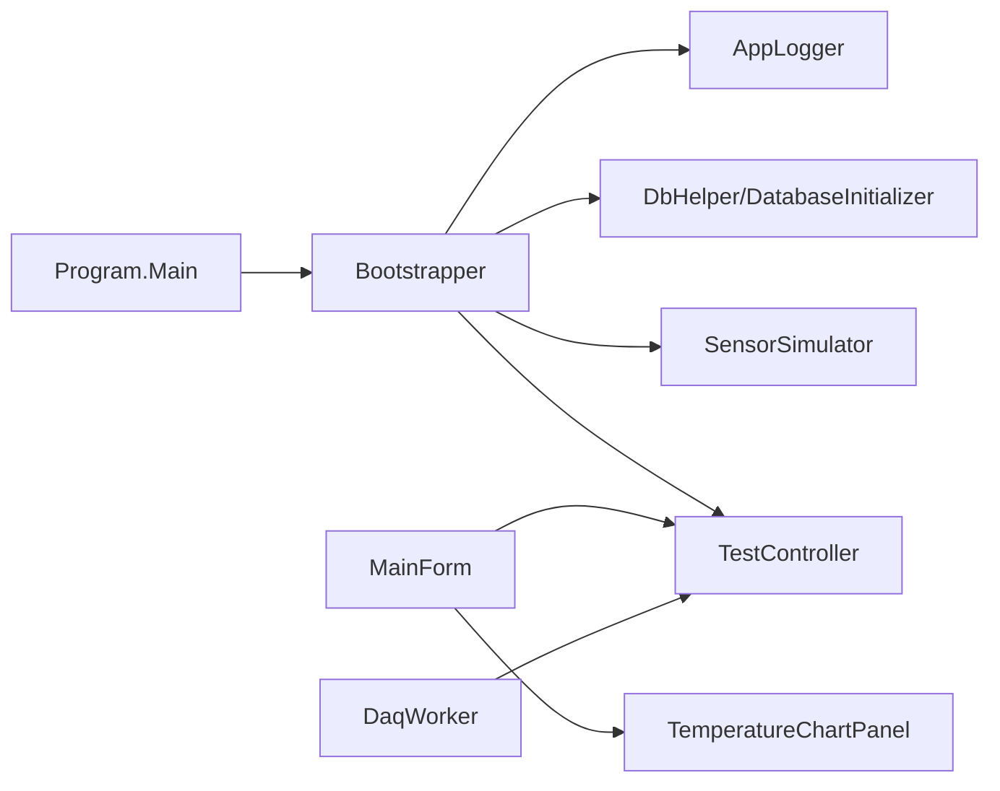

# 调试技巧

<cite>
**本文引用的文件**   
- [Program.cs](file://src/ISO11820.App/Program.cs)
- [Bootstrapper.cs](file://src/ISO11820.App/App/Bootstrapper.cs)
- [AppLogger.cs](file://src/ISO11820.App/Config/AppLogger.cs)
- [appsettings.json](file://src/ISO11820.App/appsettings.json)
- [MainForm.cs](file://src/ISO11820.App/UI/Forms/MainForm.cs)
- [TemperatureChartPanel.cs](file://src/ISO11820.App/UI/Chart/TemperatureChartPanel.cs)
- [DaqWorker.cs](file://src/ISO11820.App/Runtime/Services/DaqWorker.cs)
- [TestController.cs](file://src/ISO11820.App/Runtime/Controller/TestController.cs)
- [SKILL.md（WinForms布局排查技能）](file://.claude/skills/winforms-layout-debug/SKILL.md)
- [UITestBase.cs](file://tests/ISO11820.UI.Tests/UITestBase.cs)
</cite>

## 目录
1. [简介](#简介)
2. [项目结构](#项目结构)
3. [核心组件](#核心组件)
4. [架构总览](#架构总览)
5. [详细组件分析](#详细组件分析)
6. [依赖关系分析](#依赖关系分析)
7. [性能与内存分析](#性能与内存分析)
8. [故障排除指南](#故障排除指南)
9. [结论](#结论)
10. [附录：常用断点与日志定位清单](#附录常用断点与日志定位清单)

## 简介
本指南面向使用 Visual Studio 调试 WinForms 应用与 Serilog 日志的工程师，结合本项目实际代码，提供一套可操作的调试与排障方法。内容覆盖：
- Visual Studio 高级断点用法（条件、数据、函数断点）
- Serilog 配置与分析（级别、输出目标、查询技巧）
- WinForms 布局问题系统化排查（Dock 顺序、Z-Order、第三方控件渲染时序、DPI 缩放）
- 性能分析与内存泄漏检测、CPU 使用率监控
- 常见错误的诊断模式与解决方案

## 项目结构
本项目采用分层组织：UI（WinForms）、运行时控制器与服务、基础设施（持久化、文件存储）、配置与启动引导。关键入口与初始化流程如下：
- Program.Main 负责 UI 线程初始化、引导器创建、主窗体运行与日志关闭
- Bootstrapper.Create 完成日志、配置加载、数据库初始化、服务装配与上下文返回
- MainForm 构建界面、订阅事件、驱动后台采集与图表更新
- TemperatureChartPanel 封装 OxyPlot 图表绘制与刷新策略
- DaqWorker 定时触发 TestController.Tick
- TestController 维护状态机、消息与快照广播

图示来源
- [Program.cs:9-24](file://src/ISO11820.App/Program.cs#L9-L24)
- [Bootstrapper.cs:19-64](file://src/ISO11820.App/App/Bootstrapper.cs#L19-L64)
- [AppLogger.cs:10-25](file://src/ISO11820.App/Config/AppLogger.cs#L10-L25)
- [MainForm.cs:79-460](file://src/ISO11820.App/UI/Forms/MainForm.cs#L79-L460)
- [TemperatureChartPanel.cs:30-84](file://src/ISO11820.App/UI/Chart/TemperatureChartPanel.cs#L30-L84)
- [DaqWorker.cs:13-48](file://src/ISO11820.App/Runtime/Services/DaqWorker.cs#L13-L48)
- [TestController.cs:171-213](file://src/ISO11820.App/Runtime/Controller/TestController.cs#L171-L213)

章节来源
- [Program.cs:9-24](file://src/ISO11820.App/Program.cs#L9-L24)
- [Bootstrapper.cs:19-64](file://src/ISO11820.App/App/Bootstrapper.cs#L19-L64)

## 核心组件
- 日志系统（Serilog）
  - 通过 AppLogger.Configure 初始化文件输出、滚动策略与模板；在程序退出时调用 CloseAndFlush 确保落盘
  - 启动阶段记录关键信息（启动、配置加载、数据库初始化）
- 启动引导（Bootstrapper）
  - 统一装配服务、初始化数据库、设置 EPPlus 许可证上下文
- UI 主窗体（MainForm）
  - 登录流程、按钮状态管理、温度显示、消息框、图表更新、记录查询
  - 跨线程更新通过 InvokeRequired/Invoke 保证安全
- 图表面板（TemperatureChartPanel）
  - OxyPlot PlotView 绑定 Model，处理尺寸变化与重绘，附加诊断写入临时文件
- 数据采集（DaqWorker + TestController）
  - 定时器驱动 Tick，状态机推进，消息与快照广播

章节来源
- [AppLogger.cs:10-31](file://src/ISO11820.App/Config/AppLogger.cs#L10-L31)
- [Bootstrapper.cs:19-64](file://src/ISO11820.App/App/Bootstrapper.cs#L19-L64)
- [MainForm.cs:497-531](file://src/ISO11820.App/UI/Forms/MainForm.cs#L497-L531)
- [TemperatureChartPanel.cs:86-105](file://src/ISO11820.App/UI/Chart/TemperatureChartPanel.cs#L86-L105)
- [DaqWorker.cs:23-48](file://src/ISO11820.App/Runtime/Services/DaqWorker.cs#L23-L48)
- [TestController.cs:30-35](file://src/ISO11820.App/Runtime/Controller/TestController.cs#L30-L35)

## 架构总览
下图展示从 UI 到运行时再到图表更新的完整调用链，便于定位“无曲线显示”“状态不更新”等问题。

图示来源
- [Program.cs:14-22](file://src/ISO11820.App/Program.cs#L14-L22)
- [Bootstrapper.cs:22-29](file://src/ISO11820.App/App/Bootstrapper.cs#L22-L29)
- [MainForm.cs:522-531](file://src/ISO11820.App/UI/Forms/MainForm.cs#L522-L531)
- [DaqWorker.cs:23-48](file://src/ISO11820.App/Runtime/Services/DaqWorker.cs#L23-L48)
- [TestController.cs:171-213](file://src/ISO11820.App/Runtime/Controller/TestController.cs#L171-L213)
- [TemperatureChartPanel.cs:122-153](file://src/ISO11820.App/UI/Chart/TemperatureChartPanel.cs#L122-L153)

## 详细组件分析

### 组件A：Serilog 日志系统与配置
- 配置要点
  - 最低级别设置为 Information
  - 文件输出按日滚动、单文件大小限制、保留天数、输出模板包含时间戳、级别、消息与异常
  - 应用退出前调用 CloseAndFlush 确保日志落盘
- 使用建议
  - 启动阶段记录关键路径（数据库、文件存储）
  - 业务关键路径追加结构化日志（如测试开始/结束、参数变更）
- 常见问题
  - 日志未生成：检查 BaseDirectory 权限、Logs 目录是否存在、是否调用了 CloseAndFlush
  - 日志过大：调整 fileSizeLimitBytes 与 retainedFileCountLimit
  - 级别过低：将 MinimumLevel 调整为 Debug 以捕获更详细信息

图示来源
- [AppLogger.cs:10-31](file://src/ISO11820.App/Config/AppLogger.cs#L10-L31)
- [Bootstrapper.cs:22-49](file://src/ISO11820.App/App/Bootstrapper.cs#L22-L49)
- [Program.cs:14-22](file://src/ISO11820.App/Program.cs#L14-L22)

章节来源
- [AppLogger.cs:10-31](file://src/ISO11820.App/Config/AppLogger.cs#L10-L31)
- [Bootstrapper.cs:22-49](file://src/ISO11820.App/App/Bootstrapper.cs#L22-L49)
- [Program.cs:14-22](file://src/ISO11820.App/Program.cs#L14-L22)

### 组件B：WinForms 布局与 OxyPlot 渲染时序
- Dock 顺序原则
  - Bottom → Top → Right → Left → Fill，后添加的控件先占空间
- Z-Order 层叠
  - 同 Dock 区域中，后添加的控件位于上层
- 第三方控件渲染时序
  - OxyPlot 在 ClientSize 为 0×0 时不会渲染，需在 Shown 或 SizeChanged 后强制刷新
- DPI 缩放
  - 启用 PerMonitorV2，避免高 DPI 下布局偏移与字体模糊

图示来源
- [MainForm.cs:94-277](file://src/ISO11820.App/UI/Forms/MainForm.cs#L94-L277)
- [TemperatureChartPanel.cs:72-84](file://src/ISO11820.App/UI/Chart/TemperatureChartPanel.cs#L72-L84)
- [SKILL.md（WinForms布局排查技能）](file://.claude/skills/winforms-layout-debug/SKILL.md)

章节来源
- [MainForm.cs:94-277](file://src/ISO11820.App/UI/Forms/MainForm.cs#L94-L277)
- [TemperatureChartPanel.cs:72-105](file://src/ISO11820.App/UI/Chart/TemperatureChartPanel.cs#L72-L105)
- [SKILL.md（WinForms布局排查技能）](file://.claude/skills/winforms-layout-debug/SKILL.md)

### 组件C：运行时状态机与数据广播
- 状态机
  - Idle → Preparing → Ready → Recording → Complete，支持用户手动停止与自动终止
- 广播机制
  - 每次状态变化构建 RuntimeSnapshot 并通过 DataBroadcast 事件通知 UI
- 定时器驱动
  - DaqWorker 每 800ms 触发一次 Tick，内部累积传感器数据并评估自动转换与终止条件

图示来源
- [TestController.cs:30-35](file://src/ISO11820.App/Runtime/Controller/TestController.cs#L30-L35)
- [TestController.cs:57-143](file://src/ISO11820.App/Runtime/Controller/TestController.cs#L57-L143)
- [TestController.cs:171-213](file://src/ISO11820.App/Runtime/Controller/TestController.cs#L171-L213)
- [DaqWorker.cs:13-48](file://src/ISO11820.App/Runtime/Services/DaqWorker.cs#L13-L48)
- [MainForm.cs:537-609](file://src/ISO11820.App/UI/Forms/MainForm.cs#L537-L609)
- [TemperatureChartPanel.cs:122-153](file://src/ISO11820.App/UI/Chart/TemperatureChartPanel.cs#L122-L153)

章节来源
- [TestController.cs:57-143](file://src/ISO11820.App/Runtime/Controller/TestController.cs#L57-L143)
- [TestController.cs:171-213](file://src/ISO11820.App/Runtime/Controller/TestController.cs#L171-L213)
- [DaqWorker.cs:23-48](file://src/ISO11820.App/Runtime/Services/DaqWorker.cs#L23-L48)
- [MainForm.cs:537-609](file://src/ISO11820.App/UI/Forms/MainForm.cs#L537-L609)
- [TemperatureChartPanel.cs:122-153](file://src/ISO11820.App/UI/Chart/TemperatureChartPanel.cs#L122-L153)

## 依赖关系分析
- 启动依赖
  - Program.Main 依赖 Bootstrapper 与 AppLogger
  - Bootstrapper 依赖配置、数据库、文件存储、仿真与控制器
- UI 依赖
  - MainForm 依赖各协调器、控制器、图表面板与按钮状态管理器
- 运行时依赖
  - DaqWorker 依赖 TestController
  - TestController 依赖 SensorSimulator 与消息队列、缓冲区

图示来源
- [Program.cs:9-24](file://src/ISO11820.App/Program.cs#L9-L24)
- [Bootstrapper.cs:19-64](file://src/ISO11820.App/App/Bootstrapper.cs#L19-L64)
- [MainForm.cs:79-460](file://src/ISO11820.App/UI/Forms/MainForm.cs#L79-L460)
- [TemperatureChartPanel.cs:30-84](file://src/ISO11820.App/UI/Chart/TemperatureChartPanel.cs#L30-L84)
- [DaqWorker.cs:13-48](file://src/ISO11820.App/Runtime/Services/DaqWorker.cs#L13-L48)
- [TestController.cs:171-213](file://src/ISO11820.App/Runtime/Controller/TestController.cs#L171-L213)

章节来源
- [Program.cs:9-24](file://src/ISO11820.App/Program.cs#L9-L24)
- [Bootstrapper.cs:19-64](file://src/ISO11820.App/App/Bootstrapper.cs#L19-L64)

## 性能与内存分析
- CPU 使用率监控
  - 使用 Visual Studio 性能分析器（CPU 采样）定位热点，重点关注：
    - TestController.Tick 循环内的计算与广播
    - MainForm.UpdateFromSnapshot 中的 UI 更新与 RichTextBox 追加
    - TemperatureChartPanel.AppendSample 的点裁剪与轴窗口滚动
- 内存泄漏检测
  - 使用 Visual Studio 内存诊断（堆快照对比）关注：
    - 定时器与事件订阅未释放（注意 MainForm.FormClosing 中取消订阅与 DaqWorker.Stop）
    - 图表系列 Points 集合增长是否受 MaxPoints 限制
    - 文件句柄与导出对象是否正确释放
- IO 瓶颈
  - 频繁 AppendAllText 到临时文件可能影响性能，建议在调试开关控制下启用
- 优化建议
  - 批量 UI 更新合并（减少多次 Append）
  - 图表增量更新与节流（避免高频刷新）
  - 日志级别按需切换（Debug 仅用于问题复现场景）

[本节为通用指导，无需特定文件引用]

## 故障排除指南

### 一、Visual Studio 高级断点用法
- 条件断点
  - 适用场景：仅在特定状态或变量值命中时中断（例如只在 TestState.Recording 时进入 UpdateFromSnapshot）
  - 操作要点：右键断点 → 条件 → 输入表达式（如 snapshot.State == TestState.Recording）
- 数据断点（监视内存地址）
  - 适用场景：定位某字段被意外修改的位置（例如 _isHeating、_constantPower）
  - 操作要点：内存窗口 → 监视地址 → 命中时中断
- 函数断点（命中/跳出断点）
  - 适用场景：快速进入/离开关键方法（如 Tick、Broadcast、AppendSample）
  - 操作要点：F9 设置普通断点或使用“命中次数”“当命中时执行操作”增强体验
- 实用技巧
  - 使用“输出窗口”打印变量而不中断（当命中时执行操作 → 输出文本）
  - 使用“过滤模块/命名空间”缩小断点范围，提升效率

[本节为通用指导，无需特定文件引用]

### 二、Serilog 日志配置与分析
- 级别设置
  - 开发环境可设为 Debug，生产保持 Information
- 输出目标
  - 当前实现为 File Sink，按日滚动与大小限制；可按需增加控制台或远程 sink
- 查询技巧
  - 使用 grep/编辑器搜索关键字（如“开始升温”“停止记录”“错误”）
  - 结合时间戳筛选问题时间段
  - 观察异常堆栈与上下文参数（结构化日志）

章节来源
- [AppLogger.cs:10-25](file://src/ISO11820.App/Config/AppLogger.cs#L10-L25)
- [Bootstrapper.cs:22-49](file://src/ISO11820.App/App/Bootstrapper.cs#L22-L49)

### 三、WinForms 布局问题系统化排查
- 步骤
  1) 检查 Dock 顺序与 Fill 控件是否显式设置
  2) 检查 Z-Order（必要时 SetChildIndex 或 SendToBack）
  3) 第三方控件渲染时序（OxyPlot 等）：在 Shown/SizeChanged 后强制刷新
  4) 父容器尺寸是否足够容纳子控件
  5) DPI 缩放：启用 PerMonitorV2，检查 app.manifest
- 验证方式
  - 在 Shown 事件中打印每个控件 Bounds/ClientSize
  - 对 OxyPlot 监听 Paint 事件，确认是否被调用

章节来源
- [SKILL.md（WinForms布局排查技能）](file://.claude/skills/winforms-layout-debug/SKILL.md)
- [MainForm.cs:94-277](file://src/ISO11820.App/UI/Forms/MainForm.cs#L94-L277)
- [TemperatureChartPanel.cs:72-105](file://src/ISO11820.App/UI/Chart/TemperatureChartPanel.cs#L72-L105)

### 四、性能分析方法
- CPU 热点
  - 使用性能分析器聚焦 Tick 循环与 UI 更新路径
- 内存泄漏
  - 使用内存诊断对比快照，关注事件订阅、定时器、集合增长
- IO 与日志
  - 临时文件写入频率过高会影响性能，建议条件启用

[本节为通用指导，无需特定文件引用]

### 五、常见错误诊断模式与解决方案
- 症状：曲线不显示或延迟显示
  - 原因：PlotView 初始尺寸为 0×0 或未触发刷新
  - 解决：在 Shown/SizeChanged 后调用 InvalidatePlot(true) 与 Refresh()
- 症状：状态不更新或 UI 卡死
  - 原因：跨线程访问 UI 或 UI 更新过于频繁
  - 解决：确保 OnDataBroadcast 使用 Invoke；合并 UI 更新
- 症状：日志未生成
  - 原因：BaseDirectory 权限不足或未调用 CloseAndFlush
  - 解决：检查目录权限与退出流程
- 症状：高 DPI 下控件错位
  - 原因：未启用 PerMonitorV2
  - 解决：在 Main 前设置 HighDpiMode，并在 manifest 声明 dpiAwareness

章节来源
- [TemperatureChartPanel.cs:98-105](file://src/ISO11820.App/UI/Chart/TemperatureChartPanel.cs#L98-L105)
- [MainForm.cs:537-546](file://src/ISO11820.App/UI/Forms/MainForm.cs#L537-L546)
- [AppLogger.cs:27-31](file://src/ISO11820.App/Config/AppLogger.cs#L27-L31)
- [SKILL.md（WinForms布局排查技能）](file://.claude/skills/winforms-layout-debug/SKILL.md)

## 结论
通过结合 Visual Studio 高级断点、Serilog 结构化日志与 WinForms 布局排查流程，可以快速定位与修复 UI 渲染、状态同步与性能问题。建议在生产环境保持最小日志级别，在复现问题时开启 Debug 并配合性能分析器进行深度诊断。

[本节为总结性内容，无需特定文件引用]

## 附录：常用断点与日志定位清单
- 关键断点位置
  - TestController.Tick：观察状态机推进与消息生成
  - TestController.Broadcast：确认快照构建与事件触发
  - MainForm.OnDataBroadcast：验证跨线程更新与 UI 刷新
  - TemperatureChartPanel.AppendSample：检查数据点添加与刷新时机
- 日志关键字
  - “开始升温”“停止加热”“开始记录”“停止记录”“已完成”“仿真参数已更新”
- 辅助手段
  - 自动化测试信号文件（用于触发 UI 行为），参考 UITestBase 的信号机制

章节来源
- [TestController.cs:171-213](file://src/ISO11820.App/Runtime/Controller/TestController.cs#L171-L213)
- [MainForm.cs:537-609](file://src/ISO11820.App/UI/Forms/MainForm.cs#L537-L609)
- [TemperatureChartPanel.cs:122-153](file://src/ISO11820.App/UI/Chart/TemperatureChartPanel.cs#L122-L153)
- [UITestBase.cs:75-83](file://tests/ISO11820.UI.Tests/UITestBase.cs#L75-L83)