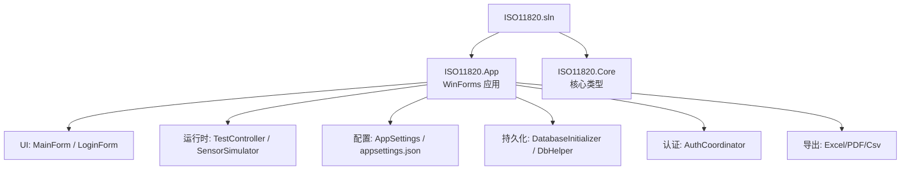
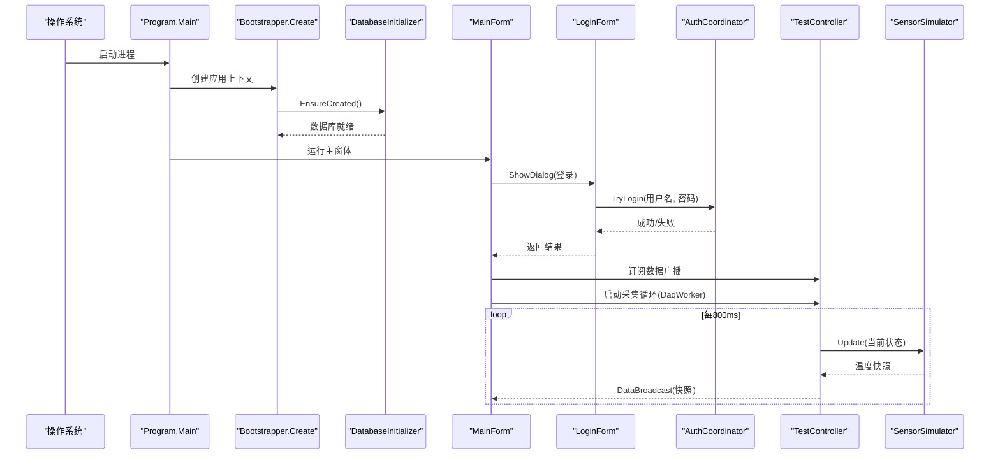
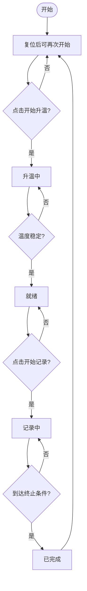
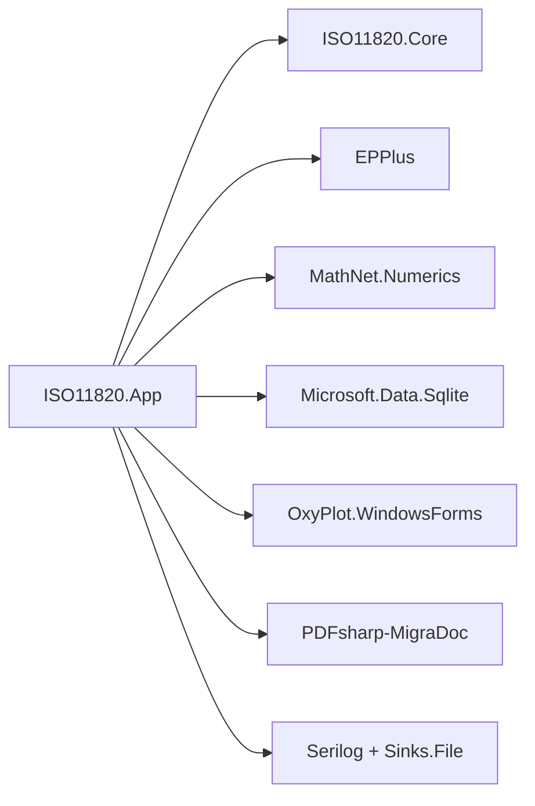

# 快速开始

<cite>
**本文引用的文件**   
- [Program.cs](file://src/ISO11820.App/Program.cs)
- [Bootstrapper.cs](file://src/ISO11820.App/App/Bootstrapper.cs)
- [MainForm.cs](file://src/ISO11820.App/UI/Forms/MainForm.cs)
- [LoginForm.cs](file://src/ISO11820.App/UI/Forms/LoginForm.cs)
- [AppSettings.cs](file://src/ISO11820.App/Config/AppSettings.cs)
- [appsettings.json](file://src/ISO11820.App/appsettings.json)
- [DatabaseInitializer.cs](file://src/ISO11820.App/Infrastructure/Persistence/DatabaseInitializer.cs)
- [TestController.cs](file://src/ISO11820.App/Runtime/Controller/TestController.cs)
- [SensorSimulator.cs](file://src/ISO11820.App/Runtime/Services/SensorSimulator.cs)
- [AuthCoordinator.cs](file://src/ISO11820.App/Features/Auth/AuthCoordinator.cs)
- [ISO11820.App.csproj](file://src/ISO11820.App/ISO11820.App.csproj)
- [ISO11820.Core.csproj](file://src/ISO11820.Core/ISO11820.Core.csproj)
- [ISO11820.sln](file://ISO11820.sln)
- [README.md](file://tests/ISO11820.UI.Tests/README.md)
</cite>

## 目录
1. [简介](#简介)
2. [项目结构](#项目结构)
3. [核心组件](#核心组件)
4. [架构总览](#架构总览)
5. [详细组件分析](#详细组件分析)
6. [依赖分析](#依赖分析)
7. [性能考虑](#性能考虑)
8. [故障排除指南](#故障排除指南)
9. [结论](#结论)
10. [附录](#附录)

## 简介
本指南面向首次接触 ISO 11820 热失重分析仿真系统的用户，目标是在 30 分钟内完成环境搭建、运行应用并完成一次完整的试验流程（登录→新建试验→升温→记录→导出）。系统基于 .NET 8 + Windows Forms，内置 SQLite 数据库与温度仿真引擎，无需真实硬件即可体验完整工作流。

## 项目结构
解决方案包含两个主要工程：
- ISO11820.App：Windows Forms 桌面应用，负责 UI、配置加载、数据持久化、仿真控制与导出。
- ISO11820.Core：核心枚举与模型定义（如测试状态、温度快照等）。

图表来源
- [ISO11820.sln:1-51](file://ISO11820.sln#L1-L51)
- [ISO11820.App.csproj:1-30](file://src/ISO11820.App/ISO11820.App.csproj#L1-L30)
- [ISO11820.Core.csproj:1-10](file://src/ISO11820.Core/ISO11820.Core.csproj#L1-L10)

章节来源
- [ISO11820.sln:1-51](file://ISO11820.sln#L1-L51)
- [ISO11820.App.csproj:1-30](file://src/ISO11820.App/ISO11820.App.csproj#L1-L30)
- [ISO11820.Core.csproj:1-10](file://src/ISO11820.Core/ISO11820.Core.csproj#L1-L10)

## 核心组件
- 启动入口：Program.Main 初始化 WinForms 并创建主窗体。
- 引导器：Bootstrapper.Create 加载配置、初始化日志、数据库、仿真控制器、采集线程、认证与导出服务。
- 主界面：MainForm 负责登录、按钮状态机、温度显示、曲线绘制、消息日志、记录查询与导出。
- 登录：LoginForm 选择角色并调用认证协调器进行校验。
- 运行时：TestController 驱动状态机与广播；SensorSimulator 模拟温度曲线与漂移计算。
- 配置：AppSettings 从 appsettings.json 读取路径与仿真参数，支持相对路径解析。
- 持久化：DatabaseInitializer 建库建表并注入初始数据（含默认账号）。
- 认证：AuthCoordinator 使用 SHA256 哈希比对用户名密码。

章节来源
- [Program.cs:1-25](file://src/ISO11820.App/Program.cs#L1-L25)
- [Bootstrapper.cs:1-66](file://src/ISO11820.App/App/Bootstrapper.cs#L1-L66)
- [MainForm.cs:1-800](file://src/ISO11820.App/UI/Forms/MainForm.cs#L1-L800)
- [LoginForm.cs:1-289](file://src/ISO11820.App/UI/Forms/LoginForm.cs#L1-L289)
- [TestController.cs:1-328](file://src/ISO11820.App/Runtime/Controller/TestController.cs#L1-L328)
- [SensorSimulator.cs:1-223](file://src/ISO11820.App/Runtime/Services/SensorSimulator.cs#L1-L223)
- [AppSettings.cs:1-160](file://src/ISO11820.App/Config/AppSettings.cs#L1-L160)
- [DatabaseInitializer.cs:1-198](file://src/ISO11820.App/Infrastructure/Persistence/DatabaseInitializer.cs#L1-L198)
- [AuthCoordinator.cs:1-62](file://src/ISO11820.App/Features/Auth/AuthCoordinator.cs#L1-L62)

## 架构总览
下图展示从程序启动到主界面运行的关键流程，以及各模块间的依赖关系。

图表来源
- [Program.cs:1-25](file://src/ISO11820.App/Program.cs#L1-L25)
- [Bootstrapper.cs:1-66](file://src/ISO11820.App/App/Bootstrapper.cs#L1-L66)
- [DatabaseInitializer.cs:1-198](file://src/ISO11820.App/Infrastructure/Persistence/DatabaseInitializer.cs#L1-L198)
- [MainForm.cs:1-800](file://src/ISO11820.App/UI/Forms/MainForm.cs#L1-L800)
- [LoginForm.cs:1-289](file://src/ISO11820.App/UI/Forms/LoginForm.cs#L1-L289)
- [AuthCoordinator.cs:1-62](file://src/ISO11820.App/Features/Auth/AuthCoordinator.cs#L1-L62)
- [TestController.cs:1-328](file://src/ISO11820.App/Runtime/Controller/TestController.cs#L1-L328)
- [SensorSimulator.cs:1-223](file://src/ISO11820.App/Runtime/Services/SensorSimulator.cs#L1-L223)

## 详细组件分析

### 开发环境搭建（Visual Studio + .NET 8）
- 安装 Visual Studio 2022（建议启用“使用 .NET 的桌面开发”工作负载）。
- 安装 .NET 8 SDK（确保 dotnet --version ≥ 8.0）。
- 克隆或打开仓库根目录下的解决方案 ISO11820.sln。
- 还原并构建：
  - 在 VS 中直接生成解决方案；或在命令行执行：
    - dotnet restore
    - dotnet build src\ISO11820.App\ISO11820.App.csproj
- 运行：
  - 将 ISO11820.App 设为启动项目，按 F5 运行；或双击生成的可执行文件。

章节来源
- [ISO11820.sln:1-51](file://ISO11820.sln#L1-L51)
- [ISO11820.App.csproj:1-30](file://src/ISO11820.App/ISO11820.App.csproj#L1-L30)
- [ISO11820.Core.csproj:1-10](file://src/ISO11820.Core/ISO11820.Core.csproj#L1-L10)

### 首次启动流程与基本配置
- 首次启动会自动创建 SQLite 数据库文件与必要目录，并写入默认操作员与传感器信息。
- 配置文件 appsettings.json 位于输出目录，用于设置数据库路径、仿真参数、输出目录等。
- 默认管理员与试验员账号均为 admin/experimenter，密码为 123456。

章节来源
- [Bootstrapper.cs:1-66](file://src/ISO11820.App/App/Bootstrapper.cs#L1-L66)
- [DatabaseInitializer.cs:1-198](file://src/ISO11820.App/Infrastructure/Persistence/DatabaseInitializer.cs#L1-L198)
- [AppSettings.cs:1-160](file://src/ISO11820.App/Config/AppSettings.cs#L1-L160)
- [appsettings.json:1-29](file://src/ISO11820.App/appsettings.json#L1-L29)

### 登录与权限
- 主界面加载时弹出登录对话框，选择角色（管理员/试验员），输入密码后由认证协调器校验。
- 校验通过则进入主界面，并在顶部显示当前操作员。

章节来源
- [MainForm.cs:497-520](file://src/ISO11820.App/UI/Forms/MainForm.cs#L497-L520)
- [LoginForm.cs:1-289](file://src/ISO11820.App/UI/Forms/LoginForm.cs#L1-L289)
- [AuthCoordinator.cs:1-62](file://src/ISO11820.App/Features/Auth/AuthCoordinator.cs#L1-L62)

### 运行应用程序与基本操作
- 登录后，右侧按钮面板提供“新建试验、开始升温、停止升温、开始记录、停止记录、参数设置、试验记录”等操作。
- 左侧显示多通道温度值，中间为实时温度曲线图，底部为系统消息日志。
- “记录查询”页签支持按日期范围、样品编号、操作员筛选，并可导出 Excel。

章节来源
- [MainForm.cs:1-800](file://src/ISO11820.App/UI/Forms/MainForm.cs#L1-L800)

### 第一个试验端到端流程（登录→导出）
步骤概览：
1. 启动应用，进入登录界面。
2. 选择“管理员”，输入密码 123456，点击“登录”。
3. 在主界面点击“新建试验”，填写样品信息并保存。
4. 点击“开始升温”，等待状态变为“就绪”（温度稳定）。
5. 点击“开始记录”，观察曲线与消息日志；可在任意时刻“停止记录”。
6. 点击“试验记录”，在导出对话框中选择导出格式（CSV/Excel/PDF）。
7. 如需批量导出历史查询结果，切换到“记录查询”页签，筛选后点击“导出 Excel”。

章节来源
- [MainForm.cs:628-703](file://src/ISO11820.App/UI/Forms/MainForm.cs#L628-L703)
- [TestController.cs:55-143](file://src/ISO11820.App/Runtime/Controller/TestController.cs#L55-L143)

### 仿真与状态机
- 状态机包括：空闲→升温中→就绪→记录中→已完成。
- 升温阶段线性逼近目标温度；达到稳定阈值后进入就绪；记录阶段自动终止条件满足时可提前结束。
- 温漂通过最近若干采样点线性回归计算，单位 °C/s，UI 显示为 °C/10min。

图表来源
- [TestController.cs:1-328](file://src/ISO11820.App/Runtime/Controller/TestController.cs#L1-L328)
- [SensorSimulator.cs:1-223](file://src/ISO11820.App/Runtime/Services/SensorSimulator.cs#L1-L223)

### 配置项说明（appsettings.json）
- Database.SqlitePath：SQLite 数据库文件路径（相对或绝对）。
- Simulation.EnableSimulation：是否启用仿真。
- Simulation.StartTemperature：起始温度。
- Simulation.HeatingRatePerSecond：每秒升温速率。
- Simulation.TargetTemperature：目标温度。
- Simulation.StableThreshold：稳定阈值（±°C）。
- Simulation.TempFluctuation：温度波动幅度。
- Output.BaseDirectory：输出基础目录。
- FileStorage.BaseDirectory / TestDataDirectory：文件存储与样本目录。
- Report.OutputDirectory / EnablePdfExport：报告输出目录与 PDF 导出开关。
- Hardware.ConstPower / PidTemperature：硬件相关常量（仿真用）。

章节来源
- [appsettings.json:1-29](file://src/ISO11820.App/appsettings.json#L1-L29)
- [AppSettings.cs:1-160](file://src/ISO11820.App/Config/AppSettings.cs#L1-L160)

## 依赖分析
- 应用层依赖 Core 中的枚举与模型。
- 外部包：EPPlus（Excel）、MathNet.Numerics（数值计算）、Microsoft.Data.Sqlite（SQLite）、OxyPlot.WindowsForms（绘图）、PDFsharp-MigraDoc（PDF）、Serilog（日志）。

图表来源
- [ISO11820.App.csproj:1-30](file://src/ISO11820.App/ISO11820.App.csproj#L1-L30)
- [ISO11820.Core.csproj:1-10](file://src/ISO11820.Core/ISO11820.Core.csproj#L1-L10)

章节来源
- [ISO11820.App.csproj:1-30](file://src/ISO11820.App/ISO11820.App.csproj#L1-L30)

## 性能考虑
- 数据采集频率约 800ms，避免频繁 UI 刷新导致卡顿；UI 更新通过事件回调与 Invoke 机制保证线程安全。
- 温漂计算仅维护最近 N 个采样点，降低内存占用与计算开销。
- 导出功能按需触发，避免在记录过程中频繁 IO。

[本节为通用指导，不直接分析具体文件]

## 故障排除指南
- 无法启动或找不到可执行文件
  - 确认已正确编译 ISO11820.App 项目。
  - 检查输出目录是否存在 ISO11820.App.exe。
- 登录失败
  - 确认用户名与密码是否正确（默认 admin/experimenter，密码 123456）。
  - 若数据库损坏，删除现有数据库文件后重启应用以重建。
- 温度不变化或曲线无更新
  - 检查 appsettings.json 中仿真参数（目标温度、升温速率、稳定阈值）。
  - 确认未处于“停止记录”或“冷却中”状态。
- 导出失败
  - 检查输出目录是否有写入权限。
  - 确认已存在有效试验数据。

章节来源
- [README.md:176-207](file://tests/ISO11820.UI.Tests/README.md#L176-L207)
- [DatabaseInitializer.cs:1-198](file://src/ISO11820.App/Infrastructure/Persistence/DatabaseInitializer.cs#L1-L198)
- [AppSettings.cs:1-160](file://src/ISO11820.App/Config/AppSettings.cs#L1-L160)

## 结论
通过本指南，您已掌握 ISO 11820 仿真系统的安装、运行与基本操作流程。建议在熟悉界面后再调整仿真参数与导出策略，以获得更贴合实际需求的实验体验。

## 附录
- 自动化测试参考：tests/ISO11820.UI.Tests/README.md 提供了 UI 自动化测试的快速开始与常见问题排查方法，可作为理解系统行为的补充材料。

章节来源
- [README.md:1-238](file://tests/ISO11820.UI.Tests/README.md#L1-L238)