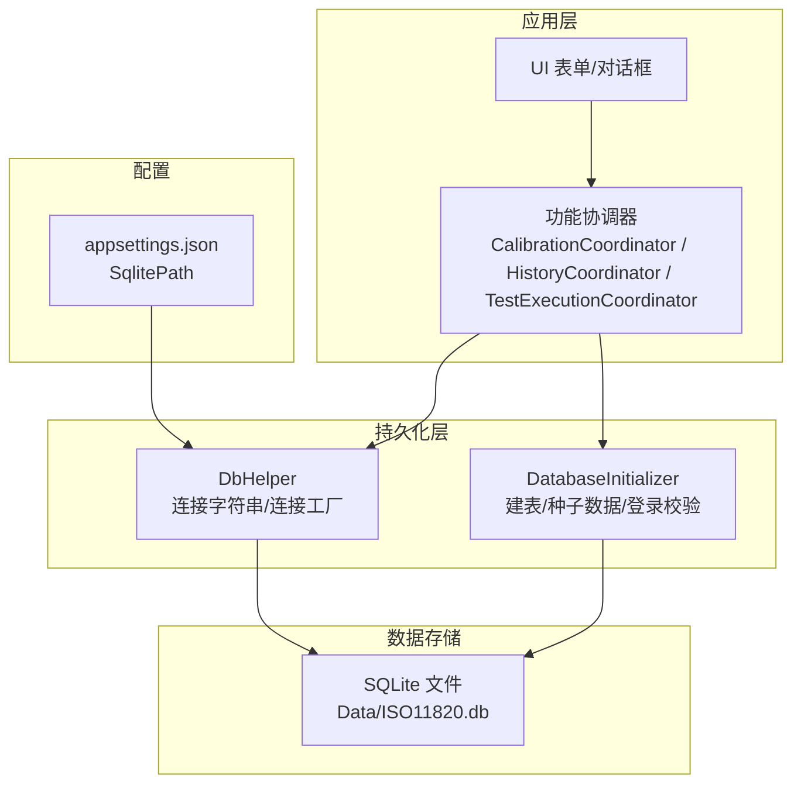
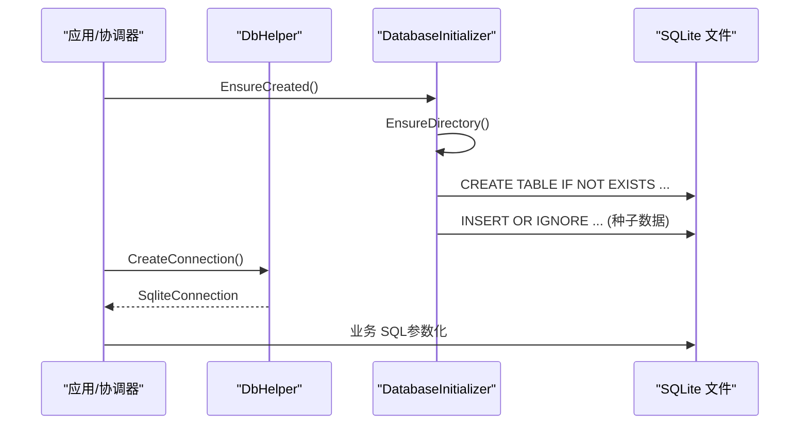
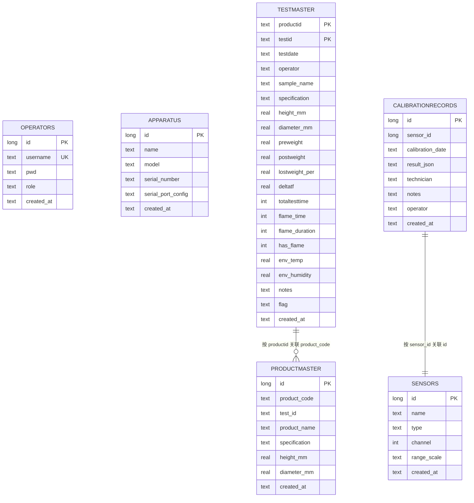
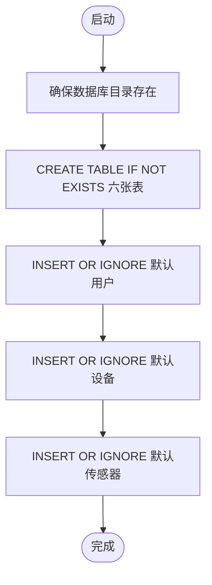
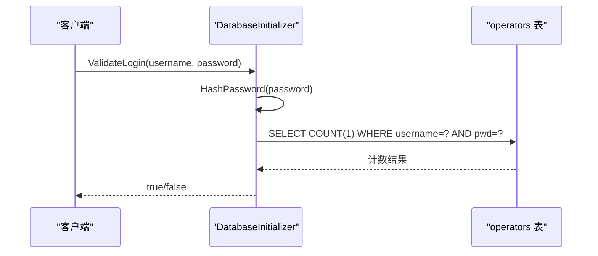
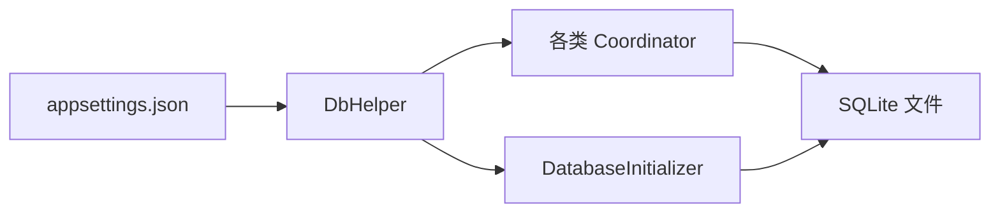

# 数据库设计

<cite>
**本文引用的文件**   
- [DatabaseInitializer.cs](file://src/ISO11820.App/Infrastructure/Persistence/DatabaseInitializer.cs)
- [DbHelper.cs](file://src/ISO11820.App/Infrastructure/Persistence/DbHelper.cs)
- [Operator.cs](file://src/ISO11820.App/Infrastructure/Persistence/Models/Operator.cs)
- [Apparatus.cs](file://src/ISO11820.App/Infrastructure/Persistence/Models/Apparatus.cs)
- [ProductMaster.cs](file://src/ISO11820.App/Infrastructure/Persistence/Models/ProductMaster.cs)
- [TestMaster.cs](file://src/ISO11820.App/Infrastructure/Persistence/Models/TestMaster.cs)
- [Sensor.cs](file://src/ISO11820.App/Infrastructure/Persistence/Models/Sensor.cs)
- [CalibrationRecord.cs](file://src/ISO11820.App/Infrastructure/Persistence/Models/CalibrationRecord.cs)
- [appsettings.json](file://src/ISO11820.App/appsettings.json)
- [CalibrationCoordinator.cs](file://src/ISO11820.App/Features/Calibration/CalibrationCoordinator.cs)
- [HistoryCoordinator.cs](file://src/ISO11820.App/Features/History/HistoryCoordinator.cs)
- [TestExecutionCoordinator.cs](file://src/ISO11820.App/Features/TestExecution/TestExecutionCoordinator.cs)
</cite>

## 目录
1. [简介](#简介)
2. [项目结构](#项目结构)
3. [核心组件](#核心组件)
4. [架构总览](#架构总览)
5. [详细组件分析](#详细组件分析)
6. [依赖关系分析](#依赖关系分析)
7. [性能考虑](#性能考虑)
8. [故障排查指南](#故障排查指南)
9. [结论](#结论)
10. [附录](#附录)

## 简介
本文件为 ISO 11820 系统的 SQLite 数据库设计文档，覆盖以下方面：
- 表结构与字段定义（operators、apparatus、productmaster、testmaster、sensors、CalibrationRecords）
- 数据类型、约束与索引策略
- 实体关系模型与外键约束说明
- 种子数据初始化逻辑（默认用户、设备、传感器）
- 密码哈希算法与安全存储机制
- 数据库版本管理与迁移策略现状与建议
- SQL 查询示例与最佳实践

## 项目结构
数据库相关代码集中在 Infrastructure/Persistence 层，包含连接辅助类、表创建与种子数据初始化；业务协调器通过该层执行 SQL。

图表来源
- [DatabaseInitializer.cs:16-21](file://src/ISO11820.App/Infrastructure/Persistence/DatabaseInitializer.cs#L16-L21)
- [DbHelper.cs:14-21](file://src/ISO11820.App/Infrastructure/Persistence/DbHelper.cs#L14-L21)
- [appsettings.json:2-4](file://src/ISO11820.App/appsettings.json#L2-L4)

章节来源
- [DatabaseInitializer.cs:16-21](file://src/ISO11820.App/Infrastructure/Persistence/DatabaseInitializer.cs#L16-L21)
- [DbHelper.cs:14-21](file://src/ISO11820.App/Infrastructure/Persistence/DbHelper.cs#L14-L21)
- [appsettings.json:2-4](file://src/ISO11820.App/appsettings.json#L2-L4)

## 核心组件
- 连接辅助：提供连接字符串与连接创建方法，路径来自配置文件。
- 初始化器：负责确保目录存在、建表、插入种子数据、登录校验。
- 模型类：与表结构一一对应，用于在 C# 中表达记录。
- 协调器：封装具体表的 CRUD 操作，使用参数化 SQL 避免注入。

章节来源
- [DbHelper.cs:14-21](file://src/ISO11820.App/Infrastructure/Persistence/DbHelper.cs#L14-L21)
- [DatabaseInitializer.cs:32-114](file://src/ISO11820.App/Infrastructure/Persistence/DatabaseInitializer.cs#L32-L114)
- [CalibrationCoordinator.cs:16-31](file://src/ISO11820.App/Features/Calibration/CalibrationCoordinator.cs#L16-L31)
- [HistoryCoordinator.cs:41-72](file://src/ISO11820.App/Features/History/HistoryCoordinator.cs#L41-L72)
- [TestExecutionCoordinator.cs:60-78](file://src/ISO11820.App/Features/TestExecution/TestExecutionCoordinator.cs#L60-L78)

## 架构总览
下图展示从应用到数据库的调用链与关键职责划分。

图表来源
- [DatabaseInitializer.cs:16-21](file://src/ISO11820.App/Infrastructure/Persistence/DatabaseInitializer.cs#L16-L21)
- [DbHelper.cs:16-21](file://src/ISO11820.App/Infrastructure/Persistence/DbHelper.cs#L16-L21)

## 详细组件分析

### 表结构与字段定义
以下为各表的核心字段、类型与约束说明（基于实际建表语句与模型映射）。

- operators（操作员）
  - id: INTEGER, 主键自增
  - username: TEXT, NOT NULL, UNIQUE
  - pwd: TEXT, NOT NULL（存储密码哈希）
  - role: TEXT, NOT NULL, 默认 'experimenter'
  - created_at: TEXT, NOT NULL, 默认 datetime('now')
  - 索引策略：username 唯一索引（由 UNIQUE 约束隐式创建）

- apparatus（设备）
  - id: INTEGER, 主键自增
  - name: TEXT, NOT NULL
  - model: TEXT, 可空
  - serial_number: TEXT, 可空
  - serial_port_config: TEXT, 可空（串口配置）
  - created_at: TEXT, NOT NULL, 默认 datetime('now')

- productmaster（产品主数据）
  - id: INTEGER, 主键自增
  - product_code: TEXT, NOT NULL
  - test_id: TEXT, 可空
  - product_name: TEXT, NOT NULL
  - specification: TEXT, 可空
  - height_mm: REAL, 可空
  - diameter_mm: REAL, 可空
  - created_at: TEXT, NOT NULL, 默认 datetime('now')
  - 复合唯一约束：(product_code, test_id)

- testmaster（试验主数据）
  - 复合主键：(productid, testid)
  - testdate: TEXT, NOT NULL, 默认 date('now')
  - operator: TEXT, 可空
  - sample_name: TEXT, 可空
  - specification: TEXT, 可空
  - height_mm/diameter_mm: REAL, 可空
  - preweight/postweight/lostweight_per/deltatf: REAL, 可空
  - totaltesttime/flame_time/flame_duration: INTEGER, 可空
  - has_flame: INTEGER, 默认 0
  - env_temp/env_humidity: REAL, 可空
  - notes: TEXT, 可空
  - flag: TEXT, 默认 '00000000'
  - created_at: TEXT, NOT NULL, 默认 datetime('now')

- sensors（传感器）
  - id: INTEGER, 主键自增
  - name: TEXT, NOT NULL
  - type: TEXT, NOT NULL
  - channel: INTEGER, 可空
  - range_scale: TEXT, 可空（量程范围）
  - created_at: TEXT, NOT NULL, 默认 datetime('now')

- CalibrationRecords（校准记录）
  - 表名大小写敏感："CalibrationRecords"
  - id: INTEGER, 主键自增
  - sensor_id: INTEGER, NOT NULL
  - calibration_date: TEXT, NOT NULL
  - result_json: TEXT, 可空（JSON 文本）
  - technician: TEXT, 可空
  - notes: TEXT, 可空
  - operator: TEXT, 可空
  - created_at: TEXT, NOT NULL, 默认 datetime('now')

章节来源
- [DatabaseInitializer.cs:36-114](file://src/ISO11820.App/Infrastructure/Persistence/DatabaseInitializer.cs#L36-L114)
- [Operator.cs:3-14](file://src/ISO11820.App/Infrastructure/Persistence/Models/Operator.cs#L3-L14)
- [Apparatus.cs:3-14](file://src/ISO11820.App/Infrastructure/Persistence/Models/Apparatus.cs#L3-L14)
- [ProductMaster.cs:3-21](file://src/ISO11820.App/Infrastructure/Persistence/Models/ProductMaster.cs#L3-L21)
- [TestMaster.cs:3-47](file://src/ISO11820.App/Infrastructure/Persistence/Models/TestMaster.cs#L3-L47)
- [Sensor.cs:3-14](file://src/ISO11820.App/Infrastructure/Persistence/Models/Sensor.cs#L3-L14)
- [CalibrationRecord.cs:3-18](file://src/ISO11820.App/Infrastructure/Persistence/Models/CalibrationRecord.cs#L3-L18)

### 实体关系模型与外键约束
- 当前实现未显式声明外键约束（如 FOREIGN KEY），但存在逻辑关联：
  - testmaster.productid 与 productmaster.product_code 存在业务关联
  - CalibrationRecords.sensor_id 与 sensors.id 存在业务关联
- 建议：
  - 引入外键约束以保障引用完整性
  - 对常用查询列建立索引（见“索引策略”小节）

图表来源
- [DatabaseInitializer.cs:36-114](file://src/ISO11820.App/Infrastructure/Persistence/DatabaseInitializer.cs#L36-L114)

### 种子数据初始化逻辑
- 默认用户账户
  - admin（角色：admin）
  - experimenter（角色：experimenter）
  - 密码采用哈希后存储（详见“安全存储机制”）
- 默认设备
  - 预置一台测试炉设备及其串口配置
- 默认传感器
  - 预置多个热电偶与参考传感器，含通道与量程信息

图表来源
- [DatabaseInitializer.cs:16-21](file://src/ISO11820.App/Infrastructure/Persistence/DatabaseInitializer.cs#L16-L21)
- [DatabaseInitializer.cs:125-176](file://src/ISO11820.App/Infrastructure/Persistence/DatabaseInitializer.cs#L125-L176)

章节来源
- [DatabaseInitializer.cs:125-176](file://src/ISO11820.App/Infrastructure/Persistence/DatabaseInitializer.cs#L125-L176)

### 密码哈希算法与安全存储机制
- 算法：SHA256（UTF-8 编码输入，输出小写十六进制字符串）
- 存储位置：operators.pwd 字段
- 登录校验流程：对输入密码进行相同哈希后与存储值比较

图表来源
- [DatabaseInitializer.cs:178-197](file://src/ISO11820.App/Infrastructure/Persistence/DatabaseInitializer.cs#L178-L197)

章节来源
- [DatabaseInitializer.cs:178-197](file://src/ISO11820.App/Infrastructure/Persistence/DatabaseInitializer.cs#L178-L197)

### 数据库版本管理与迁移策略
- 现状
  - 使用 CREATE TABLE IF NOT EXISTS 保证幂等性
  - 种子数据使用 INSERT OR IGNORE 防止重复插入
  - 未发现显式的版本表或迁移脚本
- 建议
  - 引入 schema_version 表记录版本号与变更日志
  - 每次升级时检查并执行增量迁移脚本
  - 将 ALTER TABLE/新增索引等操作纳入迁移流程

章节来源
- [DatabaseInitializer.cs:32-114](file://src/ISO11820.App/Infrastructure/Persistence/DatabaseInitializer.cs#L32-L114)

### 索引策略
- 现有隐式索引
  - operators.username：UNIQUE 约束自动创建唯一索引
  - productmaster：(product_code, test_id) 复合唯一约束自动创建索引
- 建议索引（基于常见查询模式）
  - testmaster.testdate：日期范围筛选
  - testmaster.operator：按操作员筛选
  - testmaster.productid：与 productmaster 关联查询
  - CalibrationRecords.sensor_id：按传感器过滤校准记录
  - CalibrationRecords.calibration_date：时间排序与范围查询

章节来源
- [DatabaseInitializer.cs:36-114](file://src/ISO11820.App/Infrastructure/Persistence/DatabaseInitializer.cs#L36-L114)

### 典型 SQL 查询示例与最佳实践
- 查询所有产品
  - 参考：[HistoryCoordinator.cs:41-72](file://src/ISO11820.App/Features/History/HistoryCoordinator.cs#L41-L72)
- 按产品编号模糊匹配、操作员、日期范围组合查询试验记录
  - 参考：[HistoryCoordinator.cs:103-126](file://src/ISO11820.App/Features/History/HistoryCoordinator.cs#L103-L126)
- 保存校准记录
  - 参考：[CalibrationCoordinator.cs:16-31](file://src/ISO11820.App/Features/Calibration/CalibrationCoordinator.cs#L16-L31)
- 按传感器 ID 查询校准记录
  - 参考：[CalibrationCoordinator.cs:33-44](file://src/ISO11820.App/Features/Calibration/CalibrationCoordinator.cs#L33-L44)
- 保存产品信息（去重）
  - 参考：[TestExecutionCoordinator.cs:60-78](file://src/ISO11820.App/Features/TestExecution/TestExecutionCoordinator.cs#L60-L78)

最佳实践
- 始终使用参数化查询，避免 SQL 注入
- 对高频筛选列添加合适索引
- 使用事务批量写入以提升性能
- 对 JSON 字段（result_json）保持结构化与可读性，便于后续解析

章节来源
- [HistoryCoordinator.cs:41-72](file://src/ISO11820.App/Features/History/HistoryCoordinator.cs#L41-L72)
- [HistoryCoordinator.cs:103-126](file://src/ISO11820.App/Features/History/HistoryCoordinator.cs#L103-L126)
- [CalibrationCoordinator.cs:16-31](file://src/ISO11820.App/Features/Calibration/CalibrationCoordinator.cs#L16-L31)
- [CalibrationCoordinator.cs:33-44](file://src/ISO11820.App/Features/Calibration/CalibrationCoordinator.cs#L33-L44)
- [TestExecutionCoordinator.cs:60-78](file://src/ISO11820.App/Features/TestExecution/TestExecutionCoordinator.cs#L60-L78)

## 依赖关系分析
- 协调器依赖 DbHelper 获取连接
- DatabaseInitializer 依赖 DbHelper 执行建表与种子数据
- appsettings.json 提供数据库路径

图表来源
- [appsettings.json:2-4](file://src/ISO11820.App/appsettings.json#L2-L4)
- [DbHelper.cs:14-21](file://src/ISO11820.App/Infrastructure/Persistence/DbHelper.cs#L14-L21)
- [DatabaseInitializer.cs:16-21](file://src/ISO11820.App/Infrastructure/Persistence/DatabaseInitializer.cs#L16-L21)

章节来源
- [DbHelper.cs:14-21](file://src/ISO11820.App/Infrastructure/Persistence/DbHelper.cs#L14-L21)
- [DatabaseInitializer.cs:16-21](file://src/ISO11820.App/Infrastructure/Persistence/DatabaseInitializer.cs#L16-L21)
- [appsettings.json:2-4](file://src/ISO11820.App/appsettings.json#L2-L4)

## 性能考虑
- 连接管理：每个操作创建新连接，适合轻量级桌面应用；高并发场景可考虑连接池
- 写入优化：批量写入时使用事务减少磁盘 I/O
- 查询优化：为常用筛选列添加索引；避免 SELECT *，仅选择必要列
- 大对象处理：result_json 较大时注意分页与按需加载

## 故障排查指南
- 无法创建数据库文件
  - 检查数据库目录是否存在及写入权限
  - 参考：[DatabaseInitializer.cs:23-30](file://src/ISO11820.App/Infrastructure/Persistence/DatabaseInitializer.cs#L23-L30)
- 登录失败
  - 确认用户名与密码是否正确；验证哈希算法是否一致
  - 参考：[DatabaseInitializer.cs:178-197](file://src/ISO11820.App/Infrastructure/Persistence/DatabaseInitializer.cs#L178-L197)
- 表不存在或名称不匹配
  - 确认表名大小写（如 "CalibrationRecords"）
  - 参考：[CalibrationCoordinator.cs:19-22](file://src/ISO11820.App/Features/Calibration/CalibrationCoordinator.cs#L19-L22)

章节来源
- [DatabaseInitializer.cs:23-30](file://src/ISO11820.App/Infrastructure/Persistence/DatabaseInitializer.cs#L23-L30)
- [DatabaseInitializer.cs:178-197](file://src/ISO11820.App/Infrastructure/Persistence/DatabaseInitializer.cs#L178-L197)
- [CalibrationCoordinator.cs:19-22](file://src/ISO11820.App/Features/Calibration/CalibrationCoordinator.cs#L19-L22)

## 结论
本系统采用简洁的 SQLite 方案，通过幂等的建表与种子数据初始化快速启动。当前未启用外键约束与显式迁移管理，建议在后续迭代中完善引用完整性与版本控制，同时补充常用索引以提升查询性能。

## 附录

### 配置项说明
- 数据库路径
  - 键：Database.SqlitePath
  - 默认值：Data/ISO11820.db
  - 作用：指定 SQLite 文件存放路径
  - 参考：[appsettings.json:2-4](file://src/ISO11820.App/appsettings.json#L2-L4)

章节来源
- [appsettings.json:2-4](file://src/ISO11820.App/appsettings.json#L2-L4)