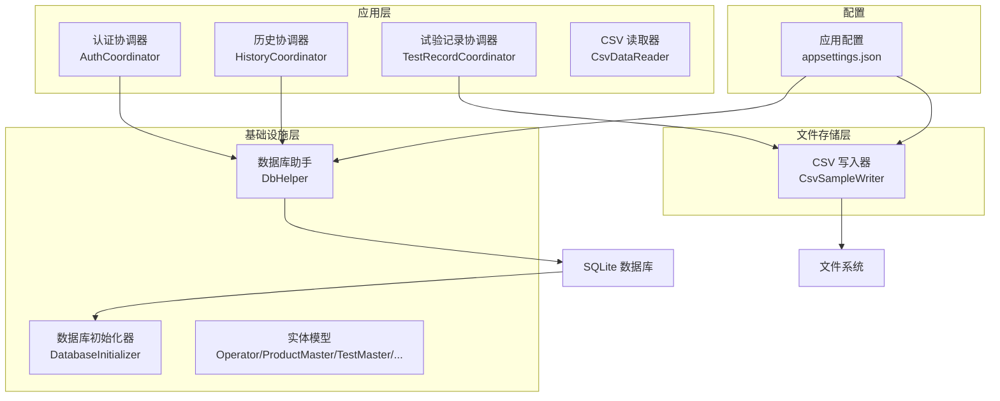
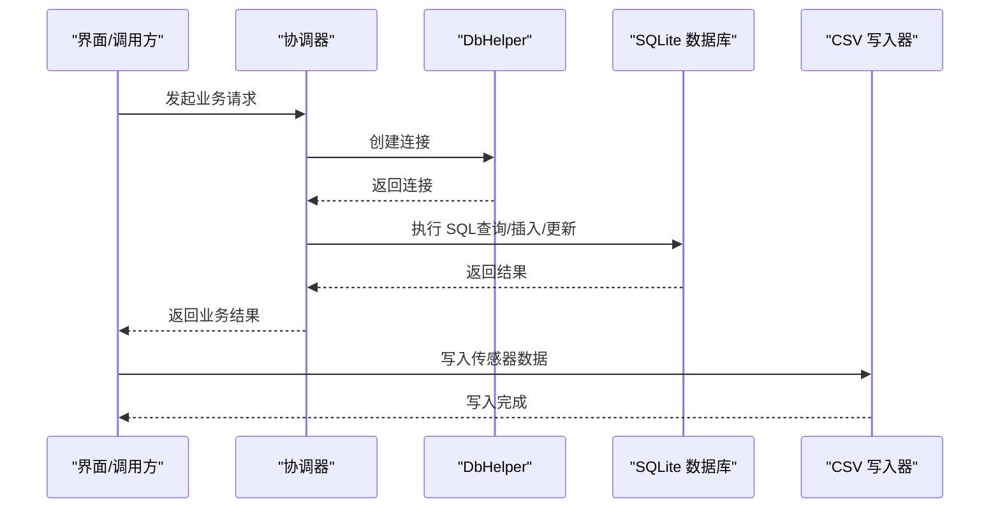
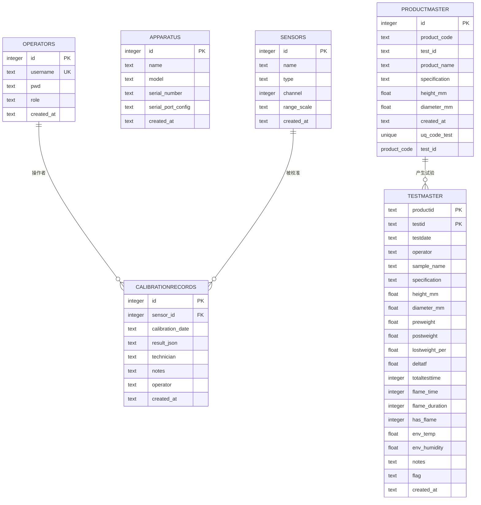
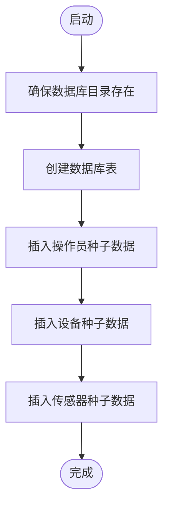
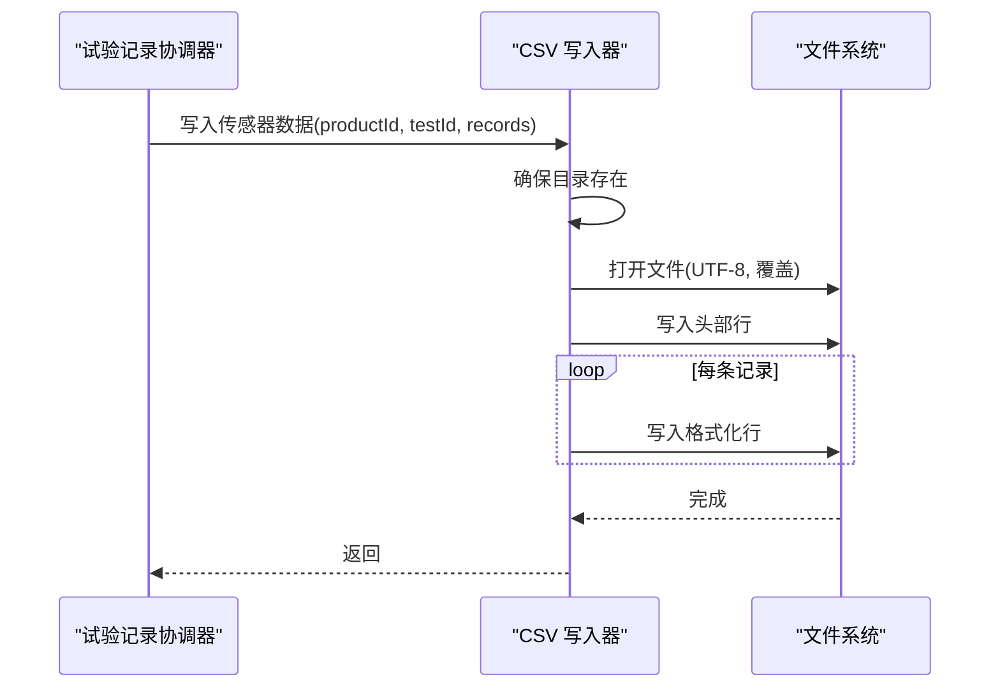
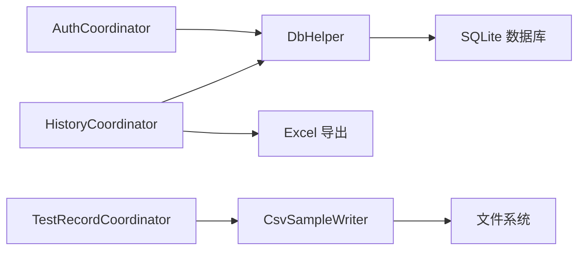

# 数据持久化

<cite>
**本文引用的文件**
- [DbHelper.cs](file://src/ISO11820.App/Infrastructure/Persistence/DbHelper.cs)
- [DatabaseInitializer.cs](file://src/ISO11820.App/Infrastructure/Persistence/DatabaseInitializer.cs)
- [CsvSampleWriter.cs](file://src/ISO11820.App/Infrastructure/FileStorage/CsvSampleWriter.cs)
- [CsvDataReader.cs](file://src/ISO11820.App/Features/Export/CsvDataReader.cs)
- [AuthCoordinator.cs](file://src/ISO11820.App/Features/Auth/AuthCoordinator.cs)
- [HistoryCoordinator.cs](file://src/ISO11820.App/Features/History/HistoryCoordinator.cs)
- [TestRecordCoordinator.cs](file://src/ISO11820.App/Features/TestRecord/TestRecordCoordinator.cs)
- [appsettings.json](file://src/ISO11820.App/appsettings.json)
- [Operator.cs](file://src/ISO11820.App/Infrastructure/Persistence/Models/Operator.cs)
- [ProductMaster.cs](file://src/ISO11820.App/Infrastructure/Persistence/Models/ProductMaster.cs)
- [TestMaster.cs](file://src/ISO11820.App/Infrastructure/Persistence/Models/TestMaster.cs)
- [Apparatus.cs](file://src/ISO11820.App/Infrastructure/Persistence/Models/Apparatus.cs)
- [Sensor.cs](file://src/ISO11820.App/Infrastructure/Persistence/Models/Sensor.cs)
- [CalibrationRecord.cs](file://src/ISO11820.App/Infrastructure/Persistence/Models/CalibrationRecord.cs)
</cite>

## 目录
1. [简介](#简介)
2. [项目结构](#项目结构)
3. [核心组件](#核心组件)
4. [架构总览](#架构总览)
5. [详细组件分析](#详细组件分析)
6. [依赖关系分析](#依赖关系分析)
7. [性能考量](#性能考量)
8. [故障排查指南](#故障排查指南)
9. [结论](#结论)
10. [附录](#附录)

## 简介
本文件系统性梳理 ISO 11820 系统的数据持久化层，覆盖数据库表结构与实体关系、SQLite 访问封装与初始化流程、CSV 文件写入与读取规范、数据访问模式与缓存策略、数据生命周期与归档建议、迁移与版本管理指引、安全与隐私保护、以及备份与恢复策略。目标是帮助开发者与运维人员快速理解并正确使用数据持久化能力。

## 项目结构
数据持久化相关代码主要分布在以下模块：
- 基础设施层（Persistence）：SQLite 连接与初始化、实体模型
- 文件存储层（FileStorage）：CSV 写入器与传感器数据文件组织
- 功能协调层（Features）：认证、历史查询、试验记录协调等对持久化的调用
- 配置（appsettings.json）：数据库路径、输出目录、功能开关等

图表来源
- [DbHelper.cs:1-22](file://src/ISO11820.App/Infrastructure/Persistence/DbHelper.cs#L1-L22)
- [DatabaseInitializer.cs:1-198](file://src/ISO11820.App/Infrastructure/Persistence/DatabaseInitializer.cs#L1-L198)
- [CsvSampleWriter.cs:1-81](file://src/ISO11820.App/Infrastructure/FileStorage/CsvSampleWriter.cs#L1-L81)
- [CsvDataReader.cs:1-72](file://src/ISO11820.App/Features/Export/CsvDataReader.cs#L1-L72)
- [AuthCoordinator.cs:1-62](file://src/ISO11820.App/Features/Auth/AuthCoordinator.cs#L1-L62)
- [HistoryCoordinator.cs:1-241](file://src/ISO11820.App/Features/History/HistoryCoordinator.cs#L1-L241)
- [TestRecordCoordinator.cs:1-159](file://src/ISO11820.App/Features/TestRecord/TestRecordCoordinator.cs#L1-L159)
- [appsettings.json:1-29](file://src/ISO11820.App/appsettings.json#L1-L29)

章节来源
- [DbHelper.cs:1-22](file://src/ISO11820.App/Infrastructure/Persistence/DbHelper.cs#L1-L22)
- [DatabaseInitializer.cs:1-198](file://src/ISO11820.App/Infrastructure/Persistence/DatabaseInitializer.cs#L1-L198)
- [CsvSampleWriter.cs:1-81](file://src/ISO11820.App/Infrastructure/FileStorage/CsvSampleWriter.cs#L1-L81)
- [CsvDataReader.cs:1-72](file://src/ISO11820.App/Features/Export/CsvDataReader.cs#L1-L72)
- [AuthCoordinator.cs:1-62](file://src/ISO11820.App/Features/Auth/AuthCoordinator.cs#L1-L62)
- [HistoryCoordinator.cs:1-241](file://src/ISO11820.App/Features/History/HistoryCoordinator.cs#L1-L241)
- [TestRecordCoordinator.cs:1-159](file://src/ISO11820.App/Features/TestRecord/TestRecordCoordinator.cs#L1-L159)
- [appsettings.json:1-29](file://src/ISO11820.App/appsettings.json#L1-L29)

## 核心组件
- 数据库助手（DbHelper）：封装 SQLite 连接字符串与连接创建，提供统一的连接入口。
- 数据库初始化器（DatabaseInitializer）：负责确保数据库目录存在、创建表结构、插入种子数据，并提供登录校验逻辑。
- CSV 写入器（CsvSampleWriter）：按试验组织目录结构，写入传感器采样 CSV 文件，定义列顺序与数值格式。
- CSV 读取器（CsvDataReader）：解析 CSV 文件为导出用的数据行对象集合。
- 协调器（AuthCoordinator、HistoryCoordinator、TestRecordCoordinator）：面向业务场景的数据访问与状态管理。

章节来源
- [DbHelper.cs:1-22](file://src/ISO11820.App/Infrastructure/Persistence/DbHelper.cs#L1-L22)
- [DatabaseInitializer.cs:1-198](file://src/ISO11820.App/Infrastructure/Persistence/DatabaseInitializer.cs#L1-L198)
- [CsvSampleWriter.cs:1-81](file://src/ISO11820.App/Infrastructure/FileStorage/CsvSampleWriter.cs#L1-L81)
- [CsvDataReader.cs:1-72](file://src/ISO11820.App/Features/Export/CsvDataReader.cs#L1-L72)
- [AuthCoordinator.cs:1-62](file://src/ISO11820.App/Features/Auth/AuthCoordinator.cs#L1-L62)
- [HistoryCoordinator.cs:1-241](file://src/ISO11820.App/Features/History/HistoryCoordinator.cs#L1-L241)
- [TestRecordCoordinator.cs:1-159](file://src/ISO11820.App/Features/TestRecord/TestRecordCoordinator.cs#L1-L159)

## 架构总览
下图展示数据持久化层的整体交互：协调器通过 DbHelper 获取连接，执行 SQL；CSV 写入器直接写文件系统；配置驱动路径与功能开关。

图表来源
- [DbHelper.cs:16-22](file://src/ISO11820.App/Infrastructure/Persistence/DbHelper.cs#L16-L22)
- [AuthCoordinator.cs:40-54](file://src/ISO11820.App/Features/Auth/AuthCoordinator.cs#L40-L54)
- [HistoryCoordinator.cs:19-39](file://src/ISO11820.App/Features/History/HistoryCoordinator.cs#L19-L39)
- [CsvSampleWriter.cs:41-54](file://src/ISO11820.App/Infrastructure/FileStorage/CsvSampleWriter.cs#L41-L54)

## 详细组件分析

### 数据库表结构与实体关系
- 表与字段概览
  - operators：用户表，包含唯一用户名、密码哈希、角色、创建时间
  - apparatus：设备表，包含设备名称、型号、序列号、串口配置、创建时间
  - productmaster：产品主数据表，复合唯一约束（product_code, test_id），包含规格、尺寸等
  - testmaster：试验主数据表，主键为（productid, testid），包含试验参数、环境条件、标志位等
  - sensors：传感器表，包含名称、类型、通道、量程等
  - CalibrationRecords：校准记录表，关联传感器，包含校准日期、结果 JSON、操作者等

- 实体模型映射
  - Operator、ProductMaster、TestMaster、Apparatus、Sensor、CalibrationRecord 对应上述表结构

图表来源
- [DatabaseInitializer.cs:36-110](file://src/ISO11820.App/Infrastructure/Persistence/DatabaseInitializer.cs#L36-L110)
- [Operator.cs:1-14](file://src/ISO11820.App/Infrastructure/Persistence/Models/Operator.cs#L1-L14)
- [ProductMaster.cs:1-21](file://src/ISO11820.App/Infrastructure/Persistence/Models/ProductMaster.cs#L1-L21)
- [TestMaster.cs:1-47](file://src/ISO11820.App/Infrastructure/Persistence/Models/TestMaster.cs#L1-L47)
- [Apparatus.cs:1-14](file://src/ISO11820.App/Infrastructure/Persistence/Models/Apparatus.cs#L1-L14)
- [Sensor.cs:1-14](file://src/ISO11820.App/Infrastructure/Persistence/Models/Sensor.cs#L1-L14)
- [CalibrationRecord.cs:1-18](file://src/ISO11820.App/Infrastructure/Persistence/Models/CalibrationRecord.cs#L1-L18)

章节来源
- [DatabaseInitializer.cs:36-110](file://src/ISO11820.App/Infrastructure/Persistence/DatabaseInitializer.cs#L36-L110)
- [Operator.cs:1-14](file://src/ISO11820.App/Infrastructure/Persistence/Models/Operator.cs#L1-L14)
- [ProductMaster.cs:1-21](file://src/ISO11820.App/Infrastructure/Persistence/Models/ProductMaster.cs#L1-L21)
- [TestMaster.cs:1-47](file://src/ISO11820.App/Infrastructure/Persistence/Models/TestMaster.cs#L1-L47)
- [Apparatus.cs:1-14](file://src/ISO11820.App/Infrastructure/Persistence/Models/Apparatus.cs#L1-L14)
- [Sensor.cs:1-14](file://src/ISO11820.App/Infrastructure/Persistence/Models/Sensor.cs#L1-L14)
- [CalibrationRecord.cs:1-18](file://src/ISO11820.App/Infrastructure/Persistence/Models/CalibrationRecord.cs#L1-L18)

### SQLite 操作封装与初始化
- 连接管理
  - DbHelper 提供连接字符串与连接创建方法，集中管理 SQLite 连接生命周期
- 初始化流程
  - EnsureCreated：确保目录存在 → 创建表 → 插入种子数据（管理员、实验员、设备、传感器）
  - 登录校验：ValidateLogin 使用 SHA-256 哈希比对密码
- 种子数据
  - operators：admin/experimenter
  - apparatus：默认测试炉设备
  - sensors：多通道热电偶与参考传感器

图表来源
- [DatabaseInitializer.cs:16-176](file://src/ISO11820.App/Infrastructure/Persistence/DatabaseInitializer.cs#L16-L176)
- [DbHelper.cs:16-22](file://src/ISO11820.App/Infrastructure/Persistence/DbHelper.cs#L16-L22)

章节来源
- [DbHelper.cs:1-22](file://src/ISO11820.App/Infrastructure/Persistence/DbHelper.cs#L1-L22)
- [DatabaseInitializer.cs:16-198](file://src/ISO11820.App/Infrastructure/Persistence/DatabaseInitializer.cs#L16-L198)

### CSV 文件写入器与格式规范
- 目录结构
  - 基于产品编号与试验编号构建目录 TestData/<productId>/<testId>
  - 默认 CSV 文件名：sensor_data.csv
- 写入流程
  - 写入 UTF-8 头部行：Timestamp, Channel1..Channel12
  - 逐条写入格式化行：时间戳（yyyy-MM-dd HH:mm:ss.fff）、12 通道浮点值（两位小数）
- 读取流程
  - CsvDataReader 读取 CSV，跳过标题，解析 Furnace1/Furnace2/Surface/Center 四列，生成 CsvRow 列表
- 编码与文化
  - 写入使用 UTF-8；数值格式使用 invariant culture，保证跨区域一致性

图表来源
- [CsvSampleWriter.cs:41-67](file://src/ISO11820.App/Infrastructure/FileStorage/CsvSampleWriter.cs#L41-L67)
- [CsvDataReader.cs:25-70](file://src/ISO11820.App/Features/Export/CsvDataReader.cs#L25-L70)

章节来源
- [CsvSampleWriter.cs:1-81](file://src/ISO11820.App/Infrastructure/FileStorage/CsvSampleWriter.cs#L1-L81)
- [CsvDataReader.cs:1-72](file://src/ISO11820.App/Features/Export/CsvDataReader.cs#L1-L72)

### 数据访问模式与缓存策略
- 查询模式
  - HistoryCoordinator 提供多维度查询：按产品、按操作员、按日期范围组合过滤
  - 使用参数化 SQL 防止注入，避免全表扫描时添加必要条件
- 写入模式
  - TestRecordCoordinator 采用“接受-保存”两阶段：先内存暂存，再执行持久化回调，完成后标记保存状态
  - 保存状态标志 SaveStateFlag 避免重复保存
- 缓存策略
  - 当前实现未见数据库层面的缓存；可通过应用内缓存（如内存字典）缓存热点查询结果以降低频繁 IO
  - 建议：对只读主数据（如 sensors、apparatus）进行短期缓存，结合失效策略

章节来源
- [HistoryCoordinator.cs:103-157](file://src/ISO11820.App/Features/History/HistoryCoordinator.cs#L103-L157)
- [TestRecordCoordinator.cs:18-104](file://src/ISO11820.App/Features/TestRecord/TestRecordCoordinator.cs#L18-L104)

### 数据生命周期、保留策略与归档
- 建议策略（概念性指导）
  - 试验数据：按产品/试验编号分目录存放 CSV；数据库中保留关键元数据（testmaster）
  - 日志与临时文件：设置定期清理任务，保留最近 N 个月
  - 归档：超过保留期的数据导出为只读格式（如 PDF/Excel）并移出活动目录
  - 备份：数据库文件与 CSV 目录定期备份至异地存储
- 注意事项
  - 归档前确保数据完整性校验（如 CRC）
  - 清理策略需满足合规要求（如最小保留期）

[本节为通用实践建议，不直接分析具体文件，故无章节来源]

### 数据迁移路径与版本管理
- 版本演进
  - 新增表：在 DatabaseInitializer 中扩展 CREATE TABLE 语句，并在 SeedData 中补充默认数据
  - 字段变更：使用 ALTER TABLE 添加新列，保持向后兼容；对必填字段提供默认值
- 迁移步骤
  - 在 EnsureCreated 中增加迁移分支，根据当前版本号执行对应脚本
  - 迁移前备份数据库与 CSV 目录
  - 验证迁移后的数据完整性与查询性能
- 事务管理
  - SQLite 支持单文件事务；建议在批量导入时使用 BEGIN/COMMIT 包裹，减少 WAL 压力
  - 对大事务进行分批提交，避免长时间锁表

[本节为通用实践建议，不直接分析具体文件，故无章节来源]

### 数据安全、隐私与访问控制
- 密码安全
  - 登录与校验使用 SHA-256 哈希；建议升级为 PBKDF2/HMAC-SHA256 并引入 salt
- 最小权限
  - 应用仅授予数据库文件与 CSV 目录的读写权限
- 敏感数据
  - CSV 文件包含温度通道值，建议按需脱敏或限制访问范围
- 审计
  - operators 表记录 created_at，可用于审计追踪

章节来源
- [DatabaseInitializer.cs:178-197](file://src/ISO11820.App/Infrastructure/Persistence/DatabaseInitializer.cs#L178-L197)
- [AuthCoordinator.cs:56-60](file://src/ISO11820.App/Features/Auth/AuthCoordinator.cs#L56-L60)

### 备份与恢复策略
- 备份
  - 数据库：复制 SQLite 文件（ISO11820.db）
  - CSV：打包 TestData 目录
  - 建议：周期性增量备份 + 全量快照
- 恢复
  - 恢复数据库：停止服务 → 替换数据库文件 → 启动服务
  - 恢复 CSV：替换对应试验目录
- 验证
  - 恢复后执行一次关键查询与一次 CSV 读取，确认数据可用

[本节为通用实践建议，不直接分析具体文件，故无章节来源]

## 依赖关系分析
- 组件耦合
  - 协调器依赖 DbHelper 获取连接，职责清晰
  - CsvSampleWriter 与文件系统直接交互，独立于数据库
- 外部依赖
  - Microsoft.Data.Sqlite：SQLite 连接与命令执行
  - OfficeOpenXml：历史导出到 Excel
- 潜在风险
  - 直接文件写入缺少事务一致性，建议在写入完成后进行校验或重命名策略

图表来源
- [AuthCoordinator.cs:13-18](file://src/ISO11820.App/Features/Auth/AuthCoordinator.cs#L13-L18)
- [HistoryCoordinator.cs:10-15](file://src/ISO11820.App/Features/History/HistoryCoordinator.cs#L10-L15)
- [TestRecordCoordinator.cs:8-16](file://src/ISO11820.App/Features/TestRecord/TestRecordCoordinator.cs#L8-L16)

章节来源
- [AuthCoordinator.cs:1-62](file://src/ISO11820.App/Features/Auth/AuthCoordinator.cs#L1-L62)
- [HistoryCoordinator.cs:1-241](file://src/ISO11820.App/Features/History/HistoryCoordinator.cs#L1-L241)
- [TestRecordCoordinator.cs:1-159](file://src/ISO11820.App/Features/TestRecord/TestRecordCoordinator.cs#L1-L159)

## 性能考量
- 查询优化
  - 为高频过滤字段（如 testmaster 的 productid、operator、testdate）建立索引（建议）
  - 控制一次性查询返回量，使用分页或游标式读取
- 写入优化
  - CSV 写入使用 UTF-8 编码与固定格式，减少解析成本
  - 大量记录写入时，考虑缓冲与批量刷盘
- 连接管理
  - 复用连接池（SQLite 适用于短连接，注意并发场景下的连接数限制）
- I/O 优化
  - 将 CSV 目录与数据库文件置于高性能磁盘
  - 对只读报表数据采用压缩归档，减少活动目录压力

[本节提供通用性能建议，不直接分析具体文件，故无章节来源]

## 故障排查指南
- 数据库无法连接
  - 检查 appsettings.json 中的 SqlitePath 是否正确
  - 确认目录存在且具备读写权限
- 登录失败
  - 确认密码是否经过 SHA-256 哈希后再比对
  - 检查 operators 表是否存在对应用户
- CSV 写入异常
  - 确认目录构建逻辑与权限
  - 检查通道数量与数值格式是否符合规范
- 导出为空
  - 确认 CSV 文件是否存在且非空
  - 检查首行标题与后续行数量是否一致

章节来源
- [appsettings.json:1-29](file://src/ISO11820.App/appsettings.json#L1-L29)
- [DatabaseInitializer.cs:178-191](file://src/ISO11820.App/Infrastructure/Persistence/DatabaseInitializer.cs#L178-L191)
- [CsvSampleWriter.cs:69-73](file://src/ISO11820.App/Infrastructure/FileStorage/CsvSampleWriter.cs#L69-L73)
- [CsvDataReader.cs:25-38](file://src/ISO11820.App/Features/Export/CsvDataReader.cs#L25-L38)

## 结论
ISO 11820 的数据持久化层以 SQLite 为核心，辅以 CSV 文件组织传感器数据，形成“结构化数据+原始采样”的双轨存储。通过 DbHelper 与 DatabaseInitializer 统一连接与初始化，配合协调器的查询与写入模式，满足日常试验数据管理需求。建议在现有基础上增强安全（密码哈希升级）、缓存与索引、以及标准化的迁移与备份流程，以提升稳定性与可维护性。

## 附录
- 关键配置项
  - Database.SqlitePath：数据库文件路径
  - Output.BaseDirectory：CSV 输出基础目录
  - Report.OutputDirectory：报告输出目录
- 建议的下一步
  - 引入数据库迁移框架（如 Migrator.NET）
  - 增加日志与监控埋点
  - 对 CSV 读写增加校验与重试机制

[本节为补充信息，不直接分析具体文件，故无章节来源]