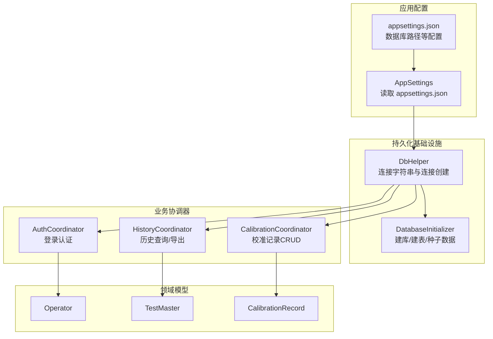
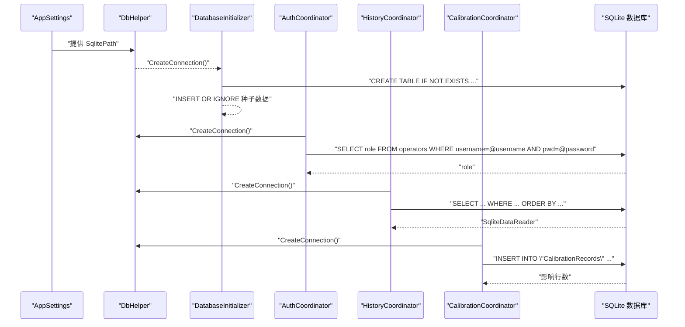
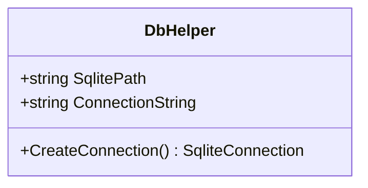
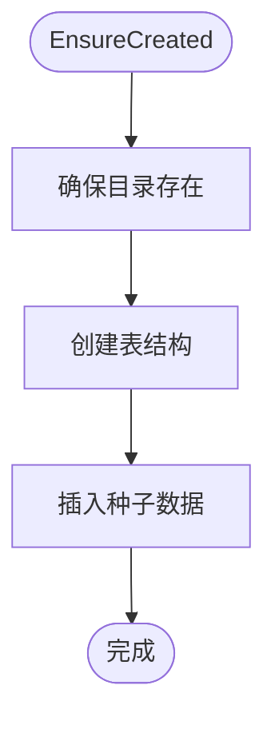
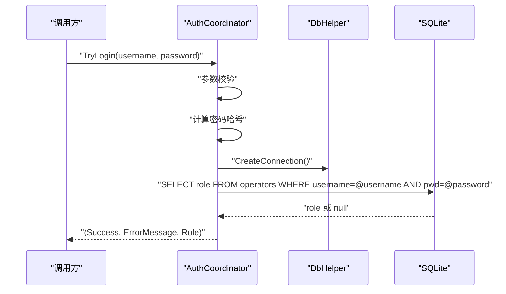
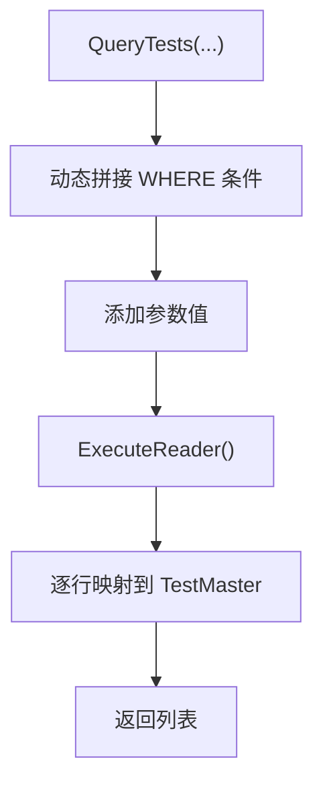
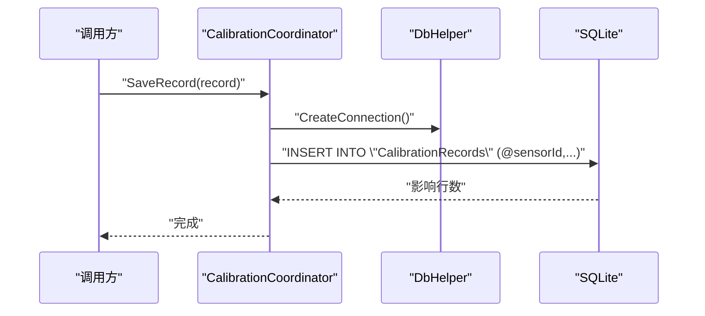
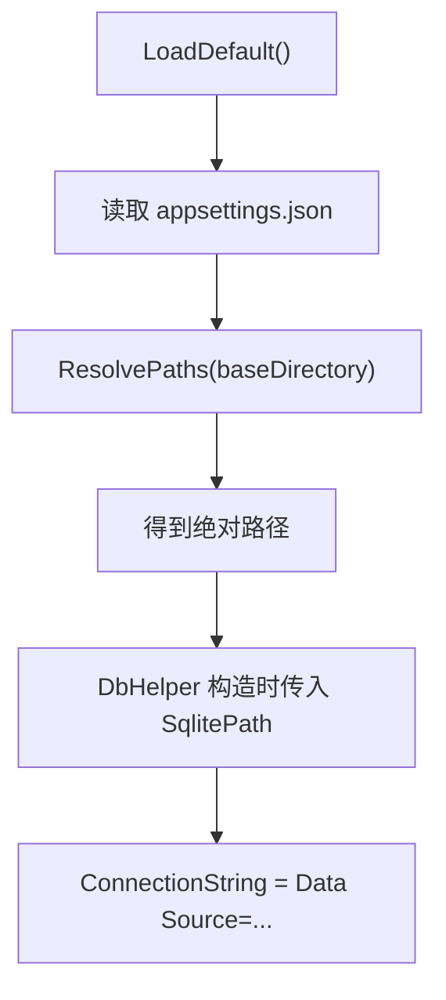
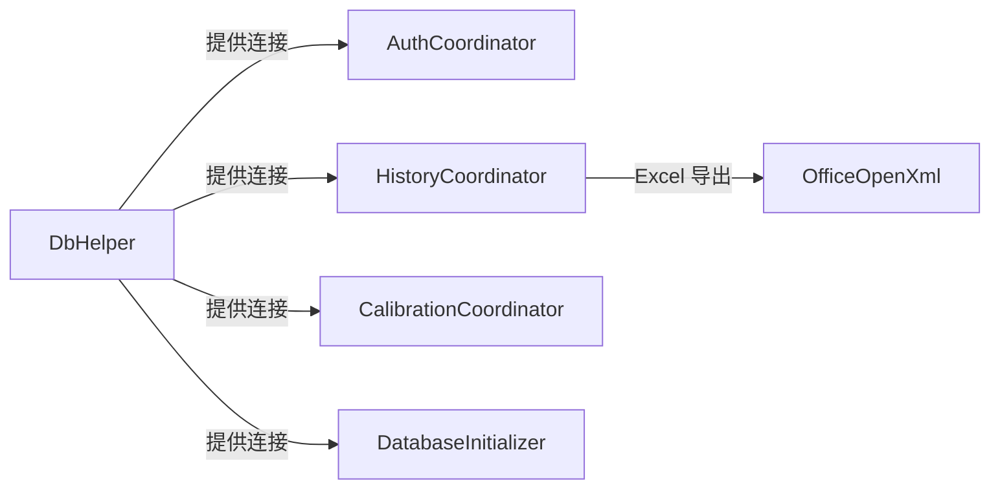

# 数据访问层

<cite>
**本文引用的文件**   
- [DbHelper.cs](file://src/ISO11820.App/Infrastructure/Persistence/DbHelper.cs)
- [DatabaseInitializer.cs](file://src/ISO11820.App/Infrastructure/Persistence/DatabaseInitializer.cs)
- [HistoryCoordinator.cs](file://src/ISO11820.App/Features/History/HistoryCoordinator.cs)
- [AuthCoordinator.cs](file://src/ISO11820.App/Features/Auth/AuthCoordinator.cs)
- [CalibrationCoordinator.cs](file://src/ISO11820.App/Features/Calibration/CalibrationCoordinator.cs)
- [AppSettings.cs](file://src/ISO11820.App/Config/AppSettings.cs)
- [appsettings.json](file://src/ISO11820.App/appsettings.json)
- [TestMaster.cs](file://src/ISO11820.App/Infrastructure/Persistence/Models/TestMaster.cs)
- [Operator.cs](file://src/ISO11820.App/Infrastructure/Persistence/Models/Operator.cs)
- [CalibrationRecord.cs](file://src/ISO11820.App/Infrastructure/Persistence/Models/CalibrationRecord.cs)
</cite>

## 目录
1. [简介](#简介)
2. [项目结构](#项目结构)
3. [核心组件](#核心组件)
4. [架构总览](#架构总览)
5. [详细组件分析](#详细组件分析)
6. [依赖关系分析](#依赖关系分析)
7. [性能考虑](#性能考虑)
8. [故障排查指南](#故障排查指南)
9. [结论](#结论)
10. [附录](#附录)

## 简介
本文件为 ISO 11820 系统的数据访问层提供全面文档，重点围绕 DbHelper 类及其在 SQLite 连接管理、连接池配置与生命周期控制方面的实现；同时覆盖事务管理机制（开启、提交、回滚）、SQL 命令执行封装、参数化查询与结果集处理、错误处理与异常捕获策略、性能优化技巧（批量操作与查询优化）、最佳实践与常见陷阱，以及连接字符串配置与环境变量支持。

## 项目结构
数据访问相关代码主要分布在以下位置：
- 基础设施层：DbHelper、DatabaseInitializer
- 特性协调器：AuthCoordinator、HistoryCoordinator、CalibrationCoordinator
- 配置加载：AppSettings、appsettings.json
- 领域模型：Operator、TestMaster、CalibrationRecord

图表来源
- [AppSettings.cs:125-143](file://src/ISO11820.App/Config/AppSettings.cs#L125-L143)
- [appsettings.json:1-29](file://src/ISO11820.App/appsettings.json#L1-L29)
- [DbHelper.cs:1-22](file://src/ISO11820.App/Infrastructure/Persistence/DbHelper.cs#L1-L22)
- [DatabaseInitializer.cs:16-21](file://src/ISO11820.App/Infrastructure/Persistence/DatabaseInitializer.cs#L16-L21)
- [AuthCoordinator.cs:11-18](file://src/ISO11820.App/Features/Auth/AuthCoordinator.cs#L11-L18)
- [HistoryCoordinator.cs:8-15](file://src/ISO11820.App/Features/History/HistoryCoordinator.cs#L8-L15)
- [CalibrationCoordinator.cs:7-14](file://src/ISO11820.App/Features/Calibration/CalibrationCoordinator.cs#L7-L14)

章节来源
- [DbHelper.cs:1-22](file://src/ISO11820.App/Infrastructure/Persistence/DbHelper.cs#L1-L22)
- [DatabaseInitializer.cs:1-198](file://src/ISO11820.App/Infrastructure/Persistence/DatabaseInitializer.cs#L1-L198)
- [AuthCoordinator.cs:1-62](file://src/ISO11820.App/Features/Auth/AuthCoordinator.cs#L1-L62)
- [HistoryCoordinator.cs:1-241](file://src/ISO11820.App/Features/History/HistoryCoordinator.cs#L1-L241)
- [CalibrationCoordinator.cs:1-91](file://src/ISO11820.App/Features/Calibration/CalibrationCoordinator.cs#L1-L91)
- [AppSettings.cs:1-160](file://src/ISO11820.App/Config/AppSettings.cs#L1-L160)
- [appsettings.json:1-29](file://src/ISO11820.App/appsettings.json#L1-L29)
- [Operator.cs:1-14](file://src/ISO11820.App/Infrastructure/Persistence/Models/Operator.cs#L1-L14)
- [TestMaster.cs:1-47](file://src/ISO11820.App/Infrastructure/Persistence/Models/TestMaster.cs#L1-L47)
- [CalibrationRecord.cs:1-18](file://src/ISO11820.App/Infrastructure/Persistence/Models/CalibrationRecord.cs#L1-L18)

## 核心组件
- DbHelper：负责构建 SQLite 连接字符串并创建连接对象，暴露 SqlitePath 属性用于外部初始化。
- DatabaseInitializer：负责确保数据库目录存在、创建表结构、插入种子数据，并提供简单的登录校验方法。
- AuthCoordinator：基于参数化查询进行用户名与密码校验。
- HistoryCoordinator：提供多条件组合查询、结果映射与 Excel 导出能力。
- CalibrationCoordinator：提供校准记录的增删改查。
- AppSettings：从 appsettings.json 加载配置，解析相对路径为绝对路径，供 DbHelper 使用。

章节来源
- [DbHelper.cs:1-22](file://src/ISO11820.App/Infrastructure/Persistence/DbHelper.cs#L1-L22)
- [DatabaseInitializer.cs:16-21](file://src/ISO11820.App/Infrastructure/Persistence/DatabaseInitializer.cs#L16-L21)
- [AuthCoordinator.cs:26-54](file://src/ISO11820.App/Features/Auth/AuthCoordinator.cs#L26-L54)
- [HistoryCoordinator.cs:103-157](file://src/ISO11820.App/Features/History/HistoryCoordinator.cs#L103-L157)
- [CalibrationCoordinator.cs:16-31](file://src/ISO11820.App/Features/Calibration/CalibrationCoordinator.cs#L16-L31)
- [AppSettings.cs:125-143](file://src/ISO11820.App/Config/AppSettings.cs#L125-L143)

## 架构总览
下图展示了数据访问层的关键交互：配置加载 → 连接工厂 → 协调器 → 数据库。

图表来源
- [AppSettings.cs:125-143](file://src/ISO11820.App/Config/AppSettings.cs#L125-L143)
- [DbHelper.cs:16-21](file://src/ISO11820.App/Infrastructure/Persistence/DbHelper.cs#L16-L21)
- [DatabaseInitializer.cs:32-114](file://src/ISO11820.App/Infrastructure/Persistence/DatabaseInitializer.cs#L32-L114)
- [AuthCoordinator.cs:40-53](file://src/ISO11820.App/Features/Auth/AuthCoordinator.cs#L40-L53)
- [HistoryCoordinator.cs:109-156](file://src/ISO11820.App/Features/History/HistoryCoordinator.cs#L109-L156)
- [CalibrationCoordinator.cs:18-30](file://src/ISO11820.App/Features/Calibration/CalibrationCoordinator.cs#L18-L30)

## 详细组件分析

### DbHelper 类分析
- 职责
  - 持有 SQLite 数据库路径。
  - 生成连接字符串。
  - 创建并打开连接。
- 连接字符串
  - 采用 Data Source= 形式，指向由配置解析得到的绝对路径。
- 连接生命周期
  - CreateConnection 返回已打开的连接，调用方需自行负责关闭与释放（通常通过 using 语句）。
- 连接池
  - 当前未显式配置连接池参数；Microsoft.Data.Sqlite 默认启用连接池。可通过在连接字符串中添加池大小与超时等选项来调整行为。

图表来源
- [DbHelper.cs:5-21](file://src/ISO11820.App/Infrastructure/Persistence/DbHelper.cs#L5-L21)

章节来源
- [DbHelper.cs:1-22](file://src/ISO11820.App/Infrastructure/Persistence/DbHelper.cs#L1-L22)

### DatabaseInitializer 分析
- 职责
  - 确保数据库目录存在。
  - 创建必要表结构（operators、apparatus、productmaster、testmaster、sensors、CalibrationRecords）。
  - 插入初始用户与设备、传感器等种子数据。
  - 提供 ValidateLogin 辅助方法。
- 幂等性
  - 使用 CREATE TABLE IF NOT EXISTS 与 INSERT OR IGNORE 保证多次初始化不会破坏数据。
- 典型流程
  - EnsureCreated → EnsureDirectory → CreateTables → SeedData

图表来源
- [DatabaseInitializer.cs:16-21](file://src/ISO11820.App/Infrastructure/Persistence/DatabaseInitializer.cs#L16-L21)
- [DatabaseInitializer.cs:23-30](file://src/ISO11820.App/Infrastructure/Persistence/DatabaseInitializer.cs#L23-L30)
- [DatabaseInitializer.cs:32-114](file://src/ISO11820.App/Infrastructure/Persistence/DatabaseInitializer.cs#L32-L114)
- [DatabaseInitializer.cs:116-123](file://src/ISO11820.App/Infrastructure/Persistence/DatabaseInitializer.cs#L116-L123)

章节来源
- [DatabaseInitializer.cs:1-198](file://src/ISO11820.App/Infrastructure/Persistence/DatabaseInitializer.cs#L1-L198)

### AuthCoordinator 分析
- 功能
  - 对输入的用户名与密码进行非空校验。
  - 计算密码哈希后执行参数化查询比对。
  - 返回成功状态与角色信息或失败消息。
- 安全要点
  - 使用 SHA256 哈希与参数化查询，避免明文存储与 SQL 注入风险。

图表来源
- [AuthCoordinator.cs:26-54](file://src/ISO11820.App/Features/Auth/AuthCoordinator.cs#L26-L54)
- [AuthCoordinator.cs:56-60](file://src/ISO11820.App/Features/Auth/AuthCoordinator.cs#L56-L60)
- [DbHelper.cs:16-21](file://src/ISO11820.App/Infrastructure/Persistence/DbHelper.cs#L16-L21)

章节来源
- [AuthCoordinator.cs:1-62](file://src/ISO11820.App/Features/Auth/AuthCoordinator.cs#L1-L62)

### HistoryCoordinator 分析
- 功能
  - 查询操作员列表。
  - 按产品编号筛选产品主数据。
  - 查询试验类型（可过滤）。
  - 组合条件查询试验记录（模糊匹配、操作员、日期范围）。
  - 将查询结果导出为 Excel。
- 结果映射
  - 使用 SqliteDataReader 逐行映射到 TestMaster 实体，注意处理可空字段。

图表来源
- [HistoryCoordinator.cs:103-157](file://src/ISO11820.App/Features/History/HistoryCoordinator.cs#L103-L157)
- [HistoryCoordinator.cs:214-240](file://src/ISO11820.App/Features/History/HistoryCoordinator.cs#L214-L240)

章节来源
- [HistoryCoordinator.cs:1-241](file://src/ISO11820.App/Features/History/HistoryCoordinator.cs#L1-L241)
- [TestMaster.cs:1-47](file://src/ISO11820.App/Infrastructure/Persistence/Models/TestMaster.cs#L1-L47)

### CalibrationCoordinator 分析
- 功能
  - 保存校准记录（含 JSON 结果、技术人员、备注等）。
  - 按传感器 ID 查询校准记录。
  - 按 ID 查询单条记录。
- 参数化
  - 所有写入与查询均使用参数化赋值，避免注入风险。

图表来源
- [CalibrationCoordinator.cs:16-31](file://src/ISO11820.App/Features/Calibration/CalibrationCoordinator.cs#L16-L31)
- [DbHelper.cs:16-21](file://src/ISO11820.App/Infrastructure/Persistence/DbHelper.cs#L16-L21)

章节来源
- [CalibrationCoordinator.cs:1-91](file://src/ISO11820.App/Features/Calibration/CalibrationCoordinator.cs#L1-L91)
- [CalibrationRecord.cs:1-18](file://src/ISO11820.App/Infrastructure/Persistence/Models/CalibrationRecord.cs#L1-L18)

### 配置与连接字符串
- 配置来源
  - appsettings.json 中的 Database.SqlitePath 指定数据库文件路径。
- 路径解析
  - AppSettingsLoader 读取配置文件，若不存在则使用默认设置。
  - AppSettingsPathResolver 将相对路径解析为基于运行目录的绝对路径。
- 连接字符串
  - DbHelper.ConnectionString 使用 Data Source= 形式指向最终绝对路径。

图表来源
- [AppSettings.cs:125-143](file://src/ISO11820.App/Config/AppSettings.cs#L125-L143)
- [AppSettings.cs:146-158](file://src/ISO11820.App/Config/AppSettings.cs#L146-L158)
- [DbHelper.cs:14-14](file://src/ISO11820.App/Infrastructure/Persistence/DbHelper.cs#L14-L14)
- [appsettings.json:1-4](file://src/ISO11820.App/appsettings.json#L1-L4)

章节来源
- [AppSettings.cs:1-160](file://src/ISO11820.App/Config/AppSettings.cs#L1-L160)
- [appsettings.json:1-29](file://src/ISO11820.App/appsettings.json#L1-L29)
- [DbHelper.cs:1-22](file://src/ISO11820.App/Infrastructure/Persistence/DbHelper.cs#L1-L22)

## 依赖关系分析
- 组件耦合
  - 协调器均依赖 DbHelper 获取连接，形成松耦合的“连接工厂”模式。
  - DatabaseInitializer 同样依赖 DbHelper，但仅用于初始化阶段。
- 外部依赖
  - Microsoft.Data.Sqlite 提供连接、命令与阅读器。
  - OfficeOpenXml 用于 Excel 导出（HistoryCoordinator）。
- 潜在循环
  - 当前未发现循环依赖。

图表来源
- [AuthCoordinator.cs:11-18](file://src/ISO11820.App/Features/Auth/AuthCoordinator.cs#L11-L18)
- [HistoryCoordinator.cs:8-15](file://src/ISO11820.App/Features/History/HistoryCoordinator.cs#L8-L15)
- [CalibrationCoordinator.cs:7-14](file://src/ISO11820.App/Features/Calibration/CalibrationCoordinator.cs#L7-L14)
- [DatabaseInitializer.cs:9-14](file://src/ISO11820.App/Infrastructure/Persistence/DatabaseInitializer.cs#L9-L14)

章节来源
- [AuthCoordinator.cs:1-62](file://src/ISO11820.App/Features/Auth/AuthCoordinator.cs#L1-L62)
- [HistoryCoordinator.cs:1-241](file://src/ISO11820.App/Features/History/HistoryCoordinator.cs#L1-L241)
- [CalibrationCoordinator.cs:1-91](file://src/ISO11820.App/Features/Calibration/CalibrationCoordinator.cs#L1-L91)
- [DatabaseInitializer.cs:1-198](file://src/ISO11820.App/Infrastructure/Persistence/DatabaseInitializer.cs#L1-L198)

## 性能考虑
- 连接池
  - Microsoft.Data.Sqlite 默认启用连接池。可在连接字符串中增加池大小、最小/最大池大小、超时等参数以优化并发与资源占用。
- 查询优化
  - 使用参数化查询避免注入与重复编译开销。
  - 合理选择列集合，避免 SELECT *。
  - 对高频查询字段建立索引（如 productid、operator、testdate），并在 WHERE 中使用 SARGable 条件。
- 批量操作
  - 对于大量写入，建议在同一连接内使用事务包裹多条 INSERT，减少磁盘同步次数。
- 结果集处理
  - 使用 SqliteDataReader 流式读取，避免一次性加载全部数据到内存。
- 导出优化
  - 大数据量导出时，分块写入 Excel 工作表，避免内存峰值过高。

[本节为通用指导，不直接分析具体文件]

## 故障排查指南
- 常见问题
  - 数据库文件路径无效：检查 appsettings.json 的 Database.SqlitePath 与 AppSettingsPathResolver 解析结果。
  - 权限问题：确保进程对目标目录具有读写权限。
  - 连接未释放：确保所有连接使用 using 包裹，避免连接泄漏。
  - 参数类型不匹配：AddWithValue 自动推断类型，必要时显式指定类型以避免隐式转换。
- 调试建议
  - 打印实际执行的 SQL 与参数（开发环境）。
  - 使用临时数据库文件隔离测试用例，避免污染生产数据。
  - 在测试结束时清理连接池与临时文件。

章节来源
- [appsettings.json:1-4](file://src/ISO11820.App/appsettings.json#L1-L4)
- [AppSettings.cs:146-158](file://src/ISO11820.App/Config/AppSettings.cs#L146-L158)
- [DbHelper.cs:16-21](file://src/ISO11820.App/Infrastructure/Persistence/DbHelper.cs#L16-L21)

## 结论
数据访问层以 DbHelper 为核心连接工厂，配合 DatabaseInitializer 完成初始化，各协调器通过参数化查询与流式读取实现稳定可靠的数据访问。建议在后续迭代中引入统一的事务封装、连接池参数调优与更完善的错误分类与日志记录，以提升系统的健壮性与可维护性。

[本节为总结性内容，不直接分析具体文件]

## 附录

### 事务管理机制说明
- 现状
  - 当前各协调器未显式使用事务；单个命令的执行在 SQLite 中是原子性的。
- 建议方案
  - 在需要多步写入的场景（如批量插入）中，使用同一连接的 BeginTransaction/Commit/Rollback 包裹多个命令，确保一致性。
  - 封装统一的 ExecuteWithTransaction 方法，简化上层调用。

[本节为概念性说明，不直接分析具体文件]

### 数据访问模式最佳实践与常见陷阱
- 最佳实践
  - 始终使用 using 管理连接、命令与阅读器生命周期。
  - 使用参数化查询，禁止字符串拼接 SQL。
  - 明确列名与顺序，避免硬编码列索引带来的脆弱性。
  - 对可空字段进行 IsDBNull 判断后再取值。
- 常见陷阱
  - 忘记关闭连接导致连接池耗尽。
  - 在循环中频繁创建连接，应复用连接或在事务中批量操作。
  - 大结果集一次性加载到内存，应分页或流式处理。

[本节为通用指导，不直接分析具体文件]

### 连接字符串配置与环境变量支持
- 当前实现
  - 通过 appsettings.json 的 Database.SqlitePath 指定数据库路径，并由 AppSettingsPathResolver 解析为绝对路径。
- 扩展建议
  - 支持环境变量覆盖（例如 DATABASE_SQLITE_PATH），在 AppSettingsLoader 中优先读取环境变量再回退到配置文件。
  - 在连接字符串中加入池与超时参数，如 Pool Size、Timeout 等，以满足不同部署场景。

章节来源
- [appsettings.json:1-4](file://src/ISO11820.App/appsettings.json#L1-L4)
- [AppSettings.cs:125-143](file://src/ISO11820.App/Config/AppSettings.cs#L125-L143)
- [AppSettings.cs:146-158](file://src/ISO11820.App/Config/AppSettings.cs#L146-L158)
- [DbHelper.cs:14-14](file://src/ISO11820.App/Infrastructure/Persistence/DbHelper.cs#L14-L14)