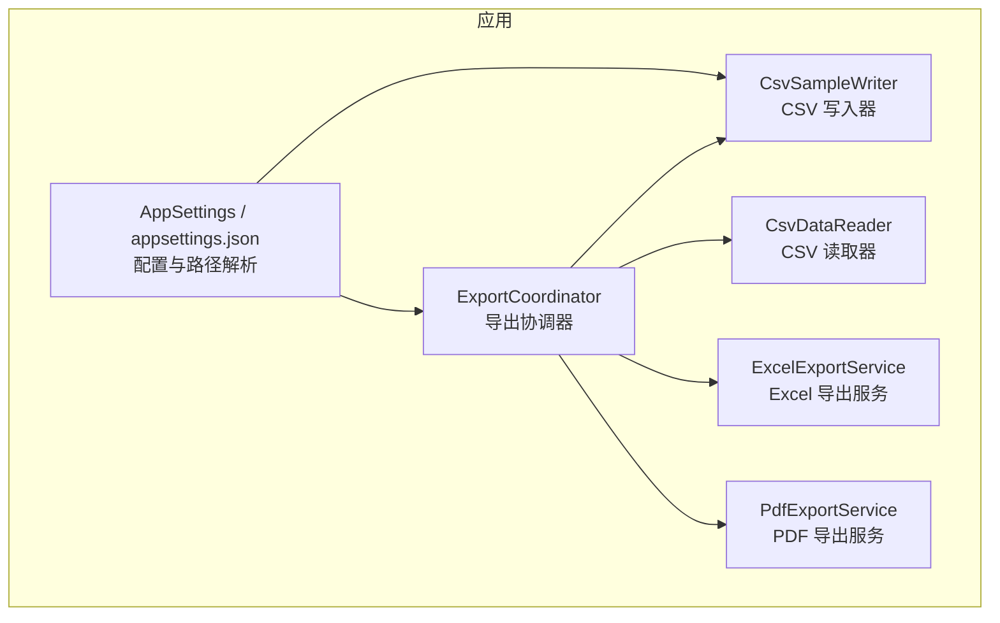
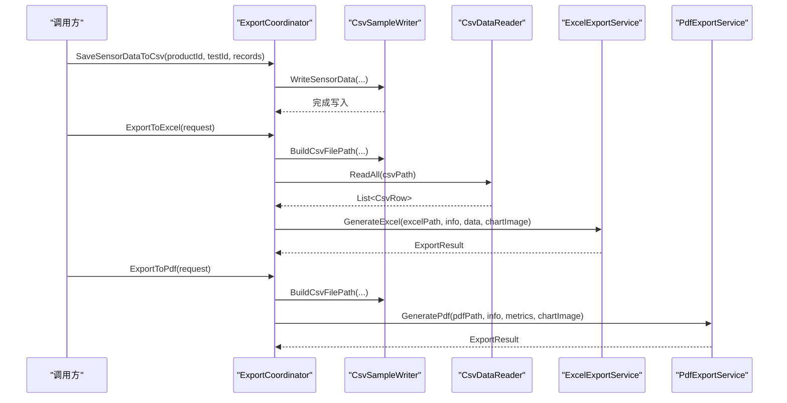
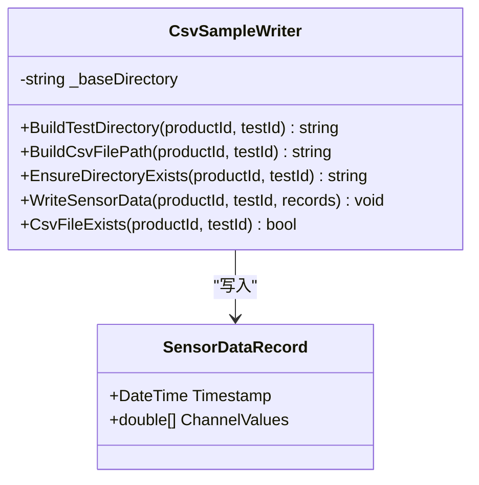
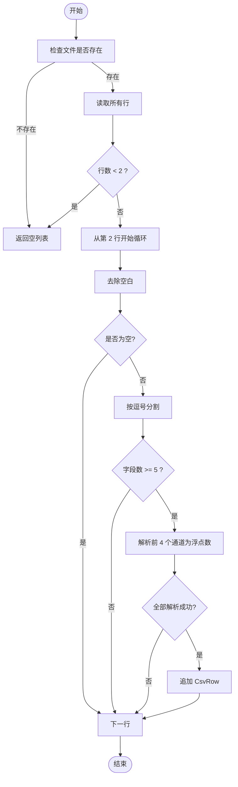
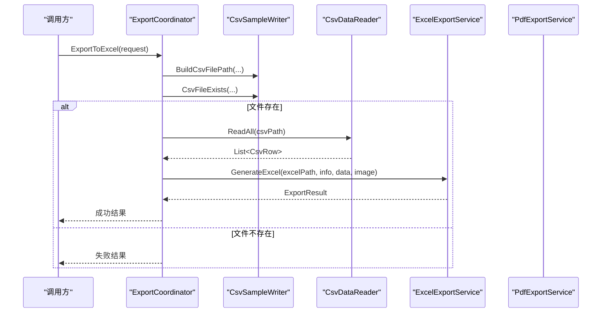
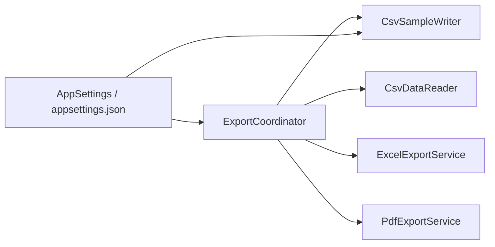

# 文件存储

<cite>
**本文引用的文件**
- [CsvSampleWriter.cs](file://src/ISO11820.App/Infrastructure/FileStorage/CsvSampleWriter.cs)
- [CsvDataReader.cs](file://src/ISO11820.App/Features/Export/CsvDataReader.cs)
- [ExportCoordinator.cs](file://src/ISO11820.App/Features/Export/ExportCoordinator.cs)
- [ExcelExportService.cs](file://src/ISO11820.App/Features/Export/ExcelExportService.cs)
- [PdfExportService.cs](file://src/ISO11820.App/Features/Export/PdfExportService.cs)
- [AppSettings.cs](file://src/ISO11820.App/Config/AppSettings.cs)
- [appsettings.json](file://src/ISO11820.App/appsettings.json)
- [TestRecordCoordinator.cs](file://src/ISO11820.App/Features/TestRecord/TestRecordCoordinator.cs)
- [CsvSampleWriterTests.cs](file://tests/ISO11820.Tests/Persistence/CsvSampleWriterTests.cs)
</cite>

## 目录
1. [简介](#简介)
2. [项目结构](#项目结构)
3. [核心组件](#核心组件)
4. [架构总览](#架构总览)
5. [详细组件分析](#详细组件分析)
6. [依赖关系分析](#依赖关系分析)
7. [性能考虑](#性能考虑)
8. [故障排查指南](#故障排查指南)
9. [结论](#结论)
10. [附录](#附录)

## 简介
本文件为 ISO 11820 系统的“文件存储”机制提供系统化文档，重点围绕 CsvSampleWriter 的 CSV 写入能力、文件格式与编码规范、路径与命名策略、并发访问控制、大文件处理优化、完整性校验与损坏恢复、CSV 解析与导入、备份归档策略以及文件系统权限与安全等主题展开。文档同时覆盖导出链路（CSV → Excel/PDF）与配置体系对输出路径的影响，帮助读者从高层到代码级全面理解系统的数据持久化与导出流程。

## 项目结构
与文件存储相关的核心位置如下：
- 基础设施层：CsvSampleWriter 负责构建测试目录、生成 CSV 文件路径并执行写入。
- 导出特性层：ExportCoordinator 协调 CSV 读取与 Excel/PDF 导出；CsvDataReader 负责将 sensor_data.csv 解析为结构化行。
- 配置层：AppSettings 与 appsettings.json 定义基础输出目录、报告目录及文件存储相关路径。
- 测试层：CsvSampleWriterTests 验证目录结构、文件名、写入内容与异常输入行为。

图表来源
- [ExportCoordinator.cs:1-229](file://src/ISO11820.App/Features/Export/ExportCoordinator.cs#L1-L229)
- [CsvSampleWriter.cs:1-81](file://src/ISO11820.App/Infrastructure/FileStorage/CsvSampleWriter.cs#L1-L81)
- [CsvDataReader.cs:1-72](file://src/ISO11820.App/Features/Export/CsvDataReader.cs#L1-L72)
- [ExcelExportService.cs:1-143](file://src/ISO11820.App/Features/Export/ExcelExportService.cs#L1-L143)
- [PdfExportService.cs:1-139](file://src/ISO11820.App/Features/Export/PdfExportService.cs#L1-L139)
- [AppSettings.cs:1-160](file://src/ISO11820.App/Config/AppSettings.cs#L1-L160)
- [appsettings.json:1-29](file://src/ISO11820.App/appsettings.json#L1-L29)

章节来源
- [CsvSampleWriter.cs:1-81](file://src/ISO11820.App/Infrastructure/FileStorage/CsvSampleWriter.cs#L1-L81)
- [ExportCoordinator.cs:1-229](file://src/ISO11820.App/Features/Export/ExportCoordinator.cs#L1-L229)
- [CsvDataReader.cs:1-72](file://src/ISO11820.App/Features/Export/CsvDataReader.cs#L1-L72)
- [AppSettings.cs:1-160](file://src/ISO11820.App/Config/AppSettings.cs#L1-L160)
- [appsettings.json:1-29](file://src/ISO11820.App/appsettings.json#L1-L29)

## 核心组件
- CsvSampleWriter
  - 职责：构建测试目录、生成 CSV 文件路径、确保目录存在、写入传感器数据 CSV。
  - 关键方法：BuildTestDirectory、BuildCsvFilePath、EnsureDirectoryExists、WriteSensorData、CsvFileExists。
  - 数据模型：SensorDataRecord（时间戳 + 12 通道数值）。
- ExportCoordinator
  - 职责：统一导出入口，协调 CSV 读写与 Excel/PDF 生成，返回标准化结果对象。
  - 关键方法：ExportToCsv、SaveSensorDataToCsv、ExportToExcel、ExportToPdf、GetExportFiles、GetOutputDirectory。
- CsvDataReader
  - 职责：读取 sensor_data.csv，跳过标题行，解析前 4 个通道为温度字段，构造 CsvRow 列表。
- AppSettings / appsettings.json
  - 职责：集中管理输出目录、文件存储目录、报告目录等路径；提供相对路径到绝对路径的解析。

章节来源
- [CsvSampleWriter.cs:1-81](file://src/ISO11820.App/Infrastructure/FileStorage/CsvSampleWriter.cs#L1-L81)
- [ExportCoordinator.cs:1-229](file://src/ISO11820.App/Features/Export/ExportCoordinator.cs#L1-L229)
- [CsvDataReader.cs:1-72](file://src/ISO11820.App/Features/Export/CsvDataReader.cs#L1-L72)
- [AppSettings.cs:1-160](file://src/ISO11820.App/Config/AppSettings.cs#L1-L160)
- [appsettings.json:1-29](file://src/ISO11820.App/appsettings.json#L1-L29)

## 架构总览
导出与存储的整体调用链如下：

图表来源
- [ExportCoordinator.cs:24-119](file://src/ISO11820.App/Features/Export/ExportCoordinator.cs#L24-L119)
- [CsvSampleWriter.cs:41-54](file://src/ISO11820.App/Infrastructure/FileStorage/CsvSampleWriter.cs#L41-L54)
- [CsvDataReader.cs:25-70](file://src/ISO11820.App/Features/Export/CsvDataReader.cs#L25-L70)
- [ExcelExportService.cs:28-60](file://src/ISO11820.App/Features/Export/ExcelExportService.cs#L28-L60)
- [PdfExportService.cs:10-35](file://src/ISO11820.App/Features/Export/PdfExportService.cs#L10-L35)

## 详细组件分析

### CsvSampleWriter 类分析
- 目录结构与命名约定
  - 目录层级：baseDirectory → TestData → productId → testId
  - 文件名：sensor_data.csv
  - 通过 BuildTestDirectory 和 BuildCsvFilePath 组合路径，EnsureDirectoryExists 保证目录存在。
- CSV 文件格式与编码
  - 首行固定表头：Timestamp, Channel1...Channel12
  - 每行包含一个时间戳与 12 个通道值，使用不变区域文化格式化数字，避免本地化差异。
  - 编码：UTF-8（无 BOM），便于跨平台与工具兼容。
- 字符转义与分隔符
  - 当前实现未进行引号包裹或逗号转义，字段不含逗号、换行等特殊字符时可直接解析。
  - 若未来需要支持含特殊字符的文本字段，应引入标准 CSV 转义（如双引号包裹与内部双引号转义）。
- 并发与线程安全
  - 当前写入为同步操作，同一进程内多线程并发写入同一文件会产生竞争条件。
  - 建议：在调用侧加锁或使用队列串行化写入；或在类内部引入写锁。
- 大文件内存优化
  - 当前一次性遍历 IEnumerable<SensorDataRecord> 逐行写入，内存占用与记录数线性相关。
  - 建议：上游按批次聚合记录，分批写入；或改为流式追加模式（Append）以减少覆盖开销。
- 完整性与损坏恢复
  - 当前未实现校验和或事务性写入。
  - 建议：采用“临时文件 + 原子重命名”策略；可选写入校验和（如 CRC32）并在读取端校验。
- 文件存在性与错误处理
  - CsvFileExists 用于快速判断文件是否存在；WriteSensorData 内部会创建目录并覆盖写入。
  - 建议在导出链路中先检查文件存在性再消费，避免空读。

图表来源
- [CsvSampleWriter.cs:6-81](file://src/ISO11820.App/Infrastructure/FileStorage/CsvSampleWriter.cs#L6-L81)

章节来源
- [CsvSampleWriter.cs:1-81](file://src/ISO11820.App/Infrastructure/FileStorage/CsvSampleWriter.cs#L1-L81)
- [CsvSampleWriterTests.cs:26-183](file://tests/ISO11820.Tests/Persistence/CsvSampleWriterTests.cs#L26-L183)

### CsvDataReader 解析与导入
- 解析规则
  - 跳过首行标题，从第 2 行开始解析。
  - 仅使用前 4 个通道作为温度字段（Furnace1/Furnace2/Surface/Center），其余通道忽略。
  - 使用不变区域文化解析浮点数，避免小数点格式问题。
- 容错处理
  - 空文件或仅标题行返回空列表。
  - 行长度不足或数值解析失败则跳过该行。
- 导入建议
  - 对于超大 CSV，建议使用流式读取（逐行解析）而非一次性加载全部行，以降低内存峰值。
  - 可引入列名映射与类型校验，提升鲁棒性。

图表来源
- [CsvDataReader.cs:25-70](file://src/ISO11820.App/Features/Export/CsvDataReader.cs#L25-L70)

章节来源
- [CsvDataReader.cs:1-72](file://src/ISO11820.App/Features/Export/CsvDataReader.cs#L1-L72)

### ExportCoordinator 导出编排
- 导出 CSV
  - 校验目标 CSV 是否存在，存在则返回成功结果与文件路径。
- 导出 Excel
  - 读取 CSV → 生成 Excel（包含试验信息、温度数据、可选图表页）。
- 导出 PDF
  - 基于试验信息与指标生成报告，嵌入图表图片。
- 获取导出文件清单
  - 列出指定目录下已生成的 CSV/Excel/PDF 及其大小。

图表来源
- [ExportCoordinator.cs:54-85](file://src/ISO11820.App/Features/Export/ExportCoordinator.cs#L54-L85)
- [CsvSampleWriter.cs:25-73](file://src/ISO11820.App/Infrastructure/FileStorage/CsvSampleWriter.cs#L25-L73)
- [CsvDataReader.cs:25-70](file://src/ISO11820.App/Features/Export/CsvDataReader.cs#L25-L70)
- [ExcelExportService.cs:28-60](file://src/ISO11820.App/Features/Export/ExcelExportService.cs#L28-L60)

章节来源
- [ExportCoordinator.cs:1-229](file://src/ISO11820.App/Features/Export/ExportCoordinator.cs#L1-L229)

### 配置与路径管理
- 配置文件
  - FileStorage.BaseDirectory 与 FileStorage.TestDataDirectory 定义数据根目录与样本目录。
  - Report.OutputDirectory 定义报告输出目录。
- 路径解析
  - AppSettingsPathResolver 将相对路径解析为绝对路径，优先使用 baseDirectory 拼接。
- 目录结构约定
  - 默认输出根：TestData
  - 具体测试产物：TestData/{productId}/{testId}/sensor_data.csv
  - 报告产物：TestData/Reports 或各测试目录下的 test_report.pdf（由导出服务决定）

章节来源
- [appsettings.json:13-23](file://src/ISO11820.App/appsettings.json#L13-L23)
- [AppSettings.cs:89-117](file://src/ISO11820.App/Config/AppSettings.cs#L89-L117)
- [AppSettings.cs:146-159](file://src/ISO11820.App/Config/AppSettings.cs#L146-L159)

### 并发访问控制与异步写入
- 现状
  - CsvSampleWriter.WriteSensorData 为同步写入，未内置并发控制。
  - TestRecordCoordinator 使用锁保护待保存记录的集合，避免重复保存。
- 风险
  - 多线程并发写入同一 CSV 会导致数据交错或损坏。
- 建议方案
  - 单实例串行化：为每个测试目录维护一个写队列，顺序落盘。
  - 细粒度锁：以文件路径为键的并发字典，锁定对应文件的写入。
  - 异步写入：使用 FileStream + StreamWriter 的异步 API，结合上述锁策略。
  - 幂等写入：采用“临时文件 + 原子重命名”，避免部分写入导致文件损坏。

章节来源
- [CsvSampleWriter.cs:41-54](file://src/ISO11820.App/Infrastructure/FileStorage/CsvSampleWriter.cs#L41-L54)
- [TestRecordCoordinator.cs:30-79](file://src/ISO11820.App/Features/TestRecord/TestRecordCoordinator.cs#L30-L79)

### 大文件处理的内存优化
- 现状
  - CsvDataReader.ReadAll 一次性读取全部行，适合中小规模数据。
- 优化建议
  - 流式读取：逐行解析，按需转换为 CsvRow，降低内存峰值。
  - 分块处理：对导出报表进行分页渲染或增量写入。
  - 缓冲策略：合理设置 StreamWriter 缓冲区大小，减少 I/O 次数。

章节来源
- [CsvDataReader.cs:25-70](file://src/ISO11820.App/Features/Export/CsvDataReader.cs#L25-L70)

### 文件完整性验证与损坏恢复
- 现状
  - 未实现校验和或事务性写入。
- 建议方案
  - 原子写入：先写入 .tmp 文件，成功后重命名为最终文件名。
  - 校验和：在文件末尾追加 CRC32 或 SHA-256 摘要，读取时校验。
  - 回滚策略：若校验失败，删除损坏文件并尝试从最近备份恢复。
  - 日志记录：记录每次写入的开始/结束时间与文件大小，辅助定位问题。

[本节为通用建议，不直接分析具体文件]

### CSV 解析与导入实现指导
- 解析要点
  - 严格遵循首行表头与字段顺序。
  - 使用不变区域文化解析数值，避免本地化差异。
  - 对缺失字段或非法数值进行容错处理（跳过或填充默认值）。
- 导入流程
  - 校验文件存在与可读。
  - 流式读取并转换为目标模型。
  - 批量入库或导出，必要时开启事务。

章节来源
- [CsvDataReader.cs:25-70](file://src/ISO11820.App/Features/Export/CsvDataReader.cs#L25-L70)

### 文件备份与归档策略
- 建议策略
  - 定期快照：按日/周将 TestData 目录打包压缩至归档目录。
  - 版本化：为每次归档添加时间戳与哈希，便于追溯。
  - 保留策略：根据合规要求设定保留周期，自动清理过期归档。
  - 异地备份：将归档副本复制到外部存储或云存储。

[本节为通用建议，不直接分析具体文件]

### 文件系统权限与安全考虑
- 最小权限原则：运行账户仅对 TestData 与 Reports 目录具备读写权限。
- 路径校验：防止路径穿越攻击，拒绝包含 .. 的非法路径。
- 敏感信息：不在 CSV 中写入用户密码或密钥；如需记录操作员，仅存标识。
- 审计日志：记录导出与写入操作的关键事件，便于审计追踪。

[本节为通用建议，不直接分析具体文件]

## 依赖关系分析
- ExportCoordinator 依赖 CsvSampleWriter（路径与写入）、CsvDataReader（读取）、ExcelExportService 与 PdfExportService（生成报告）。
- CsvSampleWriter 依赖 System.IO 与 System.Globalization。
- AppSettings 提供路径解析，影响所有输出路径的最终落地位置。

图表来源
- [ExportCoordinator.cs:1-229](file://src/ISO11820.App/Features/Export/ExportCoordinator.cs#L1-L229)
- [CsvSampleWriter.cs:1-81](file://src/ISO11820.App/Infrastructure/FileStorage/CsvSampleWriter.cs#L1-L81)
- [CsvDataReader.cs:1-72](file://src/ISO11820.App/Features/Export/CsvDataReader.cs#L1-L72)
- [ExcelExportService.cs:1-143](file://src/ISO11820.App/Features/Export/ExcelExportService.cs#L1-L143)
- [PdfExportService.cs:1-139](file://src/ISO11820.App/Features/Export/PdfExportService.cs#L1-L139)
- [AppSettings.cs:1-160](file://src/ISO11820.App/Config/AppSettings.cs#L1-L160)
- [appsettings.json:1-29](file://src/ISO11820.App/appsettings.json#L1-L29)

章节来源
- [ExportCoordinator.cs:1-229](file://src/ISO11820.App/Features/Export/ExportCoordinator.cs#L1-L229)
- [CsvSampleWriter.cs:1-81](file://src/ISO11820.App/Infrastructure/FileStorage/CsvSampleWriter.cs#L1-L81)
- [CsvDataReader.cs:1-72](file://src/ISO11820.App/Features/Export/CsvDataReader.cs#L1-L72)
- [AppSettings.cs:1-160](file://src/ISO11820.App/Config/AppSettings.cs#L1-L160)
- [appsettings.json:1-29](file://src/ISO11820.App/appsettings.json#L1-L29)

## 性能考虑
- I/O 吞吐
  - 使用 UTF-8 编码与合适的缓冲区大小可减少序列化与磁盘写入开销。
  - 大批量写入建议分批提交，避免长时间独占文件句柄。
- 解析效率
  - 对大 CSV 采用流式解析，避免一次性加载到内存。
- 并发控制
  - 通过写锁或队列串行化，避免竞争导致的额外重试与回滚。
- 资源释放
  - 确保文件句柄及时释放，避免句柄泄漏导致后续写入失败。

[本节为通用建议，不直接分析具体文件]

## 故障排查指南
- 常见问题
  - 文件不存在：导出前检查 CsvFileExists，确认目录与文件名是否正确。
  - 解析失败：检查 CSV 是否包含非预期字符或列数不足；确认数值格式与区域设置。
  - 权限错误：确认运行账户对目标目录具有读写权限。
  - 并发冲突：检查是否存在多线程并发写入同一文件。
- 诊断步骤
  - 打印实际输出目录与文件路径，核对与配置一致。
  - 查看导出结果对象的 Success/Message/Error 字段，定位失败原因。
  - 对 CSV 进行完整性校验（如计算校验和并与上次成功写入对比）。

章节来源
- [ExportCoordinator.cs:24-119](file://src/ISO11820.App/Features/Export/ExportCoordinator.cs#L24-L119)
- [CsvSampleWriter.cs:69-73](file://src/ISO11820.App/Infrastructure/FileStorage/CsvSampleWriter.cs#L69-L73)
- [CsvDataReader.cs:25-70](file://src/ISO11820.App/Features/Export/CsvDataReader.cs#L25-L70)

## 结论
本文件存储机制以 CsvSampleWriter 为核心，配合 ExportCoordinator 形成完整的导出链路。当前实现满足基本写入与导出需求，但在并发控制、大文件内存优化、完整性校验与损坏恢复方面仍有改进空间。建议引入原子写入、写锁/队列、流式解析与校验和机制，以提升系统在真实生产环境中的健壮性与性能。

[本节为总结，不直接分析具体文件]

## 附录
- 目录与文件命名约定
  - 根目录：TestData
  - 测试目录：TestData/{productId}/{testId}
  - CSV 文件：sensor_data.csv
  - Excel 文件：sensor_data.xlsx
  - PDF 报告：test_report.pdf
- 配置项参考
  - FileStorage.BaseDirectory：数据根目录
  - FileStorage.TestDataDirectory：样本目录
  - Report.OutputDirectory：报告输出目录

章节来源
- [appsettings.json:13-23](file://src/ISO11820.App/appsettings.json#L13-L23)
- [AppSettings.cs:89-117](file://src/ISO11820.App/Config/AppSettings.cs#L89-L117)