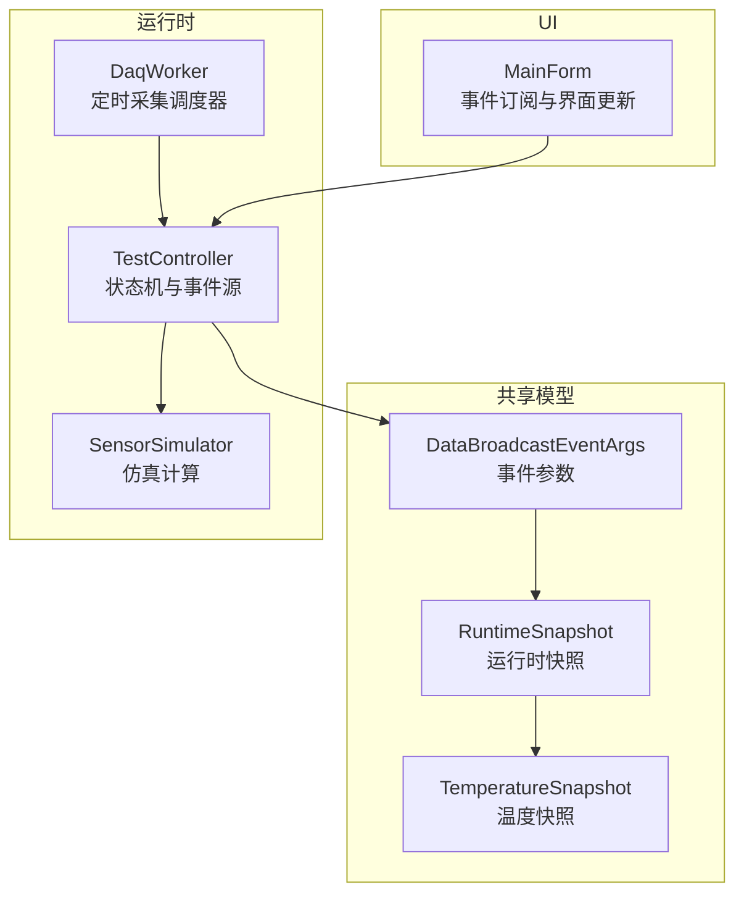
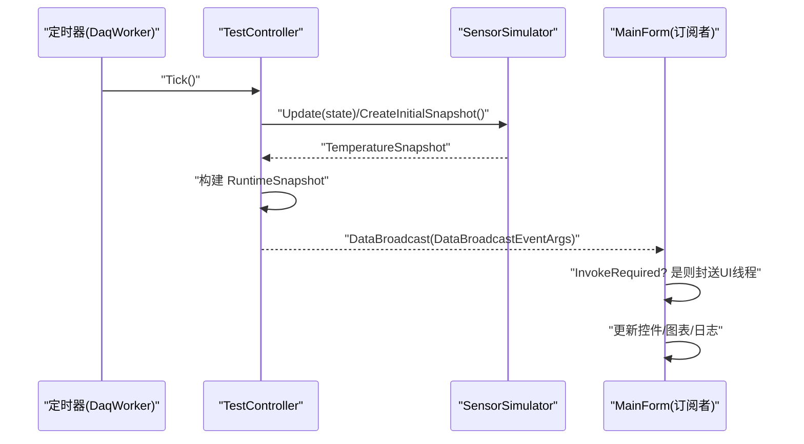
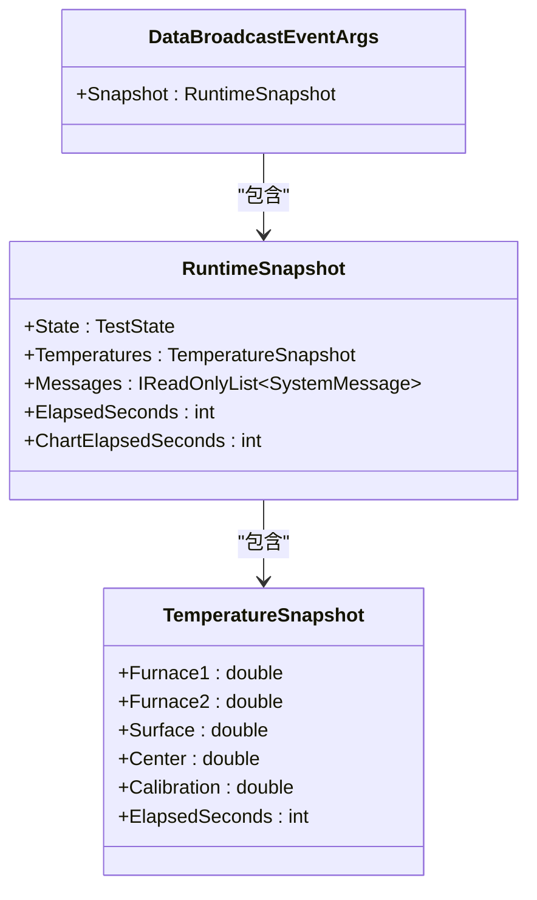
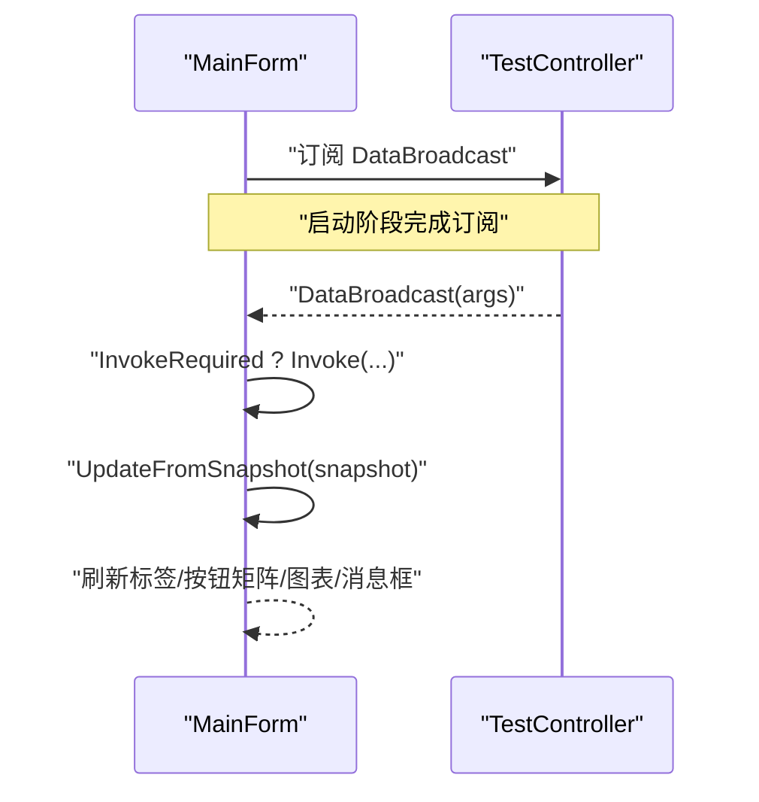
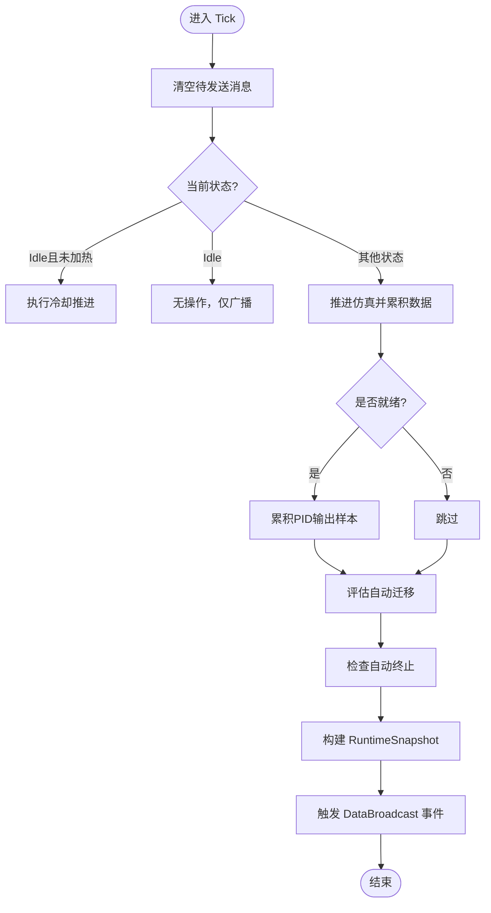
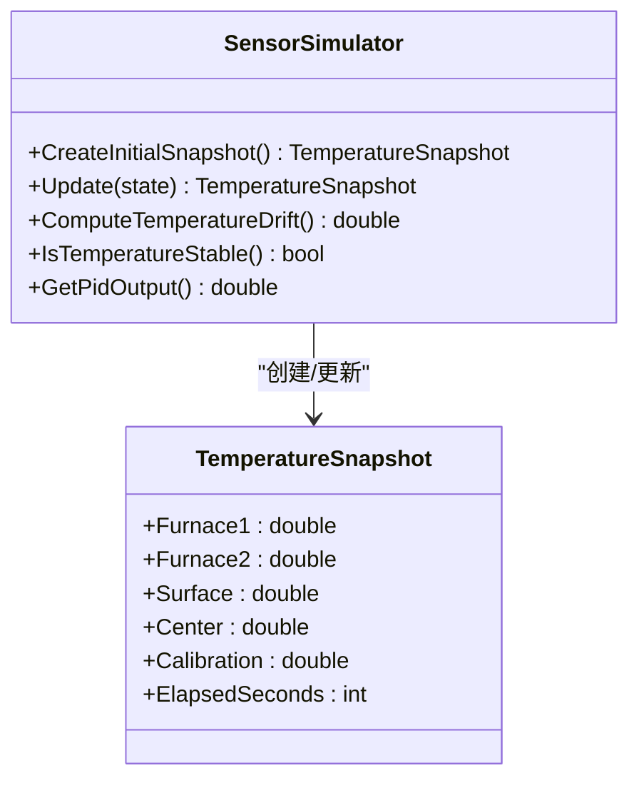
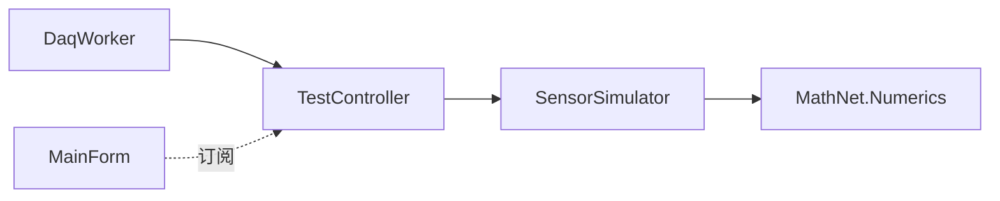

# 事件驱动机制

<cite>
**本文引用的文件列表**
- [DataBroadcastEventArgs.cs](file://src/ISO11820.App/Shared/Events/DataBroadcastEventArgs.cs)
- [RuntimeSnapshot.cs](file://src/ISO11820.App/Shared/Models/RuntimeSnapshot.cs)
- [TemperatureSnapshot.cs](file://src/ISO11820.Core/Models/TemperatureSnapshot.cs)
- [TestController.cs](file://src/ISO11820.App/Runtime/Controller/TestController.cs)
- [DaqWorker.cs](file://src/ISO11820.App/Runtime/Services/DaqWorker.cs)
- [SensorSimulator.cs](file://src/ISO11820.App/Runtime/Services/SensorSimulator.cs)
- [MainForm.cs](file://src/ISO11820.App/UI/Forms/MainForm.cs)
</cite>

## 目录
1. [简介](#简介)
2. [项目结构](#项目结构)
3. [核心组件](#核心组件)
4. [架构总览](#架构总览)
5. [详细组件分析](#详细组件分析)
6. [依赖关系分析](#依赖关系分析)
7. [性能考量](#性能考量)
8. [故障排查指南](#故障排查指南)
9. [结论](#结论)
10. [附录](#附录)

## 简介
本文件面向 ISO 11820 系统的事件驱动机制，聚焦以下目标：
- 设计并说明 DataBroadcastEventArgs 事件参数模型及其用途
- 阐述发布-订阅模式在数据采集、UI 更新与业务逻辑解耦中的运用
- 文档化 DaqWorker 中的数据收集事件与温度快照事件的广播机制
- 解释线程安全的事件处理与多线程环境下的同步策略
- 说明事件过滤与订阅管理的实现方式
- 提供事件驱动编程的最佳实践与性能优化建议
- 给出事件调试与监控的方法

## 项目结构
围绕事件驱动的关键代码分布在应用层共享模型、运行时控制器与服务、以及 UI 层中。下图展示了与事件相关的主要文件与职责划分。

图表来源
- [DataBroadcastEventArgs.cs:1-14](file://src/ISO11820.App/Shared/Events/DataBroadcastEventArgs.cs#L1-L14)
- [RuntimeSnapshot.cs:1-12](file://src/ISO11820.App/Shared/Models/RuntimeSnapshot.cs#L1-L12)
- [TemperatureSnapshot.cs:1-10](file://src/ISO11820.Core/Models/TemperatureSnapshot.cs#L1-L10)
- [TestController.cs:1-328](file://src/ISO11820.App/Runtime/Controller/TestController.cs#L1-L328)
- [DaqWorker.cs:1-50](file://src/ISO11820.App/Runtime/Services/DaqWorker.cs#L1-L50)
- [SensorSimulator.cs:1-223](file://src/ISO11820.App/Runtime/Services/SensorSimulator.cs#L1-L223)
- [MainForm.cs:530-729](file://src/ISO11820.App/UI/Forms/MainForm.cs#L530-L729)

章节来源
- [DataBroadcastEventArgs.cs:1-14](file://src/ISO11820.App/Shared/Events/DataBroadcastEventArgs.cs#L1-L14)
- [RuntimeSnapshot.cs:1-12](file://src/ISO11820.App/Shared/Models/RuntimeSnapshot.cs#L1-L12)
- [TemperatureSnapshot.cs:1-10](file://src/ISO11820.Core/Models/TemperatureSnapshot.cs#L1-L10)
- [TestController.cs:1-328](file://src/ISO11820.App/Runtime/Controller/TestController.cs#L1-L328)
- [DaqWorker.cs:1-50](file://src/ISO11820.App/Runtime/Services/DaqWorker.cs#L1-L50)
- [SensorSimulator.cs:1-223](file://src/ISO11820.App/Runtime/Services/SensorSimulator.cs#L1-L223)
- [MainForm.cs:530-729](file://src/ISO11820.App/UI/Forms/MainForm.cs#L530-L729)

## 核心组件
- 事件参数模型
  - DataBroadcastEventArgs：承载一次数据广播的快照对象，包含一个不可变的 RuntimeSnapshot。
  - RuntimeSnapshot：聚合当前测试状态、温度快照、系统消息、计时等运行期信息。
  - TemperatureSnapshot：封装炉温、表面温、中心温、校准温及已用秒数。
- 事件源与调度
  - TestController：定义 DataBroadcast 事件，负责构建快照并触发事件；内部维护状态机与仿真数据。
  - DaqWorker：基于定时器周期调用 TestController.Tick()，驱动数据收集与快照广播。
- 仿真与数据生成
  - SensorSimulator：根据当前状态推进温度仿真，输出 TemperatureSnapshot，并提供温漂计算等能力。
- UI 订阅者
  - MainForm：订阅 DataBroadcast 事件，跨线程将 UI 更新封送到 UI 线程，刷新控件与图表。

章节来源
- [DataBroadcastEventArgs.cs:1-14](file://src/ISO11820.App/Shared/Events/DataBroadcastEventArgs.cs#L1-L14)
- [RuntimeSnapshot.cs:1-12](file://src/ISO11820.App/Shared/Models/RuntimeSnapshot.cs#L1-L12)
- [TemperatureSnapshot.cs:1-10](file://src/ISO11820.Core/Models/TemperatureSnapshot.cs#L1-L10)
- [TestController.cs:1-328](file://src/ISO11820.App/Runtime/Controller/TestController.cs#L1-L328)
- [DaqWorker.cs:1-50](file://src/ISO11820.App/Runtime/Services/DaqWorker.cs#L1-L50)
- [SensorSimulator.cs:1-223](file://src/ISO11820.App/Runtime/Services/SensorSimulator.cs#L1-L223)
- [MainForm.cs:530-729](file://src/ISO11820.App/UI/Forms/MainForm.cs#L530-L729)

## 架构总览
事件驱动的核心流程如下：
- 后台定时器（DaqWorker）以固定周期触发 Tick
- TestController 在 Tick 中推进仿真、累积传感器数据、评估自动迁移与终止条件
- 每次 Tick 或用户操作后，TestController 构建 RuntimeSnapshot 并通过 DataBroadcast 事件广播
- UI 订阅者 MainFrom 接收事件，必要时跨线程更新界面与图表

图表来源
- [DaqWorker.cs:45-48](file://src/ISO11820.App/Runtime/Services/DaqWorker.cs#L45-L48)
- [TestController.cs:171-213](file://src/ISO11820.App/Runtime/Controller/TestController.cs#L171-L213)
- [SensorSimulator.cs:46-79](file://src/ISO11820.App/Runtime/Services/SensorSimulator.cs#L46-L79)
- [MainForm.cs:537-546](file://src/ISO11820.App/UI/Forms/MainForm.cs#L537-L546)

## 详细组件分析

### 事件参数模型：DataBroadcastEventArgs 与快照类型
- DataBroadcastEventArgs
  - 仅暴露只读属性 Snapshot，确保事件消费者无法篡改快照内容
  - 构造时传入 RuntimeSnapshot，形成一次完整的数据快照
- RuntimeSnapshot
  - 聚合 TestState、TemperatureSnapshot、Messages、ElapsedSeconds、ChartElapsedSeconds
  - 作为 UI 渲染与业务处理的统一输入
- TemperatureSnapshot
  - 记录多通道温度与时间维度信息，供 UI 曲线绘制与导出使用

图表来源
- [DataBroadcastEventArgs.cs:5-13](file://src/ISO11820.App/Shared/Events/DataBroadcastEventArgs.cs#L5-L13)
- [RuntimeSnapshot.cs:6-11](file://src/ISO11820.App/Shared/Models/RuntimeSnapshot.cs#L6-L11)
- [TemperatureSnapshot.cs:3-9](file://src/ISO11820.Core/Models/TemperatureSnapshot.cs#L3-L9)

章节来源
- [DataBroadcastEventArgs.cs:1-14](file://src/ISO11820.App/Shared/Events/DataBroadcastEventArgs.cs#L1-L14)
- [RuntimeSnapshot.cs:1-12](file://src/ISO11820.App/Shared/Models/RuntimeSnapshot.cs#L1-L12)
- [TemperatureSnapshot.cs:1-10](file://src/ISO11820.Core/Models/TemperatureSnapshot.cs#L1-L10)

### 事件发布-订阅：TestController 与 MainForm
- 发布端
  - TestController 暴露 DataBroadcast 事件
  - 在 Tick、用户操作（开始/停止加热、开始/停止记录、复位、更新仿真设置）后构建快照并触发事件
- 订阅端
  - MainForm 在生命周期内订阅/取消订阅 DataBroadcast
  - 在事件回调中检查 InvokeRequired，必要时封送到 UI 线程再更新界面

图表来源
- [TestController.cs:30-34](file://src/ISO11820.App/Runtime/Controller/TestController.cs#L30-L34)
- [TestController.cs:311-315](file://src/ISO11820.App/Runtime/Controller/TestController.cs#L311-L315)
- [MainForm.cs:518-546](file://src/ISO11820.App/UI/Forms/MainForm.cs#L518-L546)

章节来源
- [TestController.cs:171-213](file://src/ISO11820.App/Runtime/Controller/TestController.cs#L171-L213)
- [MainForm.cs:530-729](file://src/ISO11820.App/UI/Forms/MainForm.cs#L530-L729)

### 数据采集与广播：DaqWorker 与 TestController
- DaqWorker
  - 使用 System.Timers.Timer 以固定间隔（约 800ms）触发 OnTick
  - Start 时先广播初始状态，再启动定时器；Stop 时停止定时器
- TestController.Tick
  - 清理待发送消息队列
  - 根据当前状态推进仿真（冷却/升温/稳定/记录）
  - 累积传感器数据到缓冲区
  - 评估自动迁移与自动终止条件
  - 最后构建快照并广播

图表来源
- [DaqWorker.cs:45-48](file://src/ISO11820.App/Runtime/Services/DaqWorker.cs#L45-L48)
- [TestController.cs:171-213](file://src/ISO11820.App/Runtime/Controller/TestController.cs#L171-L213)
- [TestController.cs:230-302](file://src/ISO11820.App/Runtime/Controller/TestController.cs#L230-L302)

章节来源
- [DaqWorker.cs:1-50](file://src/ISO11820.App/Runtime/Services/DaqWorker.cs#L1-L50)
- [TestController.cs:171-213](file://src/ISO11820.App/Runtime/Controller/TestController.cs#L171-L213)
- [TestController.cs:230-302](file://src/ISO11820.App/Runtime/Controller/TestController.cs#L230-L302)

### 温度快照事件：SensorSimulator 与 TemperatureSnapshot
- SensorSimulator 根据状态推进温度模型，返回 TemperatureSnapshot
- 支持温漂计算（线性回归）、稳定判定、冷却推进、记录阶段指数逼近等
- 通过锁保护最近采样点集合，保证并发访问安全

图表来源
- [SensorSimulator.cs:41-79](file://src/ISO11820.App/Runtime/Services/SensorSimulator.cs#L41-L79)
- [SensorSimulator.cs:84-97](file://src/ISO11820.App/Runtime/Services/SensorSimulator.cs#L84-L97)
- [TemperatureSnapshot.cs:3-9](file://src/ISO11820.Core/Models/TemperatureSnapshot.cs#L3-L9)

章节来源
- [SensorSimulator.cs:1-223](file://src/ISO11820.App/Runtime/Services/SensorSimulator.cs#L1-L223)
- [TemperatureSnapshot.cs:1-10](file://src/ISO11820.Core/Models/TemperatureSnapshot.cs#L1-L10)

### 线程安全与同步策略
- 事件源侧（TestController）
  - 使用互斥锁保护状态变更、消息队列、PID 样本缓冲与传感器数据缓冲
  - 所有可能导致状态变化的方法在锁内完成后再广播，避免竞态
- 事件订阅侧（MainForm）
  - 在事件回调中检测 InvokeRequired，必要时通过 Invoke 封送到 UI 线程
  - 确保 UI 控件更新始终在 UI 线程执行
- 仿真侧（SensorSimulator）
  - 对温漂采样集合使用锁保护，避免并发写入导致数据不一致

章节来源
- [TestController.cs:57-167](file://src/ISO11820.App/Runtime/Controller/TestController.cs#L57-L167)
- [TestController.cs:171-213](file://src/ISO11820.App/Runtime/Controller/TestController.cs#L171-L213)
- [MainForm.cs:537-546](file://src/ISO11820.App/UI/Forms/MainForm.cs#L537-L546)
- [SensorSimulator.cs:84-107](file://src/ISO11820.App/Runtime/Services/SensorSimulator.cs#L84-L107)

### 事件过滤与订阅管理
- 订阅管理
  - MainForm 在生命周期内显式订阅/取消订阅 DataBroadcast，避免内存泄漏
- 事件过滤
  - 当前实现为全量广播，未在事件源侧进行过滤
  - 可在订阅端按状态或时间范围过滤（例如仅在 Recording 或 Complete 时更新图表）
  - 也可在事件源侧引入轻量级过滤器（如基于状态的白名单），减少无关订阅者的负载

章节来源
- [MainForm.cs:518-546](file://src/ISO11820.App/UI/Forms/MainForm.cs#L518-L546)
- [TestController.cs:311-315](file://src/ISO11820.App/Runtime/Controller/TestController.cs#L311-L315)

### 最佳实践与性能优化建议
- 事件参数不可变
  - DataBroadcastEventArgs 与 RuntimeSnapshot 采用只读设计，降低拷贝与竞争风险
- 批量更新与节流
  - 若 UI 更新开销较大，可考虑在订阅端合并多次快照（如每 N 次或每秒一次）
- 避免在事件回调中进行阻塞 I/O
  - 将耗时任务（如 CSV 导出）异步化或在独立线程执行
- 合理控制广播频率
  - 当前 800ms 周期较为均衡；如需更高帧率，应评估 UI 重绘与图表压力
- 订阅者健壮性
  - 在订阅回调中捕获异常并记录日志，防止单个订阅者影响整体稳定性

[本节为通用指导，不直接分析具体文件]

### 事件调试与监控方法
- 诊断日志
  - MainForm 在 UpdateFromSnapshot 中追加调试日志，便于追踪状态与温度变化
- 信号轮询与错误记录
  - 主窗体存在信号轮询线程，遇到异常会写入临时日志文件，辅助定位问题
- 断点与监视
  - 在 DataBroadcast 触发处与 UI 更新处设置断点，观察快照内容与线程上下文

章节来源
- [MainForm.cs:548-609](file://src/ISO11820.App/UI/Forms/MainForm.cs#L548-L609)
- [MainForm.cs:881-912](file://src/ISO11820.App/UI/Forms/MainForm.cs#L881-L912)

## 依赖关系分析
- 耦合关系
  - DaqWorker 依赖 TestController（仅调用 Tick 与初始广播）
  - TestController 依赖 SensorSimulator（获取温度快照与仿真能力）
  - MainForm 订阅 TestController.DataBroadcast（松耦合，通过事件解耦）
- 外部依赖
  - MathNet.Numerics 用于线性回归计算温漂
  - System.Timers.Timer 提供后台定时调度

图表来源
- [DaqWorker.cs:1-50](file://src/ISO11820.App/Runtime/Services/DaqWorker.cs#L1-L50)
- [TestController.cs:1-328](file://src/ISO11820.App/Runtime/Controller/TestController.cs#L1-L328)
- [SensorSimulator.cs:1-223](file://src/ISO11820.App/Runtime/Services/SensorSimulator.cs#L1-L223)
- [MainForm.cs:518-546](file://src/ISO11820.App/UI/Forms/MainForm.cs#L518-L546)

章节来源
- [DaqWorker.cs:1-50](file://src/ISO11820.App/Runtime/Services/DaqWorker.cs#L1-L50)
- [TestController.cs:1-328](file://src/ISO11820.App/Runtime/Controller/TestController.cs#L1-L328)
- [SensorSimulator.cs:1-223](file://src/ISO11820.App/Runtime/Services/SensorSimulator.cs#L1-L223)
- [MainForm.cs:518-546](file://src/ISO11820.App/UI/Forms/MainForm.cs#L518-L546)

## 性能考量
- 事件频率与 UI 刷新
  - 800ms 周期下，UI 需高效更新控件与图表；必要时采用增量更新或节流
- 数据缓冲与导出
  - 传感器数据缓冲在测试完成后一次性导出，避免频繁 I/O
- 计算复杂度
  - 温漂计算使用滑动窗口线性回归，窗口大小有限，复杂度可控
- 线程切换成本
  - UI 线程封送应避免过度频繁；可合并多次快照后批量更新

[本节为通用指导，不直接分析具体文件]

## 故障排查指南
- 常见问题
  - UI 未更新：确认订阅是否正确建立，InvokeRequired 分支是否执行
  - 事件丢失：检查 TestController 是否在状态变更后正确调用广播
  - 线程异常：查看信号轮询与事件回调中的异常日志
- 定位步骤
  - 在 DataBroadcast 触发处与 UI 更新处添加断点
  - 读取临时诊断日志，核对状态与温度值是否符合预期
  - 验证订阅者在生命周期结束时是否正确取消订阅

章节来源
- [MainForm.cs:537-546](file://src/ISO11820.App/UI/Forms/MainForm.cs#L537-L546)
- [MainForm.cs:881-912](file://src/ISO11820.App/UI/Forms/MainForm.cs#L881-L912)

## 结论
本系统通过清晰的事件驱动架构实现了数据采集、仿真计算与 UI 更新的解耦。DataBroadcastEventArgs 作为不可变事件参数，配合 RuntimeSnapshot 与 TemperatureSnapshot，提供了稳定的数据契约。TestController 作为事件源，结合 DaqWorker 的定时调度，保证了数据的持续性与一致性。MainForm 通过线程安全的订阅与封送，确保了 UI 的稳定更新。建议在后续迭代中引入事件过滤与节流策略，进一步优化性能与可扩展性。

[本节为总结性内容，不直接分析具体文件]

## 附录
- 关键路径参考
  - 事件参数模型：[DataBroadcastEventArgs.cs](file://src/ISO11820.App/Shared/Events/DataBroadcastEventArgs.cs)
  - 快照模型：[RuntimeSnapshot.cs](file://src/ISO11820.App/Shared/Models/RuntimeSnapshot.cs)、[TemperatureSnapshot.cs](file://src/ISO11820.Core/Models/TemperatureSnapshot.cs)
  - 事件源与调度：[TestController.cs](file://src/ISO11820.App/Runtime/Controller/TestController.cs)、[DaqWorker.cs](file://src/ISO11820.App/Runtime/Services/DaqWorker.cs)
  - 仿真与数据生成：[SensorSimulator.cs](file://src/ISO11820.App/Runtime/Services/SensorSimulator.cs)
  - UI 订阅与更新：[MainForm.cs](file://src/ISO11820.App/UI/Forms/MainForm.cs)