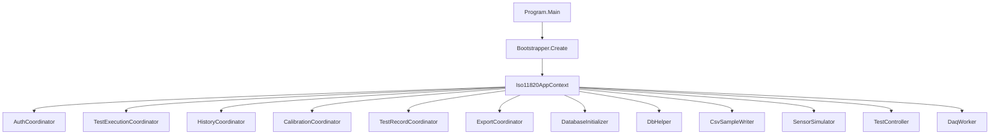
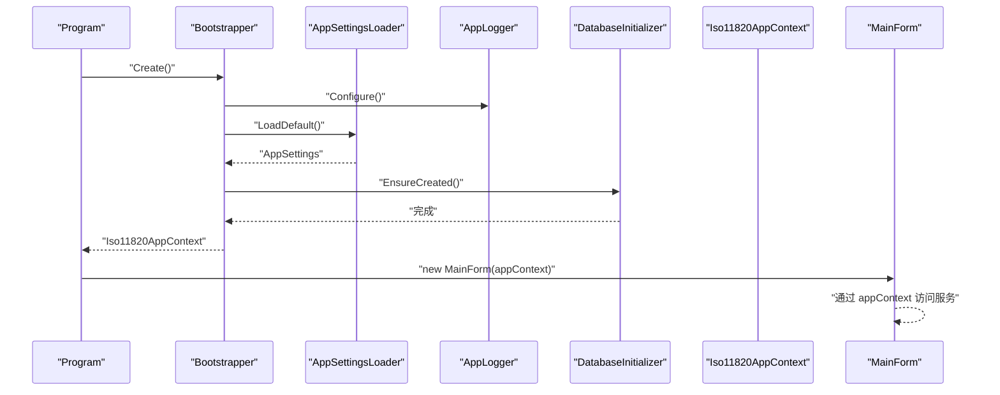
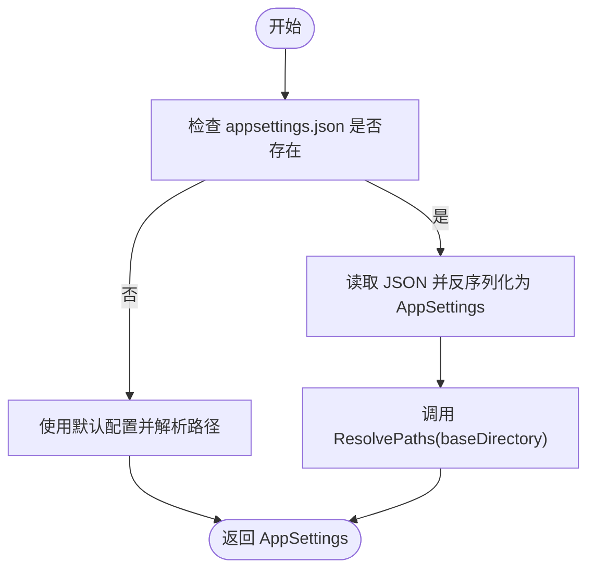
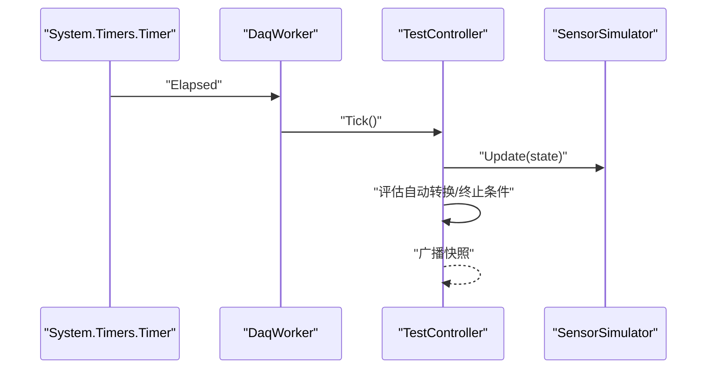
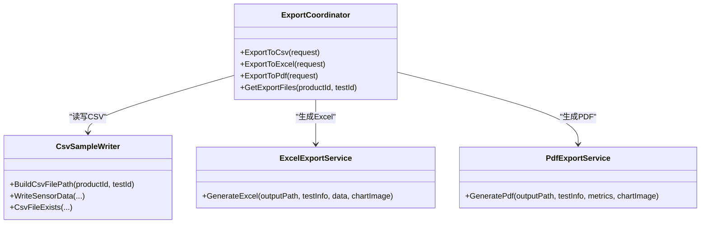
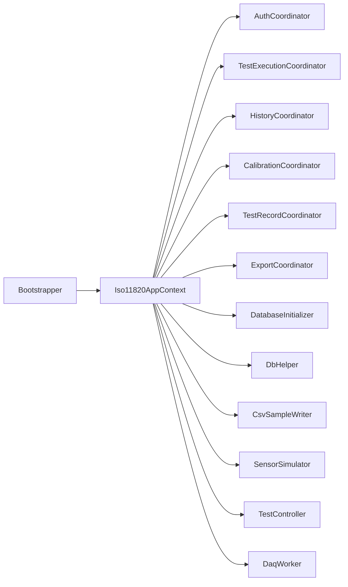

# 依赖注入容器

<cite>
**本文引用的文件**   
- [Program.cs](file://src/ISO11820.App/Program.cs)
- [Bootstrapper.cs](file://src/ISO11820.App/App/Bootstrapper.cs)
- [Iso11820AppContext.cs](file://src/ISO11820.App/App/Iso11820AppContext.cs)
- [AppSettings.cs](file://src/ISO11820.App/Config/AppSettings.cs)
- [AppLogger.cs](file://src/ISO11820.App/Config/AppLogger.cs)
- [DatabaseInitializer.cs](file://src/ISO11820.App/Infrastructure/Persistence/DatabaseInitializer.cs)
- [CsvSampleWriter.cs](file://src/ISO11820.App/Infrastructure/FileStorage/CsvSampleWriter.cs)
- [TestController.cs](file://src/ISO11820.App/Runtime/Controller/TestController.cs)
- [SensorSimulator.cs](file://src/ISO11820.App/Runtime/Services/SensorSimulator.cs)
- [DaqWorker.cs](file://src/ISO11820.App/Runtime/Services/DaqWorker.cs)
- [AuthCoordinator.cs](file://src/ISO11820.App/Features/Auth/AuthCoordinator.cs)
- [ExportCoordinator.cs](file://src/ISO11820.App/Features/Export/ExportCoordinator.cs)
- [ExcelExportService.cs](file://src/ISO11820.App/Features/Export/ExcelExportService.cs)
- [PdfExportService.cs](file://src/ISO11820.App/Features/Export/PdfExportService.cs)
</cite>

## 目录
1. [简介](#简介)
2. [项目结构](#项目结构)
3. [核心组件](#核心组件)
4. [架构总览](#架构总览)
5. [详细组件分析](#详细组件分析)
6. [依赖关系分析](#依赖关系分析)
7. [性能考虑](#性能考虑)
8. [故障排查指南](#故障排查指南)
9. [结论](#结论)
10. [附录](#附录)

## 简介
本文件为 ISO 11820 系统的“依赖注入容器”文档。系统采用轻量级、显式构造的“应用上下文”模式，由启动引导器负责服务注册、配置加载与初始化流程编排；应用上下文作为运行时服务容器，向 UI 层暴露所需能力。文档将深入解析 Bootstrapper 的设计模式与实现原理、Iso11820AppContext 的职责边界与服务生命周期管理策略（单例、瞬态、工厂）、配置驱动依赖解析机制（基于 appsettings.json 的映射）、横切关注点（日志、数据库连接、文件存储）的注入方式，以及扩展与自定义服务的指导与最佳实践。

## 项目结构
- 启动入口 Program 调用 Bootstrapper.Create 构建应用上下文，随后运行主窗体并传入上下文。
- Bootstrapper 负责：
  - 初始化全局日志
  - 加载配置（appsettings.json）
  - 创建基础设施服务（数据库、文件存储、仿真器）
  - 创建业务协调器（认证、测试执行、历史、校准、记录、导出）
  - 确保数据库初始化完成
  - 组装 Iso11820AppContext 返回
- Iso11820AppContext 以只读属性形式暴露所有已创建的服务实例，供 UI 层消费。

图表来源
- [Program.cs:10-23](file://src/ISO11820.App/Program.cs#L10-L23)
- [Bootstrapper.cs:19-64](file://src/ISO11820.App/App/Bootstrapper.cs#L19-L64)
- [Iso11820AppContext.cs:15-68](file://src/ISO11820.App/App/Iso11820AppContext.cs#L15-L68)

章节来源
- [Program.cs:10-23](file://src/ISO11820.App/Program.cs#L10-L23)
- [Bootstrapper.cs:19-64](file://src/ISO11820.App/App/Bootstrapper.cs#L19-L64)
- [Iso11820AppContext.cs:15-68](file://src/ISO11820.App/App/Iso11820AppContext.cs#L15-L68)

## 核心组件
- Bootstrapper：应用启动引导器，集中完成横切关注点初始化、配置加载、服务装配与数据库初始化，最终返回应用上下文。
- Iso11820AppContext：应用上下文，作为“服务容器”，以只读属性暴露各服务实例，避免在 UI 层直接 new 对象，降低耦合。
- AppSettings：配置模型与路径解析，支持从 appsettings.json 反序列化并按基目录解析绝对路径。
- AppLogger：全局日志初始化与关闭刷新，使用 Serilog 按日滚动输出到 Logs 目录。
- DatabaseInitializer：确保 SQLite 数据库存在、建表与种子数据填充。
- CsvSampleWriter：CSV 样本写入与路径组织。
- TestController：试验状态机与数据广播中心。
- SensorSimulator：温度仿真与漂移计算。
- DaqWorker：定时轮询触发控制器 Tick。
- 功能协调器：AuthCoordinator、ExportCoordinator 等，封装领域工作流。

章节来源
- [Bootstrapper.cs:19-64](file://src/ISO11820.App/App/Bootstrapper.cs#L19-L64)
- [Iso11820AppContext.cs:15-68](file://src/ISO11820.App/App/Iso11820AppContext.cs#L15-L68)
- [AppSettings.cs:125-143](file://src/ISO11820.App/Config/AppSettings.cs#L125-L143)
- [AppLogger.cs:10-25](file://src/ISO11820.App/Config/AppLogger.cs#L10-L25)
- [DatabaseInitializer.cs:16-21](file://src/ISO11820.App/Infrastructure/Persistence/DatabaseInitializer.cs#L16-L21)
- [CsvSampleWriter.cs:12-23](file://src/ISO11820.App/Infrastructure/FileStorage/CsvSampleWriter.cs#L12-L23)
- [TestController.cs:11-28](file://src/ISO11820.App/Runtime/Controller/TestController.cs#L11-L28)
- [SensorSimulator.cs:28-35](file://src/ISO11820.App/Runtime/Services/SensorSimulator.cs#L28-L35)
- [DaqWorker.cs:13-19](file://src/ISO11820.App/Runtime/Services/DaqWorker.cs#L13-L19)
- [AuthCoordinator.cs:11-18](file://src/ISO11820.App/Features/Auth/AuthCoordinator.cs#L11-L18)
- [ExportCoordinator.cs:6-22](file://src/ISO11820.App/Features/Export/ExportCoordinator.cs#L6-L22)

## 架构总览
下图展示了从程序启动到 UI 运行的关键流程，以及应用上下文如何承载并分发服务。

图表来源
- [Program.cs:14-22](file://src/ISO11820.App/Program.cs#L14-L22)
- [Bootstrapper.cs:21-49](file://src/ISO11820.App/App/Bootstrapper.cs#L21-L49)
- [AppSettings.cs:125-143](file://src/ISO11820.App/Config/AppSettings.cs#L125-L143)
- [DatabaseInitializer.cs:16-21](file://src/ISO11820.App/Infrastructure/Persistence/DatabaseInitializer.cs#L16-L21)

## 详细组件分析

### Bootstrapper 设计模式与实现原理
- 设计模式
  - 组合根（Composition Root）：集中装配所有服务，明确依赖关系。
  - 显式依赖注入：通过构造函数参数传递依赖，避免隐式全局查找。
  - 应用上下文（Application Context）：将已装配的服务聚合到一个只读容器中，简化上层消费。
- 实现要点
  - 先初始化横切关注点（日志、许可证），再加载配置。
  - 根据配置创建基础设施服务（数据库、文件存储、仿真器）。
  - 创建业务协调器，并将它们与基础设施进行装配。
  - 执行一次性初始化（数据库建库建表与种子数据）。
  - 返回包含所有服务的 Iso11820AppContext。

章节来源
- [Bootstrapper.cs:19-64](file://src/ISO11820.App/App/Bootstrapper.cs#L19-L64)

### Iso11820AppContext 作为服务容器的作用与设计考虑
- 作用
  - 统一暴露服务：UI 层仅依赖该上下文，无需感知具体类型与构造细节。
  - 生命周期控制：所有服务在引导阶段创建并持有，形成应用级单例。
  - 可测试性：可通过替换上下文或其中的协作者进行测试。
- 设计考虑
  - 只读暴露：减少外部随意修改内部状态的风险。
  - 扁平化暴露：当前以属性形式提供，便于快速定位与使用。
  - 可扩展性：新增服务时只需在引导器中创建并在上下文中暴露。

章节来源
- [Iso11820AppContext.cs:15-68](file://src/ISO11820.App/App/Iso11820AppContext.cs#L15-L68)

### 服务生命周期管理
- 单例（应用级）
  - 适用场景：需要跨多个功能共享的状态或资源，如数据库连接包装、文件存储、仿真器、控制器、定时器、各类协调器。
  - 在本系统中，Bootstrapper 在启动时创建这些实例并通过 Iso11820AppContext 暴露，整个应用运行期间复用同一实例。
- 瞬态（按需创建）
  - 适用场景：无状态、轻量、短生命周期的对象。
  - 当前代码中未显式体现“每次请求新建”的模式，但可在需要时于协调器内局部 new 或使用简单工厂。
- 服务工厂
  - 适用场景：复杂构造、带可选依赖或需延迟创建的对象。
  - 建议：对需要动态选择实现或带参数的服务，提供工厂方法或接口抽象，由 Bootstrapper 注册并提供获取方法。

章节来源
- [Bootstrapper.cs:31-63](file://src/ISO11820.App/App/Bootstrapper.cs#L31-L63)
- [Iso11820AppContext.cs:31-67](file://src/ISO11820.App/App/Iso11820AppContext.cs#L31-L67)

### 配置驱动的依赖解析机制（AppSettings）
- 配置加载
  - 从应用基目录读取 appsettings.json，若不存在则回退默认值。
  - 反序列化后调用 ResolvePaths 将相对路径解析为绝对路径。
- 配置项映射
  - Database.SqlitePath：SQLite 数据库文件路径。
  - FileStorage.BaseDirectory / TestDataDirectory：文件存储根目录与样本目录。
  - Output.BaseDirectory：输出目录。
  - Report.OutputDirectory / EnablePdfExport：报告输出与开关。
  - Simulation.*：仿真参数（起始温度、升温速率、目标温度、稳定阈值、波动幅度）。
  - Hardware.*：硬件相关常量。
- 路径解析
  - 若配置为绝对路径则直接使用，否则拼接应用基目录并规范化为绝对路径。

图表来源
- [AppSettings.cs:125-143](file://src/ISO11820.App/Config/AppSettings.cs#L125-L143)
- [AppSettings.cs:19-37](file://src/ISO11820.App/Config/AppSettings.cs#L19-L37)
- [AppSettings.cs:146-158](file://src/ISO11820.App/Config/AppSettings.cs#L146-L158)

章节来源
- [AppSettings.cs:125-143](file://src/ISO11820.App/Config/AppSettings.cs#L125-L143)
- [AppSettings.cs:19-37](file://src/ISO11820.App/Config/AppSettings.cs#L19-L37)
- [AppSettings.cs:146-158](file://src/ISO11820.App/Config/AppSettings.cs#L146-L158)

### 横切关注点的注入方式
- 日志（Serilog）
  - 在引导阶段初始化全局日志，按日滚动输出到 Logs 目录，应用退出时关闭并刷新。
- 数据库连接（SQLite）
  - 通过 DbHelper 封装连接创建，DatabaseInitializer 负责建库建表与种子数据。
- 文件存储
  - CsvSampleWriter 基于配置中的 BaseDirectory 与 TestDataDirectory 组织文件路径，负责写入传感器数据 CSV。

章节来源
- [AppLogger.cs:10-25](file://src/ISO11820.App/Config/AppLogger.cs#L10-L25)
- [AppLogger.cs:27-30](file://src/ISO11820.App/Config/AppLogger.cs#L27-L30)
- [DatabaseInitializer.cs:16-21](file://src/ISO11820.App/Infrastructure/Persistence/DatabaseInitializer.cs#L16-L21)
- [CsvSampleWriter.cs:12-23](file://src/ISO11820.App/Infrastructure/FileStorage/CsvSampleWriter.cs#L12-L23)

### 运行时控制流（Tick 驱动）

图表来源
- [DaqWorker.cs:45-48](file://src/ISO11820.App/Runtime/Services/DaqWorker.cs#L45-L48)
- [TestController.cs:171-204](file://src/ISO11820.App/Runtime/Controller/TestController.cs#L171-L204)
- [SensorSimulator.cs:46-79](file://src/ISO11820.App/Runtime/Services/SensorSimulator.cs#L46-L79)

章节来源
- [DaqWorker.cs:13-19](file://src/ISO11820.App/Runtime/Services/DaqWorker.cs#L13-L19)
- [TestController.cs:171-204](file://src/ISO11820.App/Runtime/Controller/TestController.cs#L171-L204)
- [SensorSimulator.cs:46-79](file://src/ISO11820.App/Runtime/Services/SensorSimulator.cs#L46-L79)

### 导出子系统协作

图表来源
- [ExportCoordinator.cs:6-22](file://src/ISO11820.App/Features/Export/ExportCoordinator.cs#L6-L22)
- [CsvSampleWriter.cs:12-23](file://src/ISO11820.App/Infrastructure/FileStorage/CsvSampleWriter.cs#L12-L23)
- [ExcelExportService.cs:23-60](file://src/ISO11820.App/Features/Export/ExcelExportService.cs#L23-L60)
- [PdfExportService.cs:8-35](file://src/ISO11820.App/Features/Export/PdfExportService.cs#L8-L35)

章节来源
- [ExportCoordinator.cs:24-149](file://src/ISO11820.App/Features/Export/ExportCoordinator.cs#L24-L149)
- [ExcelExportService.cs:28-60](file://src/ISO11820.App/Features/Export/ExcelExportService.cs#L28-L60)
- [PdfExportService.cs:10-35](file://src/ISO11820.App/Features/Export/PdfExportService.cs#L10-L35)

## 依赖关系分析
- 组件耦合
  - Bootstrapper 强耦合于具体实现类，属于组合根的正常现象。
  - Iso11820AppContext 作为聚合点，向上游屏蔽具体依赖细节。
  - 功能协调器通过构造函数注入基础设施（如 DbHelper、CsvSampleWriter），保持职责清晰。
- 外部依赖
  - Serilog：日志
  - Microsoft.Data.Sqlite：数据库
  - EPPlus：Excel 导出
  - MigraDoc/PdfSharp：PDF 导出
  - MathNet.Numerics：线性回归（温漂计算）
- 潜在循环依赖
  - 当前未发现循环引用；协调器之间相互独立，均依赖基础设施而非彼此。

图表来源
- [Bootstrapper.cs:31-63](file://src/ISO11820.App/App/Bootstrapper.cs#L31-L63)
- [Iso11820AppContext.cs:31-67](file://src/ISO11820.App/App/Iso11820AppContext.cs#L31-L67)

章节来源
- [Bootstrapper.cs:31-63](file://src/ISO11820.App/App/Bootstrapper.cs#L31-L63)
- [Iso11820AppContext.cs:31-67](file://src/ISO11820.App/App/Iso11820AppContext.cs#L31-L67)

## 性能考虑
- 日志 I/O
  - 使用滚动日志与大小限制，避免磁盘占用过大；注意在高并发写入时的锁开销。
- 数据库访问
  - 使用 using 语句确保连接及时释放；批量操作尽量合并以减少连接次数。
- 文件 I/O
  - CSV 写入采用顺序追加，避免频繁打开关闭；大文件导出时考虑分块写入。
- 仿真与计算
  - 温漂计算使用滑动窗口与线性回归，注意窗口大小与计算频率的平衡。
- 定时器
  - 800ms 周期 Tick 不宜过短，避免 UI 线程阻塞；必要时将重计算移至后台线程。

[本节为通用性能建议，不直接分析具体文件]

## 故障排查指南
- 日志问题
  - 确认 Logs 目录是否创建成功；检查文件大小限制与保留数量设置。
- 配置问题
  - 检查 appsettings.json 是否存在且格式正确；确认路径是否为绝对路径或可被解析为绝对路径。
- 数据库问题
  - 确认 SQLite 文件路径有效；查看 DatabaseInitializer 是否成功执行建表与种子数据。
- 文件导出问题
  - 检查 CSV 文件是否存在；确认输出目录权限；核对 Excel/PDF 生成过程中的临时文件清理逻辑。

章节来源
- [AppLogger.cs:10-25](file://src/ISO11820.App/Config/AppLogger.cs#L10-L25)
- [AppSettings.cs:125-143](file://src/ISO11820.App/Config/AppSettings.cs#L125-L143)
- [DatabaseInitializer.cs:16-21](file://src/ISO11820.App/Infrastructure/Persistence/DatabaseInitializer.cs#L16-L21)
- [ExportCoordinator.cs:24-149](file://src/ISO11820.App/Features/Export/ExportCoordinator.cs#L24-L149)

## 结论
本系统采用显式依赖注入与组合根模式，配合应用上下文作为轻量级服务容器，实现了清晰的装配流程与良好的可维护性。配置驱动的路径解析与横切关注点（日志、数据库、文件存储）的集中初始化，使得系统具备较强的可移植性与可测试性。未来如需引入更复杂的生命周期管理与面向接口的解耦，可在现有基础上演进为基于接口的容器化方案。

[本节为总结性内容，不直接分析具体文件]

## 附录

### 服务扩展与自定义服务指导
- 新增服务步骤
  - 定义服务接口（可选，推荐面向接口编程）。
  - 在 Bootstrapper 中创建实例并注入到需要的协调器或控制器。
  - 在 Iso11820AppContext 中暴露新服务属性，以便 UI 层访问。
- 工厂模式示例
  - 对于需要动态参数或延迟创建的服务，提供工厂方法或接口，由 Bootstrapper 注册并对外暴露获取方法。
- 配置扩展
  - 在 AppSettings 中添加新的配置段，并在 LoadDefault 与 ResolvePaths 中处理默认值与路径解析。

章节来源
- [Bootstrapper.cs:31-63](file://src/ISO11820.App/App/Bootstrapper.cs#L31-L63)
- [Iso11820AppContext.cs:31-67](file://src/ISO11820.App/App/Iso11820AppContext.cs#L31-L67)
- [AppSettings.cs:125-143](file://src/ISO11820.App/Config/AppSettings.cs#L125-L143)

### 依赖注入最佳实践与常见陷阱
- 最佳实践
  - 显式依赖注入优先，避免隐式全局查找。
  - 单一职责：每个服务只做一件事，通过协调器组合复杂流程。
  - 面向接口：便于替换实现与单元测试。
  - 生命周期清晰：区分单例、瞬态与工厂的使用场景。
- 常见陷阱
  - 过度耦合：在协调器中直接 new 第三方对象，导致难以替换与测试。
  - 生命周期误用：将应瞬态的对象设为单例，造成状态污染。
  - 配置错误：路径未解析为绝对路径导致找不到文件或数据库。
  - 资源未释放：数据库连接、文件句柄未正确释放导致资源泄漏。

章节来源
- [Bootstrapper.cs:31-63](file://src/ISO11820.App/App/Bootstrapper.cs#L31-L63)
- [AppSettings.cs:146-158](file://src/ISO11820.App/Config/AppSettings.cs#L146-L158)