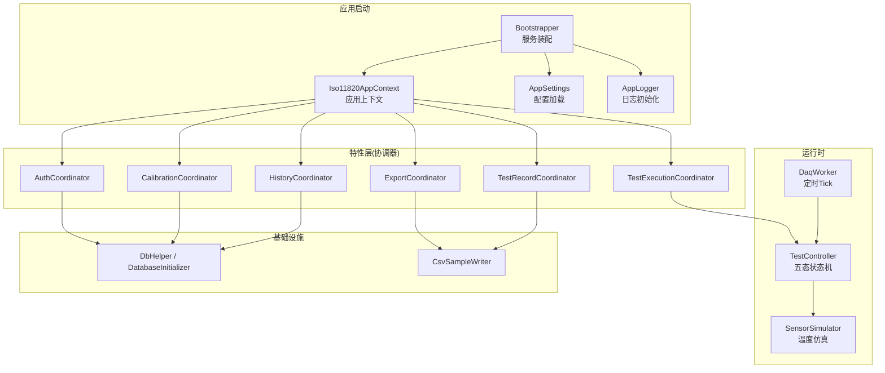
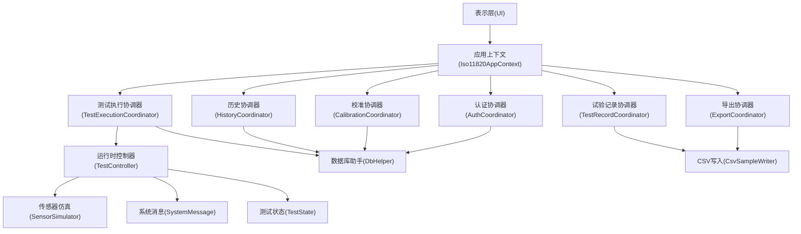
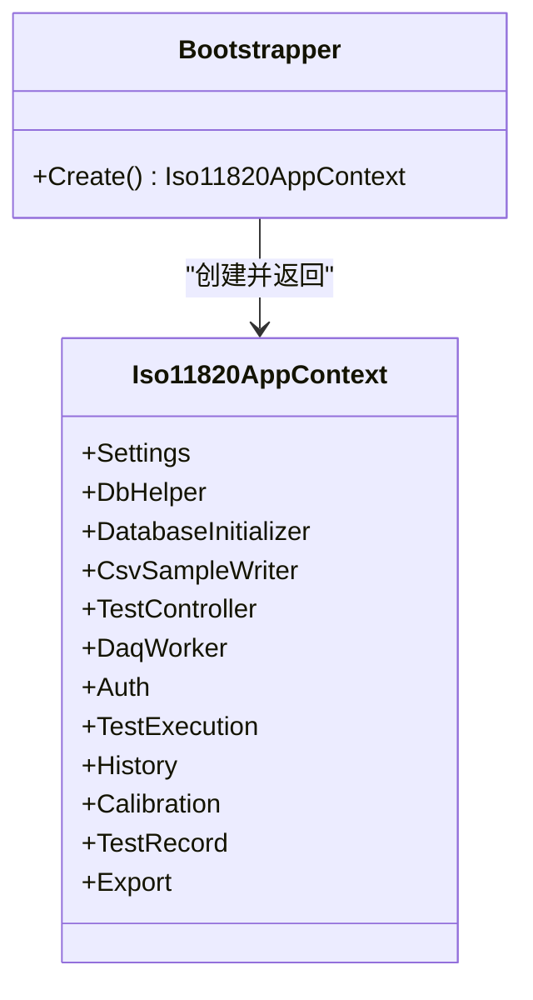
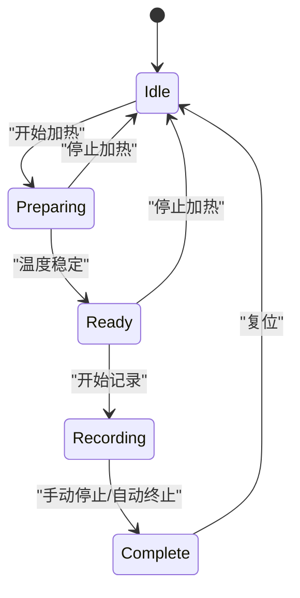
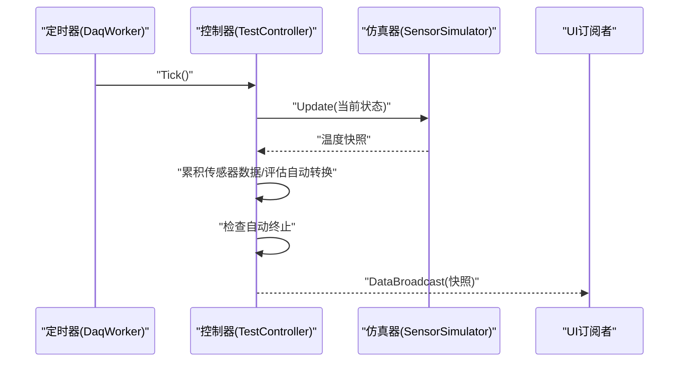
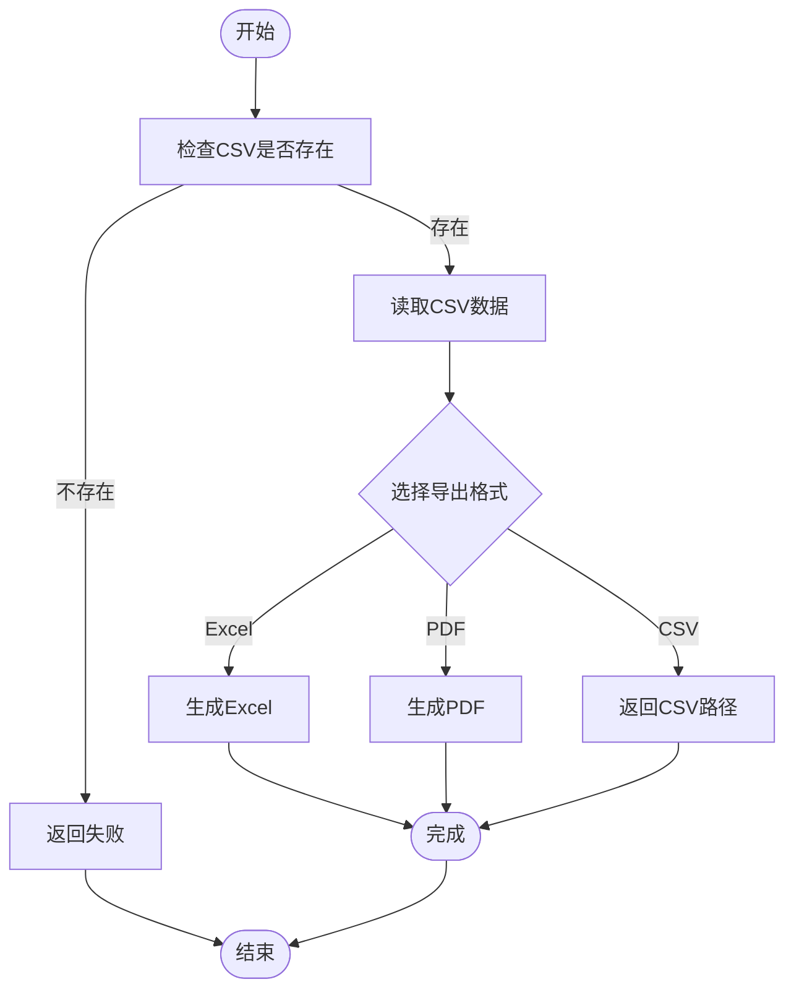
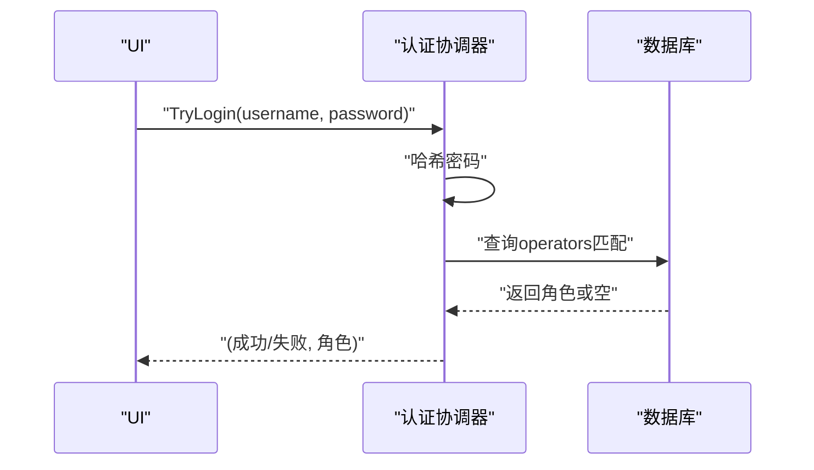
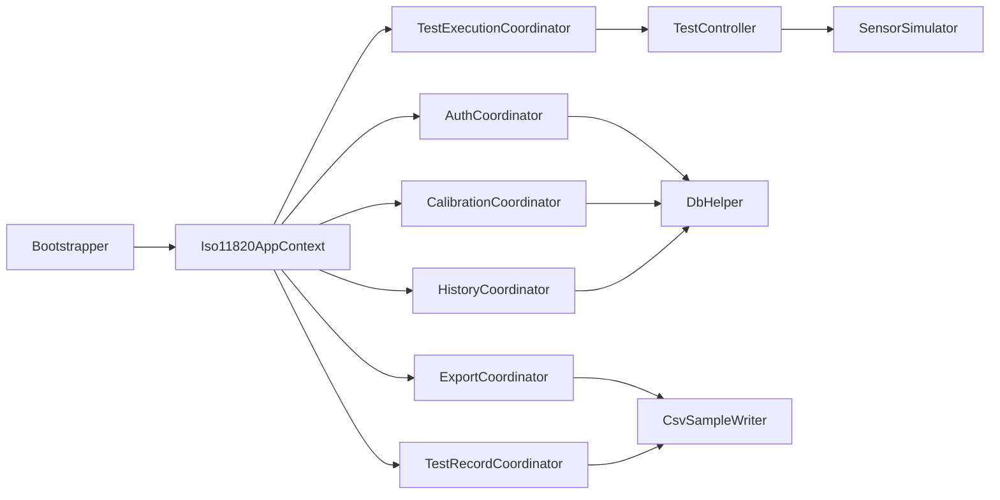

# 整体架构模式

<cite>
**本文引用的文件**   
- [Bootstrapper.cs](file://src/ISO11820.App/App/Bootstrapper.cs)
- [Iso11820AppContext.cs](file://src/ISO11820.App/App/Iso11820AppContext.cs)
- [AppSettings.cs](file://src/ISO11820.App/Config/AppSettings.cs)
- [AppLogger.cs](file://src/ISO11820.App/Config/AppLogger.cs)
- [AuthCoordinator.cs](file://src/ISO11820.App/Features/Auth/AuthCoordinator.cs)
- [TestExecutionCoordinator.cs](file://src/ISO11820.App/Features/TestExecution/TestExecutionCoordinator.cs)
- [CalibrationCoordinator.cs](file://src/ISO11820.App/Features/Calibration/CalibrationCoordinator.cs)
- [HistoryCoordinator.cs](file://src/ISO11820.App/Features/History/HistoryCoordinator.cs)
- [TestRecordCoordinator.cs](file://src/ISO11820.App/Features/TestRecord/TestRecordCoordinator.cs)
- [ExportCoordinator.cs](file://src/ISO11820.App/Features/Export/ExportCoordinator.cs)
- [TestController.cs](file://src/ISO11820.App/Runtime/Controller/TestController.cs)
- [DaqWorker.cs](file://src/ISO11820.App/Runtime/Services/DaqWorker.cs)
- [SensorSimulator.cs](file://src/ISO11820.App/Runtime/Services/SensorSimulator.cs)
- [DbHelper.cs](file://src/ISO11820.App/Infrastructure/Persistence/DbHelper.cs)
- [DatabaseInitializer.cs](file://src/ISO11820.App/Infrastructure/Persistence/DatabaseInitializer.cs)
- [CsvSampleWriter.cs](file://src/ISO11820.App/Infrastructure/FileStorage/CsvSampleWriter.cs)
- [SystemMessage.cs](file://src/ISO11820.Core/Models/SystemMessage.cs)
- [TestState.cs](file://src/ISO11820.Core/Enums/TestState.cs)
</cite>

## 目录
1. [引言](#引言)
2. [项目结构](#项目结构)
3. [核心组件](#核心组件)
4. [架构总览](#架构总览)
5. [详细组件分析](#详细组件分析)
6. [依赖关系分析](#依赖关系分析)
7. [性能考量](#性能考量)
8. [故障排查指南](#故障排查指南)
9. [结论](#结论)
10. [附录](#附录)

## 引言
本文件为 ISO 11820 系统提供“整体架构模式”文档，面向开发者与实施人员，系统化阐述分层架构（表示层、业务逻辑层、数据访问层）的实现与职责边界；解释依赖注入容器的设计原理与实现细节（服务注册、生命周期管理、解析机制）；说明协调器模式的运用场景与设计优势；详解五态状态机的设计与转换规则；并通过系统上下文图与组件分解图展示模块依赖与数据流向。

## 项目结构
本项目采用按功能域与层次划分的组织方式：
- 应用启动与装配：负责配置加载、日志初始化、基础设施创建、各协调器与服务组装，并暴露统一的应用上下文。
- 领域特性（Features）：以协调器为中心编排业务流程，如认证、测试执行、校准、历史记录、试验记录、导出等。
- 运行时控制：包含实时控制器、数据采集调度器与传感器仿真器，驱动温度曲线与状态机演进。
- 基础设施：数据库连接与初始化、CSV 文件存储等通用能力。
- 核心模型与枚举：跨层共享的轻量类型定义（如测试状态、系统消息）。

图表来源
- [Bootstrapper.cs:17-66](file://src/ISO11820.App/App/Bootstrapper.cs#L17-L66)
- [Iso11820AppContext.cs:15-69](file://src/ISO11820.App/App/Iso11820AppContext.cs#L15-L69)
- [AppSettings.cs:125-144](file://src/ISO11820.App/Config/AppSettings.cs#L125-L144)
- [AppLogger.cs:10-25](file://src/ISO11820.App/Config/AppLogger.cs#L10-L25)
- [AuthCoordinator.cs:11-62](file://src/ISO11820.App/Features/Auth/AuthCoordinator.cs#L11-L62)
- [TestExecutionCoordinator.cs:12-80](file://src/ISO11820.App/Features/TestExecution/TestExecutionCoordinator.cs#L12-L80)
- [CalibrationCoordinator.cs:7-91](file://src/ISO11820.App/Features/Calibration/CalibrationCoordinator.cs#L7-L91)
- [HistoryCoordinator.cs:8-241](file://src/ISO11820.App/Features/History/HistoryCoordinator.cs#L8-L241)
- [TestRecordCoordinator.cs:6-159](file://src/ISO11820.App/Features/TestRecord/TestRecordCoordinator.cs#L6-L159)
- [ExportCoordinator.cs:6-229](file://src/ISO11820.App/Features/Export/ExportCoordinator.cs#L6-L229)
- [TestController.cs:11-328](file://src/ISO11820.App/Runtime/Controller/TestController.cs#L11-L328)
- [DaqWorker.cs:6-50](file://src/ISO11820.App/Runtime/Services/DaqWorker.cs#L6-L50)
- [SensorSimulator.cs:8-223](file://src/ISO11820.App/Runtime/Services/SensorSimulator.cs#L8-L223)
- [DbHelper.cs:5-22](file://src/ISO11820.App/Infrastructure/Persistence/DbHelper.cs#L5-L22)
- [DatabaseInitializer.cs:7-198](file://src/ISO11820.App/Infrastructure/Persistence/DatabaseInitializer.cs#L7-L198)
- [CsvSampleWriter.cs:6-81](file://src/ISO11820.App/Infrastructure/FileStorage/CsvSampleWriter.cs#L6-L81)

章节来源
- [Bootstrapper.cs:17-66](file://src/ISO11820.App/App/Bootstrapper.cs#L17-L66)
- [Iso11820AppContext.cs:15-69](file://src/ISO11820.App/App/Iso11820AppContext.cs#L15-L69)
- [AppSettings.cs:125-144](file://src/ISO11820.App/Config/AppSettings.cs#L125-L144)
- [AppLogger.cs:10-25](file://src/ISO11820.App/Config/AppLogger.cs#L10-L25)

## 核心组件
- 应用上下文与装配器
  - Bootstrapper 负责全局初始化（日志、许可证、配置）、基础设施构建（数据库、文件存储、仿真器、控制器）、特性协调器实例化，并将它们集中注入到 Iso11820AppContext 中对外暴露。
  - Iso11820AppContext 作为“微型容器”，聚合所有关键服务，供 UI 或上层流程按需获取。
- 配置与日志
  - AppSettings 从 appsettings.json 加载并按基目录解析绝对路径，提供数据库、仿真、输出、报告、硬件等配置项。
  - AppLogger 使用 Serilog 初始化文件滚动日志。
- 运行时控制
  - TestController 维护五态状态机，响应用户操作与定时器 Tick，驱动 SensorSimulator 更新温度与稳定度，计算温漂与自动终止条件，并通过事件广播当前快照。
  - DaqWorker 基于 System.Timers.Timer 每 800ms 触发一次 Tick，保证稳定的采样节拍。
  - SensorSimulator 模拟炉温、表面温、中心温等通道，支持升温、稳定、记录阶段的不同动力学，并提供 PID 输出近似值与线性回归温漂计算。
- 数据访问与持久化
  - DbHelper 封装 SQLite 连接字符串与连接创建。
  - DatabaseInitializer 负责建表与种子数据（操作员、设备、传感器），并提供登录校验辅助。
- 特性协调器
  - AuthCoordinator：用户名+密码哈希比对，返回角色。
  - TestExecutionCoordinator：准备新测试、保存试验与产品信息到数据库。
  - CalibrationCoordinator：校准记录的增删改查。
  - HistoryCoordinator：历史查询与 Excel 导出。
  - TestRecordCoordinator：试验记录录入、去重、校验与保存状态管理。
  - ExportCoordinator：CSV/Excel/PDF 导出编排，读取 CSV 并调用相应导出服务。

章节来源
- [Bootstrapper.cs:17-66](file://src/ISO11820.App/App/Bootstrapper.cs#L17-L66)
- [Iso11820AppContext.cs:15-69](file://src/ISO11820.App/App/Iso11820AppContext.cs#L15-L69)
- [AppSettings.cs:125-144](file://src/ISO11820.App/Config/AppSettings.cs#L125-L144)
- [AppLogger.cs:10-25](file://src/ISO11820.App/Config/AppLogger.cs#L10-L25)
- [TestController.cs:11-328](file://src/ISO11820.App/Runtime/Controller/TestController.cs#L11-L328)
- [DaqWorker.cs:6-50](file://src/ISO11820.App/Runtime/Services/DaqWorker.cs#L6-L50)
- [SensorSimulator.cs:8-223](file://src/ISO11820.App/Runtime/Services/SensorSimulator.cs#L8-L223)
- [DbHelper.cs:5-22](file://src/ISO11820.App/Infrastructure/Persistence/DbHelper.cs#L5-L22)
- [DatabaseInitializer.cs:7-198](file://src/ISO11820.App/Infrastructure/Persistence/DatabaseInitializer.cs#L7-L198)
- [AuthCoordinator.cs:11-62](file://src/ISO11820.App/Features/Auth/AuthCoordinator.cs#L11-L62)
- [TestExecutionCoordinator.cs:12-80](file://src/ISO11820.App/Features/TestExecution/TestExecutionCoordinator.cs#L12-L80)
- [CalibrationCoordinator.cs:7-91](file://src/ISO11820.App/Features/Calibration/CalibrationCoordinator.cs#L7-L91)
- [HistoryCoordinator.cs:8-241](file://src/ISO11820.App/Features/History/HistoryCoordinator.cs#L8-L241)
- [TestRecordCoordinator.cs:6-159](file://src/ISO11820.App/Features/TestRecord/TestRecordCoordinator.cs#L6-L159)
- [ExportCoordinator.cs:6-229](file://src/ISO11820.App/Features/Export/ExportCoordinator.cs#L6-L229)

## 架构总览
系统采用“应用装配 + 协调器编排 + 运行时控制 + 基础设施支撑”的分层架构：
- 表示层（UI）通过应用上下文获取协调器与服务，发起业务请求。
- 业务逻辑层由各类 Coordinator 组成，负责用例编排、事务边界与错误处理。
- 数据访问层由 DbHelper/DatabaseInitializer 与 CsvSampleWriter 提供，屏蔽底层存储差异。
- 运行时控制层独立于 UI，专注于状态机推进与数据采样。

图表来源
- [Iso11820AppContext.cs:15-69](file://src/ISO11820.App/App/Iso11820AppContext.cs#L15-L69)
- [AuthCoordinator.cs:11-62](file://src/ISO11820.App/Features/Auth/AuthCoordinator.cs#L11-L62)
- [TestExecutionCoordinator.cs:12-80](file://src/ISO11820.App/Features/TestExecution/TestExecutionCoordinator.cs#L12-L80)
- [CalibrationCoordinator.cs:7-91](file://src/ISO11820.App/Features/Calibration/CalibrationCoordinator.cs#L7-L91)
- [HistoryCoordinator.cs:8-241](file://src/ISO11820.App/Features/History/HistoryCoordinator.cs#L8-L241)
- [TestRecordCoordinator.cs:6-159](file://src/ISO11820.App/Features/TestRecord/TestRecordCoordinator.cs#L6-L159)
- [ExportCoordinator.cs:6-229](file://src/ISO11820.App/Features/Export/ExportCoordinator.cs#L6-L229)
- [TestController.cs:11-328](file://src/ISO11820.App/Runtime/Controller/TestController.cs#L11-L328)
- [SensorSimulator.cs:8-223](file://src/ISO11820.App/Runtime/Services/SensorSimulator.cs#L8-L223)
- [DbHelper.cs:5-22](file://src/ISO11820.App/Infrastructure/Persistence/DbHelper.cs#L5-L22)
- [CsvSampleWriter.cs:6-81](file://src/ISO11820.App/Infrastructure/FileStorage/CsvSampleWriter.cs#L6-L81)
- [SystemMessage.cs:1-4](file://src/ISO11820.Core/Models/SystemMessage.cs#L1-L4)
- [TestState.cs:1-11](file://src/ISO11820.Core/Enums/TestState.cs#L1-L11)

## 详细组件分析

### 分层架构与职责
- 表示层（UI）
  - 通过 Iso11820AppContext 获取协调器与服务，进行用户交互与结果呈现。
- 业务逻辑层（协调器）
  - 每个 Feature 一个协调器，负责用例编排、参数校验、异常处理与资源组合。
- 数据访问层
  - DbHelper/DatabaseInitializer 提供 SQL 连接与建库建表、种子数据。
  - CsvSampleWriter 提供 CSV 读写与目录管理。
- 运行时控制层
  - TestController 维护状态机与数据缓冲，发布快照事件。
  - DaqWorker 提供固定频率 Tick，驱动状态机推进。
  - SensorSimulator 提供温度仿真、稳定判定与温漂计算。

章节来源
- [Iso11820AppContext.cs:15-69](file://src/ISO11820.App/App/Iso11820AppContext.cs#L15-L69)
- [DbHelper.cs:5-22](file://src/ISO11820.App/Infrastructure/Persistence/DbHelper.cs#L5-L22)
- [DatabaseInitializer.cs:7-198](file://src/ISO11820.App/Infrastructure/Persistence/DatabaseInitializer.cs#L7-L198)
- [CsvSampleWriter.cs:6-81](file://src/ISO11820.App/Infrastructure/FileStorage/CsvSampleWriter.cs#L6-L81)
- [TestController.cs:11-328](file://src/ISO11820.App/Runtime/Controller/TestController.cs#L11-L328)
- [DaqWorker.cs:6-50](file://src/ISO11820.App/Runtime/Services/DaqWorker.cs#L6-L50)
- [SensorSimulator.cs:8-223](file://src/ISO11820.App/Runtime/Services/SensorSimulator.cs#L8-L223)

### 依赖注入容器设计（应用上下文）
- 设计目标
  - 在桌面应用中避免引入重型 DI 框架，采用“手动装配 + 应用上下文”的轻量方案。
- 服务注册
  - Bootstrapper 中显式构造各服务与协调器，完成依赖注入。
- 生命周期管理
  - 当前为单例式对象（由上下文持有），适合桌面应用的进程级生命周期。
- 解析机制
  - 通过 Iso11820AppContext 的属性直接访问所需服务，简化 UI 层的依赖获取。

图表来源
- [Bootstrapper.cs:17-66](file://src/ISO11820.App/App/Bootstrapper.cs#L17-L66)
- [Iso11820AppContext.cs:15-69](file://src/ISO11820.App/App/Iso11820AppContext.cs#L15-L69)

章节来源
- [Bootstrapper.cs:17-66](file://src/ISO11820.App/App/Bootstrapper.cs#L17-L66)
- [Iso11820AppContext.cs:15-69](file://src/ISO11820.App/App/Iso11820AppContext.cs#L15-L69)

### 协调器模式
- 运用场景
  - 认证、测试执行、校准、历史记录、试验记录、导出等用例均通过协调器编排多个子服务。
- 设计优势
  - 单一入口、职责清晰、易于单元测试与替换实现。
  - 将 UI 与底层实现解耦，便于扩展新的导出格式或数据源。

章节来源
- [AuthCoordinator.cs:11-62](file://src/ISO11820.App/Features/Auth/AuthCoordinator.cs#L11-L62)
- [TestExecutionCoordinator.cs:12-80](file://src/ISO11820.App/Features/TestExecution/TestExecutionCoordinator.cs#L12-L80)
- [CalibrationCoordinator.cs:7-91](file://src/ISO11820.App/Features/Calibration/CalibrationCoordinator.cs#L7-L91)
- [HistoryCoordinator.cs:8-241](file://src/ISO11820.App/Features/History/HistoryCoordinator.cs#L8-L241)
- [TestRecordCoordinator.cs:6-159](file://src/ISO11820.App/Features/TestRecord/TestRecordCoordinator.cs#L6-L159)
- [ExportCoordinator.cs:6-229](file://src/ISO11820.App/Features/Export/ExportCoordinator.cs#L6-L229)

### 五态状态机（TestState）
- 状态定义
  - Idle、Preparing、Ready、Recording、Complete
- 转换规则
  - Idle → Preparing：开始加热
  - Preparing → Ready：温度稳定
  - Ready → Recording：开始记录
  - Recording → Complete：手动停止或达到自动终止条件
  - 任意非 Idle 状态可复位至 Idle
- 自动终止策略
  - 60 分钟无条件结束
  - 30/35/40/45/50/55 分钟检查点，若温漂满足阈值则提前结束

图表来源
- [TestState.cs:1-11](file://src/ISO11820.Core/Enums/TestState.cs#L1-L11)
- [TestController.cs:57-156](file://src/ISO11820.App/Runtime/Controller/TestController.cs#L57-L156)
- [TestController.cs:248-302](file://src/ISO11820.App/Runtime/Controller/TestController.cs#L248-L302)

章节来源
- [TestState.cs:1-11](file://src/ISO11820.Core/Enums/TestState.cs#L1-L11)
- [TestController.cs:57-156](file://src/ISO11820.App/Runtime/Controller/TestController.cs#L57-L156)
- [TestController.cs:248-302](file://src/ISO11820.App/Runtime/Controller/TestController.cs#L248-L302)

### 运行时控制序列（Tick 驱动）

图表来源
- [DaqWorker.cs:45-48](file://src/ISO11820.App/Runtime/Services/DaqWorker.cs#L45-L48)
- [TestController.cs:171-204](file://src/ISO11820.App/Runtime/Controller/TestController.cs#L171-L204)
- [SensorSimulator.cs:46-79](file://src/ISO11820.App/Runtime/Services/SensorSimulator.cs#L46-L79)

章节来源
- [DaqWorker.cs:6-50](file://src/ISO11820.App/Runtime/Services/DaqWorker.cs#L6-L50)
- [TestController.cs:171-204](file://src/ISO11820.App/Runtime/Controller/TestController.cs#L171-L204)
- [SensorSimulator.cs:46-79](file://src/ISO11820.App/Runtime/Services/SensorSimulator.cs#L46-L79)

### 导出流程（CSV/Excel/PDF）

图表来源
- [ExportCoordinator.cs:24-119](file://src/ISO11820.App/Features/Export/ExportCoordinator.cs#L24-L119)
- [CsvSampleWriter.cs:41-54](file://src/ISO11820.App/Infrastructure/FileStorage/CsvSampleWriter.cs#L41-L54)

章节来源
- [ExportCoordinator.cs:24-119](file://src/ISO11820.App/Features/Export/ExportCoordinator.cs#L24-L119)
- [CsvSampleWriter.cs:41-54](file://src/ISO11820.App/Infrastructure/FileStorage/CsvSampleWriter.cs#L41-L54)

### 认证流程（用户名+密码）

图表来源
- [AuthCoordinator.cs:26-54](file://src/ISO11820.App/Features/Auth/AuthCoordinator.cs#L26-L54)
- [DatabaseInitializer.cs:178-191](file://src/ISO11820.App/Infrastructure/Persistence/DatabaseInitializer.cs#L178-L191)

章节来源
- [AuthCoordinator.cs:26-54](file://src/ISO11820.App/Features/Auth/AuthCoordinator.cs#L26-L54)
- [DatabaseInitializer.cs:178-191](file://src/ISO11820.App/Infrastructure/Persistence/DatabaseInitializer.cs#L178-L191)

## 依赖关系分析
- 低耦合高内聚
  - 协调器仅依赖必要的接口型服务（DbHelper、CsvSampleWriter、TestController 等），不感知 UI 细节。
- 外部依赖
  - SQLite（Microsoft.Data.Sqlite）、Serilog（日志）、EPPlus（Excel）、MathNet.Numerics（线性回归）。
- 潜在循环依赖
  - 当前未发现循环引用；协调器之间无相互依赖，均通过应用上下文解耦。

图表来源
- [Bootstrapper.cs:17-66](file://src/ISO11820.App/App/Bootstrapper.cs#L17-L66)
- [Iso11820AppContext.cs:15-69](file://src/ISO11820.App/App/Iso11820AppContext.cs#L15-L69)
- [AuthCoordinator.cs:11-62](file://src/ISO11820.App/Features/Auth/AuthCoordinator.cs#L11-L62)
- [TestExecutionCoordinator.cs:12-80](file://src/ISO11820.App/Features/TestExecution/TestExecutionCoordinator.cs#L12-L80)
- [CalibrationCoordinator.cs:7-91](file://src/ISO11820.App/Features/Calibration/CalibrationCoordinator.cs#L7-L91)
- [HistoryCoordinator.cs:8-241](file://src/ISO11820.App/Features/History/HistoryCoordinator.cs#L8-L241)
- [TestRecordCoordinator.cs:6-159](file://src/ISO11820.App/Features/TestRecord/TestRecordCoordinator.cs#L6-L159)
- [ExportCoordinator.cs:6-229](file://src/ISO11820.App/Features/Export/ExportCoordinator.cs#L6-L229)
- [TestController.cs:11-328](file://src/ISO11820.App/Runtime/Controller/TestController.cs#L11-L328)
- [SensorSimulator.cs:8-223](file://src/ISO11820.App/Runtime/Services/SensorSimulator.cs#L8-L223)
- [DbHelper.cs:5-22](file://src/ISO11820.App/Infrastructure/Persistence/DbHelper.cs#L5-L22)
- [CsvSampleWriter.cs:6-81](file://src/ISO11820.App/Infrastructure/FileStorage/CsvSampleWriter.cs#L6-L81)

章节来源
- [Bootstrapper.cs:17-66](file://src/ISO11820.App/App/Bootstrapper.cs#L17-L66)
- [Iso11820AppContext.cs:15-69](file://src/ISO11820.App/App/Iso11820AppContext.cs#L15-L69)

## 性能考量
- 定时器节拍
  - 800ms 的 Tick 平衡了实时性与 CPU 占用，适合桌面端运行。
- 数据缓冲
  - 控制器内部对传感器数据与 PID 输出队列做限长缓存，避免内存增长。
- 温漂计算
  - 使用最近若干样本进行线性回归，复杂度与窗口大小相关，建议保持窗口适中。
- 文件 I/O
  - CSV 写入一次性覆盖，减少频繁追加带来的锁竞争；导出时先检查文件存在性，降低无效 I/O。

[本节为通用指导，无需源码引用]

## 故障排查指南
- 启动问题
  - 检查日志目录是否可写、appsettings.json 是否存在且路径解析正确。
- 数据库问题
  - 确认 SQLite 文件路径与权限；首次启动应自动建表与种子数据。
- 认证失败
  - 核对用户名与密码哈希算法一致性；确保 operators 表已初始化。
- 导出失败
  - 检查对应测试目录下 sensor_data.csv 是否存在；确认 EPPlus 许可证设置。
- 状态机异常
  - 观察 DataBroadcast 快照中的状态与消息；必要时复位至 Idle 重新准备。

章节来源
- [AppLogger.cs:10-25](file://src/ISO11820.App/Config/AppLogger.cs#L10-L25)
- [DatabaseInitializer.cs:16-21](file://src/ISO11820.App/Infrastructure/Persistence/DatabaseInitializer.cs#L16-L21)
- [AuthCoordinator.cs:26-54](file://src/ISO11820.App/Features/Auth/AuthCoordinator.cs#L26-L54)
- [ExportCoordinator.cs:24-119](file://src/ISO11820.App/Features/Export/ExportCoordinator.cs#L24-L119)
- [TestController.cs:145-156](file://src/ISO11820.App/Runtime/Controller/TestController.cs#L145-L156)

## 结论
本系统通过“应用上下文 + 协调器 + 运行时控制 + 基础设施”的分层架构，实现了清晰的职责划分与良好的可扩展性。轻量级的“手动装配”替代重型 DI 框架，既满足桌面应用需求又便于调试与维护。五态状态机与定时器驱动的 Tick 机制保证了实验过程的稳定性与可控性。未来可在保持现有契约的前提下，平滑扩展更多导出格式、数据源与仿真模型。

[本节为总结性内容，无需源码引用]

## 附录
- 术语
  - 协调器：编排用例流程的业务组件。
  - 应用上下文：聚合关键服务的轻量容器。
  - 温漂：单位时间内温度的变化速率，用于判断稳定与终止。
- 参考
  - 配置文件：appsettings.json（由 AppSettingsLoader 加载）
  - 日志：Logs/iso11820-.log（按日滚动）

[本节为补充信息，无需源码引用]