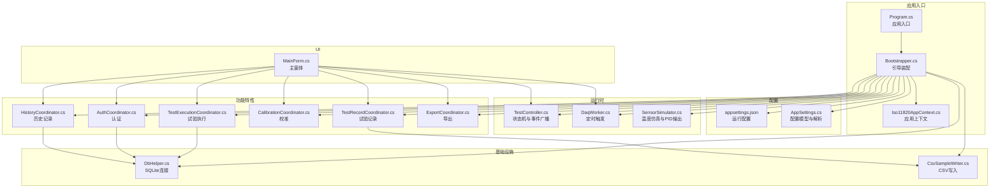
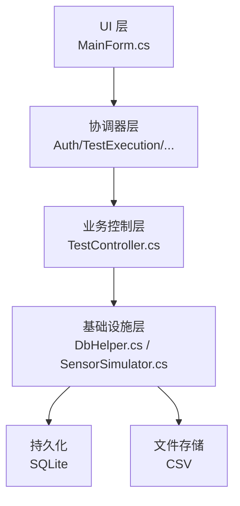
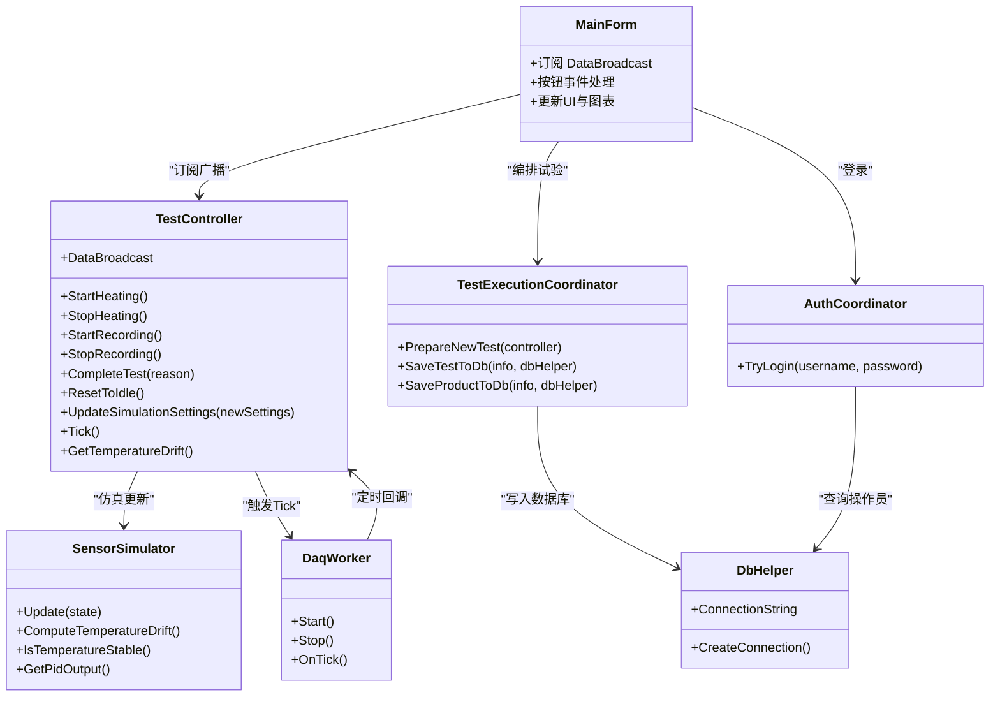
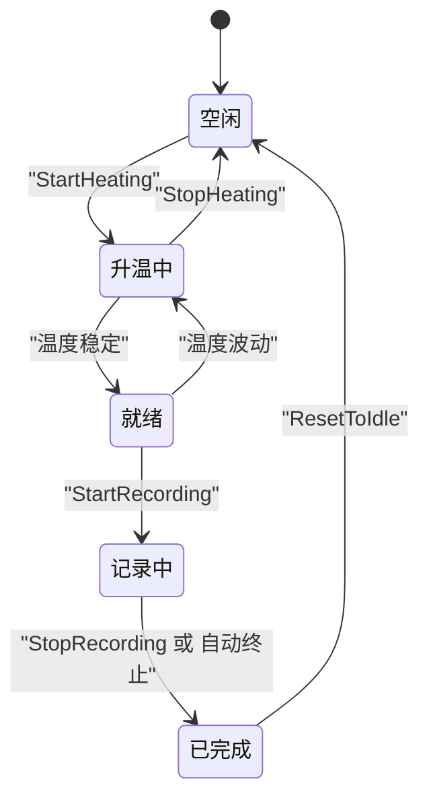
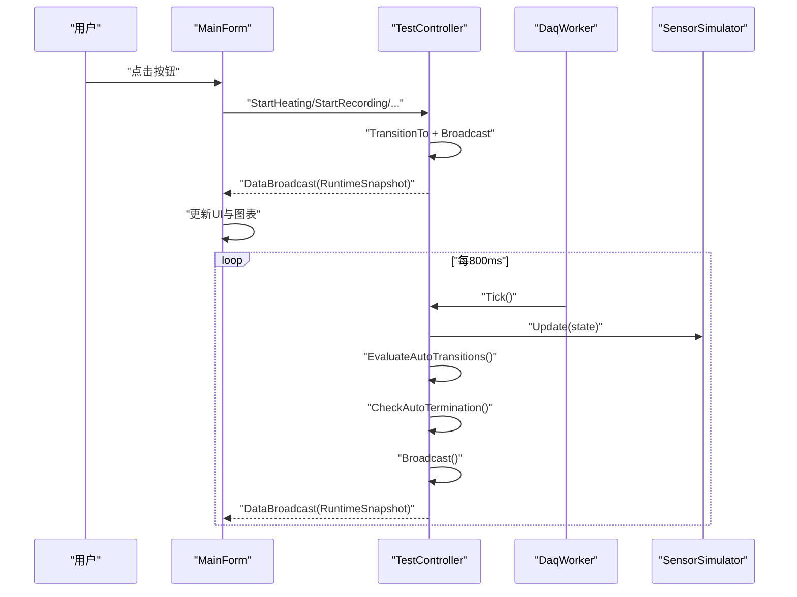
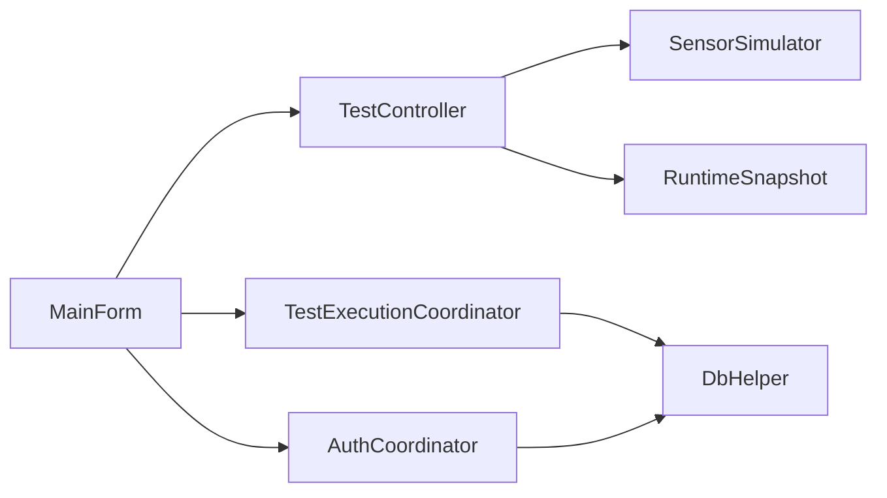
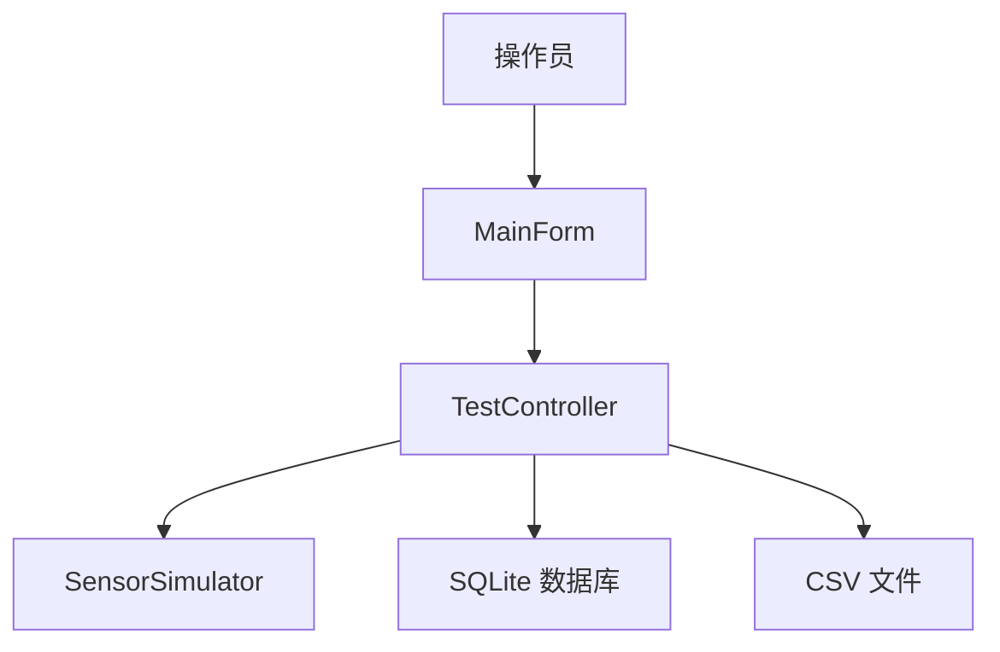

# 架构设计

<cite>
**本文引用的文件**
- [Program.cs](file://src/ISO11820.App/Program.cs)
- [Bootstrapper.cs](file://src/ISO11820.App/App/Bootstrapper.cs)
- [Iso11820AppContext.cs](file://src/ISO11820.App/App/Iso11820AppContext.cs)
- [TestState.cs](file://src/ISO11820.Core/Enums/TestState.cs)
- [appsettings.json](file://src/ISO11820.App/appsettings.json)
- [TestExecutionCoordinator.cs](file://src/ISO11820.App/Features/TestExecution/TestExecutionCoordinator.cs)
- [TestController.cs](file://src/ISO11820.App/Runtime/Controller/TestController.cs)
- [DaqWorker.cs](file://src/ISO11820.App/Runtime/Services/DaqWorker.cs)
- [SensorSimulator.cs](file://src/ISO11820.App/Runtime/Services/SensorSimulator.cs)
- [DbHelper.cs](file://src/ISO11820.App/Infrastructure/Persistence/DbHelper.cs)
- [RuntimeSnapshot.cs](file://src/ISO11820.App/Shared/Models/RuntimeSnapshot.cs)
- [MainForm.cs](file://src/ISO11820.App/UI/Forms/MainForm.cs)
- [AuthCoordinator.cs](file://src/ISO11820.App/Features/Auth/AuthCoordinator.cs)
- [TemperatureSnapshot.cs](file://src/ISO11820.Core/Models/TemperatureSnapshot.cs)
- [SystemMessage.cs](file://src/ISO11820.Core/Models/SystemMessage.cs)
</cite>

## 目录
1. [引言](#引言)
2. [项目结构](#项目结构)
3. [核心组件](#核心组件)
4. [架构总览](#架构总览)
5. [详细组件分析](#详细组件分析)
6. [依赖关系分析](#依赖关系分析)
7. [性能考量](#性能考量)
8. [故障排查指南](#故障排查指南)
9. [结论](#结论)
10. [附录](#附录)

## 引言
本文件为ISO 11820系统的架构设计文档，面向开发与运维人员，系统性阐述高层设计、架构模式、系统边界、分层实现、依赖注入容器与协调器模式、五态状态机设计与实现、组件交互与数据流、技术决策与权衡、基础设施与可扩展性、部署拓扑、横切关注点（安全、监控、灾备）、技术栈与第三方依赖及版本兼容性。

## 项目结构
系统采用WinForms桌面应用，按功能域与职责分层组织：
- 应用入口与引导：Program、Bootstrapper、Iso11820AppContext
- 配置与设置：appsettings.json、AppSettings及其解析器
- 运行时控制与仿真：TestController、DaqWorker、SensorSimulator
- 功能特性与协调器：AuthCoordinator、TestExecutionCoordinator、HistoryCoordinator、CalibrationCoordinator、TestRecordCoordinator、ExportCoordinator
- 基础设施：DbHelper、数据库初始化、文件存储（CSV）
- UI层：MainForm、对话框与图表面板
- 核心模型与枚举：TestState、TemperatureSnapshot、SystemMessage

**图表来源**
- [Program.cs:1-25](file://src/ISO11820.App/Program.cs#L1-L25)
- [Bootstrapper.cs:1-66](file://src/ISO11820.App/App/Bootstrapper.cs#L1-L66)
- [Iso11820AppContext.cs:1-69](file://src/ISO11820.App/App/Iso11820AppContext.cs#L1-L69)
- [appsettings.json:1-29](file://src/ISO11820.App/appsettings.json#L1-L29)
- [TestController.cs:1-328](file://src/ISO11820.App/Runtime/Controller/TestController.cs#L1-L328)
- [DaqWorker.cs:1-50](file://src/ISO11820.App/Runtime/Services/DaqWorker.cs#L1-L50)
- [SensorSimulator.cs:1-223](file://src/ISO11820.App/Runtime/Services/SensorSimulator.cs#L1-L223)
- [DbHelper.cs:1-22](file://src/ISO11820.App/Infrastructure/Persistence/DbHelper.cs#L1-L22)
- [MainForm.cs:1-977](file://src/ISO11820.App/UI/Forms/MainForm.cs#L1-L977)
- [AuthCoordinator.cs:1-62](file://src/ISO11820.App/Features/Auth/AuthCoordinator.cs#L1-L62)
- [TestExecutionCoordinator.cs:1-80](file://src/ISO11820.App/Features/TestExecution/TestExecutionCoordinator.cs#L1-L80)

**章节来源**
- [Program.cs:1-25](file://src/ISO11820.App/Program.cs#L1-L25)
- [Bootstrapper.cs:1-66](file://src/ISO11820.App/App/Bootstrapper.cs#L1-L66)
- [Iso11820AppContext.cs:1-69](file://src/ISO11820.App/App/Iso11820AppContext.cs#L1-L69)
- [appsettings.json:1-29](file://src/ISO11820.App/appsettings.json#L1-L29)

## 核心组件
- 应用上下文与引导
  - Bootstrapper负责装配所有服务、协调器、控制器与基础设施，并返回Iso11820AppContext作为全局依赖容器。
  - Program仅负责初始化UI与启动引导流程。
- 配置系统
  - appsettings.json提供数据库、仿真、输出目录、报告、硬件等配置；AppSettings提供路径解析与合并。
- 运行时控制
  - TestController是核心状态机，封装温度采集、状态转换、自动终止与消息广播。
  - DaqWorker以固定周期驱动TestController.Tick()，实现后台数据推进。
  - SensorSimulator提供温度仿真、温漂计算与PID输出模拟。
- 功能协调器
  - AuthCoordinator：基于SQLite的简单认证。
  - TestExecutionCoordinator：试验准备、试验与产品信息入库。
  - 其他协调器（History、Calibration、TestRecord、Export）在引导中装配，承担各自领域职责。
- 基础设施
  - DbHelper：SQLite连接管理。
  - 文件存储：CSV样本写入。
- UI层
  - MainForm集中展示状态、温度、图表与消息，订阅TestController广播事件，响应用户操作并通过协调器与控制器交互。

**章节来源**
- [Bootstrapper.cs:19-64](file://src/ISO11820.App/App/Bootstrapper.cs#L19-L64)
- [Iso11820AppContext.cs:17-67](file://src/ISO11820.App/App/Iso11820AppContext.cs#L17-L67)
- [appsettings.json:1-29](file://src/ISO11820.App/appsettings.json#L1-L29)
- [TestController.cs:11-328](file://src/ISO11820.App/Runtime/Controller/TestController.cs#L11-L328)
- [DaqWorker.cs:6-50](file://src/ISO11820.App/Runtime/Services/DaqWorker.cs#L6-L50)
- [SensorSimulator.cs:8-223](file://src/ISO11820.App/Runtime/Services/SensorSimulator.cs#L8-L223)
- [DbHelper.cs:5-22](file://src/ISO11820.App/Infrastructure/Persistence/DbHelper.cs#L5-L22)
- [MainForm.cs:22-977](file://src/ISO11820.App/UI/Forms/MainForm.cs#L22-L977)

## 架构总览
系统采用分层架构与协调器模式：
- 表示层（UI）：WinForms窗体与控件，负责用户交互与可视化。
- 业务逻辑层（协调器+控制器）：协调器编排UI与运行时，控制器实现核心状态机与数据广播。
- 数据访问层（基础设施）：DbHelper与SQLite，CSV文件写入。
- 依赖注入容器：Bootstrapper返回的Iso11820AppContext充当轻量DI容器，集中暴露各组件实例。

**图表来源**
- [MainForm.cs:519-520](file://src/ISO11820.App/UI/Forms/MainForm.cs#L519-L520)
- [TestController.cs:30-315](file://src/ISO11820.App/Runtime/Controller/TestController.cs#L30-L315)
- [DbHelper.cs:12-21](file://src/ISO11820.App/Infrastructure/Persistence/DbHelper.cs#L12-L21)
- [SensorSimulator.cs:28-35](file://src/ISO11820.App/Runtime/Services/SensorSimulator.cs#L28-L35)

## 详细组件分析

### 分层架构与协调器模式
- 分层
  - 表示层：MainForm集中处理UI事件、订阅广播、更新视图。
  - 业务层：协调器封装领域流程（认证、试验执行、历史查询、导出等）。
  - 基础设施层：DbHelper、CSV写入、定时器与仿真器。
- 协调器模式
  - 各Feature下的Coordinator类负责编排UI与底层服务，避免UI直接耦合运行时或数据访问。
  - 例如：TestExecutionCoordinator协调“新建试验”流程，AuthCoordinator负责登录验证。

**图表来源**
- [MainForm.cs:519-520](file://src/ISO11820.App/UI/Forms/MainForm.cs#L519-L520)
- [TestExecutionCoordinator.cs:19-78](file://src/ISO11820.App/Features/TestExecution/TestExecutionCoordinator.cs#L19-L78)
- [AuthCoordinator.cs:26-54](file://src/ISO11820.App/Features/Auth/AuthCoordinator.cs#L26-L54)
- [TestController.cs:57-143](file://src/ISO11820.App/Runtime/Controller/TestController.cs#L57-L143)
- [DaqWorker.cs:45-48](file://src/ISO11820.App/Runtime/Services/DaqWorker.cs#L45-L48)
- [SensorSimulator.cs:46-79](file://src/ISO11820.App/Runtime/Services/SensorSimulator.cs#L46-L79)
- [DbHelper.cs:16-21](file://src/ISO11820.App/Infrastructure/Persistence/DbHelper.cs#L16-L21)

**章节来源**
- [MainForm.cs:519-520](file://src/ISO11820.App/UI/Forms/MainForm.cs#L519-L520)
- [TestExecutionCoordinator.cs:19-78](file://src/ISO11820.App/Features/TestExecution/TestExecutionCoordinator.cs#L19-L78)
- [AuthCoordinator.cs:26-54](file://src/ISO11820.App/Features/Auth/AuthCoordinator.cs#L26-L54)
- [TestController.cs:57-143](file://src/ISO11820.App/Runtime/Controller/TestController.cs#L57-L143)
- [DaqWorker.cs:45-48](file://src/ISO11820.App/Runtime/Services/DaqWorker.cs#L45-L48)
- [SensorSimulator.cs:46-79](file://src/ISO11820.App/Runtime/Services/SensorSimulator.cs#L46-L79)
- [DbHelper.cs:16-21](file://src/ISO11820.App/Infrastructure/Persistence/DbHelper.cs#L16-L21)

### 五态状态机设计与实现
- 状态定义：Idle、Preparing、Ready、Recording、Complete
- 转换规则
  - Idle → Preparing：StartHeating且当前为空闲。
  - Preparing → Ready：温度稳定阈值满足。
  - Ready → Recording：StartRecording且处于就绪。
  - Recording → Complete：StopRecording或自动终止条件满足。
  - Idle ← StopHeating：停止加热回到空闲。
  - Ready ← Preparing：温度波动导致回退。
- 自动终止策略
  - 录制满60分钟无条件结束。
  - 在特定时间点（30/35/40/45/50/55分钟）若温漂满足条件则提前结束。
- 关键实现位置
  - 状态枚举：TestState
  - 状态推进与广播：TestController.TransitionTo/Broadcast
  - 自动判定：EvaluateAutoTransitions、CheckAutoTermination
  - UI按钮可用性：TestController公开Can*属性

**图表来源**
- [TestState.cs:3-10](file://src/ISO11820.Core/Enums/TestState.cs#L3-L10)
- [TestController.cs:304-309](file://src/ISO11820.App/Runtime/Controller/TestController.cs#L304-L309)
- [TestController.cs:248-302](file://src/ISO11820.App/Runtime/Controller/TestController.cs#L248-L302)

**章节来源**
- [TestState.cs:3-10](file://src/ISO11820.Core/Enums/TestState.cs#L3-L10)
- [TestController.cs:304-309](file://src/ISO11820.App/Runtime/Controller/TestController.cs#L304-L309)
- [TestController.cs:248-302](file://src/ISO11820.App/Runtime/Controller/TestController.cs#L248-L302)

### 组件交互与数据流
- UI事件到运行时
  - 用户点击按钮触发MainForm中的事件处理器，调用TestController对应方法或协调器方法。
- 运行时推进
  - DaqWorker定时触发TestController.Tick，推进仿真、累积数据、评估状态与自动终止。
- 广播与渲染
  - TestController在每次状态变化或Tick后构建RuntimeSnapshot并通过DataBroadcast事件推送。
  - MainForm在UI线程上接收并更新标签、图表与消息列表。
- 数据持久化
  - 新建试验时，TestExecutionCoordinator将试验与产品信息写入SQLite。
  - 测试完成后，传感器数据缓冲区写入CSV文件。

**图表来源**
- [MainForm.cs:628-703](file://src/ISO11820.App/UI/Forms/MainForm.cs#L628-L703)
- [TestController.cs:171-204](file://src/ISO11820.App/Runtime/Controller/TestController.cs#L171-L204)
- [DaqWorker.cs:45-48](file://src/ISO11820.App/Runtime/Services/DaqWorker.cs#L45-L48)
- [SensorSimulator.cs:46-79](file://src/ISO11820.App/Runtime/Services/SensorSimulator.cs#L46-L79)

**章节来源**
- [MainForm.cs:628-703](file://src/ISO11820.App/UI/Forms/MainForm.cs#L628-L703)
- [TestController.cs:171-204](file://src/ISO11820.App/Runtime/Controller/TestController.cs#L171-L204)
- [DaqWorker.cs:45-48](file://src/ISO11820.App/Runtime/Services/DaqWorker.cs#L45-L48)
- [SensorSimulator.cs:46-79](file://src/ISO11820.App/Runtime/Services/SensorSimulator.cs#L46-L79)

### 安全性、监控与灾备
- 安全性
  - 认证：AuthCoordinator对密码进行哈希比对，防止明文存储。
  - 权限：根据角色区分不同操作员权限（需结合数据库表结构）。
- 监控
  - UI侧：MainForm在消息区域高亮显示终止相关消息，便于人工观察。
  - 诊断：MainForm在临时目录写入调试日志文件，便于自动化测试与问题定位。
- 灾难恢复
  - SQLite数据库：单文件存储，便于备份与迁移。
  - CSV数据：独立文件存储，可在数据库损坏时保留原始样本数据。

**章节来源**
- [AuthCoordinator.cs:26-54](file://src/ISO11820.App/Features/Auth/AuthCoordinator.cs#L26-L54)
- [MainForm.cs:550-558](file://src/ISO11820.App/UI/Forms/MainForm.cs#L550-L558)

## 依赖关系分析
- 组件耦合
  - MainForm强依赖TestController与各Coordinator；通过Iso11820AppContext统一注入。
  - TestController依赖SensorSimulator与DbHelper（间接）。
  - Coordinator依赖DbHelper或文件写入组件。
- 外部依赖
  - SQLite：Microsoft.Data.Sqlite
  - EPPlus：OfficeOpenXml（非商业许可）
  - Serilog：日志
  - MathNet.Numerics：线性回归计算温漂

**图表来源**
- [MainForm.cs:519-520](file://src/ISO11820.App/UI/Forms/MainForm.cs#L519-L520)
- [TestController.cs:317-326](file://src/ISO11820.App/Runtime/Controller/TestController.cs#L317-L326)
- [TestExecutionCoordinator.cs:30-78](file://src/ISO11820.App/Features/TestExecution/TestExecutionCoordinator.cs#L30-L78)
- [AuthCoordinator.cs:40-47](file://src/ISO11820.App/Features/Auth/AuthCoordinator.cs#L40-L47)

**章节来源**
- [MainForm.cs:519-520](file://src/ISO11820.App/UI/Forms/MainForm.cs#L519-L520)
- [TestController.cs:317-326](file://src/ISO11820.App/Runtime/Controller/TestController.cs#L317-L326)
- [TestExecutionCoordinator.cs:30-78](file://src/ISO11820.App/Features/TestExecution/TestExecutionCoordinator.cs#L30-L78)
- [AuthCoordinator.cs:40-47](file://src/ISO11820.App/Features/Auth/AuthCoordinator.cs#L40-L47)

## 性能考量
- 采样与广播频率
  - 800ms一次Tick，平衡实时性与CPU占用。
- 数据缓冲
  - 传感器数据缓冲与PID输出队列限制，避免内存无限增长。
- 温漂计算
  - 使用滑动窗口线性回归，复杂度可控。
- I/O策略
  - CSV写入在测试完成后一次性执行，减少频繁磁盘IO。
- 建议
  - 可引入异步I/O与批处理写入，进一步降低阻塞风险。
  - 对大数据量导出可考虑分页或增量处理。

[本节为通用性能讨论，无需具体文件引用]

## 故障排查指南
- UI无更新
  - 检查MainForm是否正确订阅TestController.DataBroadcast事件。
  - 确认跨线程更新使用了Invoke机制。
- 状态不变化
  - 检查TestController.Tick是否被触发（DaqWorker是否运行）。
  - 核对温度稳定性判断与自动终止条件。
- 认证失败
  - 确认数据库中是否存在对应操作员记录，密码是否正确（哈希一致）。
- 数据未落库
  - 检查TestExecutionCoordinator的SQL参数绑定与连接字符串。
- 日志与诊断
  - 查看临时目录中的调试日志文件，定位UI事件与状态更新轨迹。

**章节来源**
- [MainForm.cs:537-546](file://src/ISO11820.App/UI/Forms/MainForm.cs#L537-L546)
- [DaqWorker.cs:23-30](file://src/ISO11820.App/Runtime/Services/DaqWorker.cs#L23-L30)
- [TestController.cs:248-302](file://src/ISO11820.App/Runtime/Controller/TestController.cs#L248-L302)
- [AuthCoordinator.cs:40-54](file://src/ISO11820.App/Features/Auth/AuthCoordinator.cs#L40-L54)
- [TestExecutionCoordinator.cs:35-54](file://src/ISO11820.App/Features/TestExecution/TestExecutionCoordinator.cs#L35-L54)
- [MainForm.cs:550-558](file://src/ISO11820.App/UI/Forms/MainForm.cs#L550-L558)

## 结论
本系统以分层架构与协调器模式实现清晰的职责分离，配合五态状态机与定时驱动的运行时控制，形成稳定的试验执行闭环。通过轻量DI容器（Iso11820AppContext）统一装配组件，既满足功能需求又保持可维护性。建议在后续迭代中增强异步I/O与导出能力，并完善日志与监控体系。

[本节为总结性内容，无需具体文件引用]

## 附录

### 系统上下文图

**图表来源**
- [MainForm.cs:519-520](file://src/ISO11820.App/UI/Forms/MainForm.cs#L519-L520)
- [TestController.cs:317-326](file://src/ISO11820.App/Runtime/Controller/TestController.cs#L317-L326)
- [SensorSimulator.cs:41-79](file://src/ISO11820.App/Runtime/Services/SensorSimulator.cs#L41-L79)
- [DbHelper.cs:16-21](file://src/ISO11820.App/Infrastructure/Persistence/DbHelper.cs#L16-L21)

### 技术栈与第三方依赖
- 运行时与框架
  - .NET（WinForms）
- 数据库
  - SQLite（Microsoft.Data.Sqlite）
- 文档与报表
  - EPPlus（OfficeOpenXml，非商业许可）
- 日志
  - Serilog
- 数学计算
  - MathNet.Numerics
- 配置
  - System.Text.Json

**章节来源**
- [Bootstrapper.cs:12-13](file://src/ISO11820.App/App/Bootstrapper.cs#L12-L13)
- [appsettings.json:1-29](file://src/ISO11820.App/appsettings.json#L1-L29)

### 版本兼容性与约束
- 配置解析
  - appsettings.json采用大小写不敏感反序列化，提升容错性。
- 路径解析
  - AppSettingsPathResolver支持相对路径转绝对路径，保证部署一致性。
- 许可证
  - EPPlus使用非商业许可，适用于开发与测试环境。

**章节来源**
- [appsettings.json:127-143](file://src/ISO11820.App/appsettings.json#L127-L143)
- [appsettings.json:146-159](file://src/ISO11820.App/appsettings.json#L146-L159)
- [Bootstrapper.cs:25-26](file://src/ISO11820.App/App/Bootstrapper.cs#L25-L26)