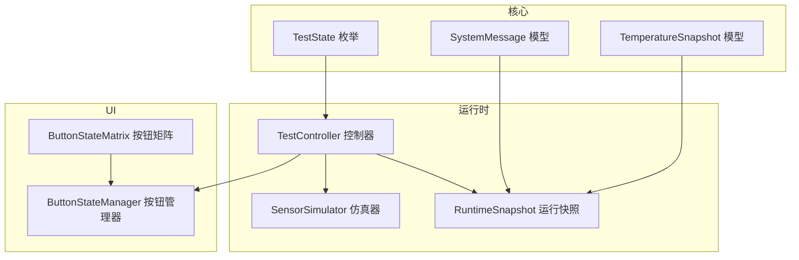
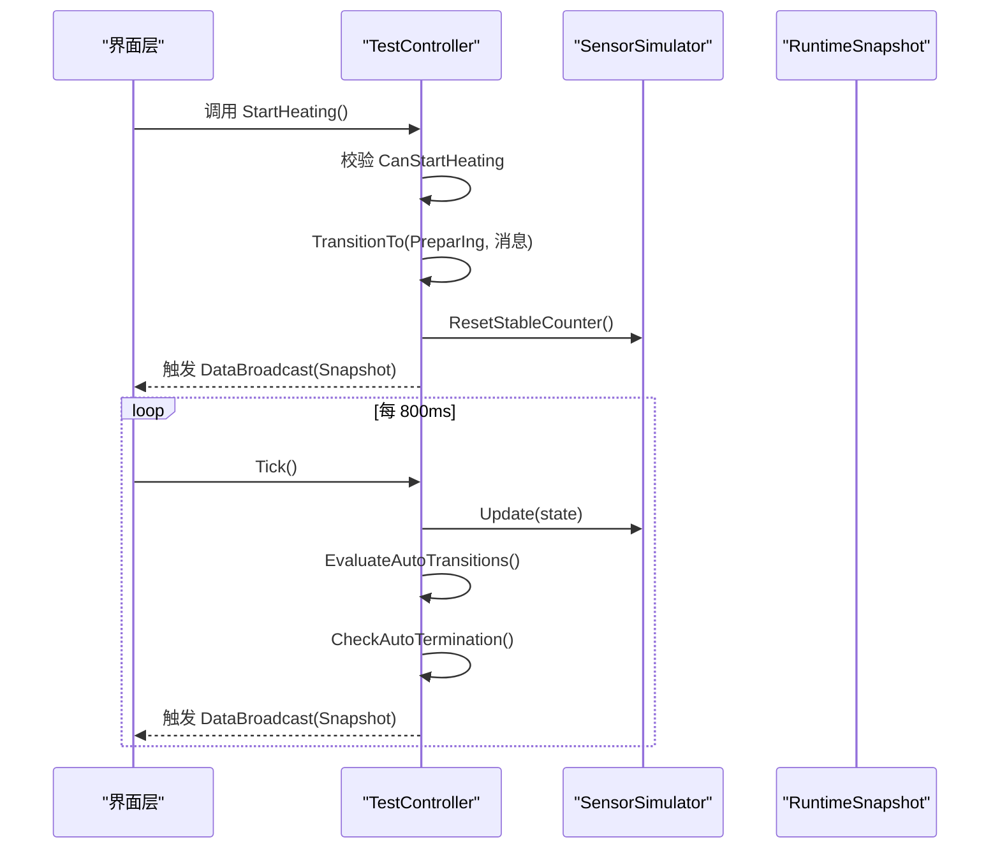
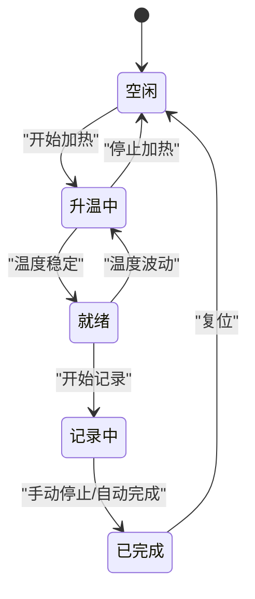
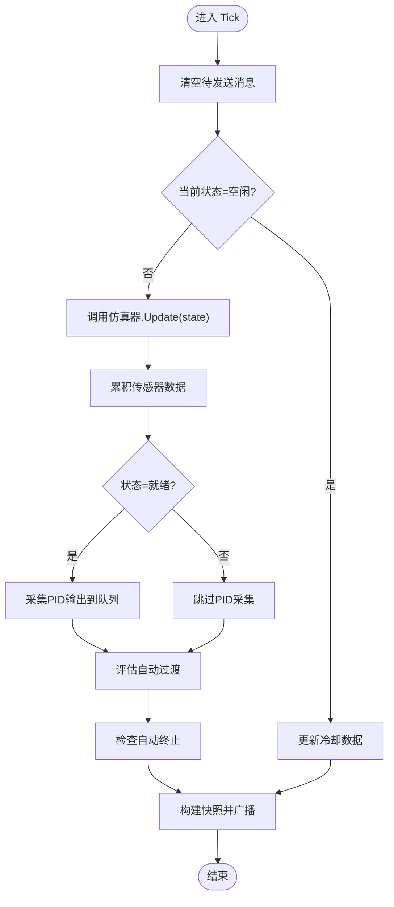
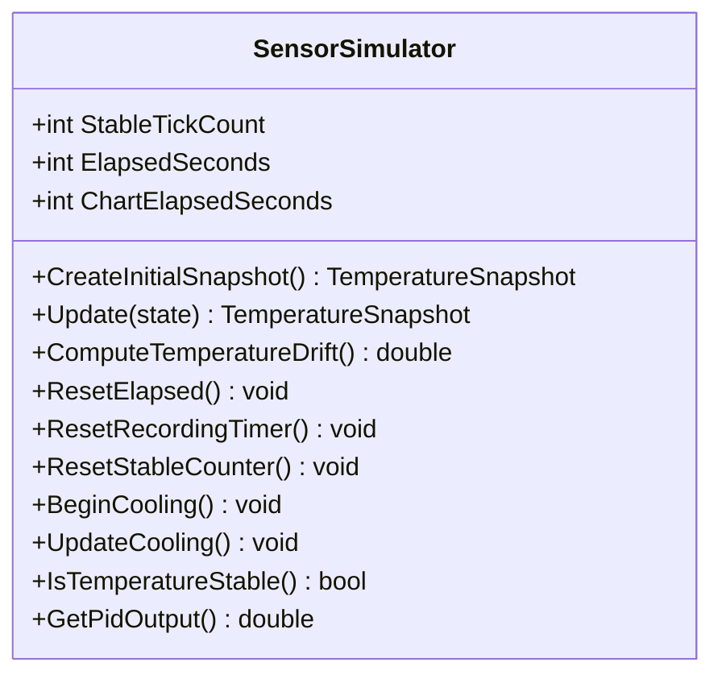
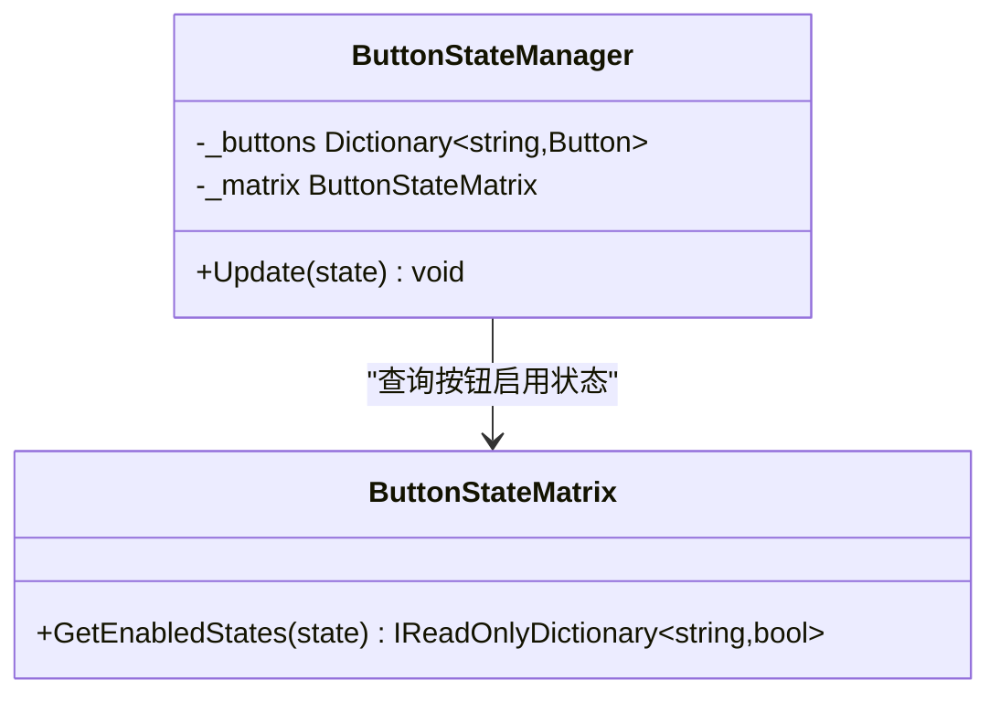
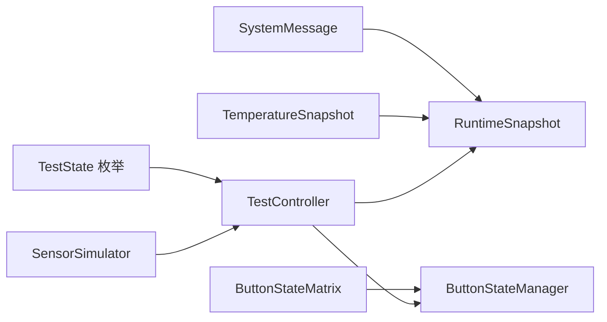

# 状态机设计

<cite>
**本文引用的文件列表**
- [TestState.cs](file://src/ISO11820.Core/Enums/TestState.cs)
- [TestController.cs](file://src/ISO11820.App/Runtime/Controller/TestController.cs)
- [SensorSimulator.cs](file://src/ISO11820.App/Runtime/Services/SensorSimulator.cs)
- [RuntimeSnapshot.cs](file://src/ISO11820.App/Shared/Models/RuntimeSnapshot.cs)
- [SystemMessage.cs](file://src/ISO11820.Core/Models/SystemMessage.cs)
- [TemperatureSnapshot.cs](file://src/ISO11820.Core/Models/TemperatureSnapshot.cs)
- [ButtonStateMatrix.cs](file://src/ISO11820.App/UI/Common/ButtonStateMatrix.cs)
- [ButtonStateManager.cs](file://src/ISO11820.App/UI/Common/ButtonStateManager.cs)
- [TestControllerTests.cs](file://tests/ISO11820.Tests/Runtime/TestControllerTests.cs)
- [TestStateSmokeTests.cs](file://tests/ISO11820.Tests/Runtime/TestStateSmokeTests.cs)
</cite>

## 目录
1. [引言](#引言)
2. [项目结构](#项目结构)
3. [核心组件](#核心组件)
4. [架构总览](#架构总览)
5. [详细组件分析](#详细组件分析)
6. [依赖关系分析](#依赖关系分析)
7. [性能考虑](#性能考虑)
8. [故障排查指南](#故障排查指南)
9. [结论](#结论)
10. [附录](#附录)

## 引言
本设计文档面向 ISO 11820 系统，聚焦五态状态机的设计与实现。状态机包含五个状态：空闲、升温中、就绪、记录中、已完成。文档将详细说明状态转换规则、触发条件与验证逻辑；系统化阐述 TestController 中的状态管理实现（状态检查、转换执行、事件广播）；说明状态持久化与恢复策略；提供状态转换图与时序图以展示不同操作下的状态变化流程；并给出异常处理与错误恢复的设计考虑及具体使用模式。

## 项目结构
围绕状态机相关代码，主要涉及以下模块：
- 核心枚举与模型：定义状态枚举与快照数据结构
- 运行时控制器：封装状态机入口、转换规则与广播机制
- 仿真服务：驱动温度数据推进、稳定判定与温漂计算
- UI 按钮矩阵：根据当前状态映射按钮可用性与交互约束
- 测试用例：覆盖关键状态流转与边界行为

图表来源
- [TestState.cs:1-11](file://src/ISO11820.Core/Enums/TestState.cs#L1-L11)
- [TemperatureSnapshot.cs:1-10](file://src/ISO11820.Core/Models/TemperatureSnapshot.cs#L1-L10)
- [SystemMessage.cs:1-4](file://src/ISO11820.Core/Models/SystemMessage.cs#L1-L4)
- [TestController.cs:1-328](file://src/ISO11820.App/Runtime/Controller/TestController.cs#L1-L328)
- [SensorSimulator.cs:1-223](file://src/ISO11820.App/Runtime/Services/SensorSimulator.cs#L1-L223)
- [RuntimeSnapshot.cs:1-12](file://src/ISO11820.App/Shared/Models/RuntimeSnapshot.cs#L1-L12)
- [ButtonStateMatrix.cs:1-90](file://src/ISO11820.App/UI/Common/ButtonStateMatrix.cs#L1-L90)
- [ButtonStateManager.cs:1-49](file://src/ISO11820.App/UI/Common/ButtonStateManager.cs#L1-L49)

章节来源
- [TestState.cs:1-11](file://src/ISO11820.Core/Enums/TestState.cs#L1-L11)
- [TestController.cs:1-328](file://src/ISO11820.App/Runtime/Controller/TestController.cs#L1-L328)
- [SensorSimulator.cs:1-223](file://src/ISO11820.App/Runtime/Services/SensorSimulator.cs#L1-L223)
- [RuntimeSnapshot.cs:1-12](file://src/ISO11820.App/Shared/Models/RuntimeSnapshot.cs#L1-L12)
- [ButtonStateMatrix.cs:1-90](file://src/ISO11820.App/UI/Common/ButtonStateMatrix.cs#L1-L90)
- [ButtonStateManager.cs:1-49](file://src/ISO11820.App/UI/Common/ButtonStateManager.cs#L1-L49)

## 核心组件
- 状态枚举：定义五态顺序值，确保默认值为空闲，且各状态值唯一有序
- 控制器：集中管理状态、用户动作、自动过渡、定时 Tick、广播快照
- 仿真器：按状态推进温度数据、判断稳定、计算温漂、模拟 PID 输出
- 快照模型：承载当前状态、温度快照、消息队列、计时信息
- UI 矩阵：基于状态映射按钮启用/禁用，保证交互一致性

章节来源
- [TestState.cs:1-11](file://src/ISO11820.Core/Enums/TestState.cs#L1-L11)
- [TestController.cs:1-328](file://src/ISO11820.App/Runtime/Controller/TestController.cs#L1-L328)
- [SensorSimulator.cs:1-223](file://src/ISO11820.App/Runtime/Services/SensorSimulator.cs#L1-L223)
- [RuntimeSnapshot.cs:1-12](file://src/ISO11820.App/Shared/Models/RuntimeSnapshot.cs#L1-L12)
- [ButtonStateMatrix.cs:1-90](file://src/ISO11820.App/UI/Common/ButtonStateMatrix.cs#L1-L90)

## 架构总览
状态机由 TestController 作为唯一入口，协调 SensorSimulator 的仿真推进与数据收集，并通过 DataBroadcast 事件向 UI 层广播 RuntimeSnapshot。UI 层通过 ButtonStateMatrix 和 ButtonStateManager 将状态映射为按钮可用性，避免在点击处理器中嵌入状态逻辑。

图表来源
- [TestController.cs:57-72](file://src/ISO11820.App/Runtime/Controller/TestController.cs#L57-L72)
- [TestController.cs:171-204](file://src/ISO11820.App/Runtime/Controller/TestController.cs#L171-L204)
- [SensorSimulator.cs:46-79](file://src/ISO11820.App/Runtime/Services/SensorSimulator.cs#L46-L79)
- [RuntimeSnapshot.cs:1-12](file://src/ISO11820.App/Shared/Models/RuntimeSnapshot.cs#L1-L12)

## 详细组件分析

### 状态机定义与转换规则
- 状态集合：空闲、升温中、就绪、记录中、已完成
- 初始状态：空闲
- 用户触发的转换：
  - 空闲 → 升温中：开始加热
  - 升温中/就绪 → 空闲：停止加热
  - 就绪 → 记录中：开始记录
  - 记录中 → 已完成：手动停止或自动完成
- 自动触发的转换：
  - 升温中 → 就绪：温度稳定阈值满足
  - 就绪 → 升温中：温度波动超出稳定范围
  - 记录中 → 已完成：达到终止条件（固定时长或提前终止）

图表来源
- [TestController.cs:57-143](file://src/ISO11820.App/Runtime/Controller/TestController.cs#L57-L143)
- [TestController.cs:248-302](file://src/ISO11820.App/Runtime/Controller/TestController.cs#L248-L302)
- [TestController.cs:145-156](file://src/ISO11820.App/Runtime/Controller/TestController.cs#L145-L156)

章节来源
- [TestState.cs:1-11](file://src/ISO11820.Core/Enums/TestState.cs#L1-L11)
- [TestController.cs:36-43](file://src/ISO11820.App/Runtime/Controller/TestController.cs#L36-L43)
- [TestController.cs:248-302](file://src/ISO11820.App/Runtime/Controller/TestController.cs#L248-L302)

### TestController 状态管理实现
- 状态检查：通过 Can* 属性暴露当前可执行的用户动作，限制非法转换
- 转换执行：TransitionTo 内部更新 CurrentState 并追加系统消息
- 事件广播：每次状态变更或 Tick 后构建 RuntimeSnapshot 并通过 DataBroadcast 事件推送
- 自动过渡：EvaluateAutoTransitions 依据仿真器的稳定判定进行状态回退或前进
- 自动终止：CheckAutoTermination 在记录阶段按时间窗口检查温漂阈值或固定时长，触发完成

图表来源
- [TestController.cs:171-204](file://src/ISO11820.App/Runtime/Controller/TestController.cs#L171-L204)
- [TestController.cs:230-246](file://src/ISO11820.App/Runtime/Controller/TestController.cs#L230-L246)
- [TestController.cs:248-302](file://src/ISO11820.App/Runtime/Controller/TestController.cs#L248-L302)
- [TestController.cs:311-326](file://src/ISO11820.App/Runtime/Controller/TestController.cs#L311-L326)

章节来源
- [TestController.cs:57-143](file://src/ISO11820.App/Runtime/Controller/TestController.cs#L57-L143)
- [TestController.cs:171-204](file://src/ISO11820.App/Runtime/Controller/TestController.cs#L171-L204)
- [TestController.cs:248-302](file://src/ISO11820.App/Runtime/Controller/TestController.cs#L248-L302)
- [TestController.cs:304-326](file://src/ISO11820.App/Runtime/Controller/TestController.cs#L304-L326)

### SensorSimulator 仿真与稳定判定
- 状态推进：根据不同状态采用不同的温度推进算法（升温、稳定、记录）
- 稳定判定：在目标温度附近连续多个采样点满足阈值即认为稳定
- 温漂计算：使用最近若干样本点进行线性回归，得到单位时间漂移速率
- PID 输出：在就绪阶段采集平均 PID 输出用于恒定功率估算

图表来源
- [SensorSimulator.cs:1-223](file://src/ISO11820.App/Runtime/Services/SensorSimulator.cs#L1-L223)

章节来源
- [SensorSimulator.cs:46-79](file://src/ISO11820.App/Runtime/Services/SensorSimulator.cs#L46-L79)
- [SensorSimulator.cs:84-97](file://src/ISO11820.App/Runtime/Services/SensorSimulator.cs#L84-L97)
- [SensorSimulator.cs:147-158](file://src/ISO11820.App/Runtime/Services/SensorSimulator.cs#L147-L158)
- [SensorSimulator.cs:163-209](file://src/ISO11820.App/Runtime/Services/SensorSimulator.cs#L163-L209)

### UI 按钮矩阵与状态映射
- 按钮矩阵：将当前状态映射为各按钮的启用/禁用字典
- 按钮管理器：接收状态并批量更新 WinForms 控件的 Enabled 属性
- 目的：将状态逻辑与 UI 解耦，便于单元测试与复用

图表来源
- [ButtonStateMatrix.cs:1-90](file://src/ISO11820.App/UI/Common/ButtonStateMatrix.cs#L1-L90)
- [ButtonStateManager.cs:1-49](file://src/ISO11820.App/UI/Common/ButtonStateManager.cs#L1-L49)

章节来源
- [ButtonStateMatrix.cs:11-62](file://src/ISO11820.App/UI/Common/ButtonStateMatrix.cs#L11-L62)
- [ButtonStateManager.cs:36-47](file://src/ISO11820.App/UI/Common/ButtonStateManager.cs#L36-L47)

### 状态持久化与恢复策略
- 当前实现未内置状态持久化与恢复逻辑
- 建议策略：
  - 在状态转换时（TransitionTo）将当前状态、消息、计时与关键参数写入持久化存储
  - 应用启动时读取上次运行快照，恢复状态与仿真器计数器，重建 RuntimeSnapshot 并广播
  - 对记录阶段的未完成数据进行断点续写，确保数据完整性
- 注意：需结合外部存储（文件或数据库）与事务性写入，避免部分写入导致不一致

章节来源
- [TestController.cs:304-309](file://src/ISO11820.App/Runtime/Controller/TestController.cs#L304-L309)
- [RuntimeSnapshot.cs:1-12](file://src/ISO11820.App/Shared/Models/RuntimeSnapshot.cs#L1-L12)

### 异常处理与错误恢复
- 线程安全：控制器内部使用锁保护状态与缓冲区，避免多线程竞争
- 幂等性：重复调用相同动作不会改变状态（如多次 StartHeating）
- 自动恢复：温度波动导致从就绪回退至升温中，系统能自我修正
- 超时保护：记录阶段固定时长无条件终止，防止长时间挂起
- 建议增强：
  - 对关键路径增加 try/catch 并记录错误消息到 SystemMessage
  - 对仿真器异常进行降级处理（例如返回零漂移、重置计数）
  - 对外部资源访问失败进行重试与告警

章节来源
- [TestController.cs:57-143](file://src/ISO11820.App/Runtime/Controller/TestController.cs#L57-L143)
- [TestController.cs:171-204](file://src/ISO11820.App/Runtime/Controller/TestController.cs#L171-L204)
- [TestController.cs:248-302](file://src/ISO11820.App/Runtime/Controller/TestController.cs#L248-L302)

### 使用模式与示例路径
- 初始化与首帧广播：构造控制器后调用 BroadcastInitialState，确保 UI 收到初始快照
- 标准流程：StartHeating → Tick 等待就绪 → StartRecording → Tick 等待完成 → StopRecording 或 CompleteTest
- 复位流程：在任何状态下调用 ResetToIdle，清理缓冲与计时，回到空闲
- 参考测试用例路径：
  - [TestControllerTests.cs:30-47](file://tests/ISO11820.Tests/Runtime/TestControllerTests.cs#L30-L47)
  - [TestControllerTests.cs:84-100](file://tests/ISO11820.Tests/Runtime/TestControllerTests.cs#L84-L100)
  - [TestControllerTests.cs:103-120](file://tests/ISO11820.Tests/Runtime/TestControllerTests.cs#L103-L120)
  - [TestControllerTests.cs:123-140](file://tests/ISO11820.Tests/Runtime/TestControllerTests.cs#L123-L140)
  - [TestControllerTests.cs:158-168](file://tests/ISO11820.Tests/Runtime/TestControllerTests.cs#L158-L168)

章节来源
- [TestControllerTests.cs:30-47](file://tests/ISO11820.Tests/Runtime/TestControllerTests.cs#L30-L47)
- [TestControllerTests.cs:84-100](file://tests/ISO11820.Tests/Runtime/TestControllerTests.cs#L84-L100)
- [TestControllerTests.cs:103-120](file://tests/ISO11820.Tests/Runtime/TestControllerTests.cs#L103-L120)
- [TestControllerTests.cs:123-140](file://tests/ISO11820.Tests/Runtime/TestControllerTests.cs#L123-L140)
- [TestControllerTests.cs:158-168](file://tests/ISO11820.Tests/Runtime/TestControllerTests.cs#L158-L168)

## 依赖关系分析
- 控制器依赖仿真器获取温度数据与稳定判定
- 控制器依赖快照模型聚合状态、温度、消息与计时
- UI 层依赖按钮矩阵与管理器，仅关注状态而非业务细节
- 测试覆盖状态枚举顺序与控制器关键路径

图表来源
- [TestState.cs:1-11](file://src/ISO11820.Core/Enums/TestState.cs#L1-L11)
- [TestController.cs:1-328](file://src/ISO11820.App/Runtime/Controller/TestController.cs#L1-L328)
- [SensorSimulator.cs:1-223](file://src/ISO11820.App/Runtime/Services/SensorSimulator.cs#L1-L223)
- [RuntimeSnapshot.cs:1-12](file://src/ISO11820.App/Shared/Models/RuntimeSnapshot.cs#L1-L12)
- [SystemMessage.cs:1-4](file://src/ISO11820.Core/Models/SystemMessage.cs#L1-L4)
- [TemperatureSnapshot.cs:1-10](file://src/ISO11820.Core/Models/TemperatureSnapshot.cs#L1-L10)
- [ButtonStateMatrix.cs:1-90](file://src/ISO11820.App/UI/Common/ButtonStateMatrix.cs#L1-L90)
- [ButtonStateManager.cs:1-49](file://src/ISO11820.App/UI/Common/ButtonStateManager.cs#L1-L49)

章节来源
- [TestStateSmokeTests.cs:1-30](file://tests/ISO11820.Tests/Runtime/TestStateSmokeTests.cs#L1-L30)
- [ButtonStateMatrix.cs:11-62](file://src/ISO11820.App/UI/Common/ButtonStateMatrix.cs#L11-L62)

## 性能考虑
- 采样频率：Tick 周期约 800ms，兼顾实时性与 CPU 占用
- PID 队列长度上限：控制内存增长，避免无限累积
- 温漂计算：限定最近样本数量，降低回归计算开销
- 温度推进：采用简单步进与噪声叠加，避免复杂物理模型带来的性能压力
- 建议优化：
  - 在大量历史数据场景下，考虑滑动窗口与增量统计
  - 对广播事件进行节流，避免 UI 频繁重绘

[本节为通用指导，不直接分析具体文件]

## 故障排查指南
- 无法进入就绪：检查稳定阈值与温度波动设置，确认 IsTemperatureStable 判定是否满足
- 记录阶段无进展：确认 Tick 是否被持续调用，检查 ElapsedSeconds 是否递增
- 自动终止未触发：核对终止检查点与温漂阈值，确认 ComputeTemperatureDrift 返回值合理
- UI 按钮不可用：查看 ButtonStateMatrix 映射是否与预期一致
- 参考测试用例定位问题：
  - [TestControllerTests.cs:198-206](file://tests/ISO11820.Tests/Runtime/TestControllerTests.cs#L198-L206)
  - [TestControllerTests.cs:209-228](file://tests/ISO11820.Tests/Runtime/TestControllerTests.cs#L209-L228)
  - [TestControllerTests.cs:231-247](file://tests/ISO11820.Tests/Runtime/TestControllerTests.cs#L231-L247)

章节来源
- [TestControllerTests.cs:198-206](file://tests/ISO11820.Tests/Runtime/TestControllerTests.cs#L198-L206)
- [TestControllerTests.cs:209-228](file://tests/ISO11820.Tests/Runtime/TestControllerTests.cs#L209-L228)
- [TestControllerTests.cs:231-247](file://tests/ISO11820.Tests/Runtime/TestControllerTests.cs#L231-L247)

## 结论
该状态机以 TestController 为核心，清晰定义了五态之间的转换规则与触发条件，并通过 SensorSimulator 提供稳定的仿真推进与判定能力。UI 层通过按钮矩阵与状态管理器保持交互一致性。整体设计具备良好的可扩展性与可测试性，建议在后续版本中加入状态持久化与更完善的异常处理机制，以提升系统的鲁棒性与可维护性。

[本节为总结，不直接分析具体文件]

## 附录
- 状态枚举顺序与唯一性验证：
  - [TestStateSmokeTests.cs:1-30](file://tests/ISO11820.Tests/Runtime/TestStateSmokeTests.cs#L1-L30)
- 广播快照结构与消息包含验证：
  - [TestControllerTests.cs:171-195](file://tests/ISO11820.Tests/Runtime/TestControllerTests.cs#L171-L195)

章节来源
- [TestStateSmokeTests.cs:1-30](file://tests/ISO11820.Tests/Runtime/TestStateSmokeTests.cs#L1-L30)
- [TestControllerTests.cs:171-195](file://tests/ISO11820.Tests/Runtime/TestControllerTests.cs#L171-L195)