# 传感器模拟器

<cite>
**本文档引用的文件**
- [SensorSimulator.cs](file://src/ISO11820.App/Runtime/Services/SensorSimulator.cs)
- [TemperatureSnapshot.cs](file://src/ISO11820.Core/Models/TemperatureSnapshot.cs)
- [SensorSimulatorTests.cs](file://tests/ISO11820.Tests/Runtime/SensorSimulatorTests.cs)
- [AppSettings.cs](file://src/ISO11820.App/Config/AppSettings.cs)
- [TestController.cs](file://src/ISO11820.App/Runtime/Controller/TestController.cs)
- [TestState.cs](file://src/ISO11820.Core/Enums/TestState.cs)
- [RuntimeSnapshot.cs](file://src/ISO11820.App/Shared/Models/RuntimeSnapshot.cs)
- [CsvSampleWriter.cs](file://src/ISO11820.App/Infrastructure/FileStorage/CsvSampleWriter.cs)
</cite>

## 目录
1. [简介](#简介)
2. [项目结构](#项目结构)
3. [核心组件](#核心组件)
4. [架构概览](#架构概览)
5. [详细组件分析](#详细组件分析)
6. [依赖关系分析](#依赖关系分析)
7. [性能考虑](#性能考虑)
8. [故障排除指南](#故障排除指南)
9. [结论](#结论)

## 简介

传感器模拟器是ISO11820温度测试系统的核心组件，负责模拟真实的温度传感器行为。该系统实现了复杂的物理过程模拟算法，包括温度变化模型、热传导模拟和噪声添加机制。通过精确的数学建模，传感器模拟器能够产生符合实际工业标准的温度曲线数据，为测试执行器提供可靠的仿真环境。

本系统支持多通道温度监控，包括炉温1、炉温2、表面温度、中心温度和校准温度的计算方法。同时集成了PID控制算法输出计算、温度稳定性检测和温漂速率计算功能。所有这些功能都通过可配置的仿真设置参数进行调节，包括加热功率、冷却系数、目标温度等关键配置项。

## 项目结构

传感器模拟器位于应用层的服务目录中，与核心模型和配置模块紧密集成：

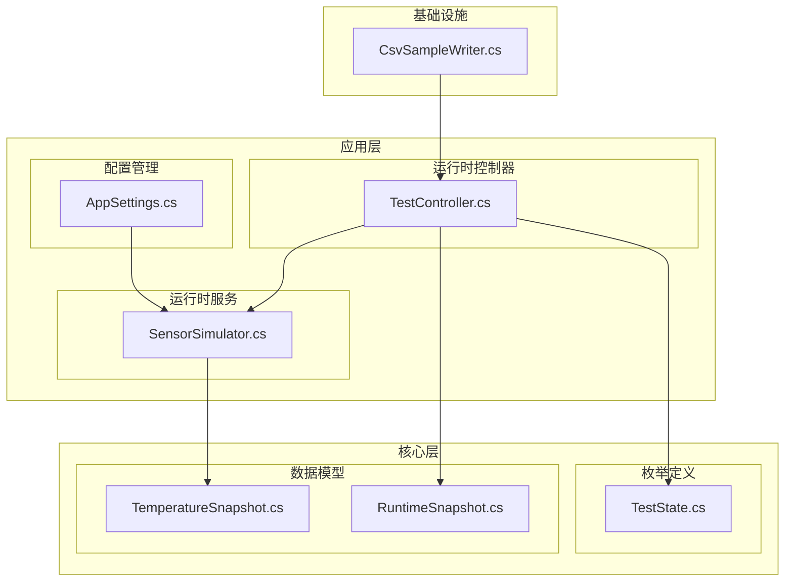

**图表来源**
- [SensorSimulator.cs:1-223](file://src/ISO11820.App/Runtime/Services/SensorSimulator.cs#L1-L223)
- [TestController.cs:1-328](file://src/ISO11820.App/Runtime/Controller/TestController.cs#L1-L328)
- [AppSettings.cs:1-160](file://src/ISO11820.App/Config/AppSettings.cs#L1-L160)

**章节来源**
- [SensorSimulator.cs:1-223](file://src/ISO11820.App/Runtime/Services/SensorSimulator.cs#L1-L223)
- [AppSettings.cs:57-70](file://src/ISO11820.App/Config/AppSettings.cs#L57-L70)

## 核心组件

### 传感器模拟器类结构

传感器模拟器采用单例模式设计，封装了完整的温度模拟逻辑：

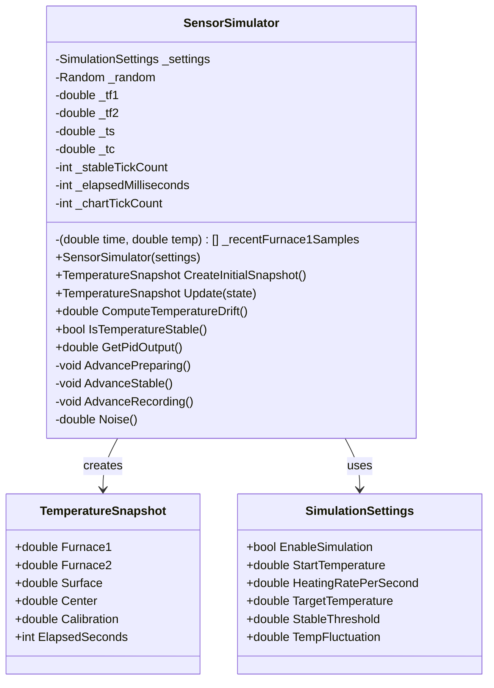

**图表来源**
- [SensorSimulator.cs:8-223](file://src/ISO11820.App/Runtime/Services/SensorSimulator.cs#L8-L223)
- [TemperatureSnapshot.cs:3-9](file://src/ISO11820.Core/Models/TemperatureSnapshot.cs#L3-L9)
- [AppSettings.cs:57-70](file://src/ISO11820.App/Config/AppSettings.cs#L57-L70)

### 温度快照数据结构

TemperatureSnapshot是不可变的数据传输对象，封装了当前时刻的所有温度测量值：

| 字段名 | 类型 | 描述 | 默认值 |
|--------|------|------|--------|
| Furnace1 | double | 炉温1温度值 | 未定义 |
| Furnace2 | double | 炉温2温度值 | 未定义 |
| Surface | double | 表面温度值 | 未定义 |
| Center | double | 中心温度值 | 未定义 |
| Calibration | double | 校准温度值 | 未定义 |
| ElapsedSeconds | int | 自测试开始经过的秒数 | 未定义 |

**章节来源**
- [TemperatureSnapshot.cs:1-10](file://src/ISO11820.Core/Models/TemperatureSnapshot.cs#L1-L10)

## 架构概览

传感器模拟器在整个系统中的位置和交互关系如下：

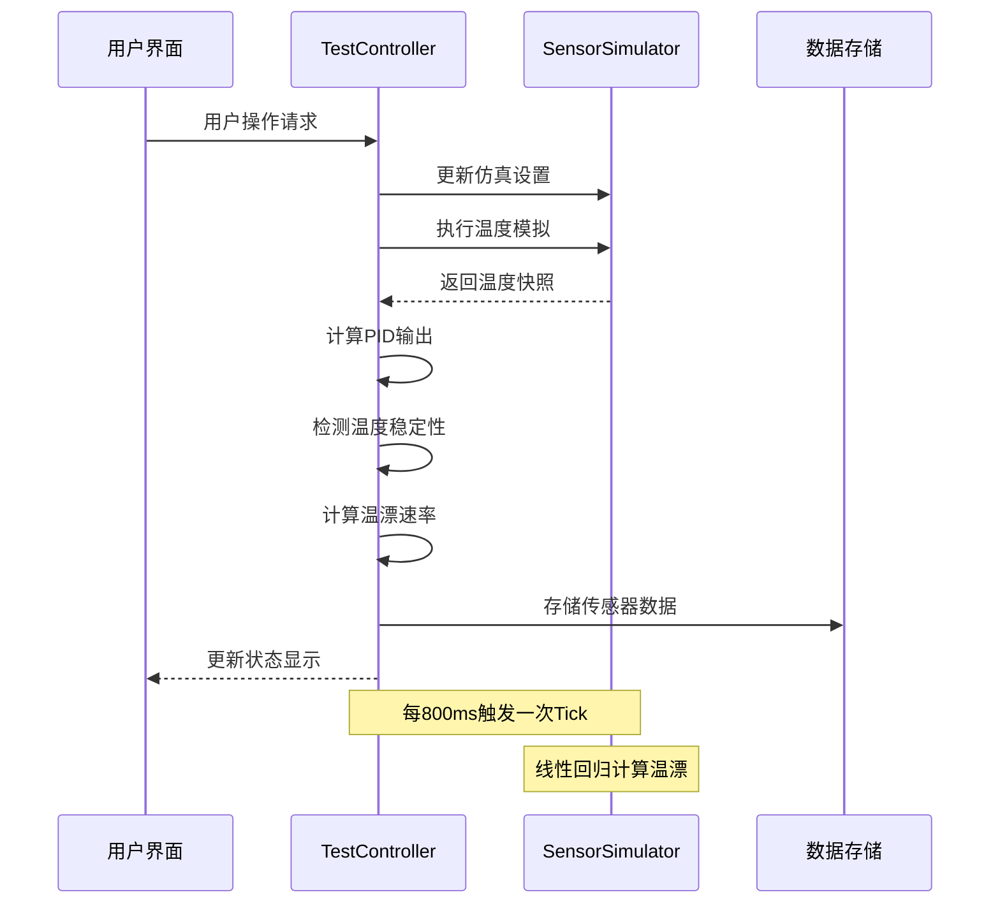

**图表来源**
- [TestController.cs:171-204](file://src/ISO11820.App/Runtime/Controller/TestController.cs#L171-L204)
- [SensorSimulator.cs:46-79](file://src/ISO11820.App/Runtime/Services/SensorSimulator.cs#L46-L79)

**章节来源**
- [TestController.cs:11-328](file://src/ISO11820.App/Runtime/Controller/TestController.cs#L11-L328)

## 详细组件分析

### 物理过程模拟算法

#### 温度变化模型

传感器模拟器实现了基于状态机的温度变化模型，每个测试状态都有特定的温度演进规则：

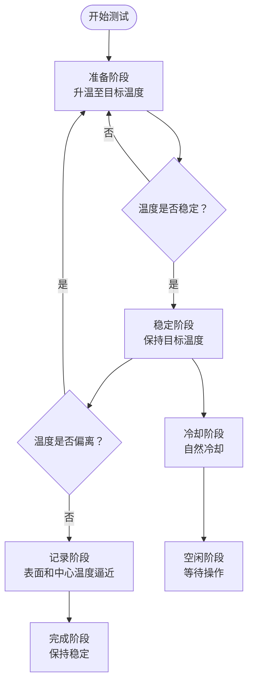

**图表来源**
- [SensorSimulator.cs:48-70](file://src/ISO11820.App/Runtime/Services/SensorSimulator.cs#L48-L70)
- [TestController.cs:248-267](file://src/ISO11820.App/Runtime/Controller/TestController.cs#L248-L267)

#### 热传导模拟机制

系统通过指数逼近算法模拟热传导过程：

| 温度类型 | 模拟公式 | 参数说明 |
|----------|----------|----------|
| 炉温1/2 | T(t) = Target + Noise | 直接设定目标温度 |
| 表面温度 | Ts(t+1) = Ts(t) + α(Ts_target - Ts(t)) + Noise | 指数逼近，α=0.02 |
| 中心温度 | Tc(t+1) = Tc(t) + β(Tc_target - Tc(t)) + Noise | 指数逼近，β=0.01 |
| 校准温度 | Tcal = Tf1 + ε × 2 | 基于炉温1的线性偏移 |

其中Ts_target = min(Tf1 × 0.95, 800)，Tc_target = min(Tf1 × 0.85, 750)，ε为噪声幅度。

**章节来源**
- [SensorSimulator.cs:196-209](file://src/ISO11820.App/Runtime/Services/SensorSimulator.cs#L196-L209)

### 多通道温度监控实现

#### 炉温监控

炉温1和炉温2采用相同的温度演进模型，确保双通道的一致性：

- **初始值**：TF1 = TF2 = StartTemperature
- **目标值**：TF_target = TargetTemperature
- **演进速度**：Step = HeatingRate × 0.8
- **噪声强度**：TempFluctuation

#### 表面温度计算

表面温度模拟真实热传导过程，从炉温向表面温度指数逼近：

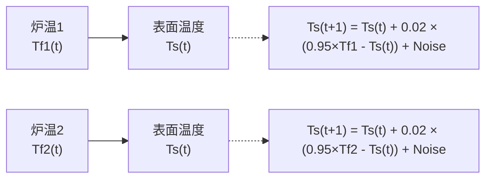

**图表来源**
- [SensorSimulator.cs:204-205](file://src/ISO11820.App/Runtime/Services/SensorSimulator.cs#L204-L205)

#### 中心温度计算

中心温度模拟更深层的热传导过程，具有更慢的响应速度：

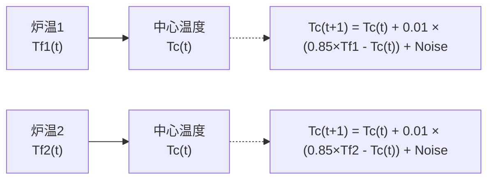

**图表来源**
- [SensorSimulator.cs:207-208](file://src/ISO11820.App/Runtime/Services/SensorSimulator.cs#L207-L208)

#### 校准温度生成

校准温度基于炉温1生成，包含额外的噪声偏移：

- **计算公式**：Tcal = Tf1 + ε × 2
- **噪声特性**：独立于其他温度通道
- **应用场景**：验证传感器校准算法

**章节来源**
- [SensorSimulator.cs:41-44](file://src/ISO11820.App/Runtime/Services/SensorSimulator.cs#L41-L44)
- [SensorSimulator.cs:72-78](file://src/ISO11820.App/Runtime/Services/SensorSimulator.cs#L72-L78)

### PID控制算法输出计算

#### 恒定功率计算

在稳定状态下，系统通过收集PID输出值来计算恒定功率：

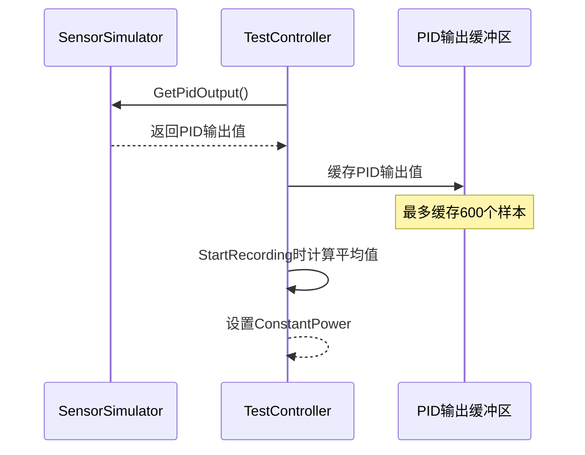

**图表来源**
- [TestController.cs:193-197](file://src/ISO11820.App/Runtime/Controller/TestController.cs#L193-L197)
- [SensorSimulator.cs:214-217](file://src/ISO11820.App/Runtime/Services/SensorSimulator.cs#L214-L217)

#### PID输出特性

- **基础值**：2048.0（对应满量程的中间值）
- **噪声范围**：±10 × TempFluctuation
- **采样频率**：每800ms一次
- **缓冲限制**：最多600个样本（约8分钟数据）

**章节来源**
- [TestController.cs:48](file://src/ISO11820.App/Runtime/Controller/TestController.cs#L48)
- [SensorSimulator.cs:214-217](file://src/ISO11820.App/Runtime/Services/SensorSimulator.cs#L214-L217)

### 温度稳定性检测

#### 稳定性判断逻辑

温度稳定性检测采用滑动窗口机制，需要连续多个采样周期内温度保持在目标温度范围内：

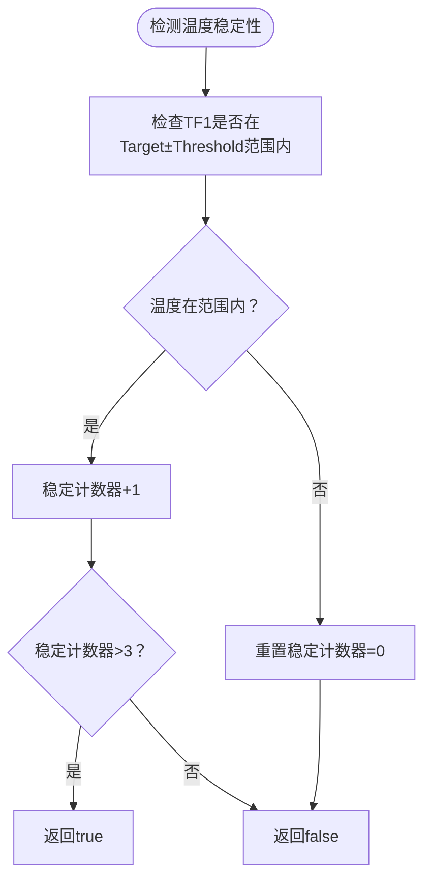

**图表来源**
- [SensorSimulator.cs:147-158](file://src/ISO11820.App/Runtime/Services/SensorSimulator.cs#L147-L158)

#### 关键参数

- **阈值范围**：TargetTemperature ± StableThreshold
- **最小稳定周期**：4个连续采样周期
- **检测频率**：每800ms检测一次

**章节来源**
- [SensorSimulator.cs:147-158](file://src/ISO11820.App/Runtime/Services/SensorSimulator.cs#L147-L158)

### 温漂速率计算

#### 线性回归算法

温漂速率通过MathNet.Numerics库的线性回归算法计算，使用最近20个采样点进行统计分析：

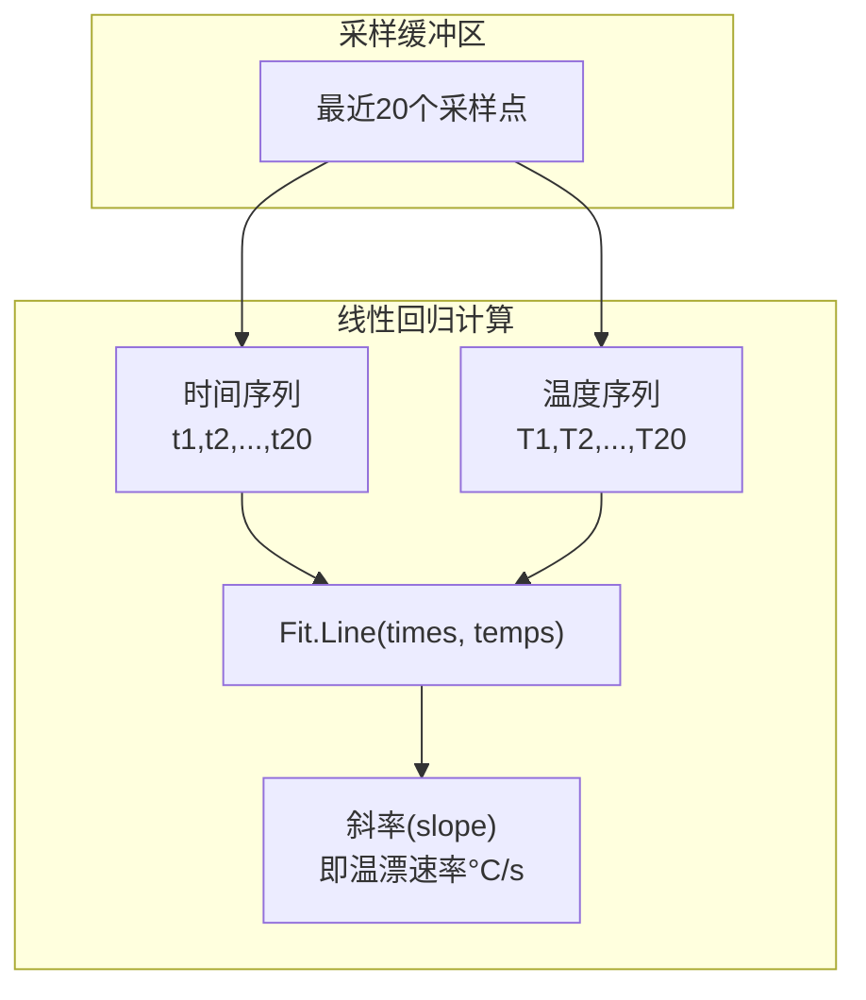

**图表来源**
- [SensorSimulator.cs:84-97](file://src/ISO11820.App/Runtime/Services/SensorSimulator.cs#L84-L97)

#### 计算精度

- **最小样本数**：3个点（不足时返回0）
- **最大样本数**：20个点
- **时间分辨率**：1秒
- **结果单位**：°C/秒

**章节来源**
- [SensorSimulator.cs:84-107](file://src/ISO11820.App/Runtime/Services/SensorSimulator.cs#L84-L107)

### 仿真设置参数影响

#### 关键配置参数

| 参数名称 | 类型 | 默认值 | 影响范围 | 调整建议 |
|----------|------|--------|----------|----------|
| EnableSimulation | bool | true | 启用/禁用仿真 | 生产环境建议关闭 |
| StartTemperature | double | 720.0 | 初始温度 | 接近目标温度 |
| HeatingRatePerSecond | double | 40.0 | 升温速度 | 40°C/min较合理 |
| TargetTemperature | double | 750.0 | 目标温度 | 750°C标准测试温度 |
| StableThreshold | double | 3.0 | 稳定阈值 | ±3°C足够稳定 |
| TempFluctuation | double | 0.5 | 噪声幅度 | 0.5°C真实感 |

#### 参数调优策略

- **升温速度**：过快导致温度波动，过慢影响效率
- **目标温度**：需考虑设备极限和材料特性
- **噪声参数**：平衡真实性和稳定性需求

**章节来源**
- [AppSettings.cs:57-70](file://src/ISO11820.App/Config/AppSettings.cs#L57-L70)

### TemperatureSnapshot使用方法

#### 创建初始快照

CreateInitialSnapshot方法用于生成测试开始时的温度数据：

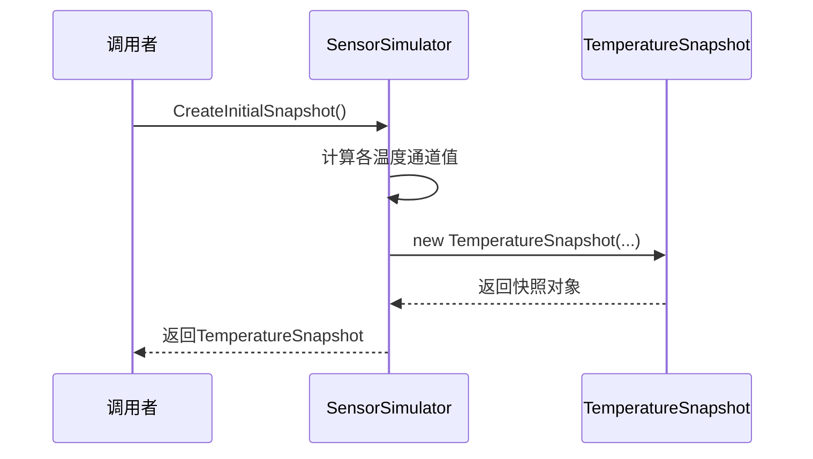

**图表来源**
- [SensorSimulator.cs:41-44](file://src/ISO11820.App/Runtime/Services/SensorSimulator.cs#L41-L44)

#### 快照数据结构

每次Update调用都会生成新的TemperatureSnapshot实例，包含：
- 四个温度通道值（四舍五入到0.1°C）
- 校准温度值（包含额外噪声）
- 经过的时间（秒）

**章节来源**
- [SensorSimulator.cs:41-79](file://src/ISO11820.App/Runtime/Services/SensorSimulator.cs#L41-L79)

### 实时数据更新性能优化

#### 冷却算法优化

在空闲状态下，系统采用高效的冷却算法：

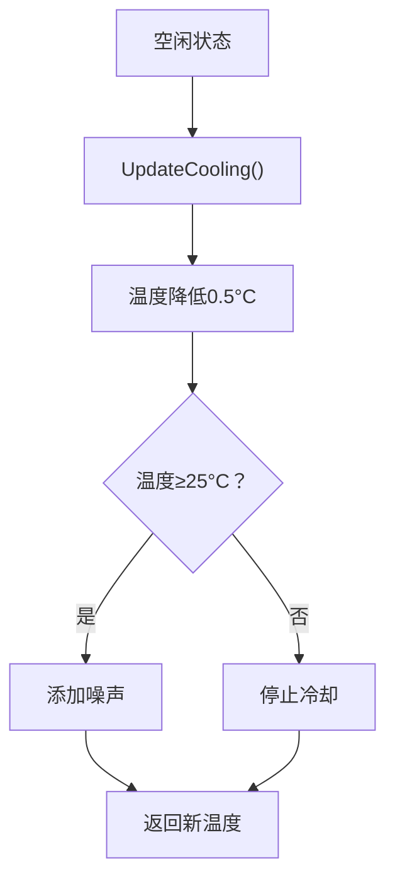

**图表来源**
- [SensorSimulator.cs:139-145](file://src/ISO11820.App/Runtime/Services/SensorSimulator.cs#L139-L145)

#### 性能优化措施

1. **线程安全**：使用lock保护共享资源
2. **内存管理**：限制温漂样本数量（20个）
3. **计算优化**：使用Math.Round减少浮点运算
4. **缓冲控制**：限制PID输出队列大小（600个）

**章节来源**
- [SensorSimulator.cs:86-107](file://src/ISO11820.App/Runtime/Services/SensorSimulator.cs#L86-L107)
- [TestController.cs:17-18](file://src/ISO11820.App/Runtime/Controller/TestController.cs#L17-L18)

## 依赖关系分析

### 外部依赖

传感器模拟器依赖以下外部库和框架：

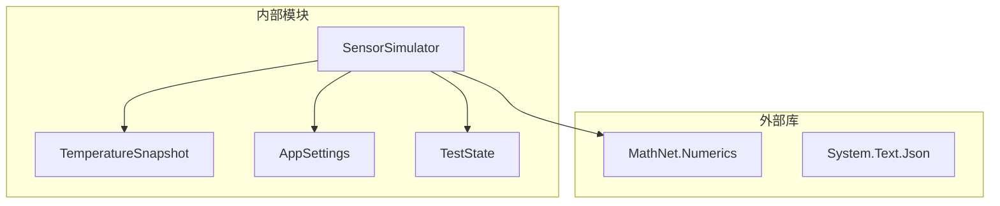

**图表来源**
- [SensorSimulator.cs:1-5](file://src/ISO11820.App/Runtime/Services/SensorSimulator.cs#L1-L5)

### 内部耦合关系

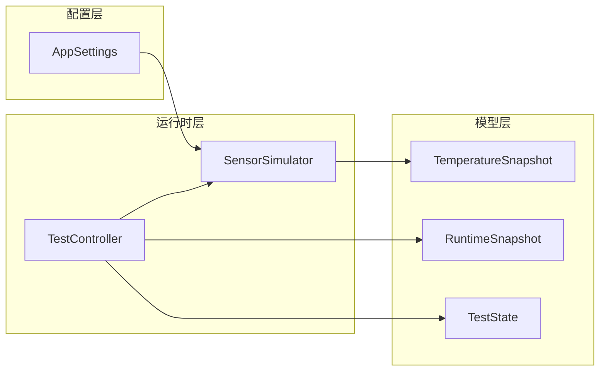

**图表来源**
- [TestController.cs:13-35](file://src/ISO11820.App/Runtime/Controller/TestController.cs#L13-L35)

**章节来源**
- [SensorSimulator.cs:1-5](file://src/ISO11820.App/Runtime/Services/SensorSimulator.cs#L1-L5)
- [TestController.cs:1-328](file://src/ISO11820.App/Runtime/Controller/TestController.cs#L1-L328)

## 性能考虑

### 计算复杂度分析

| 方法 | 时间复杂度 | 空间复杂度 | 优化策略 |
|------|------------|------------|----------|
| Update | O(1) | O(1) | 预计算常量，避免重复计算 |
| ComputeTemperatureDrift | O(n) | O(n) | n≤20，线性时间 |
| IsTemperatureStable | O(1) | O(1) | 简单阈值比较 |
| GetPidOutput | O(1) | O(1) | 常量时间操作 |

### 内存使用优化

1. **样本限制**：温漂计算最多使用20个样本点
2. **队列管理**：PID输出队列限制600个样本
3. **对象复用**：TemperatureSnapshot为只读记录类型

### 并发安全性

- 使用lock关键字保护共享资源
- 线程安全的列表操作
- 原子性的状态更新

## 故障排除指南

### 常见问题诊断

#### 温度不稳定问题

**症状**：温度频繁波动，无法达到稳定状态

**可能原因**：
1. StableThreshold设置过小
2. HeatingRatePerSecond过高
3. TempFluctuation过大

**解决方案**：
- 适当增大StableThreshold
- 降低HeatingRatePerSecond
- 减小TempFluctuation

#### 温漂计算异常

**症状**：ComputeTemperatureDrift返回0或异常值

**可能原因**：
1. 样本数量不足（<3个）
2. 线程竞争导致数据不一致

**解决方案**：
- 确保至少有3个样本点
- 检查线程同步机制

#### PID输出异常

**症状**：GetPidOutput返回异常值

**可能原因**：
1. TempFluctuation参数设置不当
2. 随机数生成器初始化问题

**解决方案**：
- 检查SimulationSettings配置
- 重新初始化随机数生成器

**章节来源**
- [SensorSimulatorTests.cs:74-104](file://tests/ISO11820.Tests/Runtime/SensorSimulatorTests.cs#L74-L104)
- [SensorSimulatorTests.cs:180-196](file://tests/ISO11820.Tests/Runtime/SensorSimulatorTests.cs#L180-L196)

### 测试验证

单元测试覆盖了关键功能的验证：

- **CreateInitialSnapshot**：验证初始温度设置
- **Update**：验证不同状态下的温度演进
- **IsTemperatureStable**：验证稳定性检测逻辑
- **ComputeTemperatureDrift**：验证温漂计算准确性
- **Reset**：验证状态重置功能

**章节来源**
- [SensorSimulatorTests.cs:26-221](file://tests/ISO11820.Tests/Runtime/SensorSimulatorTests.cs#L26-L221)

## 结论

传感器模拟器是一个高度模块化的温度仿真系统，通过精心设计的物理模型和算法实现了真实的温度变化行为。系统的主要优势包括：

1. **精确的物理建模**：基于指数逼近的热传导模拟
2. **灵活的配置管理**：可调整的仿真参数适应不同场景
3. **完善的监控机制**：多通道温度监控和稳定性检测
4. **高效的性能优化**：针对实时性的各种优化措施

该系统为温度测试提供了可靠的仿真环境，支持从简单的温度变化到复杂的热传导过程模拟。通过合理的参数配置和性能优化，能够满足工业级温度测试的需求。

未来可以考虑的功能扩展包括：
- 更复杂的热传导模型
- 多区域温度耦合
- 实际设备特性的建模
- 更丰富的噪声模型