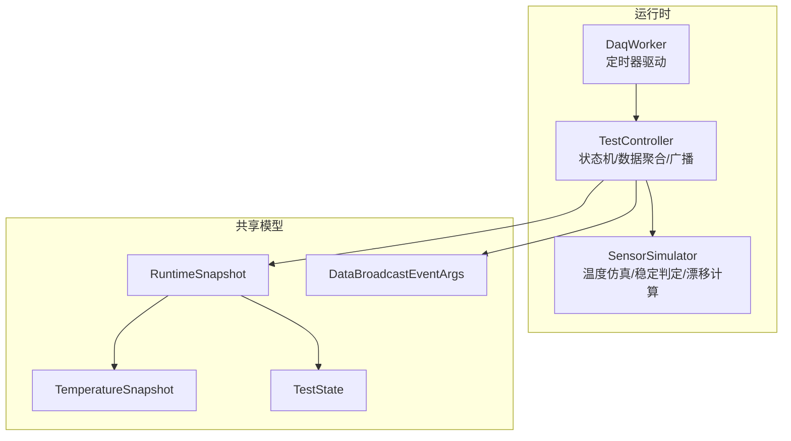
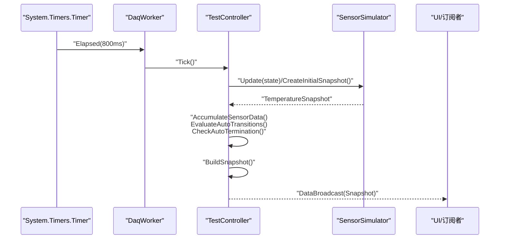
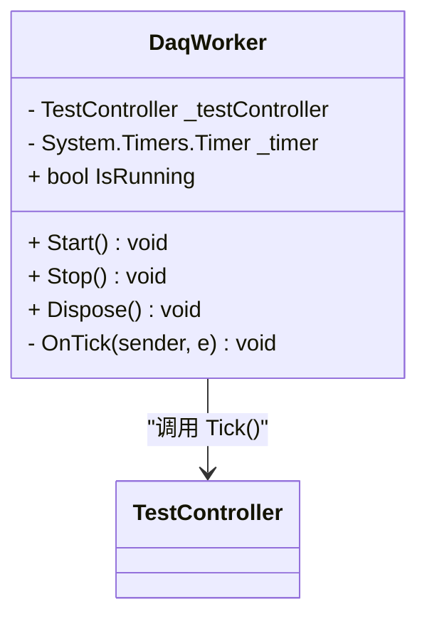
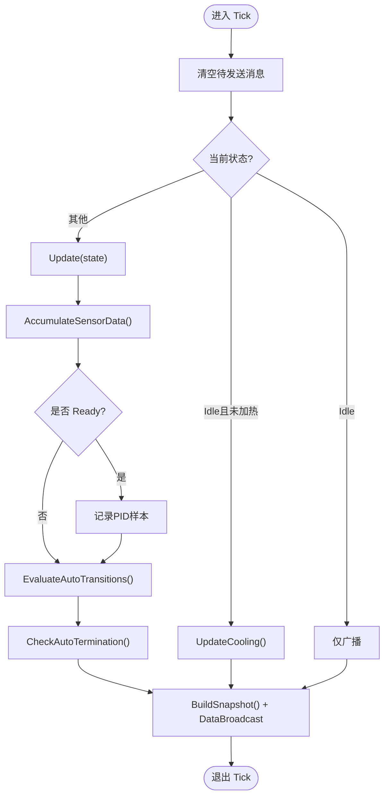
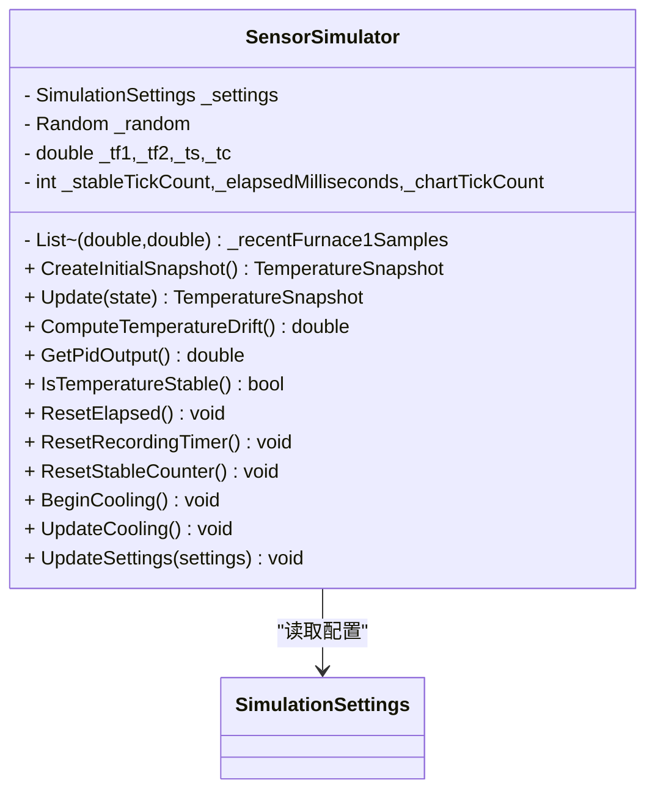
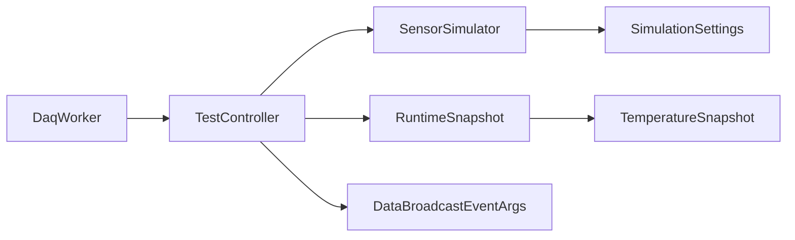

# 数据采集器

<cite>
**本文引用的文件列表**
- [DaqWorker.cs](file://src/ISO11820.App/Runtime/Services/DaqWorker.cs)
- [TestController.cs](file://src/ISO11820.App/Runtime/Controller/TestController.cs)
- [SensorSimulator.cs](file://src/ISO11820.App/Runtime/Services/SensorSimulator.cs)
- [DataBroadcastEventArgs.cs](file://src/ISO11820.App/Shared/Events/DataBroadcastEventArgs.cs)
- [RuntimeSnapshot.cs](file://src/ISO11820.App/Shared/Models/RuntimeSnapshot.cs)
- [TemperatureSnapshot.cs](file://src/ISO11820.Core/Models/TemperatureSnapshot.cs)
- [TestState.cs](file://src/ISO11820.Core/Enums/TestState.cs)
- [IRuntimeClock.cs](file://src/ISO11820.Core/Contracts/IRuntimeClock.cs)
- [AppSettings.cs](file://src/ISO11820.App/Config/AppSettings.cs)
- [TestControllerTests.cs](file://tests/ISO11820.Tests/Runtime/TestControllerTests.cs)
</cite>

## 目录
1. [简介](#简介)
2. [项目结构](#项目结构)
3. [核心组件](#核心组件)
4. [架构总览](#架构总览)
5. [详细组件分析](#详细组件分析)
6. [依赖关系分析](#依赖关系分析)
7. [性能与并发](#性能与并发)
8. [故障排查指南](#故障排查指南)
9. [结论](#结论)
10. [附录](#附录)

## 简介
本文件围绕 DaqWorker 类，系统化阐述定时器驱动的数据采集机制、与 TestController 的协作模式、线程间通信与数据同步策略、错误处理与异常恢复、数据采集生命周期管理（启动、停止、资源清理）、实时数据处理流程（缓冲、格式转换、事件触发），以及多线程环境下的并发控制与性能优化技巧。文档同时给出数据采集精度保证与自动终止条件的实现细节说明。

## 项目结构
该子系统位于应用层 Runtime 服务与控制器的组合中：
- 定时驱动：DaqWorker 使用系统定时器以固定周期触发 Tick
- 控制器：TestController 维护测试状态机、数据缓冲、消息广播与自动终止逻辑
- 仿真模型：SensorSimulator 模拟温度曲线、稳定判定、PID 输出与温漂计算
- 事件与模型：通过 DataBroadcastEventArgs 和 RuntimeSnapshot 将快照推送给 UI 或订阅者
- 配置：SimulationSettings 提供目标温度、升温速率、稳定阈值等参数

图表来源
- [DaqWorker.cs:1-50](file://src/ISO11820.App/Runtime/Services/DaqWorker.cs#L1-L50)
- [TestController.cs:1-328](file://src/ISO11820.App/Runtime/Controller/TestController.cs#L1-L328)
- [SensorSimulator.cs:1-223](file://src/ISO11820.App/Runtime/Services/SensorSimulator.cs#L1-L223)
- [DataBroadcastEventArgs.cs:1-14](file://src/ISO11820.App/Shared/Events/DataBroadcastEventArgs.cs#L1-L14)
- [RuntimeSnapshot.cs:1-12](file://src/ISO11820.App/Shared/Models/RuntimeSnapshot.cs#L1-L12)
- [TemperatureSnapshot.cs:1-10](file://src/ISO11820.Core/Models/TemperatureSnapshot.cs#L1-L10)
- [TestState.cs:1-11](file://src/ISO11820.Core/Enums/TestState.cs#L1-L11)

章节来源
- [DaqWorker.cs:1-50](file://src/ISO11820.App/Runtime/Services/DaqWorker.cs#L1-L50)
- [TestController.cs:1-328](file://src/ISO11820.App/Runtime/Controller/TestController.cs#L1-L328)
- [SensorSimulator.cs:1-223](file://src/ISO11820.App/Runtime/Services/SensorSimulator.cs#L1-L223)
- [DataBroadcastEventArgs.cs:1-14](file://src/ISO11820.App/Shared/Events/DataBroadcastEventArgs.cs#L1-L14)
- [RuntimeSnapshot.cs:1-12](file://src/ISO11820.App/Shared/Models/RuntimeSnapshot.cs#L1-L12)
- [TemperatureSnapshot.cs:1-10](file://src/ISO11820.Core/Models/TemperatureSnapshot.cs#L1-L10)
- [TestState.cs:1-11](file://src/ISO11820.Core/Enums/TestState.cs#L1-L11)

## 核心组件
- DaqWorker：封装 System.Timers.Timer，按固定间隔触发 Tick；对外暴露 Start/Stop/IsRunning/Dispose；在构造时注入 TestController。
- TestController：维护测试状态机（Idle/Preparing/Ready/Recording/Complete），负责每 Tick 的数据采集、状态评估、自动终止判断、消息累积与快照广播；提供用户操作入口（开始加热、停止加热、开始记录、停止记录、复位）。
- SensorSimulator：根据当前状态推进温度仿真，提供稳定判定、PID 输出、最近样本的线性回归温漂计算、冷却与计时更新。
- 事件与模型：DataBroadcastEventArgs 承载 RuntimeSnapshot；RuntimeSnapshot 包含当前状态、温度快照、消息列表、已用秒数与图表时间轴。

章节来源
- [DaqWorker.cs:1-50](file://src/ISO11820.App/Runtime/Services/DaqWorker.cs#L1-L50)
- [TestController.cs:1-328](file://src/ISO11820.App/Runtime/Controller/TestController.cs#L1-L328)
- [SensorSimulator.cs:1-223](file://src/ISO11820.App/Runtime/Services/SensorSimulator.cs#L1-L223)
- [DataBroadcastEventArgs.cs:1-14](file://src/ISO11820.App/Shared/Events/DataBroadcastEventArgs.cs#L1-L14)
- [RuntimeSnapshot.cs:1-12](file://src/ISO11820.App/Shared/Models/RuntimeSnapshot.cs#L1-L12)

## 架构总览
下图展示了从定时器到控制器再到仿真器的事件流与数据流。

图表来源
- [DaqWorker.cs:1-50](file://src/ISO11820.App/Runtime/Services/DaqWorker.cs#L1-L50)
- [TestController.cs:1-328](file://src/ISO11820.App/Runtime/Controller/TestController.cs#L1-L328)
- [SensorSimulator.cs:1-223](file://src/ISO11820.App/Runtime/Services/SensorSimulator.cs#L1-L223)
- [DataBroadcastEventArgs.cs:1-14](file://src/ISO11820.App/Shared/Events/DataBroadcastEventArgs.cs#L1-L14)
- [RuntimeSnapshot.cs:1-12](file://src/ISO11820.App/Shared/Models/RuntimeSnapshot.cs#L1-L12)

## 详细组件分析

### DaqWorker：定时器驱动与生命周期
- 定时器配置
  - 使用 System.Timers.Timer，固定间隔为 800ms，启用 AutoReset 周期性触发。
  - 构造函数注册 Elapsed 回调，内部调用 TestController.Tick()。
- 生命周期方法
  - Start：若未运行则先广播初始状态，再启动定时器并标记运行中。
  - Stop：若运行中则停止定时器并标记未运行。
  - Dispose：释放定时器资源。
- 线程模型
  - Elapsed 回调由定时器线程执行，因此 Tick 在后台线程被调用。
  - IsRunning 用于避免重复启动/停止。

图表来源
- [DaqWorker.cs:1-50](file://src/ISO11820.App/Runtime/Services/DaqWorker.cs#L1-L50)
- [TestController.cs:1-328](file://src/ISO11820.App/Runtime/Controller/TestController.cs#L1-L328)

章节来源
- [DaqWorker.cs:1-50](file://src/ISO11820.App/Runtime/Services/DaqWorker.cs#L1-L50)

### TestController：状态机、数据聚合与广播
- 状态机与用户操作
  - 支持 Idle/Preparing/Ready/Recording/Complete 五种状态。
  - 用户操作包括 StartHeating、StopHeating、StartRecording、StopRecording、CompleteTest、ResetToIdle。
  - 每个操作在锁内变更状态并追加系统消息，随后触发广播。
- Tick 主循环（每 800ms）
  - 清空待发送消息队列。
  - 根据当前状态调用仿真器 Update 或冷却逻辑。
  - 累积传感器数据至缓冲区。
  - Ready 状态下收集 PID 输出样本，用于后续恒定功率估算。
  - 评估自动状态迁移与自动终止条件。
  - 构建快照并通过 DataBroadcast 事件发布。
- 数据缓冲与快照
  - 内部维护一个通道值数组（12 通道，前 5 个填充仿真温度，其余占位）。
  - 每次 Tick 生成一条 SensorDataRecord 加入缓冲区，并提供只读副本访问。
  - BuildSnapshot 聚合状态、温度快照、消息、已用秒数与图表时间。
- 自动终止
  - 60 分钟无条件结束。
  - 在 30/35/40/45/50/55 分钟检查点，若温漂满足阈值则提前结束。
- 常量功率
  - Ready 阶段对 PID 输出进行滑动平均（最多 600 个样本，约 8 分钟），作为 ConstantPower。

图表来源
- [TestController.cs:1-328](file://src/ISO11820.App/Runtime/Controller/TestController.cs#L1-L328)
- [SensorSimulator.cs:1-223](file://src/ISO11820.App/Runtime/Services/SensorSimulator.cs#L1-L223)

章节来源
- [TestController.cs:1-328](file://src/ISO11820.App/Runtime/Controller/TestController.cs#L1-L328)

### SensorSimulator：温度仿真、稳定判定与漂移计算
- 温度推进
  - Preparing：线性升温直至接近目标温度，随后钳位到目标温度附近。
  - Ready：钳位到目标温度并叠加噪声。
  - Recording：表面温与中心温指数逼近炉温，同时累计已用秒数与图表计数。
  - Complete：保持稳定推进。
- 稳定判定
  - 基于目标温度与稳定阈值窗口，连续多次采样满足即认为稳定。
- 温漂计算
  - 维护最近 N 个炉温1样本，使用线性回归计算斜率（°C/s）。
- PID 输出
  - 返回带噪声的近似恒定值，用于恒定功率估算。
- 重置与冷却
  - ResetElapsed/ResetRecordingTimer/ResetStableCounter 用于状态复位。
  - BeginCooling/UpdateCooling 用于非加热场景的温度回落。

图表来源
- [SensorSimulator.cs:1-223](file://src/ISO11820.App/Runtime/Services/SensorSimulator.cs#L1-L223)
- [AppSettings.cs:57-70](file://src/ISO11820.App/Config/AppSettings.cs#L57-L70)

章节来源
- [SensorSimulator.cs:1-223](file://src/ISO11820.App/Runtime/Services/SensorSimulator.cs#L1-L223)
- [AppSettings.cs:57-70](file://src/ISO11820.App/Config/AppSettings.cs#L57-L70)

### 事件与数据模型
- DataBroadcastEventArgs：封装一次广播携带的 RuntimeSnapshot。
- RuntimeSnapshot：包含当前状态、温度快照、消息列表、已用秒数与图表时间。
- TemperatureSnapshot：包含各通道温度与已用秒数。
- TestState：枚举定义测试状态。

章节来源
- [DataBroadcastEventArgs.cs:1-14](file://src/ISO11820.App/Shared/Events/DataBroadcastEventArgs.cs#L1-L14)
- [RuntimeSnapshot.cs:1-12](file://src/ISO11820.App/Shared/Models/RuntimeSnapshot.cs#L1-L12)
- [TemperatureSnapshot.cs:1-10](file://src/ISO11820.Core/Models/TemperatureSnapshot.cs#L1-L10)
- [TestState.cs:1-11](file://src/ISO11820.Core/Enums/TestState.cs#L1-L11)

## 依赖关系分析
- 直接依赖
  - DaqWorker 依赖 TestController（调用 Tick）。
  - TestController 依赖 SensorSimulator（仿真与数据）、SimulationSettings（配置）。
  - TestController 通过 DataBroadcast 事件向外部（如 UI）推送 RuntimeSnapshot。
- 间接依赖
  - SensorSimulator 依赖 MathNet.Numerics 进行线性回归（温漂计算）。
  - 所有模型类型来自 Core 命名空间，确保跨层一致性。

图表来源
- [DaqWorker.cs:1-50](file://src/ISO11820.App/Runtime/Services/DaqWorker.cs#L1-L50)
- [TestController.cs:1-328](file://src/ISO11820.App/Runtime/Controller/TestController.cs#L1-L328)
- [SensorSimulator.cs:1-223](file://src/ISO11820.App/Runtime/Services/SensorSimulator.cs#L1-L223)
- [RuntimeSnapshot.cs:1-12](file://src/ISO11820.App/Shared/Models/RuntimeSnapshot.cs#L1-L12)
- [TemperatureSnapshot.cs:1-10](file://src/ISO11820.Core/Models/TemperatureSnapshot.cs#L1-L10)
- [DataBroadcastEventArgs.cs:1-14](file://src/ISO11820.App/Shared/Events/DataBroadcastEventArgs.cs#L1-L14)
- [AppSettings.cs:57-70](file://src/ISO11820.App/Config/AppSettings.cs#L57-L70)

章节来源
- [DaqWorker.cs:1-50](file://src/ISO11820.App/Runtime/Services/DaqWorker.cs#L1-L50)
- [TestController.cs:1-328](file://src/ISO11820.App/Runtime/Controller/TestController.cs#L1-L328)
- [SensorSimulator.cs:1-223](file://src/ISO11820.App/Runtime/Services/SensorSimulator.cs#L1-L223)
- [AppSettings.cs:57-70](file://src/ISO11820.App/Config/AppSettings.cs#L57-L70)

## 性能与并发
- 定时器精度与调度
  - 使用 System.Timers.Timer，默认精度受系统调度影响。建议在高精度需求场景考虑高精度定时器或硬件时钟源。
- 锁粒度与临界区
  - TestController 使用单一对象锁保护状态机、消息队列、PID 样本队列与传感器数据缓冲，避免竞态条件。
  - SensorSimulator 对温漂样本集合使用独立锁，降低热点竞争。
- 数据结构选择
  - PID 输出使用 Queue<double> 限制最大长度，避免内存增长。
  - 传感器数据缓冲使用 List<SensorDataRecord>，对外提供只读副本，减少写放大。
- CPU 与 I/O
  - 每 800ms 进行一次轻量级计算（温度推进、稳定判定、线性回归），CPU 开销可控。
  - 如需持久化，建议在 UI 或后台任务中异步落盘，避免阻塞 Tick。
- 可观测性
  - 通过 DataBroadcast 事件持续推送快照，便于 UI 渲染与监控。
- 扩展建议
  - 引入 IRuntimeClock 抽象替换 DateTime.Now，提升可测试性与时间一致性。
  - 将广播事件改为无锁环形缓冲或生产者-消费者队列，进一步解耦 UI 渲染与采集节拍。

章节来源
- [TestController.cs:1-328](file://src/ISO11820.App/Runtime/Controller/TestController.cs#L1-L328)
- [SensorSimulator.cs:1-223](file://src/ISO11820.App/Runtime/Services/SensorSimulator.cs#L1-L223)
- [IRuntimeClock.cs:1-7](file://src/ISO11820.Core/Contracts/IRuntimeClock.cs#L1-L7)

## 故障排查指南
- 常见问题定位
  - 定时器未触发：检查 DaqWorker.Start 是否被调用，IsRunning 是否为 true，定时器是否被意外释放。
  - 状态不变化：确认用户操作是否符合 CanXxx 约束；查看 Tick 中的 EvaluateAutoTransitions 与稳定判定阈值。
  - 数据缺失：检查 AccumulateSensorData 是否被调用，确认通道映射是否正确。
  - 广播丢失：确认 UI 是否订阅 DataBroadcast 事件，是否存在异常导致事件中断。
- 日志与消息
  - 关注 TransitionTo 生成的系统消息，结合 DataBroadcast 中的 Messages 字段进行诊断。
- 自动终止行为
  - 核对 CheckAutoTermination 的检查点与温漂阈值，必要时调整 SimulationSettings 的稳定阈值与波动幅度。
- 单元测试参考
  - 参考 TestControllerTests 中对状态迁移、广播内容与时间戳断言的用例，复现问题路径。

章节来源
- [TestController.cs:1-328](file://src/ISO11820.App/Runtime/Controller/TestController.cs#L1-L328)
- [TestControllerTests.cs:1-265](file://tests/ISO11820.Tests/Runtime/TestControllerTests.cs#L1-L265)

## 结论
DaqWorker 以 800ms 定时器驱动数据采集节拍，TestController 作为核心协调器完成状态机推进、数据聚合、自动终止与事件广播。SensorSimulator 提供稳定的温度仿真与温漂计算能力。整体设计清晰、职责分离良好，具备可扩展性与可测试性。通过合理的锁粒度与数据结构选择，系统在多线程环境下保持稳定与高效。

## 附录

### 数据采集生命周期管理
- 启动
  - 创建 DaqWorker 并调用 Start，内部会广播初始快照，然后启动定时器。
- 运行
  - 每 800ms 触发 Tick，控制器更新仿真、累积数据、评估状态与终止条件，并发布快照。
- 停止
  - 调用 Stop 停止定时器，释放资源后不再产生新数据。
- 清理
  - 调用 Dispose 释放定时器句柄；必要时调用 ResetToIdle 清空缓冲与计时。

章节来源
- [DaqWorker.cs:1-50](file://src/ISO11820.App/Runtime/Services/DaqWorker.cs#L1-L50)
- [TestController.cs:1-328](file://src/ISO11820.App/Runtime/Controller/TestController.cs#L1-L328)

### 实时数据处理流程
- 数据缓冲
  - 每 Tick 生成一条 SensorDataRecord，包含时间戳与 12 通道值（前 5 通道为仿真温度）。
- 格式转换
  - 将仿真器输出的 TemperatureSnapshot 映射为通道数组，供上层统一消费。
- 事件触发
  - 构建 RuntimeSnapshot 并通过 DataBroadcast 事件推送，UI 订阅后刷新显示。

章节来源
- [TestController.cs:1-328](file://src/ISO11820.App/Runtime/Controller/TestController.cs#L1-L328)
- [DataBroadcastEventArgs.cs:1-14](file://src/ISO11820.App/Shared/Events/DataBroadcastEventArgs.cs#L1-L14)
- [RuntimeSnapshot.cs:1-12](file://src/ISO11820.App/Shared/Models/RuntimeSnapshot.cs#L1-L12)
- [TemperatureSnapshot.cs:1-10](file://src/ISO11820.Core/Models/TemperatureSnapshot.cs#L1-L10)

### 并发控制与性能优化要点
- 单锁保护关键状态，避免细粒度锁带来的复杂性。
- 使用有界队列限制 PID 样本数量，防止内存泄漏。
- 对外暴露只读快照，避免订阅者修改内部状态。
- 将重 I/O 移出 Tick 路径，采用异步写入。

章节来源
- [TestController.cs:1-328](file://src/ISO11820.App/Runtime/Controller/TestController.cs#L1-L328)
- [SensorSimulator.cs:1-223](file://src/ISO11820.App/Runtime/Services/SensorSimulator.cs#L1-L223)

### 数据采集精度与异常恢复
- 精度保证
  - 温度推进与噪声幅度由 SimulationSettings 控制，可通过调参平衡稳定性与真实性。
  - 温漂计算基于最近样本线性回归，样本窗口大小影响灵敏度与鲁棒性。
- 异常恢复
  - 状态机幂等：重复操作不会引发非法状态。
  - 自动终止保障：60 分钟强制结束，避免长时间运行风险。
  - 复位能力：ResetToIdle 可快速回到初始状态，清空缓冲与计时。

章节来源
- [AppSettings.cs:57-70](file://src/ISO11820.App/Config/AppSettings.cs#L57-L70)
- [SensorSimulator.cs:1-223](file://src/ISO11820.App/Runtime/Services/SensorSimulator.cs#L1-L223)
- [TestController.cs:1-328](file://src/ISO11820.App/Runtime/Controller/TestController.cs#L1-L328)