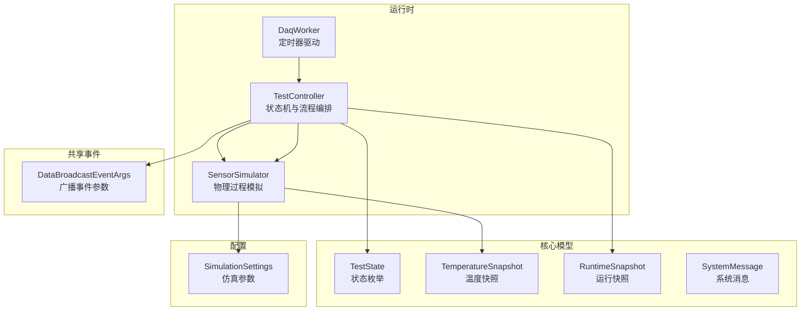
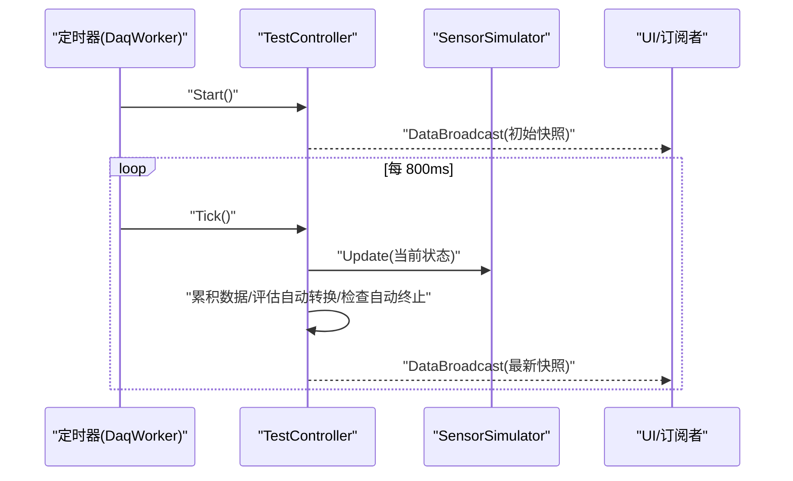
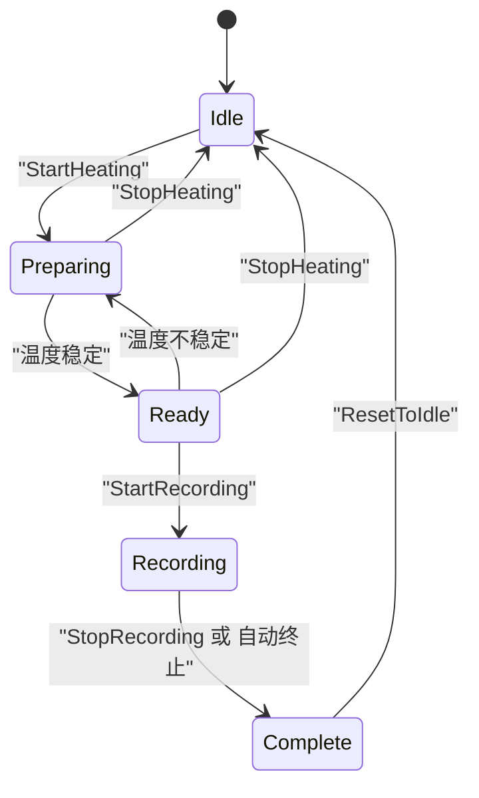
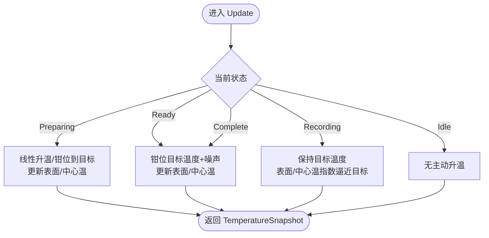
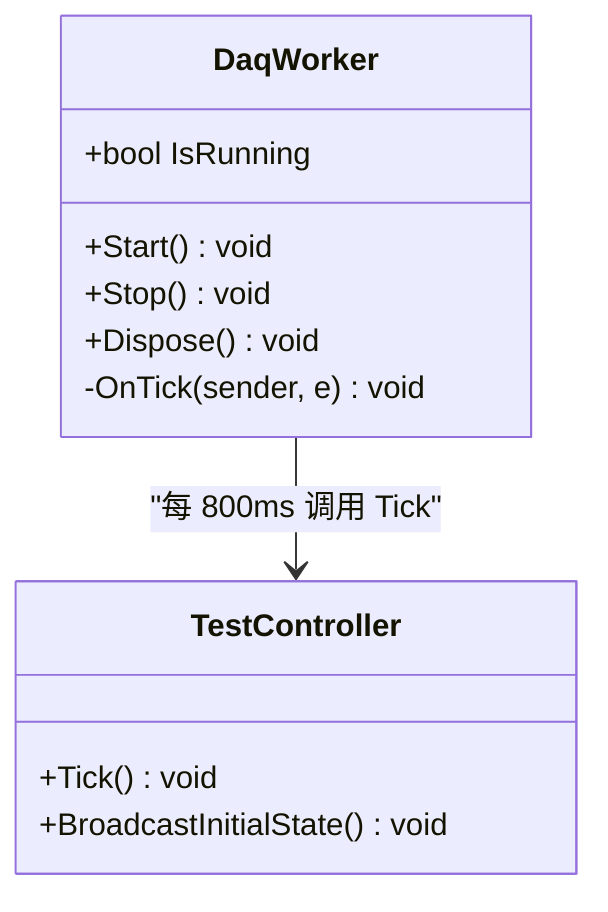
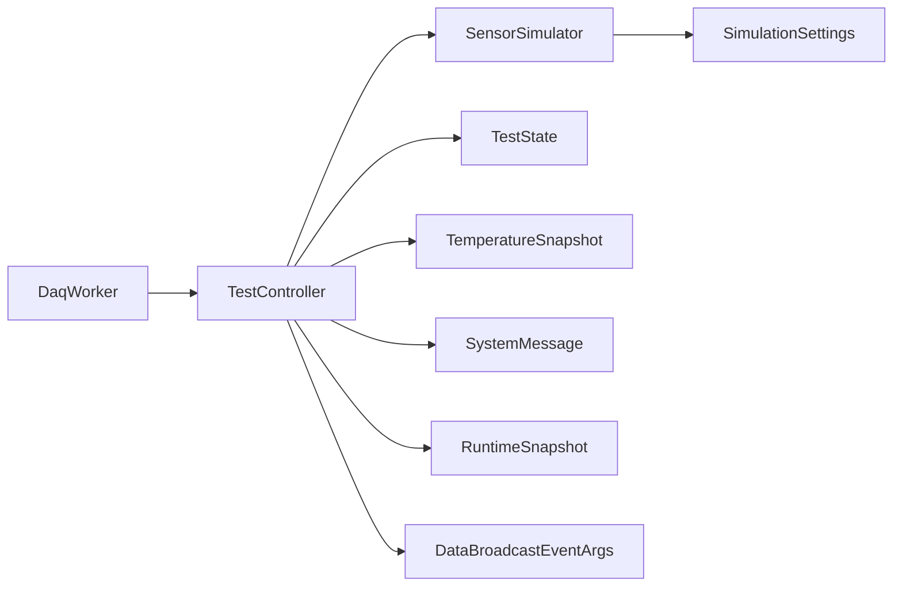

# 核心模块

<cite>
**本文引用的文件**
- [TestController.cs](file://src/ISO11820.App/Runtime/Controller/TestController.cs)
- [SensorSimulator.cs](file://src/ISO11820.App/Runtime/Services/SensorSimulator.cs)
- [DaqWorker.cs](file://src/ISO11820.App/Runtime/Services/DaqWorker.cs)
- [TestState.cs](file://src/ISO11820.Core/Enums/TestState.cs)
- [TemperatureSnapshot.cs](file://src/ISO11820.Core/Models/TemperatureSnapshot.cs)
- [RuntimeSnapshot.cs](file://src/ISO11820.App/Shared/Models/RuntimeSnapshot.cs)
- [DataBroadcastEventArgs.cs](file://src/ISO11820.App/Shared/Events/DataBroadcastEventArgs.cs)
- [SystemMessage.cs](file://src/ISO11820.Core/Models/SystemMessage.cs)
- [AppSettings.cs](file://src/ISO11820.App/Config/AppSettings.cs)
- [CsvSampleWriter.cs](file://src/ISO11820.App/Infrastructure/FileStorage/CsvSampleWriter.cs)
- [TestControllerTests.cs](file://tests/ISO11820.Tests/Runtime/TestControllerTests.cs)
- [SensorSimulatorTests.cs](file://tests/ISO11820.Tests/Runtime/SensorSimulatorTests.cs)
</cite>

## 目录
1. [简介](#简介)
2. [项目结构](#项目结构)
3. [核心组件](#核心组件)
4. [架构总览](#架构总览)
5. [详细组件分析](#详细组件分析)
6. [依赖关系分析](#依赖关系分析)
7. [性能考虑](#性能考虑)
8. [故障排查指南](#故障排查指南)
9. [结论](#结论)
10. [附录](#附录)

## 简介
本文件聚焦 ISO 11820 系统的三个核心运行时模块：TestController（状态机与流程编排）、SensorSimulator（物理过程模拟算法）与 DaqWorker（定时数据采集驱动）。文档将深入解释各模块的职责、接口定义、使用模式、配置选项与返回值，并通过实际代码路径给出示例。同时提供架构图、时序图与流程图，帮助初学者快速上手，也为有经验的开发者提供足够的技术深度。重点关注温度控制算法、传感器模拟精度和实时数据处理性能。

## 项目结构
核心模块位于应用层 Runtime 目录，配合 Core 层的枚举与模型，以及共享事件与快照模型，形成清晰的职责边界：
- TestController：测试流程的状态机与用户操作入口，协调仿真与数据广播。
- SensorSimulator：基于配置的炉温、表面温、中心温等物理量演进算法，并提供稳定判定与温漂计算。
- DaqWorker：定时器驱动，周期性触发控制器 Tick，实现“采集—处理—广播”的闭环。

图表来源
- [TestController.cs:1-328](file://src/ISO11820.App/Runtime/Controller/TestController.cs#L1-L328)
- [SensorSimulator.cs:1-223](file://src/ISO11820.App/Runtime/Services/SensorSimulator.cs#L1-L223)
- [DaqWorker.cs:1-50](file://src/ISO11820.App/Runtime/Services/DaqWorker.cs#L1-L50)
- [TestState.cs:1-11](file://src/ISO11820.Core/Enums/TestState.cs#L1-L11)
- [TemperatureSnapshot.cs:1-10](file://src/ISO11820.Core/Models/TemperatureSnapshot.cs#L1-L10)
- [RuntimeSnapshot.cs:1-12](file://src/ISO11820.App/Shared/Models/RuntimeSnapshot.cs#L1-L12)
- [DataBroadcastEventArgs.cs:1-14](file://src/ISO11820.App/Shared/Events/DataBroadcastEventArgs.cs#L1-L14)
- [SystemMessage.cs:1-4](file://src/ISO11820.Core/Models/SystemMessage.cs#L1-L4)
- [AppSettings.cs:57-70](file://src/ISO11820.App/Config/AppSettings.cs#L57-L70)

章节来源
- [TestController.cs:1-328](file://src/ISO11820.App/Runtime/Controller/TestController.cs#L1-L328)
- [SensorSimulator.cs:1-223](file://src/ISO11820.App/Runtime/Services/SensorSimulator.cs#L1-L223)
- [DaqWorker.cs:1-50](file://src/ISO11820.App/Runtime/Services/DaqWorker.cs#L1-L50)
- [TestState.cs:1-11](file://src/ISO11820.Core/Enums/TestState.cs#L1-L11)
- [TemperatureSnapshot.cs:1-10](file://src/ISO11820.Core/Models/TemperatureSnapshot.cs#L1-L10)
- [RuntimeSnapshot.cs:1-12](file://src/ISO11820.App/Shared/Models/RuntimeSnapshot.cs#L1-L12)
- [DataBroadcastEventArgs.cs:1-14](file://src/ISO11820.App/Shared/Events/DataBroadcastEventArgs.cs#L1-L14)
- [SystemMessage.cs:1-4](file://src/ISO11820.Core/Models/SystemMessage.cs#L1-L4)
- [AppSettings.cs:57-70](file://src/ISO11820.App/Config/AppSettings.cs#L57-L70)

## 核心组件
本节概述三大核心组件的职责与交互方式，并给出关键接口与返回值的说明。

- TestController
  - 职责：维护测试状态机；接收 UI 或外部调用发起升温、停止、开始记录、停止记录、完成试验等操作；在每周期 Tick 中推进仿真、累积数据、评估自动转换与终止条件；对外广播运行快照。
  - 关键接口与行为：
    - 启动/停止加热：StartHeating、StopHeating
    - 开始/停止记录：StartRecording、StopRecording
    - 完成试验：CompleteTest
    - 复位：ResetToIdle
    - 更新仿真参数：UpdateSimulationSettings
    - 周期驱动：Tick（由 DaqWorker 每 800ms 调用）
    - 查询：GetTemperatureDrift、ConstantPower、SensorDataBuffer
    - 事件：DataBroadcast（携带 RuntimeSnapshot）
  - 返回值与副作用：
    - 通过 DataBroadcast 事件推送当前状态、温度快照、系统消息、已用秒数与图表时间轴。
    - 内部缓冲最近 PID 输出样本以计算 ConstantPower（Ready 阶段平均）。
    - 内部缓存最近采样点用于温漂线性回归。

- SensorSimulator
  - 职责：根据 SimulationSettings 模拟炉温1/炉温2、表面温、中心温随时间的变化；提供稳定判定、温漂计算、冷却逻辑与 PID 输出模拟。
  - 关键接口与行为：
    - Update(state)：按当前状态推进物理过程，返回 TemperatureSnapshot
    - CreateInitialSnapshot()：生成初始快照
    - IsTemperatureStable()：判断是否达到稳定窗口
    - ComputeTemperatureDrift()：基于最近 N 个炉温1样本进行线性回归求斜率（°C/s）
    - GetPidOutput()：返回模拟的 PID 输出值
    - UpdateCooling()：冷却阶段降温
    - Reset* 系列：重置计时器、稳定计数、累计样本等
  - 复杂度与精度：
    - 温漂计算使用固定长度滑动窗口（默认最多 20 个点），每次回归 O(N)，N 较小，开销可控。
    - 噪声幅度由 TempFluctuation 控制，影响稳定判定与曲线平滑度。

- DaqWorker
  - 职责：封装 System.Timers.Timer，以固定间隔（800ms）触发 TestController.Tick，并在启动时广播初始状态。
  - 生命周期：Start/Stop/Dispose；IsRunning 指示运行状态。

章节来源
- [TestController.cs:1-328](file://src/ISO11820.App/Runtime/Controller/TestController.cs#L1-L328)
- [SensorSimulator.cs:1-223](file://src/ISO11820.App/Runtime/Services/SensorSimulator.cs#L1-L223)
- [DaqWorker.cs:1-50](file://src/ISO11820.App/Runtime/Services/DaqWorker.cs#L1-L50)

## 架构总览
下图展示了从定时器到状态机再到仿真器的完整数据流与控制流，以及对外广播的运行快照。

图表来源
- [DaqWorker.cs:23-48](file://src/ISO11820.App/Runtime/Services/DaqWorker.cs#L23-L48)
- [TestController.cs:169-213](file://src/ISO11820.App/Runtime/Controller/TestController.cs#L169-L213)
- [SensorSimulator.cs:46-79](file://src/ISO11820.App/Runtime/Services/SensorSimulator.cs#L46-L79)

## 详细组件分析

### TestController 状态机与流程编排
- 状态定义
  - Idle：空闲，可启动加热
  - Preparing：升温中，等待温度稳定
  - Ready：温度稳定，可开始记录
  - Recording：记录中，支持提前终止或满时长终止
  - Complete：结束
- 状态转换规则
  - Idle → Preparing：用户调用 StartHeating
  - Preparing → Ready：温度连续多周期处于目标温度±阈值范围内
  - Ready → Preparing：温度波动超出稳定范围
  - Ready → Recording：用户调用 StartRecording
  - Recording → Complete：用户 StopRecording 或自动终止条件满足
  - 任意状态 → Idle：用户调用 ResetToIdle
- 自动终止策略
  - 60 分钟无条件结束
  - 30/35/40/45/50/55 分钟检查点：若 10 分钟温漂 ≤ 0.5°C，则提前结束
- 数据与消息
  - 每周期累积一次传感器数据（包含通道映射）
  - 每次状态变更追加一条系统消息
  - 通过 DataBroadcast 事件推送 RuntimeSnapshot

图表来源
- [TestController.cs:57-156](file://src/ISO11820.App/Runtime/Controller/TestController.cs#L57-L156)
- [TestController.cs:248-302](file://src/ISO11820.App/Runtime/Controller/TestController.cs#L248-L302)
- [TestState.cs:1-11](file://src/ISO11820.Core/Enums/TestState.cs#L1-L11)

章节来源
- [TestController.cs:1-328](file://src/ISO11820.App/Runtime/Controller/TestController.cs#L1-L328)
- [TestState.cs:1-11](file://src/ISO11820.Core/Enums/TestState.cs#L1-L11)

### SensorSimulator 物理过程模拟算法
- 初始化
  - 基于 SimulationSettings 设置起始温度、目标温度、升温速率、稳定阈值与温度波动幅度
  - 表面温与中心温初始化为炉温的一定比例
- 阶段推进
  - Preparing：线性升温至接近目标温度后钳位；表面温与中心温跟随炉温按比例演化
  - Ready：炉温钳位在目标温度附近，叠加噪声；表面温与中心温继续逼近各自目标
  - Recording：炉温保持目标温度，表面温与中心温指数逼近更高目标（上限限制）
  - Idle：不主动升温；可选冷却（由控制器调用 UpdateCooling）
- 稳定判定
  - 当炉温落在目标温度±阈值区间内且连续多个周期满足，则认为稳定
- 温漂计算
  - 使用最近 N 个炉温1样本进行线性回归，返回斜率（°C/s）
- PID 输出模拟
  - 返回围绕恒定值的随机扰动，供控制器在 Ready 阶段统计平均作为 ConstantPower

图表来源
- [SensorSimulator.cs:46-79](file://src/ISO11820.App/Runtime/Services/SensorSimulator.cs#L46-L79)
- [SensorSimulator.cs:163-209](file://src/ISO11820.App/Runtime/Services/SensorSimulator.cs#L163-L209)
- [SensorSimulator.cs:147-158](file://src/ISO11820.App/Runtime/Services/SensorSimulator.cs#L147-L158)
- [SensorSimulator.cs:84-97](file://src/ISO11820.App/Runtime/Services/SensorSimulator.cs#L84-L97)

章节来源
- [SensorSimulator.cs:1-223](file://src/ISO11820.App/Runtime/Services/SensorSimulator.cs#L1-L223)
- [AppSettings.cs:57-70](file://src/ISO11820.App/Config/AppSettings.cs#L57-L70)

### DaqWorker 数据采集机制
- 定时器驱动
  - 固定间隔 800ms，AutoReset=true，循环触发 OnTick
- 生命周期管理
  - Start：首次广播初始状态，然后启动定时器
  - Stop：停止定时器
  - Dispose：释放定时器资源
- 与控制器协作
  - 仅负责调度，不关心业务细节；所有状态推进与数据聚合均在 TestController 中完成

图表来源
- [DaqWorker.cs:1-50](file://src/ISO11820.App/Runtime/Services/DaqWorker.cs#L1-L50)
- [TestController.cs:206-213](file://src/ISO11820.App/Runtime/Controller/TestController.cs#L206-L213)

章节来源
- [DaqWorker.cs:1-50](file://src/ISO11820.App/Runtime/Services/DaqWorker.cs#L1-L50)

## 依赖关系分析
- 组件耦合
  - DaqWorker 强依赖 TestController（构造注入）
  - TestController 依赖 SensorSimulator（构造注入）
  - 三者均依赖 Core 层的枚举与模型（TestState、TemperatureSnapshot、SystemMessage）
  - 共享事件 DataBroadcastEventArgs 承载 RuntimeSnapshot 向 UI 或其他订阅者传递
- 外部依赖
  - MathNet.Numerics 用于线性回归（温漂计算）
  - System.Timers.Timer 用于定时驱动
- 可能的循环依赖
  - 当前为单向依赖链，未发现循环引用

图表来源
- [DaqWorker.cs:1-50](file://src/ISO11820.App/Runtime/Services/DaqWorker.cs#L1-L50)
- [TestController.cs:1-328](file://src/ISO11820.App/Runtime/Controller/TestController.cs#L1-L328)
- [SensorSimulator.cs:1-223](file://src/ISO11820.App/Runtime/Services/SensorSimulator.cs#L1-L223)
- [TestState.cs:1-11](file://src/ISO11820.Core/Enums/TestState.cs#L1-L11)
- [TemperatureSnapshot.cs:1-10](file://src/ISO11820.Core/Models/TemperatureSnapshot.cs#L1-L10)
- [SystemMessage.cs:1-4](file://src/ISO11820.Core/Models/SystemMessage.cs#L1-L4)
- [RuntimeSnapshot.cs:1-12](file://src/ISO11820.App/Shared/Models/RuntimeSnapshot.cs#L1-L12)
- [DataBroadcastEventArgs.cs:1-14](file://src/ISO11820.App/Shared/Events/DataBroadcastEventArgs.cs#L1-L14)
- [AppSettings.cs:57-70](file://src/ISO11820.App/Config/AppSettings.cs#L57-L70)

章节来源
- [DaqWorker.cs:1-50](file://src/ISO11820.App/Runtime/Services/DaqWorker.cs#L1-L50)
- [TestController.cs:1-328](file://src/ISO11820.App/Runtime/Controller/TestController.cs#L1-L328)
- [SensorSimulator.cs:1-223](file://src/ISO11820.App/Runtime/Services/SensorSimulator.cs#L1-L223)

## 性能考虑
- 定时器周期
  - 800ms 周期兼顾实时性与 CPU 占用；如需更高刷新频率，需权衡 UI 渲染与后台计算压力
- 数据缓冲
  - TestController 内部维护 PID 输出队列（最大 600 项）与传感器数据缓冲区；注意内存增长与清理策略
- 温漂计算
  - 固定窗口线性回归，窗口大小适中；避免频繁扩容与大量分配
- 并发安全
  - 关键临界区使用锁保护；确保多线程环境下状态一致性与事件一致性
- I/O 与导出
  - 传感器数据可通过 CsvSampleWriter 写入磁盘；建议异步落盘与批处理以降低主线程阻塞

[本节为通用性能指导，无需具体文件引用]

## 故障排查指南
- 现象：状态无法从 Preparing 切换到 Ready
  - 可能原因：温度未达到稳定阈值或噪声过大导致稳定计数未达标
  - 排查要点：检查 SimulationSettings 的 TargetTemperature、StableThreshold、TempFluctuation；确认 IsTemperatureStable 判定逻辑
  - 参考用例：[测试用例：稳定需要多次连续稳定周期:87-104](file://tests/ISO11820.Tests/Runtime/SensorSimulatorTests.cs#L87-L104)
- 现象：记录阶段提前结束或延迟结束
  - 可能原因：自动终止检查点命中（温漂≤0.5°C/10min）或 60 分钟到达
  - 排查要点：查看 ComputeTemperatureDrift 结果与 ElapsedSeconds 变化
  - 参考用例：[测试用例：ElapsedSeconds 递增:107-126](file://tests/ISO11820.Tests/Runtime/SensorSimulatorTests.cs#L107-L126)
- 现象：UI 未收到数据广播
  - 可能原因：未订阅 DataBroadcast 事件或订阅时机晚于首次广播
  - 排查要点：确保在 DaqWorker.Start 前或 BroadcastInitialState 前完成订阅
  - 参考用例：[测试用例：广播包含初始快照:171-182](file://tests/ISO11820.Tests/Runtime/TestControllerTests.cs#L171-L182)
- 现象：ConstantPower 异常
  - 可能原因：Ready 阶段过短或 PID 输出波动过大
  - 排查要点：观察 GetPidOutput 与队列长度；适当调整 TempFluctuation
- 现象：冷却无效或降温过慢
  - 可能原因：UpdateCooling 步长与噪声设置不当
  - 排查要点：检查 UpdateCooling 逻辑与 Settings 中的波动参数
  - 参考用例：[测试用例：冷却降低炉温:180-196](file://tests/ISO11820.Tests/Runtime/SensorSimulatorTests.cs#L180-L196)

章节来源
- [SensorSimulatorTests.cs:87-104](file://tests/ISO11820.Tests/Runtime/SensorSimulatorTests.cs#L87-L104)
- [SensorSimulatorTests.cs:107-126](file://tests/ISO11820.Tests/Runtime/SensorSimulatorTests.cs#L107-L126)
- [TestControllerTests.cs:171-182](file://tests/ISO11820.Tests/Runtime/TestControllerTests.cs#L171-L182)
- [SensorSimulatorTests.cs:180-196](file://tests/ISO11820.Tests/Runtime/SensorSimulatorTests.cs#L180-L196)

## 结论
TestController、SensorSimulator 与 DaqWorker 共同构成了 ISO 11820 系统的核心运行时：定时器驱动、状态机编排与物理过程模拟三者解耦清晰、职责明确。通过合理的配置与参数调优，可实现稳定的温度控制、精确的传感器模拟与高效的实时数据处理。建议在工程实践中结合测试用例验证关键路径，并根据实际硬件特性微调噪声与步进参数，以获得更贴近真实设备的表现。

[本节为总结性内容，无需具体文件引用]

## 附录

### 配置选项与参数说明
- SimulationSettings
  - EnableSimulation：是否启用仿真
  - StartTemperature：起始温度
  - HeatingRatePerSecond：每秒升温速率
  - TargetTemperature：目标温度
  - StableThreshold：稳定阈值（±）
  - TempFluctuation：温度波动幅度（噪声）
- HardwareSettings
  - ConstPower：恒功率基准
  - PidTemperature：PID 目标温度（用于硬件侧参考）
- 其他
  - OutputSettings / FileStorageSettings / ReportSettings：输出与报告路径配置

章节来源
- [AppSettings.cs:57-70](file://src/ISO11820.App/Config/AppSettings.cs#L57-L70)
- [AppSettings.cs:119-123](file://src/ISO11820.App/Config/AppSettings.cs#L119-L123)

### 数据结构与接口摘要
- TemperatureSnapshot
  - 字段：Furnace1、Furnace2、Surface、Center、Calibration、ElapsedSeconds
- RuntimeSnapshot
  - 字段：State、Temperatures、Messages、ElapsedSeconds、ChartElapsedSeconds
- DataBroadcastEventArgs
  - 字段：Snapshot（RuntimeSnapshot）
- SensorDataRecord
  - 用途：每周期采集的传感器数据记录（含时间戳与通道值数组）
  - 参考路径：[CsvSampleWriter.cs:75-75](file://src/ISO11820.App/Infrastructure/FileStorage/CsvSampleWriter.cs#L75-L75)

章节来源
- [TemperatureSnapshot.cs:1-10](file://src/ISO11820.Core/Models/TemperatureSnapshot.cs#L1-L10)
- [RuntimeSnapshot.cs:1-12](file://src/ISO11820.App/Shared/Models/RuntimeSnapshot.cs#L1-L12)
- [DataBroadcastEventArgs.cs:1-14](file://src/ISO11820.App/Shared/Events/DataBroadcastEventArgs.cs#L1-L14)
- [CsvSampleWriter.cs:75-75](file://src/ISO11820.App/Infrastructure/FileStorage/CsvSampleWriter.cs#L75-L75)

### 使用模式与示例路径
- 基本流程
  - 创建 SimulationSettings → 构建 SensorSimulator → 构建 TestController → 启动 DaqWorker
  - 订阅 DataBroadcast 事件获取运行快照
  - 调用 StartHeating → 等待 Ready → StartRecording → 监控自动终止或手动 StopRecording
- 示例路径
  - 控制器用法与断言：[TestControllerTests.cs:1-200](file://tests/ISO11820.Tests/Runtime/TestControllerTests.cs#L1-L200)
  - 仿真器用法与断言：[SensorSimulatorTests.cs:1-200](file://tests/ISO11820.Tests/Runtime/SensorSimulatorTests.cs#L1-L200)

章节来源
- [TestControllerTests.cs:1-200](file://tests/ISO11820.Tests/Runtime/TestControllerTests.cs#L1-L200)
- [SensorSimulatorTests.cs:1-200](file://tests/ISO11820.Tests/Runtime/SensorSimulatorTests.cs#L1-L200)