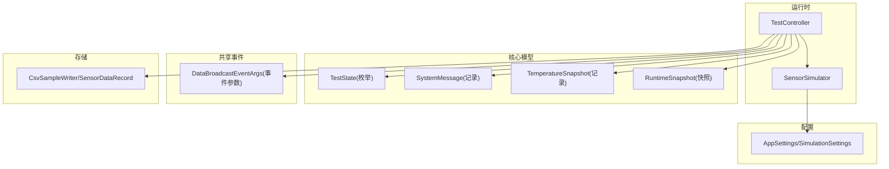
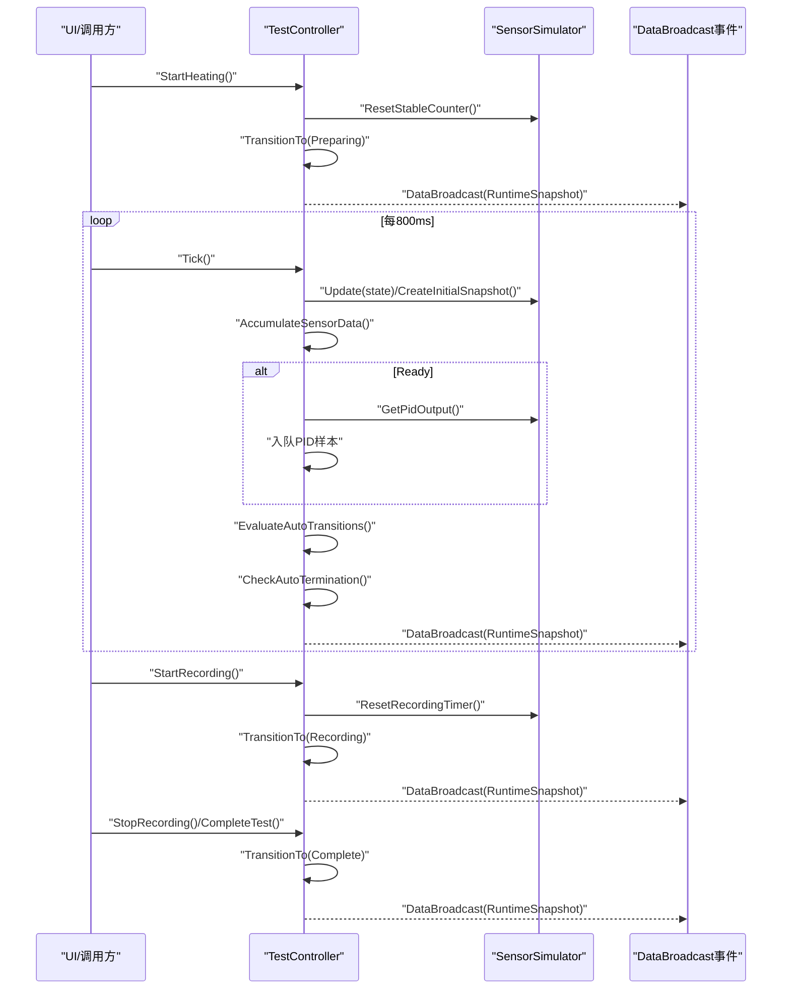
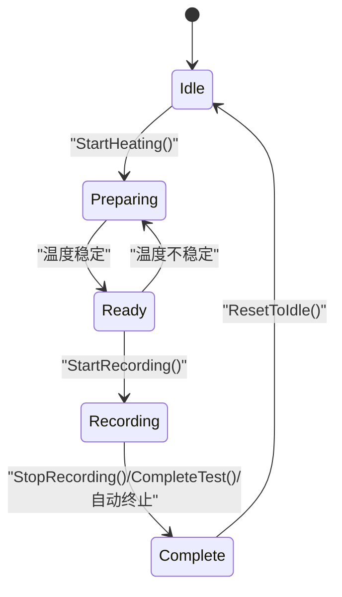
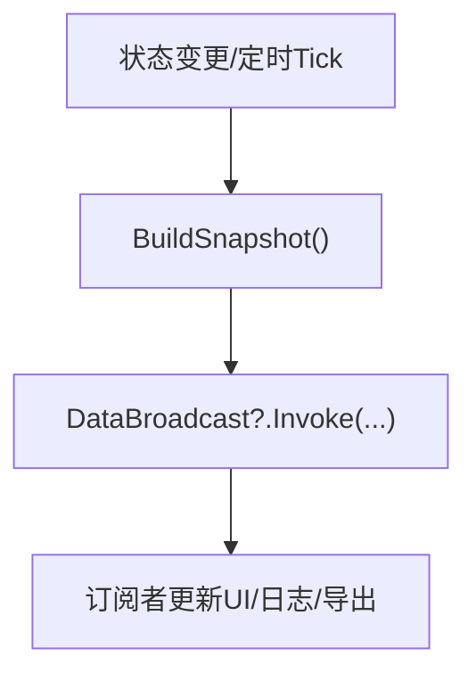
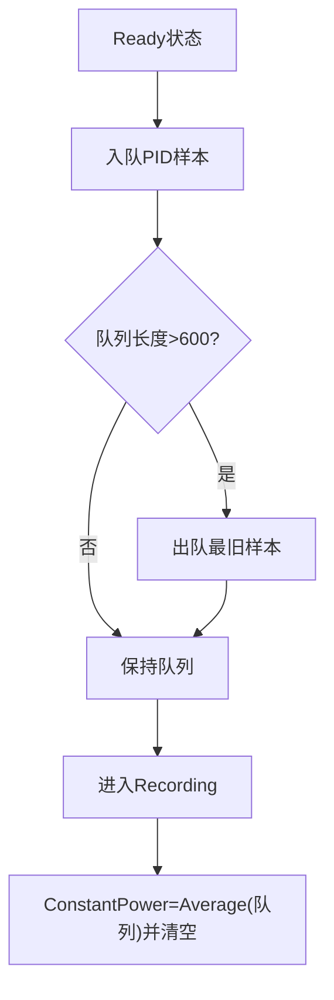
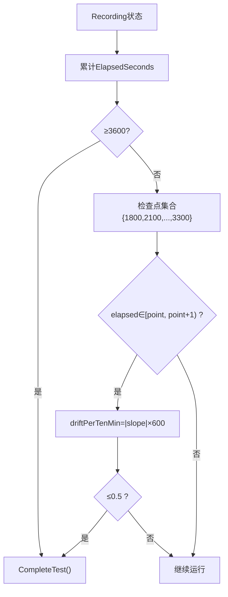
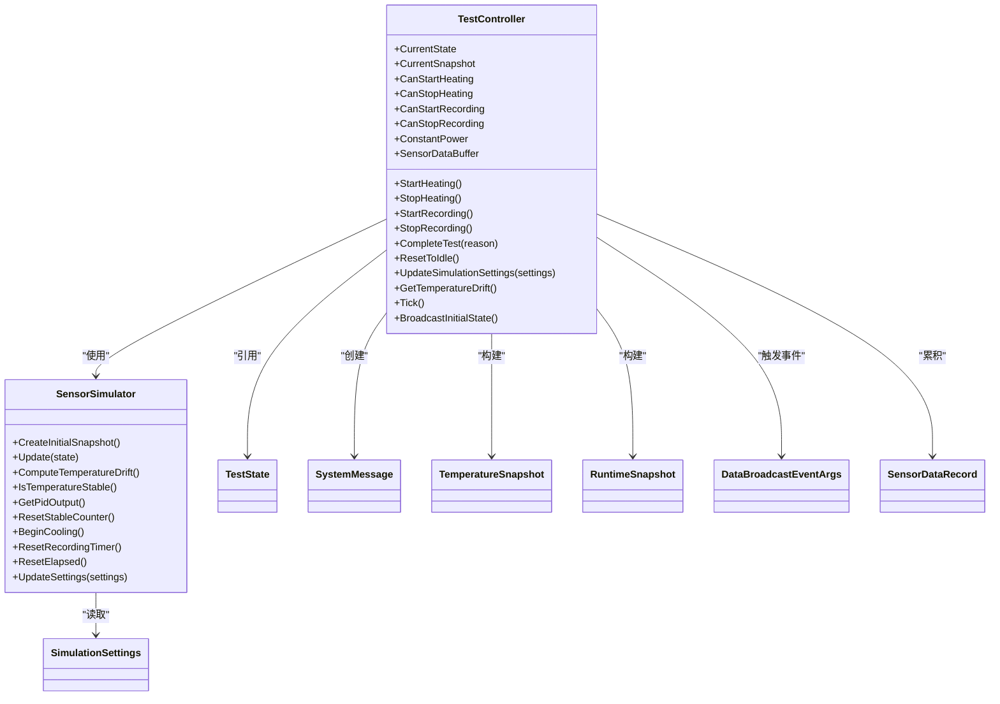

# 试验控制器

<cite>
**本文引用的文件**
- [TestController.cs](file://src/ISO11820.App/Runtime/Controller/TestController.cs)
- [SensorSimulator.cs](file://src/ISO11820.App/Runtime/Services/SensorSimulator.cs)
- [TestState.cs](file://src/ISO11820.Core/Enums/TestState.cs)
- [SystemMessage.cs](file://src/ISO11820.Core/Models/SystemMessage.cs)
- [TemperatureSnapshot.cs](file://src/ISO11820.Core/Models/TemperatureSnapshot.cs)
- [RuntimeSnapshot.cs](file://src/ISO11820.App/Shared/Models/RuntimeSnapshot.cs)
- [DataBroadcastEventArgs.cs](file://src/ISO11820.App/Shared/Events/DataBroadcastEventArgs.cs)
- [AppSettings.cs](file://src/ISO11820.App/Config/AppSettings.cs)
- [CsvSampleWriter.cs](file://src/ISO11820.App/Infrastructure/FileStorage/CsvSampleWriter.cs)
- [TestControllerTests.cs](file://tests/ISO11820.Tests/Runtime/TestControllerTests.cs)
</cite>

## 目录
1. [简介](#简介)
2. [项目结构](#项目结构)
3. [核心组件](#核心组件)
4. [架构总览](#架构总览)
5. [详细组件分析](#详细组件分析)
6. [依赖关系分析](#依赖关系分析)
7. [性能考量](#性能考量)
8. [故障排查指南](#故障排查指南)
9. [结论](#结论)
10. [附录](#附录)

## 简介
本文件围绕 TestController 类，系统化阐述五态状态机的实现原理与运行流程，包括 Idle、Preparing、Ready、Recording、Complete 五种状态的转换逻辑与触发条件；说明线程安全机制、事件广播模式与系统消息管理；文档化所有公共方法（如 StartHeating、StopHeating、StartRecording、StopRecording、CompleteTest、ResetToIdle、UpdateSimulationSettings、GetTemperatureDrift）的参数、返回值与使用要点；解释 PID 输出队列的采样与恒定功率计算算法；详述温度漂移检测、自动终止条件与稳定性判断的实现细节；并提供状态转换图与实际代码示例路径，帮助理解与其他组件的集成方式。

## 项目结构
TestController 位于应用运行时层，负责协调仿真器、状态机、数据缓冲与事件广播；其依赖 SensorSimulator 完成温度模拟、稳定判定与温漂计算；通过事件 DataBroadcast 向 UI 或上层服务推送 RuntimeSnapshot；同时维护系统消息与传感器数据缓冲，供导出与记录使用。

图表来源
- [TestController.cs:1-328](file://src/ISO11820.App/Runtime/Controller/TestController.cs#L1-L328)
- [SensorSimulator.cs:1-223](file://src/ISO11820.App/Runtime/Services/SensorSimulator.cs#L1-L223)
- [TestState.cs:1-11](file://src/ISO11820.Core/Enums/TestState.cs#L1-L11)
- [SystemMessage.cs:1-4](file://src/ISO11820.Core/Models/SystemMessage.cs#L1-L4)
- [TemperatureSnapshot.cs:1-10](file://src/ISO11820.Core/Models/TemperatureSnapshot.cs#L1-L10)
- [RuntimeSnapshot.cs:1-12](file://src/ISO11820.App/Shared/Models/RuntimeSnapshot.cs#L1-L12)
- [DataBroadcastEventArgs.cs:1-14](file://src/ISO11820.App/Shared/Events/DataBroadcastEventArgs.cs#L1-L14)
- [AppSettings.cs:57-70](file://src/ISO11820.App/Config/AppSettings.cs#L57-L70)
- [CsvSampleWriter.cs:75-80](file://src/ISO11820.App/Infrastructure/FileStorage/CsvSampleWriter.cs#L75-L80)

章节来源
- [TestController.cs:1-328](file://src/ISO11820.App/Runtime/Controller/TestController.cs#L1-L328)
- [SensorSimulator.cs:1-223](file://src/ISO11820.App/Runtime/Services/SensorSimulator.cs#L1-L223)
- [TestState.cs:1-11](file://src/ISO11820.Core/Enums/TestState.cs#L1-L11)
- [RuntimeSnapshot.cs:1-12](file://src/ISO11820.App/Shared/Models/RuntimeSnapshot.cs#L1-L12)
- [DataBroadcastEventArgs.cs:1-14](file://src/ISO11820.App/Shared/Events/DataBroadcastEventArgs.cs#L1-L14)
- [AppSettings.cs:57-70](file://src/ISO11820.App/Config/AppSettings.cs#L57-L70)
- [CsvSampleWriter.cs:75-80](file://src/ISO11820.App/Infrastructure/FileStorage/CsvSampleWriter.cs#L75-L80)

## 核心组件
- TestController：五态状态机核心，封装用户操作、定时 Tick、自动转换、消息广播与数据缓冲。
- SensorSimulator：温度仿真、稳定计数、PID 输出模拟、温漂线性回归计算。
- 模型与事件：TestState、SystemMessage、TemperatureSnapshot、RuntimeSnapshot、DataBroadcastEventArgs。
- 配置：SimulationSettings 提供目标温度、升温速率、稳定阈值、波动幅度等。
- 存储：SensorDataRecord 用于采集通道值，配合 CsvSampleWriter 导出。

章节来源
- [TestController.cs:1-328](file://src/ISO11820.App/Runtime/Controller/TestController.cs#L1-L328)
- [SensorSimulator.cs:1-223](file://src/ISO11820.App/Runtime/Services/SensorSimulator.cs#L1-L223)
- [TestState.cs:1-11](file://src/ISO11820.Core/Enums/TestState.cs#L1-L11)
- [SystemMessage.cs:1-4](file://src/ISO11820.Core/Models/SystemMessage.cs#L1-L4)
- [TemperatureSnapshot.cs:1-10](file://src/ISO11820.Core/Models/TemperatureSnapshot.cs#L1-L10)
- [RuntimeSnapshot.cs:1-12](file://src/ISO11820.App/Shared/Models/RuntimeSnapshot.cs#L1-L12)
- [DataBroadcastEventArgs.cs:1-14](file://src/ISO11820.App/Shared/Events/DataBroadcastEventArgs.cs#L1-L14)
- [AppSettings.cs:57-70](file://src/ISO11820.App/Config/AppSettings.cs#L57-L70)
- [CsvSampleWriter.cs:75-80](file://src/ISO11820.App/Infrastructure/FileStorage/CsvSampleWriter.cs#L75-L80)

## 架构总览
TestController 作为控制中枢，接收来自 UI 的用户动作（开始/停止加热、开始/停止记录），在定时器驱动的 Tick 中推进仿真、评估自动转换与终止条件，并通过事件将最新快照广播给订阅者。

图表来源
- [TestController.cs:57-143](file://src/ISO11820.App/Runtime/Controller/TestController.cs#L57-L143)
- [TestController.cs:171-204](file://src/ISO11820.App/Runtime/Controller/TestController.cs#L171-L204)
- [TestController.cs:248-302](file://src/ISO11820.App/Runtime/Controller/TestController.cs#L248-L302)
- [SensorSimulator.cs:46-79](file://src/ISO11820.App/Runtime/Services/SensorSimulator.cs#L46-L79)
- [DataBroadcastEventArgs.cs:5-13](file://src/ISO11820.App/Shared/Events/DataBroadcastEventArgs.cs#L5-L13)

## 详细组件分析

### 五态状态机与转换规则
- 状态定义
  - Idle：空闲，可启动加热。
  - Preparing：升温阶段，等待温度稳定。
  - Ready：温度稳定，允许开始记录。
  - Recording：记录阶段，计时与自动终止检查。
  - Complete：结束状态。

- 转换入口与条件
  - Idle → Preparing：调用 StartHeating()。
  - Preparing → Ready：Tick 中 EvaluateAutoTransitions() 检测到 IsTemperatureStable() 为真。
  - Ready → Preparing：Tick 中 EvaluateAutoTransitions() 检测到温度不再稳定，重置稳定计数并回退。
  - Ready → Recording：调用 StartRecording()。
  - Recording → Complete：调用 StopRecording() 或 CompleteTest()，或在 CheckAutoTermination() 满足条件时自动进入。
  - 任意状态 → Idle：调用 ResetToIdle()。

图表来源
- [TestController.cs:57-143](file://src/ISO11820.App/Runtime/Controller/TestController.cs#L57-L143)
- [TestController.cs:248-302](file://src/ISO11820.App/Runtime/Controller/TestController.cs#L248-L302)
- [TestState.cs:1-11](file://src/ISO11820.Core/Enums/TestState.cs#L1-L11)

章节来源
- [TestController.cs:57-143](file://src/ISO11820.App/Runtime/Controller/TestController.cs#L57-L143)
- [TestController.cs:248-302](file://src/ISO11820.App/Runtime/Controller/TestController.cs#L248-L302)
- [TestState.cs:1-11](file://src/ISO11820.Core/Enums/TestState.cs#L1-L11)

### 线程安全机制
- 锁粒度
  - 所有对外可变状态修改与读取均被 _lock 保护，确保多线程访问一致性。
  - 关键方法 StartHeating、StopHeating、StartRecording、StopRecording、CompleteTest、ResetToIdle、UpdateSimulationSettings、Tick 内部均使用 lock(_lock)。
- 并发边界
  - 事件广播 Broadcast() 在锁外执行，避免长时间持有锁导致阻塞。
  - 温漂计算 TrackDriftSample 与 ComputeTemperatureDrift 对内部列表使用独立锁，降低与主锁竞争。
- 设计要点
  - 变更标志 changed 在锁内决定，仅在发生实际状态变化时才触发广播，减少不必要的事件开销。

章节来源
- [TestController.cs:57-167](file://src/ISO11820.App/Runtime/Controller/TestController.cs#L57-L167)
- [TestController.cs:171-204](file://src/ISO11820.App/Runtime/Controller/TestController.cs#L171-L204)
- [SensorSimulator.cs:84-107](file://src/ISO11820.App/Runtime/Services/SensorSimulator.cs#L84-L107)

### 事件广播与系统消息管理
- 事件模型
  - DataBroadcast 事件携带 DataBroadcastEventArgs，其中包含当前 RuntimeSnapshot。
  - BuildSnapshot 聚合当前状态、温度快照、系统消息、已用秒数与图表时间轴。
- 系统消息
  - TransitionTo 在每次状态切换时追加 SystemMessage，包含时间与提示文本。
  - UpdateSimulationSettings 更新仿真参数后也会追加一条系统消息。
- 广播时机
  - 用户动作成功改变状态后、Tick 处理完成后、初始状态广播时都会触发广播。

图表来源
- [TestController.cs:311-326](file://src/ISO11820.App/Runtime/Controller/TestController.cs#L311-L326)
- [RuntimeSnapshot.cs:6-12](file://src/ISO11820.App/Shared/Models/RuntimeSnapshot.cs#L6-L12)
- [DataBroadcastEventArgs.cs:5-13](file://src/ISO11820.App/Shared/Events/DataBroadcastEventArgs.cs#L5-L13)
- [SystemMessage.cs:1-4](file://src/ISO11820.Core/Models/SystemMessage.cs#L1-L4)

章节来源
- [TestController.cs:304-326](file://src/ISO11820.App/Runtime/Controller/TestController.cs#L304-L326)
- [RuntimeSnapshot.cs:1-12](file://src/ISO11820.App/Shared/Models/RuntimeSnapshot.cs#L1-L12)
- [DataBroadcastEventArgs.cs:1-14](file://src/ISO11820.App/Shared/Events/DataBroadcastEventArgs.cs#L1-L14)
- [SystemMessage.cs:1-4](file://src/ISO11820.Core/Models/SystemMessage.cs#L1-L4)

### 公共方法文档

- StartHeating()
  - 作用：从 Idle 进入 Preparing，启动升温。
  - 前置条件：CurrentState == Idle。
  - 副作用：重置稳定计数，追加系统消息，广播快照。
  - 返回：无。
  - 使用示例路径：[测试用例:39-47](file://tests/ISO11820.Tests/Runtime/TestControllerTests.cs#L39-L47)

- StopHeating()
  - 作用：从 Preparing 或 Ready 回到 Idle，停止加热并开始冷却。
  - 前置条件：CurrentState ∈ {Preparing, Ready}。
  - 副作用：标记停止加热，通知仿真器开始冷却，追加系统消息，广播快照。
  - 返回：无。
  - 使用示例路径：[测试用例:72-81](file://tests/ISO11820.Tests/Runtime/TestControllerTests.cs#L72-L81)

- StartRecording()
  - 作用：从 Ready 进入 Recording，开始记录并计时。
  - 前置条件：CurrentState == Ready。
  - 副作用：若 PID 队列非空则计算平均值为 ConstantPower 并清空队列；重置记录计时器；追加系统消息，广播快照。
  - 返回：无。
  - 使用示例路径：[测试用例:103-120](file://tests/ISO11820.Tests/Runtime/TestControllerTests.cs#L103-L120)

- StopRecording()
  - 作用：从 Recording 进入 Complete，手动结束记录。
  - 前置条件：CurrentState == Recording。
  - 副作用：重置稳定计数，追加系统消息，广播快照。
  - 返回：无。
  - 使用示例路径：[测试用例:122-140](file://tests/ISO11820.Tests/Runtime/TestControllerTests.cs#L122-L140)

- CompleteTest(reason = null)
  - 作用：从 Recording 进入 Complete，支持自定义原因。
  - 前置条件：CurrentState == Recording。
  - 副作用：重置稳定计数，追加系统消息（默认包含“记录时间到达 3600 秒”或传入原因），广播快照。
  - 返回：无。
  - 使用示例路径：[测试用例:142-155](file://tests/ISO11820.Tests/Runtime/TestControllerTests.cs#L142-L155)

- ResetToIdle()
  - 作用：从任意状态复位到 Idle，清理计时与缓冲。
  - 副作用：停止加热、重置仿真计时与稳定计数、清空传感器数据缓冲，追加系统消息，广播快照。
  - 返回：无。
  - 使用示例路径：[测试用例:157-168](file://tests/ISO11820.Tests/Runtime/TestControllerTests.cs#L157-L168)

- UpdateSimulationSettings(newSettings)
  - 作用：动态更新仿真参数。
  - 副作用：更新仿真器设置，追加系统消息，广播快照。
  - 返回：无。
  - 使用示例路径：[控制器实现:158-167](file://src/ISO11820.App/Runtime/Controller/TestController.cs#L158-L167)

- GetTemperatureDrift()
  - 作用：获取炉温1的温漂速率（°C/s）。
  - 返回：double，由 SensorSimulator 基于最近 N 个采样点线性回归得到。
  - 使用示例路径：[控制器实现:220-226](file://src/ISO11820.App/Runtime/Controller/TestController.cs#L220-L226)

- 属性
  - CurrentState：当前状态。
  - CurrentSnapshot：最新快照。
  - CanStartHeating / CanStopHeating / CanStartRecording / CanStopRecording：UI 按钮可用性判断。
  - ConstantPower：Ready 期间 PID 输出的平均值。
  - SensorDataBuffer：只读传感器数据缓冲。

章节来源
- [TestController.cs:57-167](file://src/ISO11820.App/Runtime/Controller/TestController.cs#L57-L167)
- [TestController.cs:220-226](file://src/ISO11820.App/Runtime/Controller/TestController.cs#L220-L226)
- [TestControllerTests.cs:39-168](file://tests/ISO11820.Tests/Runtime/TestControllerTests.cs#L39-L168)

### PID 输出队列与恒定功率计算
- 采样窗口
  - 在 Ready 状态下，每个 Tick 调用 SensorSimulator.GetPidOutput() 并将结果入队。
  - 队列最大长度 MaxPidSamples = 600，超过则出队最旧样本，近似覆盖约 8 分钟（800ms × 600）。
- 恒定功率计算
  - 当进入 Recording 时，若队列非空，ConstantPower = Average(PID 样本)，随后清空队列。
  - ConstantPower 暴露为只读属性，供上层记录或导出。
- 复杂度
  - 入队/出队 O(1)，Average 为 O(n)，n ≤ 600，整体开销极低。

图表来源
- [TestController.cs:191-197](file://src/ISO11820.App/Runtime/Controller/TestController.cs#L191-L197)
- [TestController.cs:99-103](file://src/ISO11820.App/Runtime/Controller/TestController.cs#L99-L103)
- [SensorSimulator.cs:214-217](file://src/ISO11820.App/Runtime/Services/SensorSimulator.cs#L214-L217)

章节来源
- [TestController.cs:191-103](file://src/ISO11820.App/Runtime/Controller/TestController.cs#L191-L103)
- [SensorSimulator.cs:214-217](file://src/ISO11820.App/Runtime/Services/SensorSimulator.cs#L214-L217)

### 温度漂移检测与自动终止条件
- 温度漂移检测
  - 在 Recording 阶段，每个 Tick 记录一个 (time, furnace1) 样本，保留最近 MaxDriftSamples = 20 个点。
  - 使用线性回归 Fit.Line 计算斜率，即温漂速率（°C/s）。
  - 外部可通过 GetTemperatureDrift() 查询。
- 自动终止条件
  - 60 分钟（3600 秒）无条件终止。
  - 提前终止检查点：30/35/40/45/50/55 分钟（1800/2100/2400/2700/3000/3300 秒），在每个检查点的 1 秒窗口内，若 |driftPerTenMin| ≤ 0.5 °C/10min，则立即终止。
  - driftPerTenMin = |slope| × 600。

图表来源
- [TestController.cs:274-302](file://src/ISO11820.App/Runtime/Controller/TestController.cs#L274-L302)
- [SensorSimulator.cs:84-107](file://src/ISO11820.App/Runtime/Services/SensorSimulator.cs#L84-L107)

章节来源
- [TestController.cs:274-302](file://src/ISO11820.App/Runtime/Controller/TestController.cs#L274-L302)
- [SensorSimulator.cs:84-107](file://src/ISO11820.App/Runtime/Services/SensorSimulator.cs#L84-L107)

### 稳定性判断与状态回退
- 稳定性判定
  - IsTemperatureStable() 要求炉温1在 [TargetTemperature - StableThreshold, TargetTemperature + StableThreshold] 范围内连续多个 Tick（>3）才视为稳定。
- 状态回退
  - 在 Ready 状态下若不再稳定，会重置稳定计数并回退到 Preparing，提示“温度波动超出稳定范围，重新升温”。

章节来源
- [SensorSimulator.cs:147-158](file://src/ISO11820.App/Runtime/Services/SensorSimulator.cs#L147-L158)
- [TestController.cs:258-266](file://src/ISO11820.App/Runtime/Controller/TestController.cs#L258-L266)

### 传感器数据缓冲与导出集成
- 数据收集
  - AccumulateSensorData() 每个 Tick 生成 SensorDataRecord，包含时间戳与 12 通道值（前 5 通道映射炉温1/炉温2/表面/中心/校准，其余占位）。
- 导出
  - SensorDataBuffer 以只读形式暴露，可由 ExportCoordinator 或 CsvSampleWriter 写入 CSV。
- 使用示例路径
  - 导出接口参考：[ExportCoordinator.SaveSensorDataToCsv:42-42](file://src/ISO11820.App/Features/Export/ExportCoordinator.cs#L42-L42)
  - CSV 写入参考：[CsvSampleWriter.WriteSensorData:40-40](file://src/ISO11820.App/Infrastructure/FileStorage/CsvSampleWriter.cs#L40-L40)

章节来源
- [TestController.cs:230-246](file://src/ISO11820.App/Runtime/Controller/TestController.cs#L230-L246)
- [CsvSampleWriter.cs:40-40](file://src/ISO11820.App/Infrastructure/FileStorage/CsvSampleWriter.cs#L40-L40)
- [CsvSampleWriter.cs:75-80](file://src/ISO11820.App/Infrastructure/FileStorage/CsvSampleWriter.cs#L75-L80)

## 依赖关系分析
- 直接依赖
  - TestController 依赖 SensorSimulator 进行温度仿真与 PID 输出模拟。
  - 依赖 Core 模型：TestState、SystemMessage、TemperatureSnapshot。
  - 依赖共享模型：RuntimeSnapshot、DataBroadcastEventArgs。
  - 依赖配置：SimulationSettings（目标温度、稳定阈值、波动幅度等）。
  - 依赖存储：SensorDataRecord（用于导出）。
- 耦合与内聚
  - TestController 聚焦状态机与调度，内聚良好；仿真细节下沉至 SensorSimulator，降低耦合。
- 外部依赖
  - MathNet.Numerics 用于线性回归（在 SensorSimulator 中使用）。

图表来源
- [TestController.cs:1-328](file://src/ISO11820.App/Runtime/Controller/TestController.cs#L1-L328)
- [SensorSimulator.cs:1-223](file://src/ISO11820.App/Runtime/Services/SensorSimulator.cs#L1-L223)
- [TestState.cs:1-11](file://src/ISO11820.Core/Enums/TestState.cs#L1-L11)
- [SystemMessage.cs:1-4](file://src/ISO11820.Core/Models/SystemMessage.cs#L1-L4)
- [TemperatureSnapshot.cs:1-10](file://src/ISO11820.Core/Models/TemperatureSnapshot.cs#L1-L10)
- [RuntimeSnapshot.cs:1-12](file://src/ISO11820.App/Shared/Models/RuntimeSnapshot.cs#L1-L12)
- [DataBroadcastEventArgs.cs:1-14](file://src/ISO11820.App/Shared/Events/DataBroadcastEventArgs.cs#L1-L14)
- [AppSettings.cs:57-70](file://src/ISO11820.App/Config/AppSettings.cs#L57-L70)
- [CsvSampleWriter.cs:75-80](file://src/ISO11820.App/Infrastructure/FileStorage/CsvSampleWriter.cs#L75-L80)

章节来源
- [TestController.cs:1-328](file://src/ISO11820.App/Runtime/Controller/TestController.cs#L1-L328)
- [SensorSimulator.cs:1-223](file://src/ISO11820.App/Runtime/Services/SensorSimulator.cs#L1-L223)
- [AppSettings.cs:57-70](file://src/ISO11820.App/Config/AppSettings.cs#L57-L70)

## 性能考量
- 锁竞争最小化
  - 事件广播在锁外执行，避免阻塞定时器线程。
  - 温漂计算使用独立锁，降低与主锁冲突概率。
- 数据结构选择
  - Queue<double> 用于 PID 队列，入队/出队 O(1)，内存占用固定上限。
  - List<SensorDataRecord> 仅用于短期缓冲，可在导出后按需清理。
- 数值计算
  - 线性回归仅在必要时计算，且限制样本数量，保证低延迟。
- 建议
  - 若需更高吞吐，可将广播改为异步派发或批量合并快照。
  - 对于长期运行场景，考虑周期性持久化 SensorDataBuffer，避免内存增长。

## 故障排查指南
- 常见问题
  - 无法进入 Ready：检查稳定阈值与波动幅度设置，确认 IsTemperatureStable() 条件是否满足。
  - 频繁在 Ready/Preparing 间切换：可能因 TempFluctuation 过大或 StableThreshold 过小，建议调整 AppSettings.Simulation。
  - 自动终止未触发：确认 Tick 是否按 800ms 周期调用，以及 ElapsedSeconds 是否正确递增。
  - 恒定功率异常：检查 Ready 期间是否有足够 PID 样本，以及队列是否被意外清空。
- 定位手段
  - 订阅 DataBroadcast 事件，查看 RuntimeSnapshot.Messages 中的系统消息。
  - 打印 SensorDataBuffer 的前若干条记录，验证通道值是否符合预期。
  - 使用 GetTemperatureDrift() 观察温漂趋势，辅助判断提前终止合理性。

章节来源
- [TestController.cs:274-302](file://src/ISO11820.App/Runtime/Controller/TestController.cs#L274-L302)
- [SensorSimulator.cs:147-158](file://src/ISO11820.App/Runtime/Services/SensorSimulator.cs#L147-L158)
- [TestControllerTests.cs:171-195](file://tests/ISO11820.Tests/Runtime/TestControllerTests.cs#L171-L195)

## 结论
TestController 以清晰的状态机为核心，结合稳定的线程安全策略与轻量级事件广播，实现了完整的试验流程控制。其 PID 队列与恒定功率计算、温度漂移检测与自动终止条件共同保障了试验的可控性与可靠性。通过合理的配置与扩展点，可与 UI、导出、数据库等模块无缝集成。

## 附录
- 相关测试用例路径
  - 状态机行为与广播验证：[TestControllerTests.cs:31-263](file://tests/ISO11820.Tests/Runtime/TestControllerTests.cs#L31-L263)
- 配置项参考
  - SimulationSettings 字段：StartTemperature、HeatingRatePerSecond、TargetTemperature、StableThreshold、TempFluctuation。
  - 硬件常量（参考）：ConstPower、PidTemperature（用于其他模块）。

章节来源
- [TestControllerTests.cs:31-263](file://tests/ISO11820.Tests/Runtime/TestControllerTests.cs#L31-L263)
- [AppSettings.cs:57-70](file://src/ISO11820.App/Config/AppSettings.cs#L57-L70)
- [AppSettings.cs:119-123](file://src/ISO11820.App/Config/AppSettings.cs#L119-L123)