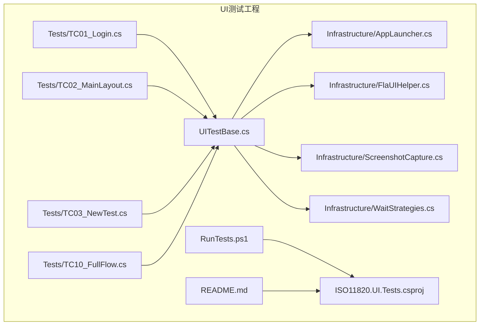
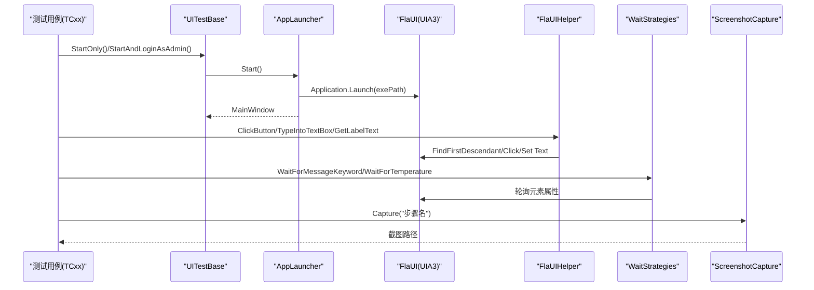
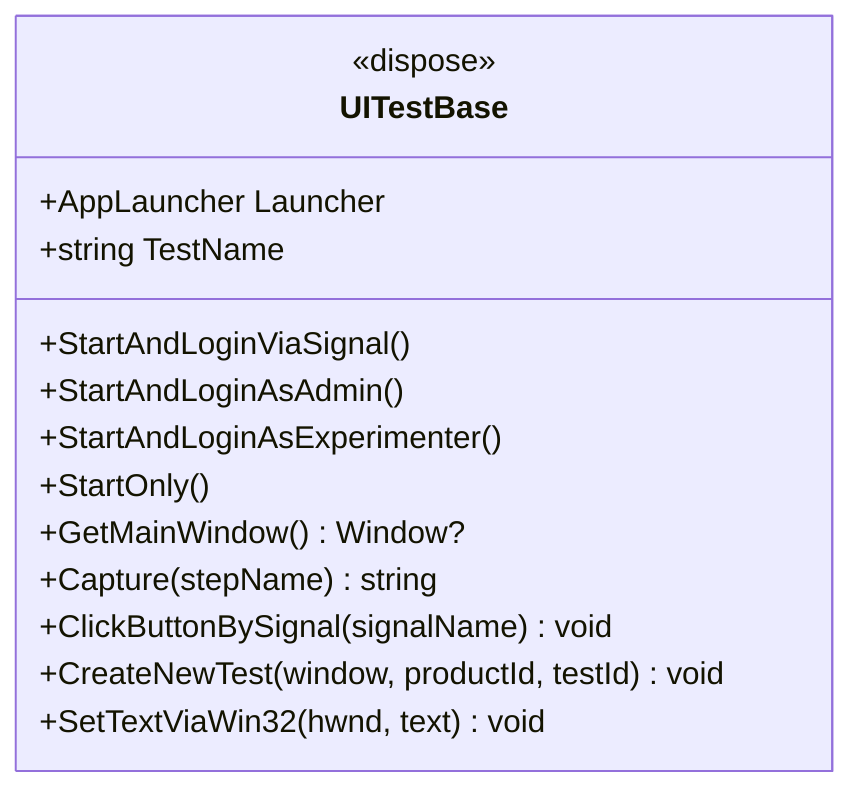
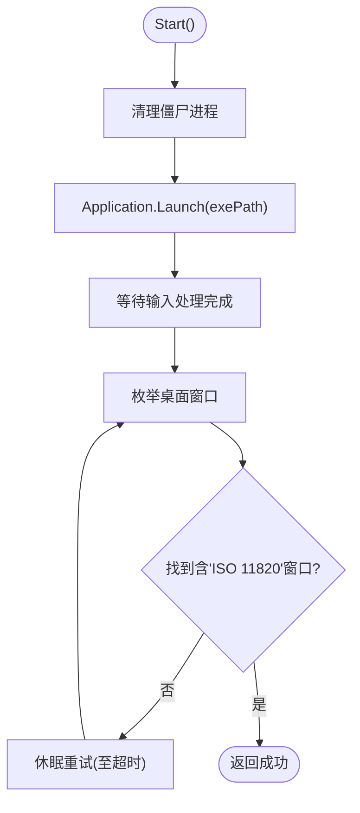
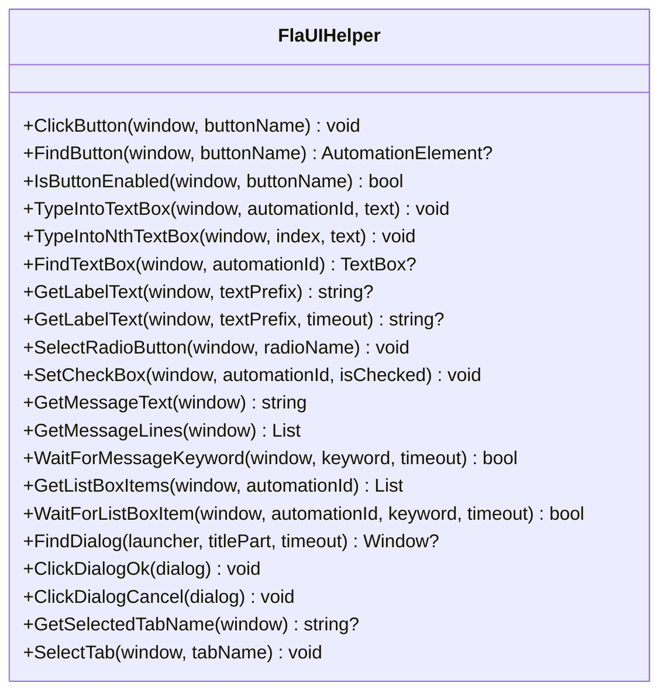
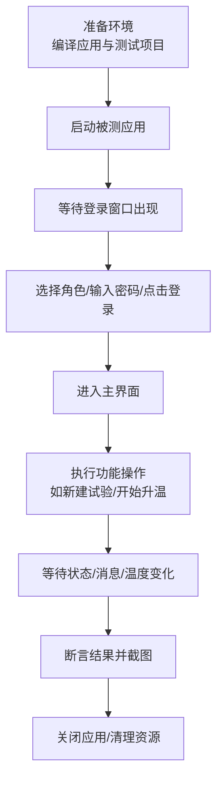
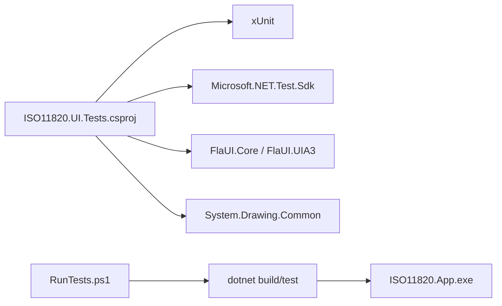

# UI自动化测试

<cite>
**本文引用的文件**   
- [UITestBase.cs](file://tests/ISO11820.UI.Tests/UITestBase.cs)
- [FlaUIHelper.cs](file://tests/ISO11820.UI.Tests/Infrastructure/FlaUIHelper.cs)
- [AppLauncher.cs](file://tests/ISO11820.UI.Tests/Infrastructure/AppLauncher.cs)
- [ScreenshotCapture.cs](file://tests/ISO11820.UI.Tests/Infrastructure/ScreenshotCapture.cs)
- [WaitStrategies.cs](file://tests/ISO11820.UI.Tests/Infrastructure/WaitStrategies.cs)
- [TC01_Login.cs](file://tests/ISO11820.UI.Tests/Tests/TC01_Login.cs)
- [TC02_MainLayout.cs](file://tests/ISO11820.UI.Tests/Tests/TC02_MainLayout.cs)
- [TC03_NewTest.cs](file://tests/ISO11820.UI.Tests/Tests/TC03_NewTest.cs)
- [TC10_FullFlow.cs](file://tests/ISO11820.UI.Tests/Tests/TC10_FullFlow.cs)
- [RunTests.ps1](file://tests/ISO11820.UI.Tests/RunTests.ps1)
- [README.md](file://tests/ISO11820.UI.Tests/README.md)
- [ISO11820.UI.Tests.csproj](file://tests/ISO11820.UI.Tests/ISO11820.UI.Tests.csproj)
- [LoginForm.cs](file://src/ISO11820.App/UI/Forms/LoginForm.cs)
</cite>

## 目录
1. [引言](#引言)
2. [项目结构](#项目结构)
3. [核心组件](#核心组件)
4. [架构总览](#架构总览)
5. [详细组件分析](#详细组件分析)
6. [依赖关系分析](#依赖关系分析)
7. [性能与稳定性优化](#性能与稳定性优化)
8. [故障排除指南](#故障排除指南)
9. [结论](#结论)
10. [附录：持续集成与环境搭建](#附录持续集成与环境搭建)

## 引言
本文件面向ISO 11820系统的UI自动化验收测试，基于FlaUI（Windows UI Automation）对WinForms桌面应用进行端到端验证。文档覆盖以下目标：
- FlaUI框架的集成与配置说明
- Windows应用程序的自动化控制机制
- UITestBase基类的设计模式、环境初始化与清理逻辑
- 关键测试用例实现（登录、主界面布局、新建试验、端到端流程等）
- FlaUIHelper辅助类的等待策略、截图捕获与UI元素查找方法
- PowerShell脚本运行配置与持续集成环境搭建指导
- UI测试最佳实践、性能优化与故障排除方法

## 项目结构
UI测试工程位于 tests/ISO11820.UI.Tests，采用“基础设施 + 测试用例”分层组织：
- Infrastructure：应用启动器、FlaUI操作封装、截图工具、等待策略
- Tests：按功能模块划分的测试类（TC01~TC10）
- 根目录包含运行脚本与说明文档

图表来源
- [UITestBase.cs:1-210](file://tests/ISO11820.UI.Tests/UITestBase.cs#L1-L210)
- [AppLauncher.cs:1-240](file://tests/ISO11820.UI.Tests/Infrastructure/AppLauncher.cs#L1-L240)
- [FlaUIHelper.cs:1-295](file://tests/ISO11820.UI.Tests/Infrastructure/FlaUIHelper.cs#L1-L295)
- [ScreenshotCapture.cs:1-48](file://tests/ISO11820.UI.Tests/Infrastructure/ScreenshotCapture.cs#L1-L48)
- [WaitStrategies.cs:1-176](file://tests/ISO11820.UI.Tests/Infrastructure/WaitStrategies.cs#L1-L176)
- [TC01_Login.cs:1-212](file://tests/ISO11820.UI.Tests/Tests/TC01_Login.cs#L1-L212)
- [TC02_MainLayout.cs:1-215](file://tests/ISO11820.UI.Tests/Tests/TC02_MainLayout.cs#L1-L215)
- [TC03_NewTest.cs:1-296](file://tests/ISO11820.UI.Tests/Tests/TC03_NewTest.cs#L1-L296)
- [TC10_FullFlow.cs:1-360](file://tests/ISO11820.UI.Tests/Tests/TC10_FullFlow.cs#L1-L360)
- [RunTests.ps1:1-112](file://tests/ISO11820.UI.Tests/RunTests.ps1#L1-L112)
- [README.md:1-238](file://tests/ISO11820.UI.Tests/README.md#L1-L238)
- [ISO11820.UI.Tests.csproj:1-38](file://tests/ISO11820.UI.Tests/ISO11820.UI.Tests.csproj#L1-L38)

章节来源
- [README.md:14-38](file://tests/ISO11820.UI.Tests/README.md#L14-L38)

## 核心组件
- UITestBase：测试基类，提供应用启动/关闭、信号驱动交互、截图、Win32对话框辅助等方法，统一测试生命周期管理。
- AppLauncher：负责启动被测应用、查找窗口、自动登录、进程清理与资源释放。
- FlaUIHelper：封装常用UI操作（按钮点击、文本输入、单选/复选框、消息区域读取、Tab切换、等待关键词等）。
- ScreenshotCapture：线程安全的屏幕截图工具，按测试名和步骤名输出PNG。
- WaitStrategies：显式等待策略（标签文本、按钮状态、温度范围、消息出现、窗口出现等），避免硬编码Sleep。
- 测试用例：TC01~TC10覆盖登录、主界面布局、新建试验、状态机流转、按钮状态矩阵、仿真引擎、消息日志、记录查询、导出与端到端流程。

章节来源
- [UITestBase.cs:1-210](file://tests/ISO11820.UI.Tests/UITestBase.cs#L1-L210)
- [AppLauncher.cs:1-240](file://tests/ISO11820.UI.Tests/Infrastructure/AppLauncher.cs#L1-L240)
- [FlaUIHelper.cs:1-295](file://tests/ISO11820.UI.Tests/Infrastructure/FlaUIHelper.cs#L1-L295)
- [ScreenshotCapture.cs:1-48](file://tests/ISO11820.UI.Tests/Infrastructure/ScreenshotCapture.cs#L1-L48)
- [WaitStrategies.cs:1-176](file://tests/ISO11820.UI.Tests/Infrastructure/WaitStrategies.cs#L1-L176)

## 架构总览
UI自动化测试通过xUnit驱动，每个测试继承自UITestBase，使用AppLauncher启动被测应用，借助FlaUI访问UIA树，结合FlaUIHelper与WaitStrategies完成控件定位、交互与断言，并通过ScreenshotCapture在关键步骤留存证据。

图表来源
- [UITestBase.cs:23-66](file://tests/ISO11820.UI.Tests/UITestBase.cs#L23-L66)
- [AppLauncher.cs:52-130](file://tests/ISO11820.UI.Tests/Infrastructure/AppLauncher.cs#L52-L130)
- [FlaUIHelper.cs:11-115](file://tests/ISO11820.UI.Tests/Infrastructure/FlaUIHelper.cs#L11-L115)
- [WaitStrategies.cs:13-143](file://tests/ISO11820.UI.Tests/Infrastructure/WaitStrategies.cs#L13-L143)
- [ScreenshotCapture.cs:21-37](file://tests/ISO11820.UI.Tests/Infrastructure/ScreenshotCapture.cs#L21-L37)

## 详细组件分析

### UITestBase 基类设计
- 职责
  - 统一启动/关闭被测应用
  - 提供多种登录方式（信号文件触发、直接调用AppLauncher）
  - 获取主窗口并支持超时等待
  - 截图封装与测试名称隔离
  - 通过信号文件触发应用内按钮点击，降低UI耦合
  - Win32 P/Invoke辅助创建/填写对话框（针对非UIA暴露的WinForms控件）
- 关键方法
  - StartAndLoginViaSignal：启动应用后通过信号文件触发登录
  - StartAndLoginAsAdmin/StartAndLoginAsExperimenter：快速以管理员或试验员身份登录
  - GetMainWindow：精确匹配主窗口标题
  - ClickButtonBySignal：写入临时目录下的.signal文件，由应用监听并执行对应动作
  - CreateNewTest：打开“新建试验”对话框，枚举Edit子控件并填充数据，点击确认
  - SetTextViaWin32：通过WM_SETTEXT向Edit控件设置文本
- 设计要点
  - 将“外部触发”与“内部响应”解耦，提升稳定性
  - 对不可见或非UIA暴露的控件采用Win32 API兜底
  - 所有测试共享同一套环境与清理逻辑，减少重复代码

图表来源
- [UITestBase.cs:12-209](file://tests/ISO11820.UI.Tests/UITestBase.cs#L12-L209)

章节来源
- [UITestBase.cs:23-152](file://tests/ISO11820.UI.Tests/UITestBase.cs#L23-L152)
- [UITestBase.cs:158-209](file://tests/ISO11820.UI.Tests/UITestBase.cs#L158-L209)

### AppLauncher 应用启动器
- 职责
  - 发现并启动ISO11820.App.exe
  - 等待至少一个包含“ISO 11820”的窗口出现
  - 提供FindWindow模糊匹配窗口
  - 内置StartAndLogin快捷登录（选择角色、输入密码、点击登录）
  - Stop/Dispose确保进程与UIA对象释放，清理僵尸进程
- 关键点
  - 启动超时保护
  - 从桌面枚举窗口，兼容多实例场景
  - 自动搜索Debug/Release构建产物路径

图表来源
- [AppLauncher.cs:52-94](file://tests/ISO11820.UI.Tests/Infrastructure/AppLauncher.cs#L52-L94)
- [AppLauncher.cs:191-205](file://tests/ISO11820.UI.Tests/Infrastructure/AppLauncher.cs#L191-L205)
- [AppLauncher.cs:207-226](file://tests/ISO11820.UI.Tests/Infrastructure/AppLauncher.cs#L207-L226)

章节来源
- [AppLauncher.cs:1-240](file://tests/ISO11820.UI.Tests/Infrastructure/AppLauncher.cs#L1-L240)

### FlaUIHelper 辅助类
- 能力清单
  - 按钮：查找、点击、启用状态检查
  - 文本框：按AutomationId或降级为第N个Edit输入文本
  - 标签：按AutomationId或文本前缀获取Label文本，带超时等待
  - 单选/复选：选择与状态判断
  - 消息区域：RichTextBox→Document控件文本读取与行拆分
  - 列表框：获取项文本与等待关键词出现
  - 对话框：查找、确定/取消按钮点击
  - TabControl：获取当前选中Tab名称与切换
- 设计原则
  - 优先使用AutomationId，其次Name；失败时抛出明确异常便于定位
  - 所有交互后调用输入处理等待，保证UI更新稳定

图表来源
- [FlaUIHelper.cs:9-294](file://tests/ISO11820.UI.Tests/Infrastructure/FlaUIHelper.cs#L9-L294)

章节来源
- [FlaUIHelper.cs:11-294](file://tests/ISO11820.UI.Tests/Infrastructure/FlaUIHelper.cs#L11-L294)

### ScreenshotCapture 截图工具
- 特性
  - 线程安全（lock）
  - 按测试名建立子目录，文件名包含时间戳与步骤名
  - 使用FlaUI.Core.Capturing.Screen截取全屏
- 使用建议
  - 在关键断言前后截图，便于人工/AI审查
  - 注意磁盘空间与CI存储策略

章节来源
- [ScreenshotCapture.cs:1-48](file://tests/ISO11820.UI.Tests/Infrastructure/ScreenshotCapture.cs#L1-L48)

### WaitStrategies 等待策略
- 能力清单
  - 等待标签文本包含关键词（可抛异常或返回bool）
  - 等待按钮启用/禁用状态
  - 等待温度数值达到指定范围（解析“°C”文本）
  - 等待系统消息出现（Document控件或全窗遍历）
  - 等待窗口出现
  - 固定时长等待（用于仿真场景）
- 设计要点
  - 显式等待替代硬编码Sleep，提高鲁棒性与效率
  - 超时异常信息包含上下文描述，便于排障

章节来源
- [WaitStrategies.cs:1-176](file://tests/ISO11820.UI.Tests/Infrastructure/WaitStrategies.cs#L1-L176)

### 测试用例实现

#### TC01 登录功能验收
- 覆盖点
  - 登录界面元素存在性（角色单选、密码输入框、登录按钮）
  - 无用户名输入框约束
  - 管理员/试验员登录成功
  - 密码错误/为空时的错误提示
  - 默认选中管理员角色
- 关键实现
  - 使用FlaUIHelper.SelectRadioButton/TypeIntoTextBox/ClickButton完成交互
  - 通过Launcher.FindWindow等待主窗口出现
  - 截图保存关键步骤

章节来源
- [TC01_Login.cs:22-194](file://tests/ISO11820.UI.Tests/Tests/TC01_Login.cs#L22-L194)
- [LoginForm.cs:34-183](file://src/ISO11820.App/UI/Forms/LoginForm.cs#L34-L183)

#### TC02 主界面布局验收
- 覆盖点
  - Tab页结构（主操作界面、记录查询、设备校准）
  - 5通道温度显示区域（炉温1/2、表面温、中心温、校准温）
  - 温度曲线图区域
  - 计时器与状态显示
  - 系统消息区域
  - 6个操作按钮（新建试验、开始升温、停止升温、开始记录、停止记录、参数设置）
  - 温度格式校验（保留小数位、单位°C）
  - Idle状态显示“空闲”
  - 整体布局截图供AI/人工审查
- 关键实现
  - 使用FlaUIHelper.GetLabelText与FindButton进行断言
  - 通过TabControl相关方法验证Tab切换与选中项

章节来源
- [TC02_MainLayout.cs:21-213](file://tests/ISO11820.UI.Tests/Tests/TC02_MainLayout.cs#L21-L213)
- [FlaUIHelper.cs:267-293](file://tests/ISO11820.UI.Tests/Infrastructure/FlaUIHelper.cs#L267-L293)

#### TC03 新建试验验收
- 覆盖点
  - 对话框字段完整性（环境温度、湿度、样品编号、试验标识、样品名称、规格、高度、直径、操作员、试验前质量等）
  - 设备信息自动带入（设备编号、设备名称、恒功率值）
  - 必填字段为空时的错误提示
  - 试验时长模式（标准60分钟/自定义）切换
- 关键实现
  - 通过信号文件触发“新建试验”，使用Win32 API枚举Edit控件并填充数据
  - 使用SendMessage发送BM_CLICK或键盘事件完成提交

章节来源
- [TC03_NewTest.cs:85-296](file://tests/ISO11820.UI.Tests/Tests/TC03_NewTest.cs#L85-L296)
- [UITestBase.cs:88-152](file://tests/ISO11820.UI.Tests/UITestBase.cs#L88-L152)

#### TC10 端到端完整流程
- 覆盖点
  - 启动并登录 → 验证主界面 → 新建试验（自动带入设备信息）→ 开始升温 → 温度稳定 → 开始记录 → 手动停止 → 记录查询Tab → 导出文件检查
- 关键实现
  - Step封装：每步完成后自动截图，失败时记录FAIL截图
  - 使用FlaUIHelper.WaitForListBoxItem等待消息出现
  - 使用WaitStrategies.TryWaitForLabelText等待状态变化
  - 通过ReadTemperature解析温度文本

章节来源
- [TC10_FullFlow.cs:19-323](file://tests/ISO11820.UI.Tests/Tests/TC10_FullFlow.cs#L19-L323)

### 概念性概览
下图展示UI自动化测试的典型工作流（不绑定具体源码）：

[此图为概念流程图，无需图表来源]

## 依赖关系分析
- 测试工程依赖
  - xUnit与Microsoft.NET.Test.Sdk作为测试框架与运行器
  - FlaUI.Core与FlaUI.UIA3实现UIA3自动化
  - System.Drawing.Common用于截图
- 运行时依赖
  - 被测应用ISO11820.App.exe需预先编译到Debug/Release路径
  - UIA3需要Windows UI Automation服务可用

图表来源
- [ISO11820.UI.Tests.csproj:10-25](file://tests/ISO11820.UI.Tests/ISO11820.UI.Tests.csproj#L10-L25)
- [RunTests.ps1:33-83](file://tests/ISO11820.UI.Tests/RunTests.ps1#L33-L83)

章节来源
- [ISO11820.UI.Tests.csproj:1-38](file://tests/ISO11820.UI.Tests/ISO11820.UI.Tests.csproj#L1-L38)
- [RunTests.ps1:1-112](file://tests/ISO11820.UI.Tests/RunTests.ps1#L1-L112)

## 性能与稳定性优化
- 显式等待优先
  - 使用WaitStrategies与FlaUIHelper的带超时方法，避免Thread.Sleep
  - 对长耗时操作（如温度稳定）设置合理超时阈值
- 控件定位策略
  - 优先使用AutomationId，其次Name；必要时降级为类型+索引
  - 对动态内容使用关键词匹配与轮询
- 截图策略
  - 仅在关键断言前后截图，避免过多IO影响性能
  - 在CI中按需开启截图，本地调试时可全开
- 进程与资源管理
  - 每次测试结束确保Stop/Dispose，防止僵尸进程残留
  - 启动前清理历史进程，避免端口/句柄冲突
- 并行限制
  - 由于共享同一应用实例，测试串行执行更稳定
  - 如需并行，应改为多实例或多用户会话，但复杂度较高

[本节为通用指导，无需章节来源]

## 故障排除指南
- 应用启动失败
  - 现象：未找到ISO11820.App.exe
  - 解决：先编译主程序，确保Debug/Release输出路径正确
- 控件未找到
  - 现象：未找到按钮/文本框
  - 排查：检查应用是否已启动并显示目标界面；查看截图；核对AutomationId/Name
- 超时
  - 现象：等待温度/消息/窗口超时
  - 排查：检查appsettings.json仿真参数（升温速率、目标温度）；适当增加超时；确认窗口未被遮挡
- 登录失败
  - 现象：密码错误或为空导致登录窗口未关闭
  - 排查：确认密码输入框存在且被正确赋值；查看错误提示标签是否存在

章节来源
- [README.md:176-207](file://tests/ISO11820.UI.Tests/README.md#L176-L207)

## 结论
本UI自动化测试套件基于FlaUI与xUnit，围绕ISO 11820系统的关键业务流程构建了完整的验收能力。通过统一的基类与辅助库，实现了稳定的应用启动、控件定位、交互模拟与结果验证，并结合截图与显式等待提升了可观测性与鲁棒性。配合PowerShell脚本与CI集成，可在本地与服务器环境中高效执行回归测试。

[本节为总结，无需章节来源]

## 附录：持续集成与环境搭建
- 前置条件
  - .NET 8 SDK
  - Windows环境（UIA3依赖）
  - 已编译的ISO11820.App.exe
- 本地运行
  - 使用RunTests.ps1一键编译与运行，支持过滤测试与列出测试
  - 截图输出至Screenshots目录，便于人工审查
- CI建议
  - 在Windows Agent上安装.NET 8 SDK
  - 预编译主程序与测试项目
  - 执行dotnet test并收集测试结果与截图
  - 归档截图与测试结果以便回溯
- 命令参考
  - 运行全部测试：.\RunTests.ps1
  - 仅运行登录测试：.\RunTests.ps1 -Filter "TC01"
  - 列出所有测试：.\RunTests.ps1 -ListTests
  - 直接使用dotnet test：dotnet test tests\ISO11820.UI.Tests\ISO11820.UI.Tests.csproj

章节来源
- [RunTests.ps1:1-112](file://tests/ISO11820.UI.Tests/RunTests.ps1#L1-L112)
- [README.md:56-108](file://tests/ISO11820.UI.Tests/README.md#L56-L108)