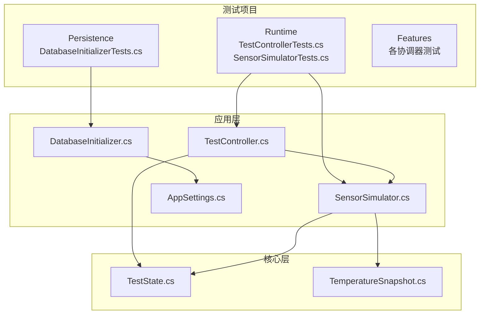
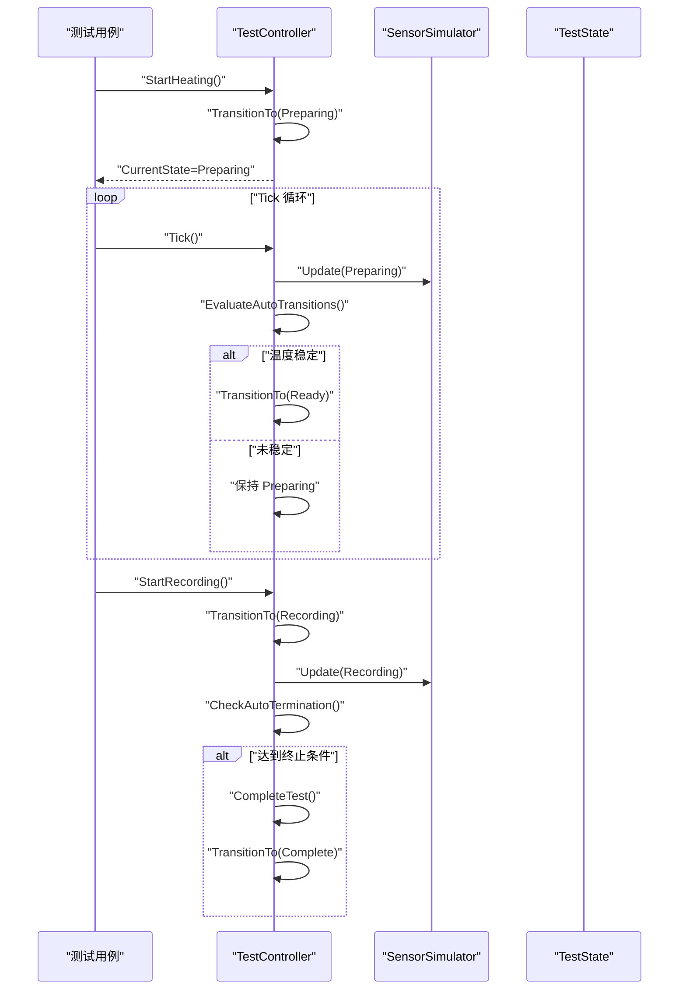
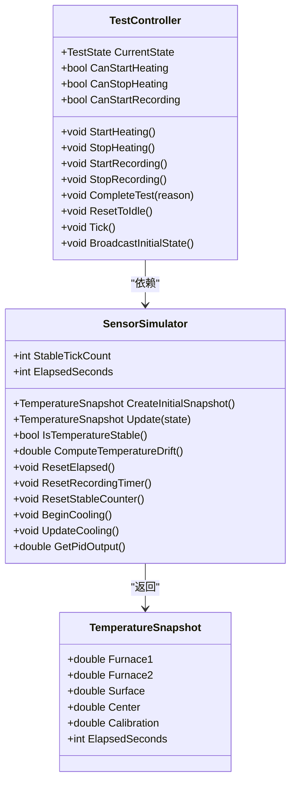
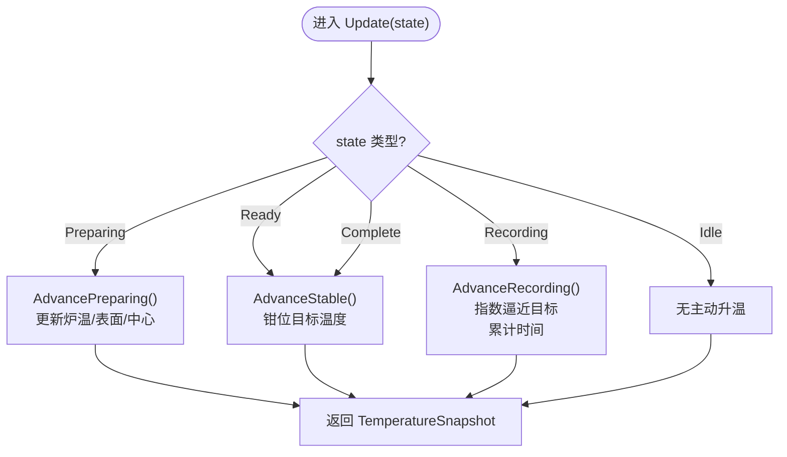
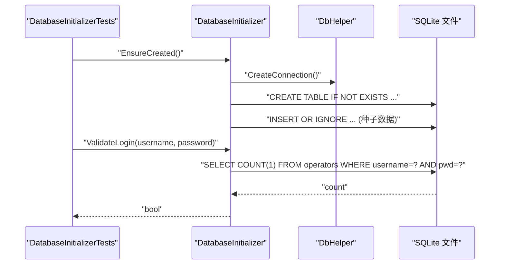
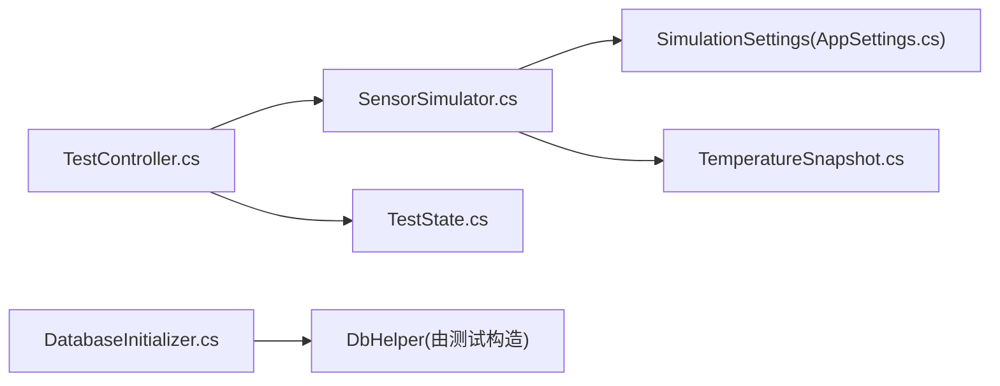

# 单元测试

<cite>
**本文引用的文件**   
- [TestControllerTests.cs](file://tests/ISO11820.Tests/Runtime/TestControllerTests.cs)
- [SensorSimulatorTests.cs](file://tests/ISO11820.Tests/Runtime/SensorSimulatorTests.cs)
- [DatabaseInitializerTests.cs](file://tests/ISO11820.Tests/Persistence/DatabaseInitializerTests.cs)
- [TestState.cs](file://src/ISO11820.Core/Enums/TestState.cs)
- [TestController.cs](file://src/ISO11820.App/Runtime/Controller/TestController.cs)
- [SensorSimulator.cs](file://src/ISO11820.App/Runtime/Services/SensorSimulator.cs)
- [DatabaseInitializer.cs](file://src/ISO11820.App/Infrastructure/Persistence/DatabaseInitializer.cs)
- [AppSettings.cs](file://src/ISO11820.App/Config/AppSettings.cs)
- [TemperatureSnapshot.cs](file://src/ISO11820.Core/Models/TemperatureSnapshot.cs)
- [ISO11820.Tests.csproj](file://tests/ISO11820.Tests/ISO11820.Tests.csproj)
</cite>

## 目录
1. [简介](#简介)
2. [项目结构](#项目结构)
3. [核心组件](#核心组件)
4. [架构总览](#架构总览)
5. [详细组件分析](#详细组件分析)
6. [依赖分析](#依赖分析)
7. [性能考虑](#性能考虑)
8. [故障排查指南](#故障排查指南)
9. [结论](#结论)
10. [附录](#附录)

## 简介
本文件为 ISO 11820 系统的单元测试文档，聚焦以下目标：
- 说明 xUnit 测试框架在项目中的配置与使用方式，包括测试项目结构与命名约定。
- 详解 TestControllerTests 中五态状态机的转换场景设计。
- 文档化 SensorSimulatorTests 的传感器模拟策略，涵盖温度变化算法与噪声模拟验证方法。
- 说明数据库初始化测试的设计模式，包括 SQLite 文件数据库的使用与数据迁移（种子）测试。
- 提供测试数据准备最佳实践，包括 Mock 对象创建与依赖注入的测试配置。
- 给出覆盖率要求、测试命名约定与断言策略的指导。

## 项目结构
测试项目位于 tests/ISO11820.Tests，采用按特性/领域划分的目录组织：
- Runtime：运行时逻辑测试（控制器、仿真器、状态机冒烟测试）。
- Persistence：持久化与数据库初始化测试。
- Features：业务协调器与功能特性测试。
- Shared：共享模型与事件相关测试。

xUnit 通过 Microsoft.NET.Test.Sdk 与 xunit.runner.visualstudio 驱动，测试项目引用了应用与核心库，便于对真实实现进行集成式单元测试。

图表来源
- [TestControllerTests.cs:1-265](file://tests/ISO11820.Tests/Runtime/TestControllerTests.cs#L1-L265)
- [SensorSimulatorTests.cs:1-221](file://tests/ISO11820.Tests/Runtime/SensorSimulatorTests.cs#L1-L221)
- [DatabaseInitializerTests.cs:1-181](file://tests/ISO11820.Tests/Persistence/DatabaseInitializerTests.cs#L1-L181)
- [TestController.cs:1-328](file://src/ISO11820.App/Runtime/Controller/TestController.cs#L1-L328)
- [SensorSimulator.cs:1-223](file://src/ISO11820.App/Runtime/Services/SensorSimulator.cs#L1-L223)
- [DatabaseInitializer.cs:1-198](file://src/ISO11820.App/Infrastructure/Persistence/DatabaseInitializer.cs#L1-L198)
- [AppSettings.cs:1-160](file://src/ISO11820.App/Config/AppSettings.cs#L1-L160)
- [TestState.cs:1-11](file://src/ISO11820.Core/Enums/TestState.cs#L1-L11)
- [TemperatureSnapshot.cs:1-10](file://src/ISO11820.Core/Models/TemperatureSnapshot.cs#L1-L10)

章节来源
- [ISO11820.Tests.csproj:1-27](file://tests/ISO11820.Tests/ISO11820.Tests.csproj#L1-L27)

## 核心组件
- 测试运行与配置
  - 使用 xUnit 作为测试框架，Microsoft.NET.Test.Sdk 作为测试宿主，xunit.runner.visualstudio 用于 Visual Studio 集成。
  - 通过 coverlet.collector 启用代码覆盖率收集。
  - 测试项目以 IsTestProject=true 标记，并全局引入 Xunit 命名空间以减少样板代码。
- 测试项目结构
  - 按功能域划分目录，便于定位与维护；每个被测类对应一个或多个测试类。
- 命名约定
  - 测试类名与被测类同名加 Tests 后缀，如 TestControllerTests、SensorSimulatorTests。
  - 测试方法使用描述性名称，表达“输入/前置条件 -> 期望结果”，例如 StartHeating_Transitions_Idle_To_Preparing。

章节来源
- [ISO11820.Tests.csproj:1-27](file://tests/ISO11820.Tests/ISO11820.Tests.csproj#L1-L27)

## 架构总览
下图展示了状态机控制流与仿真引擎在测试中的交互关系。

图表来源
- [TestController.cs:57-143](file://src/ISO11820.App/Runtime/Controller/TestController.cs#L57-L143)
- [TestController.cs:171-204](file://src/ISO11820.App/Runtime/Controller/TestController.cs#L171-L204)
- [TestController.cs:248-302](file://src/ISO11820.App/Runtime/Controller/TestController.cs#L248-L302)
- [SensorSimulator.cs:46-79](file://src/ISO11820.App/Runtime/Services/SensorSimulator.cs#L46-L79)
- [TestState.cs:1-11](file://src/ISO11820.Core/Enums/TestState.cs#L1-L11)

## 详细组件分析

### TestControllerTests：五态状态机测试设计
- 状态定义
  - 五态枚举：Idle、Preparing、Ready、Recording、Complete。
- 关键行为与转换
  - Idle -> Preparing：调用 StartHeating。
  - Preparing -> Ready：当温度稳定阈值满足时自动切换。
  - Ready -> Recording：调用 StartRecording。
  - Recording -> Complete：StopRecording 或 CompleteTest 触发。
  - 任意状态 -> Idle：ResetToIdle。
- 典型测试场景
  - 初始状态为 Idle。
  - 重复 StartHeating 在非 Idle 状态下被忽略。
  - Tick 推进到 Ready 后允许开始记录。
  - StopRecording 与 CompleteTest 均能进入 Complete。
  - CanStartHeating/CanStopHeating/CanStartRecording 等布尔属性在不同状态下的正确性。
  - 广播快照包含当前状态、温度与消息。
  - 计时 ElapsedSeconds 在 Recording 阶段递增。
- 测试构造与依赖注入
  - 通过 CreateController 工厂方法传入 SimulationSettings，构造 SensorSimulator 并注入 TestController，避免外部依赖。
- 建议补充
  - 覆盖非法转换路径（如在 Idle 调用 StartRecording）。
  - 增加并发 Tick 与广播事件的线程安全断言。
  - 针对 PID 输出队列长度上限与 ConstantPower 计算进行边界测试。

图表来源
- [TestController.cs:11-328](file://src/ISO11820.App/Runtime/Controller/TestController.cs#L11-L328)
- [SensorSimulator.cs:8-223](file://src/ISO11820.App/Runtime/Services/SensorSimulator.cs#L8-L223)
- [TemperatureSnapshot.cs:1-10](file://src/ISO11820.Core/Models/TemperatureSnapshot.cs#L1-L10)

章节来源
- [TestControllerTests.cs:1-265](file://tests/ISO11820.Tests/Runtime/TestControllerTests.cs#L1-L265)
- [TestController.cs:57-143](file://src/ISO11820.App/Runtime/Controller/TestController.cs#L57-L143)
- [TestController.cs:171-204](file://src/ISO11820.App/Runtime/Controller/TestController.cs#L171-L204)
- [TestController.cs:248-302](file://src/ISO11820.App/Runtime/Controller/TestController.cs#L248-L302)
- [TestState.cs:1-11](file://src/ISO11820.Core/Enums/TestState.cs#L1-L11)

### SensorSimulatorTests：传感器模拟测试策略
- 温度变化算法
  - Preparing 阶段：炉温线性上升，接近目标温度后钳位至目标值附近，表面温与中心温按比例跟随。
  - Ready 阶段：炉温保持在目标温度附近，表面温与中心温继续逼近各自目标。
  - Recording 阶段：表面温与中心温指数逼近炉温，时间累计递增。
  - Idle 阶段：不主动升温，可冷却降温。
- 稳定性判定
  - 基于连续稳定计数（>3 次）与目标温度±阈值范围判断是否稳定。
- 噪声模拟
  - 通过 TempFluctuation 参数控制随机噪声幅度，影响炉温、表面温、中心温及校准通道。
- 关键测试点
  - 初始快照使用起始温度。
  - Preparing 阶段炉温上升与钳位行为。
  - 稳定性需要多次连续稳定 Tick。
  - Recording 阶段时间累计与表面/中心温度上升。
  - Idle 阶段温度不变或冷却。
  - 重置计时与稳定计数器。
  - 冷却过程降低炉温。
- 建议补充
  - 针对噪声非零时的波动区间断言（上下界）。
  - 温漂计算（线性回归斜率）在长时间 Recording 阶段的收敛性测试。
  - 极端参数组合（高加热速率、大噪声）下的数值稳定性。

图表来源
- [SensorSimulator.cs:46-79](file://src/ISO11820.App/Runtime/Services/SensorSimulator.cs#L46-L79)
- [SensorSimulator.cs:163-209](file://src/ISO11820.App/Runtime/Services/SensorSimulator.cs#L163-L209)
- [TemperatureSnapshot.cs:1-10](file://src/ISO11820.Core/Models/TemperatureSnapshot.cs#L1-L10)

章节来源
- [SensorSimulatorTests.cs:1-221](file://tests/ISO11820.Tests/Runtime/SensorSimulatorTests.cs#L1-L221)
- [SensorSimulator.cs:46-79](file://src/ISO11820.App/Runtime/Services/SensorSimulator.cs#L46-L79)
- [SensorSimulator.cs:147-158](file://src/ISO11820.App/Runtime/Services/SensorSimulator.cs#L147-L158)
- [SensorSimulator.cs:163-209](file://src/ISO11820.App/Runtime/Services/SensorSimulator.cs#L163-L209)

### 数据库初始化测试：SQLite 文件数据库与数据迁移
- 设计模式
  - 每个测试类实例化独立的 DbHelper 与 DatabaseInitializer，使用临时目录下的唯一文件名，确保隔离性与幂等性。
  - 通过 EnsureCreated 完成建表与种子数据插入，ValidateLogin 验证登录校验逻辑。
- 测试要点
  - 数据库文件创建成功。
  - 六张核心表存在：operators、apparatus、productmaster、testmaster、sensors、CalibrationRecords。
  - 默认用户与设备、传感器种子数据正确。
  - EnsureCreated 幂等：多次执行不会重复插入。
  - 登录校验：正确用户名密码返回真，错误密码或不存在用户返回假。
- 资源清理
  - 测试结束后删除临时数据库文件并清理连接池，避免端口占用或文件锁定。
- 建议补充
  - 新增字段或表结构的迁移测试（向后兼容）。
  - 约束与唯一键冲突场景（如重复插入 operators）。
  - 查询性能基线（小数据集下基本查询耗时）。

图表来源
- [DatabaseInitializerTests.cs:1-181](file://tests/ISO11820.Tests/Persistence/DatabaseInitializerTests.cs#L1-L181)
- [DatabaseInitializer.cs:16-21](file://src/ISO11820.App/Infrastructure/Persistence/DatabaseInitializer.cs#L16-L21)
- [DatabaseInitializer.cs:32-114](file://src/ISO11820.App/Infrastructure/Persistence/DatabaseInitializer.cs#L32-L114)
- [DatabaseInitializer.cs:116-176](file://src/ISO11820.App/Infrastructure/Persistence/DatabaseInitializer.cs#L116-L176)
- [DatabaseInitializer.cs:178-191](file://src/ISO11820.App/Infrastructure/Persistence/DatabaseInitializer.cs#L178-L191)

章节来源
- [DatabaseInitializerTests.cs:1-181](file://tests/ISO11820.Tests/Persistence/DatabaseInitializerTests.cs#L1-L181)
- [DatabaseInitializer.cs:16-21](file://src/ISO11820.App/Infrastructure/Persistence/DatabaseInitializer.cs#L16-L21)
- [DatabaseInitializer.cs:32-114](file://src/ISO11820.App/Infrastructure/Persistence/DatabaseInitializer.cs#L32-L114)
- [DatabaseInitializer.cs:116-176](file://src/ISO11820.App/Infrastructure/Persistence/DatabaseInitializer.cs#L116-L176)
- [DatabaseInitializer.cs:178-191](file://src/ISO11820.App/Infrastructure/Persistence/DatabaseInitializer.cs#L178-L191)

### 测试数据准备与依赖注入最佳实践
- 测试数据准备
  - 使用 Settings 对象集中配置仿真参数（起始温度、目标温度、加热速率、稳定阈值、噪声幅度），便于快速构造不同场景。
  - 数据库测试使用临时文件路径，避免污染本地环境。
- Mock 与替代
  - 当前测试直接依赖真实实现（SensorSimulator、DatabaseInitializer），属于轻量级集成测试；如需更严格隔离，可对 IRuntimeClock 等外部依赖进行替换。
- 依赖注入
  - 通过构造函数注入 SensorSimulator 到 TestController，测试侧负责构造并提供具体实现。
- 建议
  - 将外部系统（硬件采集、文件系统、网络）抽象为接口，测试中使用内存或内存映射实现替代。
  - 为复杂种子数据建立独立的数据生成器，支持批量与边界值。

章节来源
- [TestControllerTests.cs:11-28](file://tests/ISO11820.Tests/Runtime/TestControllerTests.cs#L11-L28)
- [SensorSimulatorTests.cs:9-24](file://tests/ISO11820.Tests/Runtime/SensorSimulatorTests.cs#L9-L24)
- [DatabaseInitializerTests.cs:12-17](file://tests/ISO11820.Tests/Persistence/DatabaseInitializerTests.cs#L12-L17)
- [AppSettings.cs:57-70](file://src/ISO11820.App/Config/AppSettings.cs#L57-L70)

## 依赖分析
- 组件耦合
  - TestController 强依赖 SensorSimulator 与 TestState 枚举。
  - SensorSimulator 依赖 SimulationSettings 与 TemperatureSnapshot。
  - DatabaseInitializer 依赖 DbHelper 与 SQLite 驱动。
- 外部依赖
  - MathNet.Numerics 用于线性回归计算温漂。
  - Microsoft.Data.Sqlite 用于数据库操作。
- 潜在风险
  - 全局 Random 与锁竞争：SensorSimulator 内部使用 Random 与锁保护样本列表，在高并发 Tick 下需关注性能。
  - 文件 IO：数据库测试涉及磁盘读写，CI 环境中应确保临时目录可用且权限正确。

图表来源
- [TestController.cs:1-328](file://src/ISO11820.App/Runtime/Controller/TestController.cs#L1-L328)
- [SensorSimulator.cs:1-223](file://src/ISO11820.App/Runtime/Services/SensorSimulator.cs#L1-L223)
- [AppSettings.cs:57-70](file://src/ISO11820.App/Config/AppSettings.cs#L57-L70)
- [TemperatureSnapshot.cs:1-10](file://src/ISO11820.Core/Models/TemperatureSnapshot.cs#L1-L10)
- [DatabaseInitializer.cs:1-198](file://src/ISO11820.App/Infrastructure/Persistence/DatabaseInitializer.cs#L1-L198)

章节来源
- [ISO11820.Tests.csproj:10-21](file://tests/ISO11820.Tests/ISO11820.Tests.csproj#L10-L21)

## 性能考虑
- 状态机 Tick 频率
  - 控制器每 800ms 调用一次 Tick，测试中通过循环模拟推进，注意避免过长循环导致测试缓慢。
- 温漂计算
  - 使用最近 N 个采样点进行线性回归，N 过大可能影响性能；建议在测试中限定最大样本数并断言斜率范围。
- 数据库操作
  - 种子数据量较小，但频繁建表与插入仍会引入开销；可在测试前缓存已创建的数据库或使用内存数据库（若可行）。

[本节为通用指导，无需特定文件来源]

## 故障排查指南
- 测试无法找到或运行
  - 确认测试项目已标记为 IsTestProject=true，并安装了 xunit.runner.visualstudio。
- 数据库文件被占用
  - 确保 Dispose 中关闭连接并删除临时文件；必要时清理连接池。
- 状态机未按预期转换
  - 检查 IsTemperatureStable 的阈值与连续稳定计数；确认 Tick 次数足够使稳定计数器超过阈值。
- 噪声导致断言不稳定
  - 在需要确定性结果的测试中将 TempFluctuation 设置为 0，或在断言中加入容差范围。

章节来源
- [DatabaseInitializerTests.cs:19-26](file://tests/ISO11820.Tests/Persistence/DatabaseInitializerTests.cs#L19-L26)
- [SensorSimulator.cs:147-158](file://src/ISO11820.App/Runtime/Services/SensorSimulator.cs#L147-L158)
- [SensorSimulator.cs:219-222](file://src/ISO11820.App/Runtime/Services/SensorSimulator.cs#L219-L222)

## 结论
本项目测试体系围绕 xUnit 构建，覆盖了状态机、仿真引擎与数据库初始化等关键路径。通过清晰的测试结构与命名约定，以及合理的依赖注入与数据准备策略，保证了测试的可维护性与可靠性。建议进一步扩展并发与边界场景测试，完善覆盖率报告与持续集成流程。

[本节为总结，无需特定文件来源]

## 附录

### xUnit 配置与使用要点
- 包引用
  - xunit、xunit.runner.visualstudio、Microsoft.NET.Test.Sdk、coverlet.collector。
- 全局 Using
  - 使用 <Using Include="Xunit" /> 减少样板代码。
- 运行方式
  - dotnet test 或 Visual Studio 测试资源管理器。

章节来源
- [ISO11820.Tests.csproj:10-25](file://tests/ISO11820.Tests/ISO11820.Tests.csproj#L10-L25)

### 覆盖率要求与断言策略
- 覆盖率
  - 建议行覆盖率 ≥ 80%，分支覆盖率 ≥ 70%；关键路径（状态转换、稳定性判定、数据库种子）应接近 100%。
- 断言策略
  - 优先使用精确断言（相等、包含、为空）；对于浮点数比较使用近似断言或容差范围。
  - 对事件与快照，断言其结构与关键字段不为空且符合预期。
- 命名约定
  - 测试方法名遵循“动作_状态_期望”格式，如 StartHeating_From_NonIdle_Is_Ignored。

[本节为通用指导，无需特定文件来源]