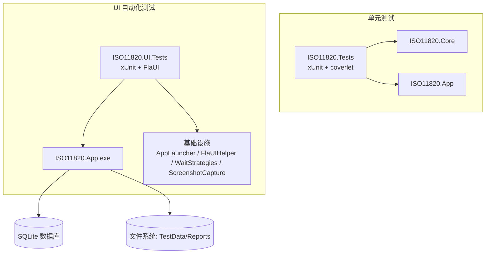
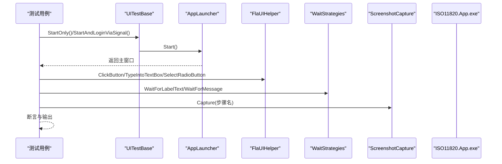
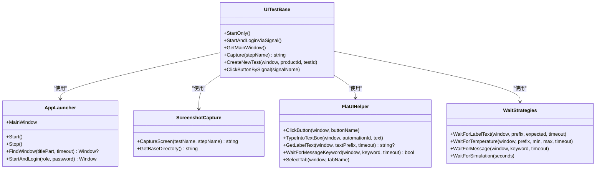
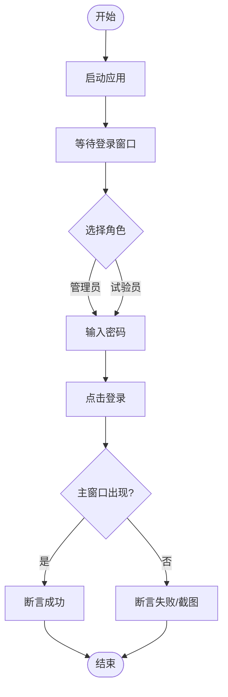
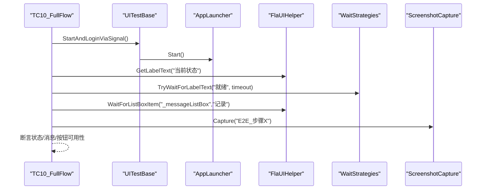
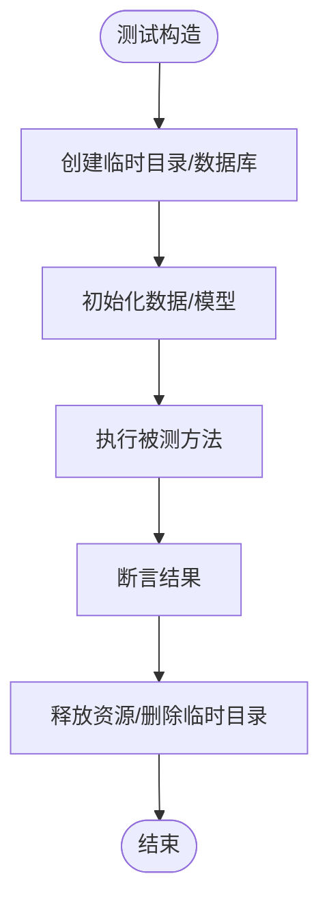
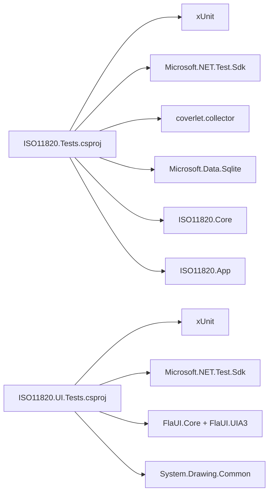

# 测试策略

<cite>
**本文引用的文件**   
- [README.md](file://tests/ISO11820.UI.Tests/README.md)
- [UITestBase.cs](file://tests/ISO11820.UI.Tests/UITestBase.cs)
- [AppLauncher.cs](file://tests/ISO11820.UI.Tests/Infrastructure/AppLauncher.cs)
- [FlaUIHelper.cs](file://tests/ISO11820.UI.Tests/Infrastructure/FlaUIHelper.cs)
- [WaitStrategies.cs](file://tests/ISO11820.UI.Tests/Infrastructure/WaitStrategies.cs)
- [ScreenshotCapture.cs](file://tests/ISO11820.UI.Tests/Infrastructure/ScreenshotCapture.cs)
- [RunTests.ps1](file://tests/ISO11820.UI.Tests/RunTests.ps1)
- [xunit.runner.json](file://tests/ISO11820.UI.Tests/xunit.runner.json)
- [自动化测试提示词.md](file://tests/ISO11820.UI.Tests/自动化测试提示词.md)
- [TC01_Login.cs](file://tests/ISO11820.UI.Tests/tests/TC01_Login.cs)
- [TC10_FullFlow.cs](file://tests/ISO11820.UI.Tests/tests/TC10_FullFlow.cs)
- [AuthCoordinatorTests.cs](file://tests/ISO11820.Tests/Features/AuthCoordinatorTests.cs)
- [TestControllerTests.cs](file://tests/ISO11820.Tests/Runtime/TestControllerTests.cs)
- [CsvSampleWriterTests.cs](file://tests/ISO11820.Tests/Persistence/CsvSampleWriterTests.cs)
- [ISO11820.UI.Tests.csproj](file://tests/ISO11820.UI.Tests/ISO11820.UI.Tests.csproj)
- [ISO11820.Tests.csproj](file://tests/ISO11820.Tests/ISO11820.Tests.csproj)
</cite>

## 目录
1. [引言](#引言)
2. [项目结构](#项目结构)
3. [核心组件](#核心组件)
4. [架构总览](#架构总览)
5. [详细组件分析](#详细组件分析)
6. [依赖分析](#依赖分析)
7. [性能考虑](#性能考虑)
8. [故障排查指南](#故障排查指南)
9. [结论](#结论)
10. [附录](#附录)

## 引言
本测试策略面向 ISO 11820 系统，覆盖单元测试、UI 自动化验收测试与端到端流程验证。目标包括：
- 明确测试框架选择（xUnit + FlaUI）与使用方式
- 设计分层测试用例与覆盖率要求
- 搭建 UI 自动化测试环境与持续集成配置
- 文档化测试基类、测试数据准备与环境隔离
- 制定命名约定、断言策略与最佳实践
- 提供性能与负载测试指导
- 管理测试数据版本并生成测试报告

## 项目结构
仓库包含两套测试工程：
- 单元测试工程 tests/ISO11820.Tests：基于 xUnit，对业务逻辑、持久化与运行时控制器进行单元级验证
- UI 自动化验收测试工程 tests/ISO11820.UI.Tests：基于 xUnit + FlaUI，驱动 WinForms 应用完成登录、主界面、状态机、仿真、导出等验收场景

图表来源
- [ISO11820.UI.Tests.csproj:1-38](file://tests/ISO11820.UI.Tests/ISO11820.UI.Tests.csproj#L1-L38)
- [ISO11820.Tests.csproj:1-27](file://tests/ISO11820.Tests/ISO11820.Tests.csproj#L1-L27)

章节来源
- [README.md:1-238](file://tests/ISO11820.UI.Tests/README.md#L1-L238)
- [自动化测试提示词.md:1-107](file://tests/ISO11820.UI.Tests/自动化测试提示词.md#L1-L107)

## 核心组件
- 测试框架与运行器
  - xUnit：用于组织测试用例、断言与输出
  - Microsoft.NET.Test.Sdk：测试运行支持
  - xunit.runner.visualstudio：IDE 集成
  - coverlet.collector：单元测试覆盖率收集
- UI 自动化框架
  - FlaUI.Core + FlaUI.UIA3：通过 Windows UI Automation API 操作 WinForms 控件
- 截图与等待
  - ScreenshotCapture：按步骤保存屏幕截图
  - WaitStrategies：显式等待策略（文本、按钮状态、温度范围、消息关键词）
- 应用启动与封装
  - AppLauncher：启动/关闭被测应用、查找窗口、处理登录
  - FlaUIHelper：常用 UI 操作封装（按钮、输入框、单选/复选、消息区、Tab 切换等）
- 测试基类
  - UITestBase：统一启动/关闭、截图、信号文件触发、Win32 辅助方法

章节来源
- [ISO11820.UI.Tests.csproj:1-38](file://tests/ISO11820.UI.Tests/ISO11820.UI.Tests.csproj#L1-L38)
- [ISO11820.Tests.csproj:1-27](file://tests/ISO11820.Tests/ISO11820.Tests.csproj#L1-L27)
- [UITestBase.cs:1-210](file://tests/ISO11820.UI.Tests/UITestBase.cs#L1-L210)
- [AppLauncher.cs:1-240](file://tests/ISO11820.UI.Tests/Infrastructure/AppLauncher.cs#L1-L240)
- [FlaUIHelper.cs:1-295](file://tests/ISO11820.UI.Tests/Infrastructure/FlaUIHelper.cs#L1-L295)
- [WaitStrategies.cs:1-176](file://tests/ISO11820.UI.Tests/Infrastructure/WaitStrategies.cs#L1-L176)
- [ScreenshotCapture.cs:1-48](file://tests/ISO11820.UI.Tests/Infrastructure/ScreenshotCapture.cs#L1-L48)

## 架构总览
UI 自动化测试执行路径如下：
- 测试用例继承 UITestBase，调用 AppLauncher 启动被测应用
- 通过 FlaUIHelper 与 WaitStrategies 进行控件交互与等待
- 关键步骤由 ScreenshotCapture 自动截图
- 结果通过 xUnit 输出，脚本 RunTests.ps1 负责编译、过滤与汇总

图表来源
- [UITestBase.cs:1-210](file://tests/ISO11820.UI.Tests/UITestBase.cs#L1-L210)
- [AppLauncher.cs:1-240](file://tests/ISO11820.UI.Tests/Infrastructure/AppLauncher.cs#L1-L240)
- [FlaUIHelper.cs:1-295](file://tests/ISO11820.UI.Tests/Infrastructure/FlaUIHelper.cs#L1-L295)
- [WaitStrategies.cs:1-176](file://tests/ISO11820.UI.Tests/Infrastructure/WaitStrategies.cs#L1-L176)
- [ScreenshotCapture.cs:1-48](file://tests/ISO11820.UI.Tests/Infrastructure/ScreenshotCapture.cs#L1-L48)

## 详细组件分析

### 测试基类与 UI 自动化基础设施
- UITestBase
  - 职责：统一启动/关闭应用、获取主窗口、截图、信号文件触发、Win32 辅助方法
  - 关键点：通过信号文件避免直接 UI 点击的脆弱性；提供 CreateNewTest 以 Win32 方式填充对话框
- AppLauncher
  - 职责：启动/停止应用、查找窗口、默认登录流程、清理僵尸进程
  - 关键点：Application.Launch 启动后轮询桌面窗口；FindWindow 模糊匹配标题
- FlaUIHelper
  - 职责：按钮点击、文本输入、单选/复选、消息区读取、ListBox 项等待、Tab 切换
  - 关键点：优先 AutomationId，降级为 Name/类型定位；消息区通过 Document 控件读取
- WaitStrategies
  - 职责：显式等待标签文本、按钮可用状态、温度区间、消息关键词、窗口出现
  - 关键点：超时抛出 TimeoutException；Try 包装避免频繁异常
- ScreenshotCapture
  - 职责：按测试类与步骤名保存 PNG 截图到 Screenshots 目录
  - 关键点：线程安全写入；文件名含时间戳

图表来源
- [UITestBase.cs:1-210](file://tests/ISO11820.UI.Tests/UITestBase.cs#L1-L210)
- [AppLauncher.cs:1-240](file://tests/ISO11820.UI.Tests/Infrastructure/AppLauncher.cs#L1-L240)
- [FlaUIHelper.cs:1-295](file://tests/ISO11820.UI.Tests/Infrastructure/FlaUIHelper.cs#L1-L295)
- [WaitStrategies.cs:1-176](file://tests/ISO11820.UI.Tests/Infrastructure/WaitStrategies.cs#L1-L176)
- [ScreenshotCapture.cs:1-48](file://tests/ISO11820.UI.Tests/Infrastructure/ScreenshotCapture.cs#L1-L48)

章节来源
- [UITestBase.cs:1-210](file://tests/ISO11820.UI.Tests/UITestBase.cs#L1-L210)
- [AppLauncher.cs:1-240](file://tests/ISO11820.UI.Tests/Infrastructure/AppLauncher.cs#L1-L240)
- [FlaUIHelper.cs:1-295](file://tests/ISO11820.UI.Tests/Infrastructure/FlaUIHelper.cs#L1-L295)
- [WaitStrategies.cs:1-176](file://tests/ISO11820.UI.Tests/Infrastructure/WaitStrategies.cs#L1-L176)
- [ScreenshotCapture.cs:1-48](file://tests/ISO11820.UI.Tests/Infrastructure/ScreenshotCapture.cs#L1-L48)

### 登录功能验收测试（TC01_Login）
- 覆盖点：角色单选按钮、密码输入框、无用户名输入框、登录按钮、管理员/试验员登录成功、错误提示、默认选中角色
- 关键断言：存在性断言、文本包含断言、窗口存在性断言
- 截图：每个关键步骤自动截图便于人工复核

图表来源
- [TC01_Login.cs:1-212](file://tests/ISO11820.UI.Tests/tests/TC01_Login.cs#L1-L212)
- [UITestBase.cs:1-210](file://tests/ISO11820.UI.Tests/UITestBase.cs#L1-L210)
- [FlaUIHelper.cs:1-295](file://tests/ISO11820.UI.Tests/Infrastructure/FlaUIHelper.cs#L1-L295)

章节来源
- [TC01_Login.cs:1-212](file://tests/ISO11820.UI.Tests/tests/TC01_Login.cs#L1-L212)

### 端到端完整流程（TC10_FullFlow）
- 覆盖点：启动登录、新建试验、开始升温、温度稳定、开始记录、手动停止、记录查询、导出检查
- 关键策略：信号文件触发 UI 动作；显式等待状态与消息；截图记录每一步
- 输出：控制台日志 + 截图目录

图表来源
- [TC10_FullFlow.cs:1-360](file://tests/ISO11820.UI.Tests/tests/TC10_FullFlow.cs#L1-L360)
- [UITestBase.cs:1-210](file://tests/ISO11820.UI.Tests/UITestBase.cs#L1-L210)
- [FlaUIHelper.cs:1-295](file://tests/ISO11820.UI.Tests/Infrastructure/FlaUIHelper.cs#L1-L295)
- [WaitStrategies.cs:1-176](file://tests/ISO11820.UI.Tests/Infrastructure/WaitStrategies.cs#L1-L176)
- [ScreenshotCapture.cs:1-48](file://tests/ISO11820.UI.Tests/Infrastructure/ScreenshotCapture.cs#L1-L48)

章节来源
- [TC10_FullFlow.cs:1-360](file://tests/ISO11820.UI.Tests/tests/TC10_FullFlow.cs#L1-L360)

### 单元测试示例与数据隔离
- AuthCoordinatorTests：使用临时 SQLite 数据库，构造 DbHelper 与 DatabaseInitializer，确保每次测试独立环境
- TestControllerTests：通过 SensorSimulator 模拟温度，验证状态机流转与广播快照
- CsvSampleWriterTests：在临时目录创建测试数据，验证 CSV 写入与目录结构

图表来源
- [AuthCoordinatorTests.cs:1-105](file://tests/ISO11820.Tests/Features/AuthCoordinatorTests.cs#L1-L105)
- [TestControllerTests.cs:1-265](file://tests/ISO11820.Tests/Runtime/TestControllerTests.cs#L1-L265)
- [CsvSampleWriterTests.cs:1-184](file://tests/ISO11820.Tests/Persistence/CsvSampleWriterTests.cs#L1-L184)

章节来源
- [AuthCoordinatorTests.cs:1-105](file://tests/ISO11820.Tests/Features/AuthCoordinatorTests.cs#L1-L105)
- [TestControllerTests.cs:1-265](file://tests/ISO11820.Tests/Runtime/TestControllerTests.cs#L1-L265)
- [CsvSampleWriterTests.cs:1-184](file://tests/ISO11820.Tests/Persistence/CsvSampleWriterTests.cs#L1-L184)

## 依赖分析
- 单元测试工程
  - 引用 xUnit、Microsoft.NET.Test.Sdk、coverlet.collector、Microsoft.Data.Sqlite
  - 项目引用 ISO11820.Core 与 ISO11820.App，便于直接调用业务逻辑
- UI 自动化测试工程
  - 引用 xUnit、Microsoft.NET.Test.Sdk、FlaUI.Core、FlaUI.UIA3、System.Drawing.Common
  - 不直接引用被测应用项目，通过构建产物路径启动 exe

图表来源
- [ISO11820.Tests.csproj:1-27](file://tests/ISO11820.Tests/ISO11820.Tests.csproj#L1-L27)
- [ISO11820.UI.Tests.csproj:1-38](file://tests/ISO11820.UI.Tests/ISO11820.UI.Tests.csproj#L1-L38)

章节来源
- [ISO11820.Tests.csproj:1-27](file://tests/ISO11820.Tests/ISO11820.Tests.csproj#L1-L27)
- [ISO11820.UI.Tests.csproj:1-38](file://tests/ISO11820.UI.Tests/ISO11820.UI.Tests.csproj#L1-L38)

## 性能考虑
- UI 自动化测试
  - 显式等待优于固定休眠，减少不稳定与耗时
  - 控制并发：xunit.runner.json 禁用并行集合与最大线程数，避免共享应用实例冲突
  - 截图仅保留必要步骤，避免磁盘 I/O 瓶颈
- 单元测试
  - 使用内存或临时文件数据库，避免真实外部依赖
  - 合理设置仿真参数，缩短状态转换时间（如提高升温速率）
- 建议指标
  - 单次 UI 测试平均时长 < 60s（不含长时仿真）
  - 端到端流程控制在可接受范围内，必要时拆分子流程

章节来源
- [xunit.runner.json:1-4](file://tests/ISO11820.UI.Tests/xunit.runner.json#L1-L4)
- [自动化测试提示词.md:1-107](file://tests/ISO11820.UI.Tests/自动化测试提示词.md#L1-L107)

## 故障排查指南
- 应用启动失败
  - 确认已编译主程序；检查 AppLauncher 搜索路径与解决方案根目录
- 控件未找到
  - 检查控件名称与 AutomationId；查看对应步骤截图定位界面状态
- 超时
  - 调整 WaitStrategies 超时时间；检查仿真参数（升温速率、目标温度、稳定阈值）
- 端口/进程占用
  - AppLauncher 会清理僵尸进程；必要时手动终止残留进程

章节来源
- [AppLauncher.cs:1-240](file://tests/ISO11820.UI.Tests/Infrastructure/AppLauncher.cs#L1-L240)
- [WaitStrategies.cs:1-176](file://tests/ISO11820.UI.Tests/Infrastructure/WaitStrategies.cs#L1-L176)
- [README.md:170-208](file://tests/ISO11820.UI.Tests/README.md#L170-L208)

## 结论
本策略以 xUnit 为核心测试框架，结合 FlaUI 实现 WinForms 应用的 UI 自动化验收测试；通过 UITestBase 与基础设施封装提升稳定性与可维护性。单元测试侧重业务逻辑与数据层验证，UI 测试覆盖关键用户流程与状态机行为。配合脚本与配置文件，可实现本地一键运行与基础 CI 集成。后续可在覆盖率统计、报告生成与性能基准方面进一步完善。

## 附录

### 测试框架选择与理由
- xUnit：轻量、现代、与 .NET 生态良好集成
- FlaUI：原生支持 WinForms，通过无障碍树操作控件，不依赖像素
- coverlet：与 xUnit 无缝集成，便于覆盖率采集

章节来源
- [自动化测试提示词.md:1-107](file://tests/ISO11820.UI.Tests/自动化测试提示词.md#L1-L107)
- [ISO11820.Tests.csproj:1-27](file://tests/ISO11820.Tests/ISO11820.Tests.csproj#L1-L27)
- [ISO11820.UI.Tests.csproj:1-38](file://tests/ISO11820.UI.Tests/ISO11820.UI.Tests.csproj#L1-L38)

### 测试用例设计与覆盖率要求
- 设计原则
  - 单测聚焦单一职责，边界条件与异常路径全覆盖
  - UI 测试遵循“最小必要”原则，关键路径与回归场景优先
- 覆盖率目标
  - 单元测试行覆盖率 ≥ 80%（可按模块逐步提升）
  - UI 自动化测试不强制覆盖率，但需保证关键流程通过率
- 覆盖率采集
  - 使用 coverlet.collector 与 dotnet test 集成

章节来源
- [ISO11820.Tests.csproj:1-27](file://tests/ISO11820.Tests/ISO11820.Tests.csproj#L1-L27)

### UI 自动化测试环境搭建
- 前置条件
  - 编译主程序与测试项目
  - 确保桌面环境未被遮挡，允许 UIA 访问
- 运行方式
  - 使用 RunTests.ps1 一键运行，支持过滤与列出测试
  - 也可直接使用 dotnet test 命令

章节来源
- [README.md:56-108](file://tests/ISO11820.UI.Tests/README.md#L56-L108)
- [RunTests.ps1:1-112](file://tests/ISO11820.UI.Tests/RunTests.ps1#L1-L112)

### 持续集成配置建议
- 构建阶段
  - 编译主程序与测试项目
- 测试阶段
  - 运行 UI 自动化测试（禁用并行）
  - 生成测试结果与截图
- 报告阶段
  - 聚合测试结果（xUnit XML），上传截图作为附件
- 注意
  - 在无头环境中无法运行 UI 测试，需在带 GUI 的代理上执行

章节来源
- [xunit.runner.json:1-4](file://tests/ISO11820.UI.Tests/xunit.runner.json#L1-L4)
- [RunTests.ps1:60-84](file://tests/ISO11820.UI.Tests/RunTests.ps1#L60-L84)

### 测试基类设计与扩展
- 基类能力
  - 启动/关闭应用、获取主窗口、截图、信号文件触发、Win32 辅助
- 扩展建议
  - 新增通用等待策略（如滚动条可见性）
  - 增加多语言/主题适配的控件定位策略

章节来源
- [UITestBase.cs:1-210](file://tests/ISO11820.UI.Tests/UITestBase.cs#L1-L210)

### 测试数据准备与环境隔离
- 单元测试
  - 使用临时目录与 SQLite 文件，测试结束后清理
- UI 自动化
  - 通过信号文件与 Win32 注入数据，避免硬编码 UI 操作
  - 导出目录与 TestData 路径可配置，避免污染生产数据

章节来源
- [AuthCoordinatorTests.cs:1-105](file://tests/ISO11820.Tests/Features/AuthCoordinatorTests.cs#L1-L105)
- [CsvSampleWriterTests.cs:1-184](file://tests/ISO11820.Tests/Persistence/CsvSampleWriterTests.cs#L1-L184)
- [TC10_FullFlow.cs:293-311](file://tests/ISO11820.UI.Tests/tests/TC10_FullFlow.cs#L293-L311)

### 命名约定与断言策略
- 命名约定
  - 测试类前缀 TCxx_，按验收清单顺序编号
  - 测试方法 DisplayNames 描述具体断言点
- 断言策略
  - 优先断言关键状态与文本包含关系
  - 对 UI 元素存在性与可用性进行断言
  - 截图作为失败时的证据

章节来源
- [TC01_Login.cs:1-212](file://tests/ISO11820.UI.Tests/tests/TC01_Login.cs#L1-L212)
- [TC10_FullFlow.cs:1-360](file://tests/ISO11820.UI.Tests/tests/TC10_FullFlow.cs#L1-L360)

### 性能测试与负载测试指导
- 性能测试
  - 针对状态机 Tick 循环与温度稳定等待进行计时
  - 使用不同仿真参数评估响应时间与稳定性
- 负载测试
  - UI 自动化不适合高并发负载，建议在服务端接口层面进行
  - 若需 UI 压力，采用串行执行与分片运行

章节来源
- [TestControllerTests.cs:1-265](file://tests/ISO11820.Tests/Runtime/TestControllerTests.cs#L1-L265)
- [WaitStrategies.cs:1-176](file://tests/ISO11820.UI.Tests/Infrastructure/WaitStrategies.cs#L1-L176)

### 测试数据版本管理与测试报告生成
- 数据版本管理
  - 将初始数据与种子脚本纳入版本控制
  - 导出文件与截图按测试批次归档
- 报告生成
  - 使用 xUnit 内置 logger 输出详细日志
  - 结合脚本汇总截图数量与路径，便于人工审查

章节来源
- [RunTests.ps1:86-112](file://tests/ISO11820.UI.Tests/RunTests.ps1#L86-L112)
- [README.md:110-124](file://tests/ISO11820.UI.Tests/README.md#L110-L124)