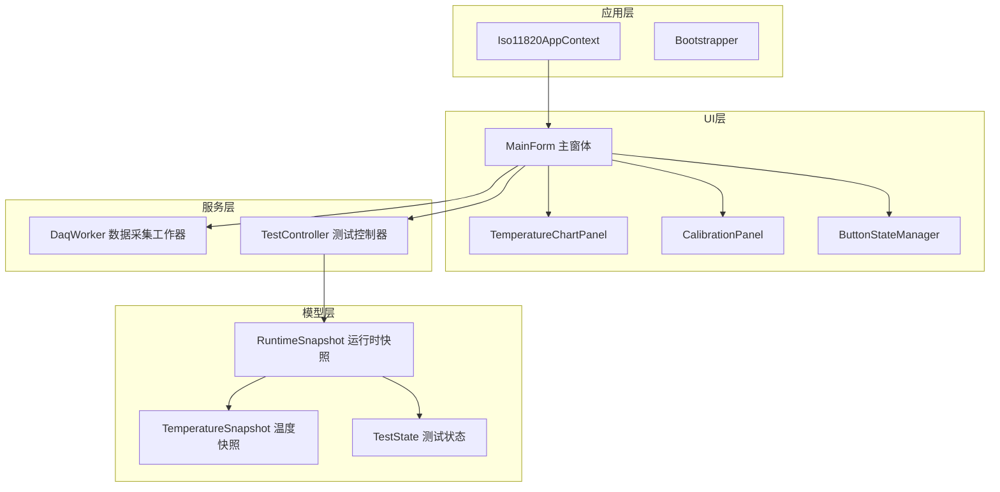
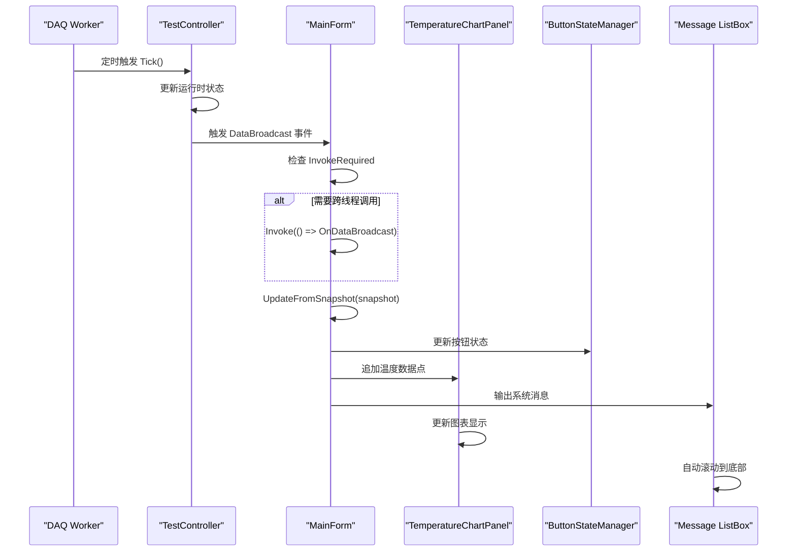
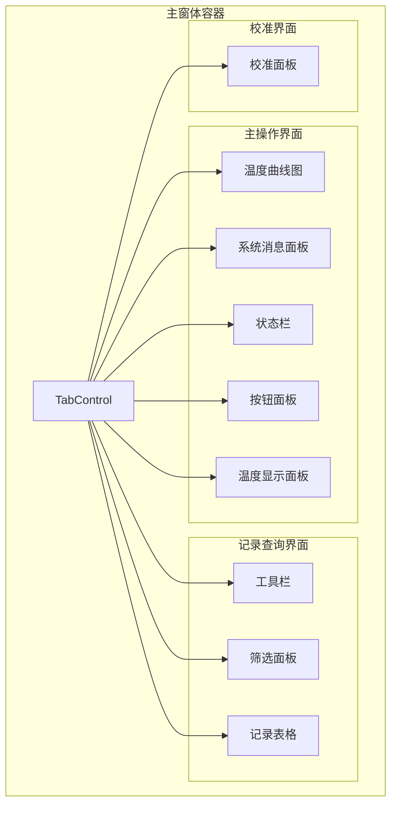
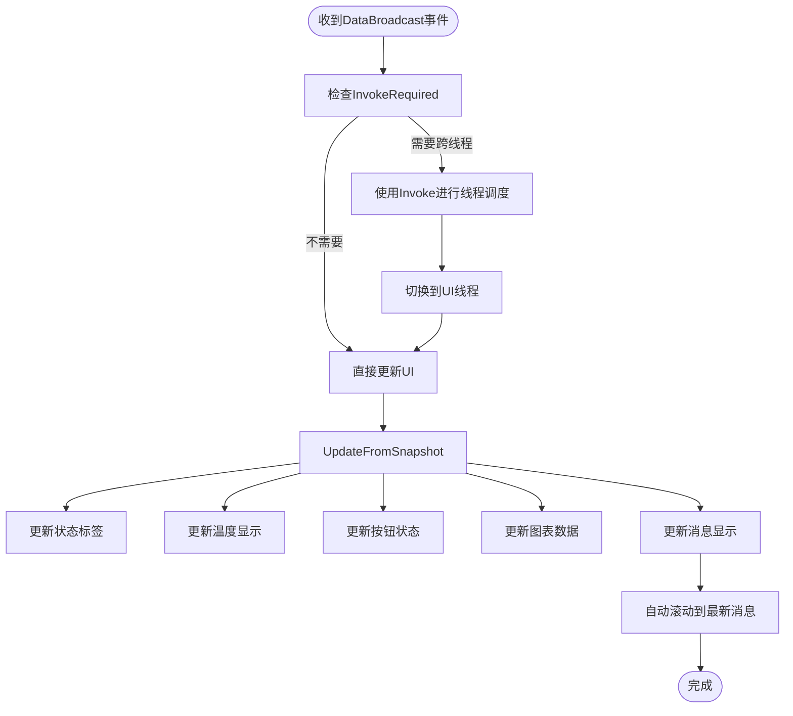
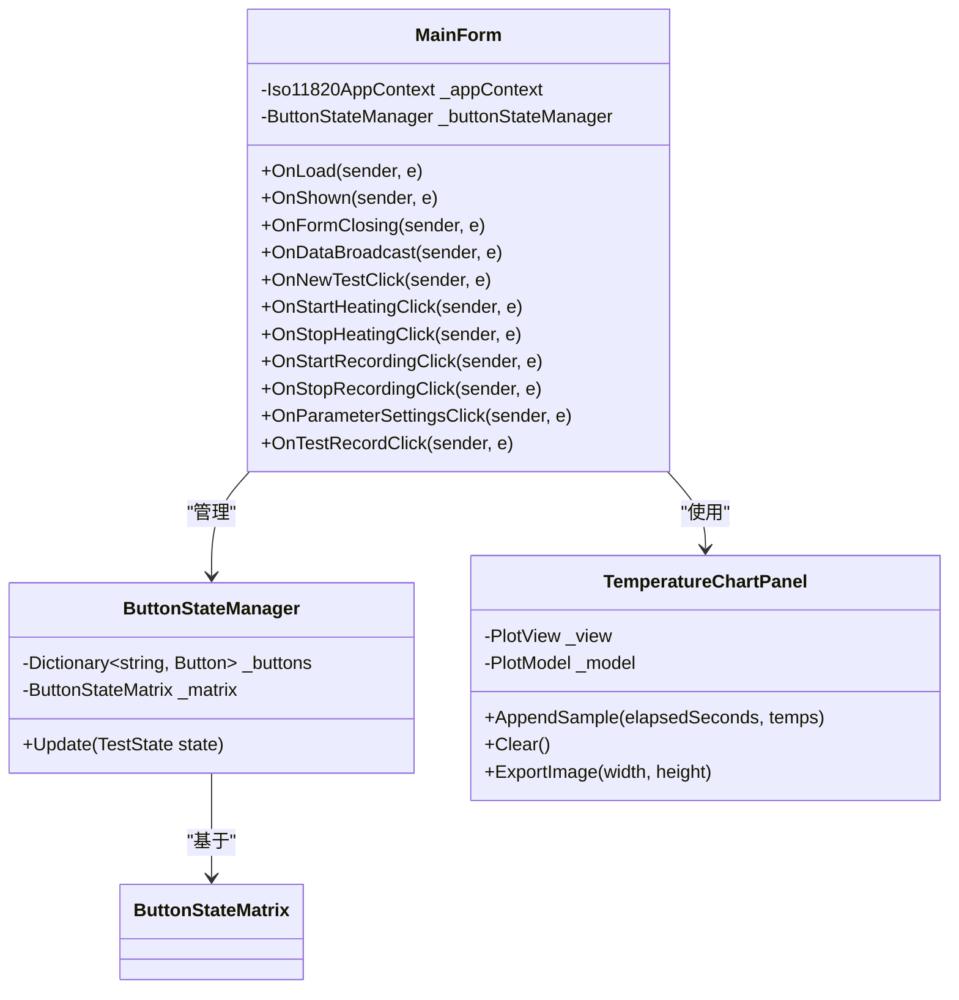
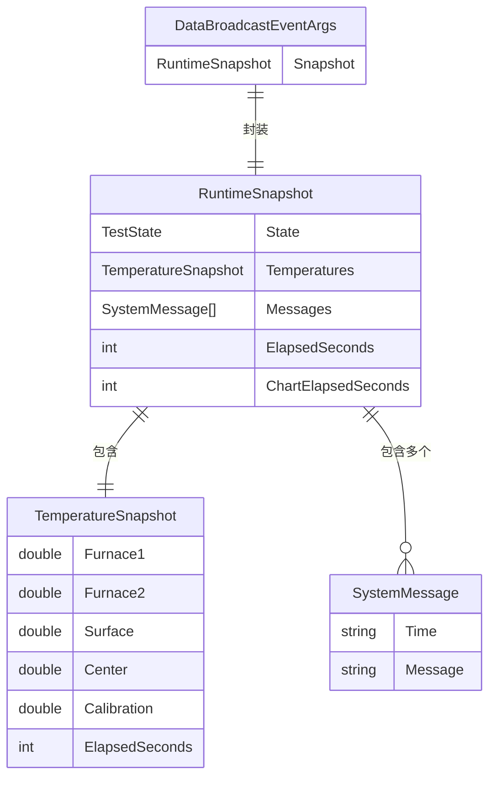
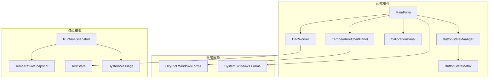

# 主窗体设计

<cite>
**本文档引用的文件**
- [MainForm.cs](file://src/ISO11820.App/UI/Forms/MainForm.cs)
- [TemperatureChartPanel.cs](file://src/ISO11820.App/UI/Chart/TemperatureChartPanel.cs)
- [DataBroadcastEventArgs.cs](file://src/ISO11820.App/Shared/Events/DataBroadcastEventArgs.cs)
- [RuntimeSnapshot.cs](file://src/ISO11820.App/Shared/Models/RuntimeSnapshot.cs)
- [TemperatureSnapshot.cs](file://src/ISO11820.Core/Models/TemperatureSnapshot.cs)
- [TestState.cs](file://src/ISO11820.Core/Enums/TestState.cs)
- [ButtonStateManager.cs](file://src/ISO11820.App/UI/Common/ButtonStateManager.cs)
- [ButtonStateMatrix.cs](file://src/ISO11820.App/UI/Common/ButtonStateMatrix.cs)
- [CalibrationPanel.cs](file://src/ISO11820.App/UI/Panels/CalibrationPanel.cs)
- [SystemMessage.cs](file://src/ISO11820.Core/Models/SystemMessage.cs)
- [DaqWorker.cs](file://src/ISO11820.App/Runtime/Services/DaqWorker.cs)
</cite>

## 目录
1. [简介](#简介)
2. [项目结构](#项目结构)
3. [核心组件](#核心组件)
4. [架构概览](#架构概览)
5. [详细组件分析](#详细组件分析)
6. [依赖关系分析](#依赖关系分析)
7. [性能考量](#性能考量)
8. [故障排除指南](#故障排除指南)
9. [结论](#结论)
10. [附录](#附录)

## 简介
本文件为ISO 11820系统的主窗体设计文档，详细描述了主窗体的布局结构设计、Tab页面组织、Dock样式布局以及控件层次关系。文档重点解释了状态栏、温度显示面板、按钮组和图表区域的布局逻辑，同时阐述了WinForms控件的创建工厂方法、事件绑定机制和线程安全的UI更新策略。此外，文档还涵盖了跨线程调用的Invoke模式、DataBroadcast事件处理、窗体生命周期管理、资源清理和内存优化最佳实践，并提供了布局调试技巧和响应式设计考虑。

## 项目结构
ISO 11820应用采用分层架构设计，主窗体位于UI层，负责用户交互和可视化展示。项目结构清晰地分离了业务逻辑、数据模型和用户界面组件。

**图表来源**
- [MainForm.cs:1-50](file://src/ISO11820.App/UI/Forms/MainForm.cs#L1-L50)
- [TemperatureChartPanel.cs:1-30](file://src/ISO11820.App/UI/Chart/TemperatureChartPanel.cs#L1-L30)
- [DaqWorker.cs:1-20](file://src/ISO11820.App/Runtime/Services/DaqWorker.cs#L1-L20)

**章节来源**
- [MainForm.cs:1-100](file://src/ISO11820.App/UI/Forms/MainForm.cs#L1-L100)
- [Bootstrapper.cs](file://src/ISO11820.App/App/Bootstrapper.cs)

## 核心组件
主窗体采用模块化设计，包含以下核心组件：

### 布局容器组件
- **TabControl**: 主窗体的Tab页面容器，支持三个主要标签页
- **Panel**: 作为Dock布局的基础容器，支持Top、Bottom、Left、Right、Fill等停靠方式
- **RichTextBox**: 系统消息显示区域，支持彩色文本输出

### 状态显示组件
- **状态标签**: 显示当前测试状态和运行时间
- **温度显示面板**: 包含炉温1、炉温2、表面温度、中心温度和校准温度显示
- **温漂显示**: 实时计算和显示温度漂移率

### 控制按钮组件
- **按钮状态管理器**: 统一管理所有控制按钮的启用/禁用状态
- **按钮状态矩阵**: 基于测试状态的按钮行为规则定义

### 数据可视化组件
- **温度曲线图**: 使用OxyPlot实现的实时温度曲线显示
- **记录查询表格**: 支持历史试验记录的查询和导出

**章节来源**
- [MainForm.cs:30-78](file://src/ISO11820.App/UI/Forms/MainForm.cs#L30-L78)
- [TemperatureChartPanel.cs:9-30](file://src/ISO11820.App/UI/Chart/TemperatureChartPanel.cs#L9-L30)

## 架构概览
主窗体采用事件驱动架构，通过DataBroadcast事件实现后台数据与UI的解耦通信。

**图表来源**
- [MainForm.cs:537-546](file://src/ISO11820.App/UI/Forms/MainForm.cs#L537-L546)
- [DaqWorker.cs:45-48](file://src/ISO11820.App/Runtime/Services/DaqWorker.cs#L45-L48)
- [TemperatureChartPanel.cs:122-205](file://src/ISO11820.App/UI/Chart/TemperatureChartPanel.cs#L122-L205)

## 详细组件分析

### 主窗体布局设计
主窗体采用分层Dock布局，遵循"底部→顶部→右侧→左侧→填充"的布局顺序，确保各组件正确分配空间。

**图表来源**
- [MainForm.cs:261-451](file://src/ISO11820.App/UI/Forms/MainForm.cs#L261-L451)

#### 状态栏布局逻辑
状态栏采用绝对定位方式，通过Anchor属性实现响应式布局：
- **左侧固定宽度区域**: 显示当前状态和运行时间
- **中间区域**: 温漂显示，采用蓝色强调
- **右侧自适应区域**: 操作员信息，使用右对齐

#### 温度显示面板设计
温度面板采用深色背景设计，突出温度数值的可读性：
- **标题区域**: 居中显示"温度通道"
- **温度标签**: 绿色前景色，11号字体，每行40像素高度
- **布局间距**: 标签间保持10像素垂直间距

#### 按钮组布局策略
按钮面板固定宽度160像素，采用垂直排列：
- **按钮尺寸**: 136×40像素，统一边距
- **位置分布**: 顶部起始位置20像素，垂直间距50像素
- **功能分组**: 新建试验、加热控制、记录控制、辅助功能四组

#### 图表区域设计
图表区域采用Fill布局，最大化利用可用空间：
- **滚动窗口**: 600秒（10分钟）时间窗口
- **数据限制**: 最多750个数据点
- **轴范围**: X轴0-600秒，Y轴0-800°C

**章节来源**
- [MainForm.cs:99-256](file://src/ISO11820.App/UI/Forms/MainForm.cs#L99-L256)

### 线程安全与跨线程调用
主窗体实现了完整的线程安全机制，确保后台数据更新不会破坏UI线程的安全性。

**图表来源**
- [MainForm.cs:537-609](file://src/ISO11820.App/UI/Forms/MainForm.cs#L537-L609)

#### 跨线程调用模式
主窗体实现了标准的Invoke模式：
- **事件处理器**: OnDataBroadcast使用InvokeRequired检查
- **委托调用**: 通过Invoke(() => method())确保UI线程执行
- **异常处理**: 在跨线程调用前后进行异常捕获

#### UI更新策略
- **批量更新**: 单次事件处理中完成所有UI更新
- **增量刷新**: 图表仅在非空闲状态下更新
- **条件渲染**: 根据消息类型设置不同颜色

**章节来源**
- [MainForm.cs:537-546](file://src/ISO11820.App/UI/Forms/MainForm.cs#L537-L546)
- [MainForm.cs:548-609](file://src/ISO11820.App/UI/Forms/MainForm.cs#L548-L609)

### 事件绑定机制
主窗体建立了完整的事件绑定体系，涵盖用户交互和系统事件。

**图表来源**
- [MainForm.cs:497-703](file://src/ISO11820.App/UI/Forms/MainForm.cs#L497-L703)
- [ButtonStateManager.cs:10-48](file://src/ISO11820.App/UI/Common/ButtonStateManager.cs#L10-L48)
- [TemperatureChartPanel.cs:13-84](file://src/ISO11820.App/UI/Chart/TemperatureChartPanel.cs#L13-L84)

#### 生命周期管理
- **加载阶段**: 显示登录对话框，验证用户身份
- **显示阶段**: 启动DAQ工作器，开始数据采集
- **关闭阶段**: 解除事件订阅，停止数据采集

#### 用户交互事件
- **按钮点击**: 委托给相应的协调器或控制器
- **表格双击**: 打开详细记录对话框
- **选项卡切换**: 自动刷新记录查询数据

**章节来源**
- [MainForm.cs:497-531](file://src/ISO11820.App/UI/Forms/MainForm.cs#L497-L531)
- [MainForm.cs:628-703](file://src/ISO11820.App/UI/Forms/MainForm.cs#L628-L703)

### 数据模型与事件处理
系统使用强类型的运行时快照模型，确保数据传输的一致性和安全性。

**图表来源**
- [RuntimeSnapshot.cs:6-11](file://src/ISO11820.App/Shared/Models/RuntimeSnapshot.cs#L6-L11)
- [TemperatureSnapshot.cs:3-9](file://src/ISO11820.Core/Models/TemperatureSnapshot.cs#L3-L9)
- [SystemMessage.cs:3](file://src/ISO11820.Core/Models/SystemMessage.cs#L3)
- [DataBroadcastEventArgs.cs:5-13](file://src/ISO11820.App/Shared/Events/DataBroadcastEventArgs.cs#L5-L13)

#### 数据广播机制
- **事件源**: TestController定期触发DataBroadcast事件
- **数据封装**: 使用DataBroadcastEventArgs包装RuntimeSnapshot
- **接收处理**: MainForm的OnDataBroadcast方法处理事件

#### 状态机集成
按钮状态管理器基于TestState枚举的状态机：
- **Idle**: 允许新建试验和参数设置
- **Preparing**: 允许停止加热
- **Ready**: 允许开始记录
- **Recording**: 允许停止记录
- **Complete**: 允许新建试验和查看记录

**章节来源**
- [DataBroadcastEventArgs.cs:5-13](file://src/ISO11820.App/Shared/Events/DataBroadcastEventArgs.cs#L5-L13)
- [RuntimeSnapshot.cs:6-11](file://src/ISO11820.App/Shared/Models/RuntimeSnapshot.cs#L6-L11)
- [ButtonStateMatrix.cs:11-62](file://src/ISO11820.App/UI/Common/ButtonStateMatrix.cs#L11-L62)

## 依赖关系分析

**图表来源**
- [MainForm.cs:1-12](file://src/ISO11820.App/UI/Forms/MainForm.cs#L1-L12)
- [TemperatureChartPanel.cs:1-5](file://src/ISO11820.App/UI/Chart/TemperatureChartPanel.cs#L1-L5)

### 组件耦合度分析
- **低耦合设计**: 主窗体通过接口和事件与各组件通信
- **高内聚特性**: 每个组件专注于特定功能领域
- **依赖注入**: 通过构造函数注入依赖，便于测试和维护

### 外部依赖管理
- **OxyPlot**: 专门的图表绘制库，提供高性能的图形渲染
- **WinForms**: 标准Windows桌面应用程序框架
- **System.Timers**: 定时器服务，支持后台数据采集

**章节来源**
- [MainForm.cs:1-12](file://src/ISO11820.App/UI/Forms/MainForm.cs#L1-L12)
- [TemperatureChartPanel.cs:1-5](file://src/ISO11820.App/UI/Chart/TemperatureChartPanel.cs#L1-L5)

## 性能考量

### 内存优化策略
1. **数据点限制**: 图表最多保留750个数据点，防止内存泄漏
2. **定时器节流**: 800ms间隔的DAQ定时器平衡性能和响应性
3. **延迟初始化**: 控件按需创建，减少启动时间
4. **资源释放**: 实现IDisposable接口，确保及时释放资源

### 渲染性能优化
- **增量更新**: 仅在有新数据时更新图表
- **批量操作**: UI更新采用批量处理，减少重绘次数
- **条件渲染**: 在空闲状态下跳过不必要的更新

### 响应式设计考虑
- **动态尺寸**: 支持窗口大小变化，重新计算布局
- **自适应控件**: 使用Dock和Anchor属性实现响应式布局
- **最小尺寸**: 设置控件的MinimumSize属性，确保可读性

## 故障排除指南

### 常见问题诊断
1. **图表不显示**: 检查PlotView的句柄创建状态和可见性
2. **按钮状态异常**: 验证ButtonStateMatrix的状态映射
3. **数据更新延迟**: 确认InvokeRequired检查是否正确执行
4. **内存泄漏**: 监控数据点数量和定时器状态

### 调试技巧
- **诊断日志**: 使用临时文件记录图表绘制和数据更新信息
- **状态监控**: 通过调试输出跟踪控件状态变化
- **性能分析**: 监控绘制频率和内存使用情况

### 资源清理最佳实践
- **事件解除订阅**: 在FormClosing事件中解除所有事件订阅
- **定时器停止**: 确保定时器在窗体关闭时停止
- **对象销毁**: 实现Dispose模式，正确释放托管和非托管资源

**章节来源**
- [MainForm.cs:551-557](file://src/ISO11820.App/UI/Forms/MainForm.cs#L551-L557)
- [TemperatureChartPanel.cs:86-105](file://src/ISO11820.App/UI/Chart/TemperatureChartPanel.cs#L86-L105)

## 结论
ISO 11820主窗体设计体现了现代WinForms应用的最佳实践，通过合理的布局设计、严格的线程安全机制和清晰的组件分离，实现了高性能、可维护的用户界面。系统采用事件驱动架构，确保了数据流的顺畅和UI响应的及时性。通过模块化的组件设计和完善的资源管理，为主窗体提供了良好的扩展性和稳定性基础。

## 附录

### 关键配置参数
- **窗体尺寸**: 1280×800像素，居中显示
- **字体设置**: Microsoft YaHei，10号字体
- **图表窗口**: 600秒滚动窗口，750点上限
- **更新频率**: 800ms定时器间隔

### 开发规范
- **命名约定**: 采用PascalCase命名法
- **代码注释**: 详细的XML文档注释
- **异常处理**: 完善的try-catch异常处理机制
- **资源管理**: 实现IDisposable接口的标准模式