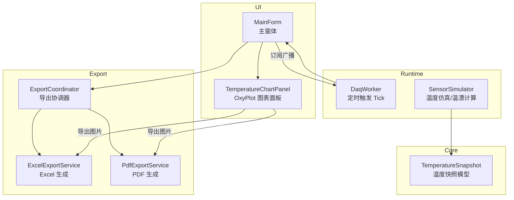
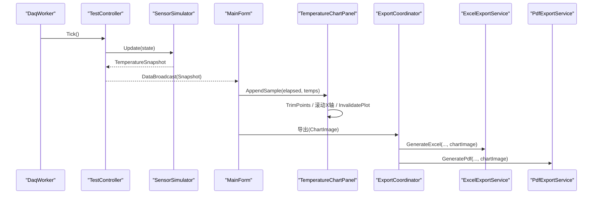
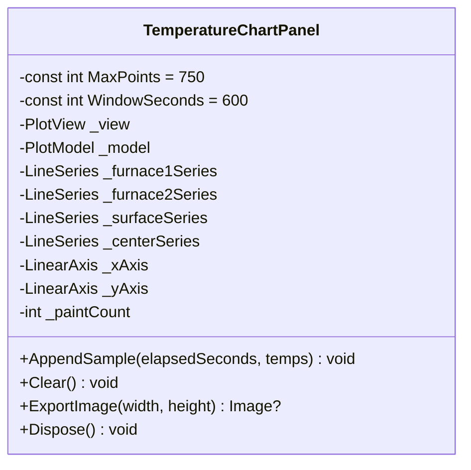
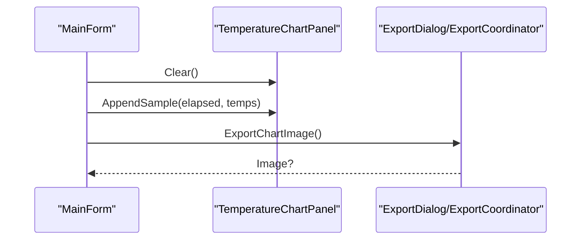
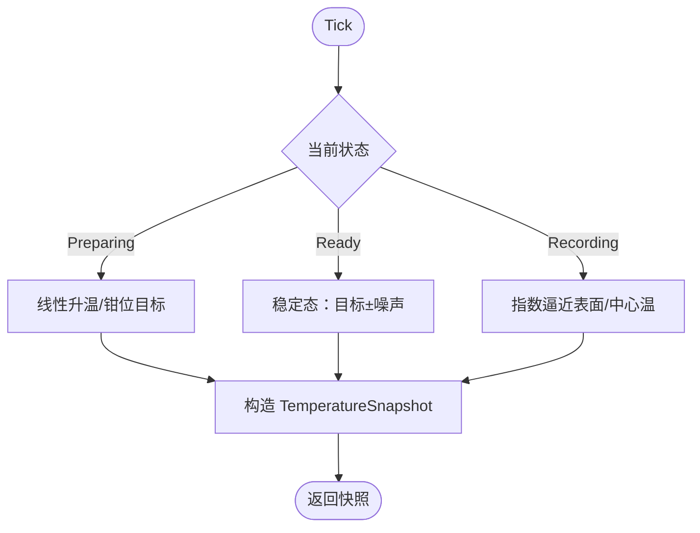
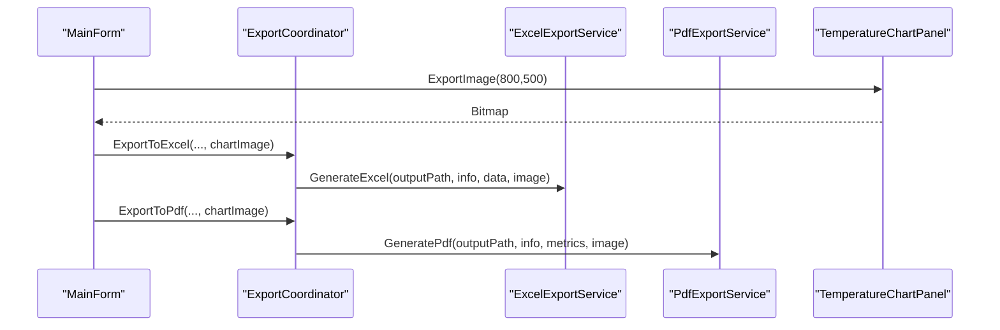
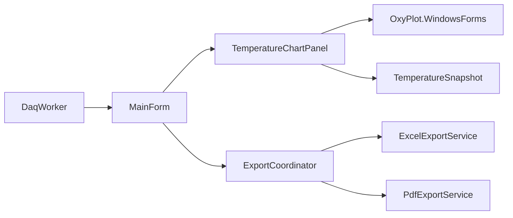

# 图表组件

<cite>
**本文引用的文件**   
- [TemperatureChartPanel.cs](file://src/ISO11820.App/UI/Chart/TemperatureChartPanel.cs)
- [MainForm.cs](file://src/ISO11820.App/UI/Forms/MainForm.cs)
- [TemperatureSnapshot.cs](file://src/ISO11820.Core/Models/TemperatureSnapshot.cs)
- [SensorSimulator.cs](file://src/ISO11820.App/Runtime/Services/SensorSimulator.cs)
- [DaqWorker.cs](file://src/ISO11820.App/Runtime/Services/DaqWorker.cs)
- [ExcelExportService.cs](file://src/ISO11820.App/Features/Export/ExcelExportService.cs)
- [PdfExportService.cs](file://src/ISO11820.App/Features/Export/PdfExportService.cs)
- [ExportCoordinator.cs](file://src/ISO11820.App/Features/Export/ExportCoordinator.cs)
</cite>

## 目录
1. [简介](#简介)
2. [项目结构](#项目结构)
3. [核心组件](#核心组件)
4. [架构总览](#架构总览)
5. [详细组件分析](#详细组件分析)
6. [依赖关系分析](#依赖关系分析)
7. [性能与内存优化](#性能与内存优化)
8. [故障排查指南](#故障排查指南)
9. [结论](#结论)
10. [附录](#附录)

## 简介
本章节面向 ISO 11820 系统的图表子系统，聚焦 OxyPlot 图表的集成实现、实时温度曲线可视化、时间轴滚动窗口、多通道曲线显示、导出与报告集成、以及性能优化策略。文档从系统架构到代码级细节逐层展开，帮助读者快速理解并扩展该图表组件。

## 项目结构
图表相关代码主要分布在 UI 层与导出服务中：
- UI 层：OxyPlot 图表面板封装、主窗体布局与数据广播处理
- 运行时：采样节拍器与传感器仿真，提供温度快照
- 导出服务：将图表图片嵌入 Excel/PDF 报告

图示来源
- [MainForm.cs:254-273](file://src/ISO11820.App/UI/Forms/MainForm.cs#L254-L273)
- [TemperatureChartPanel.cs:13-84](file://src/ISO11820.App/UI/Chart/TemperatureChartPanel.cs#L13-L84)
- [DaqWorker.cs:1-49](file://src/ISO11820.App/Runtime/Services/DaqWorker.cs#L1-L49)
- [SensorSimulator.cs:1-44](file://src/ISO11820.App/Runtime/Services/SensorSimulator.cs#L1-L44)
- [TemperatureSnapshot.cs:1-10](file://src/ISO11820.Core/Models/TemperatureSnapshot.cs#L1-L10)
- [ExportCoordinator.cs:79-119](file://src/ISO11820.App/Features/Export/ExportCoordinator.cs#L79-L119)
- [ExcelExportService.cs:23-60](file://src/ISO11820.App/Features/Export/ExcelExportService.cs#L23-L60)
- [PdfExportService.cs:8-35](file://src/ISO11820.App/Features/Export/PdfExportService.cs#L8-L35)

章节来源
- [MainForm.cs:254-273](file://src/ISO11820.App/UI/Forms/MainForm.cs#L254-L273)
- [TemperatureChartPanel.cs:13-84](file://src/ISO11820.App/UI/Chart/TemperatureChartPanel.cs#L13-L84)
- [DaqWorker.cs:1-49](file://src/ISO11820.App/Runtime/Services/DaqWorker.cs#L1-L49)
- [SensorSimulator.cs:1-44](file://src/ISO11820.App/Runtime/Services/SensorSimulator.cs#L1-L44)
- [TemperatureSnapshot.cs:1-10](file://src/ISO11820.Core/Models/TemperatureSnapshot.cs#L1-L10)
- [ExportCoordinator.cs:79-119](file://src/ISO11820.App/Features/Export/ExportCoordinator.cs#L79-L119)
- [ExcelExportService.cs:23-60](file://src/ISO11820.App/Features/Export/ExcelExportService.cs#L23-L60)
- [PdfExportService.cs:8-35](file://src/ISO11820.App/Features/Export/PdfExportService.cs#L8-L35)

## 核心组件
- TemperatureChartPanel：基于 OxyPlot 的温度曲线图面板，负责初始化坐标轴、系列、滚动窗口、追加采样点、裁剪数据、刷新渲染与导出图片。
- MainForm：主界面，承载图表控件，订阅后台数据广播，调用 AppendSample/Clear/ExportImage。
- TemperatureSnapshot：温度快照记录（炉温1/炉温2/表面温/中心温/校准/累计秒）。
- SensorSimulator：温度仿真与温漂计算，提供 ChartElapsedSeconds 作为时间轴 X 值。
- DaqWorker：定时器驱动 TestController.Tick，间接产生温度快照广播。
- ExportCoordinator/ExcelExportService/PdfExportService：将图表图片嵌入 Excel/PDF 报告。

章节来源
- [TemperatureChartPanel.cs:13-84](file://src/ISO11820.App/UI/Chart/TemperatureChartPanel.cs#L13-L84)
- [MainForm.cs:537-609](file://src/ISO11820.App/UI/Forms/MainForm.cs#L537-L609)
- [TemperatureSnapshot.cs:1-10](file://src/ISO11820.Core/Models/TemperatureSnapshot.cs#L1-L10)
- [SensorSimulator.cs:37-44](file://src/ISO11820.App/Runtime/Services/SensorSimulator.cs#L37-L44)
- [DaqWorker.cs:1-49](file://src/ISO11820.App/Runtime/Services/DaqWorker.cs#L1-L49)
- [ExportCoordinator.cs:79-119](file://src/ISO11820.App/Features/Export/ExportCoordinator.cs#L79-L119)
- [ExcelExportService.cs:23-60](file://src/ISO11820.App/Features/Export/ExcelExportService.cs#L23-L60)
- [PdfExportService.cs:8-35](file://src/ISO11820.App/Features/Export/PdfExportService.cs#L8-L35)

## 架构总览
下图展示从数据采集到图表渲染与导出的端到端流程。

图示来源
- [DaqWorker.cs:45-49](file://src/ISO11820.App/Runtime/Services/DaqWorker.cs#L45-L49)
- [SensorSimulator.cs:46-79](file://src/ISO11820.App/Runtime/Services/SensorSimulator.cs#L46-L79)
- [MainForm.cs:537-609](file://src/ISO11820.App/UI/Forms/MainForm.cs#L537-L609)
- [TemperatureChartPanel.cs:122-205](file://src/ISO11820.App/UI/Chart/TemperatureChartPanel.cs#L122-L205)
- [ExportCoordinator.cs:79-119](file://src/ISO11820.App/Features/Export/ExportCoordinator.cs#L79-L119)
- [ExcelExportService.cs:28-60](file://src/ISO11820.App/Features/Export/ExcelExportService.cs#L28-L60)
- [PdfExportService.cs:10-35](file://src/ISO11820.App/Features/Export/PdfExportService.cs#L10-L35)

## 详细组件分析

### 图表面板：TemperatureChartPanel
职责
- 初始化 PlotModel、线性坐标轴、四条 LineSeries（炉温1/炉温2/表面温/中心温）
- 维护滚动时间窗口与最大点数限制
- 追加采样点、裁剪旧数据、更新坐标轴范围、触发重绘
- 导出为位图用于报告嵌入

关键设计要点
- 滚动窗口：X 轴固定 600 秒窗口，超过后整体平移
- 数据裁剪：单条曲线最多保留 750 个点，超出则移除最旧点
- 渲染触发：InvalidatePlot(true) + Refresh()，并在尺寸变化时强制重绘
- 诊断日志：Paint 事件计数、视图状态写入临时文件，便于定位不渲染问题

图示来源
- [TemperatureChartPanel.cs:13-84](file://src/ISO11820.App/UI/Chart/TemperatureChartPanel.cs#L13-L84)
- [TemperatureChartPanel.cs:122-205](file://src/ISO11820.App/UI/Chart/TemperatureChartPanel.cs#L122-L205)
- [TemperatureChartPanel.cs:218-297](file://src/ISO11820.App/UI/Chart/TemperatureChartPanel.cs#L218-L297)

章节来源
- [TemperatureChartPanel.cs:13-84](file://src/ISO11820.App/UI/Chart/TemperatureChartPanel.cs#L13-L84)
- [TemperatureChartPanel.cs:122-205](file://src/ISO11820.App/UI/Chart/TemperatureChartPanel.cs#L122-L205)
- [TemperatureChartPanel.cs:218-297](file://src/ISO11820.App/UI/Chart/TemperatureChartPanel.cs#L218-L297)

### 主窗体：MainForm
职责
- 构建 UI 布局，包含图表 Panel、温度数值区、按钮组、消息框
- 订阅后台数据广播，在 UI 线程安全地更新温度标签与图表
- 新建试验或开始升温前清空图表
- 导出图表图片供 Excel/PDF 使用

关键交互
- 通过 Invoke 确保跨线程更新 UI
- 非空闲状态下调用 AppendSample；空闲状态不清空
- 新建试验/开始升温时调用 Clear 重置图表

图示来源
- [MainForm.cs:537-609](file://src/ISO11820.App/UI/Forms/MainForm.cs#L537-L609)
- [MainForm.cs:628-666](file://src/ISO11820.App/UI/Forms/MainForm.cs#L628-L666)
- [MainForm.cs:708-711](file://src/ISO11820.App/UI/Forms/MainForm.cs#L708-L711)

章节来源
- [MainForm.cs:537-609](file://src/ISO11820.App/UI/Forms/MainForm.cs#L537-L609)
- [MainForm.cs:628-666](file://src/ISO11820.App/UI/Forms/MainForm.cs#L628-L666)
- [MainForm.cs:708-711](file://src/ISO11820.App/UI/Forms/MainForm.cs#L708-L711)

### 数据源：SensorSimulator 与 TemperatureSnapshot
- SensorSimulator 根据测试状态推进温度，并提供 ChartElapsedSeconds 作为图表时间轴 X 值
- TemperatureSnapshot 携带四通道温度与校准温度及累计秒

图示来源
- [SensorSimulator.cs:46-79](file://src/ISO11820.App/Runtime/Services/SensorSimulator.cs#L46-L79)
- [SensorSimulator.cs:163-209](file://src/ISO11820.App/Runtime/Services/SensorSimulator.cs#L163-L209)
- [TemperatureSnapshot.cs:1-10](file://src/ISO11820.Core/Models/TemperatureSnapshot.cs#L1-L10)

章节来源
- [SensorSimulator.cs:46-79](file://src/ISO11820.App/Runtime/Services/SensorSimulator.cs#L46-L79)
- [SensorSimulator.cs:163-209](file://src/ISO11820.App/Runtime/Services/SensorSimulator.cs#L163-L209)
- [TemperatureSnapshot.cs:1-10](file://src/ISO11820.Core/Models/TemperatureSnapshot.cs#L1-L10)

### 导出与报告集成
- ExportCoordinator 协调 CSV/Excel/PDF 导出，接收图表图片
- ExcelExportService 生成三 Sheet：试验信息、温度数据、温度曲线图片
- PdfExportService 生成 PDF 报告，嵌入温度曲线图片

图示来源
- [MainForm.cs:708-711](file://src/ISO11820.App/UI/Forms/MainForm.cs#L708-L711)
- [ExportCoordinator.cs:79-119](file://src/ISO11820.App/Features/Export/ExportCoordinator.cs#L79-L119)
- [ExcelExportService.cs:28-60](file://src/ISO11820.App/Features/Export/ExcelExportService.cs#L28-L60)
- [PdfExportService.cs:10-35](file://src/ISO11820.App/Features/Export/PdfExportService.cs#L10-L35)

章节来源
- [ExportCoordinator.cs:79-119](file://src/ISO11820.App/Features/Export/ExportCoordinator.cs#L79-L119)
- [ExcelExportService.cs:28-60](file://src/ISO11820.App/Features/Export/ExcelExportService.cs#L28-L60)
- [PdfExportService.cs:10-35](file://src/ISO11820.App/Features/Export/PdfExportService.cs#L10-L35)

## 依赖关系分析
- TemperatureChartPanel 依赖 OxyPlot.WindowsForms 进行渲染，依赖 Core 的 TemperatureSnapshot 作为数据载体
- MainForm 依赖 TemperatureChartPanel 和 Export 服务
- DaqWorker 以固定间隔驱动 TestController.Tick，进而产生温度快照广播
- Export 服务依赖 System.Drawing 与第三方库（EPPlus、MigraDoc/PdfSharp）

图示来源
- [TemperatureChartPanel.cs:1-6](file://src/ISO11820.App/UI/Chart/TemperatureChartPanel.cs#L1-L6)
- [MainForm.cs:1-12](file://src/ISO11820.App/UI/Forms/MainForm.cs#L1-L12)
- [DaqWorker.cs:1-12](file://src/ISO11820.App/Runtime/Services/DaqWorker.cs#L1-L12)
- [ExportCoordinator.cs:79-119](file://src/ISO11820.App/Features/Export/ExportCoordinator.cs#L79-L119)
- [ExcelExportService.cs:1-6](file://src/ISO11820.App/Features/Export/ExcelExportService.cs#L1-L6)
- [PdfExportService.cs:1-4](file://src/ISO11820.App/Features/Export/PdfExportService.cs#L1-L4)

章节来源
- [TemperatureChartPanel.cs:1-6](file://src/ISO11820.App/UI/Chart/TemperatureChartPanel.cs#L1-L6)
- [MainForm.cs:1-12](file://src/ISO11820.App/UI/Forms/MainForm.cs#L1-L12)
- [DaqWorker.cs:1-12](file://src/ISO11820.App/Runtime/Services/DaqWorker.cs#L1-L12)
- [ExportCoordinator.cs:79-119](file://src/ISO11820.App/Features/Export/ExportCoordinator.cs#L79-L119)
- [ExcelExportService.cs:1-6](file://src/ISO11820.App/Features/Export/ExcelExportService.cs#L1-L6)
- [PdfExportService.cs:1-4](file://src/ISO11820.App/Features/Export/PdfExportService.cs#L1-L4)

## 性能与内存优化
- 数据裁剪与窗口限制
  - 每条曲线最多保留 750 个点，超出即移除最旧点，避免内存无限增长
  - X 轴采用 600 秒滚动窗口，仅显示最近 10 分钟数据，降低渲染压力
- 渲染节流
  - 仅在 AppendSample 与 Clear 后触发 InvalidatePlot(true)，避免频繁重绘
  - 监听 SizeChanged，在控件尺寸有效且存在数据时强制重绘，减少无效绘制
- 采样频率控制
  - 定时器 Tick 间隔约 800ms，平衡实时性与 CPU 占用
- 导出优化
  - 按需导出图片，默认 800×500 像素，避免过大图像影响性能
- 建议（通用指导）
  - 若需更高帧率，可考虑批量化追加数据点后再统一刷新
  - 大数据量回放场景可使用下采样或分段加载
  - 关闭不必要的标记点与插值以提升渲染速度

章节来源
- [TemperatureChartPanel.cs:15-16](file://src/ISO11820.App/UI/Chart/TemperatureChartPanel.cs#L15-L16)
- [TemperatureChartPanel.cs:140-151](file://src/ISO11820.App/UI/Chart/TemperatureChartPanel.cs#L140-L151)
- [TemperatureChartPanel.cs:207-213](file://src/ISO11820.App/UI/Chart/TemperatureChartPanel.cs#L207-L213)
- [TemperatureChartPanel.cs:98-105](file://src/ISO11820.App/UI/Chart/TemperatureChartPanel.cs#L98-L105)
- [DaqWorker.cs:11-18](file://src/ISO11820.App/Runtime/Services/DaqWorker.cs#L11-L18)
- [TemperatureChartPanel.cs:285-297](file://src/ISO11820.App/UI/Chart/TemperatureChartPanel.cs#L285-L297)

## 故障排查指南
常见问题与定位方法
- 图表不渲染
  - 检查 PlotView 是否已创建句柄、可见且尺寸大于 0
  - 确认 InvalidatePlot(true) 与 Refresh() 被调用
  - 查看诊断日志中的 Paint 计数与视图状态
- 数据不更新
  - 确认 MainForm 的 OnDataBroadcast 是否被触发
  - 验证 AppendSample 是否被调用且 Points 数量增加
- 导出失败
  - 检查 ExportImage 返回值是否为 null
  - 确认临时目录可写，路径合法

定位手段
- 诊断日志写入临时目录，包含 PAINT 次数、视图状态、导出结果等
- 当控件尺寸变化时自动触发重绘，有助于解决首次显示空白问题

章节来源
- [TemperatureChartPanel.cs:86-105](file://src/ISO11820.App/UI/Chart/TemperatureChartPanel.cs#L86-L105)
- [TemperatureChartPanel.cs:153-184](file://src/ISO11820.App/UI/Chart/TemperatureChartPanel.cs#L153-L184)
- [TemperatureChartPanel.cs:228-258](file://src/ISO11820.App/UI/Chart/TemperatureChartPanel.cs#L228-L258)
- [TemperatureChartPanel.cs:285-297](file://src/ISO11820.App/UI/Chart/TemperatureChartPanel.cs#L285-L297)
- [MainForm.cs:537-609](file://src/ISO11820.App/UI/Forms/MainForm.cs#L537-L609)

## 结论
该图表组件以 TemperatureChartPanel 为核心，结合 MainForm 的数据广播机制与 Export 服务，实现了 ISO 11820 温度曲线的实时可视化、滚动窗口展示与报告导出。通过数据裁剪、窗口限制与渲染节流，系统在保持实时性的同时兼顾了性能与内存占用。后续可扩展交互功能（缩放、拖拽）、自定义样式与主题，以满足更丰富的分析与汇报需求。

## 附录

### 时间轴与多通道曲线说明
- 时间轴：X 轴单位为“秒”，窗口 600 秒，随运行时间整体平移
- 多通道：四条曲线分别对应炉温1、炉温2、表面温、中心温
- 采样节拍：约每 800ms 追加一次数据点

章节来源
- [TemperatureChartPanel.cs:40-60](file://src/ISO11820.App/UI/Chart/TemperatureChartPanel.cs#L40-L60)
- [TemperatureChartPanel.cs:62-70](file://src/ISO11820.App/UI/Chart/TemperatureChartPanel.cs#L62-L70)
- [SensorSimulator.cs:37-44](file://src/ISO11820.App/Runtime/Services/SensorSimulator.cs#L37-L44)
- [DaqWorker.cs:11-18](file://src/ISO11820.App/Runtime/Services/DaqWorker.cs#L11-L18)

### 图表导出与报告集成
- 导出图片：ExportImage 返回位图，供 Excel/PDF 嵌入
- Excel：三 Sheet（试验信息、温度数据、温度曲线图片）
- PDF：标题、试验信息表、指标、判定结论与嵌入图片

章节来源
- [TemperatureChartPanel.cs:285-297](file://src/ISO11820.App/UI/Chart/TemperatureChartPanel.cs#L285-L297)
- [ExcelExportService.cs:28-60](file://src/ISO11820.App/Features/Export/ExcelExportService.cs#L28-L60)
- [PdfExportService.cs:10-35](file://src/ISO11820.App/Features/Export/PdfExportService.cs#L10-L35)