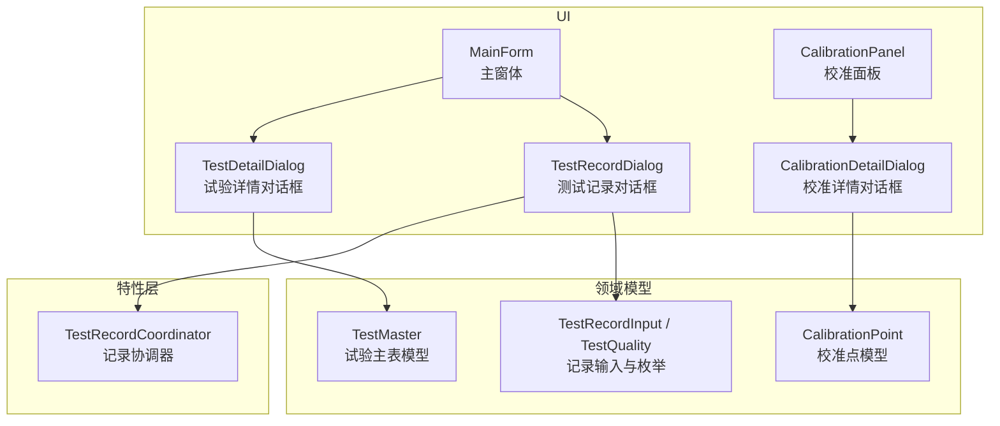
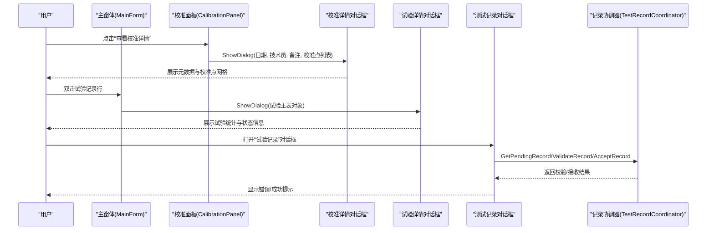
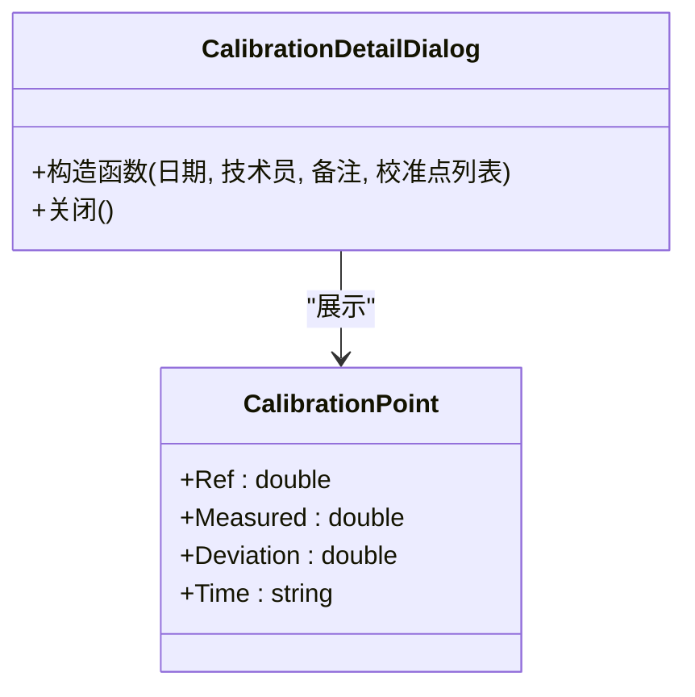
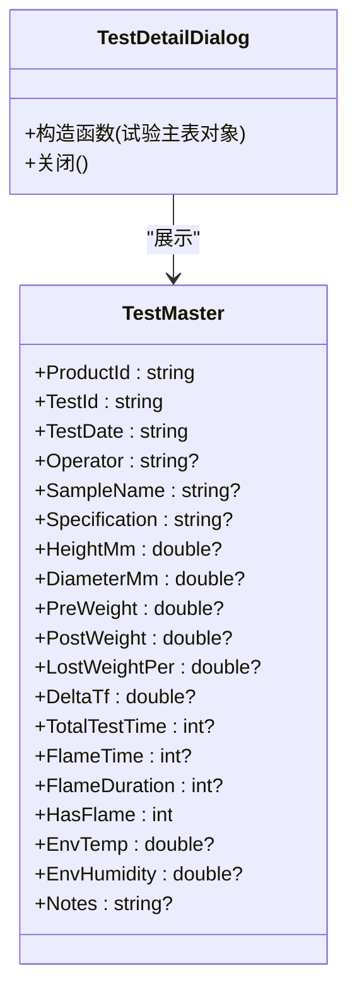
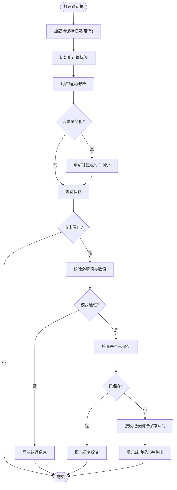
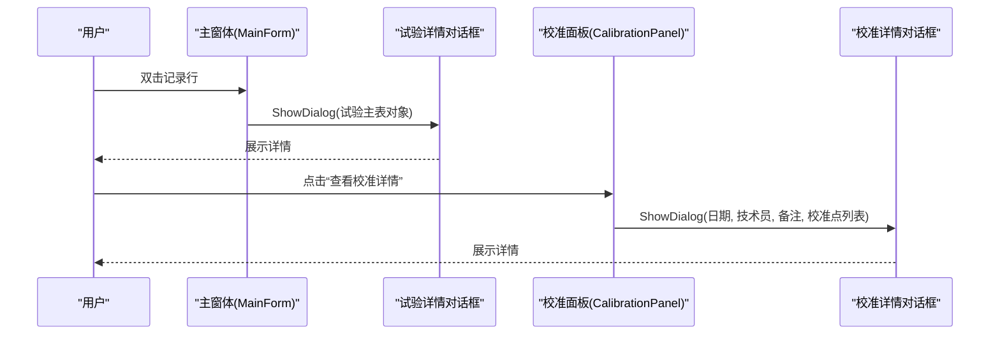
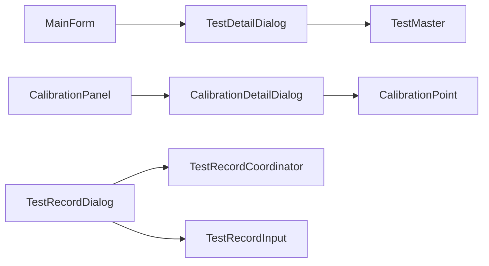

# 信息对话框

<cite>
**本文引用的文件**   
- [CalibrationDetailDialog.cs](file://src/ISO11820.App/UI/Dialogs/CalibrationDetailDialog.cs)
- [TestDetailDialog.cs](file://src/ISO11820.App/UI/Dialogs/TestDetailDialog.cs)
- [TestRecordDialog.cs](file://src/ISO11820.App/UI/Dialogs/TestRecordDialog.cs)
- [CalibrationPoint.cs](file://src/ISO11820.App/UI/Panels/CalibrationPoint.cs)
- [TestMaster.cs](file://src/ISO11820.App/Infrastructure/Persistence/Models/TestMaster.cs)
- [TestRecordModels.cs](file://src/ISO11820.App/Shared/Models/Records/TestRecordModels.cs)
- [TestRecordCoordinator.cs](file://src/ISO11820.App/Features/TestRecord/TestRecordCoordinator.cs)
- [MainForm.cs](file://src/ISO11820.App/UI/Forms/MainForm.cs)
- [CalibrationPanel.cs](file://src/ISO11820.App/UI/Panels/CalibrationPanel.cs)
</cite>

## 目录
1. [简介](#简介)
2. [项目结构](#项目结构)
3. [核心组件](#核心组件)
4. [架构总览](#架构总览)
5. [详细组件分析](#详细组件分析)
6. [依赖关系分析](#依赖关系分析)
7. [性能与实时性](#性能与实时性)
8. [故障排查指南](#故障排查指南)
9. [结论](#结论)
10. [附录：最佳实践与体验优化建议](#附录最佳实践与体验优化建议)

## 简介
本文件面向“信息展示类对话框”的文档化，覆盖三类对话框：
- 校准详情对话框：设备状态显示、校准参数展示、历史记录查看入口。
- 试验详情对话框：数据统计、图表展示（由上层面板承载）、状态信息汇总。
- 测试记录对话框：数据表格、筛选与批量操作（由主窗体承载），以及录入与计算结果展示。

重点说明：
- 信息组织方式、排序规则与搜索机制（在对话框及主窗体中的体现）。
- 数据绑定模式、实时更新机制与异常信息显示的处理方式。
- 用户体验优化建议与可维护性要点。

## 项目结构
与信息对话框相关的代码主要位于 UI/Dialogs 目录，并配合模型与协调器完成数据流转。

图示来源
- [CalibrationDetailDialog.cs:1-97](file://src/ISO11820.App/UI/Dialogs/CalibrationDetailDialog.cs#L1-L97)
- [TestDetailDialog.cs:1-88](file://src/ISO11820.App/UI/Dialogs/TestDetailDialog.cs#L1-L88)
- [TestRecordDialog.cs:1-568](file://src/ISO11820.App/UI/Dialogs/TestRecordDialog.cs#L1-L568)
- [CalibrationPoint.cs:1-9](file://src/ISO11820.App/UI/Panels/CalibrationPoint.cs#L1-L9)
- [TestMaster.cs:1-47](file://src/ISO11820.App/Infrastructure/Persistence/Models/TestMaster.cs#L1-L47)
- [TestRecordModels.cs:1-107](file://src/ISO11820.App/Shared/Models/Records/TestRecordModels.cs#L1-L107)
- [TestRecordCoordinator.cs:1-159](file://src/ISO11820.App/Features/TestRecord/TestRecordCoordinator.cs#L1-L159)
- [MainForm.cs:810-830](file://src/ISO11820.App/UI/Forms/MainForm.cs#L810-L830)
- [CalibrationPanel.cs:360-374](file://src/ISO11820.App/UI/Panels/CalibrationPanel.cs#L360-L374)

章节来源
- [CalibrationDetailDialog.cs:1-97](file://src/ISO11820.App/UI/Dialogs/CalibrationDetailDialog.cs#L1-L97)
- [TestDetailDialog.cs:1-88](file://src/ISO11820.App/UI/Dialogs/TestDetailDialog.cs#L1-L88)
- [TestRecordDialog.cs:1-568](file://src/ISO11820.App/UI/Dialogs/TestRecordDialog.cs#L1-L568)
- [CalibrationPoint.cs:1-9](file://src/ISO11820.App/UI/Panels/CalibrationPoint.cs#L1-L9)
- [TestMaster.cs:1-47](file://src/ISO11820.App/Infrastructure/Persistence/Models/TestMaster.cs#L1-L47)
- [TestRecordModels.cs:1-107](file://src/ISO11820.App/Shared/Models/Records/TestRecordModels.cs#L1-L107)
- [TestRecordCoordinator.cs:1-159](file://src/ISO11820.App/Features/TestRecord/TestRecordCoordinator.cs#L1-L159)
- [MainForm.cs:810-830](file://src/ISO11820.App/UI/Forms/MainForm.cs#L810-L830)
- [CalibrationPanel.cs:360-374](file://src/ISO11820.App/UI/Panels/CalibrationPanel.cs#L360-L374)

## 核心组件
- 校准详情对话框：以只读网格展示校准点明细，顶部元数据区展示日期、操作员与备注。
- 试验详情对话框：以两列布局展示试验主表字段，包含统计项与环境条件等。
- 测试记录对话框：提供录入表单、实时计算结果与判定提示，并通过协调器进行校验与接收。

章节来源
- [CalibrationDetailDialog.cs:1-97](file://src/ISO11820.App/UI/Dialogs/CalibrationDetailDialog.cs#L1-L97)
- [TestDetailDialog.cs:1-88](file://src/ISO11820.App/UI/Dialogs/TestDetailDialog.cs#L1-L88)
- [TestRecordDialog.cs:1-568](file://src/ISO11820.App/UI/Dialogs/TestRecordDialog.cs#L1-L568)

## 架构总览
三类对话框分别承担不同职责：
- 展示型：校准详情、试验详情为纯展示，不修改数据。
- 录入型：测试记录对话框负责采集用户输入、执行本地计算与判定，并将结果交由协调器处理。

图示来源
- [CalibrationPanel.cs:360-374](file://src/ISO11820.App/UI/Panels/CalibrationPanel.cs#L360-L374)
- [CalibrationDetailDialog.cs:1-97](file://src/ISO11820.App/UI/Dialogs/CalibrationDetailDialog.cs#L1-L97)
- [MainForm.cs:810-830](file://src/ISO11820.App/UI/Forms/MainForm.cs#L810-L830)
- [TestDetailDialog.cs:1-88](file://src/ISO11820.App/UI/Dialogs/TestDetailDialog.cs#L1-L88)
- [TestRecordDialog.cs:1-568](file://src/ISO11820.App/UI/Dialogs/TestRecordDialog.cs#L1-L568)
- [TestRecordCoordinator.cs:1-159](file://src/ISO11820.App/Features/TestRecord/TestRecordCoordinator.cs#L1-L159)

## 详细组件分析

### 校准详情对话框
- 信息组织
  - 顶部元数据区：校准日期、操作员、备注。
  - 中部网格：序号、标准温度、实测温度、偏差、时间。
- 数据来源
  - 通过构造参数传入校准点集合与元数据。
- 交互行为
  - 只读网格，不可编辑；底部关闭按钮关闭窗口。
- 数据绑定模式
  - 一次性填充 DataGridView 行，无双向绑定或实时更新。
- 排序与搜索
  - 未实现内置排序与搜索；如需扩展，可在网格启用列头排序并在加载时预排序。
- 异常显示
  - 若为空值，使用占位符“—”避免空白。

图示来源
- [CalibrationDetailDialog.cs:1-97](file://src/ISO11820.App/UI/Dialogs/CalibrationDetailDialog.cs#L1-L97)
- [CalibrationPoint.cs:1-9](file://src/ISO11820.App/UI/Panels/CalibrationPoint.cs#L1-L9)

章节来源
- [CalibrationDetailDialog.cs:1-97](file://src/ISO11820.App/UI/Dialogs/CalibrationDetailDialog.cs#L1-L97)
- [CalibrationPoint.cs:1-9](file://src/ISO11820.App/UI/Panels/CalibrationPoint.cs#L1-L9)

### 试验详情对话框
- 信息组织
  - 两列布局：标签与值，涵盖样品编号、试验标识、日期、操作员、尺寸、重量、质量损失率、ΔTf、时间、火焰相关指标、环境温湿度、备注等。
- 数据来源
  - 通过构造参数传入试验主表对象。
- 交互行为
  - 只读展示，底部关闭按钮关闭窗口。
- 数据绑定模式
  - 一次性渲染，无实时更新。
- 排序与搜索
  - 不适用（单条记录展示）。
- 异常显示
  - 空值以“-”占位，数值格式化输出。

图示来源
- [TestDetailDialog.cs:1-88](file://src/ISO11820.App/UI/Dialogs/TestDetailDialog.cs#L1-L88)
- [TestMaster.cs:1-47](file://src/ISO11820.App/Infrastructure/Persistence/Models/TestMaster.cs#L1-L47)

章节来源
- [TestDetailDialog.cs:1-88](file://src/ISO11820.App/UI/Dialogs/TestDetailDialog.cs#L1-L88)
- [TestMaster.cs:1-47](file://src/ISO11820.App/Infrastructure/Persistence/Models/TestMaster.cs#L1-L47)

### 测试记录对话框
- 信息组织
  - 基本信息：操作员、现象、质量评估、备注。
  - 火焰信息：是否出现持续火焰、出现时间、持续时间（受复选框控制启用/禁用）。
  - 试验后质量：输入框。
  - 计算结果：失重量、失重率、炉温1/2温升、表面/中心温升、判定结果。
  - 状态栏：用于显示验证错误或保存状态。
- 数据绑定模式
  - 事件驱动更新：文本框变更事件触发计算标签刷新。
  - 属性派生：失重量、失重率、各温升基于输入与初始值计算。
- 实时更新机制
  - OnPostWeightChanged 与 UpdateComputedLabels 联动，即时更新计算结果与判定。
- 校验与持久化
  - ValidateRecord 对必填项与数值有效性进行校验。
  - AcceptRecord 将记录加入待保存队列，并防止重复提交。
  - IsRecordSaved 检查是否已保存，避免重复保存。
- 交互流程
  - 保存按钮触发校验→接收→设置成功状态→关闭对话框。
  - 取消按钮直接关闭。

图示来源
- [TestRecordDialog.cs:1-568](file://src/ISO11820.App/UI/Dialogs/TestRecordDialog.cs#L1-L568)
- [TestRecordCoordinator.cs:1-159](file://src/ISO11820.App/Features/TestRecord/TestRecordCoordinator.cs#L1-L159)
- [TestRecordModels.cs:1-107](file://src/ISO11820.App/Shared/Models/Records/TestRecordModels.cs#L1-L107)

章节来源
- [TestRecordDialog.cs:1-568](file://src/ISO11820.App/UI/Dialogs/TestRecordDialog.cs#L1-L568)
- [TestRecordCoordinator.cs:1-159](file://src/ISO11820.App/Features/TestRecord/TestRecordCoordinator.cs#L1-L159)
- [TestRecordModels.cs:1-107](file://src/ISO11820.App/Shared/Models/Records/TestRecordModels.cs#L1-L107)

### 主窗体与面板中的对话框集成
- 试验详情：在主窗体的记录网格双击事件中弹出试验详情对话框。
- 校准详情：在校准面板中根据记录解析出校准点后，弹出校准详情对话框。

图示来源
- [MainForm.cs:810-830](file://src/ISO11820.App/UI/Forms/MainForm.cs#L810-L830)
- [CalibrationPanel.cs:360-374](file://src/ISO11820.App/UI/Panels/CalibrationPanel.cs#L360-L374)
- [TestDetailDialog.cs:1-88](file://src/ISO11820.App/UI/Dialogs/TestDetailDialog.cs#L1-L88)
- [CalibrationDetailDialog.cs:1-97](file://src/ISO11820.App/UI/Dialogs/CalibrationDetailDialog.cs#L1-L97)

章节来源
- [MainForm.cs:810-830](file://src/ISO11820.App/UI/Forms/MainForm.cs#L810-L830)
- [CalibrationPanel.cs:360-374](file://src/ISO11820.App/UI/Panels/CalibrationPanel.cs#L360-L374)

## 依赖关系分析
- 对话框与模型
  - 试验详情依赖试验主表模型。
  - 校准详情依赖校准点模型。
  - 测试记录依赖记录输入模型与质量枚举。
- 对话框与协调器
  - 测试记录对话框依赖记录协调器进行校验、接收与去重保护。
- 调用方
  - 主窗体与校准面板作为调用方，负责构造并展示对话框。

图示来源
- [MainForm.cs:810-830](file://src/ISO11820.App/UI/Forms/MainForm.cs#L810-L830)
- [CalibrationPanel.cs:360-374](file://src/ISO11820.App/UI/Panels/CalibrationPanel.cs#L360-L374)
- [TestDetailDialog.cs:1-88](file://src/ISO11820.App/UI/Dialogs/TestDetailDialog.cs#L1-L88)
- [CalibrationDetailDialog.cs:1-97](file://src/ISO11820.App/UI/Dialogs/CalibrationDetailDialog.cs#L1-L97)
- [TestRecordDialog.cs:1-568](file://src/ISO11820.App/UI/Dialogs/TestRecordDialog.cs#L1-L568)
- [TestRecordCoordinator.cs:1-159](file://src/ISO11820.App/Features/TestRecord/TestRecordCoordinator.cs#L1-L159)
- [TestMaster.cs:1-47](file://src/ISO11820.App/Infrastructure/Persistence/Models/TestMaster.cs#L1-L47)
- [CalibrationPoint.cs:1-9](file://src/ISO11820.App/UI/Panels/CalibrationPoint.cs#L1-L9)
- [TestRecordModels.cs:1-107](file://src/ISO11820.App/Shared/Models/Records/TestRecordModels.cs#L1-L107)

章节来源
- [TestRecordCoordinator.cs:1-159](file://src/ISO11820.App/Features/TestRecord/TestRecordCoordinator.cs#L1-L159)
- [TestRecordDialog.cs:1-568](file://src/ISO11820.App/UI/Dialogs/TestRecordDialog.cs#L1-L568)

## 性能与实时性
- 数据绑定模式
  - 校准详情与试验详情采用一次性渲染，适合静态展示场景，开销低。
  - 测试记录对话框采用事件驱动的局部更新，仅刷新计算标签，避免全量重绘。
- 实时更新机制
  - 通过文本框变更事件触发计算与判定逻辑，保证即时反馈。
- 异常信息显示
  - 使用状态标签统一显示错误与成功消息，颜色区分（红/绿）提升可读性。
- 潜在优化
  - 对于大量记录的展示，可考虑虚拟滚动或分页。
  - 计算逻辑可提取为独立服务以便复用与单元测试。

[本节为通用指导，无需具体文件引用]

## 故障排查指南
- 重复提交防护
  - 若提示“该试验记录已保存”，请确认是否已在其他会话中保存过同一试验编号的记录。
- 必填项缺失
  - 若提示“请完善必填项”，请检查操作员、现象、质量评估、后质量等字段。
- 数值无效
  - 火焰时间与持续时间需为非负整数；后质量需为正数。
- 保存失败
  - 若提示“记录接收失败”或“保存异常”，请检查协调器返回的错误信息，必要时清理保存标志并重试。

章节来源
- [TestRecordDialog.cs:457-541](file://src/ISO11820.App/UI/Dialogs/TestRecordDialog.cs#L457-L541)
- [TestRecordCoordinator.cs:106-131](file://src/ISO11820.App/Features/TestRecord/TestRecordCoordinator.cs#L106-L131)
- [TestRecordCoordinator.cs:18-37](file://src/ISO11820.App/Features/TestRecord/TestRecordCoordinator.cs#L18-L37)

## 结论
三类信息对话框各司其职：
- 校准详情与试验详情专注于清晰、稳定的信息展示。
- 测试记录对话框兼顾录入、计算与校验，确保数据完整性与一致性。
通过事件驱动的实时更新与统一的错误提示机制，提升了可用性与可维护性。后续可扩展排序、搜索与批量操作以提升效率。

[本节为总结，无需具体文件引用]

## 附录：最佳实践与体验优化建议
- 信息组织
  - 分组明确：基本信息、火焰信息、试验后质量、计算结果分区清晰。
  - 标签对齐：左标签右值，固定宽度标签列提升对齐感。
- 排序规则
  - 建议在网格列头启用排序，默认按时间或序号降序，便于最新记录优先。
- 搜索机制
  - 增加快速过滤框，支持按关键字匹配多列内容，并高亮匹配片段。
- 数据绑定模式
  - 展示型对话框保持单向绑定；录入型对话框采用事件驱动局部更新。
- 实时更新机制
  - 计算结果与判定即时刷新；对耗时计算引入防抖或异步任务。
- 异常信息显示
  - 统一状态栏提示，错误用红色、成功用绿色；必要时聚焦到问题控件。
- 用户体验优化
  - 键盘导航：Enter 保存、Esc 取消；Tab 顺序符合阅读顺序。
  - 输入辅助：数字输入限制、单位提示、默认值与占位符。
  - 可访问性：对比度充足、字体大小可调、屏幕阅读器友好。

[本节为通用指导，无需具体文件引用]