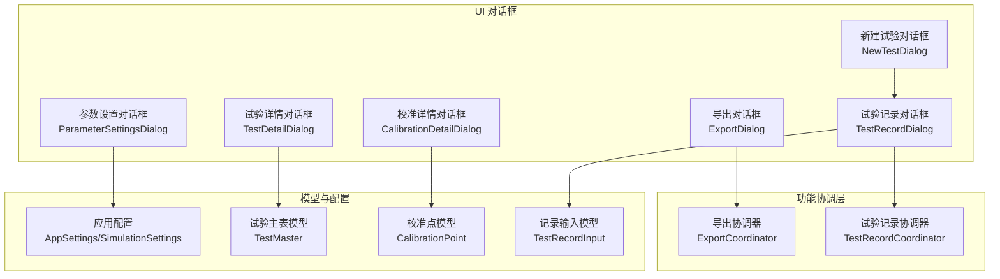
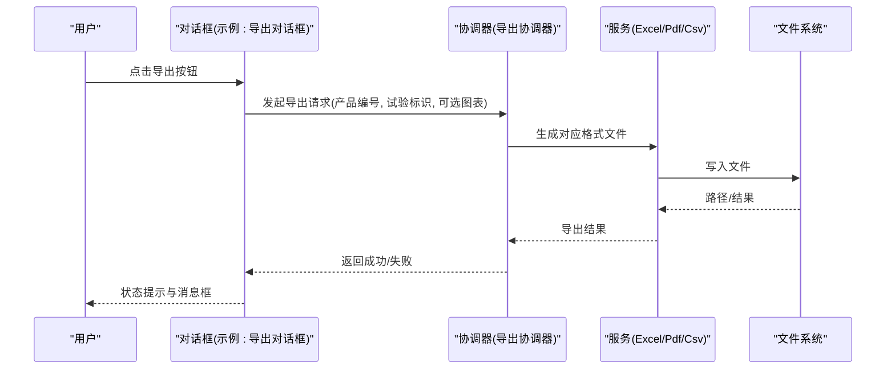
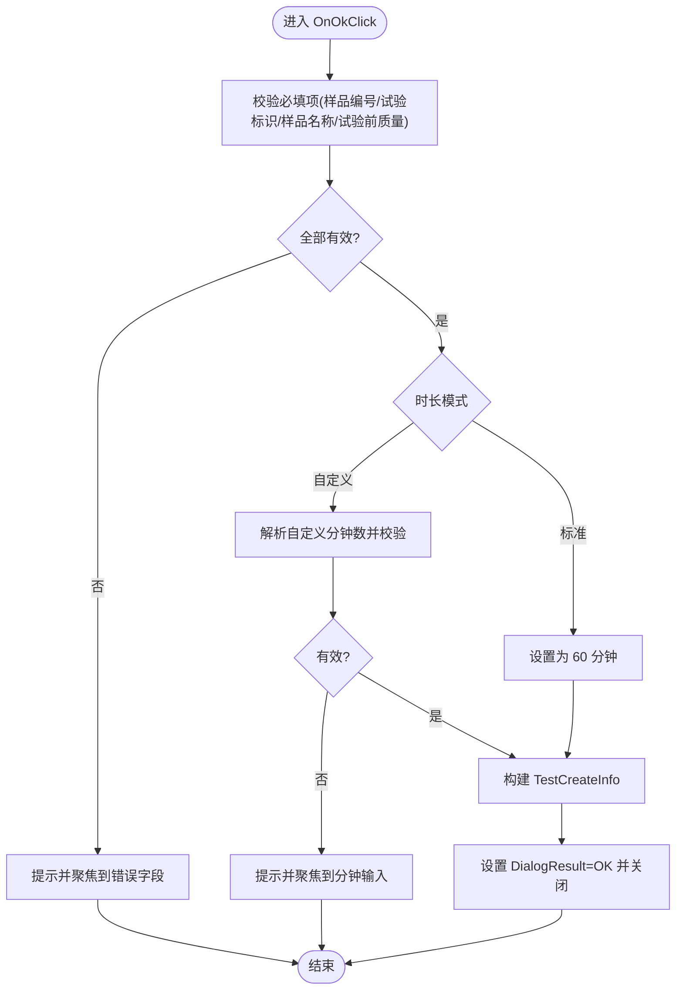
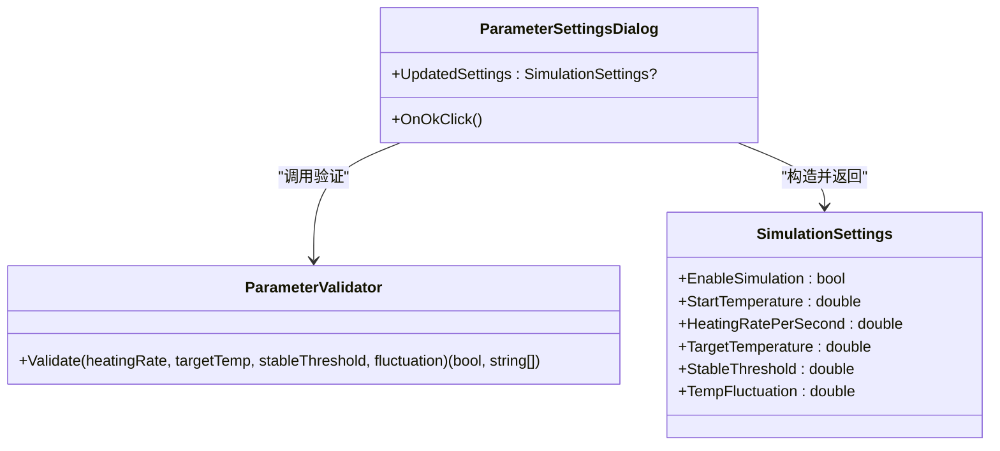
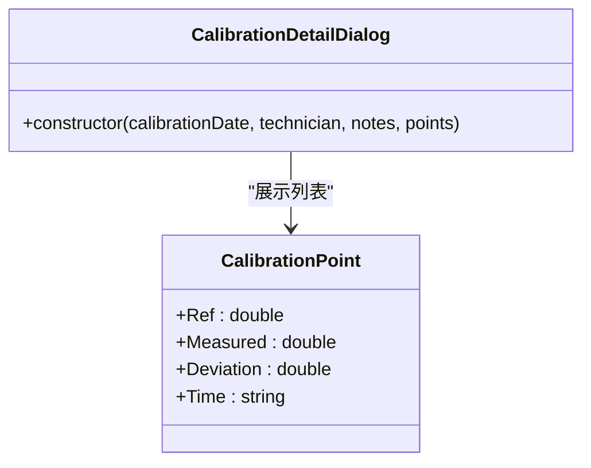
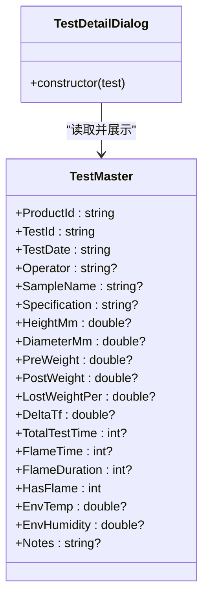
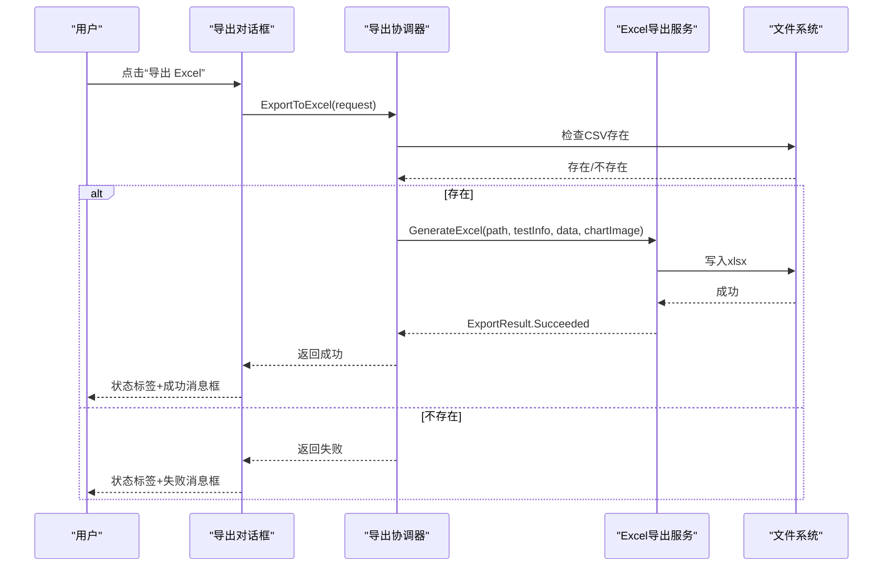
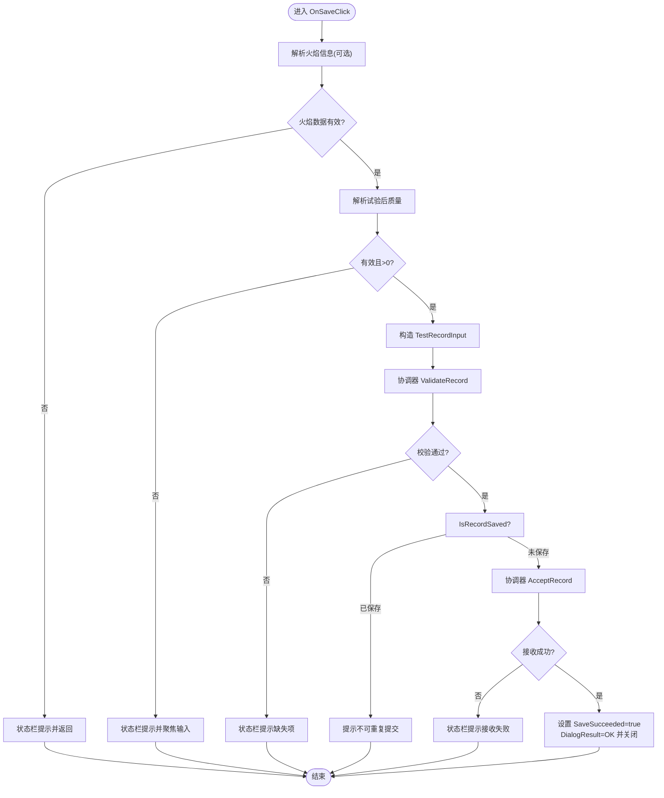
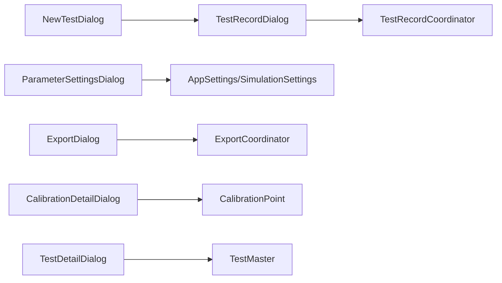

# 对话框组件

<cite>
**本文引用的文件**   
- [NewTestDialog.cs](file://src/ISO11820.App/UI/Dialogs/NewTestDialog.cs)
- [ParameterSettingsDialog.cs](file://src/ISO11820.App/UI/Dialogs/ParameterSettingsDialog.cs)
- [CalibrationDetailDialog.cs](file://src/ISO11820.App/UI/Dialogs/CalibrationDetailDialog.cs)
- [TestDetailDialog.cs](file://src/ISO11820.App/UI/Dialogs/TestDetailDialog.cs)
- [ExportDialog.cs](file://src/ISO11820.App/UI/Dialogs/ExportDialog.cs)
- [TestRecordDialog.cs](file://src/ISO11820.App/UI/Dialogs/TestRecordDialog.cs)
- [ParameterValidator.cs](file://src/ISO11820.App/UI/Common/ParameterValidator.cs)
- [ExportCoordinator.cs](file://src/ISO11820.App/Features/Export/ExportCoordinator.cs)
- [CalibrationPoint.cs](file://src/ISO11820.App/UI/Panels/CalibrationPoint.cs)
- [TestMaster.cs](file://src/ISO11820.App/Infrastructure/Persistence/Models/TestMaster.cs)
- [AppSettings.cs](file://src/ISO11820.App/Config/AppSettings.cs)
- [TestRecordCoordinator.cs](file://src/ISO11820.App/Features/TestRecord/TestRecordCoordinator.cs)
- [TestRecordModels.cs](file://src/ISO11820.App/Shared/Models/Records/TestRecordModels.cs)
</cite>

## 目录
1. [简介](#简介)
2. [项目结构](#项目结构)
3. [核心组件](#核心组件)
4. [架构总览](#架构总览)
5. [详细组件分析](#详细组件分析)
6. [依赖关系分析](#依赖关系分析)
7. [性能与可用性考虑](#性能与可用性考虑)
8. [故障排查指南](#故障排查指南)
9. [结论](#结论)
10. [附录](#附录)

## 简介
本文件为 ISO 11820 系统的对话框组件提供系统化文档，覆盖新建试验、参数设置、校准详情、试验详情、导出以及试验记录等关键对话框。内容涵盖设计模式、参数验证、用户交互逻辑、模态显示、结果传递、异常处理、可访问性与用户体验优化建议，帮助开发者与维护者快速理解并正确使用这些组件。

## 项目结构
对话框组件位于 UI/Dialogs 目录下，围绕 WinForms 的 Form 基类实现，采用“展示层 + 协调器/服务”的分层协作方式：
- 展示层：各对话框负责输入收集、校验提示、结果封装与返回。
- 业务协调层：如 ExportCoordinator、TestRecordCoordinator 负责跨模块的数据读写与流程控制。
- 模型与配置：使用 record/class 承载数据，SimulationSettings 等配置驱动仿真行为。

图表来源
- [NewTestDialog.cs:1-329](file://src/ISO11820.App/UI/Dialogs/NewTestDialog.cs#L1-L329)
- [ParameterSettingsDialog.cs:1-135](file://src/ISO11820.App/UI/Dialogs/ParameterSettingsDialog.cs#L1-L135)
- [CalibrationDetailDialog.cs:1-97](file://src/ISO11820.App/UI/Dialogs/CalibrationDetailDialog.cs#L1-L97)
- [TestDetailDialog.cs:1-88](file://src/ISO11820.App/UI/Dialogs/TestDetailDialog.cs#L1-L88)
- [ExportDialog.cs:1-284](file://src/ISO11820.App/UI/Dialogs/ExportDialog.cs#L1-L284)
- [TestRecordDialog.cs:1-568](file://src/ISO11820.App/UI/Dialogs/TestRecordDialog.cs#L1-L568)
- [ExportCoordinator.cs:1-229](file://src/ISO11820.App/Features/Export/ExportCoordinator.cs#L1-L229)
- [TestRecordCoordinator.cs:1-38](file://src/ISO11820.App/Features/TestRecord/TestRecordCoordinator.cs#L1-L38)
- [AppSettings.cs:1-83](file://src/ISO11820.App/Config/AppSettings.cs#L1-L83)
- [TestMaster.cs:1-47](file://src/ISO11820.App/Infrastructure/Persistence/Models/TestMaster.cs#L1-L47)
- [CalibrationPoint.cs:1-9](file://src/ISO11820.App/UI/Panels/CalibrationPoint.cs#L1-L9)
- [TestRecordModels.cs:1-34](file://src/ISO11820.App/Shared/Models/Records/TestRecordModels.cs#L1-L34)

章节来源
- [NewTestDialog.cs:1-329](file://src/ISO11820.App/UI/Dialogs/NewTestDialog.cs#L1-L329)
- [ParameterSettingsDialog.cs:1-135](file://src/ISO11820.App/UI/Dialogs/ParameterSettingsDialog.cs#L1-L135)
- [CalibrationDetailDialog.cs:1-97](file://src/ISO11820.App/UI/Dialogs/CalibrationDetailDialog.cs#L1-L97)
- [TestDetailDialog.cs:1-88](file://src/ISO11820.App/UI/Dialogs/TestDetailDialog.cs#L1-L88)
- [ExportDialog.cs:1-284](file://src/ISO11820.App/UI/Dialogs/ExportDialog.cs#L1-L284)
- [TestRecordDialog.cs:1-568](file://src/ISO11820.App/UI/Dialogs/TestRecordDialog.cs#L1-L568)
- [ExportCoordinator.cs:1-229](file://src/ISO11820.App/Features/Export/ExportCoordinator.cs#L1-L229)
- [TestRecordCoordinator.cs:1-38](file://src/ISO11820.App/Features/TestRecord/TestRecordCoordinator.cs#L1-L38)
- [AppSettings.cs:1-83](file://src/ISO11820.App/Config/AppSettings.cs#L1-L83)
- [TestMaster.cs:1-47](file://src/ISO11820.App/Infrastructure/Persistence/Models/TestMaster.cs#L1-L47)
- [CalibrationPoint.cs:1-9](file://src/ISO11820.App/UI/Panels/CalibrationPoint.cs#L1-L9)
- [TestRecordModels.cs:1-34](file://src/ISO11820.App/Shared/Models/Records/TestRecordModels.cs#L1-L34)

## 核心组件
- 新建试验对话框（NewTestDialog）
  - 职责：收集环境信息、样品信息、试验参数、设备信息与备注；完成必填项与数值范围校验；通过属性返回结构化创建信息。
  - 交互：标准时长/自定义时长切换；Enter/ESC 快捷键支持；焦点管理。
  - 输出：TestCreateInfo 记录对象。
- 参数设置对话框（ParameterSettingsDialog）
  - 职责：编辑仿真参数（升温速率、目标温度、稳定阈值、波动范围），调用统一验证器进行范围校验。
  - 交互：即时数字解析与错误提示；会话内生效。
  - 输出：SimulationSettings 更新对象。
- 校准详情对话框（CalibrationDetailDialog）
  - 职责：只读展示校准元数据与校准点明细表格。
  - 交互：关闭按钮结束。
- 试验详情对话框（TestDetailDialog）
  - 职责：以键值对形式展示试验主表字段。
  - 交互：关闭按钮结束。
- 导出对话框（ExportDialog）
  - 职责：选择导出格式（CSV/Excel/PDF），调用导出协调器执行导出，反馈成功/失败状态，支持打开导出目录。
  - 交互：按钮触发异步或同步导出；状态标签与消息框反馈。
- 试验记录对话框（TestRecordDialog）
  - 职责：录入试验后质量、火焰信息、现象与质量判定；实时计算失重量、失重率与温升；提交前校验与防重复保存。
  - 交互：勾选是否出现持续火焰联动启用相关输入；文本变化触发计算更新。
  - 输出：TestRecordInput 并通过协调器接受保存。

章节来源
- [NewTestDialog.cs:1-329](file://src/ISO11820.App/UI/Dialogs/NewTestDialog.cs#L1-L329)
- [ParameterSettingsDialog.cs:1-135](file://src/ISO11820.App/UI/Dialogs/ParameterSettingsDialog.cs#L1-L135)
- [CalibrationDetailDialog.cs:1-97](file://src/ISO11820.App/UI/Dialogs/CalibrationDetailDialog.cs#L1-L97)
- [TestDetailDialog.cs:1-88](file://src/ISO11820.App/UI/Dialogs/TestDetailDialog.cs#L1-L88)
- [ExportDialog.cs:1-284](file://src/ISO11820.App/UI/Dialogs/ExportDialog.cs#L1-L284)
- [TestRecordDialog.cs:1-568](file://src/ISO11820.App/UI/Dialogs/TestRecordDialog.cs#L1-L568)

## 架构总览
对话框作为展示层，遵循以下协作模式：
- 表单收集 → 本地校验 → 构造领域模型 → 调用协调器/服务 → 反馈结果。
- 参数设置通过共享配置模型影响运行时仿真行为。
- 导出与记录保存均通过协调器统一管理 I/O 与状态。

图表来源
- [ExportDialog.cs:1-284](file://src/ISO11820.App/UI/Dialogs/ExportDialog.cs#L1-L284)
- [ExportCoordinator.cs:1-229](file://src/ISO11820.App/Features/Export/ExportCoordinator.cs#L1-L229)

## 详细组件分析

### 新建试验对话框（NewTestDialog）
- 设计要点
  - 分区布局：环境信息、样品信息、试验参数、设备信息（自动填充）、备注。
  - 交互：标准时长/自定义时长单选切换；Enter/ESC 快捷操作；默认聚焦到样品编号。
  - 校验：必填项非空检查；数值型字段解析与范围约束；时长分钟转秒。
  - 结果：构造 TestCreateInfo 记录并设置 DialogResult.OK。
- 关键流程
  - 点击“创建试验”→ 逐项校验 → 组装数据 → 返回 OK。
- 可访问性建议
  - 为每个输入控件添加明确关联的 Label；确保 Tab 顺序合理；为错误提示提供焦点定位。

图表来源
- [NewTestDialog.cs:242-306](file://src/ISO11820.App/UI/Dialogs/NewTestDialog.cs#L242-L306)

章节来源
- [NewTestDialog.cs:1-329](file://src/ISO11820.App/UI/Dialogs/NewTestDialog.cs#L1-L329)

### 参数设置对话框（ParameterSettingsDialog）
- 设计要点
  - 基于 TableLayoutPanel 的两列布局；所有数值字段以两位小数格式化显示。
  - 使用 ParameterValidator 统一校验范围；失败时阻止关闭并提示具体错误。
  - 成功后构造 SimulationSettings 并返回。
- 动态配置与保存策略
  - 当前仅构造新配置对象返回给上层；上层可据此更新运行时仿真参数。
- 实时预览
  - 未在本对话框中直接渲染曲线，但可通过上层订阅配置变更进行预览。

图表来源
- [ParameterSettingsDialog.cs:1-135](file://src/ISO11820.App/UI/Dialogs/ParameterSettingsDialog.cs#L1-L135)
- [ParameterValidator.cs:1-39](file://src/ISO11820.App/UI/Common/ParameterValidator.cs#L1-L39)
- [AppSettings.cs:57-70](file://src/ISO11820.App/Config/AppSettings.cs#L57-L70)

章节来源
- [ParameterSettingsDialog.cs:1-135](file://src/ISO11820.App/UI/Dialogs/ParameterSettingsDialog.cs#L1-L135)
- [ParameterValidator.cs:1-39](file://src/ISO11820.App/UI/Common/ParameterValidator.cs#L1-L39)
- [AppSettings.cs:1-83](file://src/ISO11820.App/Config/AppSettings.cs#L1-L83)

### 校准详情对话框（CalibrationDetailDialog）
- 设计要点
  - 顶部元数据面板（日期、操作员、备注）+ 中部 DataGridView 展示校准点列表。
  - 只读展示，无持久化逻辑。
- 数据结构
  - 使用 CalibrationPoint 集合，包含标准温度、实测温度、偏差与时间。

图表来源
- [CalibrationDetailDialog.cs:1-97](file://src/ISO11820.App/UI/Dialogs/CalibrationDetailDialog.cs#L1-L97)
- [CalibrationPoint.cs:1-9](file://src/ISO11820.App/UI/Panels/CalibrationPoint.cs#L1-L9)

章节来源
- [CalibrationDetailDialog.cs:1-97](file://src/ISO11820.App/UI/Dialogs/CalibrationDetailDialog.cs#L1-L97)
- [CalibrationPoint.cs:1-9](file://src/ISO11820.App/UI/Panels/CalibrationPoint.cs#L1-L9)

### 试验详情对话框（TestDetailDialog）
- 设计要点
  - 两列 TableLayoutPanel 展示 TestMaster 的各字段，包括基本信息、质量损失率、ΔTf、时间与火焰信息等。
  - 只读展示，便于查看历史试验结果。

图表来源
- [TestDetailDialog.cs:1-88](file://src/ISO11820.App/UI/Dialogs/TestDetailDialog.cs#L1-L88)
- [TestMaster.cs:1-47](file://src/ISO11820.App/Infrastructure/Persistence/Models/TestMaster.cs#L1-L47)

章节来源
- [TestDetailDialog.cs:1-88](file://src/ISO11820.App/UI/Dialogs/TestDetailDialog.cs#L1-L88)
- [TestMaster.cs:1-47](file://src/ISO11820.App/Infrastructure/Persistence/Models/TestMaster.cs#L1-L47)

### 导出对话框（ExportDialog）
- 设计要点
  - 固定产品编号与试验标识（只读）；提供 CSV/Excel/PDF 三种导出入口；支持打开导出目录。
  - 通过 ExportCoordinator 统一调度不同导出服务；根据结果更新状态标签并弹出消息框。
- 序列流程（以 Excel 为例）
  - 用户点击“导出 Excel”→ 构造 ExportRequest（含图表图像）→ 调用 ExportToExcel → 内部读取 CSV 并生成 xlsx → 返回 ExportResult → 对话框反馈。

图表来源
- [ExportDialog.cs:215-225](file://src/ISO11820.App/UI/Dialogs/ExportDialog.cs#L215-L225)
- [ExportCoordinator.cs:54-85](file://src/ISO11820.App/Features/Export/ExportCoordinator.cs#L54-L85)

章节来源
- [ExportDialog.cs:1-284](file://src/ISO11820.App/UI/Dialogs/ExportDialog.cs#L1-L284)
- [ExportCoordinator.cs:1-229](file://src/ISO11820.App/Features/Export/ExportCoordinator.cs#L1-L229)

### 试验记录对话框（TestRecordDialog）
- 设计要点
  - 分区块录入：基本信息、火焰信息、试验后质量、计算结果、备注。
  - 实时计算：失重量、失重率、表面/炉温/中心温升；依据规则给出“通过/不通过”判定。
  - 校验与防重：保存前调用协调器 ValidateRecord 与 IsRecordSaved；避免重复提交。
- 交互细节
  - 勾选“是否出现持续火焰”联动启用火焰时间与持续时间输入。
  - 试验后质量变化触发计算更新。
- 结果传递
  - 保存成功后设置 SaveSucceeded=true 与 DialogResult.OK，供上层继续流程。

图表来源
- [TestRecordDialog.cs:457-541](file://src/ISO11820.App/UI/Dialogs/TestRecordDialog.cs#L457-L541)
- [TestRecordCoordinator.cs:1-38](file://src/ISO11820.App/Features/TestRecord/TestRecordCoordinator.cs#L1-L38)
- [TestRecordModels.cs:1-34](file://src/ISO11820.App/Shared/Models/Records/TestRecordModels.cs#L1-L34)

章节来源
- [TestRecordDialog.cs:1-568](file://src/ISO11820.App/UI/Dialogs/TestRecordDialog.cs#L1-L568)
- [TestRecordCoordinator.cs:1-38](file://src/ISO11820.App/Features/TestRecord/TestRecordCoordinator.cs#L1-L38)
- [TestRecordModels.cs:1-34](file://src/ISO11820.App/Shared/Models/Records/TestRecordModels.cs#L1-L34)

## 依赖关系分析
- 耦合与内聚
  - 对话框与协调器松耦合：对话框仅负责 UI 与输入，协调器封装 I/O 与业务规则。
  - 参数设置与运行时仿真通过共享配置模型连接，便于扩展。
- 外部依赖
  - 导出协调器依赖 CsvSampleWriter、ExcelExportService、PdfExportService 与 CsvDataReader。
  - 试验记录协调器依赖 CsvSampleWriter 与保存状态标记。
- 潜在循环依赖
  - 当前未见循环引用；对话框不直接依赖底层存储，降低耦合风险。

图表来源
- [NewTestDialog.cs:1-329](file://src/ISO11820.App/UI/Dialogs/NewTestDialog.cs#L1-L329)
- [ParameterSettingsDialog.cs:1-135](file://src/ISO11820.App/UI/Dialogs/ParameterSettingsDialog.cs#L1-L135)
- [ExportDialog.cs:1-284](file://src/ISO11820.App/UI/Dialogs/ExportDialog.cs#L1-L284)
- [TestRecordDialog.cs:1-568](file://src/ISO11820.App/UI/Dialogs/TestRecordDialog.cs#L1-L568)
- [CalibrationDetailDialog.cs:1-97](file://src/ISO11820.App/UI/Dialogs/CalibrationDetailDialog.cs#L1-L97)
- [TestDetailDialog.cs:1-88](file://src/ISO11820.App/UI/Dialogs/TestDetailDialog.cs#L1-L88)
- [ExportCoordinator.cs:1-229](file://src/ISO11820.App/Features/Export/ExportCoordinator.cs#L1-L229)
- [TestRecordCoordinator.cs:1-38](file://src/ISO11820.App/Features/TestRecord/TestRecordCoordinator.cs#L1-L38)
- [AppSettings.cs:1-83](file://src/ISO11820.App/Config/AppSettings.cs#L1-L83)
- [CalibrationPoint.cs:1-9](file://src/ISO11820.App/UI/Panels/CalibrationPoint.cs#L1-L9)
- [TestMaster.cs:1-47](file://src/ISO11820.App/Infrastructure/Persistence/Models/TestMaster.cs#L1-L47)

章节来源
- [ExportCoordinator.cs:1-229](file://src/ISO11820.App/Features/Export/ExportCoordinator.cs#L1-L229)
- [TestRecordCoordinator.cs:1-38](file://src/ISO11820.App/Features/TestRecord/TestRecordCoordinator.cs#L1-L38)
- [AppSettings.cs:1-83](file://src/ISO11820.App/Config/AppSettings.cs#L1-L83)

## 性能与可用性考虑
- 性能
  - 导出流程在 UI 线程中执行文件 I/O，若数据量大可能阻塞界面；建议将导出放入后台任务并在完成后回调更新 UI。
  - 实时计算（试验记录对话框）仅在输入变化时触发，开销较小；注意避免频繁重绘。
- 可用性
  - 键盘导航：为各对话框设置 AcceptButton/CancelButton，保证 Enter/ESC 行为一致。
  - 焦点管理：校验失败时自动聚焦到问题字段，提升纠错效率。
  - 可访问性：为输入控件提供清晰标签；必要时增加 ToolTip 说明单位与范围。
  - 错误提示：优先使用状态栏/行内提示，辅以消息框用于重要确认。

[本节为通用指导，无需列出具体文件来源]

## 故障排查指南
- 导出失败
  - 现象：导出对话框提示“导出失败”，状态栏显示错误信息。
  - 排查：确认 CSV 文件是否存在；检查导出目录权限；查看协调器返回的错误消息。
- 参数设置无效
  - 现象：点击确定后无法关闭对话框。
  - 排查：检查数值是否在允许范围内；查看 ParameterValidator 返回的错误列表。
- 试验记录重复提交
  - 现象：保存时提示“该试验记录已保存”。
  - 排查：确认是否已调用协调器的保存流程；如需修改，先取消再重新录入。

章节来源
- [ExportDialog.cs:239-283](file://src/ISO11820.App/UI/Dialogs/ExportDialog.cs#L239-L283)
- [ParameterSettingsDialog.cs:98-133](file://src/ISO11820.App/UI/Dialogs/ParameterSettingsDialog.cs#L98-L133)
- [TestRecordDialog.cs:522-541](file://src/ISO11820.App/UI/Dialogs/TestRecordDialog.cs#L522-L541)

## 结论
本套对话框组件围绕 ISO 11820 试验流程构建了清晰的展示层：从新建试验的参数采集，到参数设置的动态配置，再到校准与试验详情的只读展示，以及导出与试验记录的完整闭环。通过统一的验证器与协调器，实现了良好的解耦与可扩展性。建议在后续迭代中引入后台导出、更丰富的输入辅助与无障碍特性，以提升整体用户体验与系统健壮性。

[本节为总结性内容，无需列出具体文件来源]

## 附录
- 术语
  - 协调器：封装跨模块业务流程的对象，如导出协调器、试验记录协调器。
  - 记录：指代 TestRecordInput 等用于承载输入数据的不可变结构。
- 参考模型
  - TestCreateInfo：新建试验的输出模型。
  - SimulationSettings：仿真参数配置。
  - TestMaster：试验主表模型。
  - CalibrationPoint：校准点数据。
  - TestRecordInput：试验记录输入模型。

章节来源
- [NewTestDialog.cs:312-329](file://src/ISO11820.App/UI/Dialogs/NewTestDialog.cs#L312-L329)
- [AppSettings.cs:57-70](file://src/ISO11820.App/Config/AppSettings.cs#L57-L70)
- [TestMaster.cs:1-47](file://src/ISO11820.App/Infrastructure/Persistence/Models/TestMaster.cs#L1-L47)
- [CalibrationPoint.cs:1-9](file://src/ISO11820.App/UI/Panels/CalibrationPoint.cs#L1-L9)
- [TestRecordModels.cs:1-34](file://src/ISO11820.App/Shared/Models/Records/TestRecordModels.cs#L1-L34)