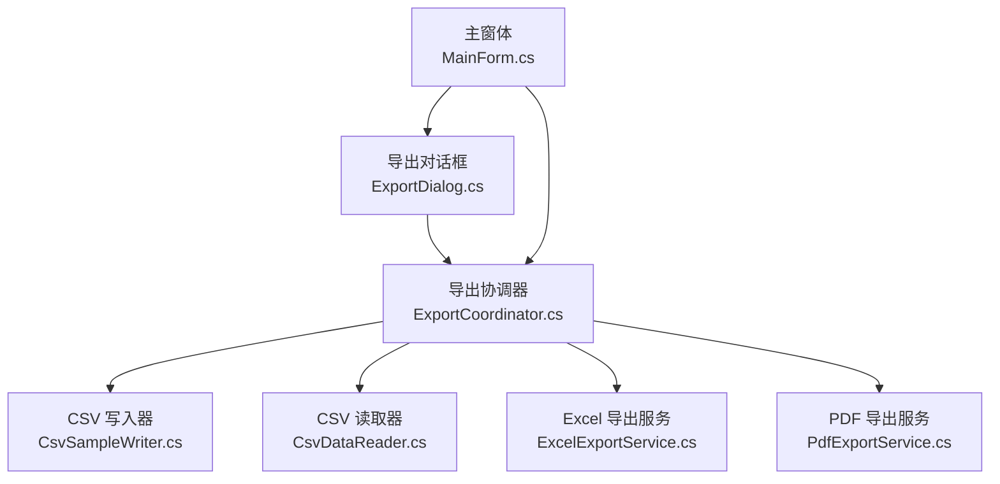
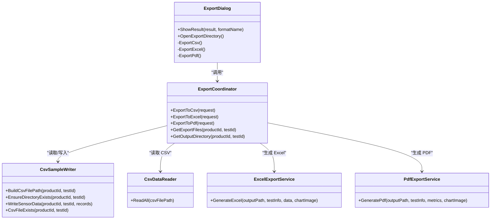
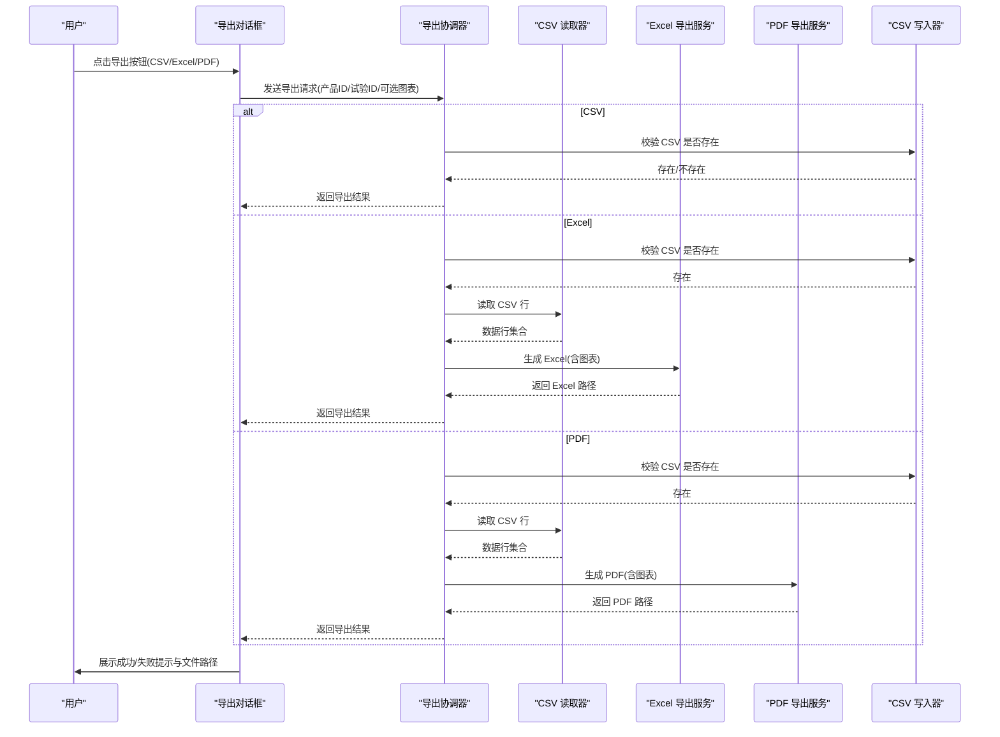
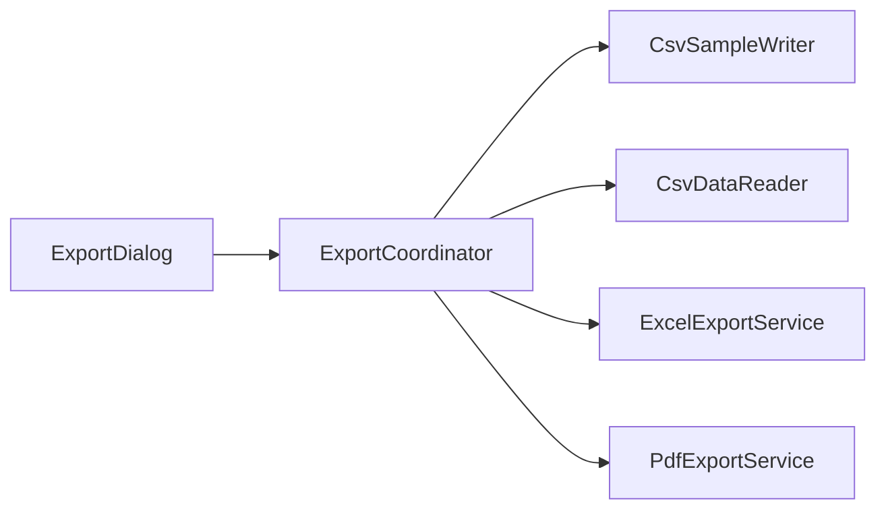
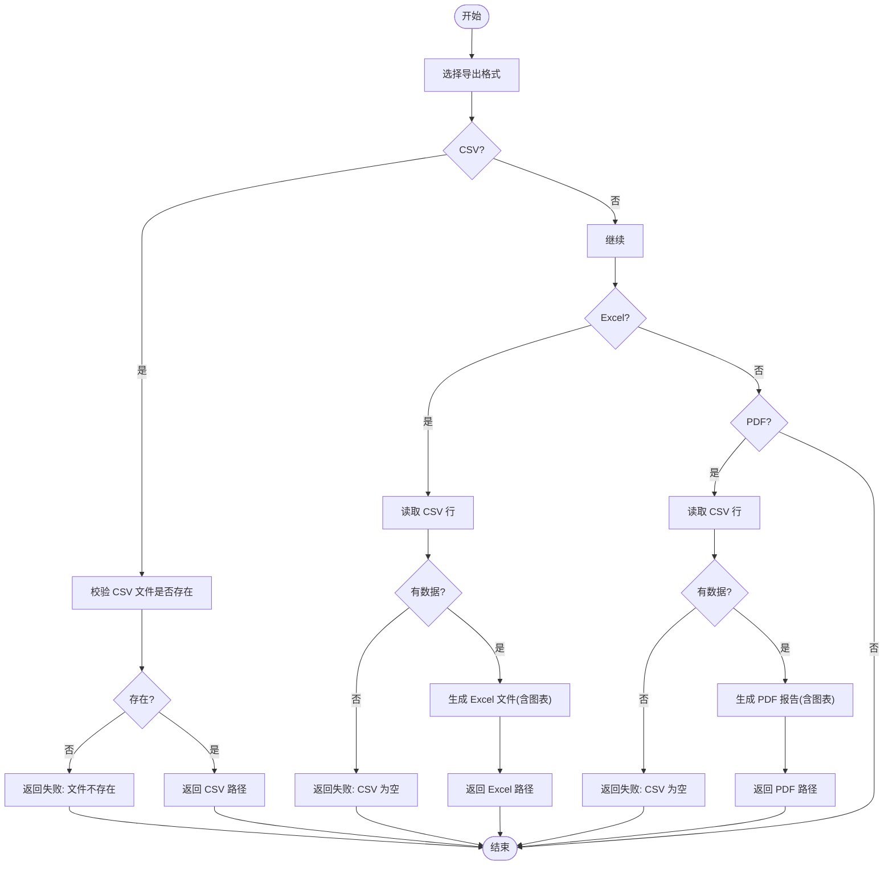

# 操作对话框

<cite>
**本文引用的文件**
- [ExportDialog.cs](file://src/ISO11820.App/UI/Dialogs/ExportDialog.cs)
- [ExportCoordinator.cs](file://src/ISO11820.App/Features/Export/ExportCoordinator.cs)
- [ExcelExportService.cs](file://src/ISO11820.App/Features/Export/ExcelExportService.cs)
- [PdfExportService.cs](file://src/ISO11820.App/Features/Export/PdfExportService.cs)
- [CsvDataReader.cs](file://src/ISO11820.App/Features/Export/CsvDataReader.cs)
- [CsvSampleWriter.cs](file://src/ISO11820.App/Infrastructure/FileStorage/CsvSampleWriter.cs)
- [MainForm.cs](file://src/ISO11820.App/UI/Forms/MainForm.cs)
- [ExportCoordinatorTests.cs](file://tests/ISO11820.Tests/Features/ExportCoordinatorTests.cs)
- [TC09_Export.cs](file://tests/ISO11820.UI.Tests/tests/TC09_Export.cs)
</cite>

## 目录
1. [简介](#简介)
2. [项目结构](#项目结构)
3. [核心组件](#核心组件)
4. [架构总览](#架构总览)
5. [详细组件分析](#详细组件分析)
6. [依赖关系分析](#依赖关系分析)
7. [性能考虑](#性能考虑)
8. [故障排查指南](#故障排查指南)
9. [结论](#结论)
10. [附录](#附录)

## 简介
本文件围绕“操作类对话框”中的“导出对话框”进行系统化技术文档编写，覆盖以下主题：
- 导出对话框的文件格式选择与导出选项配置
- 进度反馈与用户提示机制
- 操作确认流程、错误处理与异常恢复
- 导出数据的格式转换、文件生成与保存策略
- 安全验证、权限检查与异常恢复
- 用户体验设计与交互反馈优化
- 多格式导出支持、异步处理与用户取消操作的实现

## 项目结构
导出对话框位于 UI 层，通过协调器与服务层协作完成 CSV/Excel/PDF 多格式导出；数据来源为 CSV 文件，图表图像通过主窗体提供的委托注入。

图示来源
- [ExportDialog.cs:1-284](file://src/ISO11820.App/UI/Dialogs/ExportDialog.cs#L1-L284)
- [ExportCoordinator.cs:1-229](file://src/ISO11820.App/Features/Export/ExportCoordinator.cs#L1-L229)
- [CsvSampleWriter.cs:1-81](file://src/ISO11820.App/Infrastructure/FileStorage/CsvSampleWriter.cs#L1-L81)
- [CsvDataReader.cs:1-72](file://src/ISO11820.App/Features/Export/CsvDataReader.cs#L1-L72)
- [ExcelExportService.cs:1-143](file://src/ISO11820.App/Features/Export/ExcelExportService.cs#L1-L143)
- [PdfExportService.cs:1-139](file://src/ISO11820.App/Features/Export/PdfExportService.cs#L1-L139)
- [MainForm.cs:690-711](file://src/ISO11820.App/UI/Forms/MainForm.cs#L690-L711)

章节来源
- [ExportDialog.cs:1-284](file://src/ISO11820.App/UI/Dialogs/ExportDialog.cs#L1-L284)
- [ExportCoordinator.cs:1-229](file://src/ISO11820.App/Features/Export/ExportCoordinator.cs#L1-L229)
- [CsvSampleWriter.cs:1-81](file://src/ISO11820.App/Infrastructure/FileStorage/CsvSampleWriter.cs#L1-L81)
- [CsvDataReader.cs:1-72](file://src/ISO11820.App/Features/Export/CsvDataReader.cs#L1-L72)
- [ExcelExportService.cs:1-143](file://src/ISO11820.App/Features/Export/ExcelExportService.cs#L1-L143)
- [PdfExportService.cs:1-139](file://src/ISO11820.App/Features/Export/PdfExportService.cs#L1-L139)
- [MainForm.cs:690-711](file://src/ISO11820.App/UI/Forms/MainForm.cs#L690-L711)

## 核心组件
- 导出对话框（UI 层）
  - 提供产品编号、试验标识显示与导出格式选择（CSV/Excel/PDF）
  - 打开导出目录与状态提示
  - 调用导出协调器执行具体导出
- 导出协调器（业务层）
  - 组织 CSV/Excel/PDF 导出流程，负责文件存在性校验、数据读取与生成路径构建
  - 返回统一的导出结果对象，便于 UI 展示
- Excel/PDF 导出服务（服务层）
  - Excel：基于 EPPlus 生成包含信息、数据、图表三张工作表的 Excel 文件
  - PDF：基于 MigraDoc/PdfSharp 生成报告，包含试验信息、指标与图表
- CSV 读取器与写入器（基础设施层）
  - 读取 CSV 数据行，解析为结构化数据
  - 写入传感器数据 CSV 文件，构建输出目录与文件路径

章节来源
- [ExportDialog.cs:1-284](file://src/ISO11820.App/UI/Dialogs/ExportDialog.cs#L1-L284)
- [ExportCoordinator.cs:1-229](file://src/ISO11820.App/Features/Export/ExportCoordinator.cs#L1-L229)
- [ExcelExportService.cs:1-143](file://src/ISO11820.App/Features/Export/ExcelExportService.cs#L1-L143)
- [PdfExportService.cs:1-139](file://src/ISO11820.App/Features/Export/PdfExportService.cs#L1-L139)
- [CsvDataReader.cs:1-72](file://src/ISO11820.App/Features/Export/CsvDataReader.cs#L1-L72)
- [CsvSampleWriter.cs:1-81](file://src/ISO11820.App/Infrastructure/FileStorage/CsvSampleWriter.cs#L1-L81)

## 架构总览
导出对话框采用分层架构：UI 层负责交互与提示，业务层协调导出流程，服务层负责具体格式生成，基础设施层负责文件读写与路径管理。

图示来源
- [ExportDialog.cs:1-284](file://src/ISO11820.App/UI/Dialogs/ExportDialog.cs#L1-L284)
- [ExportCoordinator.cs:1-229](file://src/ISO11820.App/Features/Export/ExportCoordinator.cs#L1-L229)
- [ExcelExportService.cs:1-143](file://src/ISO11820.App/Features/Export/ExcelExportService.cs#L1-L143)
- [PdfExportService.cs:1-139](file://src/ISO11820.App/Features/Export/PdfExportService.cs#L1-L139)
- [CsvDataReader.cs:1-72](file://src/ISO11820.App/Features/Export/CsvDataReader.cs#L1-L72)
- [CsvSampleWriter.cs:1-81](file://src/ISO11820.App/Infrastructure/FileStorage/CsvSampleWriter.cs#L1-L81)

## 详细组件分析

### 导出对话框（UI 层）
- 视觉布局与交互
  - 固定对话框尺寸，居中显示，中文界面
  - 显示产品编号与试验标识（只读）
  - 提供 CSV/Excel/PDF 三个导出按钮，打开目录按钮与状态标签
- 导出流程
  - CSV：直接返回文件路径（若存在）
  - Excel：读取 CSV 数据，生成 Excel 文件，嵌入图表
  - PDF：读取 CSV 数据，生成 PDF 报告，嵌入图表
- 用户提示
  - 成功/失败状态标签与消息框提示
  - 打开导出目录失败时的状态提示
- 与主窗体集成
  - 主窗体在“试验记录”处触发导出对话框，并传入图表图像提供器

章节来源
- [ExportDialog.cs:1-284](file://src/ISO11820.App/UI/Dialogs/ExportDialog.cs#L1-L284)
- [MainForm.cs:690-711](file://src/ISO11820.App/UI/Forms/MainForm.cs#L690-L711)

### 导出协调器（业务层）
- 导出请求与结果
  - 请求对象包含产品编号、试验编号、可选的测试信息、图表图像、指标等
  - 结果对象统一返回成功/失败、文件路径、格式与错误信息
- CSV 导出
  - 校验 CSV 文件是否存在，存在则返回成功
- Excel 导出
  - 校验 CSV 存在性，读取 CSV 行，生成 Excel 文件（包含信息、数据、图表三表）
- PDF 导出
  - 校验 CSV 存在性，读取 CSV 行，生成 PDF 报告（包含信息、指标、图表）
- 文件枚举与目录
  - 枚举指定试验下的 CSV/Excel/PDF 文件
  - 获取输出目录路径

章节来源
- [ExportCoordinator.cs:1-229](file://src/ISO11820.App/Features/Export/ExportCoordinator.cs#L1-L229)

### Excel 导出服务
- 工作表结构
  - 试验信息表：标题、试验编号、样品编号、操作员、试验时间、试验时长
  - 温度数据表：时间、炉温1、炉温2、表面温、中心温
  - 温度曲线表：嵌入图表图片
- 图片处理
  - 将内存中的图表图像保存为 PNG 临时文件并嵌入 Excel
  - 生成完成后清理临时文件

章节来源
- [ExcelExportService.cs:1-143](file://src/ISO11820.App/Features/Export/ExcelExportService.cs#L1-L143)

### PDF 导出服务
- 文档结构
  - 标题、试验信息表、试验指标表、判定结论、温度曲线图
- 图片处理
  - 将内存中的图表图像保存为 PNG 临时文件并嵌入 PDF
  - 生成完成后清理临时文件

章节来源
- [PdfExportService.cs:1-139](file://src/ISO11820.App/Features/Export/PdfExportService.cs#L1-L139)

### CSV 读取器与写入器
- CSV 读取器
  - 解析 CSV 行，跳过标题行，按固定列顺序解析温度数据
  - 返回结构化的数据行集合
- CSV 写入器
  - 构建测试目录与 CSV 文件路径
  - 写入传感器数据 CSV 文件（UTF-8 编码，标题行包含通道列名）

章节来源
- [CsvDataReader.cs:1-72](file://src/ISO11820.App/Features/Export/CsvDataReader.cs#L1-L72)
- [CsvSampleWriter.cs:1-81](file://src/ISO11820.App/Infrastructure/FileStorage/CsvSampleWriter.cs#L1-L81)

### 导出序列流程

图示来源
- [ExportDialog.cs:204-237](file://src/ISO11820.App/UI/Dialogs/ExportDialog.cs#L204-L237)
- [ExportCoordinator.cs:24-119](file://src/ISO11820.App/Features/Export/ExportCoordinator.cs#L24-L119)
- [CsvDataReader.cs:25-70](file://src/ISO11820.App/Features/Export/CsvDataReader.cs#L25-L70)
- [ExcelExportService.cs:28-60](file://src/ISO11820.App/Features/Export/ExcelExportService.cs#L28-L60)
- [PdfExportService.cs:10-35](file://src/ISO11820.App/Features/Export/PdfExportService.cs#L10-L35)
- [CsvSampleWriter.cs:69-73](file://src/ISO11820.App/Infrastructure/FileStorage/CsvSampleWriter.cs#L69-L73)

## 依赖关系分析
- 组件耦合
  - 导出对话框仅依赖导出协调器接口，低耦合高内聚
  - 协调器依赖 CSV 写入器、CSV 读取器与两个导出服务
  - Excel/PDF 服务依赖外部库（EPPlus、MigraDoc/PdfSharp），通过导出协调器统一调度
- 外部依赖
  - EPPlus：Excel 文件生成
  - MigraDoc/PdfSharp：PDF 文件生成
- 潜在循环依赖
  - 无直接循环依赖，各层职责清晰

图示来源
- [ExportDialog.cs:1-284](file://src/ISO11820.App/UI/Dialogs/ExportDialog.cs#L1-L284)
- [ExportCoordinator.cs:1-229](file://src/ISO11820.App/Features/Export/ExportCoordinator.cs#L1-L229)

章节来源
- [ExportDialog.cs:1-284](file://src/ISO11820.App/UI/Dialogs/ExportDialog.cs#L1-L284)
- [ExportCoordinator.cs:1-229](file://src/ISO11820.App/Features/Export/ExportCoordinator.cs#L1-L229)

## 性能考虑
- 文件 I/O
  - CSV 读取一次性读取所有行，建议在大数据量场景下考虑流式读取或分页处理
- 图像嵌入
  - Excel/PDF 导出均将图表图像保存为临时 PNG 文件再嵌入，注意磁盘空间与清理逻辑
- 目录与文件路径
  - 路径构建与存在性检查避免重复创建目录，减少 IO 开销
- 异步处理
  - 当前为同步阻塞模式，建议在 UI 层引入异步导出与进度条，提升响应性

[本节为通用性能建议，无需特定文件引用]

## 故障排查指南
- CSV 文件不存在
  - 现象：导出 CSV/Excel/PDF 返回失败，提示文件不存在
  - 排查：确认 CSV 写入器是否正确生成文件，路径是否正确
- CSV 文件为空或只有标题
  - 现象：Excel/PDF 导出失败，提示 CSV 为空
  - 排查：检查传感器数据缓冲区是否已保存至 CSV
- 打开导出目录失败
  - 现象：点击“打开导出目录”提示失败
  - 排查：确认导出目录是否存在，权限是否足够
- 图表图像为空
  - 现象：Excel/PDF 报告缺少图表
  - 排查：确认主窗体提供的图表图像委托是否返回有效图像
- 测试用例验证
  - 单元测试覆盖了 CSV/Excel/PDF 导出的边界条件与路径结构，可参考测试断言定位问题

章节来源
- [ExportCoordinatorTests.cs:1-242](file://tests/ISO11820.Tests/Features/ExportCoordinatorTests.cs#L1-L242)
- [TC09_Export.cs:1-182](file://tests/ISO11820.UI.Tests/tests/TC09_Export.cs#L1-L182)
- [ExportDialog.cs:263-283](file://src/ISO11820.App/UI/Dialogs/ExportDialog.cs#L263-L283)

## 结论
导出对话框通过清晰的分层架构实现了 CSV/Excel/PDF 多格式导出，具备完善的错误处理与用户提示机制。建议后续引入异步导出与进度反馈，增强用户体验；同时在大数据量场景下优化 CSV 读取与文件生成策略，提升整体性能与稳定性。

[本节为总结性内容，无需特定文件引用]

## 附录

### 导出流程算法流程图

图示来源
- [ExportCoordinator.cs:24-119](file://src/ISO11820.App/Features/Export/ExportCoordinator.cs#L24-L119)
- [CsvDataReader.cs:25-70](file://src/ISO11820.App/Features/Export/CsvDataReader.cs#L25-L70)
- [ExcelExportService.cs:28-60](file://src/ISO11820.App/Features/Export/ExcelExportService.cs#L28-L60)
- [PdfExportService.cs:10-35](file://src/ISO11820.App/Features/Export/PdfExportService.cs#L10-L35)