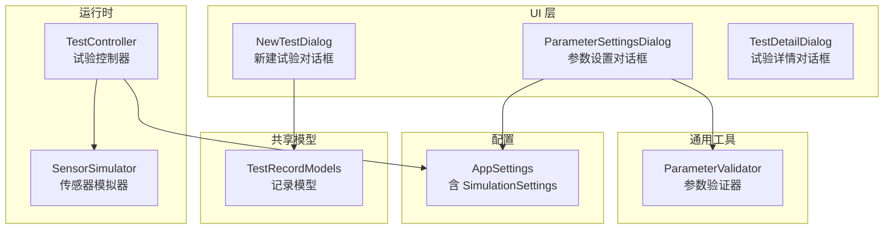
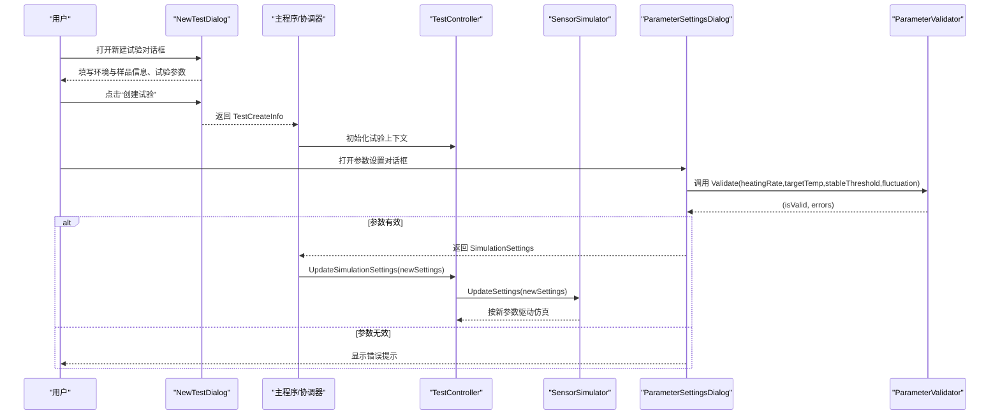
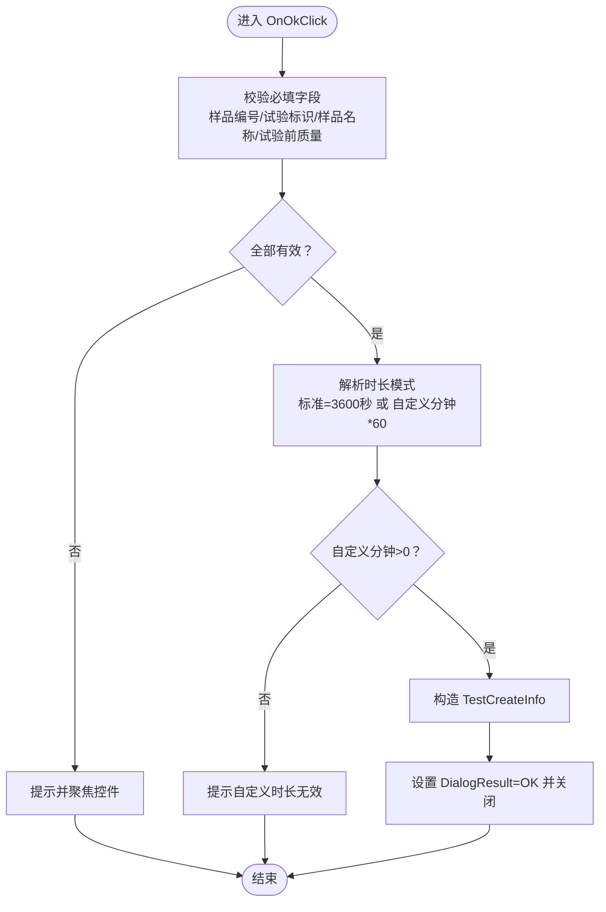
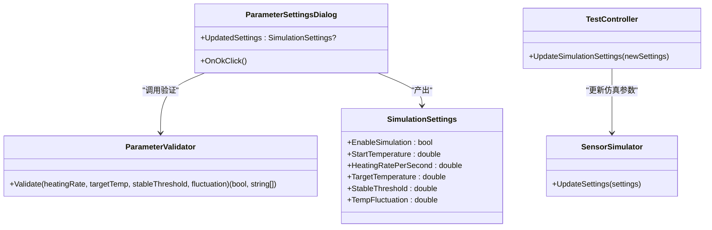
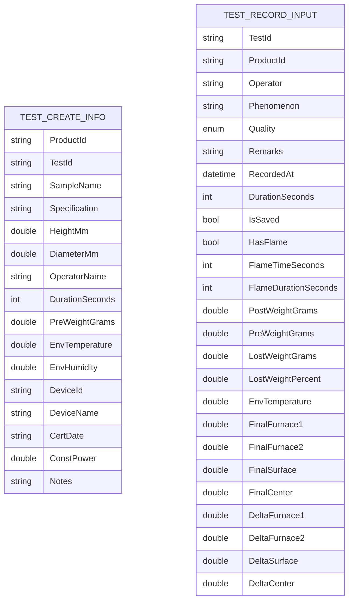
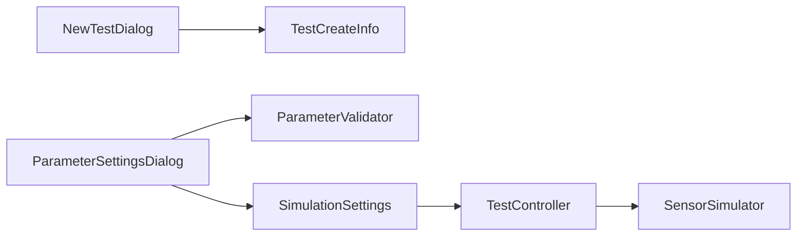

# 输入对话框

<cite>
**本文引用的文件**
- [NewTestDialog.cs](file://src/ISO11820.App/UI/Dialogs/NewTestDialog.cs)
- [ParameterSettingsDialog.cs](file://src/ISO11820.App/UI/Dialogs/ParameterSettingsDialog.cs)
- [ParameterValidator.cs](file://src/ISO11820.App/UI/Common/ParameterValidator.cs)
- [AppSettings.cs](file://src/ISO11820.App/Config/AppSettings.cs)
- [TestRecordModels.cs](file://src/ISO11820.App/Shared/Models/Records/TestRecordModels.cs)
- [SensorSimulator.cs](file://src/ISO11820.App/Runtime/services/SensorSimulator.cs)
- [TestController.cs](file://src/ISO11820.App/Runtime/Controller/TestController.cs)
- [TC03_NewTest.cs](file://tests/ISO11820.UI.Tests/Tests/TC03_NewTest.cs)
</cite>

## 目录
1. [简介](#简介)
2. [项目结构](#项目结构)
3. [核心组件](#核心组件)
4. [架构总览](#架构总览)
5. [详细组件分析](#详细组件分析)
6. [依赖关系分析](#依赖关系分析)
7. [性能与可用性](#性能与可用性)
8. [故障排查指南](#故障排查指南)
9. [结论](#结论)

## 简介
本文件围绕“输入类对话框”进行系统化文档化，重点覆盖：
- 新建试验对话框的产品选择逻辑、参数验证与数据绑定机制
- 参数设置对话框的动态配置界面、实时参数调整与保存策略
- 对话框的数据流向、验证规则与错误处理
- 输入控件的类型约束、范围限制与默认值
- 用户体验设计原则与可访问性支持
- TestCreateInfo 记录类型的使用、环境信息收集、样品信息验证与设备信息自动填充的实现细节

## 项目结构
输入对话框相关代码主要位于 UI 层与共享模型层，配合运行时控制器与仿真器完成端到端流程。

图表来源
- [NewTestDialog.cs:1-329](file://src/ISO11820.App/UI/Dialogs/NewTestDialog.cs#L1-L329)
- [ParameterSettingsDialog.cs:1-135](file://src/ISO11820.App/UI/Dialogs/ParameterSettingsDialog.cs#L1-L135)
- [ParameterValidator.cs:1-39](file://src/ISO11820.App/UI/Common/ParameterValidator.cs#L1-L39)
- [AppSettings.cs:57-70](file://src/ISO11820.App/Config/AppSettings.cs#L57-L70)
- [TestController.cs:158-167](file://src/ISO11820.App/Runtime/Controller/TestController.cs#L158-L167)
- [SensorSimulator.cs:1-44](file://src/ISO11820.App/Runtime/services/SensorSimulator.cs#L1-L44)
- [TestRecordModels.cs:1-107](file://src/ISO11820.App/Shared/Models/Records/TestRecordModels.cs#L1-L107)

章节来源
- [NewTestDialog.cs:1-329](file://src/ISO11820.App/UI/Dialogs/NewTestDialog.cs#L1-L329)
- [ParameterSettingsDialog.cs:1-135](file://src/ISO11820.App/UI/Dialogs/ParameterSettingsDialog.cs#L1-L135)
- [ParameterValidator.cs:1-39](file://src/ISO11820.App/UI/Common/ParameterValidator.cs#L1-L39)
- [AppSettings.cs:57-70](file://src/ISO11820.App/Config/AppSettings.cs#L57-L70)
- [TestController.cs:158-167](file://src/ISO11820.App/Runtime/Controller/TestController.cs#L158-L167)
- [SensorSimulator.cs:1-44](file://src/ISO11820.App/Runtime/services/SensorSimulator.cs#L1-L44)
- [TestRecordModels.cs:1-107](file://src/ISO11820.App/Shared/Models/Records/TestRecordModels.cs#L1-L107)

## 核心组件
- 新建试验对话框（NewTestDialog）
  - 负责采集环境信息、样品信息、试验参数、质量、设备信息与备注
  - 输出 TestCreateInfo 记录对象供上层使用
- 参数设置对话框（ParameterSettingsDialog）
  - 提供升温速率、目标温度、稳定阈值、温度波动等仿真参数的动态编辑
  - 调用 ParameterValidator 进行范围校验，成功后生成 SimulationSettings 并返回
- 参数验证器（ParameterValidator）
  - 集中定义仿真参数合法区间与错误消息
- 配置模型（AppSettings.SimulationSettings）
  - 定义仿真参数默认值与路径解析
- 运行时控制器（TestController）
  - 接收仿真参数更新并广播状态变化
- 传感器模拟器（SensorSimulator）
  - 基于仿真参数驱动温度曲线与稳定性判定
- 记录模型（TestRecordModels）
  - 定义试验记录输入、结果与保存状态标记

章节来源
- [NewTestDialog.cs:1-329](file://src/ISO11820.App/UI/Dialogs/NewTestDialog.cs#L1-L329)
- [ParameterSettingsDialog.cs:1-135](file://src/ISO11820.App/UI/Dialogs/ParameterSettingsDialog.cs#L1-L135)
- [ParameterValidator.cs:1-39](file://src/ISO11820.App/UI/Common/ParameterValidator.cs#L1-L39)
- [AppSettings.cs:57-70](file://src/ISO11820.App/Config/AppSettings.cs#L57-L70)
- [TestController.cs:158-167](file://src/ISO11820.App/Runtime/Controller/TestController.cs#L158-L167)
- [SensorSimulator.cs:1-44](file://src/ISO11820.App/Runtime/services/SensorSimulator.cs#L1-L44)
- [TestRecordModels.cs:1-107](file://src/ISO11820.App/Shared/Models/Records/TestRecordModels.cs#L1-L107)

## 架构总览
下图展示从用户交互到运行时仿真的关键数据流与控制流。

图表来源
- [NewTestDialog.cs:242-306](file://src/ISO11820.App/UI/Dialogs/NewTestDialog.cs#L242-L306)
- [ParameterSettingsDialog.cs:98-133](file://src/ISO11820.App/UI/Dialogs/ParameterSettingsDialog.cs#L98-L133)
- [ParameterValidator.cs:8-37](file://src/ISO11820.App/UI/Common/ParameterValidator.cs#L8-L37)
- [TestController.cs:158-167](file://src/ISO11820.App/Runtime/Controller/TestController.cs#L158-L167)
- [SensorSimulator.cs:28-35](file://src/ISO11820.App/Runtime/services/SensorSimulator.cs#L28-L35)

## 详细组件分析

### 新建试验对话框（NewTestDialog）
- 产品选择逻辑
  - 当前实现未内置产品主数据检索或下拉选择；通过文本框录入“样品编号”“试验标识”“样品名称”“规格”等字段，由上层业务在后续流程中完成产品匹配与校验
  - 若需引入产品选择，可在现有“样品编号”处扩展为带搜索的下拉控件，并在 OnOkClick 前增加产品存在性与版本一致性检查
- 参数验证与数据绑定
  - 必填项：样品编号、试验标识、样品名称、试验前质量
  - 数值型：高度、直径、环境温度、环境湿度、恒功率值采用 double.TryParse 容错解析，失败时回退到默认值
  - 时长模式：标准 60 分钟或自定义分钟数，自定义时需大于 0
  - 设备信息：只读文本框，自动填入设备编号、名称、检定日期、恒功率值
- 数据流向
  - 用户输入 → OnOkClick 校验 → 构造 TestCreateInfo → DialogResult.OK 关闭对话框 → 上层读取 TestInfo 继续流程
- 错误处理
  - 对缺失必填项与非法数值弹出提示并聚焦对应控件
  - 自定义时长非正数时提示并阻止提交
- 输入控件约束与默认值
  - 环境温度默认 25.0°C，环境湿度默认 50.0%
  - 高度/直径默认 0 mm
  - 操作员来自构造函数传入
  - 设备信息只读且预填示例值
- 用户体验与可访问性
  - 固定对话框尺寸、居中显示、禁用最大化/最小化
  - 设置 AcceptButton/CancelButton，提升键盘操作体验
  - 分组标题与清晰标签，便于屏幕阅读器识别

图表来源
- [NewTestDialog.cs:242-306](file://src/ISO11820.App/UI/Dialogs/NewTestDialog.cs#L242-L306)

章节来源
- [NewTestDialog.cs:1-329](file://src/ISO11820.App/UI/Dialogs/NewTestDialog.cs#L1-L329)
- [TC03_NewTest.cs:85-140](file://tests/ISO11820.UI.Tests/Tests/TC03_NewTest.cs#L85-L140)
- [TC03_NewTest.cs:146-180](file://tests/ISO11820.UI.Tests/Tests/TC03_NewTest.cs#L146-L180)
- [TC03_NewTest.cs:227-256](file://tests/ISO11820.UI.Tests/Tests/TC03_NewTest.cs#L227-L256)
- [TC03_NewTest.cs:262-295](file://tests/ISO11820.UI.Tests/Tests/TC03_NewTest.cs#L262-L295)

### 参数设置对话框（ParameterSettingsDialog）
- 动态配置界面
  - 使用 TableLayoutPanel 布局，两列（标签+输入），四行参数 + 一行按钮
  - 所有输入以 TextBox 呈现，格式化显示两位小数
- 实时参数调整与保存策略
  - 点击确定后先做数字解析，再调用 ParameterValidator.Validate 进行范围校验
  - 校验通过后封装为 SimulationSettings 并返回 UpdatedSettings
  - 上层通过 TestController.UpdateSimulationSettings 将新参数下发至 SensorSimulator，实现“会话内生效”的实时调整
- 验证规则与错误处理
  - 升温速率：>0 且 ≤200 °C/s
  - 目标温度：>0 且 ≤1200 °C
  - 稳定阈值：>0 且 ≤50 °C
  - 温度波动：>0 且 ≤10 °C
  - 任一不满足则弹窗列出错误并阻止关闭对话框
- 与配置模型的衔接
  - SimulationSettings 的默认值来源于 AppSettings.SimulationSettings，确保首次启动行为一致

图表来源
- [ParameterSettingsDialog.cs:98-133](file://src/ISO11820.App/UI/Dialogs/ParameterSettingsDialog.cs#L98-L133)
- [ParameterValidator.cs:8-37](file://src/ISO11820.App/UI/Common/ParameterValidator.cs#L8-L37)
- [AppSettings.cs:57-70](file://src/ISO11820.App/Config/AppSettings.cs#L57-L70)
- [TestController.cs:158-167](file://src/ISO11820.App/Runtime/Controller/TestController.cs#L158-L167)
- [SensorSimulator.cs:28-35](file://src/ISO11820.App/Runtime/services/SensorSimulator.cs#L28-L35)

章节来源
- [ParameterSettingsDialog.cs:1-135](file://src/ISO11820.App/UI/Dialogs/ParameterSettingsDialog.cs#L1-L135)
- [ParameterValidator.cs:1-39](file://src/ISO11820.App/UI/Common/ParameterValidator.cs#L1-L39)
- [AppSettings.cs:57-70](file://src/ISO11820.App/Config/AppSettings.cs#L57-L70)
- [TestController.cs:158-167](file://src/ISO11820.App/Runtime/Controller/TestController.cs#L158-L167)
- [SensorSimulator.cs:1-44](file://src/ISO11820.App/Runtime/services/SensorSimulator.cs#L1-L44)

### TestCreateInfo 记录类型与数据模型
- TestCreateInfo
  - 承载新建试验所需的全部输入：产品与样品标识、几何尺寸、操作员、时长、质量、环境、设备与备注
  - 作为 NewTestDialog 的输出，被上层用于初始化试验上下文与持久化
- 记录输入与结果模型（TestRecordModels）
  - TestRecordInput：记录阶段输入与计算结果（如前后质量、损失率、火焰信息等）
  - TestRecordResult：保存操作的统一返回，包含成功/失败与重复保存提示
  - SaveStateFlag：线程安全的已保存测试 ID 集合，避免重复保存

图表来源
- [NewTestDialog.cs:312-328](file://src/ISO11820.App/UI/Dialogs/NewTestDialog.cs#L312-L328)
- [TestRecordModels.cs:3-36](file://src/ISO11820.App/Shared/Models/Records/TestRecordModels.cs#L3-L36)

章节来源
- [NewTestDialog.cs:312-328](file://src/ISO11820.App/UI/Dialogs/NewTestDialog.cs#L312-L328)
- [TestRecordModels.cs:1-107](file://src/ISO11820.App/Shared/Models/Records/TestRecordModels.cs#L1-L107)

## 依赖关系分析
- 新建试验对话框
  - 依赖：无外部服务，仅内部控件与 TestCreateInfo
  - 输出：TestCreateInfo 实例
- 参数设置对话框
  - 依赖：ParameterValidator（验证）、SimulationSettings（配置模型）
  - 输出：SimulationSettings 实例
- 运行时链路
  - TestController 接收 SimulationSettings 并传递给 SensorSimulator，驱动仿真
- 配置加载
  - AppSettings 提供默认仿真参数，保证首次运行一致性

图表来源
- [NewTestDialog.cs:286-306](file://src/ISO11820.App/UI/Dialogs/NewTestDialog.cs#L286-L306)
- [ParameterSettingsDialog.cs:111-130](file://src/ISO11820.App/UI/Dialogs/ParameterSettingsDialog.cs#L111-L130)
- [AppSettings.cs:57-70](file://src/ISO11820.App/Config/AppSettings.cs#L57-L70)
- [TestController.cs:158-167](file://src/ISO11820.App/Runtime/Controller/TestController.cs#L158-L167)
- [SensorSimulator.cs:28-35](file://src/ISO11820.App/Runtime/services/SensorSimulator.cs#L28-L35)

章节来源
- [NewTestDialog.cs:286-306](file://src/ISO11820.App/UI/Dialogs/NewTestDialog.cs#L286-L306)
- [ParameterSettingsDialog.cs:111-130](file://src/ISO11820.App/UI/Dialogs/ParameterSettingsDialog.cs#L111-L130)
- [AppSettings.cs:57-70](file://src/ISO11820.App/Config/AppSettings.cs#L57-L70)
- [TestController.cs:158-167](file://src/ISO11820.App/Runtime/Controller/TestController.cs#L158-L167)
- [SensorSimulator.cs:28-35](file://src/ISO11820.App/Runtime/services/SensorSimulator.cs#L28-L35)

## 性能与可用性
- 性能
  - 对话框均为轻量级 WinForms 表单，无异步 I/O，响应迅速
  - 参数更新通过 TestController 广播状态变更，避免阻塞 UI 线程
- 可用性
  - 清晰的分组与标签，减少认知负荷
  - 默认值合理，降低初次使用门槛
  - 键盘友好：Accept/Cancel 按钮、Tab 顺序自然
- 可访问性建议
  - 为关键输入添加 AccessibleName/AccessibleDescription，便于屏幕阅读器朗读
  - 错误提示尽量定位到具体控件并提供明确的修复指引
  - 保持高对比度与足够字体大小，适配不同视力需求

[本节为通用指导，无需源码引用]

## 故障排查指南
- 新建试验无法提交
  - 检查必填项是否完整：样品编号、试验标识、样品名称、试验前质量
  - 检查数值格式：高度、直径、环境温度、环境湿度、恒功率值是否为有效数字
  - 自定义时长必须为正整数分钟
- 参数设置无法保存
  - 确认四个参数均在允许范围内：升温速率≤200、目标温度≤1200、稳定阈值≤50、温度波动≤10
  - 查看错误提示列表，逐项修正
- 设备信息未自动填充
  - 确认设备信息文本框为只读且已赋值；如需动态获取，应在上层注入真实设备源
- 仿真参数未生效
  - 确认已通过 TestController.UpdateSimulationSettings 下发新参数
  - 检查 SensorSimulator 是否按新参数更新内部状态

章节来源
- [NewTestDialog.cs:242-306](file://src/ISO11820.App/UI/Dialogs/NewTestDialog.cs#L242-L306)
- [ParameterSettingsDialog.cs:98-133](file://src/ISO11820.App/UI/Dialogs/ParameterSettingsDialog.cs#L98-L133)
- [ParameterValidator.cs:8-37](file://src/ISO11820.App/UI/Common/ParameterValidator.cs#L8-L37)
- [TestController.cs:158-167](file://src/ISO11820.App/Runtime/Controller/TestController.cs#L158-L167)

## 结论
- 新建试验对话框以结构化表单收集必要信息，并通过 TestCreateInfo 向上传递，具备完善的必填校验与数值容错
- 参数设置对话框结合 ParameterValidator 提供严格的范围校验，并通过 TestController 与 SensorSimulator 实现会话内实时生效
- 整体数据流清晰、职责分离良好，易于扩展产品选择与设备信息自动填充能力
- 建议在后续迭代中增强产品主数据联动、设备信息动态获取与更丰富的可访问性支持

[本节为总结性内容，无需源码引用]