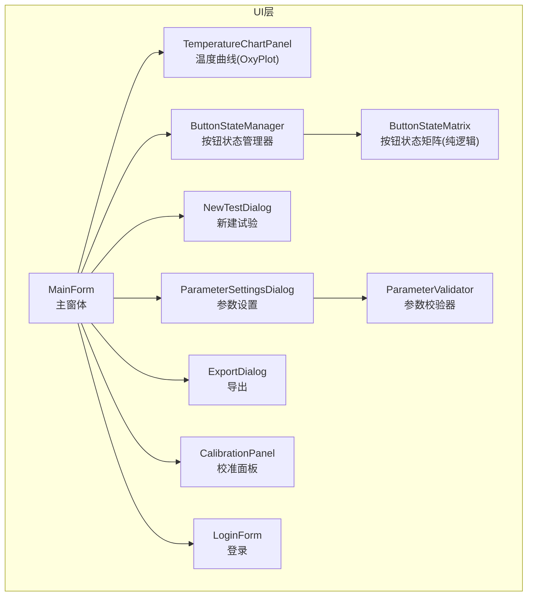
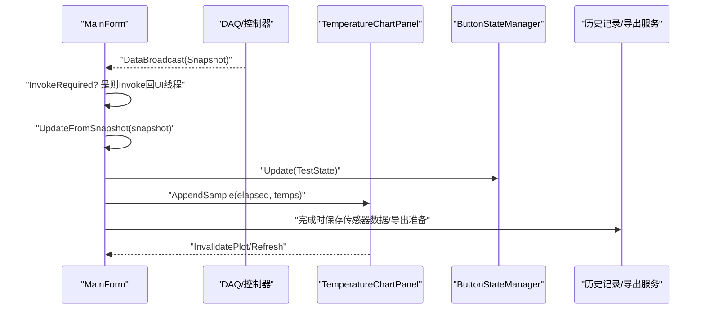
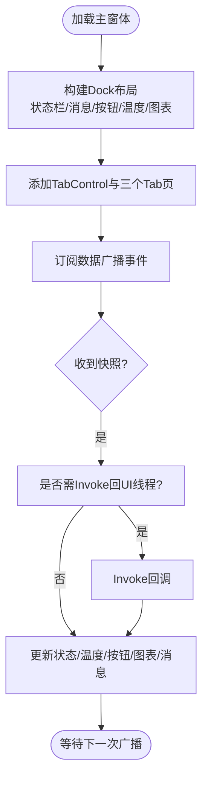
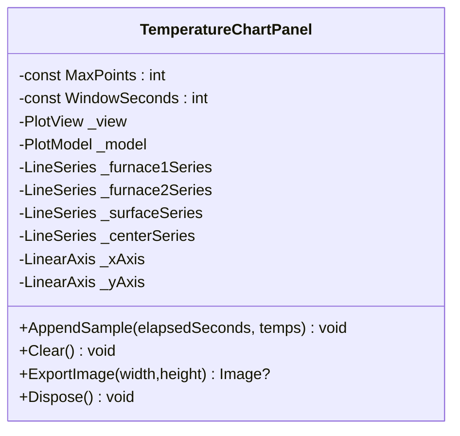
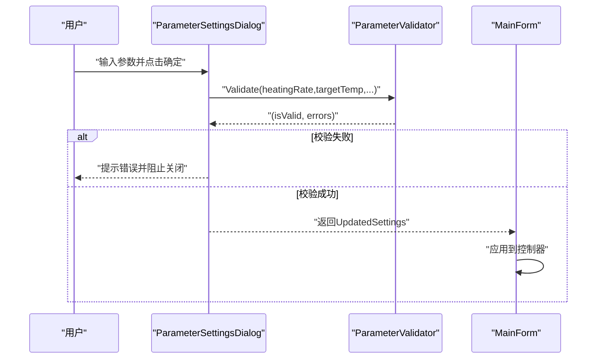
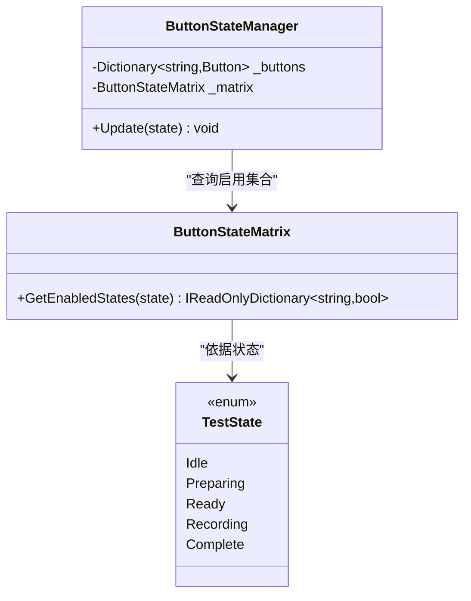
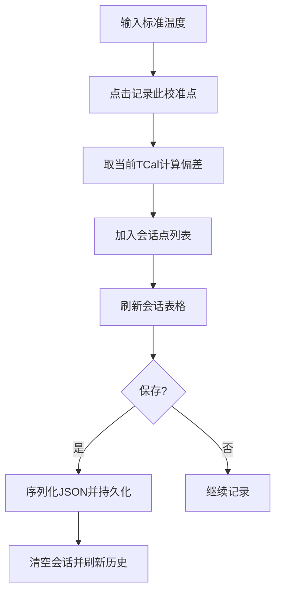
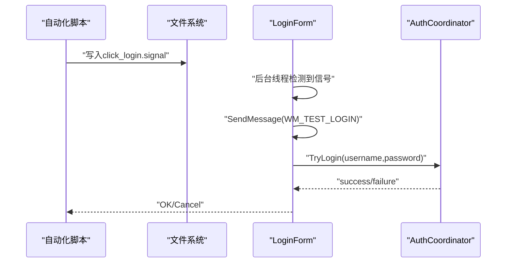
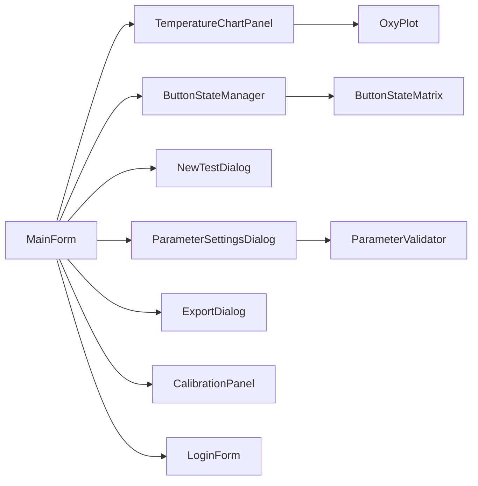

# 用户界面

<cite>
**本文引用的文件**
- [MainForm.cs](file://src/ISO11820.App/UI/Forms/MainForm.cs)
- [TemperatureChartPanel.cs](file://src/ISO11820.App/UI/Chart/TemperatureChartPanel.cs)
- [NewTestDialog.cs](file://src/ISO11820.App/UI/Dialogs/NewTestDialog.cs)
- [ParameterSettingsDialog.cs](file://src/ISO11820.App/UI/Dialogs/ParameterSettingsDialog.cs)
- [ExportDialog.cs](file://src/ISO11820.App/UI/Dialogs/ExportDialog.cs)
- [CalibrationPanel.cs](file://src/ISO11820.App/UI/Panels/CalibrationPanel.cs)
- [CalibrationPoint.cs](file://src/ISO11820.App/UI/Panels/CalibrationPoint.cs)
- [ButtonStateManager.cs](file://src/ISO11820.App/UI/Common/ButtonStateManager.cs)
- [ButtonStateMatrix.cs](file://src/ISO11820.App/UI/Common/ButtonStateMatrix.cs)
- [ParameterValidator.cs](file://src/ISO11820.App/UI/Common/ParameterValidator.cs)
- [LoginForm.cs](file://src/ISO11820.App/UI/Forms/LoginForm.cs)
- [TestState.cs](file://src/ISO11820.Core/Enums/TestState.cs)
</cite>

## 目录
1. [简介](#简介)
2. [项目结构](#项目结构)
3. [核心组件](#核心组件)
4. [架构总览](#架构总览)
5. [详细组件分析](#详细组件分析)
6. [依赖关系分析](#依赖关系分析)
7. [性能与可维护性](#性能与可维护性)
8. [故障排查指南](#故障排查指南)
9. [结论](#结论)
10. [附录：最佳实践与合规建议](#附录最佳实践与合规建议)

## 简介
本文件面向ISO 11820仿真系统的WinForms用户界面，系统性描述主界面布局、控件交互逻辑与响应式更新机制；详解OxyPlot图表集成、实时数据可视化与导出能力；文档化对话框与面板的设计模式、参数验证与用户反馈；提供UI组件的自定义选项与样式定制方法；总结WinForms最佳实践与性能优化技巧，并给出可访问性与跨平台兼容性考虑。

## 项目结构
UI层位于应用工程下，按功能域组织为窗体、对话框、面板与通用工具类：
- 窗体：主界面、登录
- 对话框：新建试验、参数设置、导出
- 面板：设备校准
- 通用：按钮状态机、参数校验器
- 图表：基于OxyPlot的温度曲线面板

图示来源
- [MainForm.cs:1-120](file://src/ISO11820.App/UI/Forms/MainForm.cs#L1-L120)
- [TemperatureChartPanel.cs:1-84](file://src/ISO11820.App/UI/Chart/TemperatureChartPanel.cs#L1-L84)
- [ButtonStateManager.cs:1-49](file://src/ISO11820.App/UI/Common/ButtonStateManager.cs#L1-L49)
- [ButtonStateMatrix.cs:1-90](file://src/ISO11820.App/UI/Common/ButtonStateMatrix.cs#L1-L90)
- [ParameterValidator.cs:1-39](file://src/ISO11820.App/UI/Common/ParameterValidator.cs#L1-L39)
- [NewTestDialog.cs:1-60](file://src/ISO11820.App/UI/Dialogs/NewTestDialog.cs#L1-L60)
- [ParameterSettingsDialog.cs:1-76](file://src/ISO11820.App/UI/Dialogs/ParameterSettingsDialog.cs#L1-L76)
- [ExportDialog.cs:1-60](file://src/ISO11820.App/UI/Dialogs/ExportDialog.cs#L1-L60)
- [CalibrationPanel.cs:1-67](file://src/ISO11820.App/UI/Panels/CalibrationPanel.cs#L1-L67)
- [LoginForm.cs:1-60](file://src/ISO11820.App/UI/Forms/LoginForm.cs#L1-L60)

章节来源
- [MainForm.cs:1-120](file://src/ISO11820.App/UI/Forms/MainForm.cs#L1-L120)

## 核心组件
- 主窗体 MainForm：承载Tab页（主操作界面、记录查询、设备校准），管理状态栏、温度显示区、右侧按钮组、底部消息区与中心图表区域；负责跨线程UI更新、事件分发与业务协调器调用。
- 图表面板 TemperatureChartPanel：封装OxyPlot PlotView/PlotModel/LineSeries，实现滚动窗口与最大点数裁剪、实时追加采样点、图片导出。
- 对话框 NewTestDialog：收集试验与环境信息，执行必填项与数值范围校验，输出不可变记录对象。
- 对话框 ParameterSettingsDialog：编辑仿真参数，使用统一校验器进行边界检查，返回会话级生效的设置。
- 对话框 ExportDialog：聚合CSV/Excel/PDF导出入口，支持打开导出目录与结果反馈。
- 面板 CalibrationPanel：维护当前校准会话点集与历史校准记录，支持保存、重置与详情查看。
- 通用 ButtonStateManager/ButtonStateMatrix：将状态机映射到具体按钮启用/禁用，保持UI与状态解耦。
- 通用 ParameterValidator：集中定义仿真参数合法区间与错误提示。
- 登录 LoginForm：角色选择+密码输入，数据库认证，提供自动化测试信号钩子。

章节来源
- [MainForm.cs:1-120](file://src/ISO11820.App/UI/Forms/MainForm.cs#L1-L120)
- [TemperatureChartPanel.cs:1-84](file://src/ISO11820.App/UI/Chart/TemperatureChartPanel.cs#L1-L84)
- [NewTestDialog.cs:1-60](file://src/ISO11820.App/UI/Dialogs/NewTestDialog.cs#L1-L60)
- [ParameterSettingsDialog.cs:1-76](file://src/ISO11820.App/UI/Dialogs/ParameterSettingsDialog.cs#L1-L76)
- [ExportDialog.cs:1-60](file://src/ISO11820.App/UI/Dialogs/ExportDialog.cs#L1-L60)
- [CalibrationPanel.cs:1-67](file://src/ISO11820.App/UI/Panels/CalibrationPanel.cs#L1-L67)
- [ButtonStateManager.cs:1-49](file://src/ISO11820.App/UI/Common/ButtonStateManager.cs#L1-L49)
- [ButtonStateMatrix.cs:1-90](file://src/ISO11820.App/UI/Common/ButtonStateMatrix.cs#L1-L90)
- [ParameterValidator.cs:1-39](file://src/ISO11820.App/UI/Common/ParameterValidator.cs#L1-L39)
- [LoginForm.cs:1-60](file://src/ISO11820.App/UI/Forms/LoginForm.cs#L1-L60)

## 架构总览
主窗体作为UI编排者，订阅后台数据广播，通过Invoke确保UI线程安全更新；图表面板以OxyPlot为核心渲染实时曲线；对话框与面板遵循“输入-校验-反馈”的统一模式；按钮状态由纯逻辑矩阵驱动，避免在点击处理中散落状态判断。

图示来源
- [MainForm.cs:537-609](file://src/ISO11820.App/UI/Forms/MainForm.cs#L537-L609)
- [TemperatureChartPanel.cs:122-205](file://src/ISO11820.App/UI/Chart/TemperatureChartPanel.cs#L122-L205)
- [ButtonStateManager.cs:36-47](file://src/ISO11820.App/UI/Common/ButtonStateManager.cs#L36-L47)

## 详细组件分析

### 主界面布局与交互
- 布局策略：采用Dock顺序Bottom→Top→Right→Left→Fill，确保边缘控件优先布局，填充控件占据剩余空间。
- Tab页：主操作界面（图表+消息+状态栏+按钮+温度区）、记录查询（筛选+表格+导出）、设备校准（独立面板）。
- 状态栏：显示当前状态、计时、温漂、样品编号、操作员。
- 左侧温度通道：深色背景高对比度数字显示，便于快速读取。
- 右侧按钮组：新建试验、开始/停止升温、开始/停止记录、参数设置、试验记录。
- 底部消息区：RichTextBox彩色日志，自动滚动。
- 交互流程：按钮点击委托至控制器/协调器；状态变更通过状态矩阵更新按钮可用性；数据广播回调跨线程安全更新UI。

图示来源
- [MainForm.cs:88-120](file://src/ISO11820.App/UI/Forms/MainForm.cs#L88-L120)
- [MainForm.cs:254-451](file://src/ISO11820.App/UI/Forms/MainForm.cs#L254-L451)
- [MainForm.cs:537-609](file://src/ISO11820.App/UI/Forms/MainForm.cs#L537-L609)

章节来源
- [MainForm.cs:88-120](file://src/ISO11820.App/UI/Forms/MainForm.cs#L88-L120)
- [MainForm.cs:254-451](file://src/ISO11820.App/UI/Forms/MainForm.cs#L254-L451)
- [MainForm.cs:537-609](file://src/ISO11820.App/UI/Forms/MainForm.cs#L537-L609)

### OxyPlot图表集成与实时可视化
- 组件职责：封装PlotView/PlotModel/线性系列，配置坐标轴标题、刻度步长、颜色与线宽。
- 实时追加：每帧追加四个温度序列的数据点，超出最大点数裁剪旧点，X轴窗口随时间滚动。
- 刷新策略：InvalidatePlot(true)后尝试Refresh()，并在尺寸变化或可见性满足条件时强制重绘。
- 导出能力：PngExporter导出位图供Excel/PDF嵌入；同时内置周期性导出调试图片。

图示来源
- [TemperatureChartPanel.cs:1-84](file://src/ISO11820.App/UI/Chart/TemperatureChartPanel.cs#L1-L84)
- [TemperatureChartPanel.cs:122-205](file://src/ISO11820.App/UI/Chart/TemperatureChartPanel.cs#L122-L205)
- [TemperatureChartPanel.cs:285-297](file://src/ISO11820.App/UI/Chart/TemperatureChartPanel.cs#L285-L297)

章节来源
- [TemperatureChartPanel.cs:1-84](file://src/ISO11820.App/UI/Chart/TemperatureChartPanel.cs#L1-L84)
- [TemperatureChartPanel.cs:122-205](file://src/ISO11820.App/UI/Chart/TemperatureChartPanel.cs#L122-L205)
- [TemperatureChartPanel.cs:285-297](file://src/ISO11820.App/UI/Chart/TemperatureChartPanel.cs#L285-L297)

### 对话框设计模式与参数验证
- 新建试验对话框：分区块组织输入（环境、样品、参数、设备、备注）；必填项与数值范围校验；标准时长与自定义时长互斥切换；成功后构造不可变记录对象并关闭。
- 参数设置对话框：TableLayoutPanel两列布局；统一调用参数校验器；失败时阻止关闭并提示错误列表。
- 导出对话框：固定只读字段展示产品/试验标识；三种导出格式按钮；状态标签与弹窗反馈；一键打开导出目录。

图示来源
- [ParameterSettingsDialog.cs:98-133](file://src/ISO11820.App/UI/Dialogs/ParameterSettingsDialog.cs#L98-L133)
- [ParameterValidator.cs:8-37](file://src/ISO11820.App/UI/Common/ParameterValidator.cs#L8-L37)
- [MainForm.cs:683-690](file://src/ISO11820.App/UI/Forms/MainForm.cs#L683-L690)

章节来源
- [NewTestDialog.cs:242-306](file://src/ISO11820.App/UI/Dialogs/NewTestDialog.cs#L242-L306)
- [ParameterSettingsDialog.cs:98-133](file://src/ISO11820.App/UI/Dialogs/ParameterSettingsDialog.cs#L98-L133)
- [ExportDialog.cs:204-261](file://src/ISO11820.App/UI/Dialogs/ExportDialog.cs#L204-L261)

### 按钮状态机与交互约束
- 状态矩阵：根据TestState枚举映射各按钮启用/禁用组合，纯逻辑无UI依赖，便于单元测试。
- 状态管理器：持有按钮字典，接收状态并批量更新Enabled属性，避免点击处理器内嵌状态判断。

图示来源
- [ButtonStateMatrix.cs:11-62](file://src/ISO11820.App/UI/Common/ButtonStateMatrix.cs#L11-L62)
- [ButtonStateManager.cs:15-47](file://src/ISO11820.App/UI/Common/ButtonStateManager.cs#L15-L47)
- [TestState.cs:3-10](file://src/ISO11820.Core/Enums/TestState.cs#L3-L10)

章节来源
- [ButtonStateMatrix.cs:11-62](file://src/ISO11820.App/UI/Common/ButtonStateMatrix.cs#L11-L62)
- [ButtonStateManager.cs:15-47](file://src/ISO11820.App/UI/Common/ButtonStateManager.cs#L15-L47)
- [TestState.cs:3-10](file://src/ISO11820.Core/Enums/TestState.cs#L3-L10)

### 设备校准面板
- 会话区：输入标准温度，记录当前实测TCal，计算偏差并加入临时列表；支持清空确认。
- 历史区：加载历史校准记录，点击行解析JSON显示多点详情或原始内容。
- 保存：序列化会话点为JSON，持久化后清空会话并刷新历史。

图示来源
- [CalibrationPanel.cs:261-334](file://src/ISO11820.App/UI/Panels/CalibrationPanel.cs#L261-L334)
- [CalibrationPanel.cs:336-374](file://src/ISO11820.App/UI/Panels/CalibrationPanel.cs#L336-L374)
- [CalibrationPanel.cs:393-417](file://src/ISO11820.App/UI/Panels/CalibrationPanel.cs#L393-L417)

章节来源
- [CalibrationPanel.cs:261-334](file://src/ISO11820.App/UI/Panels/CalibrationPanel.cs#L261-L334)
- [CalibrationPanel.cs:336-374](file://src/ISO11820.App/UI/Panels/CalibrationPanel.cs#L336-L374)
- [CalibrationPanel.cs:393-417](file://src/ISO11820.App/UI/Panels/CalibrationPanel.cs#L393-L417)

### 登录与自动化测试钩子
- 登录流程：选择角色（管理员/试验员）+输入密码，调用认证协调器进行数据库验证，成功则返回LoginResult并进入主界面。
- 测试钩子：后台线程轮询临时目录信号文件，通过Windows消息在UI线程触发登录，便于自动化脚本驱动。

图示来源
- [LoginForm.cs:225-277](file://src/ISO11820.App/UI/Forms/LoginForm.cs#L225-L277)
- [LoginForm.cs:201-219](file://src/ISO11820.App/UI/Forms/LoginForm.cs#L201-L219)

章节来源
- [LoginForm.cs:201-219](file://src/ISO11820.App/UI/Forms/LoginForm.cs#L201-L219)
- [LoginForm.cs:225-277](file://src/ISO11820.App/UI/Forms/LoginForm.cs#L225-L277)

## 依赖关系分析
- 主窗体依赖：图表面板、按钮状态管理器、多个对话框、上下文中的控制器与服务。
- 图表面板依赖：OxyPlot库（PlotView/PlotModel/LineSeries/LinearAxis/PngExporter）。
- 对话框依赖：参数校验器、导出协调器、认证协调器等。
- 状态机依赖：TestState枚举与纯逻辑矩阵，与UI控件松耦合。

图示来源
- [MainForm.cs:1-120](file://src/ISO11820.App/UI/Forms/MainForm.cs#L1-L120)
- [TemperatureChartPanel.cs:1-84](file://src/ISO11820.App/UI/Chart/TemperatureChartPanel.cs#L1-L84)
- [ButtonStateManager.cs:1-49](file://src/ISO11820.App/UI/Common/ButtonStateManager.cs#L1-L49)
- [ButtonStateMatrix.cs:1-90](file://src/ISO11820.App/UI/Common/ButtonStateMatrix.cs#L1-L90)
- [ParameterValidator.cs:1-39](file://src/ISO11820.App/UI/Common/ParameterValidator.cs#L1-L39)

章节来源
- [MainForm.cs:1-120](file://src/ISO11820.App/UI/Forms/MainForm.cs#L1-L120)
- [TemperatureChartPanel.cs:1-84](file://src/ISO11820.App/UI/Chart/TemperatureChartPanel.cs#L1-L84)
- [ButtonStateManager.cs:1-49](file://src/ISO11820.App/UI/Common/ButtonStateManager.cs#L1-L49)
- [ButtonStateMatrix.cs:1-90](file://src/ISO11820.App/UI/Common/ButtonStateMatrix.cs#L1-L90)
- [ParameterValidator.cs:1-39](file://src/ISO11820.App/UI/Common/ParameterValidator.cs#L1-L39)

## 性能与可维护性
- 跨线程更新：所有后台数据回调均通过InvokeRequired/Invoke确保UI线程安全，避免交叉线程异常。
- 图表渲染：限制最大点数与滚动窗口，减少内存占用与绘制开销；仅在有效尺寸与可见时刷新。
- 批量更新：按钮状态通过矩阵一次性生成启用集合，避免分散判断导致的重复赋值。
- 布局效率：Dock顺序明确，减少重排次数；表格更新前SuspendLayout/ResumeLayout提升大数据量渲染性能。
- 可测试性：状态矩阵与参数校验器为纯函数/静态方法，易于单元测试覆盖。

[本节为通用指导，不直接分析具体文件]

## 故障排查指南
- 图表不刷新：检查PlotView是否已创建句柄且可见、尺寸大于0；必要时强制InvalidatePlot(true)与Refresh()。
- 数据未更新：确认DataBroadcast事件订阅是否正确，Invoke分支是否被触发。
- 导出失败：核对导出路径权限与依赖库可用；查看导出对话框状态标签与弹窗错误信息。
- 参数无效：查看参数校验器返回的错误数组，逐项修正输入范围。
- 登录卡住：检查信号文件轮询线程是否运行，WM_TEST_LOGIN消息是否到达UI线程。

章节来源
- [TemperatureChartPanel.cs:154-184](file://src/ISO11820.App/UI/Chart/TemperatureChartPanel.cs#L154-L184)
- [MainForm.cs:537-546](file://src/ISO11820.App/UI/Forms/MainForm.cs#L537-L546)
- [ExportDialog.cs:239-261](file://src/ISO11820.App/UI/Dialogs/ExportDialog.cs#L239-L261)
- [ParameterValidator.cs:14-37](file://src/ISO11820.App/UI/Common/ParameterValidator.cs#L14-L37)
- [LoginForm.cs:225-277](file://src/ISO11820.App/UI/Forms/LoginForm.cs#L225-L277)

## 结论
该UI系统以主窗体为中心，结合状态机驱动的按钮控制、OxyPlot实时图表与多类型导出能力，形成完整的实验仿真交互闭环。通过纯逻辑的状态矩阵与参数校验器，提升了可测试性与可维护性；跨线程安全更新与合理的布局策略保障了稳定性与性能。后续可在主题样式、无障碍支持与国际化方面进一步增强。

[本节为总结性内容，不直接分析具体文件]

## 附录：最佳实践与合规建议

- WinForms最佳实践
  - 始终在UI线程更新控件，使用InvokeRequired/Invoke模式。
  - 大量数据绑定前使用SuspendLayout/ResumeLayout，减少重绘。
  - 合理设置控件Font与字号，保证可读性与一致性。
  - 使用Dock与Anchor组合布局，提高自适应能力。
  - 将复杂状态逻辑抽离为纯函数/类，避免在事件处理器中堆砌判断。

- 可访问性合规
  - 为关键控件设置AccessibleName/Description，便于屏幕阅读器识别。
  - 使用TabOrder合理组织导航顺序，确保键盘可达。
  - 颜色对比度符合WCAG要求，避免仅用颜色传达状态。
  - 为重要操作提供明确的焦点指示与快捷键。

- 跨浏览器兼容性说明
  - 本项目为桌面WinForms应用，不涉及浏览器渲染与跨浏览器兼容问题。
  - 若未来引入Web端，建议使用现代前端框架与标准化API，并进行主流浏览器矩阵测试。

- 组件组合与集成
  - 主窗体通过TabControl组合不同功能页面，每个页面内再组合Panel/DataGridView等控件。
  - 图表面板作为可复用组件，暴露AppendSample/Clear/ExportImage接口，便于在其他场景集成。
  - 对话框统一采用“输入-校验-反馈”模式，返回值通过属性或Out参数传递，保持调用方简洁。

[本节为通用指导，不直接分析具体文件]