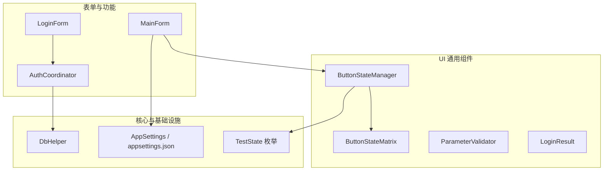
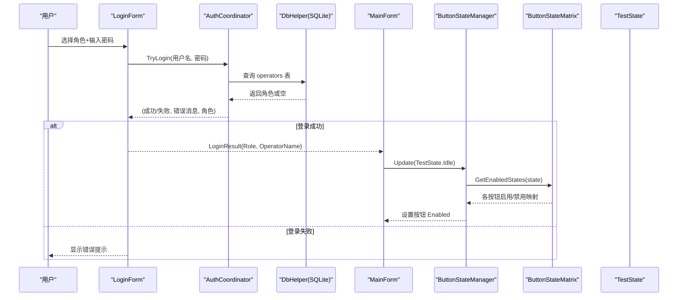
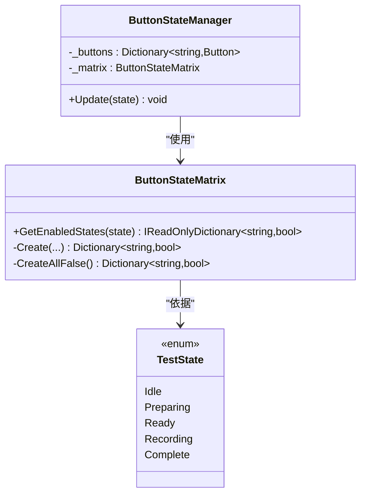
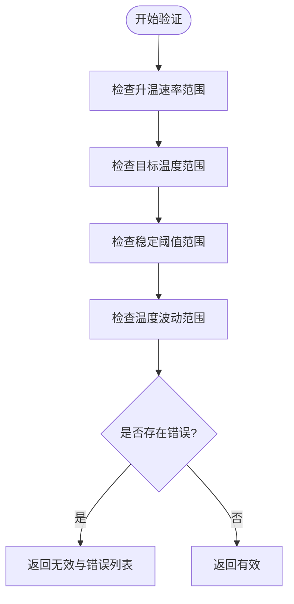
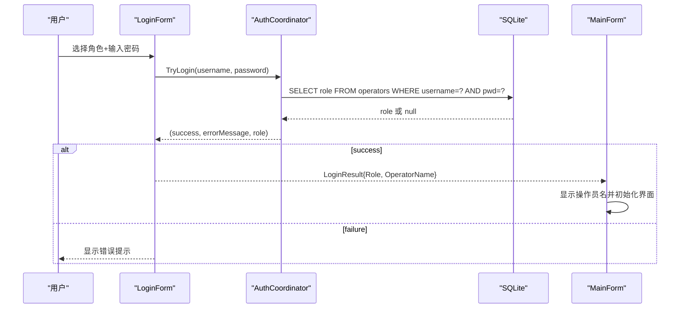
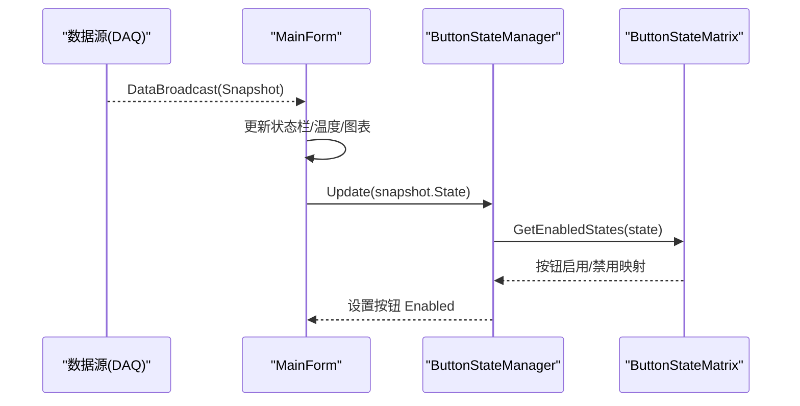
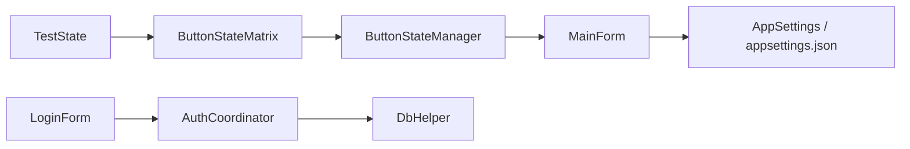

# 通用组件

<cite>
**本文引用的文件**   
- [ButtonStateManager.cs](file://src/ISO11820.App/UI/Common/ButtonStateManager.cs)
- [ButtonStateMatrix.cs](file://src/ISO11820.App/UI/Common/ButtonStateMatrix.cs)
- [ParameterValidator.cs](file://src/ISO11820.App/UI/Common/ParameterValidator.cs)
- [LoginResult.cs](file://src/ISO11820.App/UI/Common/LoginResult.cs)
- [LoginForm.cs](file://src/ISO11820.App/UI/Forms/LoginForm.cs)
- [AuthCoordinator.cs](file://src/ISO11820.App/Features/Auth/AuthCoordinator.cs)
- [MainForm.cs](file://src/ISO11820.App/UI/Forms/MainForm.cs)
- [TestState.cs](file://src/ISO11820.Core/Enums/TestState.cs)
- [DbHelper.cs](file://src/ISO11820.App/Infrastructure/Persistence/DbHelper.cs)
- [AppSettings.cs](file://src/ISO11820.App/Config/AppSettings.cs)
- [appsettings.json](file://src/ISO11820.App/appsettings.json)
- [ButtonStateMatrixTests.cs](file://tests/ISO11820.Tests/Features/ButtonStateMatrixTests.cs)
- [TC05_ButtonState.cs](file://tests/ISO11820.UI.Tests/Tests/TC05_ButtonState.cs)
- [TC01_Login.cs](file://tests/ISO11820.UI.Tests/Tests/TC01_Login.cs)
</cite>

## 目录
1. [简介](#简介)
2. [项目结构](#项目结构)
3. [核心组件](#核心组件)
4. [架构总览](#架构总览)
5. [详细组件分析](#详细组件分析)
6. [依赖关系分析](#依赖关系分析)
7. [性能考虑](#性能考虑)
8. [故障排查指南](#故障排查指南)
9. [结论](#结论)
10. [附录](#附录)

## 简介
本文件面向 ISO 11820 仿真系统的通用 UI 组件，聚焦以下目标：
- 按钮状态管理器的状态转换逻辑、启用/禁用控制与状态矩阵管理
- 参数验证器的规则、错误提示与用户反馈机制
- 登录结果的数据结构、权限信息与会话管理
- 通用组件的设计模式、复用策略与扩展接口
- 配置管理、主题支持与国际化考虑
- 最佳实践与性能优化建议

## 项目结构
通用 UI 组件位于 UI/Common 目录，配合 Forms 层与 Features 层协作完成交互与业务编排。核心文件包括：
- 按钮状态矩阵与状态管理器：ButtonStateMatrix、ButtonStateManager
- 参数验证器：ParameterValidator
- 登录结果模型：LoginResult
- 登录窗体与认证协调器：LoginForm、AuthCoordinator
- 主窗体集成点：MainForm
- 测试状态枚举：TestState
- 数据库辅助类：DbHelper
- 应用配置：AppSettings、appsettings.json

图表来源
- [ButtonStateManager.cs:1-49](file://src/ISO11820.App/UI/Common/ButtonStateManager.cs#L1-L49)
- [ButtonStateMatrix.cs:1-90](file://src/ISO11820.App/UI/Common/ButtonStateMatrix.cs#L1-L90)
- [ParameterValidator.cs:1-39](file://src/ISO11820.App/UI/Common/ParameterValidator.cs#L1-L39)
- [LoginResult.cs:1-7](file://src/ISO11820.App/UI/Common/LoginResult.cs#L1-L7)
- [LoginForm.cs:1-289](file://src/ISO11820.App/UI/Forms/LoginForm.cs#L1-L289)
- [AuthCoordinator.cs:1-62](file://src/ISO11820.App/Features/Auth/AuthCoordinator.cs#L1-L62)
- [MainForm.cs:1-800](file://src/ISO11820.App/UI/Forms/MainForm.cs#L1-L800)
- [TestState.cs:1-11](file://src/ISO11820.Core/Enums/TestState.cs#L1-L11)
- [DbHelper.cs:1-22](file://src/ISO11820.App/Infrastructure/Persistence/DbHelper.cs#L1-L22)
- [AppSettings.cs:1-160](file://src/ISO11820.App/Config/AppSettings.cs#L1-L160)
- [appsettings.json:1-29](file://src/ISO11820.App/appsettings.json#L1-L29)

章节来源
- [ButtonStateManager.cs:1-49](file://src/ISO11820.App/UI/Common/ButtonStateManager.cs#L1-L49)
- [ButtonStateMatrix.cs:1-90](file://src/ISO11820.App/UI/Common/ButtonStateMatrix.cs#L1-L90)
- [ParameterValidator.cs:1-39](file://src/ISO11820.App/UI/Common/ParameterValidator.cs#L1-L39)
- [LoginResult.cs:1-7](file://src/ISO11820.App/UI/Common/LoginResult.cs#L1-L7)
- [LoginForm.cs:1-289](file://src/ISO11820.App/UI/Forms/LoginForm.cs#L1-L289)
- [AuthCoordinator.cs:1-62](file://src/ISO11820.App/Features/Auth/AuthCoordinator.cs#L1-L62)
- [MainForm.cs:1-800](file://src/ISO11820.App/UI/Forms/MainForm.cs#L1-L800)
- [TestState.cs:1-11](file://src/ISO11820.Core/Enums/TestState.cs#L1-L11)
- [DbHelper.cs:1-22](file://src/ISO11820.App/Infrastructure/Persistence/DbHelper.cs#L1-L22)
- [AppSettings.cs:1-160](file://src/ISO11820.App/Config/AppSettings.cs#L1-L160)
- [appsettings.json:1-29](file://src/ISO11820.App/appsettings.json#L1-L29)

## 核心组件
本节对通用组件进行概览性说明，后续章节将深入展开。

- 按钮状态矩阵（ButtonStateMatrix）
  - 职责：纯逻辑映射 TestState 到各按钮的启用/禁用布尔值集合
  - 特点：无 WinForms 依赖，便于单元测试覆盖
- 按钮状态管理器（ButtonStateManager）
  - 职责：将矩阵结果应用到具体 Button 控件的 Enabled 属性
  - 特点：集中式入口，避免点击处理中散落状态逻辑
- 参数验证器（ParameterValidator）
  - 职责：校验仿真参数范围并返回错误列表
  - 特点：静态方法，输入输出清晰，易于集成到对话框
- 登录结果（LoginResult）
  - 职责：承载登录成功后的角色与操作员名称
  - 特点：不可变记录类型，跨窗体传递安全
- 登录流程（LoginForm + AuthCoordinator）
  - 职责：选择角色与密码输入、调用认证服务、显示错误信息
  - 特点：通过 DbHelper 访问 SQLite，密码以 SHA256 哈希比对
- 主窗体集成（MainForm）
  - 职责：在数据广播回调中更新状态栏、温度、图表与按钮状态
  - 特点：线程安全的 UI 更新，统一调用 ButtonStateManager.Update

章节来源
- [ButtonStateMatrix.cs:1-90](file://src/ISO11820.App/UI/Common/ButtonStateMatrix.cs#L1-L90)
- [ButtonStateManager.cs:1-49](file://src/ISO11820.App/UI/Common/ButtonStateManager.cs#L1-L49)
- [ParameterValidator.cs:1-39](file://src/ISO11820.App/UI/Common/ParameterValidator.cs#L1-L39)
- [LoginResult.cs:1-7](file://src/ISO11820.App/UI/Common/LoginResult.cs#L1-L7)
- [LoginForm.cs:1-289](file://src/ISO11820.App/UI/Forms/LoginForm.cs#L1-L289)
- [AuthCoordinator.cs:1-62](file://src/ISO11820.App/Features/Auth/AuthCoordinator.cs#L1-L62)
- [MainForm.cs:1-800](file://src/ISO11820.App/UI/Forms/MainForm.cs#L1-L800)

## 架构总览
下图展示通用组件在主流程中的协作关系：登录成功后进入主界面，主界面根据运行时状态驱动按钮矩阵，从而控制按钮可用性与用户操作路径。

图表来源
- [LoginForm.cs:1-289](file://src/ISO11820.App/UI/Forms/LoginForm.cs#L1-L289)
- [AuthCoordinator.cs:1-62](file://src/ISO11820.App/Features/Auth/AuthCoordinator.cs#L1-L62)
- [DbHelper.cs:1-22](file://src/ISO11820.App/Infrastructure/Persistence/DbHelper.cs#L1-L22)
- [MainForm.cs:1-800](file://src/ISO11820.App/UI/Forms/MainForm.cs#L1-L800)
- [ButtonStateManager.cs:1-49](file://src/ISO11820.App/UI/Common/ButtonStateManager.cs#L1-L49)
- [ButtonStateMatrix.cs:1-90](file://src/ISO11820.App/UI/Common/ButtonStateMatrix.cs#L1-L90)
- [TestState.cs:1-11](file://src/ISO11820.Core/Enums/TestState.cs#L1-L11)

## 详细组件分析

### 按钮状态矩阵与状态管理器
- 设计要点
  - 状态矩阵为纯函数式映射，输入为 TestState，输出为键值对字典（按钮标识 -> 是否启用）
  - 状态管理器维护按钮实例字典，按矩阵结果批量更新 Enabled
  - 新增按钮或状态时，仅需修改矩阵定义与构造函数映射
- 复杂度
  - 时间复杂度：O(n)，n 为按钮数量（固定为 7）
  - 空间复杂度：O(n)，用于存储映射结果
- 可测试性
  - 矩阵逻辑完全独立于 UI，可通过单元测试全面覆盖所有状态分支
- 扩展建议
  - 若需新增按钮，先在矩阵中添加键位与默认值，再在状态管理器构造中注册控件引用

图表来源
- [ButtonStateMatrix.cs:1-90](file://src/ISO11820.App/UI/Common/ButtonStateMatrix.cs#L1-L90)
- [ButtonStateManager.cs:1-49](file://src/ISO11820.App/UI/Common/ButtonStateManager.cs#L1-L49)
- [TestState.cs:1-11](file://src/ISO11820.Core/Enums/TestState.cs#L1-L11)

章节来源
- [ButtonStateMatrix.cs:1-90](file://src/ISO11820.App/UI/Common/ButtonStateMatrix.cs#L1-L90)
- [ButtonStateManager.cs:1-49](file://src/ISO11820.App/UI/Common/ButtonStateManager.cs#L1-L49)
- [ButtonStateMatrixTests.cs:1-125](file://tests/ISO11820.Tests/Features/ButtonStateMatrixTests.cs#L1-L125)
- [TC05_ButtonState.cs:1-175](file://tests/ISO11820.UI.Tests/Tests/TC05_ButtonState.cs#L1-L175)

### 参数验证器
- 验证规则
  - 升温速率：必须大于 0 且不超过 200 °C/s
  - 目标温度：必须大于 0 且不超过 1200 °C
  - 稳定阈值：必须大于 0 且不超过 50 °C
  - 温度波动范围：必须大于 0 且不超过 10 °C
- 返回值
  - 元组包含是否有效与错误数组；当存在错误时，UI 应汇总提示
- 用户反馈
  - 建议在对话框底部或字段旁聚合显示错误文本，提升可读性
- 扩展建议
  - 可按领域拆分多个验证器或使用验证规则集合，便于组合与复用

图表来源
- [ParameterValidator.cs:1-39](file://src/ISO11820.App/UI/Common/ParameterValidator.cs#L1-L39)

章节来源
- [ParameterValidator.cs:1-39](file://src/ISO11820.App/UI/Common/ParameterValidator.cs#L1-L39)

### 登录结果与登录流程
- 数据结构
  - LoginResult 包含 Role 与 OperatorName，用于主界面显示与后续权限判断
- 权限信息
  - 当前实现基于数据库 role 字段区分管理员与试验员
  - 可在 MainForm 中根据 Role 控制菜单或功能可见性
- 会话管理
  - 当前采用内存持有 LoginResult 的方式维持会话
  - 如需持久化与会话过期，可扩展为带过期时间的会话令牌
- 错误提示
  - 登录失败时 LoginForm 显示错误标签，避免关闭登录窗口

图表来源
- [LoginForm.cs:1-289](file://src/ISO11820.App/UI/Forms/LoginForm.cs#L1-L289)
- [AuthCoordinator.cs:1-62](file://src/ISO11820.App/Features/Auth/AuthCoordinator.cs#L1-L62)
- [DbHelper.cs:1-22](file://src/ISO11820.App/Infrastructure/Persistence/DbHelper.cs#L1-L22)
- [LoginResult.cs:1-7](file://src/ISO11820.App/UI/Common/LoginResult.cs#L1-L7)
- [MainForm.cs:1-800](file://src/ISO11820.App/UI/Forms/MainForm.cs#L1-L800)

章节来源
- [LoginForm.cs:1-289](file://src/ISO11820.App/UI/Forms/LoginForm.cs#L1-L289)
- [AuthCoordinator.cs:1-62](file://src/ISO11820.App/Features/Auth/AuthCoordinator.cs#L1-L62)
- [LoginResult.cs:1-7](file://src/ISO11820.App/UI/Common/LoginResult.cs#L1-L7)
- [TC01_Login.cs:1-212](file://tests/ISO11820.UI.Tests/Tests/TC01_Login.cs#L1-L212)

### 主窗体集成与状态驱动
- 状态驱动
  - MainForm 在数据广播回调中调用 ButtonStateManager.Update(snapshot.State)
  - 状态文本与计时、温漂、温度通道等一并刷新
- 线程安全
  - 通过 InvokeRequired/Invoke 确保跨线程 UI 更新安全
- 事件绑定
  - 按钮点击委托至控制器或服务，保持 UI 薄层职责

图表来源
- [MainForm.cs:1-800](file://src/ISO11820.App/UI/Forms/MainForm.cs#L1-L800)
- [ButtonStateManager.cs:1-49](file://src/ISO11820.App/UI/Common/ButtonStateManager.cs#L1-L49)
- [ButtonStateMatrix.cs:1-90](file://src/ISO11820.App/UI/Common/ButtonStateMatrix.cs#L1-L90)

章节来源
- [MainForm.cs:1-800](file://src/ISO11820.App/UI/Forms/MainForm.cs#L1-L800)

## 依赖关系分析
- 组件耦合
  - ButtonStateManager 依赖 ButtonStateMatrix 与具体 Button 实例
  - ButtonStateMatrix 仅依赖 TestState 枚举，低耦合高内聚
  - LoginForm 依赖 AuthCoordinator 与 DbHelper
  - MainForm 依赖 ButtonStateManager 与应用上下文（控制器、导出、历史等）
- 外部依赖
  - SQLite 通过 DbHelper 提供连接
  - 配置文件通过 AppSettings 加载并解析路径

图表来源
- [ButtonStateMatrix.cs:1-90](file://src/ISO11820.App/UI/Common/ButtonStateMatrix.cs#L1-L90)
- [ButtonStateManager.cs:1-49](file://src/ISO11820.App/UI/Common/ButtonStateManager.cs#L1-L49)
- [MainForm.cs:1-800](file://src/ISO11820.App/UI/Forms/MainForm.cs#L1-L800)
- [LoginForm.cs:1-289](file://src/ISO11820.App/UI/Forms/LoginForm.cs#L1-L289)
- [AuthCoordinator.cs:1-62](file://src/ISO11820.App/Features/Auth/AuthCoordinator.cs#L1-L62)
- [DbHelper.cs:1-22](file://src/ISO11820.App/Infrastructure/Persistence/DbHelper.cs#L1-L22)
- [AppSettings.cs:1-160](file://src/ISO11820.App/Config/AppSettings.cs#L1-L160)
- [appsettings.json:1-29](file://src/ISO11820.App/appsettings.json#L1-L29)

章节来源
- [ButtonStateMatrix.cs:1-90](file://src/ISO11820.App/UI/Common/ButtonStateMatrix.cs#L1-L90)
- [ButtonStateManager.cs:1-49](file://src/ISO11820.App/UI/Common/ButtonStateManager.cs#L1-L49)
- [LoginForm.cs:1-289](file://src/ISO11820.App/UI/Forms/LoginForm.cs#L1-L289)
- [AuthCoordinator.cs:1-62](file://src/ISO11820.App/Features/Auth/AuthCoordinator.cs#L1-L62)
- [DbHelper.cs:1-22](file://src/ISO11820.App/Infrastructure/Persistence/DbHelper.cs#L1-L22)
- [MainForm.cs:1-800](file://src/ISO11820.App/UI/Forms/MainForm.cs#L1-L800)
- [AppSettings.cs:1-160](file://src/ISO11820.App/Config/AppSettings.cs#L1-L160)
- [appsettings.json:1-29](file://src/ISO11820.App/appsettings.json#L1-L29)

## 性能考虑
- 按钮状态更新
  - 每次状态变更仅遍历固定数量的按钮，开销极小
  - 建议批量更新后一次性刷新 UI，避免频繁重绘
- 登录验证
  - 密码哈希计算轻量，数据库查询为单行筛选，延迟主要来自 I/O
  - 建议缓存常用查询结果（如操作员列表）以减少重复 IO
- 主界面刷新
  - 高频数据广播下，注意合并 UI 更新与节流渲染
  - 图表绘制应避免每帧创建大量对象，必要时复用缓冲区

[本节为通用指导，不直接分析具体文件]

## 故障排查指南
- 按钮状态异常
  - 检查矩阵是否覆盖所有状态与按钮键位
  - 确认状态管理器构造中按钮键名与矩阵一致
  - 参考单元测试用例定位缺失断言
- 登录失败
  - 核对数据库中 operators 表的 username 与 pwd 字段
  - 确认密码哈希算法与前端输入一致
  - 查看错误标签文本是否为“密码错误，请重新输入”
- 参数验证未生效
  - 确认对话框在提交前调用验证器并聚合错误
  - 检查数值边界是否符合预期范围

章节来源
- [ButtonStateMatrixTests.cs:1-125](file://tests/ISO11820.Tests/Features/ButtonStateMatrixTests.cs#L1-L125)
- [TC05_ButtonState.cs:1-175](file://tests/ISO11820.UI.Tests/Tests/TC05_ButtonState.cs#L1-L175)
- [TC01_Login.cs:1-212](file://tests/ISO11820.UI.Tests/Tests/TC01_Login.cs#L1-L212)
- [LoginForm.cs:1-289](file://src/ISO11820.App/UI/Forms/LoginForm.cs#L1-L289)
- [AuthCoordinator.cs:1-62](file://src/ISO11820.App/Features/Auth/AuthCoordinator.cs#L1-L62)

## 结论
通用 UI 组件通过清晰的职责划分与低耦合设计，实现了：
- 按钮状态的可测试矩阵管理与集中式应用
- 参数验证的规则化与错误聚合
- 登录流程的安全与友好反馈
- 主界面的状态驱动与线程安全更新

建议在未来版本中引入主题与国际化支持，并通过配置中心统一管理外观与文案，进一步提升可维护性与用户体验。

[本节为总结性内容，不直接分析具体文件]

## 附录

### 配置管理
- 配置文件位置与结构
  - appsettings.json 包含数据库、仿真、输出、文件存储、报告与硬件相关配置
- 配置加载与路径解析
  - AppSettings 提供默认值与 ResolvePaths 能力，支持相对路径解析为绝对路径
- 使用建议
  - 将敏感路径与运行期开关放入配置，避免硬编码
  - 在启动阶段加载并注入到需要的位置

章节来源
- [appsettings.json:1-29](file://src/ISO11820.App/appsettings.json#L1-L29)
- [AppSettings.cs:1-160](file://src/ISO11820.App/Config/AppSettings.cs#L1-L160)

### 主题支持与国际化考虑
- 主题支持
  - 当前 UI 样式集中在控件创建处，建议抽取主题资源（颜色、字体、尺寸）
  - 可引入主题切换器，动态替换控件外观
- 国际化
  - 建议将界面文案抽离为资源文件或配置项
  - 在 MainForm 与对话框中统一读取本地化资源

[本节为概念性建议，不直接分析具体文件]

### 最佳实践
- 状态机与 UI 分离
  - 状态矩阵保持纯函数式，UI 仅负责呈现
- 错误聚合与提示
  - 将多条错误合并展示，减少弹窗干扰
- 线程安全
  - 跨线程更新 UI 时使用 Invoke，避免交叉线程异常
- 可测试性
  - 关键逻辑编写单元测试，UI 行为通过自动化验收测试覆盖

[本节为通用指导，不直接分析具体文件]