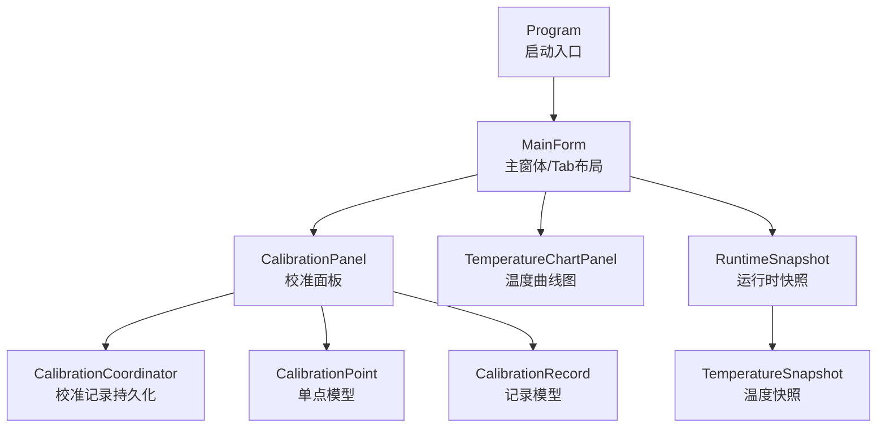
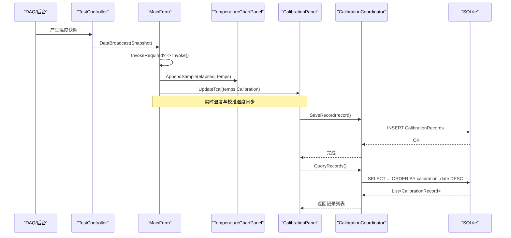
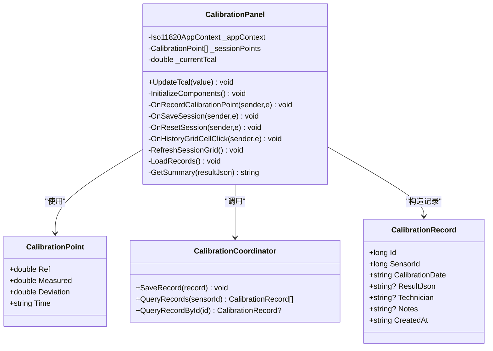
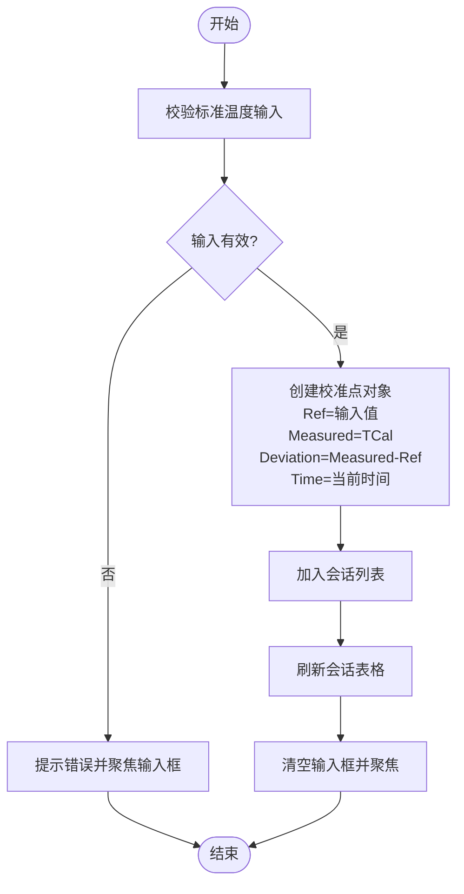
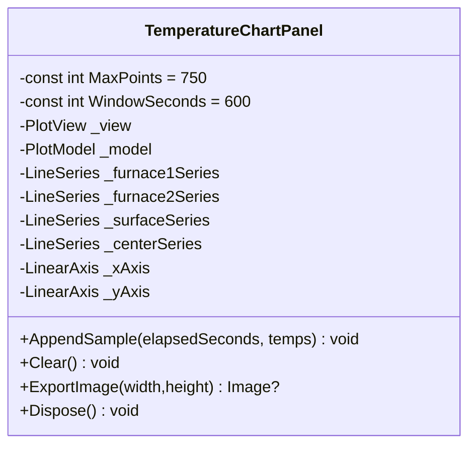
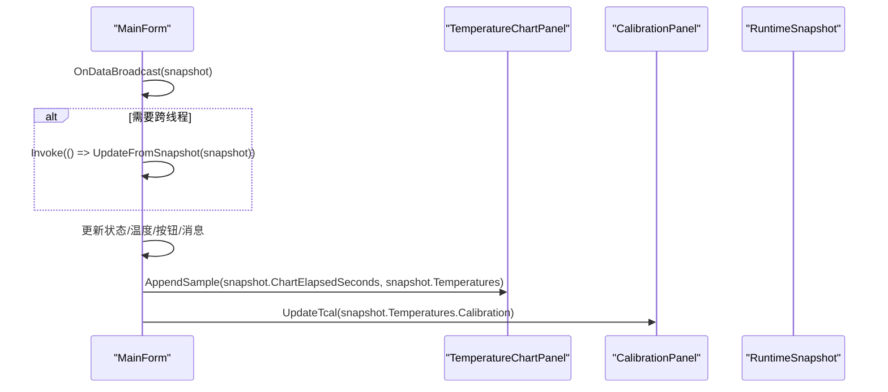
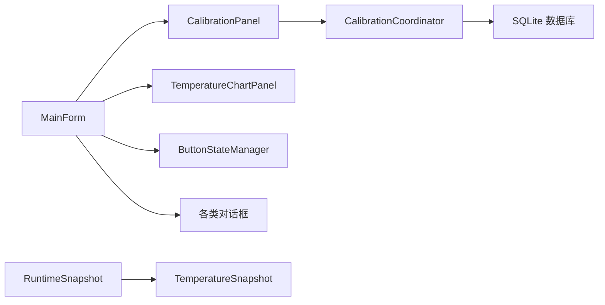

# 面板组件

<cite>
**本文引用的文件**
- [CalibrationPanel.cs](file://src/ISO11820.App/UI/Panels/CalibrationPanel.cs)
- [CalibrationPoint.cs](file://src/ISO11820.App/UI/Panels/CalibrationPoint.cs)
- [CalibrationCoordinator.cs](file://src/ISO11820.App/Features/Calibration/CalibrationCoordinator.cs)
- [TemperatureChartPanel.cs](file://src/ISO11820.App/UI/Chart/TemperatureChartPanel.cs)
- [MainForm.cs](file://src/ISO11820.App/UI/Forms/MainForm.cs)
- [Program.cs](file://src/ISO11820.App/Program.cs)
- [CalibrationRecord.cs](file://src/ISO11820.App/Infrastructure/Persistence/Models/CalibrationRecord.cs)
- [RuntimeSnapshot.cs](file://src/ISO11820.App/Shared/Models/RuntimeSnapshot.cs)
- [TemperatureSnapshot.cs](file://src/ISO11820.Core/Models/TemperatureSnapshot.cs)
</cite>

## 目录
1. [简介](#简介)
2. [项目结构](#项目结构)
3. [核心组件](#核心组件)
4. [架构总览](#架构总览)
5. [详细组件分析](#详细组件分析)
6. [依赖关系分析](#依赖关系分析)
7. [性能与内存管理](#性能与内存管理)
8. [故障排查指南](#故障排查指南)
9. [结论](#结论)
10. [附录](#附录)

## 简介
本文件面向 ISO 11820 系统的面板组件，聚焦“校准面板”的整体设计与实现。内容覆盖：
- 校准面板的布局、温度显示与状态指示
- 校准点面板的交互逻辑、参数调整与实时反馈
- 数据绑定、事件处理与状态同步机制
- 布局管理与响应式行为（Dock/FlowLayoutPanel）
- 可重用性设计、配置管理与扩展接口
- 性能优化与内存管理策略

## 项目结构
与面板相关的代码主要分布在 UI 层与特性协调器之间：
- UI 面板：CalibrationPanel、TemperatureChartPanel
- 主窗体：MainForm（负责 Tab 页组织、事件分发与跨线程更新）
- 校准协调器：CalibrationCoordinator（持久化访问）
- 模型：CalibrationPoint、CalibrationRecord、TemperatureSnapshot、RuntimeSnapshot
- 入口：Program（初始化应用上下文并运行 MainForm）

图表来源
- [Program.cs:1-25](file://src/ISO11820.App/Program.cs#L1-L25)
- [MainForm.cs:1-120](file://src/ISO11820.App/UI/Forms/MainForm.cs#L1-L120)
- [CalibrationPanel.cs:1-60](file://src/ISO11820.App/UI/Panels/CalibrationPanel.cs#L1-L60)
- [TemperatureChartPanel.cs:1-40](file://src/ISO11820.App/UI/Chart/TemperatureChartPanel.cs#L1-L40)
- [CalibrationCoordinator.cs:1-30](file://src/ISO11820.App/Features/Calibration/CalibrationCoordinator.cs#L1-L30)
- [CalibrationPoint.cs:1-9](file://src/ISO11820.App/UI/Panels/CalibrationPoint.cs#L1-L9)
- [CalibrationRecord.cs:1-18](file://src/ISO11820.App/Infrastructure/Persistence/Models/CalibrationRecord.cs#L1-L18)
- [RuntimeSnapshot.cs:1-12](file://src/ISO11820.App/Shared/Models/RuntimeSnapshot.cs#L1-L12)
- [TemperatureSnapshot.cs:1-10](file://src/ISO11820.Core/Models/TemperatureSnapshot.cs#L1-L10)

章节来源
- [Program.cs:1-25](file://src/ISO11820.App/Program.cs#L1-L25)
- [MainForm.cs:1-120](file://src/ISO11820.App/UI/Forms/MainForm.cs#L1-L120)

## 核心组件
- 校准面板（CalibrationPanel）
  - 提供 TCal 实时显示、会话内多点校准录入、历史校准记录查看与详情展示、保存与重置会话等能力。
- 校准点（CalibrationPoint）
  - 表示单次校准点的数据结构：标准温度、实测温度、偏差、时间戳。
- 校准协调器（CalibrationCoordinator）
  - 封装 SQLite 读写操作，提供保存记录、查询记录、按 ID 查询记录等方法。
- 温度曲线图面板（TemperatureChartPanel）
  - 基于 OxyPlot 的滚动窗口温度曲线，支持追加采样、清空、导出图片。
- 主窗体（MainForm）
  - 组织 Tab 页，将校准面板嵌入“设备校准”页；订阅后台广播，跨线程更新温度与按钮状态；驱动图表刷新。

章节来源
- [CalibrationPanel.cs:1-120](file://src/ISO11820.App/UI/Panels/CalibrationPanel.cs#L1-L120)
- [CalibrationPoint.cs:1-9](file://src/ISO11820.App/UI/Panels/CalibrationPoint.cs#L1-L9)
- [CalibrationCoordinator.cs:1-91](file://src/ISO11820.App/Features/Calibration/CalibrationCoordinator.cs#L1-L91)
- [TemperatureChartPanel.cs:1-120](file://src/ISO11820.App/UI/Chart/TemperatureChartPanel.cs#L1-L120)
- [MainForm.cs:250-460](file://src/ISO11820.App/UI/Forms/MainForm.cs#L250-L460)

## 架构总览
下图展示了从后台数据广播到 UI 面板更新的完整链路，以及校准面板与持久化的交互。

图表来源
- [MainForm.cs:537-609](file://src/ISO11820.App/UI/Forms/MainForm.cs#L537-L609)
- [TemperatureChartPanel.cs:122-205](file://src/ISO11820.App/UI/Chart/TemperatureChartPanel.cs#L122-L205)
- [CalibrationPanel.cs:285-319](file://src/ISO11820.App/UI/Panels/CalibrationPanel.cs#L285-L319)
- [CalibrationCoordinator.cs:16-64](file://src/ISO11820.App/Features/Calibration/CalibrationCoordinator.cs#L16-L64)

## 详细组件分析

### 校准面板（CalibrationPanel）
- 整体设计
  - 顶部显示当前校准温度 TCal，随后台广播实时更新。
  - 中部为“当前校准会话”区域：输入标准温度、记录此校准点、会话表格、保存/重置按钮。
  - 底部为“历史校准记录”区域：表格展示历史条目，点击行弹出详情对话框。
- 温度显示与状态指示
  - 通过 UpdateTcal 方法接收后台温度值，使用 Invoke 确保线程安全更新标签文本。
- 交互逻辑
  - 输入校验：仅接受有效数值；回车键快捷记录。
  - 记录点：计算偏差并加入会话列表，刷新会话表格。
  - 保存会话：序列化会话点为 JSON，写入数据库，清空会话并刷新历史记录。
  - 重置会话：二次确认后清空会话与输入框。
  - 历史详情：解析 ResultJson，若为多点 JSON 则打开详情对话框，否则回退显示原始字符串。
- 数据绑定与事件处理
  - 会话表格列：序号、标准温度、实测温度、偏差、时间。
  - 历史表格列：校准日期、操作员、结果摘要、备注。
  - 事件：记录点、保存、重置、刷新、历史行点击。
- 布局与响应式
  - 使用 DockStyle.Fill 填充父容器；会话区采用 FlowLayoutPanel 水平排列输入控件；表格使用 Fill 自适应宽度。
  - 通过 SuspendLayout/ResumeLayout 批量更新 DataGridView，减少闪烁。
- 可重用性与扩展
  - 构造函数注入 Iso11820AppContext，便于替换持久化或测试模拟。
  - 暴露 UpdateTcal 作为外部温度源接入点。
  - 可通过新增列、扩展对话框或增加校验规则进行功能扩展。

图表来源
- [CalibrationPanel.cs:1-120](file://src/ISO11820.App/UI/Panels/CalibrationPanel.cs#L1-L120)
- [CalibrationPoint.cs:1-9](file://src/ISO11820.App/UI/Panels/CalibrationPoint.cs#L1-L9)
- [CalibrationCoordinator.cs:1-91](file://src/ISO11820.App/Features/Calibration/CalibrationCoordinator.cs#L1-L91)
- [CalibrationRecord.cs:1-18](file://src/ISO11820.App/Infrastructure/Persistence/Models/CalibrationRecord.cs#L1-L18)

章节来源
- [CalibrationPanel.cs:1-437](file://src/ISO11820.App/UI/Panels/CalibrationPanel.cs#L1-L437)
- [CalibrationPoint.cs:1-9](file://src/ISO11820.App/UI/Panels/CalibrationPoint.cs#L1-L9)
- [CalibrationCoordinator.cs:1-91](file://src/ISO11820.App/Features/Calibration/CalibrationCoordinator.cs#L1-L91)
- [CalibrationRecord.cs:1-18](file://src/ISO11820.App/Infrastructure/Persistence/Models/CalibrationRecord.cs#L1-L18)

#### 校准点录入流程（算法流程图）

图表来源
- [CalibrationPanel.cs:261-283](file://src/ISO11820.App/UI/Panels/CalibrationPanel.cs#L261-L283)

### 温度曲线图面板（TemperatureChartPanel）
- 功能概述
  - 维护 PlotModel 与四个 LineSeries（炉温1、炉温2、表面温、中心温）。
  - 滚动窗口：X轴最大窗口 600 秒，最多保留 750 个点，超出裁剪旧数据。
  - 提供 AppendSample、Clear、ExportImage 等接口。
- 渲染与刷新
  - 监听 Paint 与 SizeChanged 事件，必要时强制重绘。
  - 在 AppendSample/Clear 后调用 InvalidatePlot(true) 与 Refresh()，并在条件满足时执行。
- 诊断与导出
  - 内部包含调试日志与定期导出 PNG 的功能，便于定位渲染问题。

图表来源
- [TemperatureChartPanel.cs:1-120](file://src/ISO11820.App/UI/Chart/TemperatureChartPanel.cs#L1-L120)
- [TemperatureChartPanel.cs:122-205](file://src/ISO11820.App/UI/Chart/TemperatureChartPanel.cs#L122-L205)
- [TemperatureChartPanel.cs:218-280](file://src/ISO11820.App/UI/Chart/TemperatureChartPanel.cs#L218-L280)

章节来源
- [TemperatureChartPanel.cs:1-304](file://src/ISO11820.App/UI/Chart/TemperatureChartPanel.cs#L1-L304)

### 主窗体集成与状态同步（MainForm）
- 布局组织
  - 使用 TabControl 组织三个页面：主操作界面、记录查询、设备校准。
  - 将 CalibrationPanel 添加到“设备校准”页，TemperatureChartPanel.View 添加到主操作页。
- 数据广播与跨线程更新
  - 订阅 TestController.DataBroadcast，在 OnDataBroadcast 中检查 InvokeRequired 并通过 Invoke 调度到 UI 线程。
  - 更新状态栏、计时、温漂、各通道温度、按钮状态矩阵、消息框，并驱动图表与校准面板更新。
- 图表联动
  - 非空闲状态下，调用 AppendSample 追加温度采样；新建试验或开始升温前调用 Clear 清空图表。

图表来源
- [MainForm.cs:537-609](file://src/ISO11820.App/UI/Forms/MainForm.cs#L537-L609)
- [RuntimeSnapshot.cs:1-12](file://src/ISO11820.App/Shared/Models/RuntimeSnapshot.cs#L1-L12)
- [TemperatureSnapshot.cs:1-10](file://src/ISO11820.Core/Models/TemperatureSnapshot.cs#L1-L10)

章节来源
- [MainForm.cs:250-460](file://src/ISO11820.App/UI/Forms/MainForm.cs#L250-L460)
- [MainForm.cs:537-609](file://src/ISO11820.App/UI/Forms/MainForm.cs#L537-L609)

## 依赖关系分析
- 组件耦合
  - CalibrationPanel 依赖 Iso11820AppContext 以访问 CalibrationCoordinator，从而与 SQLite 解耦。
  - MainForm 依赖多个子组件（图表、按钮状态机、对话框），但通过事件与接口保持松耦合。
- 直接依赖
  - CalibrationPanel → CalibrationCoordinator → SQLite
  - MainForm → TemperatureChartPanel、CalibrationPanel、ButtonStateManager、Dialogs
- 间接依赖
  - RuntimeSnapshot 聚合 TemperatureSnapshot，用于统一推送多通道温度与时间信息。

图表来源
- [CalibrationPanel.cs:1-60](file://src/ISO11820.App/UI/Panels/CalibrationPanel.cs#L1-L60)
- [CalibrationCoordinator.cs:1-30](file://src/ISO11820.App/Features/Calibration/CalibrationCoordinator.cs#L1-L30)
- [MainForm.cs:250-460](file://src/ISO11820.App/UI/Forms/MainForm.cs#L250-L460)
- [RuntimeSnapshot.cs:1-12](file://src/ISO11820.App/Shared/Models/RuntimeSnapshot.cs#L1-L12)
- [TemperatureSnapshot.cs:1-10](file://src/ISO11820.Core/Models/TemperatureSnapshot.cs#L1-L10)

章节来源
- [CalibrationPanel.cs:1-120](file://src/ISO11820.App/UI/Panels/CalibrationPanel.cs#L1-L120)
- [CalibrationCoordinator.cs:1-91](file://src/ISO11820.App/Features/Calibration/CalibrationCoordinator.cs#L1-L91)
- [MainForm.cs:250-460](file://src/ISO11820.App/UI/Forms/MainForm.cs#L250-L460)

## 性能与内存管理
- 图表性能
  - 固定最大点数与滚动窗口，避免无限增长导致内存与绘制压力。
  - 批量更新前使用 SuspendLayout/ResumeLayout 减少重绘次数。
  - 仅在可见且尺寸有效时触发 Refresh，避免无效绘制。
- 数据刷新
  - 使用 Invoke 保证 UI 线程安全，避免跨线程异常与竞态。
  - 对大数据集（如历史表格）采用分批构建 Rows 的方式，降低卡顿。
- 资源释放
  - TemperatureChartPanel 实现 IDisposable，释放 PlotView 资源。
  - MainForm 在关闭时取消订阅事件并停止后台采集，防止泄漏。
- 建议优化
  - 对频繁序列化的 JSON 可考虑缓存或增量更新。
  - 对大量历史记录的加载可采用分页或延迟加载。
  - 图表导出图片可异步执行，避免阻塞 UI。

[本节为通用指导，不直接分析具体文件]

## 故障排查指南
- 图表不刷新
  - 检查 View 是否已创建句柄、是否可见、尺寸是否大于 0。
  - 确认 AppendSample 与 Clear 后是否调用了 InvalidatePlot(true) 与 Refresh()。
  - 参考调试日志路径与输出，定位 Paint 事件是否被触发。
- 温度未同步到校准面板
  - 确认 MainForm 的 OnDataBroadcast 是否正确 Invoke 到 UI 线程。
  - 确认 UpdateTcal 是否被调用且无异常。
- 校准记录保存失败
  - 检查数据库连接与 SQL 语句。
  - 捕获异常并提示用户，同时记录错误信息。
- 历史详情无法解析
  - 当 ResultJson 不是多点 JSON 时，回退显示原始字符串；注意长度截断与异常处理。

章节来源
- [TemperatureChartPanel.cs:86-105](file://src/ISO11820.App/UI/Chart/TemperatureChartPanel.cs#L86-L105)
- [TemperatureChartPanel.cs:122-205](file://src/ISO11820.App/UI/Chart/TemperatureChartPanel.cs#L122-L205)
- [MainForm.cs:537-609](file://src/ISO11820.App/UI/Forms/MainForm.cs#L537-L609)
- [CalibrationPanel.cs:285-319](file://src/ISO11820.App/UI/Panels/CalibrationPanel.cs#L285-L319)
- [CalibrationPanel.cs:336-374](file://src/ISO11820.App/UI/Panels/CalibrationPanel.cs#L336-L374)

## 结论
校准面板通过清晰的布局与事件驱动实现了多点校准的便捷操作，结合后台温度广播实现了实时显示与状态同步。图表面板采用滚动窗口与固定点数策略保障性能，主窗体通过事件总线与跨线程调度确保 UI 一致性。整体设计具备良好的可重用性与扩展性，适合在 ISO 11820 系统中持续演进。

[本节为总结性内容，不直接分析具体文件]

## 附录
- 关键类与方法路径
  - 校准面板：[CalibrationPanel.cs](file://src/ISO11820.App/UI/Panels/CalibrationPanel.cs)
  - 校准点模型：[CalibrationPoint.cs](file://src/ISO11820.App/UI/Panels/CalibrationPoint.cs)
  - 校准协调器：[CalibrationCoordinator.cs](file://src/ISO11820.App/Features/Calibration/CalibrationCoordinator.cs)
  - 温度图表面板：[TemperatureChartPanel.cs](file://src/ISO11820.App/UI/Chart/TemperatureChartPanel.cs)
  - 主窗体集成：[MainForm.cs](file://src/ISO11820.App/UI/Forms/MainForm.cs)
  - 应用入口：[Program.cs](file://src/ISO11820.App/Program.cs)
  - 校准记录模型：[CalibrationRecord.cs](file://src/ISO11820.App/Infrastructure/Persistence/Models/CalibrationRecord.cs)
  - 运行时快照：[RuntimeSnapshot.cs](file://src/ISO11820.App/Shared/Models/RuntimeSnapshot.cs)
  - 温度快照：[TemperatureSnapshot.cs](file://src/ISO11820.Core/Models/TemperatureSnapshot.cs)