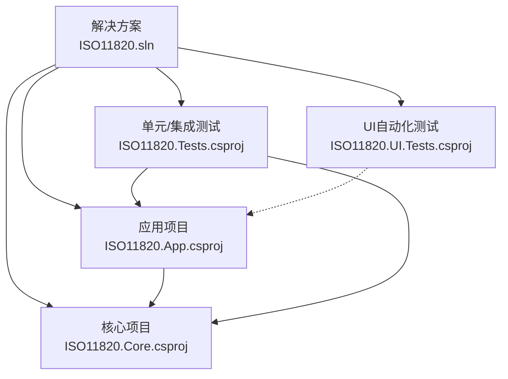
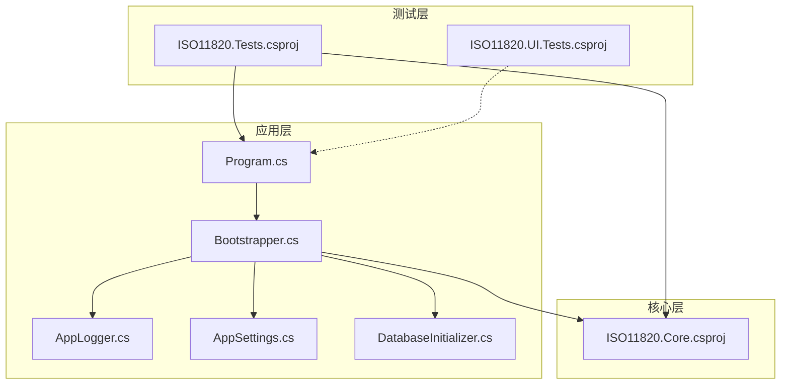
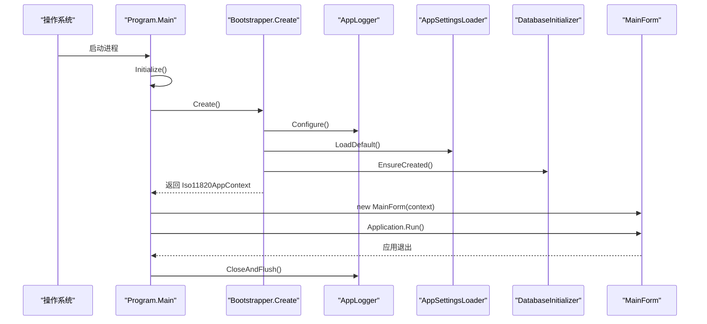
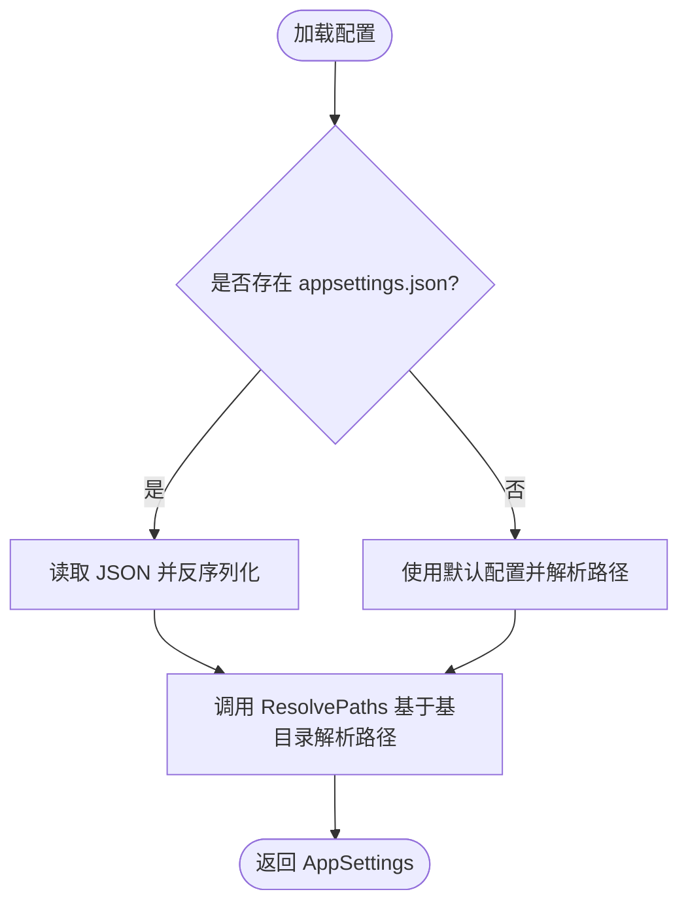
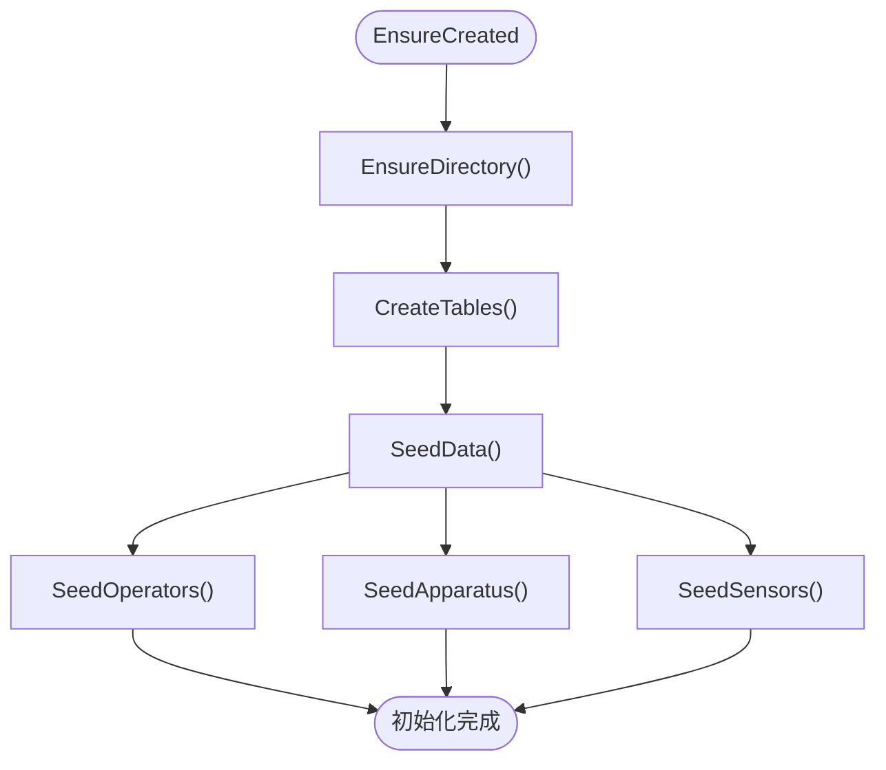
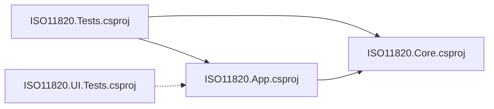

# 部署指南

<cite>
**本文引用的文件**
- [ISO11820.sln](file://ISO11820.sln)
- [ISO11820.App.csproj](file://src/ISO11820.App/ISO11820.App.csproj)
- [ISO11820.Core.csproj](file://src/ISO11820.Core/ISO11820.Core.csproj)
- [Program.cs](file://src/ISO11820.App/Program.cs)
- [Bootstrapper.cs](file://src/ISO11820.App/App/Bootstrapper.cs)
- [appsettings.json](file://src/ISO11820.App/appsettings.json)
- [AppSettings.cs](file://src/ISO11820.App/Config/AppSettings.cs)
- [AppLogger.cs](file://src/ISO11820.App/Config/AppLogger.cs)
- [DatabaseInitializer.cs](file://src/ISO11820.App/Infrastructure\Persistence\DatabaseInitializer.cs)
- [ISO11820.Tests.csproj](file://tests/ISO11820.Tests/ISO11820.Tests.csproj)
- [ISO11820.UI.Tests.csproj](file://tests/ISO11820.UI.Tests/ISO11820.UI.Tests.csproj)
- [RunTests.ps1](file://tests/ISO11820.UI.Tests/RunTests.ps1)
- [build_ppt.py](file://scripts/build_ppt.py)
- [我的计划.md](file://我自己的计划.md)
</cite>

## 目录
1. [简介](#简介)
2. [项目结构](#项目结构)
3. [核心组件](#核心组件)
4. [架构总览](#架构总览)
5. [详细组件分析](#详细组件分析)
6. [依赖关系分析](#依赖关系分析)
7. [性能考虑](#性能考虑)
8. [故障排除指南](#故障排除指南)
9. [结论](#结论)
10. [附录](#附录)

## 简介
本指南面向ISO 11820系统（材料燃烧试验仿真系统）的部署与运维，涵盖Visual Studio项目结构、NuGet包管理与依赖解析、构建配置、打包与发布流程、安装包制作、环境要求与部署拓扑、生产环境配置优化与性能调优、监控设置、故障排除与日志分析、版本管理与回滚策略、升级路径，以及容器化与云部署选项。内容基于仓库中的实际源码与测试脚本进行梳理，确保部署流程可落地、可验证。

## 项目结构
ISO 11820采用多项目解决方案组织，分为应用层、核心领域层与测试层，配合配置与脚本资源，形成清晰的分层与职责边界。

- 解决方案与项目
  - 解决方案文件定义了应用、核心与测试项目的组合与平台配置。
  - 应用项目为WinForms桌面应用，引用核心项目，并声明第三方依赖。
  - 核心项目为纯业务领域，不依赖外部实现，便于测试与复用。
  - 测试项目包含单元/集成测试与UI自动化测试，分别引用核心与应用项目。

- 关键文件与职责
  - 程序入口与启动流程：Program.cs负责初始化应用配置、创建上下文并运行主窗体；Bootstrapper集中装配各子系统。
  - 配置与日志：appsettings.json提供运行时配置；AppSettings.cs解析与路径转换；AppLogger.cs配置Serilog文件日志。
  - 数据持久化：DatabaseInitializer负责SQLite数据库初始化、表结构创建与种子数据注入。
  - 测试与验证：测试项目与PowerShell脚本提供自动化测试执行与结果汇总。

**图示来源**
- [ISO11820.sln:1-51](file://ISO11820.sln#L1-L51)
- [ISO11820.App.csproj:1-30](file://src/ISO11820.App/ISO11820.App.csproj#L1-L30)
- [ISO11820.Core.csproj:1-10](file://src/ISO11820.Core/ISO11820.Core.csproj#L1-L10)
- [ISO11820.Tests.csproj:1-27](file://tests/ISO11820.Tests/ISO11820.Tests.csproj#L1-L27)
- [ISO11820.UI.Tests.csproj:1-38](file://tests/ISO11820.UI.Tests/ISO11820.UI.Tests.csproj#L1-L38)

**章节来源**
- [ISO11820.sln:1-51](file://ISO11820.sln#L1-L51)
- [ISO11820.App.csproj:1-30](file://src/ISO11820.App/ISO11820.App.csproj#L1-L30)
- [ISO11820.Core.csproj:1-10](file://src/ISO11820.Core/ISO11820.Core.csproj#L1-L10)
- [ISO11820.Tests.csproj:1-27](file://tests/ISO11820.Tests/ISO11820.Tests.csproj#L1-L27)
- [ISO11820.UI.Tests.csproj:1-38](file://tests/ISO11820.UI.Tests/ISO11820.UI.Tests.csproj#L1-L38)

## 核心组件
- 启动与装配
  - 程序入口：初始化应用配置，创建应用上下文并运行主窗体；退出时关闭并刷新日志。
  - Bootstrapper：集中初始化日志、设置EPPlus许可、加载配置、创建数据库初始化器、文件写入器、仿真器、控制器、DAQ工作线程、各功能协调器与导出服务，并返回应用上下文。
- 配置与路径解析
  - appsettings.json：定义数据库、仿真、输出、文件存储、报告与硬件参数等配置项。
  - AppSettings：提供配置模型与路径解析方法，支持相对路径转绝对路径，确保不同部署位置的一致性。
- 日志系统
  - AppLogger：使用Serilog配置文件日志，按日滚动、单文件10MB限制、保留30天，模板包含时间戳、级别、消息与异常。
- 数据持久化
  - DatabaseInitializer：确保数据库目录存在、创建6张核心表、注入种子数据（管理员/试验员账号、默认设备与传感器），并提供登录校验与密码哈希。

**章节来源**
- [Program.cs:1-25](file://src/ISO11820.App/Program.cs#L1-L25)
- [Bootstrapper.cs:1-66](file://src/ISO11820.App/App/Bootstrapper.cs#L1-L66)
- [appsettings.json:1-29](file://src/ISO11820.App/appsettings.json#L1-L29)
- [AppSettings.cs:1-160](file://src/ISO11820.App/Config/AppSettings.cs#L1-L160)
- [AppLogger.cs:1-32](file://src/ISO11820.App/Config/AppLogger.cs#L1-L32)
- [DatabaseInitializer.cs:1-198](file://src/ISO11820.App/Infrastructure\Persistence\DatabaseInitializer.cs#L1-L198)

## 架构总览
系统采用分层架构：核心层不含外部依赖，应用层承载UI与运行时引擎，测试层覆盖单元、集成与UI自动化。配置与日志贯穿全局，数据库初始化在启动时完成。

**图示来源**
- [Program.cs:1-25](file://src/ISO11820.App/Program.cs#L1-L25)
- [Bootstrapper.cs:1-66](file://src/ISO11820.App/App/Bootstrapper.cs#L1-L66)
- [AppLogger.cs:1-32](file://src/ISO11820.App/Config/AppLogger.cs#L1-L32)
- [AppSettings.cs:1-160](file://src/ISO11820.App/Config/AppSettings.cs#L1-L160)
- [DatabaseInitializer.cs:1-198](file://src/ISO11820.App/Infrastructure\Persistence\DatabaseInitializer.cs#L1-L198)
- [ISO11820.Core.csproj:1-10](file://src/ISO11820.Core/ISO11820.Core.csproj#L1-L10)
- [ISO11820.Tests.csproj:1-27](file://tests/ISO11820.Tests/ISO11820.Tests.csproj#L1-L27)
- [ISO11820.UI.Tests.csproj:1-38](file://tests/ISO11820.UI.Tests/ISO11820.UI.Tests.csproj#L1-L38)

## 详细组件分析

### 启动与装配流程
- 入口初始化：调用ApplicationConfiguration.Initialize，随后创建应用上下文并运行主窗体。
- 装配顺序：日志初始化 → EPPlus许可设置 → 加载配置 → 创建数据库初始化器与连接助手 → 创建文件写入器、仿真器、控制器、DAQ工作线程 → 创建各功能协调器与导出服务 → 初始化数据库并返回上下文。
- 退出处理：finally块中关闭并刷新日志，确保缓冲区数据落盘。

**图示来源**
- [Program.cs:1-25](file://src/ISO11820.App/Program.cs#L1-L25)
- [Bootstrapper.cs:1-66](file://src/ISO11820.App/App/Bootstrapper.cs#L1-L66)
- [AppLogger.cs:1-32](file://src/ISO11820.App/Config/AppLogger.cs#L1-L32)
- [DatabaseInitializer.cs:1-198](file://src/ISO11820.App/Infrastructure\Persistence\DatabaseInitializer.cs#L1-L198)

**章节来源**
- [Program.cs:1-25](file://src/ISO11820.App/Program.cs#L1-L25)
- [Bootstrapper.cs:1-66](file://src/ISO11820.App/App/Bootstrapper.cs#L1-L66)

### 配置与路径解析
- 配置模型：包含数据库、仿真、输出、文件存储、报告与硬件参数，支持路径解析与基目录替换。
- 路径解析：若路径为空则使用默认值，若为相对路径则结合基目录转换为绝对路径，确保部署一致性。

**图示来源**
- [AppSettings.cs:125-160](file://src/ISO11820.App/Config/AppSettings.cs#L125-L160)

**章节来源**
- [appsettings.json:1-29](file://src/ISO11820.App/appsettings.json#L1-L29)
- [AppSettings.cs:1-160](file://src/ISO11820.App/Config/AppSettings.cs#L1-L160)

### 日志系统
- 日志配置：按日滚动、单文件10MB、保留30天，输出模板包含时间戳、级别、消息与异常。
- 生命周期：应用启动时配置，退出时刷新并关闭，确保异常场景下的日志落盘。

**章节来源**
- [AppLogger.cs:1-32](file://src/ISO11820.App/Config/AppLogger.cs#L1-L32)

### 数据持久化与初始化
- 初始化流程：确保数据库目录存在 → 创建6张核心表 → 注入种子数据（操作员、设备、传感器）。
- 登录校验：对密码进行SHA-256哈希后与数据库比对，避免明文存储。

**图示来源**
- [DatabaseInitializer.cs:16-176](file://src/ISO11820.App/Infrastructure\Persistence\DatabaseInitializer.cs#L16-L176)

**章节来源**
- [DatabaseInitializer.cs:1-198](file://src/ISO11820.App/Infrastructure\Persistence\DatabaseInitializer.cs#L1-L198)

## 依赖关系分析
- 项目依赖
  - 应用项目引用核心项目，确保UI与运行时依赖纯业务领域。
  - 测试项目引用核心与应用项目，覆盖单元、集成与UI自动化。
- NuGet包管理
  - 应用项目依赖：EPPlus、MathNet.Numerics、Microsoft.Data.Sqlite、OxyPlot.WindowsForms、PDFsharp-MigraDoc、Serilog、Serilog.Sinks.File。
  - 测试项目依赖：Microsoft.Data.Sqlite、Microsoft.NET.Test.Sdk、xunit、xunit.runner.visualstudio、coverlet.collector。
  - UI测试项目依赖：Microsoft.NET.Test.Sdk、xunit、FlaUI.Core、FlaUI.UIA3、System.Drawing.Common。

**图示来源**
- [ISO11820.App.csproj:1-30](file://src/ISO11820.App/ISO11820.App.csproj#L1-L30)
- [ISO11820.Core.csproj:1-10](file://src/ISO11820.Core/ISO11820.Core.csproj#L1-L10)
- [ISO11820.Tests.csproj:1-27](file://tests/ISO11820.Tests/ISO11820.Tests.csproj#L1-L27)
- [ISO11820.UI.Tests.csproj:1-38](file://tests/ISO11820.UI.Tests/ISO11820.UI.Tests.csproj#L1-L38)

**章节来源**
- [ISO11820.App.csproj:1-30](file://src/ISO11820.App/ISO11820.App.csproj#L1-L30)
- [ISO11820.Tests.csproj:1-27](file://tests/ISO11820.Tests/ISO11820.Tests.csproj#L1-L27)
- [ISO11820.UI.Tests.csproj:1-38](file://tests/ISO11820.UI.Tests/ISO11820.UI.Tests.csproj#L1-L38)

## 性能考虑
- 运行时节拍与线程安全
  - 仿真与状态机推进以固定节拍驱动，避免频繁IO与阻塞UI线程。
  - 广播在后台线程触发，UI通过线程安全机制回到主线程更新，确保响应性。
- 日志与文件IO
  - 日志按日滚动与大小限制，避免磁盘膨胀；建议在生产环境调整保留天数与文件大小上限。
- 数据库与缓存
  - SQLite嵌入式适合桌面场景；建议在高并发或大数据量场景评估外部数据库方案。
- 图表与导出
  - EPPlus与PDFsharp用于报表与报告生成，建议在批量导出时控制并发与内存占用。

[本节为通用指导，无需列出具体文件来源]

## 故障排除指南
- 启动失败
  - 检查appsettings.json是否存在与可读；确认数据库路径与文件夹权限。
  - 查看日志目录下最近日志文件，定位异常堆栈。
- 数据库问题
  - 若表缺失或种子数据未注入，确认DatabaseInitializer是否执行；检查数据库路径解析是否正确。
- UI自动化测试失败
  - 使用提供的PowerShell脚本执行测试，查看结果目录与控制台输出；确保被测应用已编译且路径正确。
- 配置路径问题
  - 使用AppSettings的路径解析能力，确保相对路径在不同部署位置均能解析为有效绝对路径。

**章节来源**
- [AppLogger.cs:1-32](file://src/ISO11820.App/Config/AppLogger.cs#L1-L32)
- [DatabaseInitializer.cs:1-198](file://src/ISO11820.App/Infrastructure\Persistence\DatabaseInitializer.cs#L1-L198)
- [RunTests.ps1:59-96](file://tests/ISO11820.UI.Tests/RunTests.ps1#L59-L96)

## 结论
本部署指南基于仓库中的实际源码与测试脚本，给出了从项目结构、依赖管理到启动流程、配置解析、日志与数据库初始化的完整部署视图。结合测试验证与故障排除建议，可支撑ISO 11820系统在Windows桌面环境的稳定部署与运维。后续可在容器化与云部署方面扩展，但需注意WinForms桌面应用的运行环境差异与依赖适配。

[本节为总结性内容，无需列出具体文件来源]

## 附录

### 构建与测试验证清单
- 构建验证：解决方案整体构建通过，无编译错误。
- 测试验证：单元/集成测试与UI自动化测试全部通过。
- 启动验证：应用可正常启动，主窗体打开，无异常。
- 结构验证：程序入口与装配点保持稳定，共享契约不越界。
- 集成验证：合并后仓库保持可构建、可测试状态。

**章节来源**
- [我的计划.md:147-214](file://我自己的计划.md#L147-L214)

### 版本管理、回滚与升级
- 版本管理：建议使用语义化版本号，结合Git标签与分支策略管理发布版本。
- 回滚策略：保留上一个版本的安装包与配置备份，回滚时恢复数据库与配置文件。
- 升级路径：先在测试环境验证，再灰度发布至生产，确保配置兼容与数据迁移。

[本节为通用指导，无需列出具体文件来源]

### 容器化与云部署选项
- 当前系统为WinForms桌面应用，直接容器化与云部署需评估以下因素：
  - 运行时环境：Windows桌面应用在容器内运行受限，建议评估Web化改造或使用虚拟显示服务。
  - 依赖适配：SQLite与Serilog等依赖在容器内可用，但需注意卷挂载与权限。
  - 配置与日志：通过环境变量与挂载卷管理配置与日志输出。
- 建议步骤：
  - 评估Web化改造（如ASP.NET Core + Blazor），以适配容器与云部署。
  - 对现有桌面应用进行容器化时，使用Windows容器镜像并配置RDP/虚拟显示服务。
  - 在云平台采用托管数据库与对象存储，替换本地文件与数据库。

[本节为概念性内容，无需列出具体文件来源]