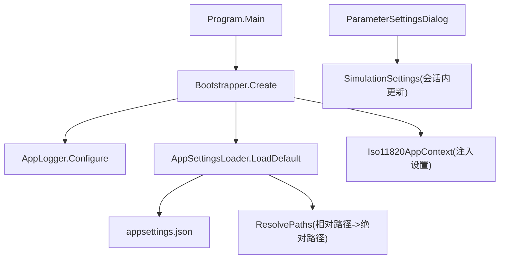
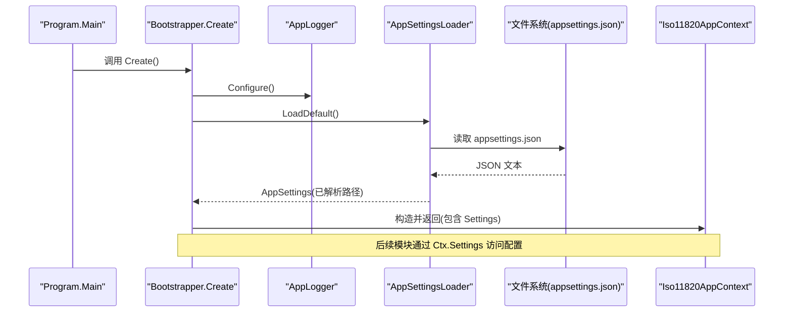
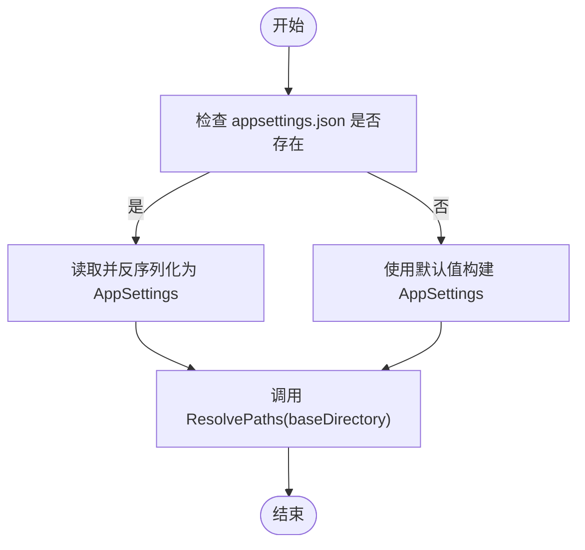
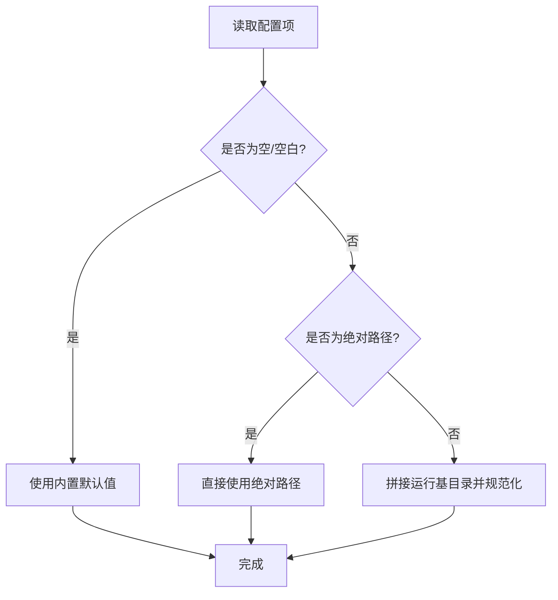
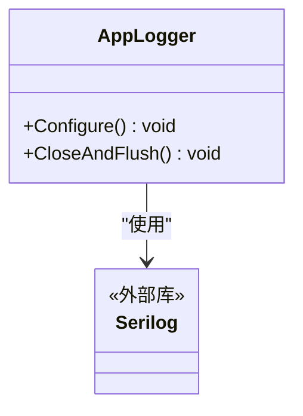
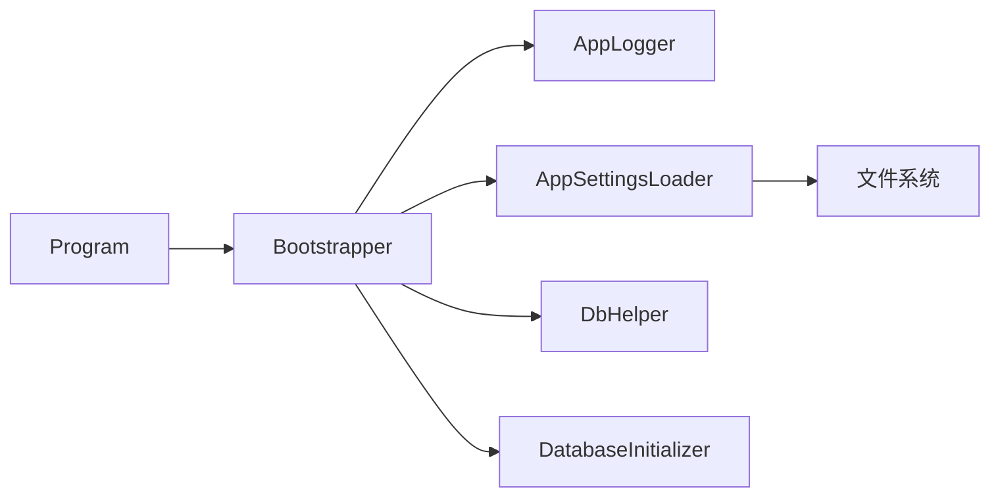

# 配置管理

<cite>
**本文引用的文件**   
- [Program.cs](file://src/ISO11820.App/Program.cs)
- [Bootstrapper.cs](file://src/ISO11820.App/App/Bootstrapper.cs)
- [Iso11820AppContext.cs](file://src/ISO11820.App/App/Iso11820AppContext.cs)
- [appsettings.json](file://src/ISO11820.App/appsettings.json)
- [AppSettings.cs](file://src/ISO11820.App/Config/AppSettings.cs)
- [AppLogger.cs](file://src/ISO11820.App/Config/AppLogger.cs)
- [ParameterSettingsDialog.cs](file://src/ISO11820.App/UI/Dialogs/ParameterSettingsDialog.cs)
- [DatabaseInitializer.cs](file://src/ISO11820.App/Infrastructure/Persistence/DatabaseInitializer.cs)
- [AppSettingsLoaderTests.cs](file://tests/ISO11820.Tests/Features/AppSettingsLoaderTests.cs)
</cite>

## 目录
1. [简介](#简介)
2. [项目结构](#项目结构)
3. [核心组件](#核心组件)
4. [架构总览](#架构总览)
5. [详细组件分析](#详细组件分析)
6. [依赖关系分析](#依赖关系分析)
7. [性能考虑](#性能考虑)
8. [故障排查指南](#故障排查指南)
9. [结论](#结论)
10. [附录](#附录)

## 简介
本文件面向 ISO 11820 系统的配置管理，覆盖以下主题：
- JSON 配置文件格式与字段说明
- 应用设置的加载机制、路径解析、默认值处理
- 日志系统（Serilog）集成、级别与轮转策略
- 运行时配置的动态调整（会话内）、热重载现状与建议
- 配置验证机制与最佳实践
- 安全注意事项
- 配置迁移与版本兼容性建议

## 项目结构
与配置管理直接相关的代码集中在 App 层与 Config 子命名空间，UI 提供参数设置对话框用于会话内动态调整仿真参数。

图示来源
- [Program.cs:1-25](file://src/ISO11820.App/Program.cs#L1-L25)
- [Bootstrapper.cs:1-66](file://src/ISO11820.App/App/Bootstrapper.cs#L1-L66)
- [AppSettings.cs:125-143](file://src/ISO11820.App/Config/AppSettings.cs#L125-L143)
- [appsettings.json:1-29](file://src/ISO11820.App/appsettings.json#L1-L29)
- [ParameterSettingsDialog.cs:1-135](file://src/ISO11820.App/UI/Dialogs/ParameterSettingsDialog.cs#L1-L135)

章节来源
- [Program.cs:1-25](file://src/ISO11820.App/Program.cs#L1-L25)
- [Bootstrapper.cs:1-66](file://src/ISO11820.App/App/Bootstrapper.cs#L1-L66)
- [AppSettings.cs:1-160](file://src/ISO11820.App/Config/AppSettings.cs#L1-L160)
- [appsettings.json:1-29](file://src/ISO11820.App/appsettings.json#L1-L29)
- [ParameterSettingsDialog.cs:1-135](file://src/ISO11820.App/UI/Dialogs/ParameterSettingsDialog.cs#L1-L135)

## 核心组件
- 配置模型与加载器
  - AppSettings 及其子配置类：定义所有可配置项及默认值
  - AppSettingsLoader：从 appsettings.json 反序列化为强类型对象，并执行路径解析
  - AppSettingsPathResolver：将相对路径解析为基于运行基目录的绝对路径
- 日志初始化
  - AppLogger：使用 Serilog 初始化全局日志，配置输出模板、文件大小限制与保留数量
- 启动装配
  - Bootstrapper：统一初始化日志、加载配置、创建数据库与运行时服务，并将配置注入上下文
- UI 动态参数
  - ParameterSettingsDialog：允许在会话内修改仿真参数（不持久化到磁盘）

章节来源
- [AppSettings.cs:1-160](file://src/ISO11820.App/Config/AppSettings.cs#L1-L160)
- [AppLogger.cs:1-32](file://src/ISO11820.App/Config/AppLogger.cs#L1-L32)
- [Bootstrapper.cs:1-66](file://src/ISO11820.App/App/Bootstrapper.cs#L1-L66)
- [ParameterSettingsDialog.cs:1-135](file://src/ISO11820.App/UI/Dialogs/ParameterSettingsDialog.cs#L1-L135)

## 架构总览
下图展示了应用启动时配置与日志的初始化流程，以及配置如何被注入到应用上下文。

图示来源
- [Program.cs:1-25](file://src/ISO11820.App/Program.cs#L1-L25)
- [Bootstrapper.cs:1-66](file://src/ISO11820.App/App/Bootstrapper.cs#L1-L66)
- [AppSettings.cs:125-143](file://src/ISO11820.App/Config/AppSettings.cs#L125-L143)
- [appsettings.json:1-29](file://src/ISO11820.App/appsettings.json#L1-L29)

## 详细组件分析

### 配置模型与加载机制
- 配置根对象 AppSettings 包含多个子配置段：
  - Database：SQLite 数据库路径
  - Simulation：仿真开关与温度相关参数
  - Output：通用输出目录
  - FileStorage：测试数据与样本目录
  - Report：报告输出目录与 PDF 导出开关
  - Hardware：硬件相关常量
- 加载流程
  - 若 appsettings.json 不存在，则使用各属性的默认值
  - 存在时按大小写不敏感反序列化
  - 随后对路径类属性进行“相对路径→绝对路径”的解析
- 路径解析规则
  - 若配置值为空或空白，回退到内置默认路径
  - 若为绝对路径，直接使用；否则拼接运行基目录后规范化

图示来源
- [AppSettings.cs:125-143](file://src/ISO11820.App/Config/AppSettings.cs#L125-L143)
- [AppSettings.cs:146-159](file://src/ISO11820.App/Config/AppSettings.cs#L146-L159)

章节来源
- [AppSettings.cs:1-160](file://src/ISO11820.App/Config/AppSettings.cs#L1-L160)
- [AppSettingsLoaderTests.cs:1-57](file://tests/ISO11820.Tests/Features/AppSettingsLoaderTests.cs#L1-L57)

### JSON 配置文件格式与字段说明
- 文件位置：应用运行目录下 appsettings.json
- 顶层键与含义
  - Database.SqlitePath：SQLite 数据库文件路径（支持相对/绝对）
  - Simulation.EnableSimulation：是否启用仿真
  - Simulation.StartTemperature：仿真起始温度
  - Simulation.HeatingRatePerSecond：升温速率
  - Simulation.TargetTemperature：目标温度
  - Simulation.StableThreshold：稳定阈值
  - Simulation.TempFluctuation：温度波动
  - Output.BaseDirectory：通用输出目录
  - FileStorage.BaseDirectory：文件存储基础目录
  - FileStorage.TestDataDirectory：测试数据目录
  - Report.OutputDirectory：报告输出目录
  - Report.EnablePdfExport：是否启用 PDF 导出
  - Hardware.ConstPower：恒功率
  - Hardware.PidTemperature：PID 控制温度

示例参考
- [appsettings.json:1-29](file://src/ISO11820.App/appsettings.json#L1-L29)

章节来源
- [appsettings.json:1-29](file://src/ISO11820.App/appsettings.json#L1-L29)
- [AppSettings.cs:40-123](file://src/ISO11820.App/Config/AppSettings.cs#L40-L123)

### 环境变量支持与覆盖
- 当前实现未检测到对环境变量的读取或覆盖逻辑
- 如需支持，可在 AppSettingsLoader 中增加环境变量读取并在必要时合并覆盖 JSON 值

章节来源
- [AppSettings.cs:125-143](file://src/ISO11820.App/Config/AppSettings.cs#L125-L143)

### 配置验证与默认值处理
- 默认值
  - 所有配置项均在模型中声明了默认值，确保无配置文件也能运行
- 路径校验
  - 路径解析前会判断是否为空或空白，为空则使用内置默认路径
  - 绝对路径原样使用，相对路径拼接运行基目录后规范化
- 数值输入校验（UI 层）
  - 参数设置对话框对数值型输入进行解析与范围校验，失败时提示用户

图示来源
- [AppSettings.cs:44-54](file://src/ISO11820.App/Config/AppSettings.cs#L44-L54)
- [AppSettings.cs:76-86](file://src/ISO11820.App/Config/AppSettings.cs#L76-L86)
- [AppSettings.cs:94-101](file://src/ISO11820.App/Config/AppSettings.cs#L94-L101)
- [AppSettings.cs:109-116](file://src/ISO11820.App/Config/AppSettings.cs#L109-L116)
- [ParameterSettingsDialog.cs:98-133](file://src/ISO11820.App/UI/Dialogs/ParameterSettingsDialog.cs#L98-L133)

章节来源
- [AppSettings.cs:1-160](file://src/ISO11820.App/Config/AppSettings.cs#L1-L160)
- [ParameterSettingsDialog.cs:1-135](file://src/ISO11820.App/UI/Dialogs/ParameterSettingsDialog.cs#L1-L135)
- [AppSettingsLoaderTests.cs:1-57](file://tests/ISO11820.Tests/Features/AppSettingsLoaderTests.cs#L1-L57)

### 日志系统（Serilog）集成与轮转策略
- 初始化时机
  - 应用启动时由 Bootstrapper 调用 AppLogger.Configure 初始化全局日志
- 输出位置
  - 应用运行目录下的 Logs 文件夹
- 级别与模板
  - 最低级别：Information
  - 输出模板包含时间戳、级别、消息与异常信息
- 轮转策略
  - 按日滚动
  - 单文件大小上限：10 MB
  - 超过上限触发滚动
  - 保留最近 30 个文件
- 关闭与刷新
  - 应用退出时调用 CloseAndFlush 确保日志落盘

图示来源
- [AppLogger.cs:1-32](file://src/ISO11820.App/Config/AppLogger.cs#L1-L32)
- [Bootstrapper.cs:1-66](file://src/ISO11820.App/App/Bootstrapper.cs#L1-L66)

章节来源
- [AppLogger.cs:1-32](file://src/ISO11820.App/Config/AppLogger.cs#L1-L32)
- [Bootstrapper.cs:1-66](file://src/ISO11820.App/App/Bootstrapper.cs#L1-L66)

### 运行时配置的动态调整与热重载
- 会话内动态调整
  - 通过 ParameterSettingsDialog 可修改仿真参数，生成新的 SimulationSettings 实例供运行时使用
  - 该方式仅影响当前会话，不会持久化到 appsettings.json
- 热重载
  - 当前未实现监听 appsettings.json 变更并自动重载的逻辑
  - 建议在需要时引入文件监控与配置重新加载机制，并确保线程安全与幂等性

章节来源
- [ParameterSettingsDialog.cs:1-135](file://src/ISO11820.App/UI/Dialogs/ParameterSettingsDialog.cs#L1-L135)
- [AppSettings.cs:125-143](file://src/ISO11820.App/Config/AppSettings.cs#L125-L143)

### 配置与数据库初始化
- 数据库路径来源于 Database.SqlitePath
- 首次启动时根据配置路径创建必要目录并初始化表结构与种子数据

章节来源
- [Bootstrapper.cs:28-49](file://src/ISO11820.App/App/Bootstrapper.cs#L28-L49)
- [DatabaseInitializer.cs:16-30](file://src/ISO11820.App/Infrastructure/Persistence/DatabaseInitializer.cs#L16-L30)

## 依赖关系分析
- 启动装配依赖
  - Program 调用 Bootstrapper 完成整体装配
  - Bootstrapper 依赖 AppLogger、AppSettingsLoader、DbHelper、DatabaseInitializer 及各功能协调器
- 配置依赖
  - AppSettingsLoader 依赖 System.Text.Json 与文件系统
  - 路径解析依赖 .NET 路径工具方法
- 日志依赖
  - AppLogger 依赖 Serilog 包

图示来源
- [Program.cs:1-25](file://src/ISO11820.App/Program.cs#L1-L25)
- [Bootstrapper.cs:1-66](file://src/ISO11820.App/App/Bootstrapper.cs#L1-L66)
- [AppSettings.cs:125-143](file://src/ISO11820.App/Config/AppSettings.cs#L125-L143)

章节来源
- [Program.cs:1-25](file://src/ISO11820.App/Program.cs#L1-L25)
- [Bootstrapper.cs:1-66](file://src/ISO11820.App/App/Bootstrapper.cs#L1-L66)
- [AppSettings.cs:125-143](file://src/ISO11820.App/Config/AppSettings.cs#L125-L143)

## 性能考虑
- 配置加载
  - 仅在启动时加载一次，开销较小
  - 路径解析为纯字符串操作，成本极低
- 日志写入
  - 按日滚动与大小限制有助于控制磁盘占用
  - 建议在生产环境评估日志级别与输出量，避免高频 I/O 影响主流程

[本节为通用指导，无需源码引用]

## 故障排查指南
- 无法找到 appsettings.json
  - 现象：应用仍可使用默认配置运行
  - 处理：确认配置文件位于应用运行目录
- 路径解析异常
  - 现象：数据库文件或输出目录不在预期位置
  - 处理：检查配置中的路径是否为绝对路径或正确的相对路径
- 日志未生成
  - 现象：Logs 目录不存在或无日志文件
  - 处理：确认应用有写入权限，且 AppLogger.Configure 已被调用
- 数据库初始化失败
  - 现象：启动时报错或表未创建
  - 处理：检查 Database.SqlitePath 指向的目录是否存在并可写

章节来源
- [AppSettings.cs:125-143](file://src/ISO11820.App/Config/AppSettings.cs#L125-L143)
- [AppLogger.cs:1-32](file://src/ISO11820.App/Config/AppLogger.cs#L1-L32)
- [DatabaseInitializer.cs:16-30](file://src/ISO11820.App/Infrastructure/Persistence/DatabaseInitializer.cs#L16-L30)

## 结论
- 当前配置体系以 JSON 为主，具备完善的默认值与路径解析能力
- 日志系统采用 Serilog，具备按日滚动与大小限制的轮转策略
- 支持会话内动态调整仿真参数，但未实现配置热重载与环境变量覆盖
- 建议后续增强：环境变量覆盖、配置热重载、更严格的数值范围校验与配置迁移工具

[本节为总结性内容，无需源码引用]

## 附录

### 配置项清单与默认值
- Database.SqlitePath：默认 Data/ISO11820.db
- Simulation.*：默认启用了仿真，并提供起始温度、升温速率、目标温度、稳定阈值与波动等参数
- Output.BaseDirectory：默认 TestData
- FileStorage.*：默认 TestData 与 TestData/Samples
- Report.*：默认 TestData/Reports，默认启用 PDF 导出
- Hardware.*：默认恒功率与 PID 温度

章节来源
- [appsettings.json:1-29](file://src/ISO11820.App/appsettings.json#L1-L29)
- [AppSettings.cs:40-123](file://src/ISO11820.App/Config/AppSettings.cs#L40-L123)

### 安全与最佳实践
- 路径安全
  - 优先使用绝对路径以避免歧义
  - 避免将敏感路径暴露于共享目录
- 日志安全
  - 避免记录敏感信息（如密码、密钥）
  - 合理设置日志级别与保留数量，防止磁盘占满
- 配置安全
  - 不要将生产环境的敏感配置提交至仓库
  - 如需环境变量覆盖，请确保在部署环境中正确注入

[本节为通用指导，无需源码引用]

### 配置迁移与版本兼容性建议
- 向后兼容
  - 新增配置项应提供默认值，避免破坏旧配置
  - 删除或重命名字段需配合迁移脚本或引导式升级
- 迁移策略
  - 在启动阶段检测配置版本并进行一次性迁移
  - 记录迁移日志以便审计与回溯

[本节为通用指导，无需源码引用]