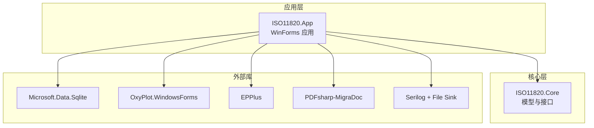
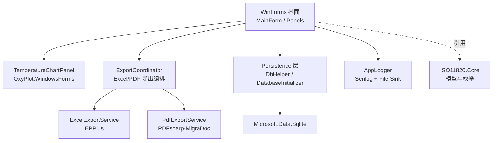
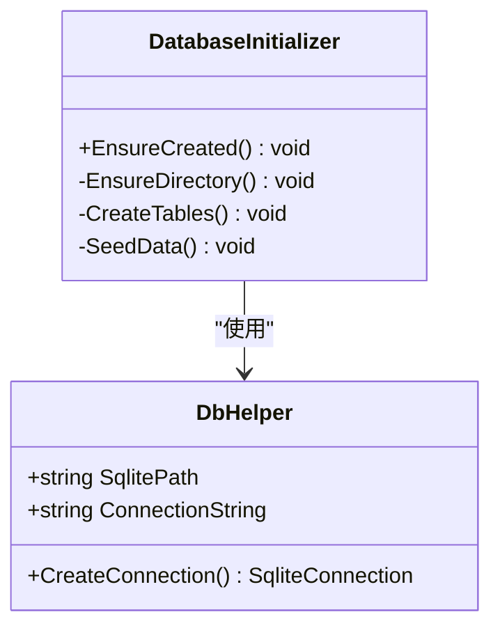
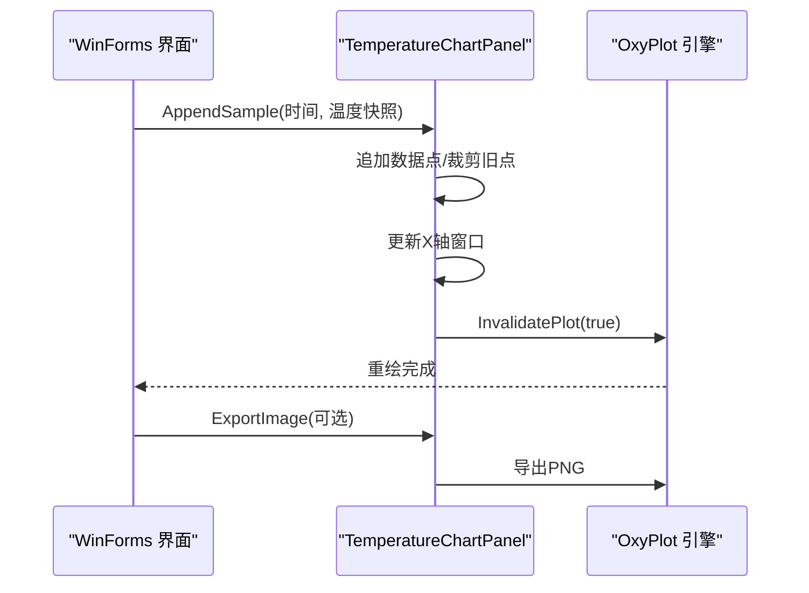
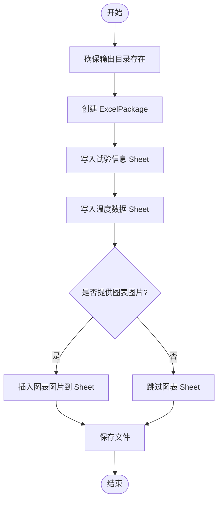
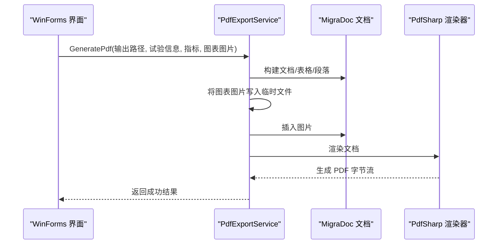
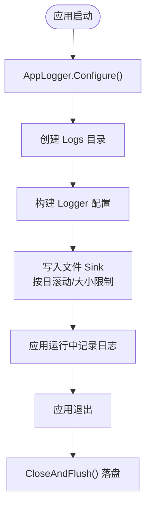
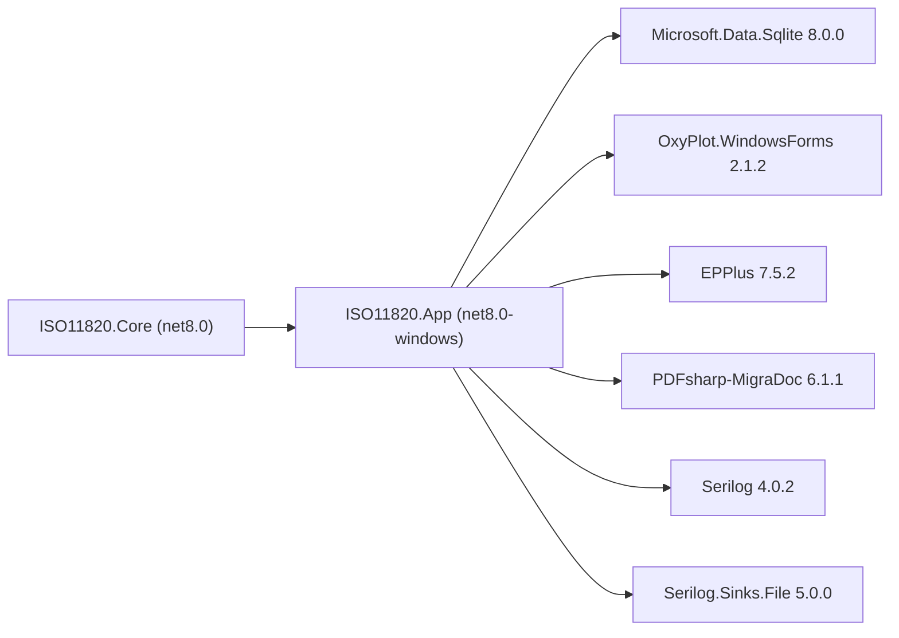

# 技术栈概览

<cite>
**本文引用的文件**   
- [ISO11820.App.csproj](file://src/ISO11820.App/ISO11820.App.csproj)
- [ISO11820.Core.csproj](file://src/ISO11820.Core/ISO11820.Core.csproj)
- [DbHelper.cs](file://src/ISO11820.App/Infrastructure/Persistence/DbHelper.cs)
- [DatabaseInitializer.cs](file://src/ISO11820.App/Infrastructure/Persistence/DatabaseInitializer.cs)
- [TemperatureChartPanel.cs](file://src/ISO11820.App/UI/Chart/TemperatureChartPanel.cs)
- [ExcelExportService.cs](file://src/ISO11820.App/Features/Export/ExcelExportService.cs)
- [PdfExportService.cs](file://src/ISO11820.App/Features/Export/PdfExportService.cs)
- [AppLogger.cs](file://src/ISO11820.App/Config/AppLogger.cs)
</cite>

## 目录
1. [简介](#简介)
2. [项目结构](#项目结构)
3. [核心组件](#核心组件)
4. [架构总览](#架构总览)
5. [详细组件分析](#详细组件分析)
6. [依赖关系分析](#依赖关系分析)
7. [性能与兼容性](#性能与兼容性)
8. [故障排查指南](#故障排查指南)
9. [结论](#结论)

## 简介
本技术栈概览聚焦于 ISO 11820 热失重分析仿真系统的运行时技术选型与实现方式，覆盖 .NET 8、C#、WinForms 以及关键第三方库：Microsoft.Data.Sqlite（嵌入式数据库）、OxyPlot（实时图表绘制）、EPPlus（Excel 导出）、PDFsharp-MigraDoc（PDF 报告生成）和 Serilog（结构化日志）。文档同时说明各库的用途、选型考量、版本兼容性与依赖管理策略，并给出架构图以展示层次关系与交互。

## 项目结构
系统采用分层组织：Core 提供跨平台模型与接口；App 承载 WinForms UI、业务协调器、持久化与导出能力；测试工程用于单元与 UI 自动化验证。应用目标框架为 net8.0-windows，启用 Nullable 与 ImplicitUsings，使用 UseWindowsForms 构建桌面应用。

图示来源
- [ISO11820.App.csproj:1-29](file://src/ISO11820.App/ISO11820.App.csproj#L1-L29)
- [ISO11820.Core.csproj:1-10](file://src/ISO11820.Core/ISO11820.Core.csproj#L1-L10)

章节来源
- [ISO11820.App.csproj:16-22](file://src/ISO11820.App/ISO11820.App.csproj#L16-L22)
- [ISO11820.Core.csproj:3-7](file://src/ISO11820.Core/ISO11820.Core.csproj#L3-L7)

## 核心组件
- 运行环境与语言
  - .NET 8 运行时与 C# 语言特性，启用可空引用类型与隐式 using，提升安全性与可读性。
  - WinForms 作为 UI 框架，便于快速构建 Windows 桌面工具。
- 数据持久化
  - Microsoft.Data.Sqlite 提供零配置、单文件的嵌入式数据库，适合单机实验记录与元数据存储。
- 可视化
  - OxyPlot.WindowsForms 提供高性能、轻量级的 WinForms 图表控件，支持滚动窗口与大量数据点渲染。
- 报表导出
  - EPPlus 用于生成包含多工作表的 Excel 报告，支持表格与图片嵌入。
  - PDFsharp-MigraDoc 用于生成排版良好的 PDF 报告，支持表格、段落与图片嵌入。
- 日志
  - Serilog 配合 File Sink 输出按日滚动、带大小限制的结构化日志，便于问题定位与审计。

章节来源
- [ISO11820.App.csproj:6-14](file://src/ISO11820.App/ISO11820.App.csproj#L6-L14)
- [AppLogger.cs:10-25](file://src/ISO11820.App/Config/AppLogger.cs#L10-L25)
- [DbHelper.cs:1-22](file://src/ISO11820.App/Infrastructure/Persistence/DbHelper.cs#L1-L22)
- [TemperatureChartPanel.cs:1-30](file://src/ISO11820.App/UI/Chart/TemperatureChartPanel.cs#L1-L30)
- [ExcelExportService.cs:1-20](file://src/ISO11820.App/Features/Export/ExcelExportService.cs#L1-L20)
- [PdfExportService.cs:1-20](file://src/ISO11820.App/Features/Export/PdfExportService.cs#L1-L20)

## 架构总览
下图展示了应用层对 Core 的引用关系，以及与外部库的集成位置。UI 通过图表面板驱动 OxyPlot 渲染；导出服务分别调用 EPPlus 与 PDFsharp-MigraDoc；持久化层基于 DbHelper 与 DatabaseInitializer 使用 Sqlite；全局日志由 AppLogger 统一初始化。

图示来源
- [TemperatureChartPanel.cs:1-30](file://src/ISO11820.App/UI/Chart/TemperatureChartPanel.cs#L1-L30)
- [ExcelExportService.cs:1-20](file://src/ISO11820.App/Features/Export/ExcelExportService.cs#L1-L20)
- [PdfExportService.cs:1-20](file://src/ISO11820.App/Features/Export/PdfExportService.cs#L1-L20)
- [DbHelper.cs:1-22](file://src/ISO11820.App/Infrastructure/Persistence/DbHelper.cs#L1-L22)
- [DatabaseInitializer.cs:1-20](file://src/ISO11820.App/Infrastructure/Persistence/DatabaseInitializer.cs#L1-L20)
- [AppLogger.cs:10-25](file://src/ISO11820.App/Config/AppLogger.cs#L10-L25)

## 详细组件分析

### 数据库与持久化（Microsoft.Data.Sqlite）
- 职责
  - 提供连接字符串与连接创建封装；负责数据库文件路径与目录存在性检查；在启动时确保表结构与种子数据就绪。
- 关键点
  - 连接字符串仅指向本地 SQLite 文件，避免额外服务部署。
  - 初始化流程包含目录创建、建表与初始数据填充。
- 复杂度与性能
  - 典型操作为短事务 DDL/DML，SQLite 单进程写入，适合单机小中型数据集。
- 错误处理
  - 连接异常与文件权限问题应在上层捕获并回退到友好提示。

图示来源
- [DbHelper.cs:1-22](file://src/ISO11820.App/Infrastructure/Persistence/DbHelper.cs#L1-L22)
- [DatabaseInitializer.cs:1-49](file://src/ISO11820.App/Infrastructure/Persistence/DatabaseInitializer.cs#L1-L49)

章节来源
- [DbHelper.cs:14-21](file://src/ISO11820.App/Infrastructure/Persistence/DbHelper.cs#L14-L21)
- [DatabaseInitializer.cs:16-21](file://src/ISO11820.App/Infrastructure/Persistence/DatabaseInitializer.cs#L16-L21)

### 实时图表（OxyPlot.WindowsForms）
- 职责
  - 维护 PlotModel 与多条 LineSeries，支持滚动时间窗口与最大点数裁剪，提供 AppendSample/Clear/ExportImage 等 API。
- 关键点
  - 固定 X 轴窗口（秒级），Y 轴温度范围预设，超出窗口后自动平移。
  - 每 N 个点可导出 PNG 用于诊断或嵌入报表。
- 性能
  - 通过 TrimPoints 控制内存占用；InvalidatePlot 触发增量重绘，避免全量重建。
- 错误处理
  - 导出与刷新过程均包裹 try/catch，防止 UI 线程阻塞或崩溃。

图示来源
- [TemperatureChartPanel.cs:119-153](file://src/ISO11820.App/UI/Chart/TemperatureChartPanel.cs#L119-L153)
- [TemperatureChartPanel.cs:285-297](file://src/ISO11820.App/UI/Chart/TemperatureChartPanel.cs#L285-L297)

章节来源
- [TemperatureChartPanel.cs:15-16](file://src/ISO11820.App/UI/Chart/TemperatureChartPanel.cs#L15-L16)
- [TemperatureChartPanel.cs:140-153](file://src/ISO11820.App/UI/Chart/TemperatureChartPanel.cs#L140-L153)

### Excel 导出（EPPlus）
- 职责
  - 生成包含“试验信息”、“温度数据”、“图表”三个工作表的 Excel 文件，支持将图表图像嵌入。
- 关键点
  - 自动创建输出目录；使用 ExcelPackage 进行流式写入；单元格样式与合并区域设置。
- 性能
  - 大数据集建议分批写入与关闭不必要的样式计算。
- 错误处理
  - 整体导出逻辑包裹 try/catch，失败返回统一结果对象。

图示来源
- [ExcelExportService.cs:28-60](file://src/ISO11820.App/Features/Export/ExcelExportService.cs#L28-L60)
- [ExcelExportService.cs:62-88](file://src/ISO11820.App/Features/Export/ExcelExportService.cs#L62-L88)

章节来源
- [ExcelExportService.cs:28-60](file://src/ISO11820.App/Features/Export/ExcelExportService.cs#L28-L60)

### PDF 报告（PDFsharp-MigraDoc）
- 职责
  - 生成包含标题、试验信息表、指标表、判定结论与温度曲线图的 PDF 报告。
- 关键点
  - 使用 MigraDoc 文档对象模型构建页面内容；将图表位图临时保存到磁盘后嵌入；最终通过 PdfDocumentRenderer 渲染并保存。
- 性能
  - 图片以 PNG 中间文件形式写入，注意清理临时文件。
- 错误处理
  - 生成过程包裹 try/catch，失败返回统一结果对象。

图示来源
- [PdfExportService.cs:37-129](file://src/ISO11820.App/Features/Export/PdfExportService.cs#L37-L129)

章节来源
- [PdfExportService.cs:104-129](file://src/ISO11820.App/Features/Export/PdfExportService.cs#L104-L129)

### 结构化日志（Serilog + File Sink）
- 职责
  - 应用启动时初始化全局 Logger，输出到 Logs 目录下的按日滚动的日志文件，限制文件大小与保留天数。
- 关键点
  - 最低日志级别 Information；自定义输出模板包含时间戳、级别、消息与异常。
- 性能
  - 文件 Sink 异步写入，减少主线程开销。
- 错误处理
  - 提供 CloseAndFlush 确保退出时落盘。

图示来源
- [AppLogger.cs:10-25](file://src/ISO11820.App/Config/AppLogger.cs#L10-L25)
- [AppLogger.cs:27-31](file://src/ISO11820.App/Config/AppLogger.cs#L27-L31)

章节来源
- [AppLogger.cs:10-25](file://src/ISO11820.App/Config/AppLogger.cs#L10-L25)

## 依赖关系分析
- 项目引用
  - App 项目引用 Core 项目，形成清晰的边界：UI/业务/导出/持久化位于 App，通用模型与枚举位于 Core。
- NuGet 包
  - Microsoft.Data.Sqlite、OxyPlot.WindowsForms、EPPlus、PDFsharp-MigraDoc、Serilog 及其 File Sink 均在 App 项目中声明。
- 版本与目标框架
  - 应用目标框架 net8.0-windows，Core 为 net8.0，保证跨平台模型复用与 Windows 专属 UI 解耦。

图示来源
- [ISO11820.App.csproj:1-14](file://src/ISO11820.App/ISO11820.App.csproj#L1-L14)
- [ISO11820.Core.csproj:3-7](file://src/ISO11820.Core/ISO11820.Core.csproj#L3-L7)

章节来源
- [ISO11820.App.csproj:1-14](file://src/ISO11820.App/ISO11820.App.csproj#L1-L14)

## 性能与兼容性
- 性能考虑
  - SQLite 单文件存储，适合单机场景；避免频繁长事务，尽量批量写入。
  - OxyPlot 使用滚动窗口与点数裁剪，降低内存与渲染压力。
  - EPPlus/PDFsharp 导出时避免重复样式计算，必要时分块写入。
  - Serilog 文件 Sink 已配置滚动与大小限制，避免日志膨胀影响 IO。
- 社区支持与许可证
  - Microsoft.Data.Sqlite：微软官方维护，活跃度高，MIT 许可。
  - OxyPlot：开源活跃，MIT 许可，WinForms 绑定成熟。
  - EPPlus：商业许可（需关注授权条款），功能强大，适合企业环境。
  - PDFsharp-MigraDoc：开源（AGPL/LGPL 组合），需注意再分发合规。
  - Serilog：MIT 许可，生态完善，插件丰富。
- 版本兼容性与依赖管理
  - 统一使用 .NET 8 SDK 与包版本锁定，App 与 Core 分离目标框架，确保 UI 与核心逻辑解耦。
  - 建议在 CI 中执行 dotnet restore/build/test，固化包版本，避免漂移。

[本节为通用指导，不直接分析具体文件]

## 故障排查指南
- 图表不显示或闪烁
  - 确认 PlotView 尺寸有效且可见；检查 InvalidatePlot/Refresh 调用时机；查看调试日志中的视图状态。
- 导出失败
  - 检查输出目录权限与磁盘空间；确认图片文件可写；查看导出服务的异常信息。
- 数据库初始化失败
  - 检查 SQLite 文件路径是否存在父目录；确认进程对目录有写入权限；查看初始化日志。
- 日志缺失
  - 确认应用启动阶段调用了 AppLogger.Configure；检查 Logs 目录是否存在与可写。

章节来源
- [TemperatureChartPanel.cs:154-184](file://src/ISO11820.App/UI/Chart/TemperatureChartPanel.cs#L154-L184)
- [ExcelExportService.cs:56-60](file://src/ISO11820.App/Features/Export/ExcelExportService.cs#L56-L60)
- [PdfExportService.cs:31-35](file://src/ISO11820.App/Features/Export/PdfExportService.cs#L31-L35)
- [DatabaseInitializer.cs:23-30](file://src/ISO11820.App/Infrastructure/Persistence/DatabaseInitializer.cs#L23-L30)
- [AppLogger.cs:10-25](file://src/ISO11820.App/Config/AppLogger.cs#L10-L25)

## 结论
本项目以 .NET 8 + WinForms 为基础，结合 SQLite、OxyPlot、EPPlus、PDFsharp-MigraDoc 与 Serilog，构建了面向 ISO 11820 热失重仿真的桌面工具。技术选型兼顾了易用性、性能与可维护性：SQLite 简化部署，OxyPlot 满足实时可视化需求，EPPlus/PDFsharp 提供丰富的报表能力，Serilog 保障可观测性。通过清晰的分层与依赖管理，系统在扩展性与稳定性方面具备良好的基础。