# 核心功能特性

<cite>
**本文引用的文件**
- [AuthCoordinator.cs](file://src/ISO11820.App/Features/Auth/AuthCoordinator.cs)
- [TestExecutionCoordinator.cs](file://src/ISO11820.App/Features/TestExecution/TestExecutionCoordinator.cs)
- [ExportCoordinator.cs](file://src/ISO11820.App/Features/Export/ExportCoordinator.cs)
- [CalibrationCoordinator.cs](file://src/ISO11820.App/Features/Calibration/CalibrationCoordinator.cs)
- [HistoryCoordinator.cs](file://src/ISO11820.App/Features/History/HistoryCoordinator.cs)
- [TestController.cs](file://src/ISO11820.App/Runtime/Controller/TestController.cs)
- [DaqWorker.cs](file://src/ISO11820.App/Runtime/Services/DaqWorker.cs)
- [SensorSimulator.cs](file://src/ISO11820.App/Runtime/Services/SensorSimulator.cs)
- [DbHelper.cs](file://src/ISO11820.App/Infrastructure/Persistence/DbHelper.cs)
- [LoginForm.cs](file://src/ISO11820.App/UI/Forms/LoginForm.cs)
- [MainForm.cs](file://src/ISO11820.App/UI/Forms/MainForm.cs)
- [TestRecordCoordinator.cs](file://src/ISO11820.App/Features/TestRecord/TestRecordCoordinator.cs)
- [TestMaster.cs](file://src/ISO11820.App/Infrastructure/Persistence/Models/TestMaster.cs)
- [TestState.cs](file://src/ISO11820.Core/Enums/TestState.cs)
- [RuntimeSnapshot.cs](file://src/ISO11820.App/Shared/Models/RuntimeSnapshot.cs)
</cite>

## 目录
1. [简介](#简介)
2. [项目结构](#项目结构)
3. [核心组件](#核心组件)
4. [架构总览](#架构总览)
5. [详细组件分析](#详细组件分析)
6. [依赖关系分析](#依赖关系分析)
7. [性能考虑](#性能考虑)
8. [故障排查指南](#故障排查指南)
9. [结论](#结论)
10. [附录](#附录)

## 简介
本文件面向ISO 11820热失重分析仿真系统的“核心功能特性”，围绕七大模块进行系统化说明：用户认证与授权、试验管理、温度控制系统、数据采集与存储、设备管理、报告与导出、系统管理。文档提供各模块的主要用途、关键特性、使用场景，展示模块间依赖与数据流向，并给出架构图、时序图与流程图，帮助不同角色（操作员、管理员、研究人员）快速理解与上手。

## 项目结构
系统采用分层与按功能域组织相结合的结构：
- UI层：登录窗体、主界面、图表与对话框
- 运行时控制：状态机控制器、采集定时器、传感器仿真器
- 功能协调器：认证、试验执行、校准、历史记录、导出、试验记录
- 基础设施：数据库连接、CSV读写、模型定义
- 核心库：通用枚举与模型

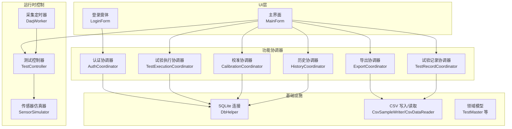

图示来源
- [LoginForm.cs:1-289](file://src/ISO11820.App/UI/Forms/LoginForm.cs#L1-L289)
- [MainForm.cs:1-800](file://src/ISO11820.App/UI/Forms/MainForm.cs#L1-L800)
- [AuthCoordinator.cs:1-62](file://src/ISO11820.App/Features/Auth/AuthCoordinator.cs#L1-L62)
- [TestExecutionCoordinator.cs:1-80](file://src/ISO11820.App/Features/TestExecution/TestExecutionCoordinator.cs#L1-L80)
- [CalibrationCoordinator.cs:1-91](file://src/ISO11820.App/Features/Calibration/CalibrationCoordinator.cs#L1-L91)
- [HistoryCoordinator.cs:1-241](file://src/ISO11820.App/Features/History/HistoryCoordinator.cs#L1-L241)
- [ExportCoordinator.cs:1-229](file://src/ISO11820.App/Features/Export/ExportCoordinator.cs#L1-L229)
- [TestRecordCoordinator.cs:1-159](file://src/ISO11820.App/Features/TestRecord/TestRecordCoordinator.cs#L1-L159)
- [TestController.cs:1-328](file://src/ISO11820.App/Runtime/Controller/TestController.cs#L1-L328)
- [DaqWorker.cs:1-50](file://src/ISO11820.App/Runtime/Services/DaqWorker.cs#L1-L50)
- [SensorSimulator.cs:1-223](file://src/ISO11820.App/Runtime/Services/SensorSimulator.cs#L1-L223)
- [DbHelper.cs:1-22](file://src/ISO11820.App/Infrastructure/Persistence/DbHelper.cs#L1-L22)

章节来源
- [LoginForm.cs:1-289](file://src/ISO11820.App/UI/Forms/LoginForm.cs#L1-L289)
- [MainForm.cs:1-800](file://src/ISO11820.App/UI/Forms/MainForm.cs#L1-L800)

## 核心组件
- 用户认证与授权
  - 主要用途：基于用户名与密码的登录校验，返回角色信息供后续权限控制使用。
  - 关键特性：SHA256 密码哈希比对；通过 SQLite 查询 operators 表获取角色；失败时返回错误消息。
  - 使用场景：系统启动后弹出登录框，选择“管理员/试验员”输入密码完成认证。
  - 相关实现路径：[AuthCoordinator.TryLogin:26-54](file://src/ISO11820.App/Features/Auth/AuthCoordinator.cs#L26-L54)、[LoginForm.OnLoginClick:201-219](file://src/ISO11820.App/UI/Forms/LoginForm.cs#L201-L219)

- 试验管理
  - 主要用途：创建新试验会话、准备运行环境、保存试验元数据到数据库。
  - 关键特性：将控制器复位至空闲；写入 testmaster 与 productmaster；支持参数化试验信息。
  - 使用场景：点击“新建试验”，填写样品编号、规格、尺寸、重量等信息后保存。
  - 相关实现路径：[TestExecutionCoordinator.PrepareNewTest:19-25](file://src/ISO11820.App/Features/TestExecution/TestExecutionCoordinator.cs#L19-L25)、[SaveTestToDb:30-55](file://src/ISO11820.App/Features/TestExecution/TestExecutionCoordinator.cs#L30-L55)、[SaveProductToDb:60-78](file://src/ISO11820.App/Features/TestExecution/TestExecutionCoordinator.cs#L60-L78)

- 温度控制系统
  - 主要用途：模拟升温、稳定、记录阶段温度变化，驱动状态机流转与自动终止策略。
  - 关键特性：多通道温度仿真；稳定阈值判定；PID输出采样；温漂线性回归计算；自动终止检查点。
  - 使用场景：开始升温后进入“升温中”，达到目标温度且稳定后进入“就绪”，开始记录后进入“记录中”，满足条件或到达上限时间自动结束。
  - 相关实现路径：[TestController.Tick:171-204](file://src/ISO11820.App/Runtime/Controller/TestController.cs#L171-L204)、[EvaluateAutoTransitions:248-267](file://src/ISO11820.App/Runtime/Controller/TestController.cs#L248-L267)、[CheckAutoTermination:274-302](file://src/ISO11820.App/Runtime/Controller/TestController.cs#L274-L302)、[SensorSimulator.Update:46-79](file://src/ISO11820.App/Runtime/Services/SensorSimulator.cs#L46-L79)

- 数据采集与存储
  - 主要用途：周期性采集仿真温度数据，生成传感器数据记录，并在试验完成后落盘为 CSV。
  - 关键特性：800ms 定时触发；缓冲最近数据；完成态一次性写入 CSV；导出服务可读取 CSV 生成 Excel/PDF。
  - 使用场景：试验完成后自动保存 sensor_data.csv；在“试验记录”中导出 Excel/PDF 报告。
  - 相关实现路径：[DaqWorker.OnTick:45-48](file://src/ISO11820.App/Runtime/Services/DaqWorker.cs#L45-L48)、[TestController.AccumulateSensorData:230-246](file://src/ISO11820.App/Runtime/Controller/TestController.cs#L230-L246)、[ExportCoordinator.SaveSensorDataToCsv:43-52](file://src/ISO11820.App/Features/Export/ExportCoordinator.cs#L43-L52)

- 设备管理（校准）
  - 主要用途：维护传感器校准记录，支持按传感器筛选与详情查询。
  - 关键特性：插入校准结果 JSON；查询全部或指定传感器记录；按日期倒序排列。
  - 使用场景：设备维护人员录入校准结果，查看历史校准轨迹。
  - 相关实现路径：[CalibrationCoordinator.SaveRecord:16-31](file://src/ISO11820.App/Features/Calibration/CalibrationCoordinator.cs#L16-L31)、[QueryRecords:33-64](file://src/ISO11820.App/Features/Calibration/CalibrationCoordinator.cs#L33-L64)

- 报告与导出
  - 主要用途：从 CSV 导出数据为 Excel 或 PDF，附带图表图片与指标判定。
  - 关键特性：统一导出入口；失败返回结构化结果；PDF 包含合格性判定（ΔTf、质量损失率、火焰持续时间）。
  - 使用场景：在“试验记录”中选择导出格式，生成报告用于归档或汇报。
  - 相关实现路径：[ExportCoordinator.ExportToExcel:54-85](file://src/ISO11820.App/Features/Export/ExportCoordinator.cs#L54-L85)、[ExportToPdf:87-119](file://src/ISO11820.App/Features/Export/ExportCoordinator.cs#L87-L119)、[TestMetrics.Compute:222-227](file://src/ISO11820.App/Features/Export/ExportCoordinator.cs#L222-L227)

- 系统管理（历史与查询）
  - 主要用途：查询试验历史、产品清单、操作员列表；支持组合条件筛选与 Excel 导出。
  - 关键特性：模糊匹配样品编号；按操作员与日期范围过滤；Excel 报表列头与格式化。
  - 使用场景：管理员或研究人员检索特定时间段内的试验结果，批量导出分析。
  - 相关实现路径：[HistoryCoordinator.QueryTests:103-157](file://src/ISO11820.App/Features/History/HistoryCoordinator.cs#L103-L157)、[ExportToExcel:162-212](file://src/ISO11820.App/Features/History/HistoryCoordinator.cs#L162-L212)

章节来源
- [AuthCoordinator.cs:1-62](file://src/ISO11820.App/Features/Auth/AuthCoordinator.cs#L1-L62)
- [TestExecutionCoordinator.cs:1-80](file://src/ISO11820.App/Features/TestExecution/TestExecutionCoordinator.cs#L1-L80)
- [TestController.cs:1-328](file://src/ISO11820.App/Runtime/Controller/TestController.cs#L1-L328)
- [SensorSimulator.cs:1-223](file://src/ISO11820.App/Runtime/Services/SensorSimulator.cs#L1-L223)
- [DaqWorker.cs:1-50](file://src/ISO11820.App/Runtime/Services/DaqWorker.cs#L1-L50)
- [ExportCoordinator.cs:1-229](file://src/ISO11820.App/Features/Export/ExportCoordinator.cs#L1-L229)
- [CalibrationCoordinator.cs:1-91](file://src/ISO11820.App/Features/Calibration/CalibrationCoordinator.cs#L1-L91)
- [HistoryCoordinator.cs:1-241](file://src/ISO11820.App/Features/History/HistoryCoordinator.cs#L1-L241)

## 架构总览
下图展示了从登录到试验执行、数据采集、导出与历史查询的整体协作关系。

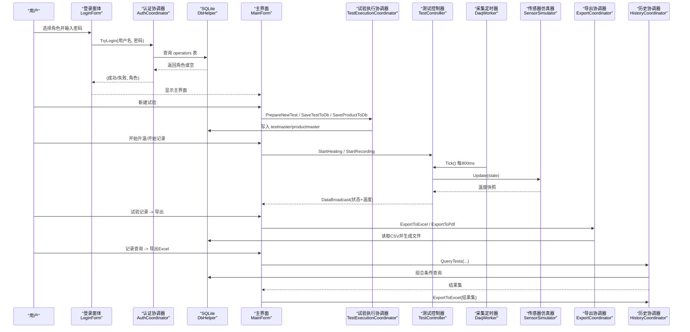

图示来源
- [LoginForm.cs:1-289](file://src/ISO11820.App/UI/Forms/LoginForm.cs#L1-L289)
- [AuthCoordinator.cs:1-62](file://src/ISO11820.App/Features/Auth/AuthCoordinator.cs#L1-L62)
- [DbHelper.cs:1-22](file://src/ISO11820.App/Infrastructure/Persistence/DbHelper.cs#L1-L22)
- [MainForm.cs:1-800](file://src/ISO11820.App/UI/Forms/MainForm.cs#L1-L800)
- [TestExecutionCoordinator.cs:1-80](file://src/ISO11820.App/Features/TestExecution/TestExecutionCoordinator.cs#L1-L80)
- [TestController.cs:1-328](file://src/ISO11820.App/Runtime/Controller/TestController.cs#L1-L328)
- [DaqWorker.cs:1-50](file://src/ISO11820.App/Runtime/Services/DaqWorker.cs#L1-L50)
- [SensorSimulator.cs:1-223](file://src/ISO11820.App/Runtime/Services/SensorSimulator.cs#L1-L223)
- [ExportCoordinator.cs:1-229](file://src/ISO11820.App/Features/Export/ExportCoordinator.cs#L1-L229)
- [HistoryCoordinator.cs:1-241](file://src/ISO11820.App/Features/History/HistoryCoordinator.cs#L1-L241)

## 详细组件分析

### 用户认证与授权
- 主要用途：验证登录凭据并返回角色，支撑后续界面与操作权限。
- 关键特性：
  - 密码以 SHA256 哈希后与数据库存储值比对。
  - 返回三元组（成功标志、错误消息、角色），便于上层处理。
- 使用场景：
  - 管理员：配置系统参数、查看全量历史、导出汇总报表。
  - 试验员：执行试验、录入记录、导出单份报告。
- 交互流程（类图）：

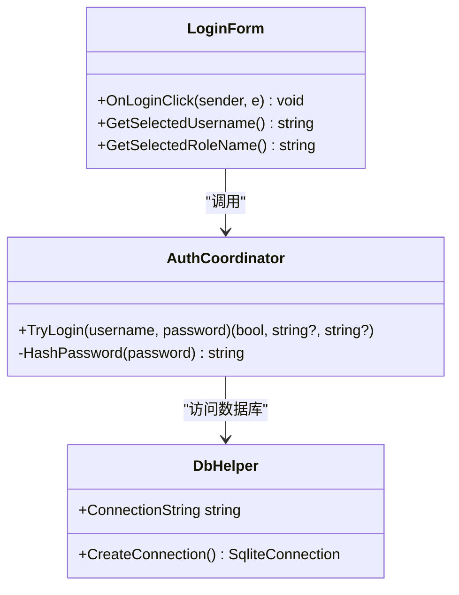

图示来源
- [AuthCoordinator.cs:1-62](file://src/ISO11820.App/Features/Auth/AuthCoordinator.cs#L1-L62)
- [LoginForm.cs:1-289](file://src/ISO11820.App/UI/Forms/LoginForm.cs#L1-L289)
- [DbHelper.cs:1-22](file://src/ISO11820.App/Infrastructure/Persistence/DbHelper.cs#L1-L22)

章节来源
- [AuthCoordinator.cs:1-62](file://src/ISO11820.App/Features/Auth/AuthCoordinator.cs#L1-L62)
- [LoginForm.cs:1-289](file://src/ISO11820.App/UI/Forms/LoginForm.cs#L1-L289)

### 试验管理
- 主要用途：初始化试验会话、保存试验与产品信息。
- 关键特性：
  - 若控制器非空闲则先复位。
  - 写入 testmaster 与 productmaster，字段覆盖样品、规格、尺寸、重量与环境信息。
- 使用场景：
  - 新建试验前清空图表与缓存，确保状态一致。
- 交互流程（序列图）：

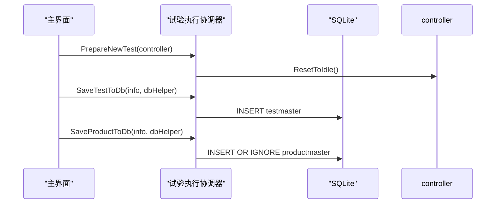

图示来源
- [TestExecutionCoordinator.cs:1-80](file://src/ISO11820.App/Features/TestExecution/TestExecutionCoordinator.cs#L1-L80)
- [TestController.cs:145-156](file://src/ISO11820.App/Runtime/Controller/TestController.cs#L145-L156)

章节来源
- [TestExecutionCoordinator.cs:1-80](file://src/ISO11820.App/Features/TestExecution/TestExecutionCoordinator.cs#L1-L80)
- [TestController.cs:145-156](file://src/ISO11820.App/Runtime/Controller/TestController.cs#L145-L156)

### 温度控制系统
- 主要用途：驱动仿真温度曲线与状态机流转，实现自动终止策略。
- 关键特性：
  - 状态：空闲→升温中→就绪→记录中→已完成。
  - 稳定判定：目标温度±阈值持续若干周期。
  - 自动终止：固定时间点检查温漂≤阈值提前结束，或60分钟无条件结束。
  - PID输出：在就绪阶段采样平均作为恒定功率参考。
- 使用场景：
  - 操作员点击“开始升温/开始记录”，系统自动推进状态并广播实时数据。
- 算法流程（流程图）：

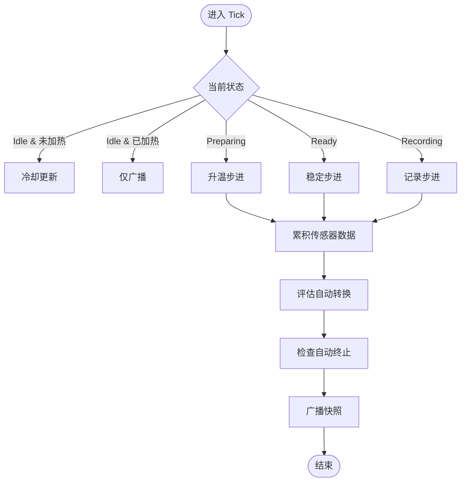

图示来源
- [TestController.cs:171-204](file://src/ISO11820.App/Runtime/Controller/TestController.cs#L171-L204)
- [TestController.cs:248-302](file://src/ISO11820.App/Runtime/Controller/TestController.cs#L248-L302)
- [SensorSimulator.cs:46-79](file://src/ISO11820.App/Runtime/Services/SensorSimulator.cs#L46-L79)

章节来源
- [TestController.cs:171-204](file://src/ISO11820.App/Runtime/Controller/TestController.cs#L171-L204)
- [TestController.cs:248-302](file://src/ISO11820.App/Runtime/Controller/TestController.cs#L248-L302)
- [SensorSimulator.cs:46-79](file://src/ISO11820.App/Runtime/Services/SensorSimulator.cs#L46-L79)
- [TestState.cs:1-11](file://src/ISO11820.Core/Enums/TestState.cs#L1-L11)

### 数据采集与存储
- 主要用途：周期性采集温度数据，试验完成后持久化为 CSV，供导出与分析。
- 关键特性：
  - 800ms 定时器驱动 Tick，控制器累积传感器数据记录。
  - 完成态一次性写入 CSV；导出服务读取 CSV 生成 Excel/PDF。
- 使用场景：
  - 试验结束后自动生成 sensor_data.csv；在“试验记录”中导出报告。
- 交互流程（序列图）：

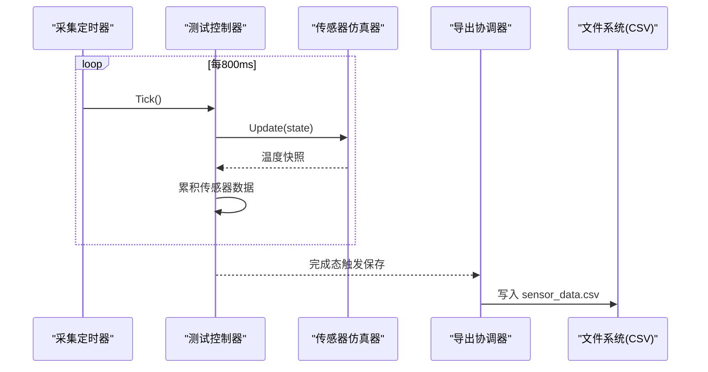

图示来源
- [DaqWorker.cs:45-48](file://src/ISO11820.App/Runtime/Services/DaqWorker.cs#L45-L48)
- [TestController.cs:230-246](file://src/ISO11820.App/Runtime/Controller/TestController.cs#L230-L246)
- [ExportCoordinator.cs:43-52](file://src/ISO11820.App/Features/Export/ExportCoordinator.cs#L43-L52)

章节来源
- [DaqWorker.cs:1-50](file://src/ISO11820.App/Runtime/Services/DaqWorker.cs#L1-L50)
- [TestController.cs:230-246](file://src/ISO11820.App/Runtime/Controller/TestController.cs#L230-L246)
- [ExportCoordinator.cs:43-52](file://src/ISO11820.App/Features/Export/ExportCoordinator.cs#L43-L52)

### 设备管理（校准）
- 主要用途：记录与维护传感器校准信息，支持查询与审计。
- 关键特性：
  - 插入校准结果 JSON；按传感器 ID 筛选；按日期倒序。
- 使用场景：
  - 设备维护人员录入校准结果，查看历史趋势。
- 交互流程（类图）：

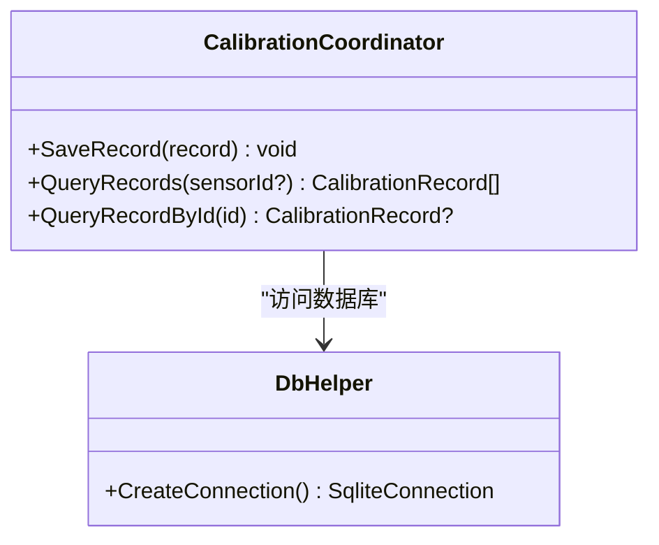

图示来源
- [CalibrationCoordinator.cs:1-91](file://src/ISO11820.App/Features/Calibration/CalibrationCoordinator.cs#L1-L91)
- [DbHelper.cs:1-22](file://src/ISO11820.App/Infrastructure/Persistence/DbHelper.cs#L1-L22)

章节来源
- [CalibrationCoordinator.cs:1-91](file://src/ISO11820.App/Features/Calibration/CalibrationCoordinator.cs#L1-L91)

### 报告与导出
- 主要用途：将试验数据与图表导出为 Excel/PDF，并提供合格性判定。
- 关键特性：
  - 统一导出请求对象；失败返回结构化结果；PDF 包含指标与判定文本。
- 使用场景：
  - 在“试验记录”中选择导出格式，生成报告用于归档或汇报。
- 交互流程（序列图）：

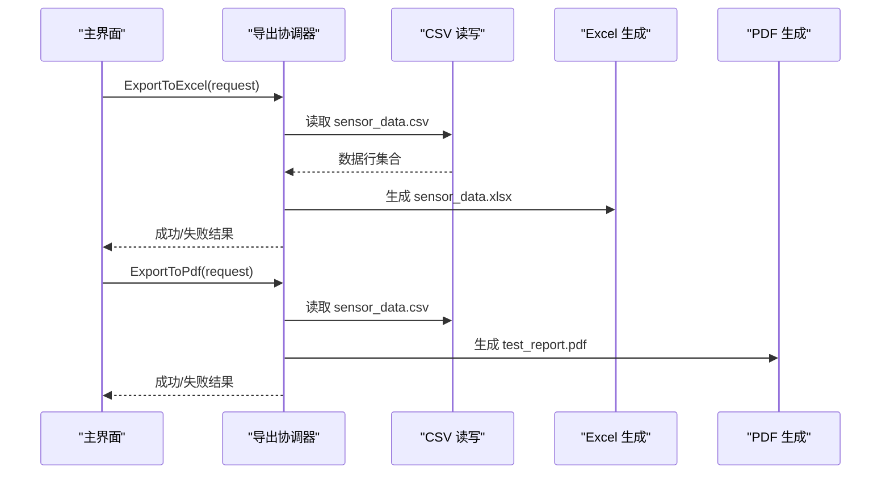

图示来源
- [ExportCoordinator.cs:54-119](file://src/ISO11820.App/Features/Export/ExportCoordinator.cs#L54-L119)
- [ExportCoordinator.cs:222-227](file://src/ISO11820.App/Features/Export/ExportCoordinator.cs#L222-L227)

章节来源
- [ExportCoordinator.cs:1-229](file://src/ISO11820.App/Features/Export/ExportCoordinator.cs#L1-L229)

### 系统管理（历史与查询）
- 主要用途：查询试验历史、产品清单、操作员列表；支持组合条件筛选与 Excel 导出。
- 关键特性：
  - 模糊匹配样品编号；按操作员与日期范围过滤；Excel 列头与格式化。
- 使用场景：
  - 管理员或研究人员检索特定时间段内的试验结果，批量导出分析。
- 交互流程（序列图）：

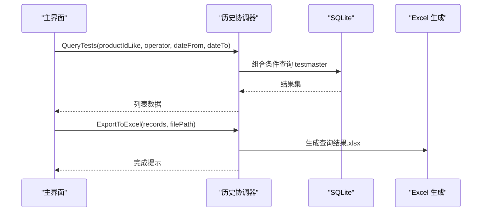

图示来源
- [HistoryCoordinator.cs:103-157](file://src/ISO11820.App/Features/History/HistoryCoordinator.cs#L103-L157)
- [HistoryCoordinator.cs:162-212](file://src/ISO11820.App/Features/History/HistoryCoordinator.cs#L162-L212)

章节来源
- [HistoryCoordinator.cs:1-241](file://src/ISO11820.App/Features/History/HistoryCoordinator.cs#L1-L241)

### 试验记录（录入与保存）
- 主要用途：录入试验现象、质量评估与后重等结果，防止重复提交，保证一致性。
- 关键特性：
  - 待保存队列与已保存标记；幂等保护；校验规则（必填项、数值有效性）。
- 使用场景：
  - 试验完成后录入结果，确认后持久化，避免重复保存。
- 交互流程（类图）：

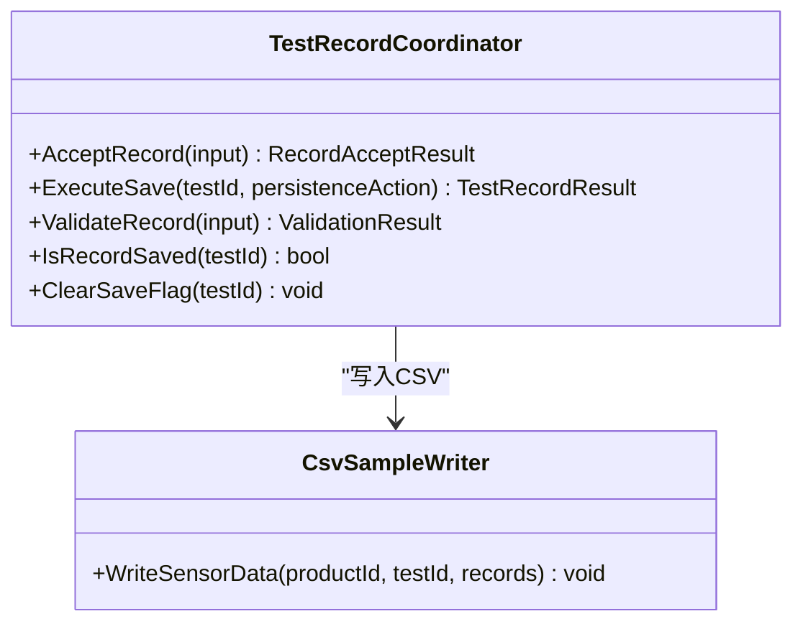

图示来源
- [TestRecordCoordinator.cs:1-159](file://src/ISO11820.App/Features/TestRecord/TestRecordCoordinator.cs#L1-L159)

章节来源
- [TestRecordCoordinator.cs:1-159](file://src/ISO11820.App/Features/TestRecord/TestRecordCoordinator.cs#L1-L159)

## 依赖关系分析
- 组件耦合与内聚
  - UI 层仅负责交互与事件转发，不直接访问数据库或文件路径。
  - 协调器封装业务逻辑与外部依赖（数据库、文件），提高内聚性。
  - 运行时控制与仿真器解耦，通过快照与事件广播通信。
- 直接与间接依赖
  - AuthCoordinator → DbHelper → SQLite
  - TestExecutionCoordinator → DbHelper → SQLite
  - ExportCoordinator → CsvSampleWriter/CsvDataReader → 文件系统
  - HistoryCoordinator → DbHelper → SQLite
  - TestController → SensorSimulator → MathNet.Numerics（温漂回归）
- 潜在循环依赖
  - 当前未发现循环引用；UI 与运行时通过上下文对象与事件解耦。
- 外部依赖与集成点
  - SQLite 数据库（Microsoft.Data.Sqlite）
  - EPPlus（Excel 生成）
  - MathNet.Numerics（线性回归）
- 接口契约与实现细节
  - RuntimeSnapshot 作为广播载体，包含状态、温度、消息、计时。
  - ExportRequest/ExportResult 统一导出接口契约。

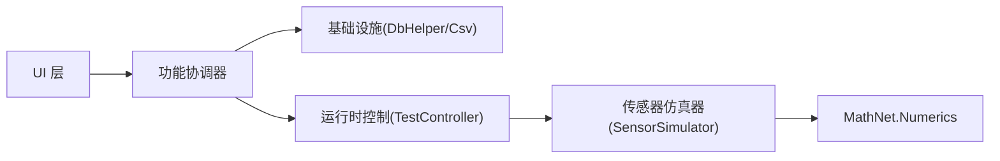

图示来源
- [RuntimeSnapshot.cs:1-12](file://src/ISO11820.App/Shared/Models/RuntimeSnapshot.cs#L1-L12)
- [ExportCoordinator.cs:157-186](file://src/ISO11820.App/Features/Export/ExportCoordinator.cs#L157-L186)
- [SensorSimulator.cs:84-97](file://src/ISO11820.App/Runtime/Services/SensorSimulator.cs#L84-L97)

章节来源
- [RuntimeSnapshot.cs:1-12](file://src/ISO11820.App/Shared/Models/RuntimeSnapshot.cs#L1-L12)
- [ExportCoordinator.cs:157-186](file://src/ISO11820.App/Features/Export/ExportCoordinator.cs#L157-L186)
- [SensorSimulator.cs:84-97](file://src/ISO11820.App/Runtime/Services/SensorSimulator.cs#L84-L97)

## 性能考虑
- 采集频率与 CPU 占用
  - 800ms 定时触发，平衡实时性与资源消耗；如需更高刷新率需评估 UI 渲染压力。
- 数据缓冲与内存
  - 控制器内部缓冲传感器数据，完成态一次性落盘，减少频繁 I/O。
- 温漂计算复杂度
  - 滑动窗口线性回归，样本数有限（默认约20个），计算开销低。
- 导出性能
  - Excel/PDF 生成可能耗时，建议在后台线程执行以避免阻塞 UI。
- 数据库访问
  - 短连接模式，每次查询创建连接；在高并发下可考虑连接池优化。

## 故障排查指南
- 登录失败
  - 检查 operators 表中用户名与哈希密码是否匹配；确认密码哈希算法一致。
  - 参考路径：[AuthCoordinator.TryLogin:26-54](file://src/ISO11820.App/Features/Auth/AuthCoordinator.cs#L26-L54)
- 试验无法开始
  - 确认控制器状态是否为空闲；若处于其他状态，先复位。
  - 参考路径：[TestExecutionCoordinator.PrepareNewTest:19-25](file://src/ISO11820.App/Features/TestExecution/TestExecutionCoordinator.cs#L19-L25)、[TestController.ResetToIdle:145-156](file://src/ISO11820.App/Runtime/Controller/TestController.cs#L145-L156)
- 温度曲线不更新
  - 检查 DaqWorker 是否启动；确认 DataBroadcast 订阅是否生效。
  - 参考路径：[DaqWorker.Start:23-30](file://src/ISO11820.App/Runtime/Services/DaqWorker.cs#L23-L30)、[MainForm.OnShown:522-525](file://src/ISO11820.App/UI/Forms/MainForm.cs#L522-L525)
- 导出失败
  - 检查 CSV 文件是否存在且非空；确认导出路径权限。
  - 参考路径：[ExportCoordinator.ExportToExcel:54-85](file://src/ISO11820.App/Features/Export/ExportCoordinator.cs#L54-L85)
- 历史查询无结果
  - 核对筛选条件；确认 testmaster 表结构与映射正确。
  - 参考路径：[HistoryCoordinator.QueryTests:103-157](file://src/ISO11820.App/Features/History/HistoryCoordinator.cs#L103-L157)

章节来源
- [AuthCoordinator.cs:26-54](file://src/ISO11820.App/Features/Auth/AuthCoordinator.cs#L26-L54)
- [TestExecutionCoordinator.cs:19-25](file://src/ISO11820.App/Features/TestExecution/TestExecutionCoordinator.cs#L19-L25)
- [TestController.cs:145-156](file://src/ISO11820.App/Runtime/Controller/TestController.cs#L145-L156)
- [DaqWorker.cs:23-30](file://src/ISO11820.App/Runtime/Services/DaqWorker.cs#L23-L30)
- [MainForm.cs:522-525](file://src/ISO11820.App/UI/Forms/MainForm.cs#L522-L525)
- [ExportCoordinator.cs:54-85](file://src/ISO11820.App/Features/Export/ExportCoordinator.cs#L54-L85)
- [HistoryCoordinator.cs:103-157](file://src/ISO11820.App/Features/History/HistoryCoordinator.cs#L103-L157)

## 结论
本系统以协调器为核心，将 UI、运行时控制与基础设施清晰分层，实现了 ISO 11820 热失重仿真的完整闭环：认证登录、试验管理、温度控制、数据采集、设备校准、报告导出与历史查询。通过事件驱动的快照广播与统一的导出接口，系统在易用性与可扩展性之间取得良好平衡。建议在生产环境中引入后台任务与连接池优化，进一步提升稳定性与性能。

## 附录
- 角色关注点
  - 操作员：新建试验、开始/停止升温与记录、查看实时温度与消息、导出单份报告。
  - 管理员：查看全量历史、组合条件筛选、批量导出、设备校准记录管理。
  - 研究人员：深度分析历史数据、导出 Excel 进行二次统计、关注温漂与自动终止策略。
- 实际使用示例与操作流程概述
  - 登录：打开系统 → 选择角色 → 输入密码 → 登录成功进入主界面。
    - 参考路径：[LoginForm.OnLoginClick:201-219](file://src/ISO11820.App/UI/Forms/LoginForm.cs#L201-L219)
  - 新建试验：点击“新建试验” → 填写信息 → 保存至数据库。
    - 参考路径：[MainForm.OnNewTestClick:628-660](file://src/ISO11820.App/UI/Forms/MainForm.cs#L628-L660)、[TestExecutionCoordinator.SaveTestToDb:30-55](file://src/ISO11820.App/Features/TestExecution/TestExecutionCoordinator.cs#L30-L55)
  - 开始试验：点击“开始升温” → 等待“就绪” → “开始记录” → 自动或手动结束。
    - 参考路径：[TestController.StartHeating:57-72](file://src/ISO11820.App/Runtime/Controller/TestController.cs#L57-L72)、[StartRecording:91-110](file://src/ISO11820.App/Runtime/Controller/TestController.cs#L91-L110)
  - 导出报告：点击“试验记录” → 选择导出格式 → 生成 Excel/PDF。
    - 参考路径：[ExportCoordinator.ExportToExcel:54-85](file://src/ISO11820.App/Features/Export/ExportCoordinator.cs#L54-L85)、[ExportToPdf:87-119](file://src/ISO11820.App/Features/Export/ExportCoordinator.cs#L87-L119)
  - 历史查询：切换到“记录查询” → 设置筛选条件 → 查询并导出 Excel。
    - 参考路径：[HistoryCoordinator.QueryTests:103-157](file://src/ISO11820.App/Features/History/HistoryCoordinator.cs#L103-L157)、[ExportToExcel:162-212](file://src/ISO11820.App/Features/History/HistoryCoordinator.cs#L162-L212)

章节来源
- [MainForm.cs:628-660](file://src/ISO11820.App/UI/Forms/MainForm.cs#L628-L660)
- [TestExecutionCoordinator.cs:30-55](file://src/ISO11820.App/Features/TestExecution/TestExecutionCoordinator.cs#L30-L55)
- [TestController.cs:57-110](file://src/ISO11820.App/Runtime/Controller/TestController.cs#L57-L110)
- [ExportCoordinator.cs:54-119](file://src/ISO11820.App/Features/Export/ExportCoordinator.cs#L54-L119)
- [HistoryCoordinator.cs:103-212](file://src/ISO11820.App/Features/History/HistoryCoordinator.cs#L103-L212)