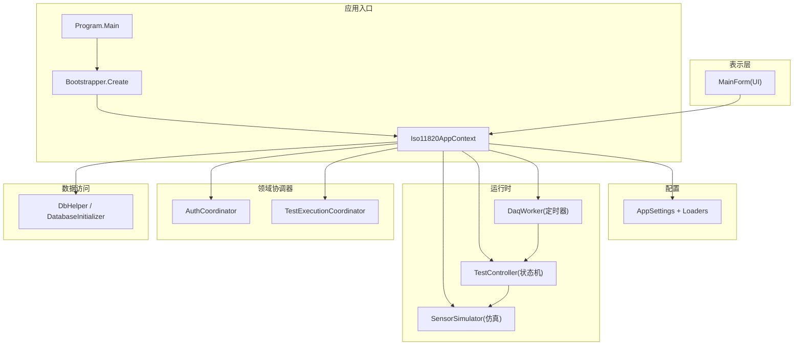
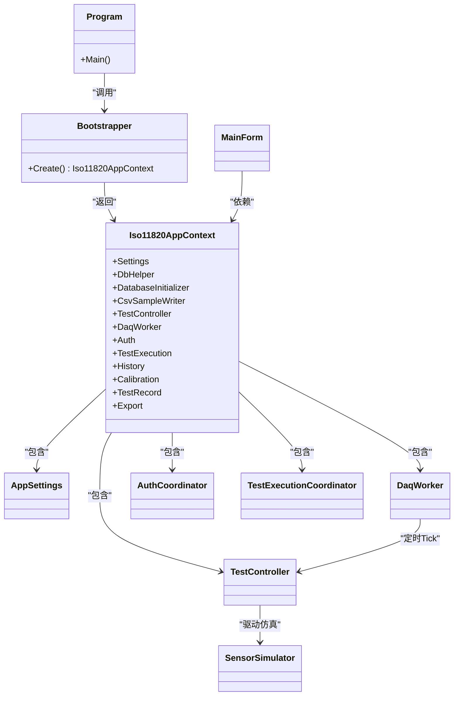
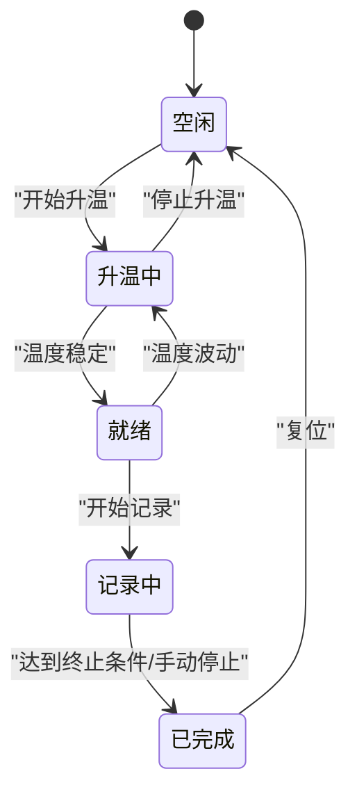
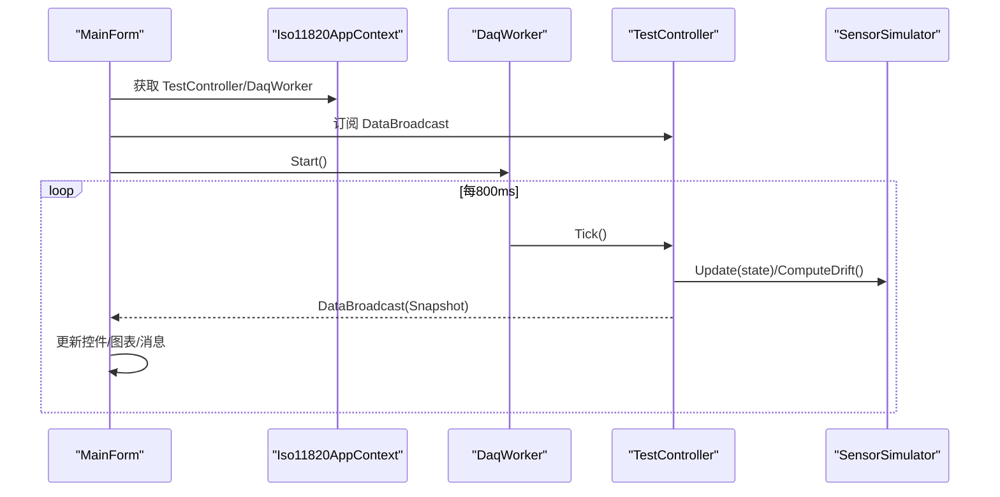
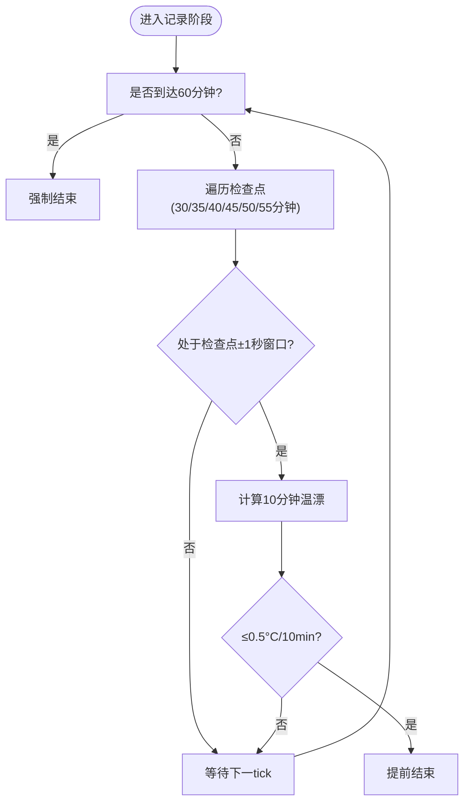
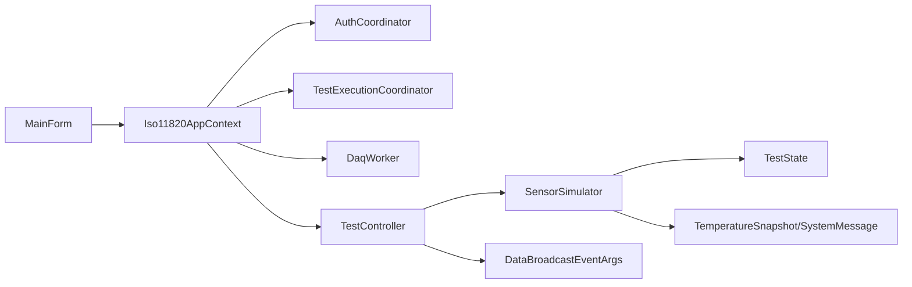

# 系统架构概览

<cite>
**本文引用的文件**   
- [Program.cs](file://src/ISO11820.App/Program.cs)
- [Bootstrapper.cs](file://src/ISO11820.App/App/Bootstrapper.cs)
- [Iso11820AppContext.cs](file://src/ISO11820.App/App/Iso11820AppContext.cs)
- [AppSettings.cs](file://src/ISO11820.App/Config/AppSettings.cs)
- [AuthCoordinator.cs](file://src/ISO11820.App/Features/Auth/AuthCoordinator.cs)
- [TestExecutionCoordinator.cs](file://src/ISO11820.App/Features/TestExecution/TestExecutionCoordinator.cs)
- [TestController.cs](file://src/ISO11820.App/Runtime/Controller/TestController.cs)
- [DaqWorker.cs](file://src/ISO11820.App/Runtime/Services/DaqWorker.cs)
- [SensorSimulator.cs](file://src/ISO11820.App/Runtime/Services/SensorSimulator.cs)
- [DataBroadcastEventArgs.cs](file://src/ISO11820.App/Shared/Events/DataBroadcastEventArgs.cs)
- [MainForm.cs](file://src/ISO11820.App/UI/Forms/MainForm.cs)
- [TestState.cs](file://src/ISO11820.Core/Enums/TestState.cs)
- [IRuntimeClock.cs](file://src/ISO11820.Core/Contracts/IRuntimeClock.cs)
- [SystemMessage.cs](file://src/ISO11820.Core/Models/SystemMessage.cs)
- [TemperatureSnapshot.cs](file://src/ISO11820.Core/Models/TemperatureSnapshot.cs)
</cite>

## 目录
1. [简介](#简介)
2. [项目结构](#项目结构)
3. [核心组件](#核心组件)
4. [架构总览](#架构总览)
5. [详细组件分析](#详细组件分析)
6. [依赖关系分析](#依赖关系分析)
7. [性能与运行时特性](#性能与运行时特性)
8. [故障排查指南](#故障排查指南)
9. [结论](#结论)
10. [附录：扩展点与集成机制](#附录扩展点与集成机制)

## 简介
本概览面向ISO 11820热失重分析仿真系统的整体架构，聚焦分层架构（表示层、业务逻辑层、数据访问层）、依赖注入与协调器模式的应用，以及状态机、观察者、工厂等核心设计模式在系统中的落地方式。文档同时给出架构图、关键流程时序图与流程图，说明模块化组织原则、扩展点与集成机制，并补充部署与运行环境要求，为后续功能扩展提供指导。

## 项目结构
系统采用按“应用层/核心库”划分的解决方案结构，UI与应用启动位于 ISO11820.App，通用枚举、模型与契约位于 ISO11820.Core。应用内部进一步按职责划分为 Features（领域协调器）、Runtime（运行时控制与仿真）、Infrastructure（持久化与文件存储）、Config（配置）、Shared（共享事件与模型）、UI（WinForms界面）等子模块。

图表来源
- [Program.cs:1-25](file://src/ISO11820.App/Program.cs#L1-L25)
- [Bootstrapper.cs:17-66](file://src/ISO11820.App/App/Bootstrapper.cs#L17-L66)
- [Iso11820AppContext.cs:15-69](file://src/ISO11820.App/App/Iso11820AppContext.cs#L15-L69)
- [AppSettings.cs:125-160](file://src/ISO11820.App/Config/AppSettings.cs#L125-L160)
- [DaqWorker.cs:1-50](file://src/ISO11820.App/Runtime/Services/DaqWorker.cs#L1-L50)
- [TestController.cs:11-328](file://src/ISO11820.App/Runtime/Controller/TestController.cs#L11-L328)
- [SensorSimulator.cs:1-223](file://src/ISO11820.App/Runtime/Services/SensorSimulator.cs#L1-L223)
- [AuthCoordinator.cs:1-62](file://src/ISO11820.App/Features/Auth/AuthCoordinator.cs#L1-L62)
- [TestExecutionCoordinator.cs:1-80](file://src/ISO11820.App/Features/TestExecution/TestExecutionCoordinator.cs#L1-L80)
- [MainForm.cs:1-800](file://src/ISO11820.App/UI/Forms/MainForm.cs#L1-L800)

章节来源
- [Program.cs:1-25](file://src/ISO11820.App/Program.cs#L1-L25)
- [Bootstrapper.cs:17-66](file://src/ISO11820.App/App/Bootstrapper.cs#L17-L66)
- [Iso11820AppContext.cs:15-69](file://src/ISO11820.App/App/Iso11820AppContext.cs#L15-L69)
- [AppSettings.cs:125-160](file://src/ISO11820.App/Config/AppSettings.cs#L125-L160)

## 核心组件
- 应用上下文与装配
  - Bootstrapper 负责创建并组装所有服务与协调器，完成日志、许可证、配置加载、数据库初始化与对象实例化，最终返回 Iso11820AppContext 供 UI 使用。
  - Iso11820AppContext 作为“轻量容器”，集中暴露 Settings、DbHelper、各 Coordinator、TestController、DaqWorker 等能力。
- 配置系统
  - AppSettings 及其子配置类通过 JSON 加载并解析路径，ResolvePaths 将相对路径解析为绝对路径，支持多环境切换。
- 运行时控制与仿真
  - TestController 实现试验生命周期状态机，驱动传感器仿真、自动过渡与终止条件判断，并通过事件广播快照。
  - SensorSimulator 模拟炉温、表面/中心温度变化、稳定判定与温漂计算（线性回归）。
  - DaqWorker 以固定周期触发 Tick，驱动状态机推进。
- 领域协调器
  - AuthCoordinator 处理登录校验与角色读取。
  - TestExecutionCoordinator 协调新建试验流程，保存试验与产品信息到数据库。
- 表示层
  - MainForm 订阅控制器事件，更新界面控件、图表与消息；按钮点击委托至协调器或控制器。

章节来源
- [Bootstrapper.cs:17-66](file://src/ISO11820.App/App/Bootstrapper.cs#L17-L66)
- [Iso11820AppContext.cs:15-69](file://src/ISO11820.App/App/Iso11820AppContext.cs#L15-L69)
- [AppSettings.cs:1-160](file://src/ISO11820.App/Config/AppSettings.cs#L1-L160)
- [TestController.cs:11-328](file://src/ISO11820.App/Runtime/Controller/TestController.cs#L11-L328)
- [SensorSimulator.cs:1-223](file://src/ISO11820.App/Runtime/Services/SensorSimulator.cs#L1-L223)
- [DaqWorker.cs:1-50](file://src/ISO11820.App/Runtime/Services/DaqWorker.cs#L1-L50)
- [AuthCoordinator.cs:1-62](file://src/ISO11820.App/Features/Auth/AuthCoordinator.cs#L1-L62)
- [TestExecutionCoordinator.cs:1-80](file://src/ISO11820.App/Features/TestExecution/TestExecutionCoordinator.cs#L1-L80)
- [MainForm.cs:1-800](file://src/ISO11820.App/UI/Forms/MainForm.cs#L1-L800)

## 架构总览
系统采用分层架构与协调器模式：
- 表示层（UI）：仅负责用户交互与展示，不直接操作数据库或复杂逻辑。
- 业务逻辑层（Features）：以协调器为中心编排用例，组合控制器与服务。
- 数据访问层（Infrastructure）：封装 SQLite 连接、初始化与文件写入。
- 核心库（Core）：定义跨层共享的枚举、模型与契约。

图表来源
- [Program.cs:1-25](file://src/ISO11820.App/Program.cs#L1-L25)
- [Bootstrapper.cs:17-66](file://src/ISO11820.App/App/Bootstrapper.cs#L17-L66)
- [Iso11820AppContext.cs:15-69](file://src/ISO11820.App/App/Iso11820AppContext.cs#L15-L69)
- [AppSettings.cs:1-160](file://src/ISO11820.App/Config/AppSettings.cs#L1-L160)
- [MainForm.cs:1-800](file://src/ISO11820.App/UI/Forms/MainForm.cs#L1-L800)
- [DaqWorker.cs:1-50](file://src/ISO11820.App/Runtime/Services/DaqWorker.cs#L1-L50)
- [TestController.cs:11-328](file://src/ISO11820.App/Runtime/Controller/TestController.cs#L11-L328)
- [SensorSimulator.cs:1-223](file://src/ISO11820.App/Runtime/Services/SensorSimulator.cs#L1-L223)
- [AuthCoordinator.cs:1-62](file://src/ISO11820.App/Features/Auth/AuthCoordinator.cs#L1-L62)
- [TestExecutionCoordinator.cs:1-80](file://src/ISO11820.App/Features/TestExecution/TestExecutionCoordinator.cs#L1-L80)

## 详细组件分析

### 分层架构与依赖注入
- 分层边界清晰：UI 不碰 SQL，协调器编排用例，控制器专注状态机与仿真调度，基础设施封装 IO 与 DB。
- 依赖注入采用“手动 DI”：Bootstrapper 集中构造对象并注入到 Iso11820AppContext，再由 UI 消费。该方式简单可控，便于测试替换。

章节来源
- [Bootstrapper.cs:17-66](file://src/ISO11820.App/App/Bootstrapper.cs#L17-L66)
- [Iso11820AppContext.cs:15-69](file://src/ISO11820.App/App/Iso11820AppContext.cs#L15-L69)
- [Program.cs:1-25](file://src/ISO11820.App/Program.cs#L1-L25)

### 协调器模式
- AuthCoordinator：封装登录验证与角色查询，屏蔽底层 SQL 细节。
- TestExecutionCoordinator：编排“新建试验”流程，包括复位控制器、保存试验与产品信息。
- 其他 Feature 下的 Coordinator（如 Export、History、Calibration、TestRecord）遵循相同编排风格，统一对外暴露用例接口。

章节来源
- [AuthCoordinator.cs:1-62](file://src/ISO11820.App/Features/Auth/AuthCoordinator.cs#L1-L62)
- [TestExecutionCoordinator.cs:1-80](file://src/ISO11820.App/Features/TestExecution/TestExecutionCoordinator.cs#L1-L80)

### 状态机模式（试验生命周期）
- 状态定义：TestState（空闲、升温中、就绪、记录中、已完成）。
- 状态转移：由 TestController 根据用户动作与仿真条件进行转换，并在转换时生成系统消息。
- 自动过渡：准备阶段温度稳定后进入就绪；就绪阶段温度波动回退至准备；记录阶段满足终止条件则完成。

图表来源
- [TestState.cs:1-11](file://src/ISO11820.Core/Enums/TestState.cs#L1-L11)
- [TestController.cs:11-328](file://src/ISO11820.App/Runtime/Controller/TestController.cs#L11-L328)

章节来源
- [TestState.cs:1-11](file://src/ISO11820.Core/Enums/TestState.cs#L1-L11)
- [TestController.cs:11-328](file://src/ISO11820.App/Runtime/Controller/TestController.cs#L11-L328)

### 观察者模式（事件驱动通信）
- 控制器通过 DataBroadcast 事件发布当前快照（含状态、温度、消息、计时等），UI 订阅并安全地跨线程更新界面。
- 事件参数 DataBroadcastEventArgs 携带不可变快照，避免竞态。

图表来源
- [MainForm.cs:1-800](file://src/ISO11820.App/UI/Forms/MainForm.cs#L1-L800)
- [DaqWorker.cs:1-50](file://src/ISO11820.App/Runtime/Services/DaqWorker.cs#L1-L50)
- [TestController.cs:11-328](file://src/ISO11820.App/Runtime/Controller/TestController.cs#L11-L328)
- [SensorSimulator.cs:1-223](file://src/ISO11820.App/Runtime/Services/SensorSimulator.cs#L1-L223)
- [DataBroadcastEventArgs.cs:1-14](file://src/ISO11820.App/Shared/Events/DataBroadcastEventArgs.cs#L1-L14)

章节来源
- [DataBroadcastEventArgs.cs:1-14](file://src/ISO11820.App/Shared/Events/DataBroadcastEventArgs.cs#L1-L14)
- [MainForm.cs:1-800](file://src/ISO11820.App/UI/Forms/MainForm.cs#L1-L800)

### 工厂模式（对象创建）
- Bootstrapper 充当“应用级工厂”，集中创建并装配各组件，返回统一上下文。该方式简化了外部依赖，便于单元测试替换。

章节来源
- [Bootstrapper.cs:17-66](file://src/ISO11820.App/App/Bootstrapper.cs#L17-L66)
- [Iso11820AppContext.cs:15-69](file://src/ISO11820.App/App/Iso11820AppContext.cs#L15-L69)

### 关键算法与流程（自动终止与温漂）
- 自动终止：记录阶段在多个检查点评估温漂阈值，满足即提前结束；满60分钟无条件结束。
- 温漂计算：维护最近若干采样点，使用线性回归求斜率（°C/s），换算为 °C/10min 用于展示与决策。

图表来源
- [TestController.cs:274-302](file://src/ISO11820.App/Runtime/Controller/TestController.cs#L274-L302)
- [SensorSimulator.cs:84-97](file://src/ISO11820.App/Runtime/Services/SensorSimulator.cs#L84-L97)

章节来源
- [TestController.cs:274-302](file://src/ISO11820.App/Runtime/Controller/TestController.cs#L274-L302)
- [SensorSimulator.cs:84-97](file://src/ISO11820.App/Runtime/Services/SensorSimulator.cs#L84-L97)

## 依赖关系分析
- 低耦合高内聚：UI 仅依赖 AppContext 暴露的接口；协调器组合控制器与服务；控制器依赖仿真器；仿真器依赖配置。
- 无循环依赖：从 Program → Bootstrapper → AppContext → 各组件，方向单向。
- 外部依赖：SQLite 数据库、EPPlus（Excel）、MathNet.Numerics（线性回归）、Serilog（日志）。

图表来源
- [MainForm.cs:1-800](file://src/ISO11820.App/UI/Forms/MainForm.cs#L1-L800)
- [Iso11820AppContext.cs:15-69](file://src/ISO11820.App/App/Iso11820AppContext.cs#L15-L69)
- [AuthCoordinator.cs:1-62](file://src/ISO11820.App/Features/Auth/AuthCoordinator.cs#L1-L62)
- [TestExecutionCoordinator.cs:1-80](file://src/ISO11820.App/Features/TestExecution/TestExecutionCoordinator.cs#L1-L80)
- [DaqWorker.cs:1-50](file://src/ISO11820.App/Runtime/Services/DaqWorker.cs#L1-L50)
- [TestController.cs:11-328](file://src/ISO11820.App/Runtime/Controller/TestController.cs#L11-L328)
- [SensorSimulator.cs:1-223](file://src/ISO11820.App/Runtime/Services/SensorSimulator.cs#L1-L223)
- [DataBroadcastEventArgs.cs:1-14](file://src/ISO11820.App/Shared/Events/DataBroadcastEventArgs.cs#L1-L14)
- [TestState.cs:1-11](file://src/ISO11820.Core/Enums/TestState.cs#L1-L11)
- [SystemMessage.cs:1-4](file://src/ISO11820.Core/Models/SystemMessage.cs#L1-L4)
- [TemperatureSnapshot.cs:1-10](file://src/ISO11820.Core/Models/TemperatureSnapshot.cs#L1-L10)

章节来源
- [Iso11820AppContext.cs:15-69](file://src/ISO11820.App/App/Iso11820AppContext.cs#L15-L69)
- [TestController.cs:11-328](file://src/ISO11820.App/Runtime/Controller/TestController.cs#L11-L328)
- [SensorSimulator.cs:1-223](file://src/ISO11820.App/Runtime/Services/SensorSimulator.cs#L1-L223)

## 性能与运行时特性
- 定时驱动：DaqWorker 每800ms触发一次 Tick，保证 UI 刷新与仿真推进的稳定性。
- 内存与缓冲：控制器维护 PID 输出队列与传感器数据缓冲区，限制最大长度以避免内存增长。
- 数值计算：温漂计算采用滑动窗口线性回归，窗口大小有限，复杂度可控。
- 线程安全：控制器对状态变更与数据访问加锁；UI 通过 Invoke 确保跨线程更新安全。

[本节为通用性能讨论，无需特定文件引用]

## 故障排查指南
- 登录失败
  - 现象：提示密码错误。
  - 排查：确认数据库中用户名与哈希值是否正确；检查哈希算法与输入编码一致性。
- 状态无法推进
  - 现象：升温中无法进入就绪或记录中。
  - 排查：查看系统消息与温度稳定阈值；确认仿真参数（目标温度、稳定阈值、波动幅度）设置合理。
- 自动终止未触发
  - 现象：长时间未结束。
  - 排查：检查温漂计算窗口是否有足够样本；确认检查点时间窗口与阈值是否符合预期。
- UI 不刷新
  - 现象：温度曲线或状态不变。
  - 排查：确认 DataBroadcast 订阅是否生效；检查 InvokeRequired 分支；查看后台定时器是否运行。

章节来源
- [AuthCoordinator.cs:1-62](file://src/ISO11820.App/Features/Auth/AuthCoordinator.cs#L1-L62)
- [TestController.cs:11-328](file://src/ISO11820.App/Runtime/Controller/TestController.cs#L11-L328)
- [SensorSimulator.cs:1-223](file://src/ISO11820.App/Runtime/Services/SensorSimulator.cs#L1-L223)
- [MainForm.cs:1-800](file://src/ISO11820.App/UI/Forms/MainForm.cs#L1-L800)

## 结论
本系统以分层架构为基础，结合协调器模式组织用例，以状态机管理试验生命周期，通过观察者模式实现松耦合的事件驱动通信，并以“手动 DI”工厂模式完成对象装配。整体结构清晰、职责单一、易于扩展与维护。

[本节为总结性内容，无需特定文件引用]

## 附录：扩展点与集成机制
- 新增领域功能
  - 在 Features 下新增协调器类，封装用例编排；必要时引入新的服务与数据访问实现。
  - 在 Bootstrapper 中注册新服务，并在 AppContext 暴露。
- 接入真实硬件
  - 抽象 DaqWorker 与 SensorSimulator 的接口，使后者可替换为真实采集与设备驱动。
  - 保持 TestController 的 Tick 与状态机接口不变，降低侵入性。
- 扩展导出格式
  - 在 Export 相关服务中增加新的导出实现（如 CSV/PDF/图片），由协调器统一编排。
- 配置与环境
  - 通过 appsettings.json 调整仿真参数、输出目录、报告开关等；ResolvePaths 确保路径正确。
- 运行时与部署
  - 运行环境：Windows（WinForms）、.NET 运行时。
  - 依赖项：SQLite 数据库文件、EPPlus（Excel）、MathNet.Numerics（数值计算）、Serilog（日志）。
  - 部署建议：打包应用与 appsettings.json、TestData 目录，确保读写权限。

章节来源
- [Bootstrapper.cs:17-66](file://src/ISO11820.App/App/Bootstrapper.cs#L17-L66)
- [Iso11820AppContext.cs:15-69](file://src/ISO11820.App/App/Iso11820AppContext.cs#L15-L69)
- [AppSettings.cs:1-160](file://src/ISO11820.App/Config/AppSettings.cs#L1-L160)
- [DaqWorker.cs:1-50](file://src/ISO11820.App/Runtime/Services/DaqWorker.cs#L1-L50)
- [SensorSimulator.cs:1-223](file://src/ISO11820.App/Runtime/Services/SensorSimulator.cs#L1-L223)