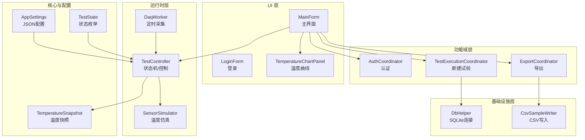
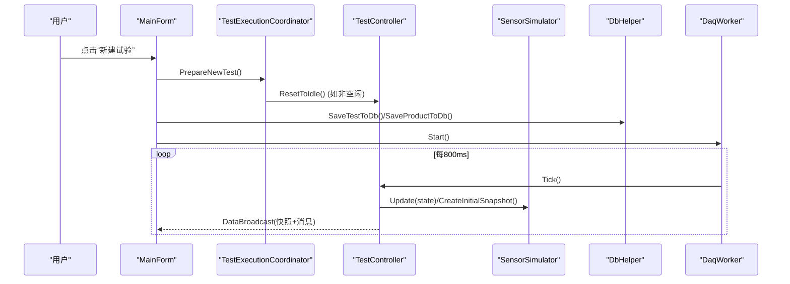
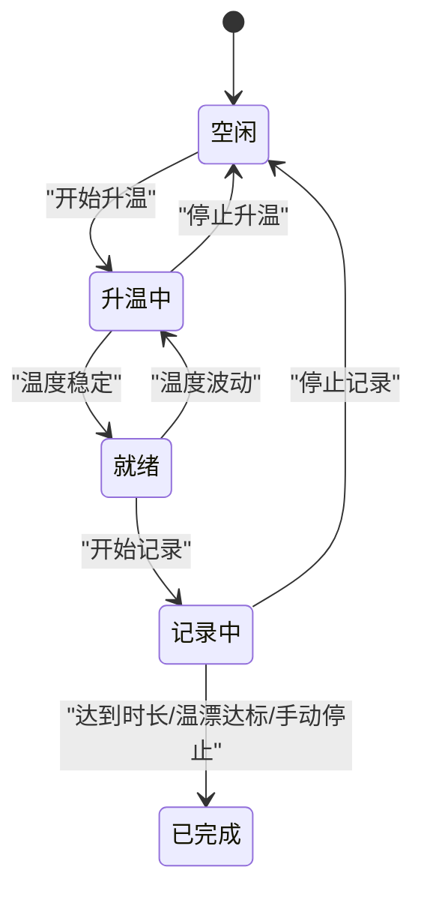
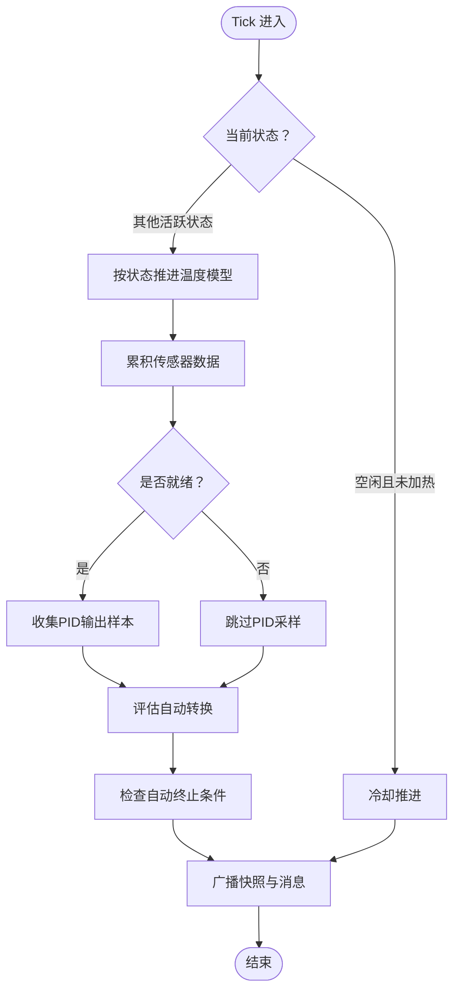
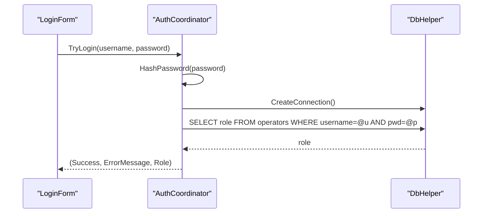
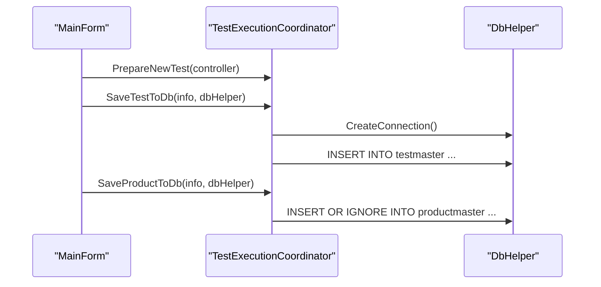
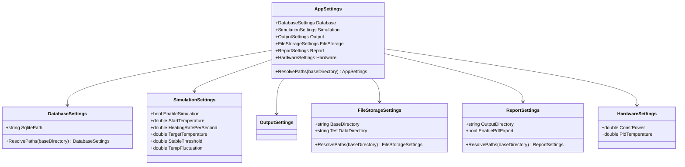
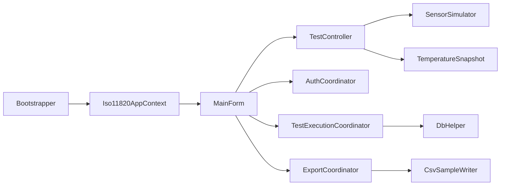

# 项目概述

<cite>
**本文引用的文件**   
- [Program.cs](file://src/ISO11820.App/Program.cs)
- [Bootstrapper.cs](file://src/ISO11820.App/App/Bootstrapper.cs)
- [Iso11820AppContext.cs](file://src/ISO11820.App/App/Iso11820AppContext.cs)
- [appsettings.json](file://src/ISO11820.App/appsettings.json)
- [TestController.cs](file://src/ISO11820.App/Runtime/Controller/TestController.cs)
- [DaqWorker.cs](file://src/ISO11820.App/Runtime/Services/DaqWorker.cs)
- [SensorSimulator.cs](file://src/ISO11820.App/Runtime/Services/SensorSimulator.cs)
- [MainForm.cs](file://src/ISO11820.App/UI/Forms/MainForm.cs)
- [AuthCoordinator.cs](file://src/ISO11820.App/Features/Auth/AuthCoordinator.cs)
- [TestExecutionCoordinator.cs](file://src/ISO11820.App/Features/TestExecution/TestExecutionCoordinator.cs)
- [DbHelper.cs](file://src/ISO11820.App/Infrastructure/Persistence/DbHelper.cs)
- [TemperatureSnapshot.cs](file://src/ISO11820.Core/Models/TemperatureSnapshot.cs)
- [TestState.cs](file://src/ISO11820.Core/Enums/TestState.cs)
</cite>

## 目录
1. [简介](#简介)
2. [项目结构](#项目结构)
3. [核心组件](#核心组件)
4. [架构总览](#架构总览)
5. [详细组件分析](#详细组件分析)
6. [依赖关系分析](#依赖关系分析)
7. [性能与稳定性](#性能与稳定性)
8. [故障排查指南](#故障排查指南)
9. [结论](#结论)
10. [附录](#附录)

## 简介
本项目为 ISO 11820 热失重分析仿真系统，是一款基于 .NET WinForms 的桌面应用程序，用于模拟和演示 ISO 11820 标准的热失重分析测试流程。系统通过软件方式模拟温度控制、稳定判定、数据采集与存储、报告导出等关键能力，帮助初学者理解标准流程，同时为有经验的开发者提供可验证的技术实现参考。

主要特性包括：
- 温度控制系统：模拟升温、稳定、记录阶段，支持参数动态调整与温漂计算
- 状态机管理：以“空闲/升温中/就绪/记录中/已完成”五态驱动业务流程
- 数据采集与存储：定时采集多通道温度数据，完成试验后自动落盘 CSV
- 报告生成：支持将曲线图嵌入 Excel/PDF 报告并导出
- 认证与会话：登录校验操作员身份，持久化试验元数据
- 配置管理：集中式 JSON 配置，路径解析与默认值回退

技术栈与设计模式：
- 技术栈：.NET 8、WinForms、SQLite、OxyPlot（图表）、Serilog（日志）、EPPlus（Excel）、MathNet.Numerics（线性回归）
- 设计模式：协调器模式（各功能域 Coordinator）、依赖注入（通过上下文容器装配）、状态机（TestState + TestController）、事件驱动（DataBroadcast）

## 项目结构
应用采用分层与按功能域划分的组织方式：
- UI 层：WinForms 主窗体、对话框、面板、图表控件
- 运行时层：控制器（状态机）、数据采集调度、传感器模拟器
- 功能域层：认证、校准、历史记录、试验执行、导出等协调器
- 基础设施层：数据库访问、CSV 写入、初始化
- 共享与核心：枚举、模型、事件定义

图示来源
- [MainForm.cs:1-800](file://src/ISO11820.App/UI/Forms/MainForm.cs#L1-L800)
- [DaqWorker.cs:1-50](file://src/ISO11820.App/Runtime/Services/DaqWorker.cs#L1-L50)
- [TestController.cs:1-328](file://src/ISO11820.App/Runtime/Controller/TestController.cs#L1-L328)
- [SensorSimulator.cs:1-223](file://src/ISO11820.App/Runtime/Services/SensorSimulator.cs#L1-L223)
- [AuthCoordinator.cs:1-62](file://src/ISO11820.App/Features/Auth/AuthCoordinator.cs#L1-L62)
- [TestExecutionCoordinator.cs:1-80](file://src/ISO11820.App/Features/TestExecution/TestExecutionCoordinator.cs#L1-L80)
- [DbHelper.cs:1-22](file://src/ISO11820.App/Infrastructure/Persistence/DbHelper.cs#L1-L22)
- [appsettings.json:1-29](file://src/ISO11820.App/appsettings.json#L1-L29)
- [TemperatureSnapshot.cs:1-10](file://src/ISO11820.Core/Models/TemperatureSnapshot.cs#L1-L10)
- [TestState.cs:1-11](file://src/ISO11820.Core/Enums/TestState.cs#L1-L11)

章节来源
- [Program.cs:1-25](file://src/ISO11820.App/Program.cs#L1-L25)
- [Bootstrapper.cs:1-66](file://src/ISO11820.App/App/Bootstrapper.cs#L1-L66)
- [Iso11820AppContext.cs:1-69](file://src/ISO11820.App/App/Iso11820AppContext.cs#L1-L69)
- [appsettings.json:1-29](file://src/ISO11820.App/appsettings.json#L1-L29)

## 核心组件
- 启动与装配
  - Program 负责初始化 WinForms 环境、创建应用上下文、运行主窗体，并在退出时关闭日志
  - Bootstrapper 负责加载配置、初始化日志、设置 EPPlus 许可证、构建各服务与协调器、确保数据库存在，最终返回统一的应用上下文
  - Iso11820AppContext 作为依赖注入容器，向 UI 暴露所需的服务与协调器

- 运行时控制
  - TestController 是状态机核心，维护当前状态、消息队列、PID 输出采样、传感器数据缓冲，并提供用户操作入口（开始/停止升温、开始/停止记录、复位、更新仿真参数）
  - DaqWorker 使用定时器每 800ms 触发一次 Tick，驱动状态机推进与数据广播
  - SensorSimulator 模拟炉温、表面温、中心温、校准温等通道，支持稳定判定、温漂线性回归、冷却过程与 PID 输出估算

- 数据与持久化
  - DbHelper 封装 SQLite 连接字符串与连接创建
  - TestExecutionCoordinator 负责新建试验时将试验与产品信息写入 testmaster/productmaster 表
  - 试验完成后由 UI 调用导出协调器保存传感器数据到 CSV

- 认证与配置
  - AuthCoordinator 对用户名密码进行 SHA256 哈希后查询 operators 表进行登录校验
  - AppSettings 从 appsettings.json 加载配置，支持相对路径解析与默认值回退

章节来源
- [Program.cs:1-25](file://src/ISO11820.App/Program.cs#L1-L25)
- [Bootstrapper.cs:1-66](file://src/ISO11820.App/App/Bootstrapper.cs#L1-L66)
- [Iso11820AppContext.cs:1-69](file://src/ISO11820.App/App/Iso11820AppContext.cs#L1-L69)
- [TestController.cs:1-328](file://src/ISO11820.App/Runtime/Controller/TestController.cs#L1-L328)
- [DaqWorker.cs:1-50](file://src/ISO11820.App/Runtime/Services/DaqWorker.cs#L1-L50)
- [SensorSimulator.cs:1-223](file://src/ISO11820.App/Runtime/Services/SensorSimulator.cs#L1-L223)
- [DbHelper.cs:1-22](file://src/ISO11820.App/Infrastructure/Persistence/DbHelper.cs#L1-L22)
- [TestExecutionCoordinator.cs:1-80](file://src/ISO11820.App/Features/TestExecution/TestExecutionCoordinator.cs#L1-L80)
- [AuthCoordinator.cs:1-62](file://src/ISO11820.App/Features/Auth/AuthCoordinator.cs#L1-L62)
- [appsettings.json:1-29](file://src/ISO11820.App/appsettings.json#L1-L29)

## 架构总览
系统采用“UI 层 — 协调器层 — 运行时层 — 基础设施层”的分层架构，配合“应用上下文”进行依赖装配。UI 仅负责展示与交互，业务编排由协调器完成，核心状态机与仿真逻辑集中在运行时层，数据访问与文件 I/O 下沉至基础设施层。

图示来源
- [MainForm.cs:1-800](file://src/ISO11820.App/UI/Forms/MainForm.cs#L1-L800)
- [TestExecutionCoordinator.cs:1-80](file://src/ISO11820.App/Features/TestExecution/TestExecutionCoordinator.cs#L1-L80)
- [TestController.cs:1-328](file://src/ISO11820.App/Runtime/Controller/TestController.cs#L1-L328)
- [SensorSimulator.cs:1-223](file://src/ISO11820.App/Runtime/Services/SensorSimulator.cs#L1-L223)
- [DbHelper.cs:1-22](file://src/ISO11820.App/Infrastructure/Persistence/DbHelper.cs#L1-L22)
- [DaqWorker.cs:1-50](file://src/ISO11820.App/Runtime/Services/DaqWorker.cs#L1-L50)

## 详细组件分析

### 状态机与控制流（TestController）
- 状态定义：空闲、升温中、就绪、记录中、已完成
- 用户动作：开始/停止升温、开始/停止记录、复位、更新仿真参数
- 自动转换：
  - 升温中 → 就绪：当温度在目标温度±阈值范围内持续若干周期
  - 就绪 → 升温中：温度波动超出稳定范围
  - 记录中 → 已完成：达到最大时长或满足提前终止条件（温漂阈值检查点）
- 数据广播：每次状态变化或 Tick 后构造 RuntimeSnapshot 并通过事件推送给 UI
- 辅助能力：PID 输出采样平均得到恒定功率；温度漂移通过最近 N 个样本线性回归计算

图示来源
- [TestState.cs:1-11](file://src/ISO11820.Core/Enums/TestState.cs#L1-L11)
- [TestController.cs:1-328](file://src/ISO11820.App/Runtime/Controller/TestController.cs#L1-L328)

章节来源
- [TestController.cs:1-328](file://src/ISO11820.App/Runtime/Controller/TestController.cs#L1-L328)
- [TestState.cs:1-11](file://src/ISO11820.Core/Enums/TestState.cs#L1-L11)

### 数据采集与仿真（DaqWorker + SensorSimulator）
- DaqWorker 使用 System.Timers.Timer 每 800ms 触发一次 Tick，保证 UI 线程与后台线程解耦
- SensorSimulator 根据当前状态推进温度模型：
  - 升温阶段：线性递增接近目标温度
  - 稳定阶段：钳位到目标温度附近并叠加噪声
  - 记录阶段：表面温与中心温指数逼近炉温
  - 冷却阶段：逐步回落至环境温度
- 温漂计算：使用 MathNet.Numerics 对最近 N 个炉温1样本做线性回归，得到 °C/s 斜率
- PID 输出估算：在就绪阶段采样并取均值，作为恒定功率近似

图示来源
- [DaqWorker.cs:1-50](file://src/ISO11820.App/Runtime/Services/DaqWorker.cs#L1-L50)
- [SensorSimulator.cs:1-223](file://src/ISO11820.App/Runtime/Services/SensorSimulator.cs#L1-L223)
- [TestController.cs:1-328](file://src/ISO11820.App/Runtime/Controller/TestController.cs#L1-L328)

章节来源
- [DaqWorker.cs:1-50](file://src/ISO11820.App/Runtime/Services/DaqWorker.cs#L1-L50)
- [SensorSimulator.cs:1-223](file://src/ISO11820.App/Runtime/Services/SensorSimulator.cs#L1-L223)
- [TestController.cs:1-328](file://src/ISO11820.App/Runtime/Controller/TestController.cs#L1-L328)

### 认证与会话（AuthCoordinator）
- 输入：用户名、明文密码
- 处理：SHA256 哈希密码，查询 operators 表匹配角色
- 输出：成功标志、错误信息、角色

图示来源
- [AuthCoordinator.cs:1-62](file://src/ISO11820.App/Features/Auth/AuthCoordinator.cs#L1-L62)
- [DbHelper.cs:1-22](file://src/ISO11820.App/Infrastructure/Persistence/DbHelper.cs#L1-L22)

章节来源
- [AuthCoordinator.cs:1-62](file://src/ISO11820.App/Features/Auth/AuthCoordinator.cs#L1-L62)

### 新建试验与数据持久化（TestExecutionCoordinator）
- 准备新试验：若控制器不在空闲状态则先复位
- 保存试验信息：插入 testmaster 表，包含样品编号、试验标识、日期、操作员、样品名称、规格、尺寸、预重、环境温湿度、备注等
- 保存产品信息：插入 productmaster 表，避免重复

图示来源
- [TestExecutionCoordinator.cs:1-80](file://src/ISO11820.App/Features/TestExecution/TestExecutionCoordinator.cs#L1-L80)
- [DbHelper.cs:1-22](file://src/ISO11820.App/Infrastructure/Persistence/DbHelper.cs#L1-L22)

章节来源
- [TestExecutionCoordinator.cs:1-80](file://src/ISO11820.App/Features/TestExecution/TestExecutionCoordinator.cs#L1-L80)

### 配置与路径解析（AppSettings）
- 从 appsettings.json 加载配置，支持相对路径解析为绝对路径
- 提供默认值与 ResolvePaths 方法，便于在不同运行目录下正确定位数据库、输出目录、报告目录等

图示来源
- [appsettings.json:1-29](file://src/ISO11820.App/appsettings.json#L1-L29)
- [AppSettings.cs](file://src/ISO11820.App/Config/AppSettings.cs)

章节来源
- [appsettings.json:1-29](file://src/ISO11820.App/appsettings.json#L1-L29)
- [AppSettings.cs](file://src/ISO11820.App/Config/AppSettings.cs)

### 数据模型（TemperatureSnapshot）
- 不可变记录类型，包含多个温度通道与已用秒数，用于跨层传递快照数据

章节来源
- [TemperatureSnapshot.cs:1-10](file://src/ISO11820.Core/Models/TemperatureSnapshot.cs#L1-L10)

## 依赖关系分析
- 装配与耦合
  - Bootstrapper 集中创建并组装所有服务与协调器，通过 Iso11820AppContext 暴露给 UI
  - UI 不直接依赖底层实现细节，而是通过协调器与控制器进行交互，降低耦合度
- 外部依赖
  - SQLite：通过 Microsoft.Data.Sqlite 访问
  - OxyPlot：用于温度曲线绘制（由 TemperatureChartPanel 使用）
  - Serilog：结构化日志
  - EPPlus：Excel 导出
  - MathNet.Numerics：线性回归计算温漂

图示来源
- [Bootstrapper.cs:1-66](file://src/ISO11820.App/App/Bootstrapper.cs#L1-L66)
- [Iso11820AppContext.cs:1-69](file://src/ISO11820.App/App/Iso11820AppContext.cs#L1-L69)
- [MainForm.cs:1-800](file://src/ISO11820.App/UI/Forms/MainForm.cs#L1-L800)
- [TestController.cs:1-328](file://src/ISO11820.App/Runtime/Controller/TestController.cs#L1-L328)
- [SensorSimulator.cs:1-223](file://src/ISO11820.App/Runtime/Services/SensorSimulator.cs#L1-L223)
- [DbHelper.cs:1-22](file://src/ISO11820.App/Infrastructure/Persistence/DbHelper.cs#L1-L22)

章节来源
- [Bootstrapper.cs:1-66](file://src/ISO11820.App/App/Bootstrapper.cs#L1-L66)
- [Iso11820AppContext.cs:1-69](file://src/ISO11820.App/App/Iso11820AppContext.cs#L1-L69)

## 性能与稳定性
- 定时采集间隔为 800ms，兼顾实时性与资源占用
- 状态机内部使用锁保护临界区，避免多线程竞争导致的数据不一致
- 温漂计算限制最近 N 个样本，避免内存增长与计算开销过大
- PID 输出采样窗口固定长度，防止队列无限增长
- UI 更新通过事件回调与 Invoke 机制确保线程安全

[本节为通用指导，无需具体文件引用]

## 故障排查指南
- 登录失败
  - 检查 operators 表中是否存在对应用户名与哈希密码
  - 确认密码哈希算法一致（SHA256）
- 无法保存试验信息
  - 检查 SQLite 数据库路径与权限
  - 核对 testmaster/productmaster 表结构与字段映射
- 曲线不刷新或显示异常
  - 查看 DataBroadcast 事件是否正常触发
  - 检查 UI 线程更新是否被 Invoke 正确封送
- 自动终止未生效
  - 核对记录时长与温漂阈值检查点逻辑
  - 确认 SensorSimulator 的 ElapsedSeconds 与 ComputeTemperatureDrift 返回值

章节来源
- [AuthCoordinator.cs:1-62](file://src/ISO11820.App/Features/Auth/AuthCoordinator.cs#L1-L62)
- [TestExecutionCoordinator.cs:1-80](file://src/ISO11820.App/Features/TestExecution/TestExecutionCoordinator.cs#L1-L80)
- [MainForm.cs:1-800](file://src/ISO11820.App/UI/Forms/MainForm.cs#L1-L800)
- [TestController.cs:1-328](file://src/ISO11820.App/Runtime/Controller/TestController.cs#L1-L328)
- [SensorSimulator.cs:1-223](file://src/ISO11820.App/Runtime/Services/SensorSimulator.cs#L1-L223)

## 结论
本系统以清晰的分层与协调器模式组织代码，将 UI、业务编排、运行时控制与基础设施解耦，提供了完整的 ISO 11820 热失重分析仿真体验。通过状态机驱动的流程、稳定的数据采集与温漂计算、以及完善的配置与持久化能力，既适合教学演示，也为后续扩展真实硬件集成奠定了良好基础。

[本节为总结性内容，无需具体文件引用]

## 附录
- 术语说明
  - 协调器：负责编排 UI 与后端服务的交互流程
  - 状态机：以有限状态描述业务流程，明确合法转换与触发条件
  - 快照：一次性读取的状态与数据集合，用于 UI 渲染与事件传播
- 建议实践
  - 新增功能优先通过协调器编排，保持控制器专注状态与仿真
  - 对外部依赖（数据库、文件系统）使用接口抽象，便于替换与测试
  - 关键路径增加日志与诊断输出，便于问题定位

[本节为概念性内容，无需具体文件引用]