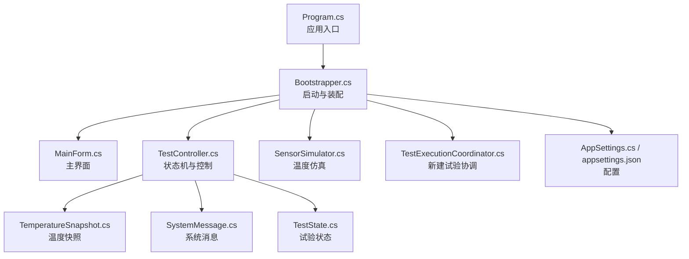
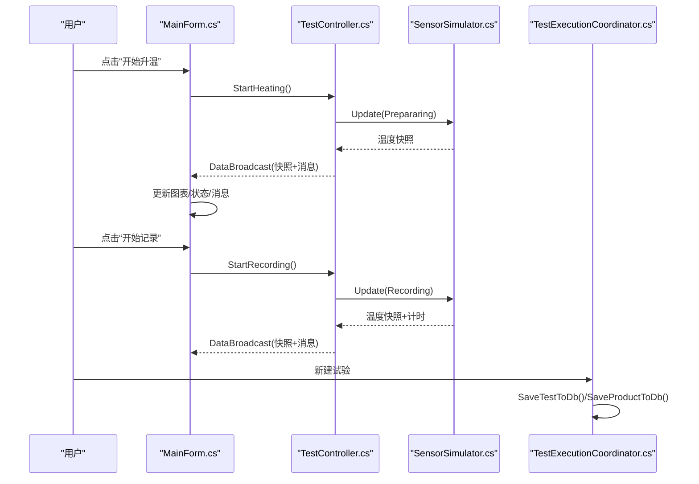
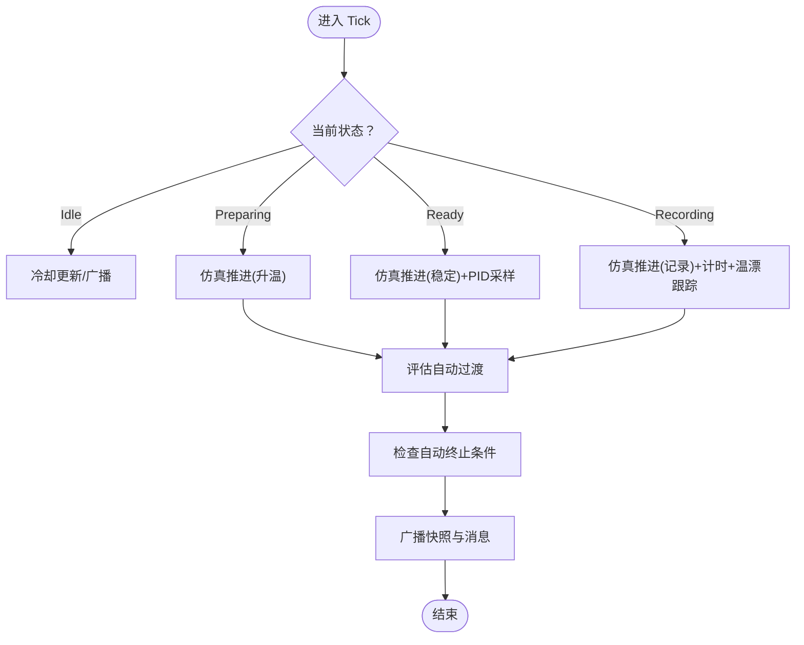
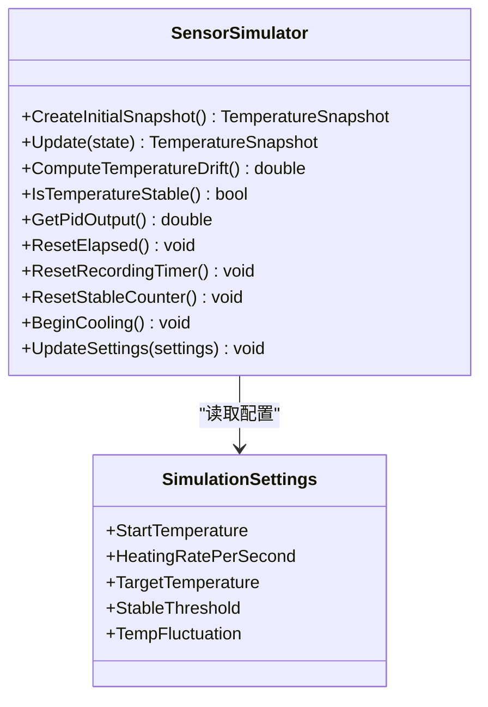
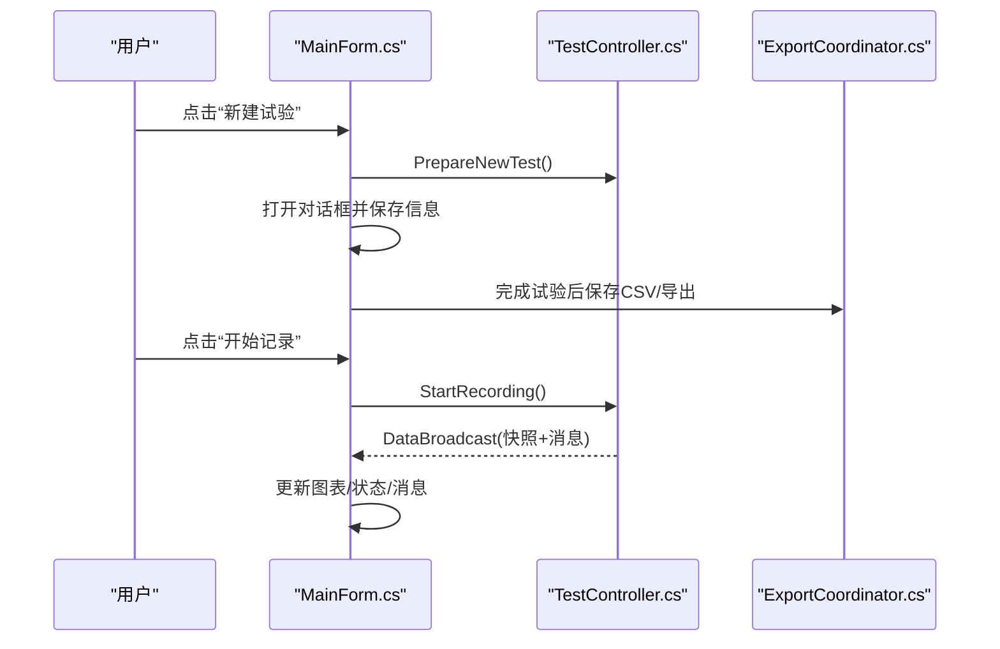
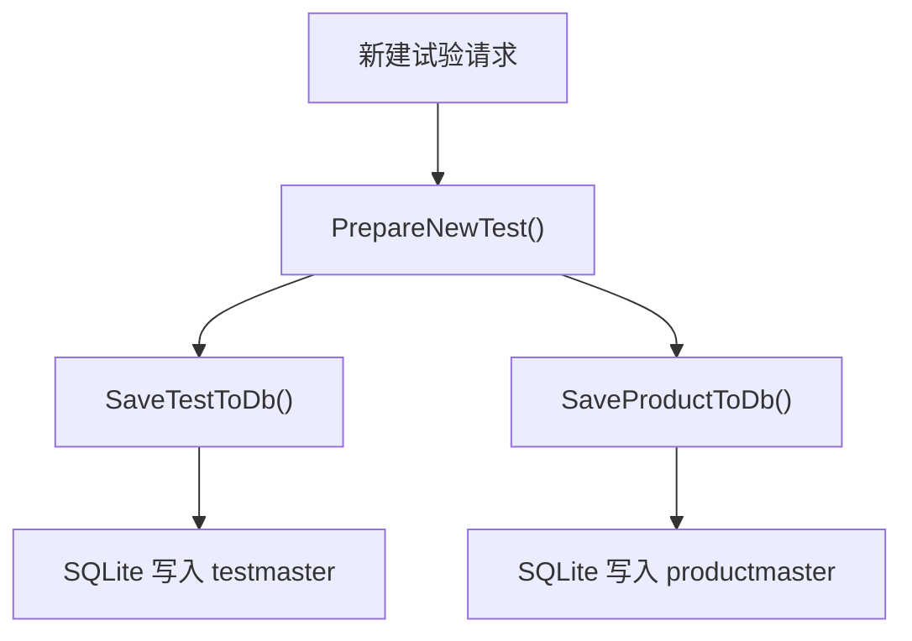
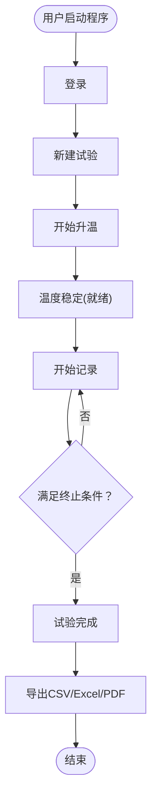
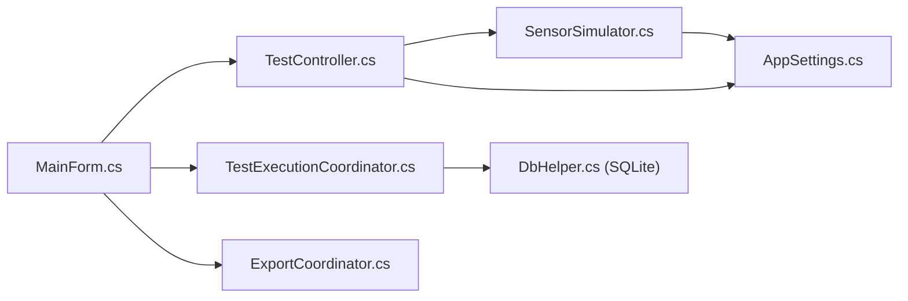

# 项目背景与目标

<cite>
**本文引用的文件**   
- [Program.cs](file://src/ISO11820.App/Program.cs)
- [Bootstrapper.cs](file://src/ISO11820.App/App/Bootstrapper.cs)
- [MainForm.cs](file://src/ISO11820.App/UI/Forms/MainForm.cs)
- [TestController.cs](file://src/ISO11820.App/Runtime/Controller/TestController.cs)
- [SensorSimulator.cs](file://src/ISO11820.App/Runtime/Services/SensorSimulator.cs)
- [TestExecutionCoordinator.cs](file://src/ISO11820.App/Features/TestExecution/TestExecutionCoordinator.cs)
- [AppSettings.cs](file://src/ISO11820.App/Config/AppSettings.cs)
- [appsettings.json](file://src/ISO11820.App/appsettings.json)
- [TemperatureSnapshot.cs](file://src/ISO11820.Core/Models/TemperatureSnapshot.cs)
- [SystemMessage.cs](file://src/ISO11820.Core/Models/SystemMessage.cs)
- [TestState.cs](file://src/ISO11820.Core/Enums/TestState.cs)
- [ParameterValidator.cs](file://src/ISO11820.App/UI/Common/ParameterValidator.cs)
- [TC06_Simulation.cs](file://tests/ISO11820.UI.Tests/Tests/TC06_Simulation.cs)
- [TC10_FullFlow.cs](file://tests/ISO11820.UI.Tests/Tests/TC10_FullFlow.cs)
</cite>

## 目录
1. [引言](#引言)
2. [项目结构](#项目结构)
3. [核心组件](#核心组件)
4. [架构总览](#架构总览)
5. [详细组件分析](#详细组件分析)
6. [依赖关系分析](#依赖关系分析)
7. [性能考量](#性能考量)
8. [故障排查指南](#故障排查指南)
9. [结论](#结论)
10. [附录](#附录)

## 引言
本项目面向 ISO 11820 热失重分析的仿真与演示，目标是提供一套完整的桌面应用程序，用于模拟和演示热失重分析测试流程。通过高保真的温度场仿真、状态机驱动的控制逻辑、可视化图表与数据导出能力，系统可用于教学演示、设备操作培训、算法验证与回归测试等场景。

- 科学背景与应用场景
  - ISO 11820 关注材料在受控升温条件下的质量变化行为，常用于评估材料的耐热性与热稳定性。稳定阶段的判定（如温度漂移阈值）是保证结果可比性的关键。
  - 本系统以“升温—稳定—记录—完成”为主线，复现实验室中常见的操作流程与判据，便于教学与培训。

- 解决的实际问题
  - 教学演示：为课堂与实验课提供可交互的仿真平台，直观展示升温曲线、稳定判据与自动终止条件。
  - 设备操作培训：在不依赖真实仪器的情况下，训练用户掌握标准操作流程与异常处理。
  - 算法验证：为温控策略、稳定判据与自动终止逻辑提供可重复的仿真环境，支持单元测试与端到端验收。

- 预期用户群体与价值
  - 研究人员：快速验证新算法与参数对稳定阶段与终止条件的影响。
  - 工程师：进行功能回归与集成测试，确保软件版本迭代质量。
  - 学生：理解标准流程、学习数据采集与报告生成方法。

- 愿景与发展路线图
  - 短期：完善 UI 交互、增强导出能力（Excel/PDF）、优化温漂计算与可视化。
  - 中期：扩展多通道传感器模型、引入更多判据与报告模板、支持批量试验管理。
  - 长期：对接真实采集硬件、构建云端数据管理与协作平台。

[本节不直接分析具体文件，故无“章节来源”]

## 项目结构
项目采用分层与特性化组织方式：
- 应用入口与启动引导：Program.cs 负责初始化 WinForms 并启动主窗体；Bootstrapper.cs 负责依赖注入、配置加载、数据库初始化与服务装配。
- 运行时控制与仿真：TestController.cs 实现状态机与广播机制；SensorSimulator.cs 实现温度场仿真与温漂计算。
- 特性协调器：TestExecutionCoordinator.cs 协调新建试验流程与持久化。
- UI 层：MainForm.cs 提供主界面、图表、按钮状态矩阵与消息面板。
- 配置与模型：AppSettings.cs 与 appsettings.json 提供运行期配置；Core 层定义通用枚举与数据快照。

**图示来源**
- [Program.cs:1-25](file://src/ISO11820.App/Program.cs#L1-L25)
- [Bootstrapper.cs:1-66](file://src/ISO11820.App/App/Bootstrapper.cs#L1-L66)
- [MainForm.cs:1-800](file://src/ISO11820.App/UI/Forms/MainForm.cs#L1-L800)
- [TestController.cs:1-328](file://src/ISO11820.App/Runtime/Controller/TestController.cs#L1-L328)
- [SensorSimulator.cs:1-223](file://src/ISO11820.App/Runtime/Services/SensorSimulator.cs#L1-L223)
- [TestExecutionCoordinator.cs:1-80](file://src/ISO11820.App/Features/TestExecution/TestExecutionCoordinator.cs#L1-L80)
- [AppSettings.cs:1-160](file://src/ISO11820.App/Config/AppSettings.cs#L1-L160)
- [appsettings.json:1-28](file://src/ISO11820.App/appsettings.json#L1-L28)
- [TemperatureSnapshot.cs:1-10](file://src/ISO11820.Core/Models/TemperatureSnapshot.cs#L1-L10)
- [SystemMessage.cs:1-4](file://src/ISO11820.Core/Models/SystemMessage.cs#L1-L4)
- [TestState.cs:1-11](file://src/ISO11820.Core/Enums/TestState.cs#L1-L11)

**章节来源**
- [Program.cs:1-25](file://src/ISO11820.App/Program.cs#L1-L25)
- [Bootstrapper.cs:1-66](file://src/ISO11820.App/App/Bootstrapper.cs#L1-L66)
- [MainForm.cs:1-800](file://src/ISO11820.App/UI/Forms/MainForm.cs#L1-L800)
- [AppSettings.cs:1-160](file://src/ISO11820.App/Config/AppSettings.cs#L1-L160)
- [appsettings.json:1-28](file://src/ISO11820.App/appsettings.json#L1-L28)

## 核心组件
- 应用启动与装配
  - Program.cs 初始化 WinForms 并创建 Bootstrapper，随后运行 MainForm。
  - Bootstrapper.cs 加载配置、初始化日志、数据库、CSV 写入、仿真器、控制器、采集线程与各特性协调器，最终返回应用上下文供 UI 使用。

- 运行时控制与仿真
  - TestController.cs 维护试验状态机（空闲、升温中、就绪、记录中、已完成），响应 UI 操作，定时 Tick 驱动仿真更新，并在达到条件时自动终止。
  - SensorSimulator.cs 基于配置参数推进温度场，计算温漂（线性回归），并提供 PID 输出模拟值。

- 试验执行协调
  - TestExecutionCoordinator.cs 负责新建试验时的准备与数据持久化（testmaster、productmaster）。

- 配置与模型
  - AppSettings.cs 与 appsettings.json 提供数据库路径、仿真参数、输出目录、报告设置与硬件相关常量。
  - Core 层提供 TemperatureSnapshot、SystemMessage、TestState 等基础类型。

**章节来源**
- [Program.cs:1-25](file://src/ISO11820.App/Program.cs#L1-L25)
- [Bootstrapper.cs:1-66](file://src/ISO11820.App/App/Bootstrapper.cs#L1-L66)
- [TestController.cs:1-328](file://src/ISO11820.App/Runtime/Controller/TestController.cs#L1-L328)
- [SensorSimulator.cs:1-223](file://src/ISO11820.App/Runtime/Services/SensorSimulator.cs#L1-L223)
- [TestExecutionCoordinator.cs:1-80](file://src/ISO11820.App/Features/TestExecution/TestExecutionCoordinator.cs#L1-L80)
- [AppSettings.cs:1-160](file://src/ISO11820.App/Config/AppSettings.cs#L1-L160)
- [appsettings.json:1-28](file://src/ISO11820.App/appsettings.json#L1-L28)
- [TemperatureSnapshot.cs:1-10](file://src/ISO11820.Core/Models/TemperatureSnapshot.cs#L1-L10)
- [SystemMessage.cs:1-4](file://src/ISO11820.Core/Models/SystemMessage.cs#L1-L4)
- [TestState.cs:1-11](file://src/ISO11820.Core/Enums/TestState.cs#L1-L11)

## 架构总览
系统采用“UI + 协调器 + 控制器 + 仿真器 + 配置/持久化”的分层架构。UI 仅负责展示与交互，核心状态机与仿真位于运行时层，协调器桥接 UI 与持久化，配置集中管理。

**图示来源**
- [MainForm.cs:1-800](file://src/ISO11820.App/UI/Forms/MainForm.cs#L1-L800)
- [TestController.cs:1-328](file://src/ISO11820.App/Runtime/Controller/TestController.cs#L1-L328)
- [SensorSimulator.cs:1-223](file://src/ISO11820.App/Runtime/Services/SensorSimulator.cs#L1-L223)
- [TestExecutionCoordinator.cs:1-80](file://src/ISO11820.App/Features/TestExecution/TestExecutionCoordinator.cs#L1-L80)

## 详细组件分析

### 组件A：TestController 状态机与自动终止
- 职责
  - 维护当前状态与快照，响应 UI 动作（开始/停止升温、开始/停止记录、复位）。
  - 每 800ms Tick 驱动仿真更新，累积传感器数据，评估自动过渡与自动终止。
- 关键逻辑
  - 自动过渡：从“升温中”到“就绪”，若“就绪”失稳则回退至“升温中”。
  - 自动终止：记录阶段在 60 分钟无条件结束；在 30/35/40/45/50/55 分钟检查点，若温漂 ≤ 0.5 °C/10min 则提前结束。
  - 广播：每次状态或快照变化后触发事件，UI 订阅并刷新显示。

**图示来源**
- [TestController.cs:1-328](file://src/ISO11820.App/Runtime/Controller/TestController.cs#L1-L328)
- [SensorSimulator.cs:1-223](file://src/ISO11820.App/Runtime/Services/SensorSimulator.cs#L1-L223)
- [TestState.cs:1-11](file://src/ISO11820.Core/Enums/TestState.cs#L1-L11)

**章节来源**
- [TestController.cs:1-328](file://src/ISO11820.App/Runtime/Controller/TestController.cs#L1-L328)
- [SensorSimulator.cs:1-223](file://src/ISO11820.App/Runtime/Services/SensorSimulator.cs#L1-L223)
- [TestState.cs:1-11](file://src/ISO11820.Core/Enums/TestState.cs#L1-L11)

### 组件B：SensorSimulator 温度场与温漂计算
- 职责
  - 根据配置参数推进炉温、表面温与中心温，模拟噪声与波动。
  - 使用最近 N 个采样点进行线性回归，计算温漂（°C/s），供 UI 显示与终止判断。
- 关键点
  - 稳定判定：目标温度 ± 稳定阈值范围内连续若干周期视为稳定。
  - 温漂计算：滑动窗口内时间-温度序列拟合直线斜率，乘以 600 得到 10 分钟漂移量。

**图示来源**
- [SensorSimulator.cs:1-223](file://src/ISO11820.App/Runtime/Services/SensorSimulator.cs#L1-L223)
- [AppSettings.cs:57-70](file://src/ISO11820.App/Config/AppSettings.cs#L57-L70)

**章节来源**
- [SensorSimulator.cs:1-223](file://src/ISO11820.App/Runtime/Services/SensorSimulator.cs#L1-L223)
- [AppSettings.cs:57-70](file://src/ISO11820.App/Config/AppSettings.cs#L57-L70)

### 组件C：UI 主界面与交互
- 职责
  - 展示状态、温度、图表与消息；管理按钮可用状态；处理登录、新建试验、参数设置与导出。
  - 订阅控制器广播，跨线程安全更新 UI。
- 关键点
  - 按钮状态矩阵由状态机驱动，避免非法操作。
  - 记录完成后自动保存传感器数据至 CSV，并支持导出 Excel/PDF。

**图示来源**
- [MainForm.cs:1-800](file://src/ISO11820.App/UI/Forms/MainForm.cs#L1-L800)
- [TestController.cs:1-328](file://src/ISO11820.App/Runtime/Controller/TestController.cs#L1-L328)

**章节来源**
- [MainForm.cs:1-800](file://src/ISO11820.App/UI/Forms/MainForm.cs#L1-L800)
- [TestController.cs:1-328](file://src/ISO11820.App/Runtime/Controller/TestController.cs#L1-L328)

### 组件D：试验执行协调与持久化
- 职责
  - 将试验信息与产品信息写入数据库表（testmaster、productmaster）。
  - 在 UI 发起新建试验前，确保控制器处于空闲状态。

**图示来源**
- [TestExecutionCoordinator.cs:1-80](file://src/ISO11820.App/Features/TestExecution/TestExecutionCoordinator.cs#L1-L80)

**章节来源**
- [TestExecutionCoordinator.cs:1-80](file://src/ISO11820.App/Features/TestExecution/TestExecutionCoordinator.cs#L1-L80)

### 概念性总览
下图展示了从用户操作到数据落盘的端到端流程，帮助非技术读者理解系统工作流。

[此图为概念流程图，未直接映射具体代码结构，故无“图示来源”]

## 依赖关系分析
- 内部依赖
  - UI 依赖控制器与协调器；控制器依赖仿真器；协调器依赖数据库助手与 CSV 写入。
  - 配置由 AppSettings 统一加载，仿真器与控制器均读取仿真参数。
- 外部依赖
  - SQLite 用于本地持久化；EPPlus 用于 Excel 导出；MathNet.Numerics 用于线性回归。

**图示来源**
- [MainForm.cs:1-800](file://src/ISO11820.App/UI/Forms/MainForm.cs#L1-L800)
- [TestController.cs:1-328](file://src/ISO11820.App/Runtime/Controller/TestController.cs#L1-L328)
- [SensorSimulator.cs:1-223](file://src/ISO11820.App/Runtime/Services/SensorSimulator.cs#L1-L223)
- [TestExecutionCoordinator.cs:1-80](file://src/ISO11820.App/Features/TestExecution/TestExecutionCoordinator.cs#L1-L80)
- [AppSettings.cs:1-160](file://src/ISO11820.App/Config/AppSettings.cs#L1-L160)

**章节来源**
- [MainForm.cs:1-800](file://src/ISO11820.App/UI/Forms/MainForm.cs#L1-L800)
- [TestController.cs:1-328](file://src/ISO11820.App/Runtime/Controller/TestController.cs#L1-L328)
- [SensorSimulator.cs:1-223](file://src/ISO11820.App/Runtime/Services/SensorSimulator.cs#L1-L223)
- [TestExecutionCoordinator.cs:1-80](file://src/ISO11820.App/Features/TestExecution/TestExecutionCoordinator.cs#L1-L80)
- [AppSettings.cs:1-160](file://src/ISO11820.App/Config/AppSettings.cs#L1-L160)

## 性能考量
- 采样周期与 CPU 占用
  - 定时器每 800ms 触发一次 Tick，仿真器与控制器计算轻量，CPU 占用低。
- 内存与缓冲
  - 控制器缓存传感器数据用于导出；温漂计算使用固定长度滑动窗口，避免无限增长。
- 磁盘 I/O
  - 仅在试验完成时写入 CSV，减少频繁 I/O 开销。
- 建议
  - 大数据量导出时考虑异步写入与分页渲染。
  - 图表绘制可采用增量更新与降采样策略。

[本节提供一般性指导，无需“章节来源”]

## 故障排查指南
- 常见问题定位
  - 登录失败：检查密码输入与角色选择；查看错误提示是否出现。
  - 按钮不可用：确认当前状态是否符合允许操作（例如“开始记录”需在“就绪”状态）。
  - 温度不变：确认仿真参数合理（升温速率、目标温度、波动范围）；检查是否处于 Idle 且未加热。
  - 自动终止未触发：核对温漂阈值与检查点逻辑；确认记录计时正常。
- 调试手段
  - 查看系统消息面板中的时间戳与消息内容。
  - 使用自动化测试用例辅助定位（见下节）。

**章节来源**
- [MainForm.cs:1-800](file://src/ISO11820.App/UI/Forms/MainForm.cs#L1-L800)
- [TestController.cs:1-328](file://src/ISO11820.App/Runtime/Controller/TestController.cs#L1-L328)

## 结论
本项目围绕 ISO 11820 热失重分析的核心流程，构建了可交互的仿真与演示系统。通过清晰的分层架构、稳健的状态机与高保真仿真，系统在教学质量、操作培训与算法验证方面具备显著价值。后续将持续完善导出能力、扩展传感器模型与报告模板，并探索与真实硬件的集成。

[本节为总结性内容，无需“章节来源”]

## 附录
- 参考验收测试
  - 仿真引擎 800ms 采集周期与温度递增验证
  - 完整演示流程（登录→新建试验→升温→稳定→记录→完成→导出）

**章节来源**
- [TC06_Simulation.cs:1-105](file://tests/ISO11820.UI.Tests/Tests/TC06_Simulation.cs#L1-L105)
- [TC10_FullFlow.cs:1-360](file://tests/ISO11820.UI.Tests/Tests/TC10_FullFlow.cs#L1-L360)